# Kubernetes Architecture

## The Complete Deep Dive from API Server to Pods, Networking, Storage, Scheduling, and Production Infrastructure

---

# Why This Exists

Most engineers learn Kubernetes by memorizing commands:

```bash
kubectl get pods
kubectl get nodes
kubectl apply -f deployment.yaml
```

This creates Kubernetes operators.

Not Kubernetes engineers.

To become a Kubernetes engineer, you must understand:

```text
Why Kubernetes exists

What problems it solves

How the control plane works

How scheduling works

How networking works

How storage works

How Linux powers everything underneath
```

Kubernetes is not a container platform.

Kubernetes is a:

```text
Distributed Operating System
for Infrastructure
```

---

# The Core Mental Model

Think about Linux.

Linux manages:

```text
CPU

Memory

Storage

Processes
```

on a single machine.

Kubernetes manages:

```text
Nodes

Pods

Storage

Networking
```

across hundreds or thousands of machines.

---

# Linux vs Kubernetes

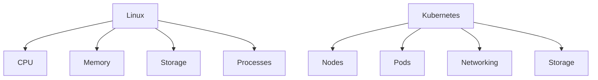

---

# Kubernetes Architecture Overview

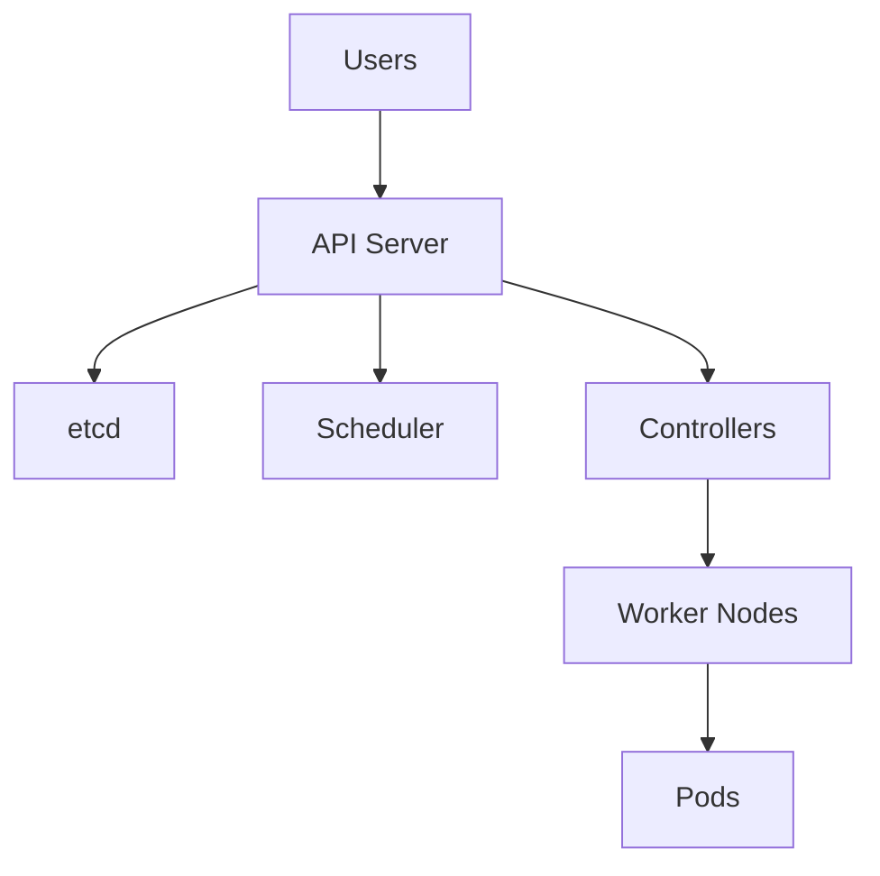

---

# High-Level Cluster Architecture

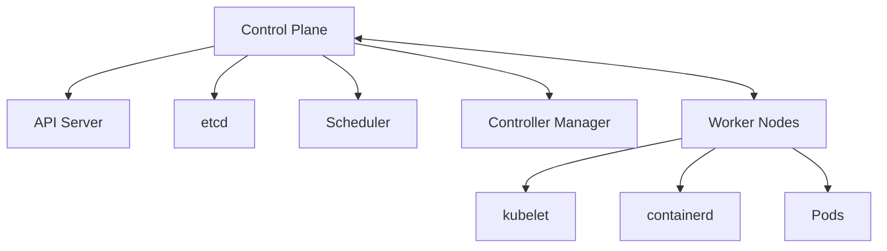

---

# The Big Picture

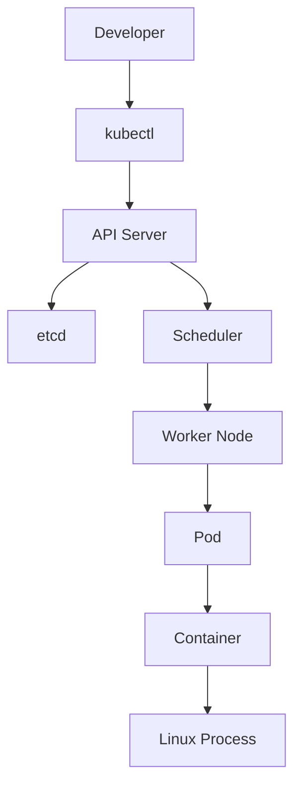

---

# Kubernetes Philosophy

Kubernetes is declarative.

You tell Kubernetes:

```text
What you want.
```

Kubernetes figures out:

```text
How to make it happen.
```

---

# Declarative Model

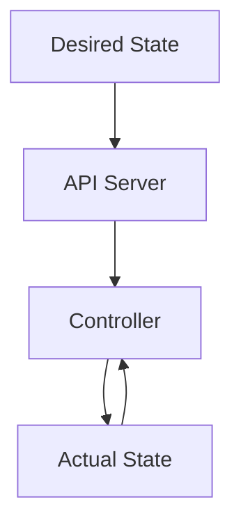

---

# Kubernetes Control Plane

The brain of the cluster.

---

# Control Plane Components

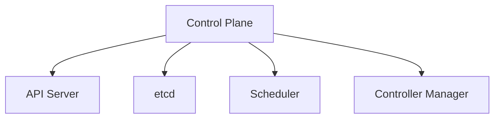

---

# API Server

The front door of Kubernetes.

Everything goes through:

```text
kube-apiserver
```

---

# API Server Responsibilities

```text
Authentication

Authorization

Validation

Persistence

API Exposure
```

---

# API Server Architecture

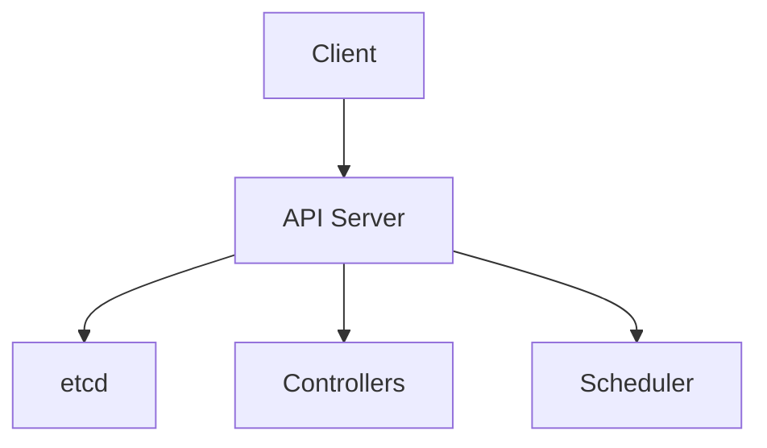

---

# Request Lifecycle

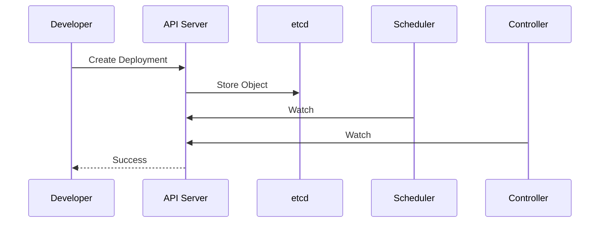

---

# etcd

The cluster database.

---

# What etcd Stores

```text
Pods

Deployments

Services

Secrets

ConfigMaps

Cluster State
```

---

# etcd Architecture

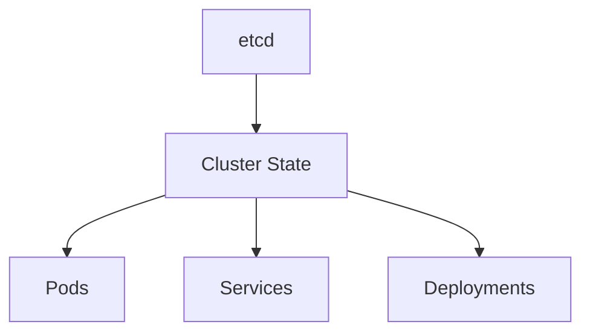

---

# Why etcd Matters

Without etcd:

```text
No Cluster State

No Scheduling

No Recovery
```

---

# Scheduler

The scheduler answers:

```text
Which node should run this Pod?
```

---

# Scheduler Architecture

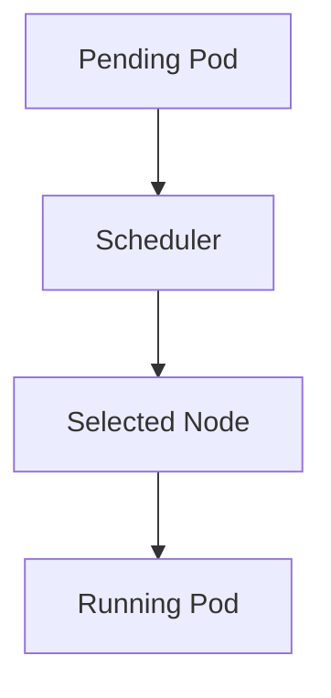

---

# Scheduler Decision Factors

```text
CPU

Memory

Affinity

Anti-Affinity

Taints

Topology

Policies
```

---

# Scheduling Flow

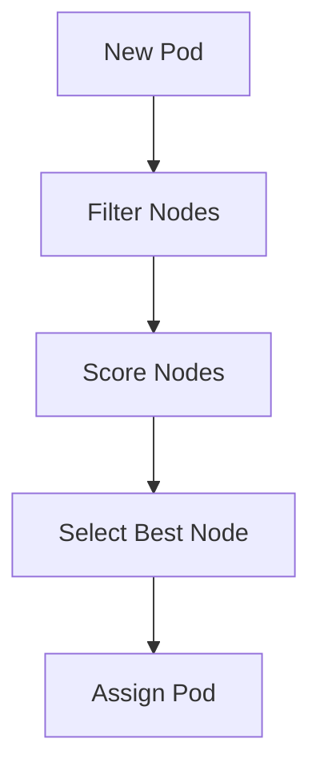

---

# Controller Manager

Controllers continuously reconcile state.

---

# Controller Loop

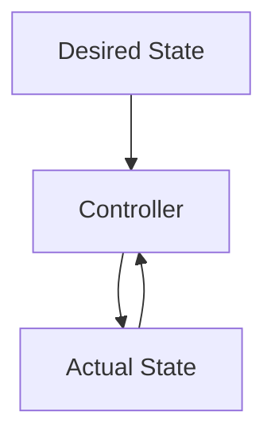

---

# Important Controllers

```text
Deployment Controller

ReplicaSet Controller

Node Controller

Job Controller

Endpoint Controller
```

---

# ReplicaSet Example

Desired:

```text
3 Pods
```

Actual:

```text
2 Pods
```

Controller action:

```text
Create 1 Pod
```

---

# Self-Healing

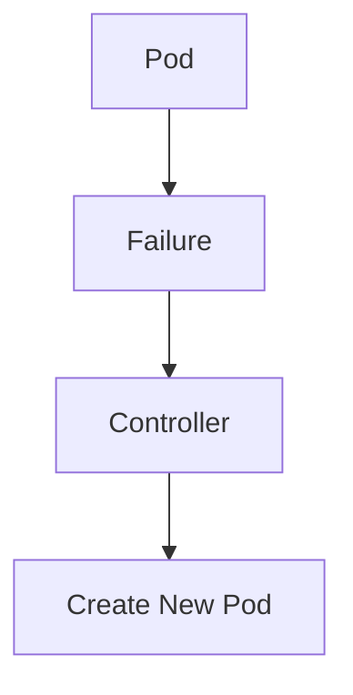

---

# Worker Nodes

A worker node is simply:

```text
Linux Server
```

running Kubernetes components.

---

# Node Architecture

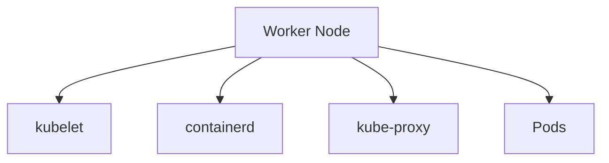

---

# kubelet

Node agent.

---

# kubelet Responsibilities

```text
Pod Creation

Health Monitoring

Container Lifecycle

Status Reporting
```

---

# kubelet Flow

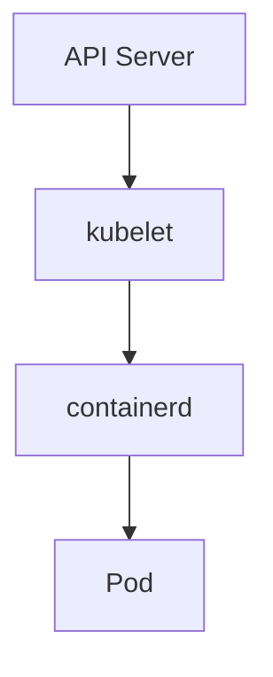

---

# Container Runtime

Most modern clusters use:

```text
containerd
```

---

# Runtime Architecture

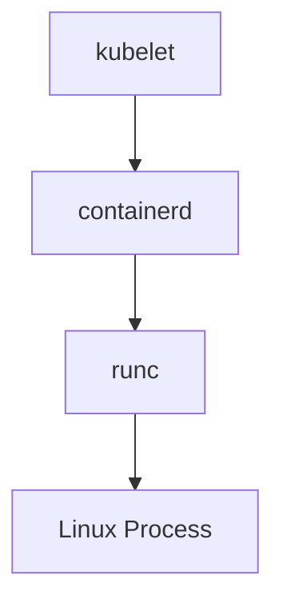

---

# Pod Architecture

The most important Kubernetes object.

---

# Pod Mental Model

Pod ≠ Container

Pod contains containers.

---

# Pod Architecture

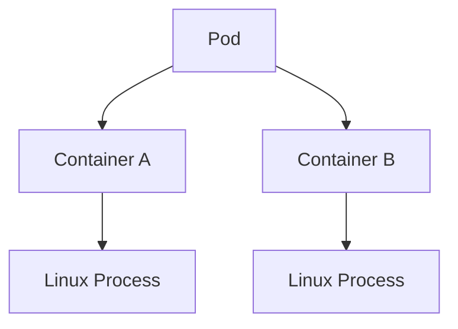

---

# Pod Namespace Architecture

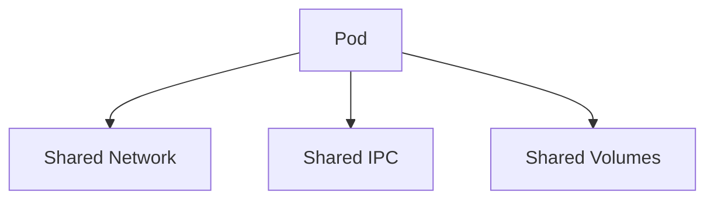

---

# Why localhost Works

Containers inside a Pod share:

```text
Network Namespace
```

Therefore:

```text
localhost works
```

between containers.

---

# Kubernetes Networking

One of Kubernetes' most revolutionary ideas:

> Every Pod gets an IP.

---

# Networking Model

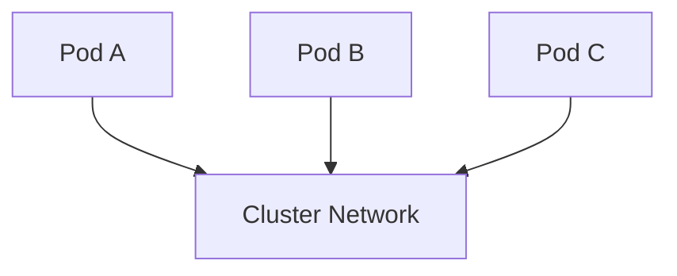

---

# Networking Requirements

Every Pod can communicate with every other Pod.

No NAT required between Pods.

---

# Networking Internals

Built using Linux:

```text
veth

Bridges

Routing

iptables

eBPF
```

---

# Pod Network Flow

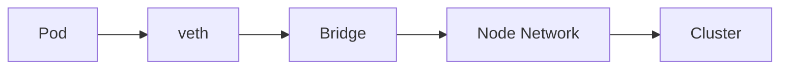

---

# Services

Pods are temporary.

Services provide stable networking.

---

# Service Architecture

```mermaid
graph TD

CLIENT["Client"]

CLIENT --> SERVICE["Service"]

SERVICE --> POD1["Pod A"]

SERVICE --> POD2["Pod B"]

SERVICE --> POD3["Pod C"]
```

---

# Service Types

```text
ClusterIP

NodePort

LoadBalancer

ExternalName
```

---

# kube-proxy

Implements Service networking.

---

# kube-proxy Architecture

```mermaid
graph TD

SERVICE["Service"]

SERVICE --> KPROXY["kube-proxy"]

KPROXY --> IPTABLES["iptables/IPVS"]

IPTABLES --> PODS["Pods"]
```

---

# Ingress

Controls external access.

---

# Ingress Architecture

```mermaid
graph TD

INTERNET["Internet"]

INTERNET --> INGRESS["Ingress"]

INGRESS --> SERVICE["Service"]

SERVICE --> POD["Pod"]
```

---

# Storage Architecture

Containers are ephemeral.

Persistent storage requires volumes.

---

# Storage Components

```text
PV

PVC

StorageClass

CSI
```

---

# Storage Architecture

```mermaid
graph TD

POD["Pod"]

POD --> PVC["PVC"]

PVC --> PV["PV"]

PV --> STORAGE["Storage Backend"]
```

---

# CSI

Container Storage Interface.

---

# CSI Architecture

```mermaid
graph TD

K8S["Kubernetes"]

K8S --> CSI["CSI Driver"]

CSI --> STORAGE["Storage System"]
```

---

# Security Architecture

Kubernetes security is layered.

---

# Security Layers

```mermaid
graph TD

USER["User"]

USER --> AUTH["Authentication"]

AUTH --> RBAC["RBAC"]

RBAC --> POD["Pod"]

POD --> NETWORK["Network Policies"]
```

---

# Security Components

```text
RBAC

Network Policies

Pod Security

Secrets

Service Accounts
```

---

# Resource Management

Resource limits become Linux cgroups.

---

# Resource Architecture

```mermaid
graph TD

POD["Pod"]

POD --> CPU["CPU Limit"]

POD --> MEM["Memory Limit"]

MEM --> CGROUP["cgroups"]
```

---

# OOM Kill Flow

```mermaid
flowchart TD

APP["Application"]

APP --> MEMORY["Memory Usage"]

MEMORY --> LIMIT["Limit"]

LIMIT --> OOM["OOM Kill"]
```

---

# Observability Architecture

```mermaid
graph TD

PODS["Pods"]

PODS --> METRICS["Metrics"]

PODS --> LOGS["Logs"]

PODS --> EVENTS["Events"]

METRICS --> GRAFANA["Grafana"]

LOGS --> LOKI["Loki"]
```

---

# Request Flow Through Kubernetes

```mermaid
flowchart LR

USER["User"]

USER --> INGRESS["Ingress"]

INGRESS --> SERVICE["Service"]

SERVICE --> POD["Pod"]

POD --> DATABASE["Database"]
```

---

# Complete Kubernetes Data Path

```mermaid
flowchart TD

CLIENT["Client"]

CLIENT --> LB["Load Balancer"]

LB --> INGRESS["Ingress"]

INGRESS --> SERVICE["Service"]

SERVICE --> POD["Pod"]

POD --> CONTAINER["Container"]

CONTAINER --> PROCESS["Linux Process"]
```

---

# Failure Recovery Flow

```mermaid
flowchart TD

POD["Pod"]

POD --> CRASH["Crash"]

CRASH --> KUBELET["kubelet"]

KUBELET --> API["API Server"]

API --> CONTROLLER["Controller"]

CONTROLLER --> NEWPOD["New Pod"]
```

---

# Cluster Lifecycle

```mermaid
stateDiagram-v2

Pending --> Scheduled

Scheduled --> Running

Running --> Failed

Failed --> Recreated
```

---

# Complete Kubernetes Architecture Map

```mermaid
mindmap
  root((Kubernetes))

    Control Plane
      API Server
      etcd
      Scheduler
      Controllers

    Nodes
      kubelet
      containerd
      kube-proxy

    Workloads
      Pods
      Deployments
      Jobs

    Networking
      Services
      Ingress
      CNI

    Storage
      PV
      PVC
      CSI

    Security
      RBAC
      Network Policies
      Secrets

    Observability
      Metrics
      Logs
      Events
```

---

# Common Production Failures

### Pending Pods

Usually:

```text
Insufficient Resources

Node Constraints

Affinity Rules
```

---

### CrashLoopBackOff

Usually:

```text
Application Crash

Configuration Error

Missing Dependency
```

---

### Service Not Reachable

Usually:

```text
Networking

Endpoints

DNS

Network Policy
```

---

### OOMKilled

Usually:

```text
Memory Limit Too Low
```

---

# Troubleshooting Flow

```mermaid
flowchart TD

PROBLEM["Problem"]

PROBLEM --> POD["Pod"]

POD --> NODE["Node"]

NODE --> NETWORK["Network"]

NETWORK --> STORAGE["Storage"]

STORAGE --> APPLICATION["Application"]
```

---

# Engineering Mindset

Beginners see:

```text
Pods

Deployments

Services
```

Engineers see:

```text
Desired State
        ↓
Controllers
        ↓
Scheduler
        ↓
Linux Nodes
        ↓
Containers
        ↓
Processes
```

Kubernetes is fundamentally:

```text
Distributed Systems
+
Linux
+
Automation
```

---

# Interview Questions

### What is Kubernetes?

### Why was Kubernetes created?

### What does the API Server do?

### What is etcd?

### How does scheduling work?

### What does kubelet do?

### What is containerd?

### What is a Pod?

### Why does every Pod get an IP?

### How do Services work?

### What is kube-proxy?

### What is CSI?

### What is CNI?

### How does Kubernetes self-heal?

### How do resource limits become cgroups?

### How does Kubernetes use Linux namespaces?

---

# One-Page Architecture Summary

```text
Developer
     ↓
API Server
     ↓
etcd
     ↓
Scheduler
     ↓
Controller
     ↓
Node
     ↓
kubelet
     ↓
containerd
     ↓
Pod
     ↓
Container
     ↓
Linux Process
```

---

# Final Takeaway

Kubernetes is not merely a container orchestrator.

It is a distributed operating system that manages infrastructure at scale.

Everything in Kubernetes ultimately depends on:

```text
Linux Processes

Namespaces

cgroups

Networking

Storage

Security
```

The deeper you understand Linux, the easier Kubernetes becomes.

Master Kubernetes architecture and you gain the ability to design, operate, troubleshoot, and scale modern cloud-native platforms from a single node to thousands of servers across multiple regions.
