# Linux Architecture

## The Master Diagram of the Linux Operating System

---

# Why This Exists

Most Linux learners study topics separately:

```text
Filesystem
Processes
Memory
Networking
Storage
Security
systemd
Containers
```

The problem is:

Linux does not work as separate topics.

Linux is a collection of interconnected systems.

Real engineers understand:

> How everything connects.

This file serves as the master architecture map for the entire Linux Engineering Handbook.

If someone understands every diagram in this file, they will have a strong mental model of how Linux actually works.

---

# The Linux Mental Model

Linux is fundamentally a resource management system.

Its primary responsibility is managing:

```text
CPU
Memory
Storage
Network
Devices
Processes
```

Everything else is built on top.

---

# Linux From 10,000 Feet

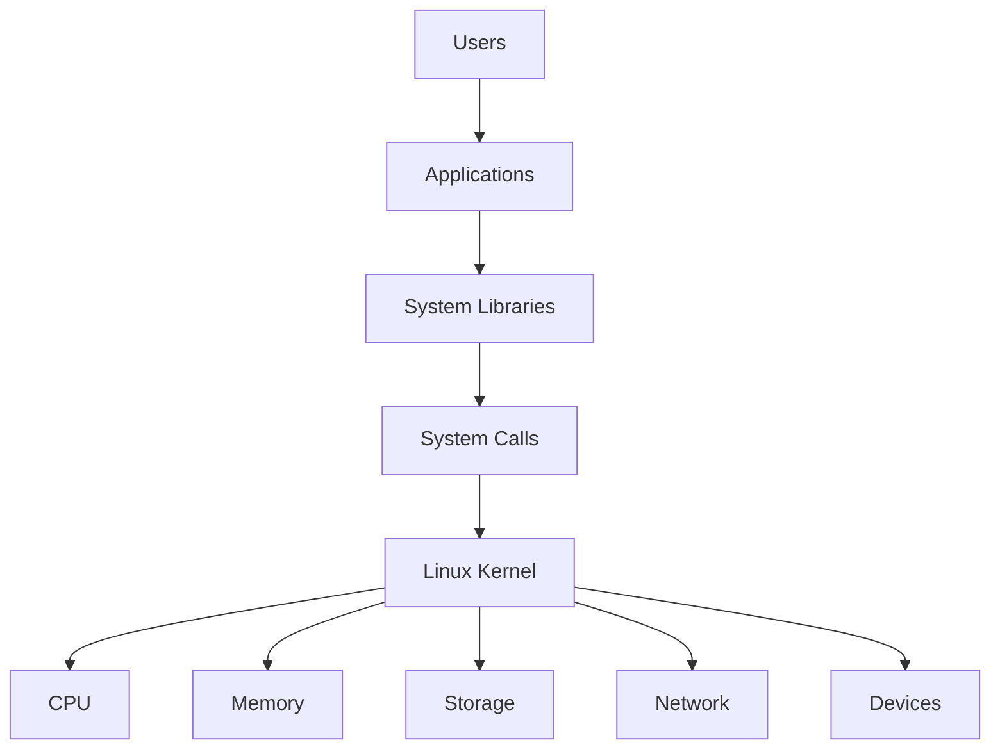

---

# Complete Linux Stack

```text
+--------------------------------------------------+
|                     Users                        |
+--------------------------------------------------+

+--------------------------------------------------+
| Applications (Nginx, PostgreSQL, Docker, Bash)  |
+--------------------------------------------------+

+--------------------------------------------------+
| System Libraries (glibc, OpenSSL, libc++)       |
+--------------------------------------------------+

+--------------------------------------------------+
| System Call Interface                            |
+--------------------------------------------------+

+--------------------------------------------------+
| Linux Kernel                                     |
+--------------------------------------------------+

| Scheduler | Memory | Network | VFS | Drivers |

+--------------------------------------------------+
| Hardware                                         |
+--------------------------------------------------+
```

---

# Linux Architecture Overview

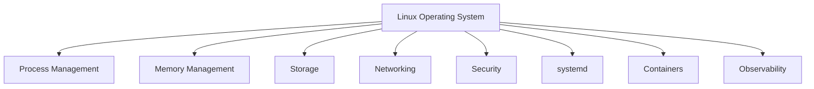

---

# Linux Boot Architecture

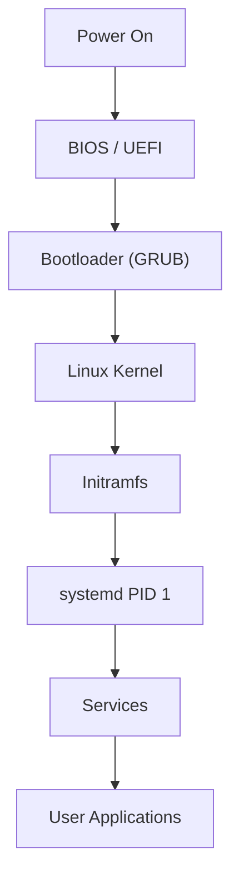

---

# Linux Startup Sequence

```text
Power On
   ↓
Firmware
   ↓
Bootloader
   ↓
Kernel
   ↓
Initramfs
   ↓
systemd
   ↓
Services
   ↓
Applications
```

---

# User Space vs Kernel Space

One of the most important Linux concepts.

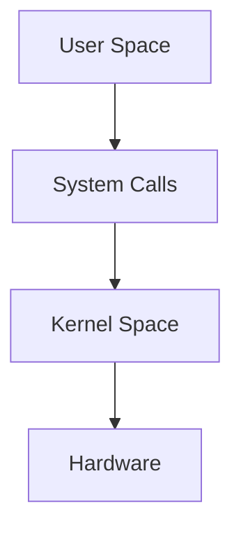

---

# User Space

Examples:

```text
Nginx
Docker
PostgreSQL
Python
Java
Node.js
Bash
```

Cannot directly access hardware.

---

# Kernel Space

Responsible for:

```text
CPU Scheduling
Memory Management
Networking
Filesystem Access
Device Control
Security
```

---

# Linux Kernel Architecture

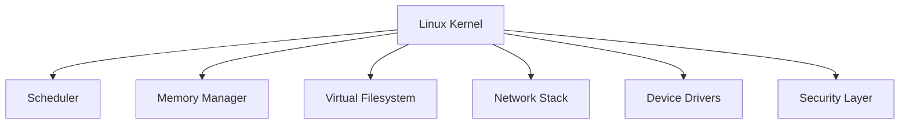

---

# Process Architecture

Everything running on Linux is a process.

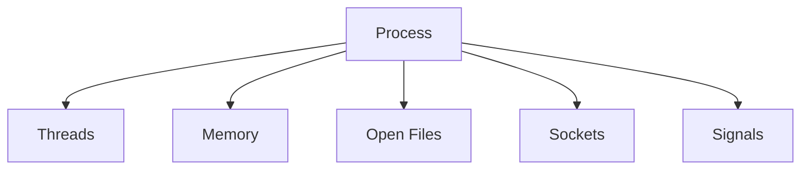

---

# Process Lifecycle

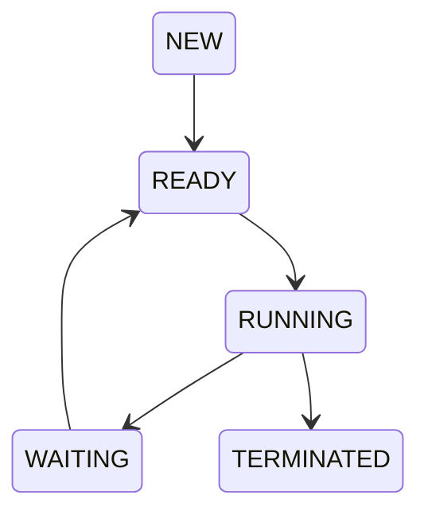

---

# Process Hierarchy

```text
systemd (PID 1)
|
├── sshd
│    └── bash
│         └── vim
│
├── nginx
│
├── postgres
│
└── docker
```

---

# Process Creation Flow

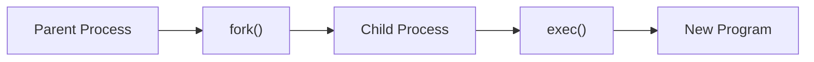

---

# Linux Scheduling Architecture

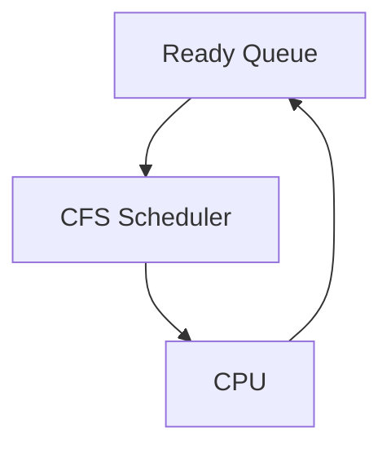

---

# CPU Scheduling Model

```text
Processes
     ↓
Ready Queue
     ↓
Scheduler
     ↓
CPU
     ↓
Context Switch
     ↓
Next Process
```

---

# Memory Architecture

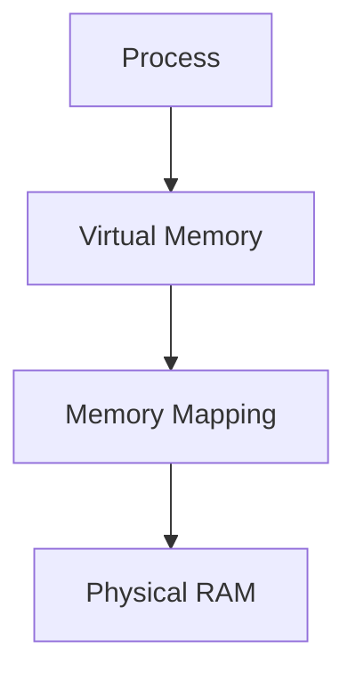

---

# Memory Layout

```text
+--------------------+
| Stack              |
+--------------------+
| Heap               |
+--------------------+
| Data Segment       |
+--------------------+
| Code Segment       |
+--------------------+
```

---

# Memory Management Architecture

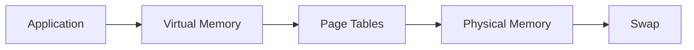

---

# Page Cache Architecture

Linux aggressively caches data.

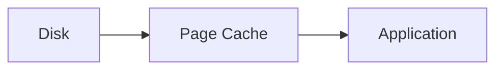

---

# Filesystem Architecture

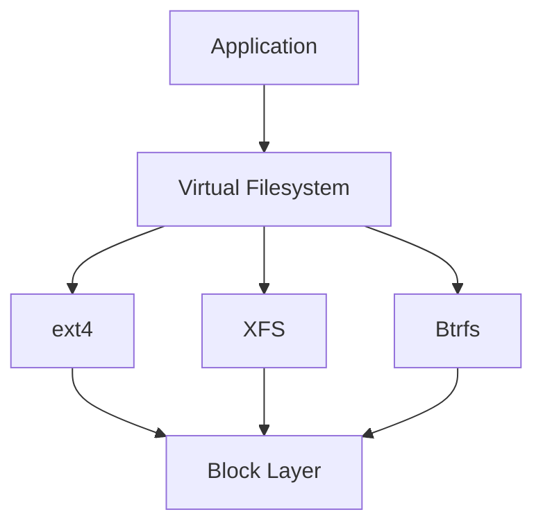

---

# Filesystem Internals

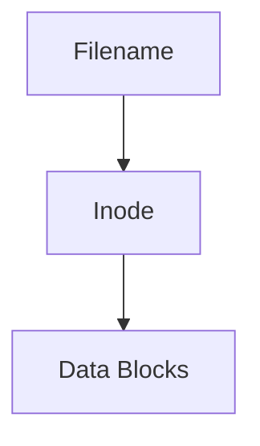

---

# File Read Path

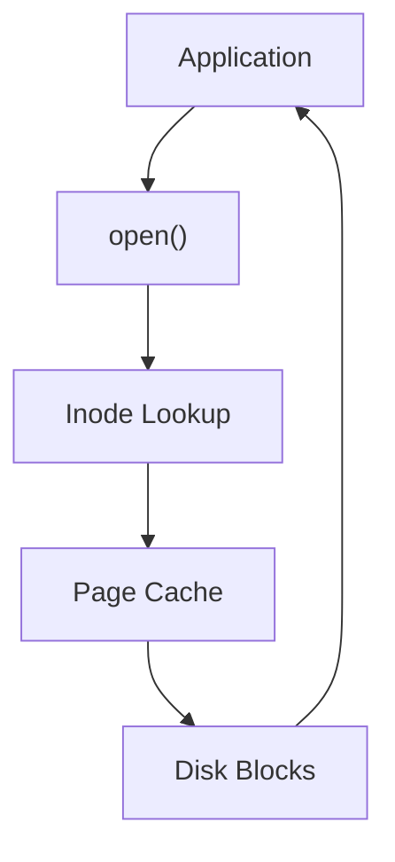

---

# Storage Architecture

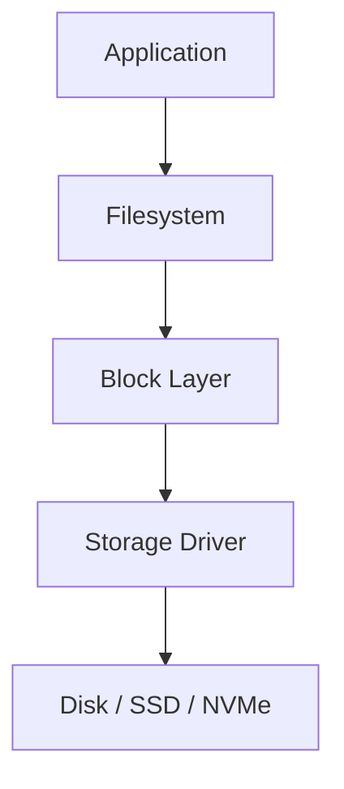

---

# Storage Stack

```text
Application
     ↓
Filesystem
     ↓
Block Layer
     ↓
Driver
     ↓
Storage Device
```

---

# Networking Architecture

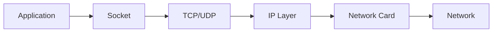

---

# Network Packet Flow

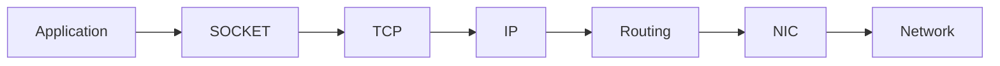

---

# TCP Connection Architecture

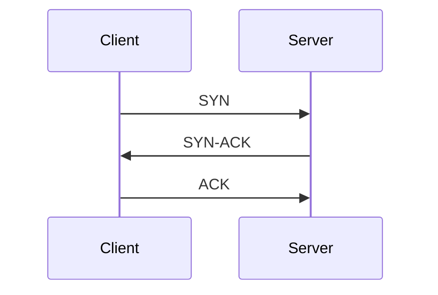

---

# DNS Resolution Flow

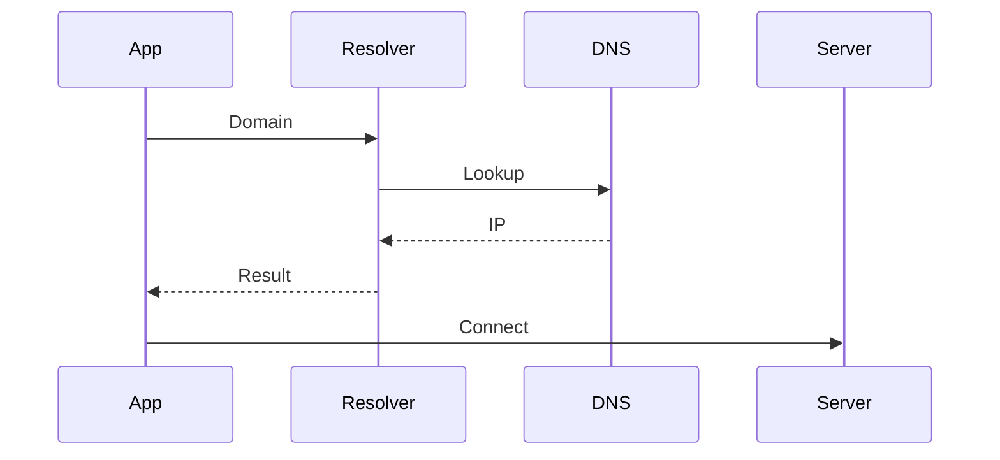

---

# Device Management Architecture

Linux treats devices as files.

```mermaid
graph TD

DEVICE["Hardware"]

DEVICE --> DRIVER["Driver"]

DRIVER --> DEV["/dev"]

DEV --> APP["Applications"]
```

---

# Interrupt Architecture

```mermaid
graph LR

DEVICE["Device"]

DEVICE --> IRQ["Interrupt"]

IRQ --> CPU["CPU"]

CPU --> KERNEL["Kernel Handler"]
```

---

# Linux Security Architecture

```mermaid
graph TD

USER["User"]

USER --> PERM["Permissions"]

PERM --> ACL["ACLs"]

ACL --> CAP["Capabilities"]

CAP --> SELINUX["SELinux/AppArmor"]
```

---

# Authentication Architecture

```mermaid
graph TD

LOGIN["Login"]

LOGIN --> PAM["PAM"]

PAM --> PASSWD["/etc/passwd"]

PAM --> SHADOW["/etc/shadow"]

PAM --> ACCESS["Access Decision"]
```

---

# systemd Architecture

```mermaid
graph TD

SYSTEMD["PID 1"]

SYSTEMD --> SERVICES["Services"]

SYSTEMD --> TIMERS["Timers"]

SYSTEMD --> SOCKETS["Sockets"]

SYSTEMD --> MOUNTS["Mounts"]

SYSTEMD --> LOGS["journald"]
```

---

# Linux Logging Architecture

```mermaid
graph LR

APPLICATION["Application"]

APPLICATION --> JOURNALD["journald"]

JOURNALD --> STORAGE["Log Storage"]

STORAGE --> JOURNALCTL["journalctl"]
```

---

# Linux Observability Architecture

```mermaid
graph TD

SYSTEM["Linux"]

SYSTEM --> LOGS["Logs"]

SYSTEM --> METRICS["Metrics"]

SYSTEM --> EVENTS["Events"]

SYSTEM --> TRACES["Tracing"]
```

---

# Container Architecture

Containers are Linux kernel features.

```mermaid
graph TD

CONTAINER["Container"]

CONTAINER --> NAMESPACE["Namespaces"]

CONTAINER --> CGROUP["cgroups"]

CONTAINER --> OVERLAY["OverlayFS"]
```

---

# Namespace Architecture

```mermaid
graph TD

HOST["Host"]

HOST --> PIDNS["PID Namespace"]

HOST --> NETNS["Network Namespace"]

HOST --> MOUNTNS["Mount Namespace"]

PIDNS --> CONTAINER["Container"]
```

---

# cgroup Architecture

```mermaid
graph TD

CGROUP["cgroup"]

CGROUP --> CPU["CPU Limit"]

CGROUP --> MEM["Memory Limit"]

CGROUP --> IO["I/O Limit"]
```

---

# Docker Architecture

```mermaid
graph TD

DOCKERCLI["Docker CLI"]

DOCKERCLI --> DOCKERD["dockerd"]

DOCKERD --> CONTAINERD["containerd"]

CONTAINERD --> RUNC["runc"]

RUNC --> CONTAINER["Container"]
```

---

# Kubernetes Foundation Architecture

```mermaid
graph TD

USER["User"]

USER --> API["API Server"]

API --> SCHED["Scheduler"]

API --> CONTROLLER["Controllers"]

SCHED --> NODE["Worker Node"]

NODE --> KUBELET["kubelet"]

KUBELET --> CONTAINER["Containers"]
```

---

# Cloud Infrastructure Architecture

```mermaid
graph TD

USER["Users"]

USER --> LB["Load Balancer"]

LB --> APP["Applications"]

APP --> CACHE["Cache"]

APP --> DB["Database"]

DB --> STORAGE["Persistent Storage"]
```

---

# Production Request Flow

A modern request typically follows:

```mermaid
flowchart LR

CLIENT["Client"]

CLIENT --> DNS

DNS --> LOADBALANCER["Load Balancer"]

LOADBALANCER --> APP["Application"]

APP --> CACHE["Redis"]

APP --> DB["Database"]

DB --> STORAGE["Storage"]
```

---

# Linux Troubleshooting Map

```mermaid
mindmap
  root((Troubleshooting))

    CPU
      top
      htop
      pidstat

    Memory
      free
      vmstat
      pmap

    Storage
      df
      du
      iostat

    Network
      ss
      tcpdump
      ip

    Services
      systemctl
      journalctl

    Containers
      docker
      kubectl
```

---

# The Universal Linux Data Flow

When a user requests a webpage:

```mermaid
flowchart TD

USER["User"]

USER --> DNS["DNS Lookup"]

DNS --> TCP["TCP Connection"]

TCP --> NGINX["Nginx"]

NGINX --> APP["Application"]

APP --> DB["Database"]

DB --> STORAGE["Disk"]

STORAGE --> DB

DB --> APP

APP --> NGINX

NGINX --> USER
```

---

# Linux Engineering Mind Map

```mermaid
mindmap
  root((Linux Engineering))

    Kernel
      Scheduling
      Memory
      Drivers

    Processes
      Threads
      Signals

    Filesystem
      Inodes
      VFS

    Storage
      RAID
      LVM

    Networking
      TCP
      DNS
      Routing

    Security
      Permissions
      Capabilities

    Containers
      Namespaces
      cgroups

    Kubernetes
      Pods
      Services

    Cloud
      Compute
      Storage
      Networking
```

---

# Final Takeaway

Linux is not a collection of commands.

Linux is a collection of interconnected subsystems:

```text
Processes
Memory
Storage
Filesystems
Networking
Security
systemd
Containers
Observability
```

Every production issue, cloud platform, container runtime, database, and distributed system eventually relies on these foundations.

Master the architecture, and every Linux topic becomes easier to understand because you can see where it fits in the larger system.
