# Linux Boot Process

## From Power Button to Production Services

---

# Why This Exists

Every Linux system begins with a boot process.

Whether it is:

```text
A Laptop
A Cloud VM
A Kubernetes Node
A Database Server
A Docker Host
A Supercomputer
```

all Linux systems must answer one question:

> How do we go from powered-off hardware to a fully functioning operating system?

Most engineers know:

```bash
reboot
shutdown
systemctl
```

Few understand:

```text
What happens after power is applied?

How is the kernel loaded?

Who starts systemd?

Who mounts filesystems?

Who starts networking?

Who starts applications?
```

Understanding the boot process is fundamental for:

* Linux Engineers
* DevOps Engineers
* Cloud Engineers
* SREs
* Platform Engineers
* Infrastructure Architects

---

# The Big Picture

Linux booting is a chain of responsibility.

Each stage loads the next stage.

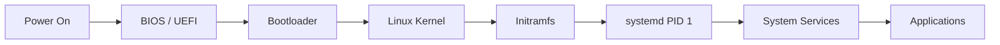

---

# The Boot Philosophy

Linux follows a simple principle:

```text
Each layer does one job

Then passes control
to the next layer
```

Example:

```text
Firmware
  ↓
Bootloader
  ↓
Kernel
  ↓
systemd
  ↓
Services
```

No layer does everything.

Every layer has a specific responsibility.

---

# Complete Linux Boot Architecture

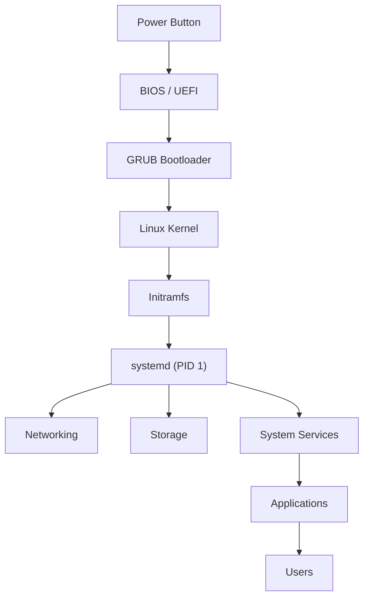

---

# Stage 1: Power On

Everything begins here.

```text
Electricity arrives
CPU starts executing instructions
Firmware takes control
```

---

# Hardware Initialization

Immediately after power-on:

```text
CPU
RAM
Storage Controllers
Network Cards
USB Controllers
PCI Devices
```

must be discovered.

---

# Hardware Discovery Flow

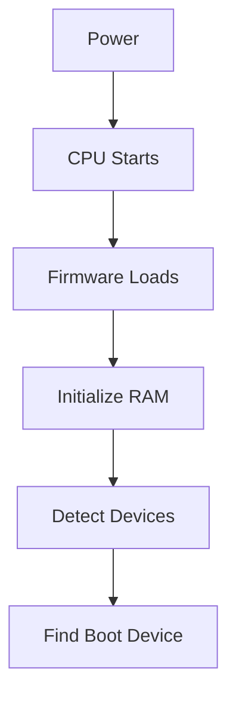

---

# Stage 2: BIOS / UEFI

Firmware is the first software that executes.

Two common types:

```text
BIOS
UEFI
```

Modern systems use:

```text
UEFI
```

---

# Firmware Responsibilities

Firmware must:

```text
Initialize Hardware

Run POST

Find Boot Device

Load Bootloader
```

---

# POST

Power-On Self Test.

Checks:

```text
CPU
RAM
Keyboard
Storage
Video
```

---

# Firmware Architecture

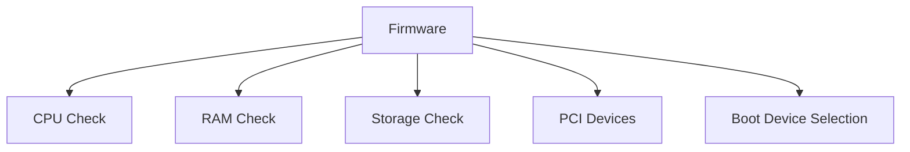

---

# Stage 3: Bootloader

The bootloader loads Linux.

Most common bootloader:

```text
GRUB2
```

Other examples:

```text
systemd-boot
LILO
U-Boot
```

---

# Why a Bootloader Exists

Firmware understands hardware.

Kernel understands Linux.

Something must bridge them.

That bridge is:

```text
Bootloader
```

---

# Bootloader Responsibilities

```text
Display Boot Menu

Load Kernel

Load Initramfs

Pass Kernel Parameters
```

---

# GRUB Architecture

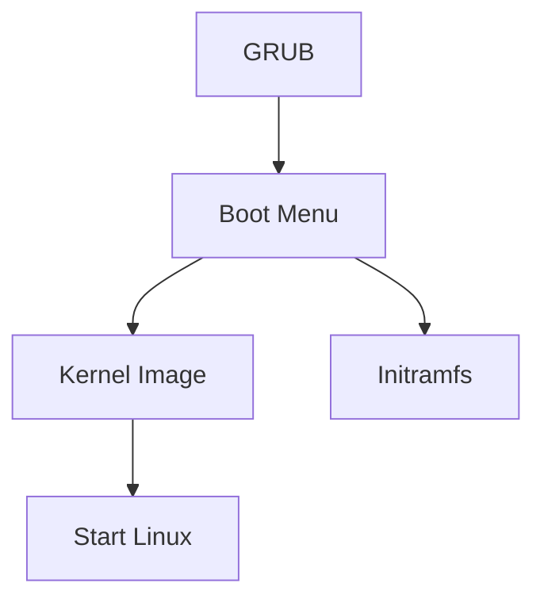

---

# GRUB Configuration

Typical file:

```bash
/etc/default/grub
```

Generate configuration:

```bash
grub-mkconfig -o /boot/grub/grub.cfg
```

---

# Stage 4: Linux Kernel

Bootloader loads:

```text
vmlinuz
```

The Linux kernel image.

Control transfers to the kernel.

---

# Kernel Responsibilities

```text
Initialize Memory

Initialize Scheduler

Initialize Drivers

Initialize Filesystems

Initialize Networking

Start First Process
```

---

# Kernel Startup Architecture

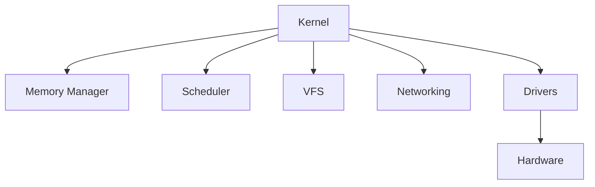

---

# Kernel Initialization Flow

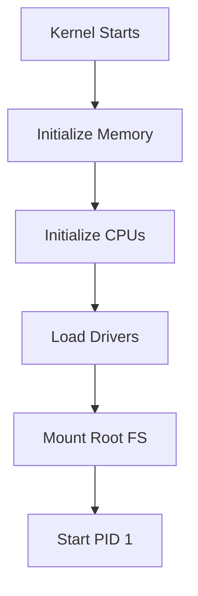

---

# Viewing Kernel Information

```bash
uname -a
```

Kernel logs:

```bash
dmesg
```

---

# Stage 5: Initramfs

One of the least understood stages.

Initramfs means:

```text
Initial RAM Filesystem
```

---

# Why Initramfs Exists

At boot time:

```text
Kernel loaded
Root filesystem not available yet
```

Problem:

```text
How can Linux mount a filesystem
before drivers are loaded?
```

Solution:

```text
Temporary filesystem in RAM
```

---

# Initramfs Architecture

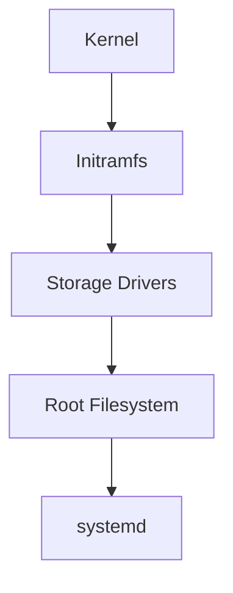

---

# Initramfs Responsibilities

```text
Load Storage Drivers

Load RAID Modules

Load LVM

Unlock Encrypted Disks

Mount Root Filesystem
```

---

# Production Example

Cloud VM boot:

```text
Kernel Starts
      ↓
NVMe Driver Loads
      ↓
Root Disk Found
      ↓
Filesystem Mounted
      ↓
Continue Boot
```

Without initramfs:

```text
Kernel cannot find root disk
```

Boot fails.

---

# Stage 6: Root Filesystem Mount

Kernel eventually discovers:

```text
/
```

The root filesystem.

---

# Root Filesystem Tree

```text
/

├── bin
├── boot
├── dev
├── etc
├── home
├── lib
├── proc
├── sys
├── tmp
├── usr
└── var
```

---

# Mount Process

```mermaid
flowchart LR

DISK[Disk]

DISK --> PARTITION[Partition]

PARTITION --> FILESYSTEM[Filesystem]

FILESYSTEM --> ROOT[/]
```

---

# Stage 7: PID 1

Once root filesystem exists:

Linux starts the first process.

```text
PID 1
```

Today:

```text
systemd
```

---

# Why PID 1 Is Special

Every process originates from PID 1.

```text
PID 1
 ├── sshd
 ├── nginx
 ├── postgres
 ├── docker
 └── kubelet
```

---

# PID Tree

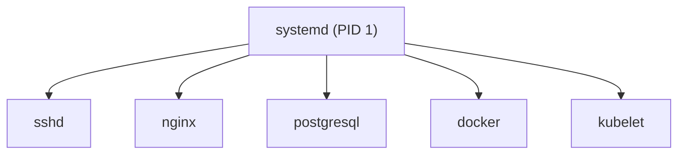

---

# Stage 8: systemd Initialization

systemd becomes the operating system manager.

---

# systemd Responsibilities

```text
Mount Filesystems

Start Services

Initialize Networking

Handle Logging

Manage Targets

Manage Dependencies
```

---

# systemd Architecture

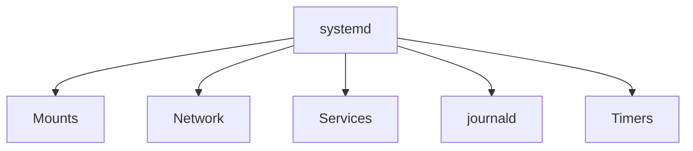

---

# Stage 9: Target Activation

systemd activates targets.

Equivalent to system states.

---

# Common Targets

```text
rescue.target

multi-user.target

graphical.target
```

---

# Target Hierarchy

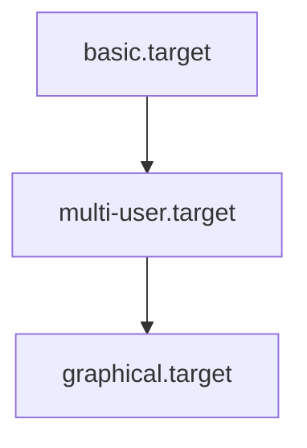

---

# Stage 10: Service Startup

systemd begins starting services.

Examples:

```text
NetworkManager

sshd

nginx

docker

postgresql

kubelet
```

---

# Dependency Graph

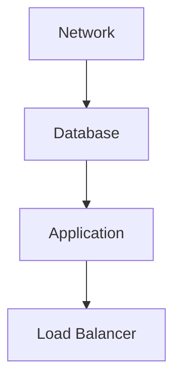

---

# Service Startup Flow

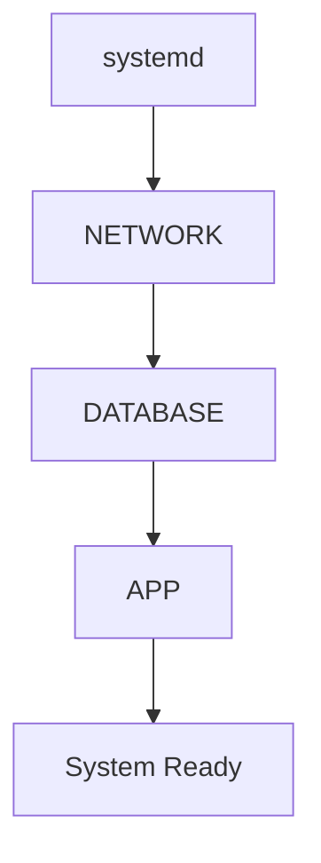

---

# Networking Startup

Typical flow:

```text
Driver Loads
      ↓
Interface Created
      ↓
IP Assigned
      ↓
Routes Added
      ↓
DNS Configured
```

---

# Network Boot Architecture

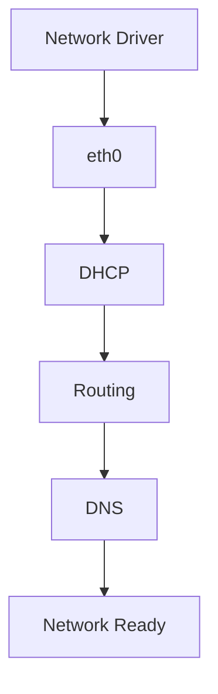

---

# Login Phase

System reaches operational state.

Users can now:

```text
SSH
Login
Run Applications
Access Services
```

---

# Complete Boot Timeline

```text
Power On
    ↓
Firmware
    ↓
Bootloader
    ↓
Kernel
    ↓
Initramfs
    ↓
Root Filesystem
    ↓
systemd
    ↓
Targets
    ↓
Services
    ↓
Users
```

---

# Viewing Boot Time

```bash
systemd-analyze
```

Example:

```text
Startup finished in 4.5s
```

---

# Slow Boot Analysis

View slow services:

```bash
systemd-analyze blame
```

---

# Critical Startup Chain

```bash
systemd-analyze critical-chain
```

---

# Boot Performance Architecture

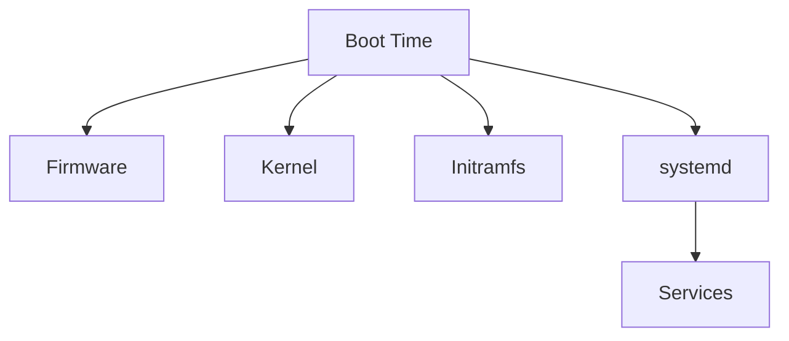

---

# Common Boot Failures

## Kernel Panic

```text
Kernel Cannot Continue
```

---

## Missing Root Filesystem

```text
Cannot mount root fs
```

---

## Broken Initramfs

```text
Storage drivers unavailable
```

---

## Corrupted GRUB

```text
Kernel never loads
```

---

## Failed systemd Service

```text
Boot succeeds
Application unavailable
```

---

# Boot Troubleshooting Flow

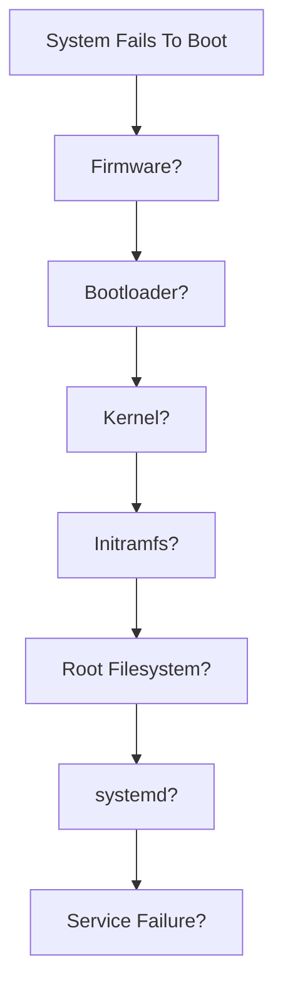

---

# Emergency Recovery Workflow

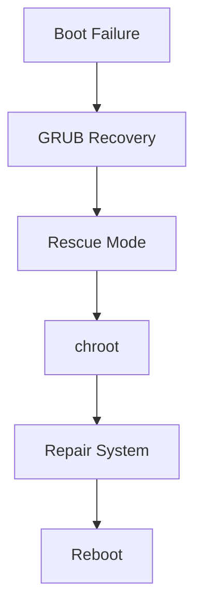

---

# Cloud Boot Process

AWS, Azure, and GCP follow the same fundamentals.

```text
Hypervisor
      ↓
Virtual Firmware
      ↓
Bootloader
      ↓
Kernel
      ↓
systemd
      ↓
Cloud Services
```

---

# Kubernetes Node Boot

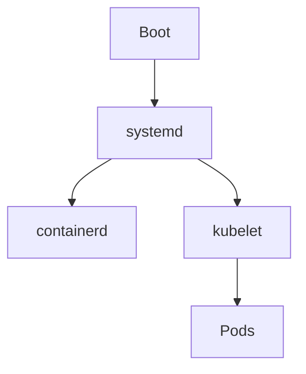

---

# Linux Boot and Containers

Containers do not normally execute the full boot process.

A container often starts with:

```text
Application
```

instead of:

```text
Firmware
→ Kernel
→ systemd
→ Services
```

because containers share the host kernel.

---

# Engineering Mindset

Beginners see:

```text
Power On
System Works
```

Engineers see:

```text
Firmware
Bootloader
Kernel
Drivers
Initramfs
Filesystem
systemd
Services
Networking
Applications
```

Understanding these layers makes boot failures predictable and debuggable.

---

# Interview Questions

### What happens when Linux boots?

### What is BIOS?

### What is UEFI?

### What is GRUB?

### Why is a bootloader needed?

### What is vmlinuz?

### What is initramfs?

### Why is initramfs required?

### What is PID 1?

### Why is systemd important?

### What is a target?

### How do you troubleshoot slow boots?

### What causes kernel panics?

### How does Linux find the root filesystem?

### How is a cloud VM boot process different?

---

# Boot Process Cheat Sheet

```bash
# Kernel
uname -a

# Kernel Logs
dmesg

# Boot Logs
journalctl -b

# Previous Boot
journalctl -b -1

# Startup Time
systemd-analyze

# Slow Services
systemd-analyze blame

# Dependency Chain
systemd-analyze critical-chain

# Failed Services
systemctl --failed

# Boot Target
systemctl get-default
```

---

# Final Takeaway

The Linux boot process is a carefully orchestrated sequence:

```text
Power
  ↓
Firmware
  ↓
Bootloader
  ↓
Kernel
  ↓
Initramfs
  ↓
Root Filesystem
  ↓
systemd
  ↓
Services
  ↓
Applications
```

Every Linux server, cloud VM, Kubernetes node, database server, and production platform follows this journey.

Master the boot process, and you gain the ability to understand, troubleshoot, recover, and design Linux systems from the very first CPU instruction to the final running application.
