# Linux Container Architecture

## From Namespaces and cgroups to Docker, Kubernetes, and Modern Cloud Infrastructure

---

# Why This Exists

Containers changed software engineering.

Before containers:

```text
Developer Machine
        ≠
Testing Environment
        ≠
Production Environment
```

Teams constantly heard:

```text
"It works on my machine."
```

Containers solved this problem by packaging:

```text
Application
+
Dependencies
+
Runtime
+
Configuration
```

into a portable unit.

However, one of the biggest misconceptions in technology is:

> Containers are not virtual machines.

Containers are fundamentally Linux kernel features.

Understanding container architecture is essential for:

* Linux Engineers
* Backend Engineers
* DevOps Engineers
* Cloud Engineers
* SREs
* Platform Engineers
* Kubernetes Engineers
* Infrastructure Architects

---

# The Container Mental Model

Most beginners think:

```text
Container
     ↓
Mini Virtual Machine
```

Wrong.

Reality:

```text
Container
     ↓
Isolated Linux Process
```

Containers share the host kernel.

Think of a container as:

```text
A private apartment
inside a shared building.
```

Each apartment appears independent.

But all apartments share:

```text
Foundation
Electricity
Water
Building Structure
```

Likewise containers share:

```text
Linux Kernel
```

---

# The Big Picture

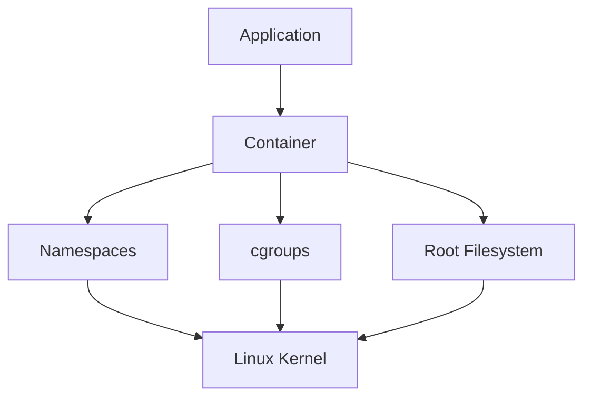

---

# Container Architecture Overview

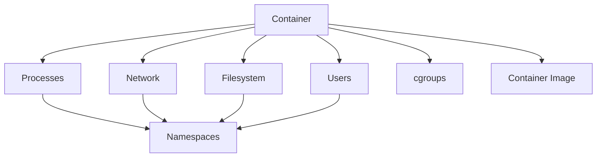

---

# Containers Are Linux Features

Containers are built from:

```text
Namespaces
cgroups
Capabilities
seccomp
OverlayFS
Virtual Ethernet
```

There is no:

```text
Container Magic
```

Only Linux primitives.

---

# Traditional Server Architecture

Before containers:

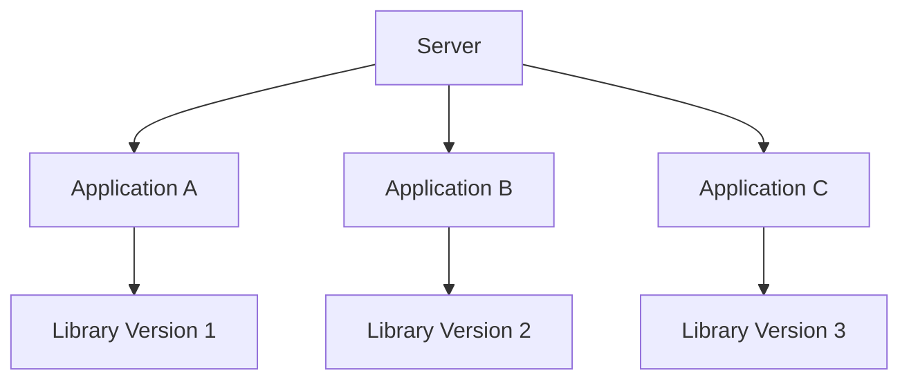

Dependency conflicts become common.

---

# Containerized Architecture

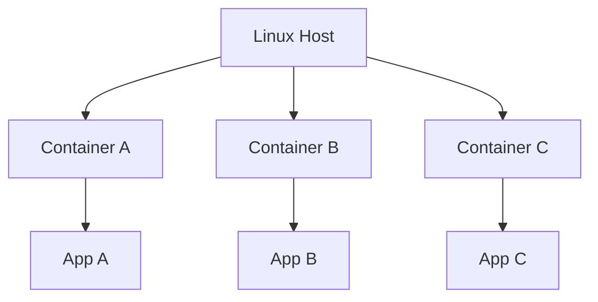

Isolation improves consistency.

---

# Containers vs Virtual Machines

## Virtual Machine Architecture

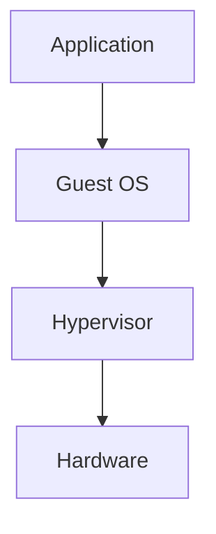

---

## Container Architecture

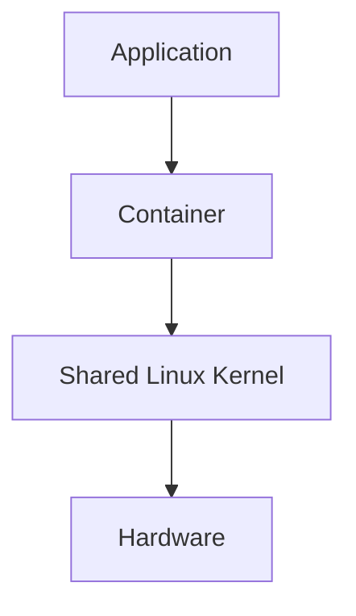

---

# Key Difference

VM:

```text
Own Kernel
```

Container:

```text
Shared Kernel
```

---

# Resource Comparison

| Feature   | Container     | VM       |
| --------- | ------------- | -------- |
| Boot Time | Seconds       | Minutes  |
| Memory    | Low           | High     |
| Isolation | Process Level | OS Level |
| Kernel    | Shared        | Separate |
| Density   | Very High     | Lower    |

---

# Namespace Architecture

Namespaces create isolation.

---

# Namespace Mental Model

Each container sees:

```text
Its Own World
```

even though resources are shared.

---

# Namespace Overview

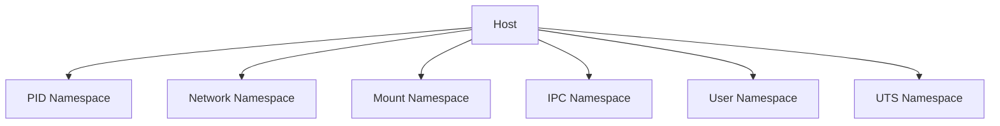

---

# PID Namespace

Provides process isolation.

---

# PID Namespace Example

Host:

```text
PID 1
PID 200
PID 500
PID 1000
```

Container:

```text
PID 1
PID 2
PID 3
```

Same process.

Different views.

---

# PID Namespace Architecture

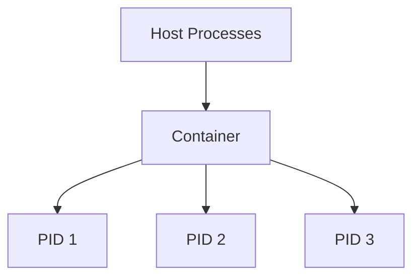

---

# Network Namespace

Provides separate networking.

Each container gets:

```text
Interfaces

Routing Table

ARP Table

Firewall Rules
```

---

# Network Namespace Architecture

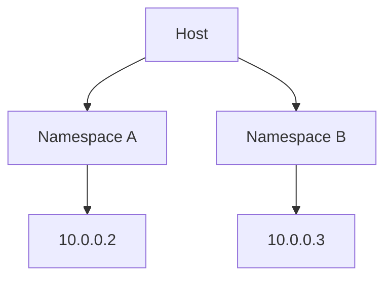

---

# Mount Namespace

Provides filesystem isolation.

---

# Mount Architecture

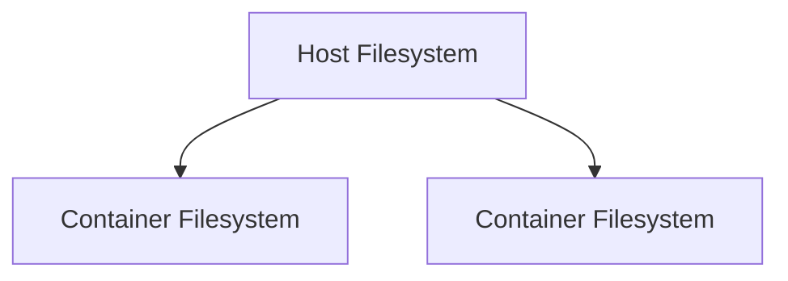

---

# UTS Namespace

Provides hostname isolation.

---

# Example

Container A:

```text
web-1
```

Container B:

```text
db-1
```

Same host.

Different hostnames.

---

# IPC Namespace

Isolates:

```text
Shared Memory

Message Queues

Semaphores
```

---

# User Namespace

Maps container users to host users.

Important for security.

---

# User Namespace Architecture

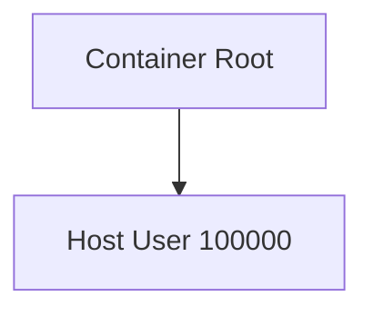

Container root is not necessarily host root.

---

# cgroups

Namespaces isolate visibility.

cgroups control resources.

---

# cgroup Architecture

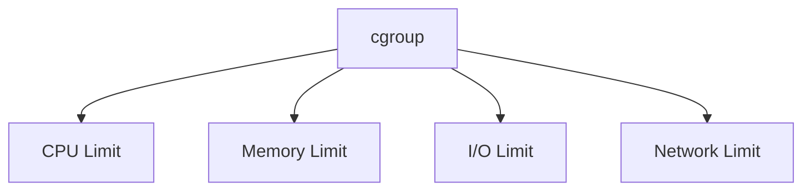

---

# Why cgroups Exist

Without cgroups:

```text
One Container
       ↓
Consumes Entire Server
```

With cgroups:

```text
Resource Limits
```

---

# CPU Limits

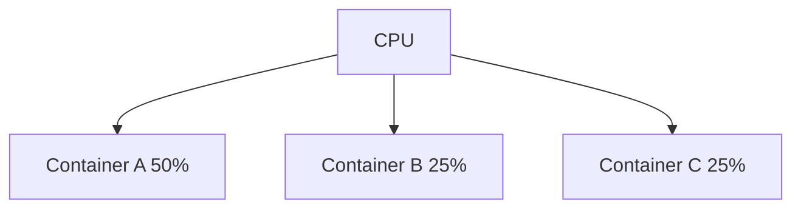

---

# Memory Limits

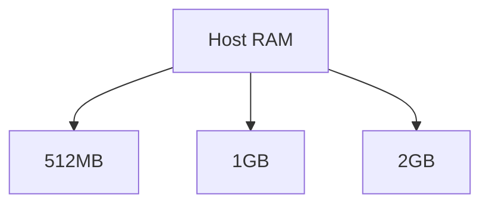

---

# OOM Flow

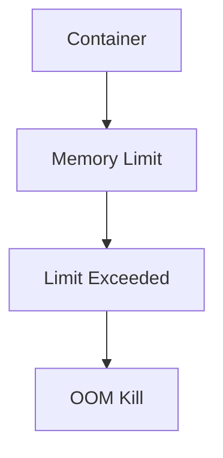

---

# Container Filesystems

Containers use layered filesystems.

---

# OverlayFS Architecture

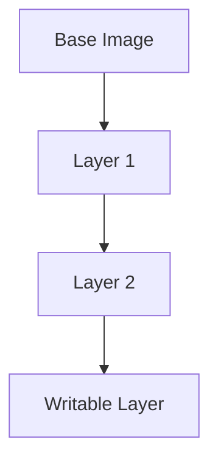

---

# Why Layers Exist

Benefits:

```text
Reuse

Caching

Efficiency

Fast Deployment
```

---

# Container Image Architecture

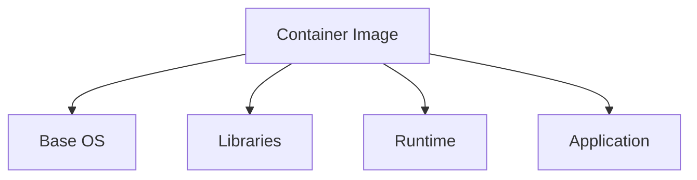

---

# Docker Architecture

Docker is a container platform.

Containers existed before Docker.

Docker made them easy.

---

# Docker Stack

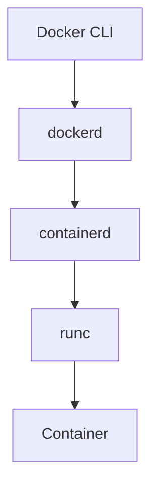

---

# Container Runtime Flow

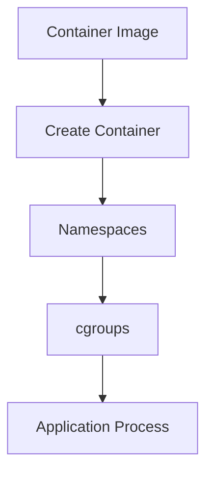

---

# Container Lifecycle

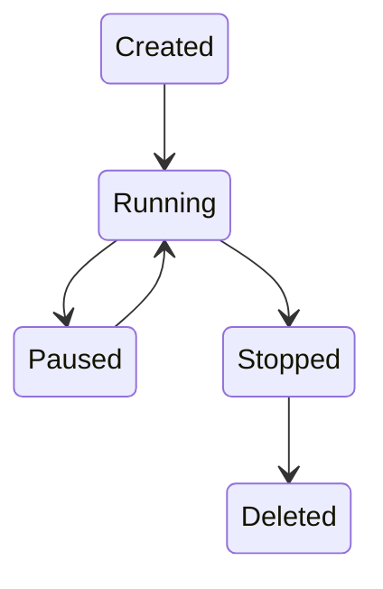

---

# What Actually Runs?

A container is usually:

```text
One Main Process
```

Example:

```text
nginx
postgres
redis
node
python
```

---

# Container Process Architecture

```mermaid
graph TD

CONTAINER["Container"]

CONTAINER --> PID1["Main Process"]

PID1 --> WORKERS["Worker Processes"]
```

---

# Networking Architecture

Docker networking uses:

```text
veth pairs

bridges

NAT
```

---

# Docker Network Flow

```mermaid
graph LR

CONTAINER["Container"]

CONTAINER --> VETH["veth"]

VETH --> BRIDGE["docker0"]

BRIDGE --> HOST["Host"]

HOST --> INTERNET["Internet"]
```

---

# Container Storage

Persistent storage uses:

```text
Volumes

Bind Mounts

Network Storage
```

---

# Volume Architecture

```mermaid
graph TD

CONTAINER["Container"]

CONTAINER --> VOLUME["Volume"]

VOLUME --> HOST["Host Storage"]
```

---

# Security Architecture

Containers use:

```text
Namespaces

Capabilities

seccomp

AppArmor

SELinux
```

---

# Security Layers

```mermaid
graph TD

CONTAINER["Container"]

CONTAINER --> NAMESPACE["Namespaces"]

CONTAINER --> CAPS["Capabilities"]

CONTAINER --> SECCOMP["seccomp"]

CONTAINER --> SELINUX["SELinux"]
```

---

# seccomp

Restricts system calls.

---

# seccomp Flow

```mermaid
graph TD

PROCESS["Process"]

PROCESS --> SYSCALL["System Call"]

SYSCALL --> FILTER["seccomp"]

FILTER --> ALLOW["Allow"]

FILTER --> BLOCK["Block"]
```

---

# Container Observability

Important metrics:

```text
CPU

Memory

Network

Storage

Processes
```

---

# Monitoring Architecture

```mermaid
graph TD

CONTAINER["Container"]

CONTAINER --> METRICS["Metrics"]

CONTAINER --> LOGS["Logs"]

CONTAINER --> EVENTS["Events"]
```

---

# Kubernetes Foundation

Kubernetes orchestrates containers.

---

# Kubernetes Architecture

```mermaid
graph TD

POD["Pod"]

POD --> CONTAINER1["Container"]

POD --> CONTAINER2["Container"]

CONTAINER1 --> KERNEL["Linux Kernel"]

CONTAINER2 --> KERNEL
```

---

# Pod Networking

```mermaid
graph TD

POD["Pod"]

POD --> IP["Pod IP"]

IP --> CLUSTER["Cluster Network"]
```

---

# Container Startup Flow

```mermaid
flowchart TD

IMAGE["Image"]

IMAGE --> PULL["Pull"]

PULL --> CREATE["Create"]

CREATE --> NS["Namespaces"]

NS --> CG["cgroups"]

CG --> START["Start Process"]

START --> RUNNING["Running"]
```

---

# Production Container Stack

```mermaid
graph TD

APPLICATION["Application"]

APPLICATION --> CONTAINER["Container"]

CONTAINER --> DOCKER["Container Runtime"]

DOCKER --> KERNEL["Linux Kernel"]

KERNEL --> CLOUD["Cloud Infrastructure"]
```

---

# Common Container Problems

```text
OOM Kills

Image Bloat

Storage Leaks

Network Issues

Container Restarts

PID 1 Problems

Permission Issues
```

---

# Troubleshooting Flow

```mermaid
flowchart TD

ISSUE["Container Problem"]

ISSUE --> CPU["CPU?"]

ISSUE --> MEM["Memory?"]

ISSUE --> NET["Network?"]

ISSUE --> STORAGE["Storage?"]

CPU --> TOP["top"]

MEM --> STATS["docker stats"]

NET --> SS["ss"]

STORAGE --> DF["df -h"]
```

---

# Engineering Mindset

Beginners see:

```text
Docker Container
```

Engineers see:

```text
Process
      ↓
Namespaces
      ↓
cgroups
      ↓
OverlayFS
      ↓
Virtual Networking
      ↓
Linux Kernel
```

Containers are Linux abstractions, not virtual machines.

---

# Interview Questions

### What is a container?

### How are containers different from VMs?

### What are namespaces?

### What are cgroups?

### What is OverlayFS?

### What is a container image?

### What is a container runtime?

### What is runc?

### What is containerd?

### How does Docker networking work?

### What is a veth pair?

### How do containers share the kernel?

### What is seccomp?

### Why do containers get OOMKilled?

### How does Kubernetes use containers?

---

# One-Page Architecture Summary

```text
Container
     ↓
Namespaces
     ↓
cgroups
     ↓
OverlayFS
     ↓
Virtual Networking
     ↓
Linux Kernel
     ↓
Hardware
```

---

# Final Takeaway

Containers are not miniature virtual machines.

They are isolated Linux processes built from powerful kernel primitives:

```text
Namespaces

cgroups

Capabilities

seccomp

OverlayFS

Virtual Networking
```

Docker, Kubernetes, and modern cloud-native platforms are all built on top of these Linux foundations.

Master container architecture and you gain the ability to understand, debug, optimize, secure, and scale modern applications from a single container to thousands of Kubernetes nodes across the globe.
