# Linux Distributed Systems Map

## The Complete Architecture Map from a Single Linux Process to Planet-Scale Systems

---

# Why This Exists

Most engineers learn distributed systems backwards.

They start with:

```text
Microservices

Kubernetes

Kafka

Service Mesh

Cloud

Distributed Databases
```

without understanding the foundation.

The reality is:

```text
Everything starts with Linux.
```

Every distributed system eventually becomes:

```text
Processes

Memory

Storage

Networking

Security

Scheduling
```

running on Linux machines.

This file exists to connect everything in this repository into one unified systems-thinking map.

The goal is to answer:

```text
How does Linux evolve into
modern distributed infrastructure?
```

---

# The Core Mental Model

Think of distributed systems as:

```text
Linux
  ↓
Server
  ↓
Cluster
  ↓
Platform
  ↓
Internet Scale System
```

Nothing magically appears.

Every layer is built on the previous one.

---

# The Universal Infrastructure Evolution

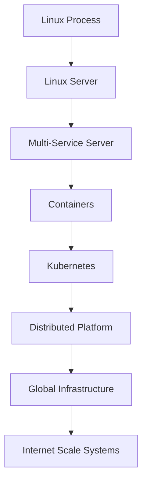

---

# The Complete Systems Hierarchy

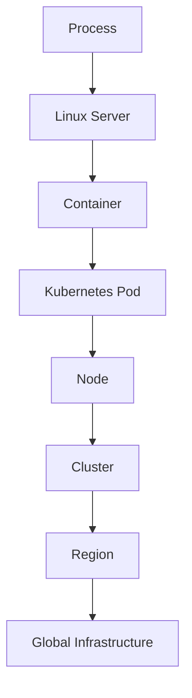

---

# Layer 1: Linux Process

Everything starts here.

Examples:

```text
Nginx

Redis

PostgreSQL

Node.js

Python

Java
```

Linux sees:

```text
PID

Memory

CPU

File Descriptors

Sockets
```

---

# Process Architecture

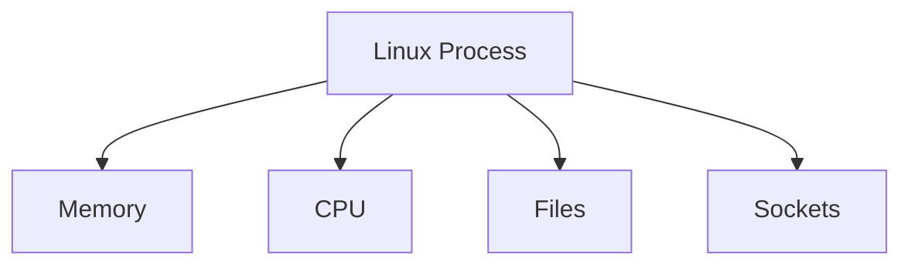

---

# Layer 2: Linux Server

Multiple processes create a server.

---

# Server Architecture

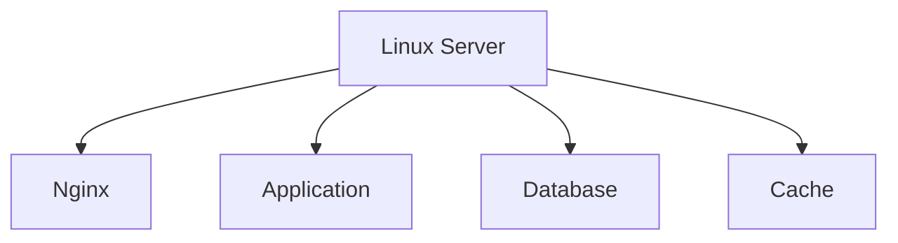

---

# Problems at Server Scale

```text
Resource Contention

Dependency Conflicts

Scaling Limits

Operational Complexity
```

---

# Layer 3: Containers

Containers isolate workloads.

---

# Container Architecture

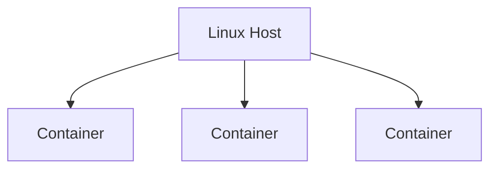

Built from:

```text
Namespaces

cgroups

OverlayFS

Linux Networking
```

---

# Why Containers Exist

```text
Isolation

Portability

Reproducibility

Density
```

---

# Layer 4: Kubernetes

Now we manage many containers.

---

# Kubernetes Architecture

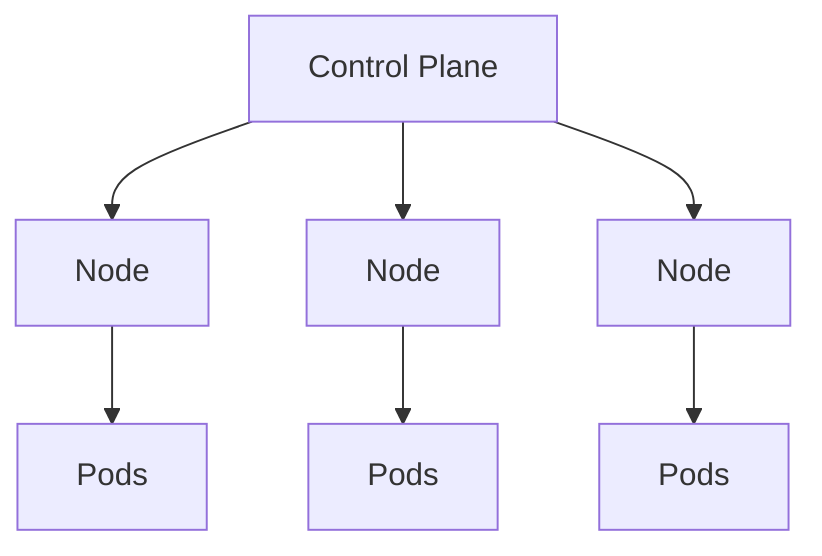

---

# Kubernetes Solves

```text
Scheduling

Scaling

Service Discovery

Self Healing

Resource Allocation
```

---

# Layer 5: Distributed Computing

Multiple machines work together.

---

# Distributed System Model

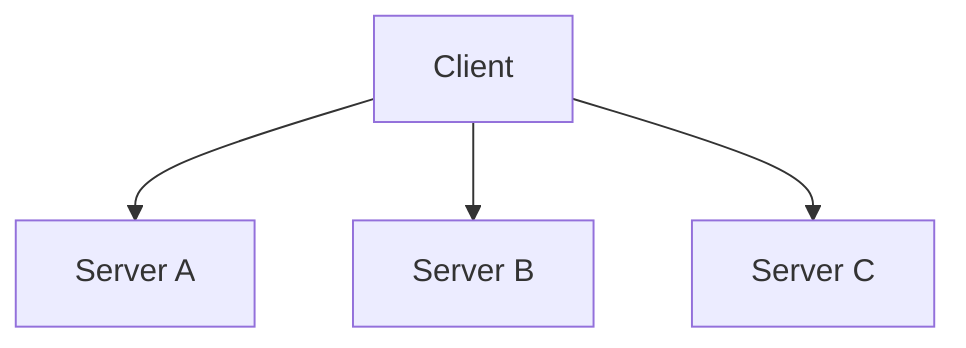

---

# New Problems Appear

```text
Network Failures

Latency

Partial Failures

Consistency

Replication

Coordination
```

---

# The Fundamental Truth

A distributed system is:

```text
Multiple Linux Machines
Connected by Networks
```

---

# Distributed System Foundation

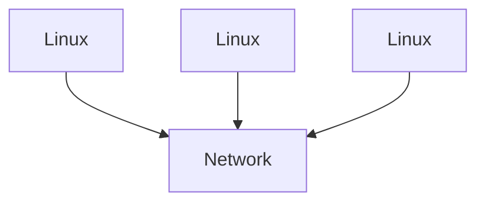

---

# Layer 6: Service-Oriented Architecture

Services become independent.

---

# Service Architecture

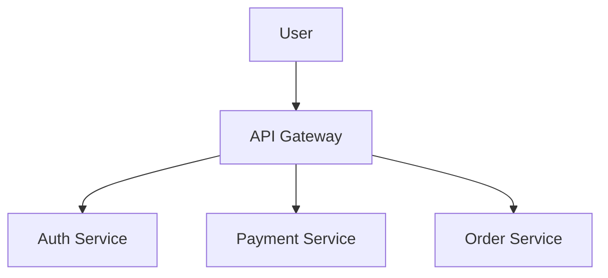

---

# Benefits

```text
Independent Teams

Independent Deployments

Scalability
```

---

# Costs

```text
Operational Complexity

Network Latency

Observability Challenges
```

---

# Layer 7: Event-Driven Systems

Not everything should be synchronous.

---

# Event Architecture

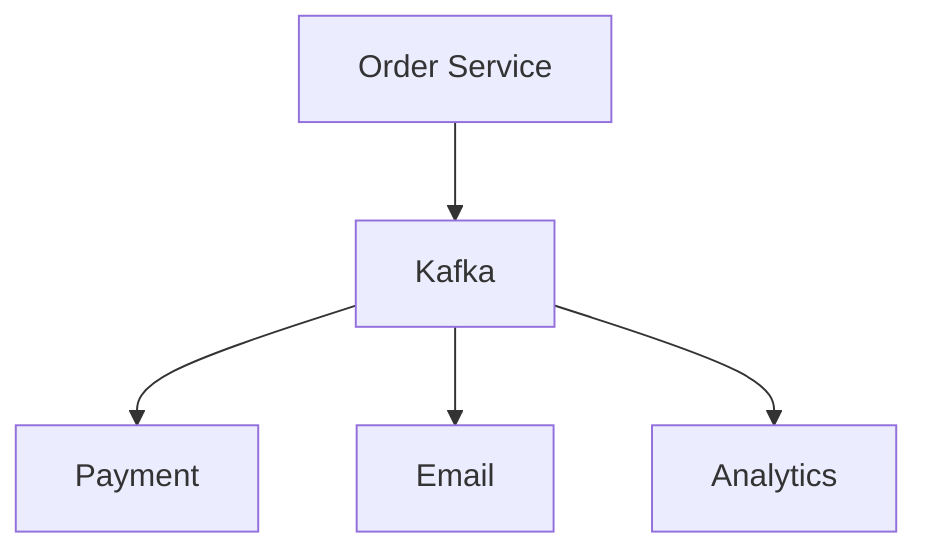

---

# Why Events Matter

They reduce coupling.

Instead of:

```text
Service A → Service B
```

We get:

```text
Service A → Event

Many Consumers
```

---

# Layer 8: Distributed Data Systems

Data becomes harder than compute.

---

# Database Scaling Journey


---

# Distributed Database Problems

```text
Replication

Consistency

Partition Tolerance

Transactions

Leader Election
```

---

# Data Architecture

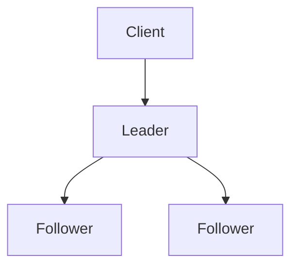

---

# Layer 9: Cloud Infrastructure

Servers become programmable.

---

# Cloud Architecture

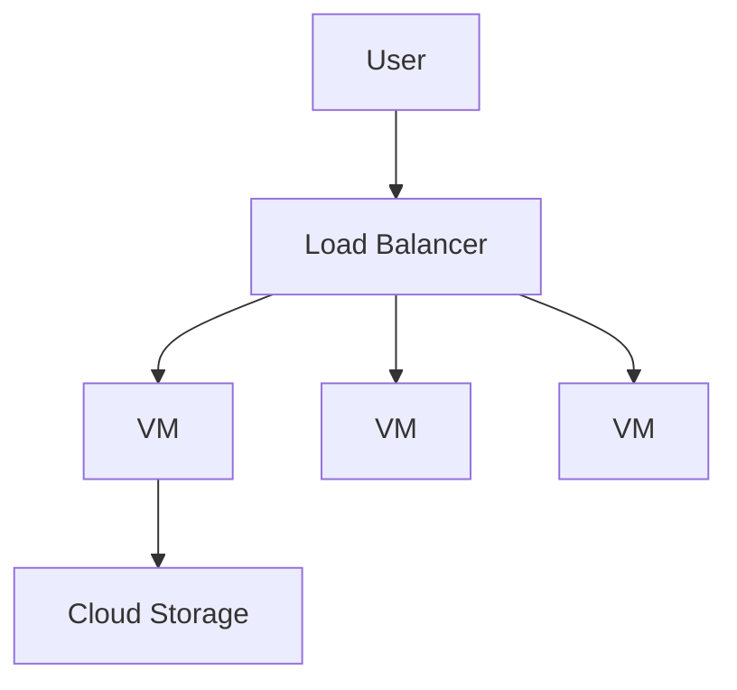

---

# Cloud Foundation

Cloud is still:

```text
Linux

Networking

Storage

Virtualization
```

just automated.

---

# Layer 10: Platform Engineering

Infrastructure becomes a product.

---

# Platform Architecture

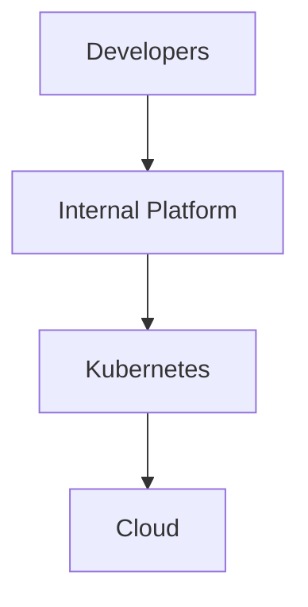

---

# Platform Responsibilities

```text
Deployment

Monitoring

Security

Networking

Developer Experience
```

---

# Layer 11: Global Infrastructure

Now systems span continents.

---

# Multi-Region Architecture

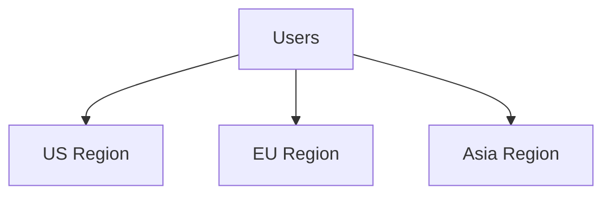

---

# Global Challenges

```text
Latency

Replication

Failover

Data Sovereignty

Disaster Recovery
```

---

# Layer 12: Internet Scale Systems

Google.

Netflix.

Amazon.

Cloudflare.

Meta.

Uber.

---

# Planet Scale Architecture

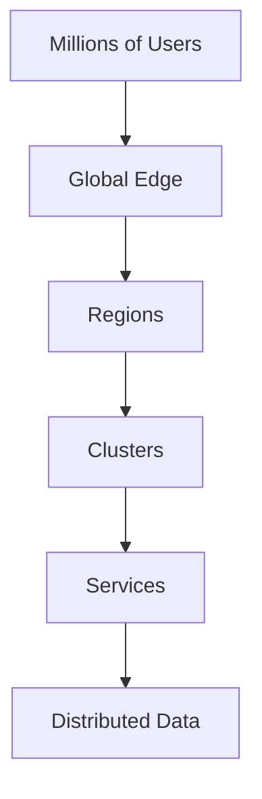

---

# The Universal Request Path

A request traveling through modern infrastructure:


---

# Linux Under Every Layer

The most important diagram.

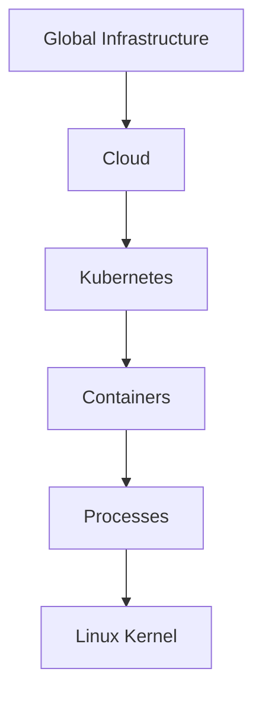

Everything eventually reaches Linux.

---

# Distributed Systems Building Blocks

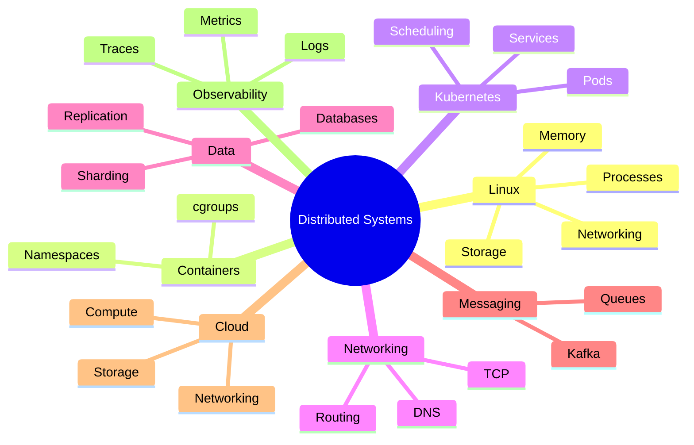

---

# The CAP Theorem Map

One of the most important distributed systems concepts.

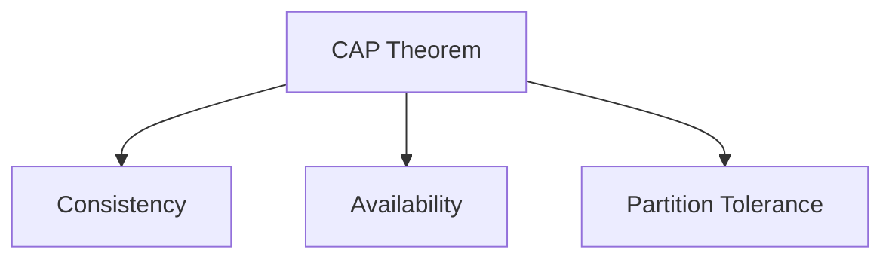

Distributed systems can never perfectly optimize all three.

---

# The PACELC Extension

```text
If Partition:
    Availability vs Consistency

Else:
    Latency vs Consistency
```

This explains most modern database designs.

---

# The Fallacies of Distributed Computing

Never assume:

```text
The network is reliable

Latency is zero

Bandwidth is infinite

The network is secure

Topology doesn't change
```

These assumptions cause production failures.

---

# Observability Across Distributed Systems

```mermaid
graph TD

SERVICEA["Service A"]

SERVICEA --> SERVICEB["Service B"]

SERVICEB --> SERVICEC["Service C"]

SERVICEC --> DATABASE["Database"]

SERVICEA --> TRACE["Trace"]

SERVICEB --> TRACE

SERVICEC --> TRACE
```

Without observability:

```text
Distributed Systems = Blindness
```

---

# Security Across Distributed Systems

```mermaid
graph TD

USER["User"]

USER --> IAM["Identity"]

IAM --> API["API"]

API --> SERVICE["Services"]

SERVICE --> DATABASE["Database"]
```

Modern systems require:

```text
Authentication

Authorization

Encryption

Auditability
```

everywhere.

---

# Production Failure Map

Most outages fall into:

```text
Networking

Storage

Databases

Configuration

Capacity

Human Error
```

---

# Failure Propagation

```mermaid
flowchart TD

DATABASE["Database Failure"]

DATABASE --> SERVICE["Service Failure"]

SERVICE --> API["API Failure"]

API --> USER["Customer Impact"]
```

Small failures can become global outages.

---

# The Systems Thinking Hierarchy

```text
Commands
 ↓
Processes
 ↓
Linux
 ↓
Servers
 ↓
Containers
 ↓
Kubernetes
 ↓
Distributed Systems
 ↓
Cloud
 ↓
Platforms
 ↓
Global Infrastructure
```

---

# Engineering Mindset

Beginners see:

```text
Docker

Kubernetes

Kafka

Cloud
```

Engineers see:

```text
Linux
 ↓
Processes
 ↓
Networking
 ↓
Storage
 ↓
Distributed Coordination
 ↓
Platform Design
```

The deeper your Linux understanding becomes, the easier distributed systems become.

---

# Interview Questions

### Why are distributed systems fundamentally Linux systems?

### What Linux concepts make containers possible?

### Why does Kubernetes depend on Linux?

### What new problems appear when moving from one server to many servers?

### What is replication?

### What is sharding?

### What is service discovery?

### What is leader election?

### What is CAP theorem?

### What is PACELC?

### Why are distributed systems hard?

### What are the fallacies of distributed computing?

### How does observability change at scale?

### How do global systems handle failures?

### What is platform engineering?

---

# One-Page Master Map

```text
Linux Process
      ↓
Linux Server
      ↓
Containers
      ↓
Kubernetes
      ↓
Distributed Systems
      ↓
Cloud
      ↓
Platform Engineering
      ↓
Multi-Region Systems
      ↓
Internet Scale Infrastructure
```

---

# Final Takeaway

Every modern distributed system is ultimately built from the same foundations:

```text
Linux

Processes

Memory

Storage

Networking

Security
```

Containers, Kubernetes, cloud platforms, service meshes, distributed databases, and global infrastructure are not separate worlds.

They are layers built on top of Linux.

Master Linux deeply, and the architecture of distributed systems becomes far easier to understand, design, troubleshoot, and scale.
