# Linux Filesystem Architecture

## From Inodes and Blocks to Modern Storage Systems

---

# Why This Exists

Every Linux system depends on filesystems.

Applications may appear to work with:

```text
Files
Directories
Logs
Configurations
Databases
Containers
```

But Linux never truly stores files.

Linux stores:

```text
Blocks
Inodes
Metadata
Pointers
```

The filesystem is the layer that transforms raw storage into something humans and applications can use.

Understanding filesystem architecture is essential for:

* Linux Engineers
* DevOps Engineers
* SREs
* Cloud Engineers
* Database Engineers
* Platform Engineers
* Infrastructure Architects

---

# The Filesystem Mental Model

Most beginners think:

```text
File
   ↓
Disk
```

Reality:

```text
File
   ↓
Directory Entry
   ↓
Inode
   ↓
Block Mapping
   ↓
Filesystem
   ↓
Block Layer
   ↓
Storage Device
```

---

# The Complete Filesystem Stack

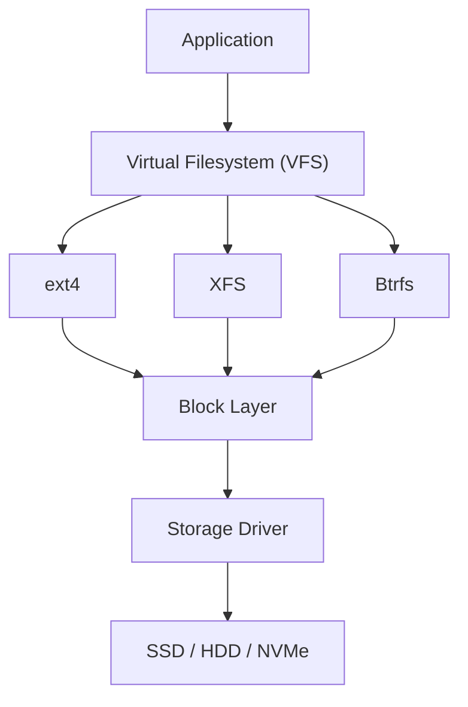

---

# Linux Storage Hierarchy

```text
Application
     ↓
Filesystem
     ↓
Block Layer
     ↓
Storage Driver
     ↓
Storage Device
```

Every read and write operation follows this path.

---

# What Is a Filesystem?

A filesystem is a data structure.

Its job is to answer:

```text
Where is my data?
```

It provides:

```text
File Names
Directories
Permissions
Ownership
Metadata
Storage Allocation
```

Without a filesystem:

```text
Disk = Random Blocks
```

With a filesystem:

```text
Disk = Organized Data
```

---

# Filesystem Architecture

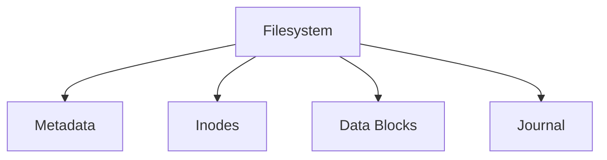

---

# Filesystem Components

Every filesystem contains:

```text
Superblock
Inodes
Data Blocks
Journal
Directory Entries
Metadata
```

---

# The Superblock

The superblock is the filesystem's identity card.

Contains:

```text
Filesystem Type
Block Size
Filesystem Size
Free Space
Inode Information
Mount Information
```

---

# Superblock Architecture

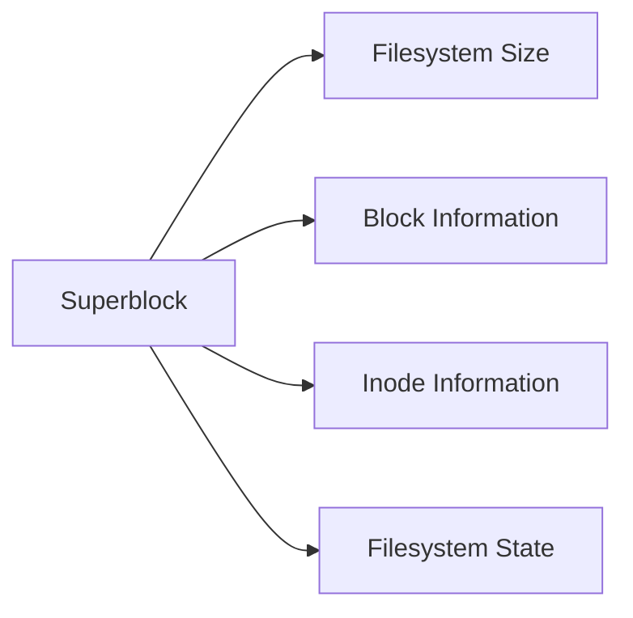

---

# View Filesystem Information

```bash
dumpe2fs /dev/sda1
```

or

```bash
tune2fs -l /dev/sda1
```

---

# Inode Architecture

The inode is the most important filesystem structure.

A file is not its name.

A file is an inode.

---

# Inode Mental Model

```text
Filename = Human Friendly Label

Inode = Actual File
```

---

# Inode Architecture

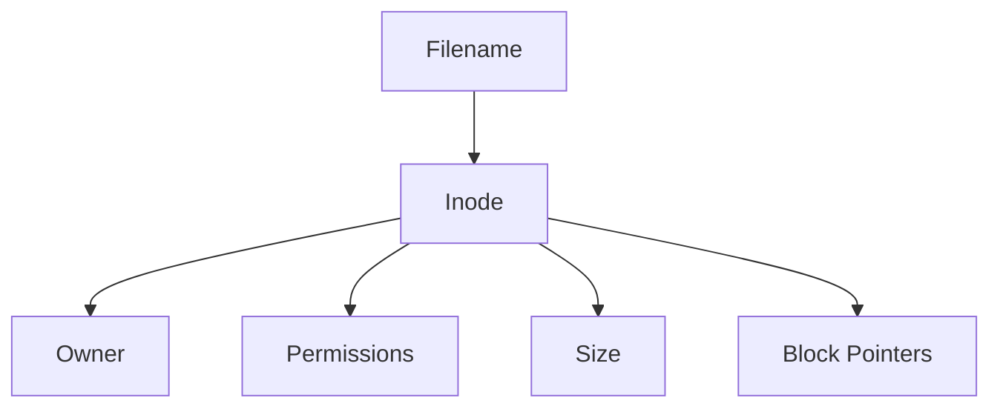

---

# What an Inode Stores

```text
Owner
Group
Permissions
Size
Timestamps
Block Locations
Links
```

---

# What an Inode Does NOT Store

```text
Filename
```

This surprises many engineers.

---

# File Architecture

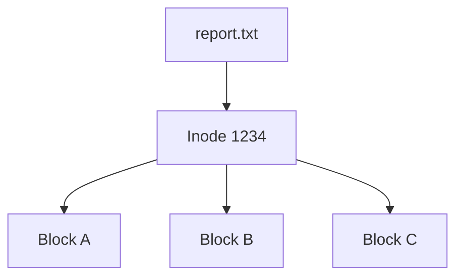

---

# Directory Architecture

Directories are special files.

A directory maps:

```text
Filename
     ↓
Inode Number
```

---

# Directory Structure

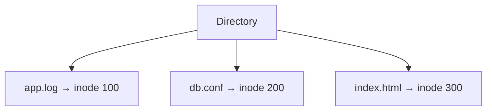

---

# File Lookup Flow

When Linux opens a file:

```bash
cat file.txt
```

Linux performs:

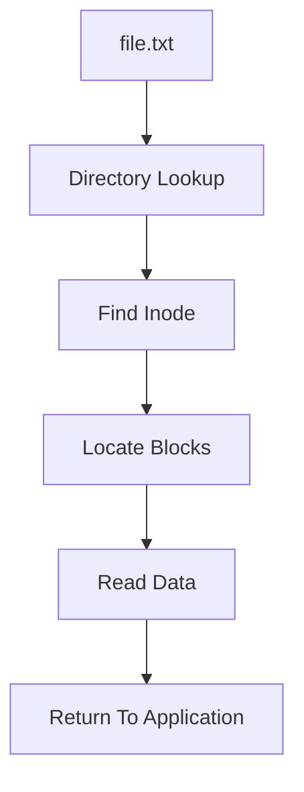

---

# Data Blocks

Actual file contents live inside blocks.

Example:

```text
Block Size = 4096 Bytes
```

Files are stored as collections of blocks.

---

# Block Architecture

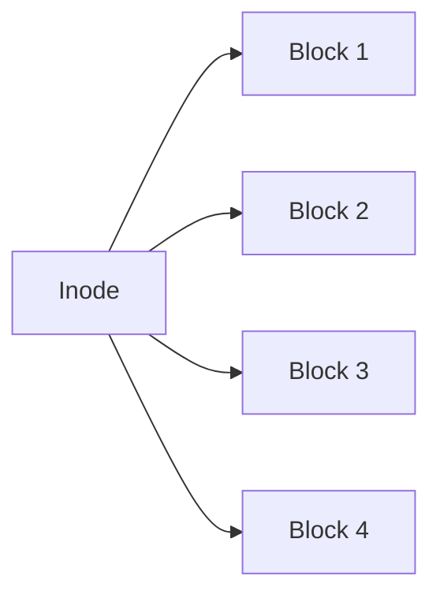

---

# Filesystem Layout

```text
+----------------------+
| Superblock           |
+----------------------+

| Inode Table          |
+----------------------+

| Data Blocks          |
+----------------------+

| Journal              |
+----------------------+
```

---

# Journaling

Modern filesystems use journals.

Purpose:

```text
Crash Recovery
Consistency
Fast Repair
```

---

# Journaling Flow


---

# Why Journaling Exists

Without journaling:

```text
Power Loss
     ↓
Corruption
```

With journaling:

```text
Power Loss
     ↓
Replay Journal
     ↓
Recover State
```

---

# ext4 Architecture

Most common Linux filesystem.

Features:

```text
Journaling
Extents
Large Files
High Reliability
```

---

# ext4 Internal Layout

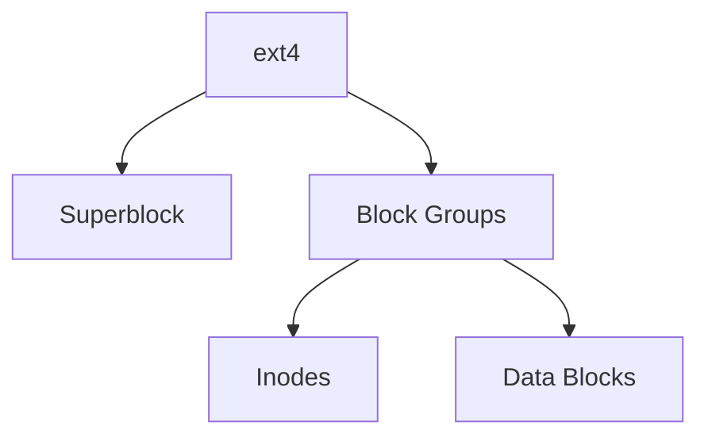

---

# XFS Architecture

Used heavily in:

```text
RHEL
Cloud Platforms
Large Storage Systems
```

Optimized for:

```text
Large Files
Parallel I/O
Scalability
```

---

# XFS Design

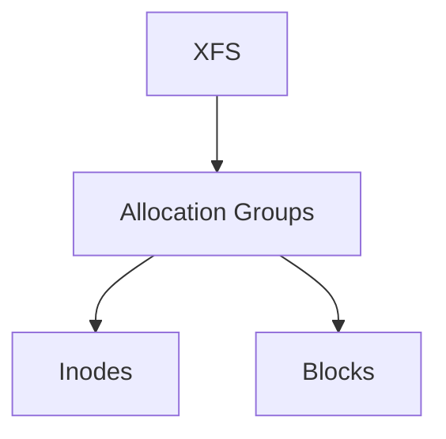

Allocation Groups improve parallelism.

---

# Btrfs Architecture

Modern filesystem.

Features:

```text
Snapshots
Checksums
Compression
Copy-On-Write
```

---

# Btrfs Design

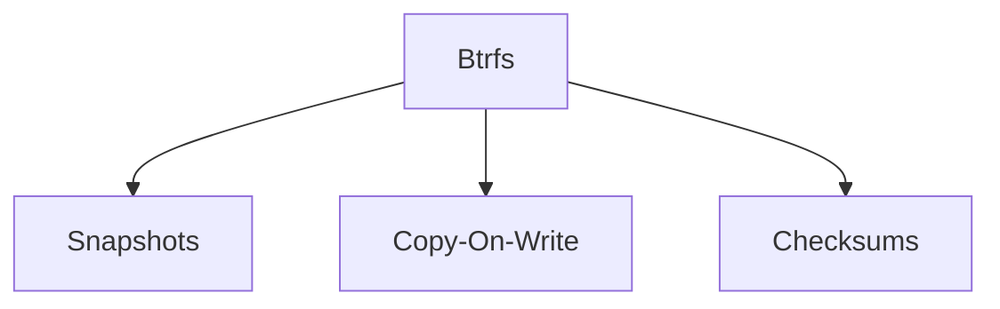

---

# Virtual Filesystem (VFS)

One of Linux's most important abstractions.

Applications should not care whether storage uses:

```text
ext4
xfs
btrfs
nfs
tmpfs
```

---

# VFS Architecture

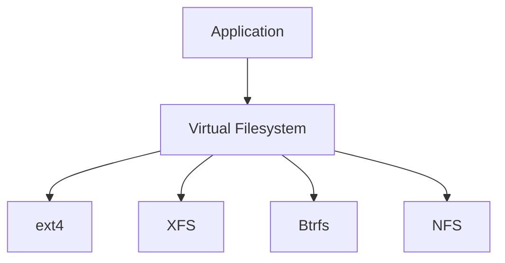

---

# Why VFS Exists

Without VFS:

Applications need filesystem-specific code.

With VFS:

Applications use:

```text
open()
read()
write()
close()
```

for everything.

---

# File Read Path

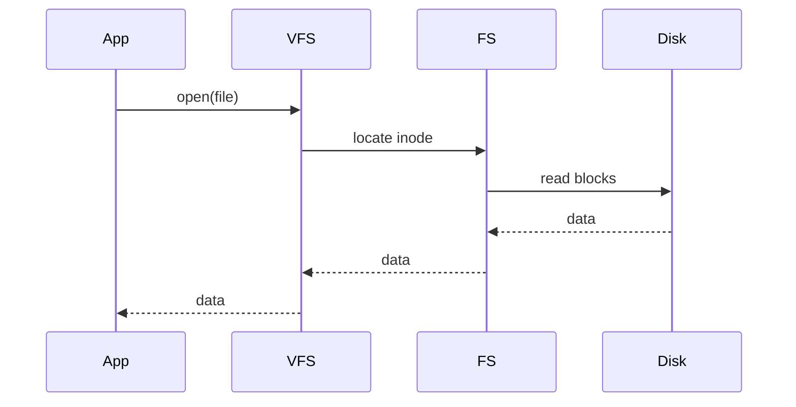

---

# File Write Path

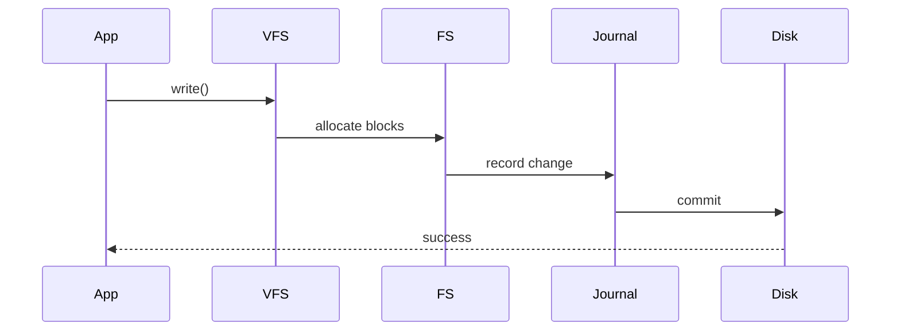

---

# Hard Links

Multiple names.

One inode.

---

# Hard Link Architecture

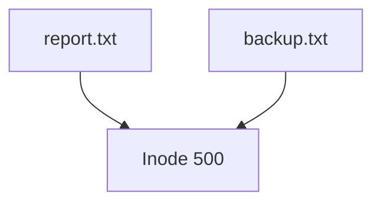

---

# Soft Links

Pointer to another path.

---

# Symlink Architecture

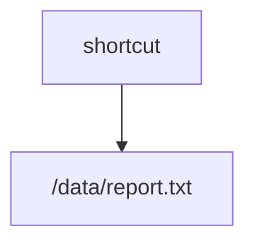

---

# Mount Architecture

Linux uses a unified filesystem tree.

Everything mounts under:

```text
/
```

---

# Mount Tree

```text
/

├── boot
├── home
├── var
├── opt
├── data
└── mnt
```

---

# Mount Architecture

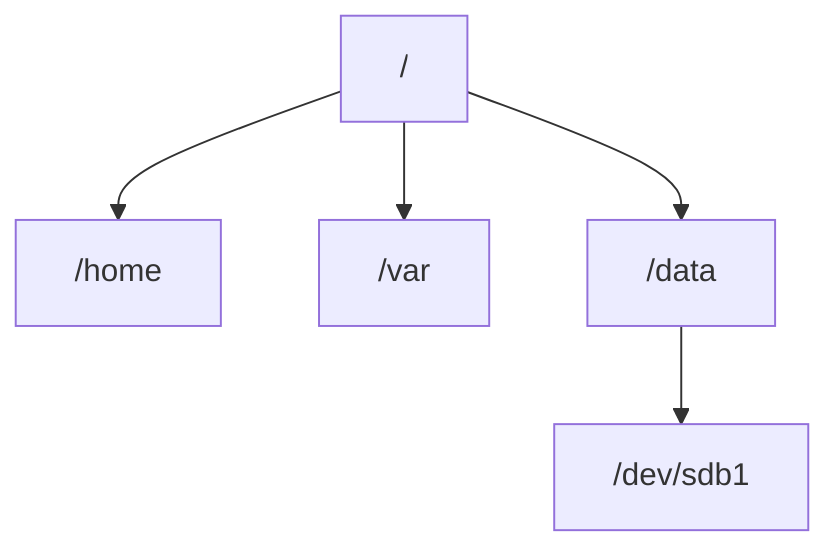

---

# Filesystem Cache

Linux aggressively caches files.

---

# Page Cache Architecture


---

# Why Page Cache Exists

RAM:

```text
Nanoseconds
```

Disk:

```text
Microseconds / Milliseconds
```

Cache dramatically improves performance.

---

# Filesystem and Databases

Databases rely heavily on:

```text
Latency
Durability
Consistency
```

Common choices:

```text
ext4
XFS
```

---

# Database I/O Path

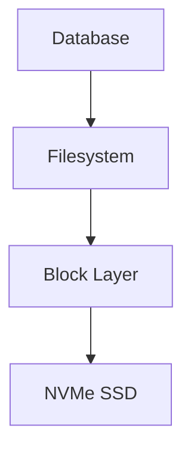

---

# Filesystem and Docker

Docker uses:

```text
OverlayFS
```

---

# OverlayFS Architecture

```mermaid
graph TD

BASE["Base Image"]

BASE --> LAYER1["Layer 1"]

LAYER1 --> LAYER2["Layer 2"]

LAYER2 --> RW["Writable Layer"]
```

---

# Filesystem and Kubernetes

Storage Flow:

```mermaid
graph LR

PVC["PVC"]

PVC --> PV["Persistent Volume"]

PV --> STORAGE["Storage Backend"]

STORAGE --> FILESYSTEM["Filesystem"]
```

---

# Production Bottlenecks

Common issues:

```text
Disk Full

Inode Exhaustion

Slow Storage

Filesystem Corruption

Mount Failures

Journal Replays
```

---

# Disk Full Investigation

```bash
df -h
```

---

# Inode Investigation

```bash
df -i
```

---

# Largest Directories

```bash
du -sh /*
```

---

# Filesystem Troubleshooting Flow

```mermaid
flowchart TD

ISSUE["Filesystem Problem"]

ISSUE --> SPACE["Disk Full?"]

SPACE -->|Yes| DF["df -h"]

SPACE -->|No| INODE["Inodes Full?"]

INODE -->|Yes| DFI["df -i"]

INODE -->|No| IO["Storage Performance"]

IO --> IOSTAT["iostat"]
```

---

# Observability Map

Important tools:

```bash
df -h
df -i

du -sh *

lsblk

blkid

mount

findmnt

iostat

iotop

lsof
```

---

# Filesystem Engineering Mindset

Beginners see:

```text
File
```

Engineers see:

```text
Directory Entry
        ↓
Inode
        ↓
Block Mapping
        ↓
Filesystem
        ↓
Block Layer
        ↓
Storage Device
```

Understanding the layers makes debugging predictable.

---

# Interview Questions

### What is a filesystem?

### What is an inode?

### What does an inode store?

### Why doesn't an inode store filenames?

### What is journaling?

### What is VFS?

### What is the difference between ext4 and XFS?

### What is Btrfs?

### What are hard links?

### What are symbolic links?

### What is OverlayFS?

### How does Linux read a file?

### How does Linux write a file?

### Why does Linux use page cache?

### What causes inode exhaustion?

---

# One-Page Architecture Summary

```text
Application
     ↓
VFS
     ↓
Filesystem
     ↓
Inode
     ↓
Block Mapping
     ↓
Block Layer
     ↓
Storage Driver
     ↓
SSD / HDD / NVMe
```

---

# Final Takeaway

Linux filesystems are not about files.

They are about:

```text
Metadata
Inodes
Blocks
Caching
Journaling
Consistency
Recovery
```

The filesystem acts as the bridge between applications and storage devices.

Every database query, web request, log entry, container image, Kubernetes volume, and cloud storage operation ultimately depends on these filesystem foundations.

Master filesystem architecture and you gain insight into one of the most important subsystems in Linux.
