# Linux Kernel Architecture

## The Complete Guide to the Heart of Linux

---

# Why This Exists

The Linux kernel is the most important software running on a Linux system.

Without the kernel:

```text id="k1q8rp"
No Processes
No Memory
No Networking
No Storage
No Security
No Containers
No Kubernetes
No Linux
```

Every application ultimately depends on the kernel.

When:

```text id="g7d3zm"
Nginx serves a request

PostgreSQL writes data

Docker starts a container

Kubernetes schedules a pod
```

the Linux kernel is performing the actual work.

Most engineers use Linux.

Few understand the kernel.

Understanding the kernel transforms:

```text id="q8x2nv"
Linux User
      ↓
Linux Administrator
      ↓
Linux Engineer
      ↓
Systems Engineer
      ↓
Infrastructure Architect
```

---

# The Kernel Mental Model

Think of the kernel as the operating system's government.

Applications request resources.

The kernel decides:

```text id="x4v8ml"
Who gets CPU?

Who gets Memory?

Who accesses Storage?

Who can use the Network?

Who can access Devices?
```

The kernel is the ultimate authority.

---

# Linux Architecture Overview

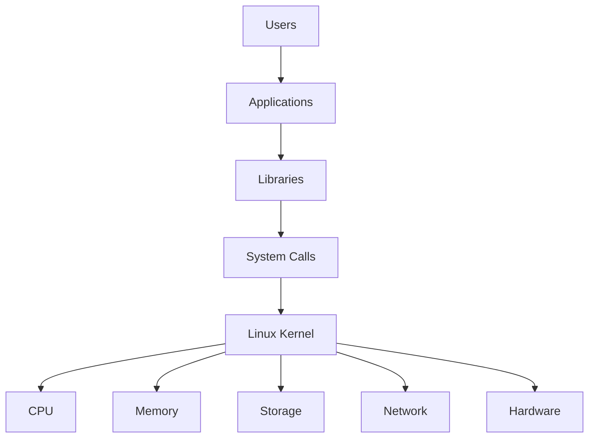

---

# The Linux Operating System

Many people think:

```text id="n2a6qw"
Linux = Kernel + Commands
```

Actually:

```text id="e7k5xp"
Linux Kernel
+
GNU Tools
+
Libraries
+
Applications
=
Linux Operating System
```

---

# Kernel Responsibilities

The kernel manages:

```text id="v6t1jd"
Process Management

Memory Management

Device Drivers

Filesystems

Networking

Security

Resource Allocation

Interrupt Handling
```

---

# Kernel Architecture Overview

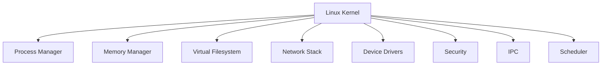

---

# Kernel Space vs User Space

One of the most important concepts in Linux.

---

# Architecture

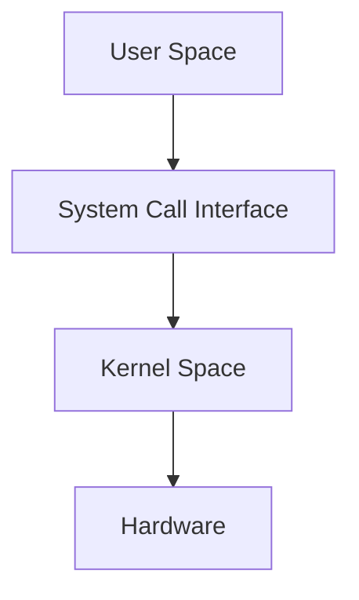

---

# User Space

Examples:

```text id="j9w4vt"
Bash

Nginx

Redis

PostgreSQL

Docker

Python

Java
```

Cannot directly access hardware.

---

# Kernel Space

Has unrestricted access to:

```text id="s3n7cf"
CPU

RAM

Storage

Network Devices

Hardware Controllers
```

---

# Why Separation Exists

Without separation:

```text id="m4x8pb"
One Application
      ↓
Corrupts Entire System
```

With separation:

```text id="j7r3kv"
Application Failure
      ↓
Kernel Protection
      ↓
System Survives
```

---

# System Call Interface

Applications interact with the kernel through system calls.

---

# System Call Flow

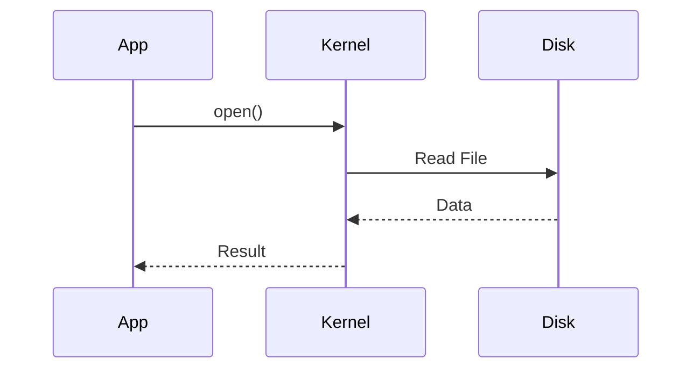

---

# Common System Calls

| System Call | Purpose            |
| ----------- | ------------------ |
| open()      | Open File          |
| read()      | Read Data          |
| write()     | Write Data         |
| fork()      | Create Process     |
| exec()      | Execute Program    |
| socket()    | Create Socket      |
| connect()   | Network Connection |
| mmap()      | Map Memory         |

---

# Viewing System Calls

```bash id="2w7nrm"
strace ls
```

or

```bash id="t6k2yj"
strace -p PID
```

---

# Kernel Initialization

During boot:

```text id="h4f9sx"
Kernel Loads
     ↓
Memory Setup
     ↓
Scheduler Setup
     ↓
Drivers Load
     ↓
Filesystem Setup
     ↓
PID 1 Starts
```

---

# Boot-Time Kernel Flow

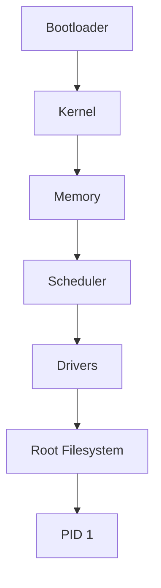

---

# Process Management

One of the kernel's primary jobs.

---

# Process Architecture

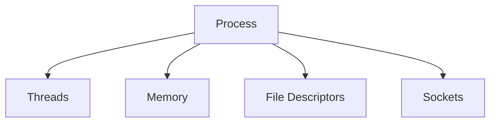

---

# Process Lifecycle

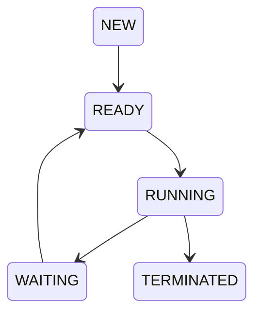

---

# Process Creation

Linux uses:

```c id="3u9wcm"
fork()
```

and

```c id="j4m7tn"
exec()
```

---

# Process Creation Flow

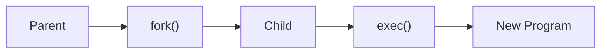

---

# Scheduler

The scheduler decides:

```text id="y8t5cb"
Who gets CPU?

When?

For how long?
```

---

# Scheduling Architecture

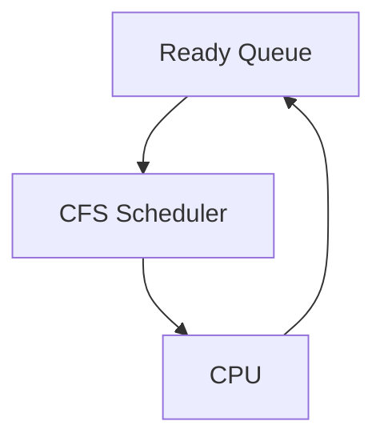

---

# Completely Fair Scheduler (CFS)

Modern Linux scheduler.

Goal:

```text id="r5v9jd"
Fair CPU Distribution
```

---

# Context Switching

CPU moves between processes.

---

# Context Switch Flow

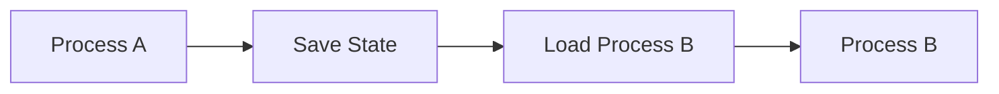

---

# Memory Management

Kernel manages:

```text id="u2x7zr"
Virtual Memory

Physical Memory

Page Cache

Swap

Page Tables
```

---

# Memory Architecture

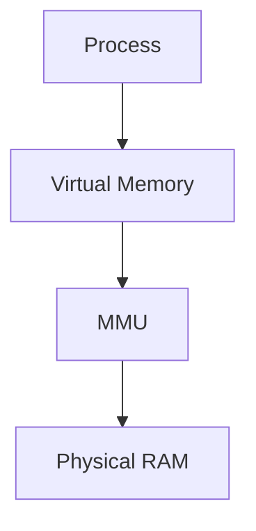

---

# Memory Subsystems

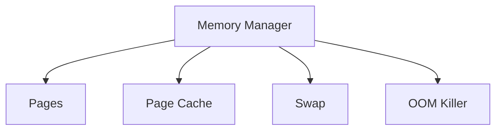

---

# Page Cache

Huge performance optimization.

---

# Cache Flow

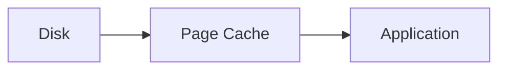

---

# OOM Killer

Last line of defense.

---

# OOM Flow

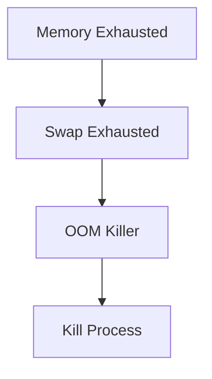

---

# Virtual Filesystem (VFS)

Provides a common interface for all filesystems.

---

# VFS Architecture

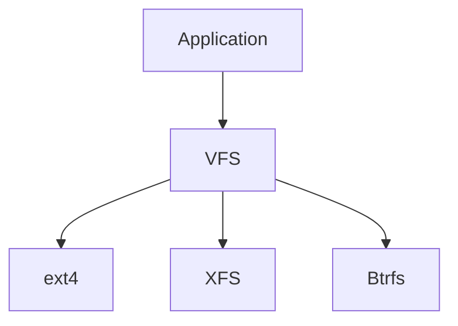

---

# Storage Stack

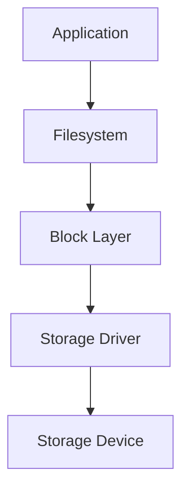

---

# Device Drivers

Drivers connect software and hardware.

---

# Driver Architecture

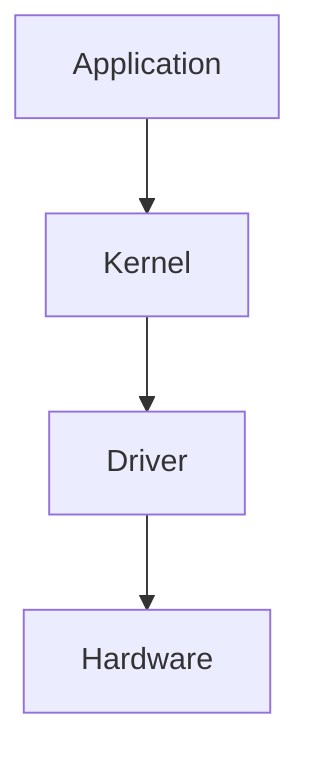

---

# Kernel Modules

Dynamic kernel extensions.

---

# Module Architecture

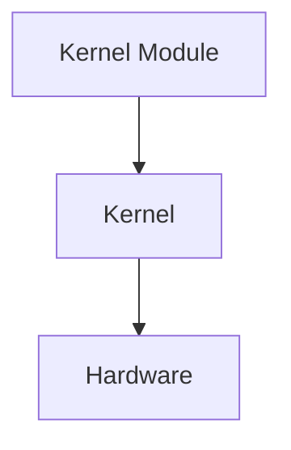

---

# View Loaded Modules

```bash id="6t8pys"
lsmod
```

---

# Load Module

```bash id="h4v7kj"
modprobe module_name
```

---

# Networking Stack

Linux networking lives inside the kernel.

---

# Networking Architecture

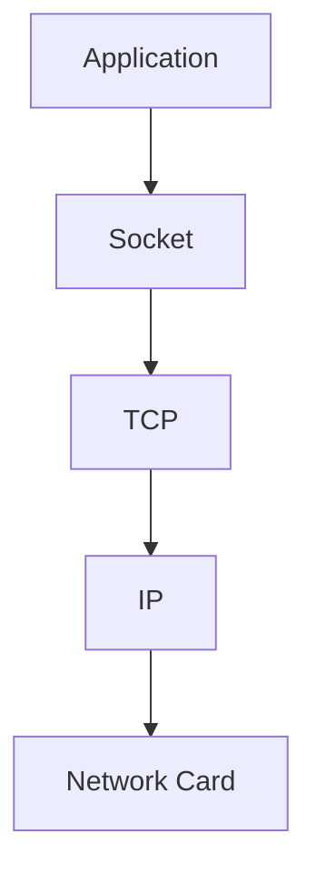

---

# Packet Flow


---

# Interrupt Handling

Hardware communicates using interrupts.

---

# Interrupt Architecture

```mermaid id="kern021"
graph TD

DEVICE["Device"]

DEVICE --> IRQ["Interrupt"]

IRQ --> CPU["CPU"]

CPU --> KERNEL["Interrupt Handler"]
```

---

# View Interrupts

```bash id="9f2zcr"
cat /proc/interrupts
```

---

# SoftIRQ Architecture

Linux uses deferred processing.

---

# SoftIRQ Flow

```mermaid id="kern022"
flowchart TD

INTERRUPT["Interrupt"]

INTERRUPT --> TOPHALF["Top Half"]

TOPHALF --> SOFTIRQ["SoftIRQ"]

SOFTIRQ --> WORK["Deferred Work"]
```

---

# Inter-Process Communication (IPC)

Processes communicate through:

```text id="v8m4ns"
Pipes

Sockets

Shared Memory

Message Queues

Signals
```

---

# IPC Architecture

```mermaid id="kern023"
graph TD

PROCESS1["Process A"]

PROCESS1 --> IPC["IPC Mechanism"]

IPC --> PROCESS2["Process B"]
```

---

# Linux Security Architecture

```mermaid id="kern024"
graph TD

USER["User"]

USER --> PERMS["Permissions"]

PERMS --> ACL["ACL"]

ACL --> CAP["Capabilities"]

CAP --> SELINUX["SELinux/AppArmor"]
```

---

# Capabilities

Instead of:

```text id="q9w1ka"
All Root Power
```

Linux can grant:

```text id="y5r8xf"
Specific Privileges
```

---

# Security Layers

```text id="n7j2ce"
Permissions

ACLs

Capabilities

SELinux

AppArmor

Seccomp
```

---

# Namespaces

Foundation of containers.

---

# Namespace Types

```text id="f6t4zd"
PID

Network

Mount

UTS

IPC

User
```

---

# Namespace Architecture

```mermaid id="kern025"
graph TD

HOST["Host"]

HOST --> PIDNS["PID Namespace"]

HOST --> NETNS["Network Namespace"]

HOST --> MOUNTNS["Mount Namespace"]
```

---

# cgroups

Control resources.

---

# cgroup Architecture

```mermaid id="kern026"
graph TD

CGROUP["cgroup"]

CGROUP --> CPU["CPU Limit"]

CGROUP --> MEM["Memory Limit"]

CGROUP --> IO["I/O Limit"]
```

---

# Container Architecture

Containers are kernel features.

---

# Container Stack

```mermaid id="kern027"
graph TD

CONTAINER["Container"]

CONTAINER --> NS["Namespaces"]

CONTAINER --> CG["cgroups"]

CONTAINER --> FS["OverlayFS"]
```

---

# /proc Filesystem

Kernel information interface.

Examples:

```bash id="n2r7vx"
/proc/cpuinfo

/proc/meminfo

/proc/PID
```

---

# /sys Filesystem

Hardware and kernel information.

Examples:

```bash id="g3y9mw"
/sys/class

/sys/block

/sys/devices
```

---

# Kernel Logging

Kernel messages are critical for troubleshooting.

---

# Logging Architecture

```mermaid id="kern028"
graph TD

KERNEL["Kernel"]

KERNEL --> DMESG["dmesg"]

KERNEL --> JOURNAL["journalctl -k"]
```

---

# View Kernel Logs

```bash id="b6k5pw"
dmesg
```

```bash id="m4q8te"
journalctl -k
```

---

# Kernel Parameters

Runtime tuning via:

```bash id="r2x7yn"
sysctl
```

---

# Architecture

```mermaid id="kern029"
graph TD

KERNEL["Kernel"]

KERNEL --> PARAMS["sysctl Parameters"]

PARAMS --> NETWORK["Network"]

PARAMS --> MEMORY["Memory"]

PARAMS --> SECURITY["Security"]
```

---

# View Parameters

```bash id="x8n4vc"
sysctl -a
```

---

# Observability Architecture

```mermaid id="kern030"
graph TD

KERNEL["Kernel"]

KERNEL --> LOGS["Logs"]

KERNEL --> EVENTS["Events"]

KERNEL --> METRICS["Metrics"]

KERNEL --> TRACING["Tracing"]
```

---

# Performance Tools

```bash id="v3j7pn"
top

htop

vmstat

iostat

pidstat

sar

perf

strace
```

---

# Complete Kernel Map

```mermaid id="kern031"
mindmap
  root((Linux Kernel))

    Processes
      Scheduling
      Context Switching
      Threads

    Memory
      Virtual Memory
      Cache
      Swap

    Storage
      VFS
      Block Layer
      Drivers

    Networking
      TCP
      IP
      Routing

    Security
      Permissions
      SELinux
      Capabilities

    Containers
      Namespaces
      cgroups

    Observability
      Logs
      Metrics
      Tracing
```

---

# Kernel Troubleshooting Workflow

```mermaid id="kern032"
flowchart TD

ISSUE["System Problem"]

ISSUE --> CPU["CPU?"]

ISSUE --> MEM["Memory?"]

ISSUE --> DISK["Storage?"]

ISSUE --> NET["Network?"]

CPU --> TOP["top"]

MEM --> FREE["free -h"]

DISK --> IOSTAT["iostat"]

NET --> SS["ss"]
```

---

# Engineering Mindset

Beginners see:

```text id="t4z6mw"
Linux Commands
```

Engineers see:

```text id="c9k2rp"
System Calls
      ↓
Kernel
      ↓
CPU
Memory
Storage
Network
Security
```

Everything eventually becomes a kernel operation.

---

# Interview Questions

### What is the Linux kernel?

### Difference between user space and kernel space?

### What is a system call?

### What is a kernel module?

### What is the scheduler?

### What is CFS?

### What is virtual memory?

### What is VFS?

### What is page cache?

### What is an interrupt?

### What is SoftIRQ?

### What are namespaces?

### What are cgroups?

### How do containers use kernel features?

### What is the OOM killer?

---

# One-Page Architecture Summary

```text id="v7m3xs"
Applications
      ↓
System Calls
      ↓
Linux Kernel
      ↓
Process Management
Memory Management
Filesystems
Networking
Security
Drivers
      ↓
Hardware
```

---

# Final Takeaway

The Linux kernel is the foundation of everything running on a Linux system.

It coordinates:

```text id="y4p8nc"
Processes

Memory

Storage

Networking

Security

Devices

Containers

Observability
```

Every web request, database transaction, container launch, Kubernetes pod, and cloud workload ultimately passes through the kernel.

Master the Linux kernel architecture and you gain the ability to understand systems at their deepest level—from application behavior all the way down to the hardware itself.
