# Linux Kubernetes Foundation

## Understanding Kubernetes Through Linux Internals

---

# Why This Exists

Many engineers try to learn Kubernetes by memorizing:

```text id="a1"
Pods

Deployments

Services

Ingress

ConfigMaps

Secrets
```

This approach fails.

Why?

Because Kubernetes is not a technology.

Kubernetes is an operating system for distributed infrastructure.

To truly understand Kubernetes, you must understand:

```text id="a2"
Linux

Processes

Namespaces

cgroups

Networking

Storage

Containers

Distributed Systems
```

Kubernetes is built on top of Linux.

Without Linux, Kubernetes cannot exist.

---

# The Core Mental Model

Most beginners think:

```text id="a3"
Application
     ↓
Container
     ↓
Kubernetes
```

Reality:

```text id="a4"
Application
     ↓
Process
     ↓
Container
     ↓
Linux Kernel
     ↓
Node
     ↓
Kubernetes
     ↓
Cluster
```

Everything eventually becomes Linux.

---

# Kubernetes From 10,000 Feet

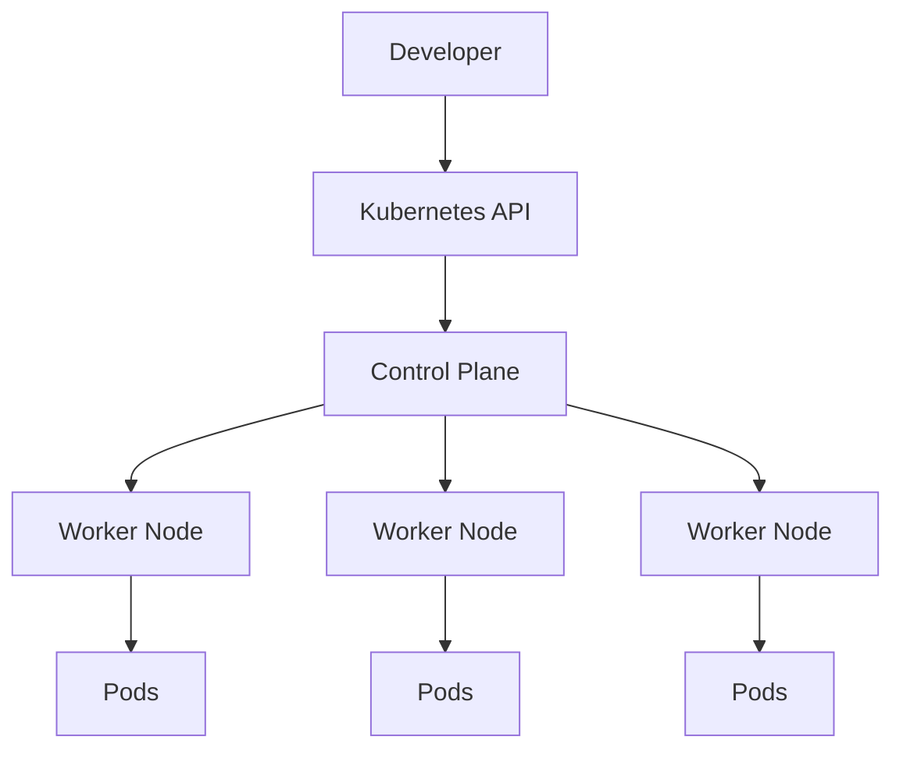

---

# The Linux Foundation of Kubernetes

Kubernetes does not create new operating system concepts.

Instead it orchestrates Linux primitives.

| Kubernetes      | Linux Foundation       |
| --------------- | ---------------------- |
| Pod             | Processes + Namespaces |
| Container       | Linux Process          |
| Resource Limits | cgroups                |
| Networking      | Linux Network Stack    |
| Storage         | Linux Filesystems      |
| Security        | Linux Security Model   |
| Service         | Linux Networking       |
| Node            | Linux Server           |

---

# Kubernetes Architecture

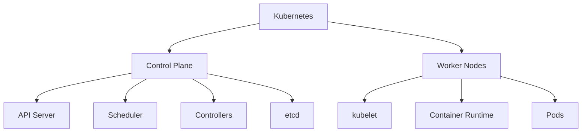

---

# Kubernetes Is a Distributed Operating System

Think about Linux.

Linux manages:

```text id="a5"
CPU

Memory

Storage

Processes
```

on one machine.

Kubernetes manages:

```text id="a6"
CPU

Memory

Storage

Processes
```

across thousands of machines.

---

# Linux vs Kubernetes

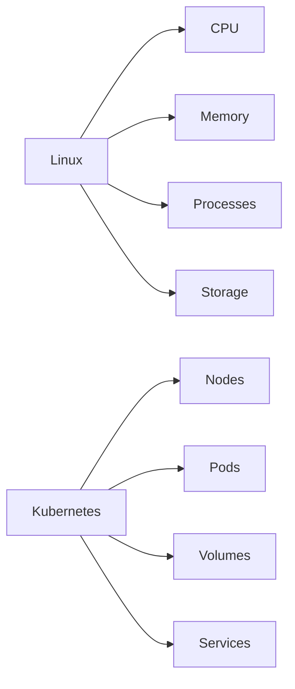

---

# Kubernetes Node Architecture

A node is simply:

```text id="a7"
A Linux Server
```

running Kubernetes components.

---

# Worker Node Architecture

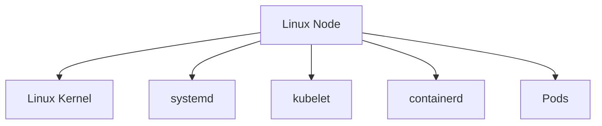

---

# Node Internals

Every Kubernetes node contains:

```text id="a8"
Linux Kernel

systemd

kubelet

Container Runtime

Network Components

Storage Components
```

---

# The Container Reality

Many people think:

```text id="a9"
Pod
     ↓
Container
     ↓
Magic
```

Reality:

```text id="a10"
Pod
     ↓
Container
     ↓
Linux Process
```

---

# Pod Architecture

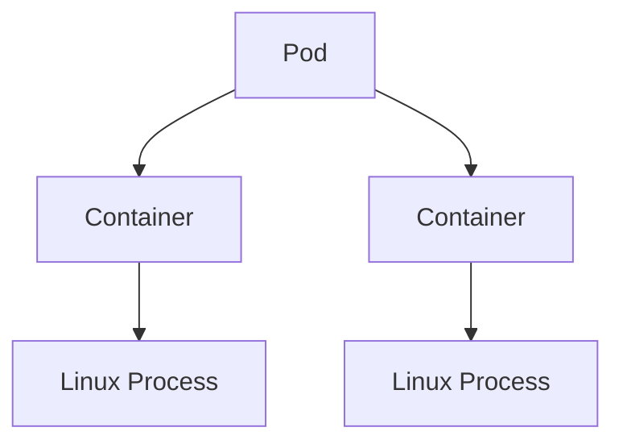

---

# Pod = Namespace Boundary

A Pod is primarily:

```text id="a11"
Shared Network Namespace

Shared IPC Namespace

Shared Storage
```

---

# Pod Namespace Architecture

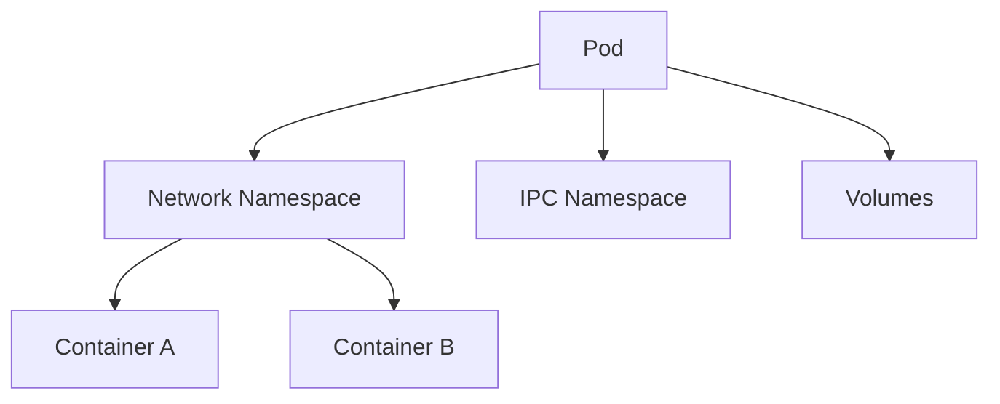

---

# Why Containers in Same Pod Communicate Easily

Because they share:

```text id="a12"
Network Namespace
```

Therefore:

```text id="a13"
localhost works
```

between containers.

---

# Container Runtime Architecture

Modern Kubernetes uses:

```text id="a14"
containerd
```

most commonly.

---

# Runtime Stack

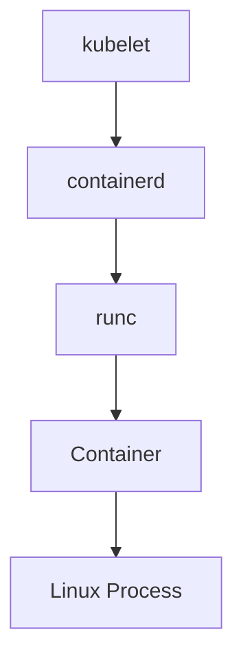

---

# Container Creation Flow

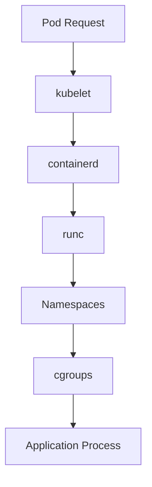

---

# Namespaces in Kubernetes

Namespaces provide isolation.

---

# Namespace Usage

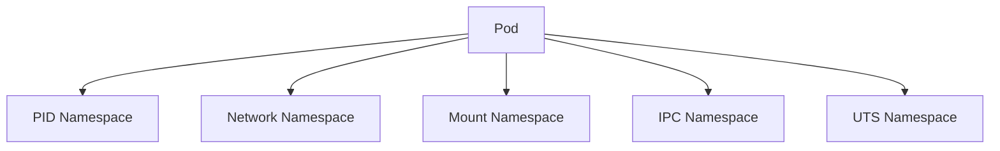

---

# cgroups in Kubernetes

Resource limits become cgroup limits.

Example:

```yaml
resources:
  limits:
    memory: "512Mi"
```

Linux enforces this using:

```text id="a15"
cgroups
```

---

# cgroup Architecture

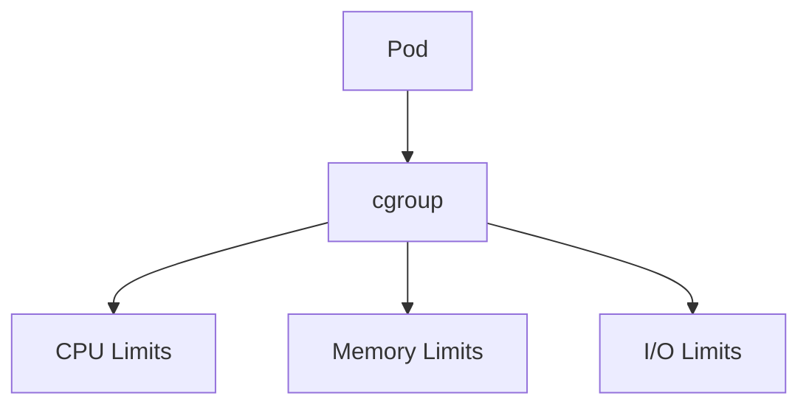

---

# Why Pods Get OOMKilled

Flow:

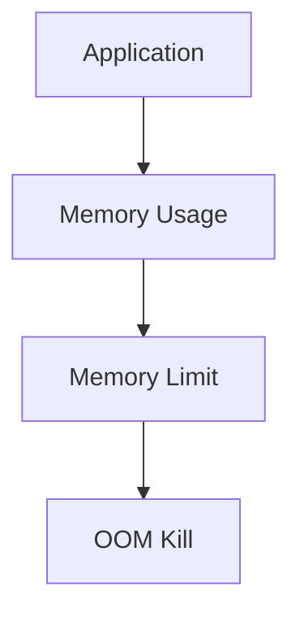

This is Linux memory management.

Not Kubernetes magic.

---

# Kubernetes Networking

One of Kubernetes' most important ideas:

> Every Pod gets an IP.

---

# Pod Networking Model

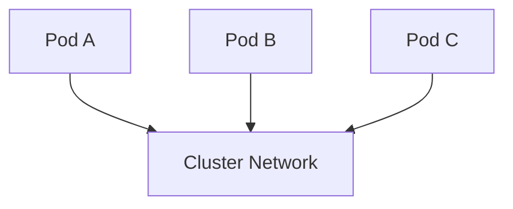

---

# Linux Networking Foundation

Kubernetes networking uses:

```text id="a16"
Network Namespaces

veth Pairs

Linux Bridges

Routing Tables

iptables / nftables
```

---

# Pod Networking Internals


---

# Service Architecture

Services provide stable networking.

---

# Service Flow

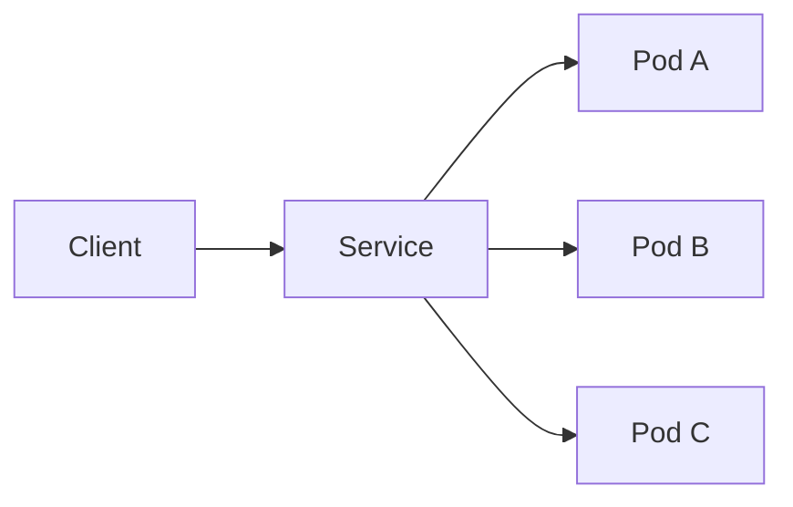

---

# Service Internals

Services use:

```text id="a17"
iptables

IPVS

eBPF
```

depending on implementation.

---

# kube-proxy Architecture

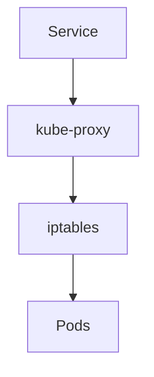

---

# Storage Architecture

Pods are ephemeral.

Persistent storage requires volumes.

---

# Volume Architecture

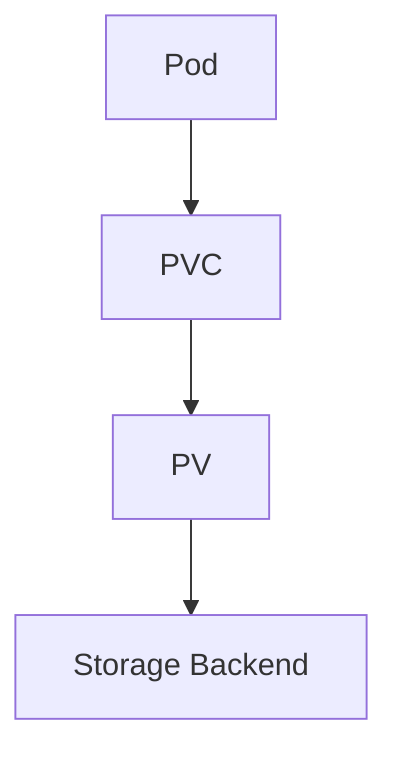

---

# Linux Storage Foundation

Ultimately:

```text id="a18"
Filesystem

Block Device

Storage Driver
```

are doing the work.

---

# CSI Architecture

Container Storage Interface.

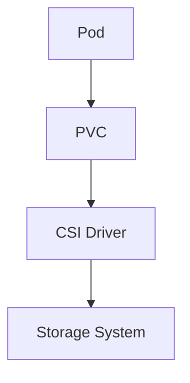

---

# Control Plane Architecture

The brain of Kubernetes.

---

# Control Plane Components

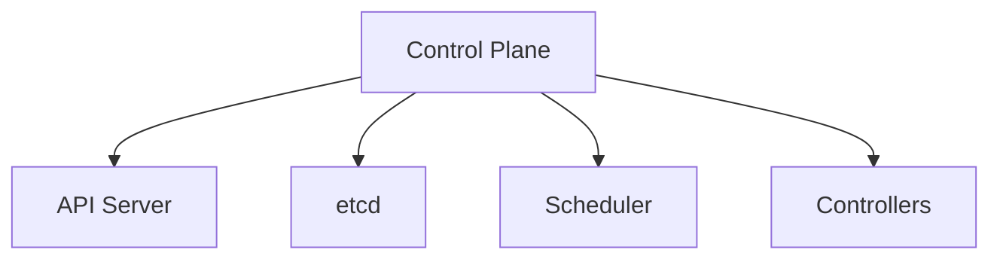

---

# API Server

Everything goes through:

```text id="a19"
kube-apiserver
```

---

# Request Flow

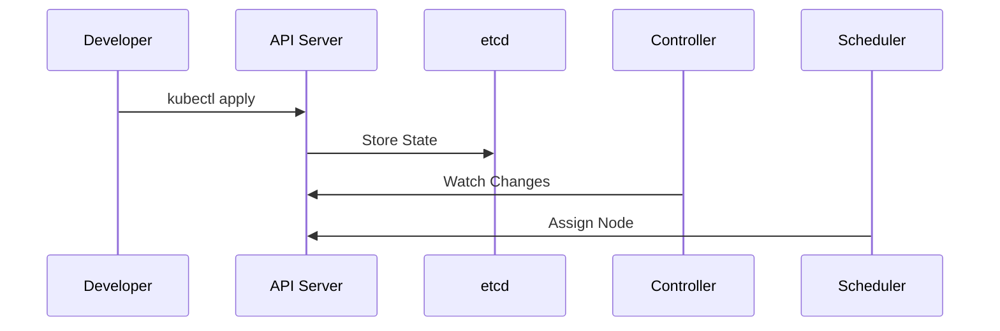

---

# etcd

The cluster database.

Stores:

```text id="a20"
Cluster State

Pods

Services

Deployments

Secrets
```

---

# etcd Architecture

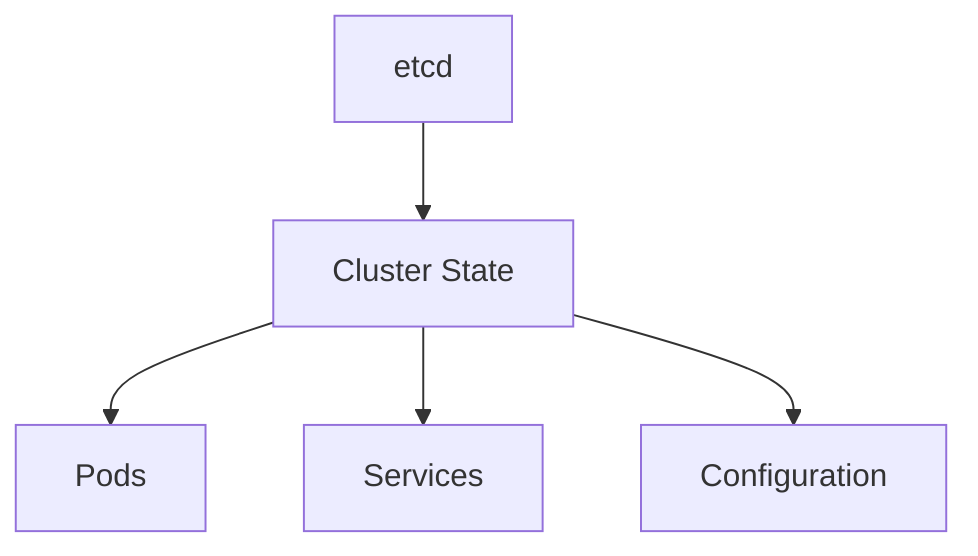

---

# Scheduler

The scheduler answers:

```text id="a21"
Which node should run this Pod?
```

---

# Scheduling Flow

```mermaid
flowchart TD

POD["New Pod"]

POD --> SCHED["Scheduler"]

SCHED --> NODE["Best Node"]

NODE --> KUBELET["kubelet"]

KUBELET --> RUNNING["Running Pod"]
```

---

# Controllers

Controllers continuously reconcile reality.

---

# Controller Loop

```mermaid
flowchart TD

DESIRED["Desired State"]

DESIRED --> CONTROLLER["Controller"]

CONTROLLER --> ACTUAL["Actual State"]

ACTUAL --> CONTROLLER
```

---

# The Kubernetes Philosophy

Kubernetes is:

```text id="a22"
Declarative
```

not:

```text id="a23"
Imperative
```

You describe:

```text id="a24"
Desired State
```

Kubernetes makes it happen.

---

# Deployment Architecture

```mermaid
graph TD

DEPLOY["Deployment"]

DEPLOY --> RS["ReplicaSet"]

RS --> POD1["Pod"]

RS --> POD2["Pod"]

RS --> POD3["Pod"]
```

---

# Self-Healing

If a Pod dies:

```mermaid
flowchart TD

POD["Pod"]

POD --> CRASH["Crash"]

CRASH --> CONTROLLER["Controller"]

CONTROLLER --> NEWPOD["Create New Pod"]
```

---

# Kubernetes and Linux Processes

At the deepest level:

```text id="a25"
Pod
 ↓
Container
 ↓
Linux Process
```

Everything eventually becomes:

```text id="a26"
PID

Memory

CPU

Network

Filesystem
```

managed by Linux.

---

# Production Request Flow

```mermaid
flowchart LR

USER["User"]

USER --> INGRESS["Ingress"]

INGRESS --> SERVICE["Service"]

SERVICE --> POD["Pod"]

POD --> CONTAINER["Container"]

CONTAINER --> PROCESS["Linux Process"]

PROCESS --> DATABASE["Database"]
```

---

# Complete Kubernetes Foundation Map

```mermaid
mindmap
  root((Kubernetes))

    Linux
      Processes
      Namespaces
      cgroups
      Networking
      Storage

    Control Plane
      API Server
      Scheduler
      Controllers
      etcd

    Nodes
      kubelet
      containerd

    Workloads
      Pods
      Deployments

    Networking
      Services
      Ingress

    Storage
      PV
      PVC
      CSI
```

---

# Common Misconceptions

### Pods Are Not Containers

Pods contain containers.

---

### Containers Are Not Virtual Machines

Containers are Linux processes.

---

### Kubernetes Does Not Replace Linux

Kubernetes depends on Linux.

---

### Resource Limits Are Linux cgroups

Not Kubernetes magic.

---

### Networking Is Linux Networking

Not Kubernetes networking.

---

# Troubleshooting Mindset

When Kubernetes fails:

Think Linux.

```mermaid
flowchart TD

PROBLEM["Problem"]

PROBLEM --> PROCESS["Process?"]

PROBLEM --> MEMORY["Memory?"]

PROBLEM --> NETWORK["Network?"]

PROBLEM --> STORAGE["Storage?"]

PROBLEM --> SECURITY["Permissions?"]
```

Most answers exist in Linux.

---

# Interview Questions

### Why is Kubernetes built on Linux?

### What Linux features make containers possible?

### What is a Pod?

### Why does every Pod get an IP?

### What is kubelet?

### What is containerd?

### What is runc?

### How do cgroups work?

### Why do Pods get OOMKilled?

### How does kube-proxy work?

### What is etcd?

### What is the scheduler?

### What is a controller?

### What is desired state?

### How does Kubernetes self-heal?

---

# One-Page Architecture Summary

```text id="a27"
Application
      ↓
Linux Process
      ↓
Container
      ↓
Pod
      ↓
Node
      ↓
Cluster
      ↓
Control Plane
      ↓
Distributed Infrastructure
```

---

# Final Takeaway

Kubernetes is not magic.

Kubernetes is a distributed operating system built on Linux primitives.

Everything ultimately depends on:

```text id="a28"
Processes

Namespaces

cgroups

Networking

Storage

Security
```

Master Linux first, and Kubernetes becomes dramatically easier to understand.

The deepest Kubernetes engineers are almost always strong Linux engineers because Kubernetes is, at its core, Linux scaled across a cluster.
