# Linux Memory Management

## From Virtual Memory to Page Cache, NUMA, and Production Performance

---

# Why This Exists

Memory is one of the most misunderstood parts of Linux.

Most engineers think:

```text
Application
    ↓
RAM
```

Reality:

```text
Application
    ↓
Virtual Memory
    ↓
Page Tables
    ↓
Memory Management Unit (MMU)
    ↓
Physical RAM
    ↓
Page Cache
    ↓
Swap
    ↓
Storage
```

Linux memory management is responsible for:

* Running applications safely
* Isolating processes
* Improving performance
* Preventing crashes
* Managing caches
* Handling memory pressure
* Supporting containers
* Supporting cloud infrastructure

Almost every production issue eventually touches memory.

Examples:

```text
OOM Killers
Memory Leaks
Swap Thrashing
Slow Databases
Container Restarts
Node Failures
Kubernetes Evictions
```

Understanding memory management is essential for becoming a Linux engineer.

---

# The Memory Mental Model

Think of RAM as a hotel.

```text
Hotel = RAM

Rooms = Memory Pages

Guests = Processes

Reception = Kernel

Reservation System = Virtual Memory
```

A process believes:

```text
I own the entire hotel.
```

Reality:

```text
Many processes share the same hotel.
Kernel manages allocations.
```

---

# The Big Picture

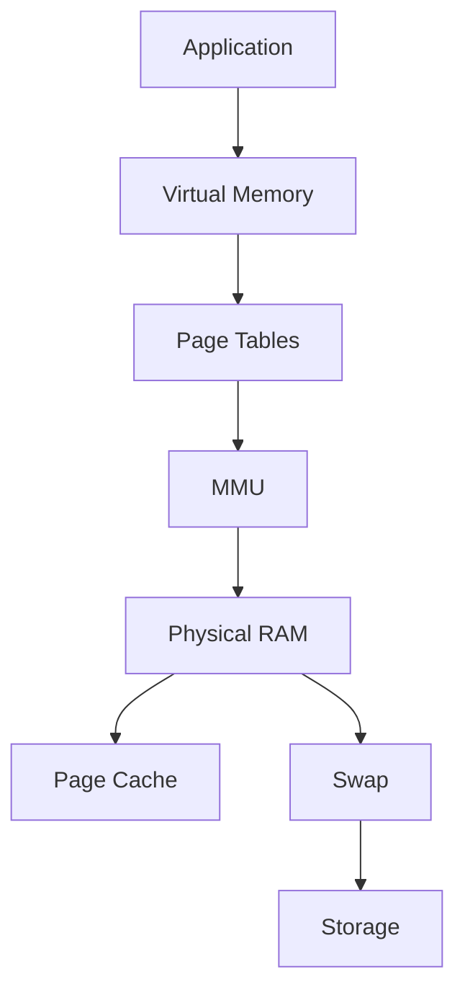

---

# Memory Architecture Overview

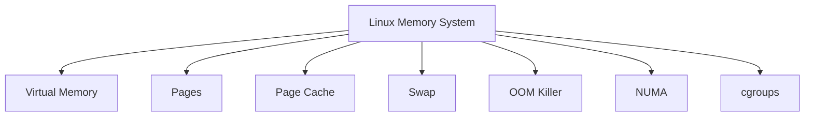

---

# Why Virtual Memory Exists

Without virtual memory:

```text
Process A could overwrite Process B.
```

This would be chaos.

Virtual memory provides:

```text
Isolation

Security

Flexibility

Performance
```

---

# Virtual Memory Architecture

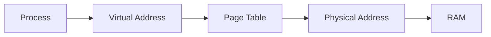

---

# Virtual Address Space

Every process believes:

```text
Memory starts at address 0.
```

Example:

```text
Process A
0x00000000 → 0xFFFFFFFF

Process B
0x00000000 → 0xFFFFFFFF
```

Same addresses.

Different mappings.

---

# Address Translation


---

# Memory Layout of a Process

```text
+----------------------+
| Stack                |
+----------------------+
| Shared Libraries     |
+----------------------+
| Heap                 |
+----------------------+
| Data Segment         |
+----------------------+
| Code Segment         |
+----------------------+
```

---

# Process Memory Components

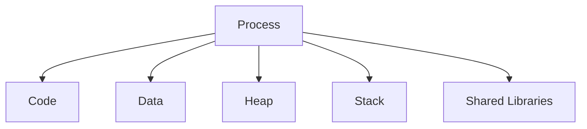

---

# Code Segment

Contains:

```text
Executable Instructions
```

Typically:

```text
Read Only
```

---

# Data Segment

Stores:

```text
Global Variables

Static Variables
```

---

# Heap

Dynamic allocations.

Examples:

```c
malloc()
new
calloc()
```

Heap grows upward.

---

# Stack

Stores:

```text
Function Calls

Local Variables

Return Addresses
```

Stack grows downward.

---

# Heap vs Stack

| Heap     | Stack          |
| -------- | -------------- |
| Dynamic  | Automatic      |
| Larger   | Smaller        |
| Slower   | Faster         |
| malloc() | Function Calls |

---

# Memory Pages

Linux manages memory in pages.

Typical size:

```text
4 KB
```

---

# Page Architecture

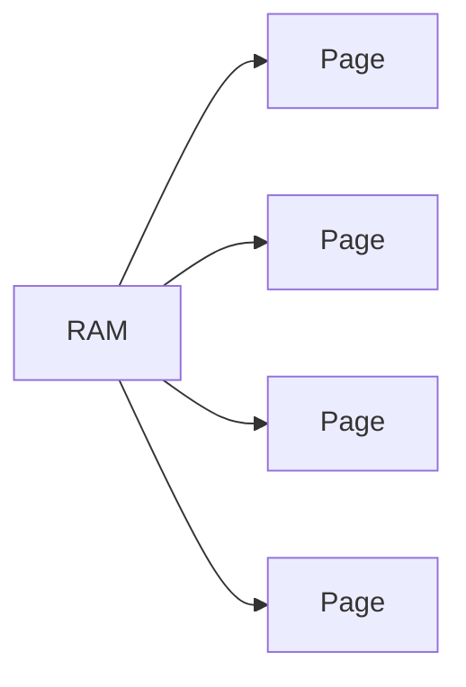

---

# Why Pages Exist

Instead of tracking:

```text
Every Byte
```

Linux tracks:

```text
Memory Pages
```

Much more efficient.

---

# Page Tables

Page tables map:

```text
Virtual Address
     ↓
Physical Address
```

---

# Page Table Architecture


---

# Memory Management Unit (MMU)

Hardware component inside CPU.

Responsibilities:

```text
Address Translation

Memory Protection

Permission Enforcement
```

---

# MMU Architecture

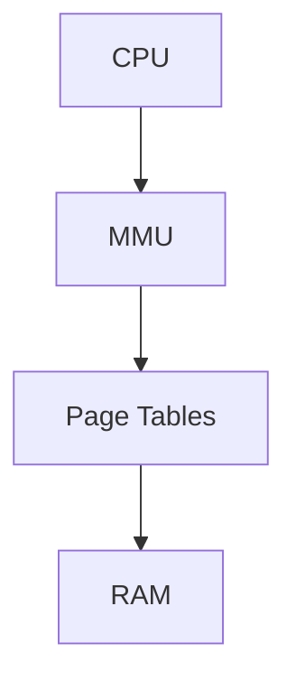

---

# Demand Paging

Linux loads memory only when needed.

Instead of:

```text
Load Entire Program
```

Linux does:

```text
Load Pages As Needed
```

---

# Demand Paging Flow

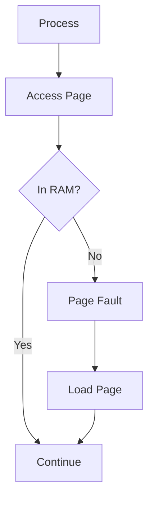

---

# Page Faults

A page fault is not always bad.

Most are normal.

Two types:

```text
Minor Page Fault

Major Page Fault
```

---

# Minor Page Fault

Page exists in memory.

Only mapping required.

Fast.

---

# Major Page Fault

Disk access required.

Slow.

---

# Check Page Faults

```bash
vmstat 1
```

or

```bash
sar -B
```

---

# Page Cache

One of Linux's most important optimizations.

---

# Why Page Cache Exists

RAM:

```text
Nanoseconds
```

SSD:

```text
Microseconds
```

Disk:

```text
Milliseconds
```

RAM is dramatically faster.

---

# Page Cache Architecture


---

# Read Operation

First read:

```text
Disk → RAM Cache
```

Second read:

```text
RAM Cache → Application
```

Much faster.

---

# Page Cache Flow

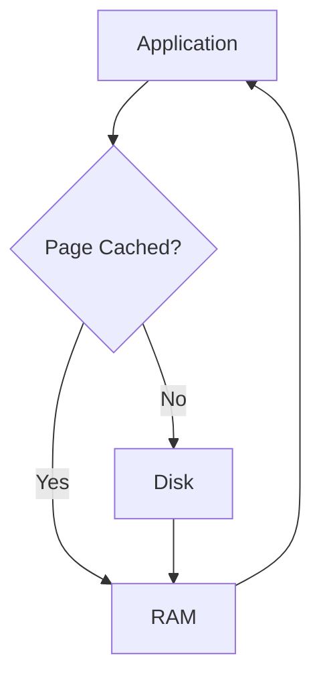

---

# Cached Memory Confusion

Many engineers panic when:

```bash
free -h
```

shows:

```text
Used: 95%
```

Often this is:

```text
Page Cache
```

not application memory.

Linux uses free RAM aggressively.

Unused RAM is wasted RAM.

---

# Memory Types

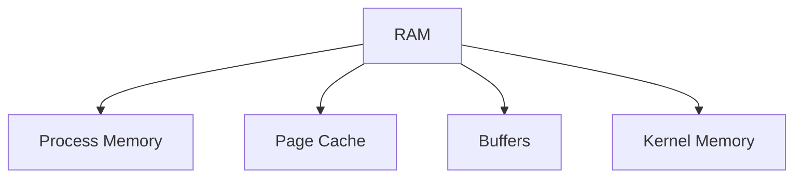

---

# View Memory Usage

```bash
free -h
```

---

# Detailed Memory Information

```bash
cat /proc/meminfo
```

---

# Swap

Swap extends memory onto disk.

---

# Swap Architecture

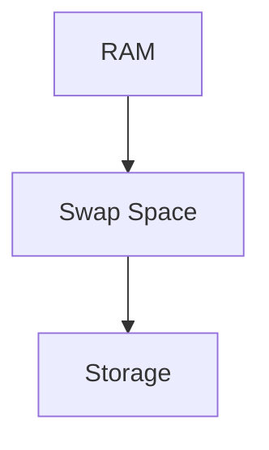

---

# Why Swap Exists

Without swap:

```text
Memory Full
     ↓
Crash
```

With swap:

```text
Memory Full
     ↓
Move Inactive Pages
     ↓
Continue Running
```

---

# Swap Trade-Off

Benefit:

```text
More Capacity
```

Cost:

```text
Much Slower
```

---

# View Swap

```bash
swapon --show
```

```bash
free -h
```

---

# Swappiness

Controls swap aggressiveness.

View:

```bash
sysctl vm.swappiness
```

Typical:

```text
10–60
```

---

# Memory Pressure

Occurs when:

```text
Memory Demand
>
Available Memory
```

---

# Pressure Flow

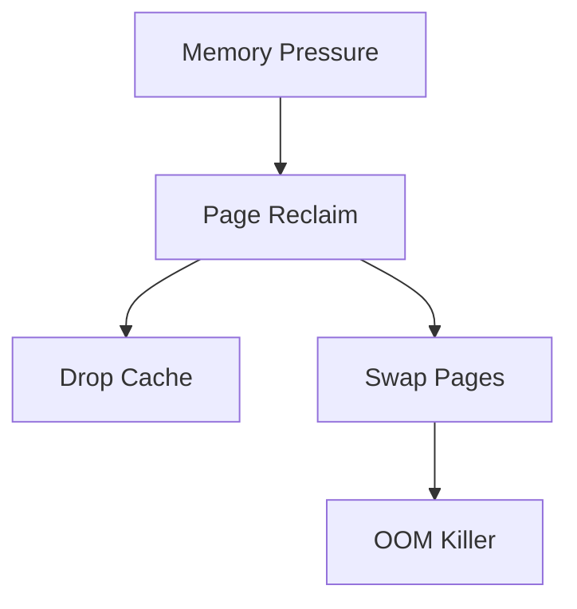

---

# OOM Killer

Out Of Memory Killer.

Last line of defense.

---

# OOM Flow

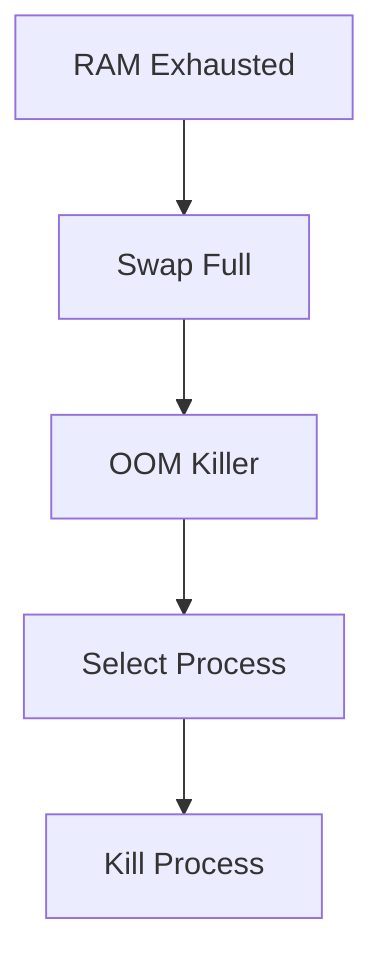

---

# OOM Investigation

```bash
dmesg | grep -i oom
```

or

```bash
journalctl -k | grep -i oom
```

---

# Memory Reclaim

Linux constantly frees memory.

Targets:

```text
Cache

Buffers

Inactive Pages
```

---

# Reclaim Architecture

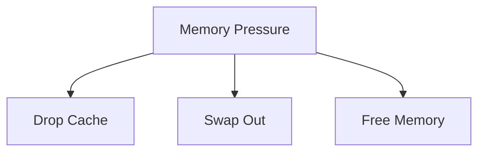

---

# NUMA

Non-Uniform Memory Access.

Common in:

```text
Servers

Databases

Cloud Infrastructure
```

---

# NUMA Architecture

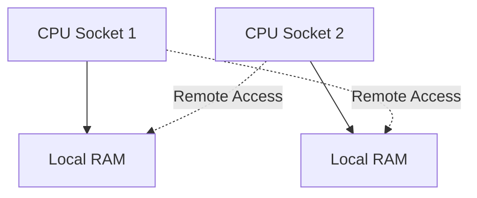

---

# NUMA Performance

Local memory:

```text
Fast
```

Remote memory:

```text
Slower
```

---

# NUMA Commands

```bash
numactl --hardware
```

```bash
numastat
```

---

# Huge Pages

Reduce page table overhead.

Normal:

```text
4 KB Pages
```

Huge Pages:

```text
2 MB

1 GB
```

---

# Huge Page Architecture


---

# Memory and Containers

Containers use:

```text
cgroups
```

for memory limits.

---

# Container Memory Architecture

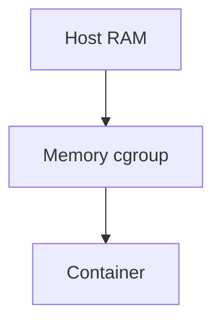

---

# Kubernetes Memory Management

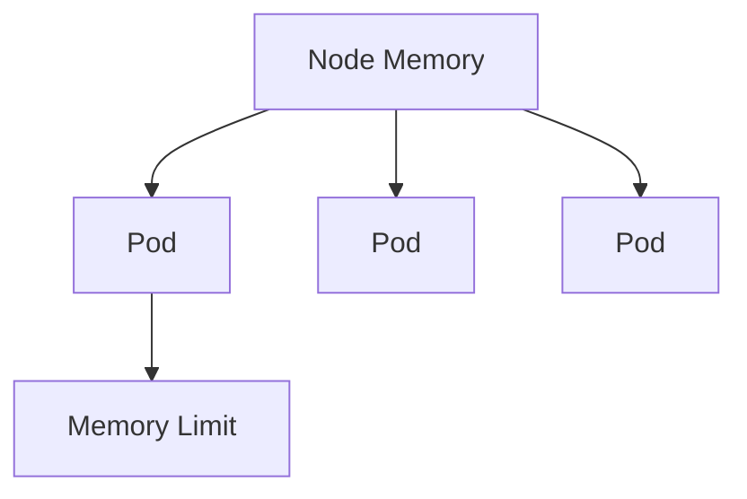

---

# Kubernetes OOM Events

```text
Pod Exceeds Limit
       ↓
OOM Kill
       ↓
Restart
```

---

# Memory Leak Architecture

```mermaid
flowchart TD

APP["Application"]

APP --> ALLOC["Allocate Memory"]

ALLOC --> LOST["Memory Never Freed"]

LOST --> GROWTH["Usage Grows"]

GROWTH --> OOM["OOM Killer"]
```

---

# Detect Memory Leaks

```bash
top

htop

smem

pmap PID
```

---

# Memory Monitoring Tools

```bash
free -h

vmstat

top

htop

sar

smem

numastat
```

---

# Memory Troubleshooting Workflow

```mermaid
flowchart TD

ISSUE["Memory Problem"]

ISSUE --> FREE["free -h"]

FREE --> SWAP{"Swap Used?"}

SWAP -->|Yes| PRESSURE["Memory Pressure"]

SWAP -->|No| CACHE["Page Cache?"]

PRESSURE --> PROCESS["Find Process"]

PROCESS --> OOM["OOM Events"]

OOM --> ROOTCAUSE["Root Cause"]
```

---

# Production Scenarios

## Database Server

```text
Large Page Cache

Minimal Swap

NUMA Awareness
```

---

## Kubernetes Node

```text
Memory Limits

Pod Evictions

OOM Monitoring
```

---

## Redis Server

```text
In-Memory Data

OOM Risk

Memory Fragmentation
```

---

## Java Applications

```text
Large Heap

GC Pressure

Heap Tuning
```

---

# Common Mistakes

### Assuming Cached Memory Is Wasted

Wrong.

Cache improves performance.

---

### Disabling Swap Completely

Can cause abrupt OOM kills.

---

### Ignoring NUMA

Can reduce performance significantly.

---

### Ignoring OOM Events

Often explains mysterious crashes.

---

### Looking Only at free -h

Use:

```bash
vmstat

sar

smem
```

for deeper analysis.

---

# Interview Questions

### What is virtual memory?

### Why does Linux use virtual memory?

### What is a page?

### What is a page table?

### What is the MMU?

### What is a page fault?

### Difference between major and minor page faults?

### What is page cache?

### Why is cached memory not wasted?

### What is swap?

### What is swappiness?

### What is the OOM killer?

### What is NUMA?

### What are huge pages?

### How do containers limit memory?

### Why do Kubernetes pods get OOMKilled?

---

# One-Page Architecture Summary

```text
Application
      ↓
Virtual Memory
      ↓
Page Tables
      ↓
MMU
      ↓
Physical RAM
      ↓
Page Cache
      ↓
Swap
      ↓
Storage
```

---

# Final Takeaway

Linux memory management is far more than RAM allocation.

It is a sophisticated system involving:

```text
Virtual Memory
Pages
Page Tables
MMU
Caching
Swap
Reclaim
OOM Handling
NUMA
Container Isolation
```

Every application, database, container, Kubernetes pod, and cloud workload ultimately depends on these mechanisms.

Master memory management and you gain the ability to diagnose some of the most difficult performance, stability, and scalability problems in modern systems.
