# Linux Networking Stack

## From Application Sockets to Packets on the Wire

---

# Why This Exists

Modern computing is networking.

When a user opens:

```text id="p1k4zj"
https://google.com
```

Linux performs:

```text id="x2v6nd"
DNS Resolution
        ↓
TCP Connection
        ↓
TLS Handshake
        ↓
Packet Routing
        ↓
Network Transmission
        ↓
Response Processing
```

All of this is handled by the Linux networking stack.

Whether you're running:

```text id="d8z7fr"
Nginx
PostgreSQL
Redis
Docker
Kubernetes
Cloud Infrastructure
Load Balancers
Microservices
```

everything ultimately depends on Linux networking.

Understanding the networking stack transforms troubleshooting from guessing into engineering.

---

# The Networking Mental Model

Most beginners think:

```text id="w3n9ks"
Application
      ↓
Internet
```

Reality:

```text id="z7m5xp"
Application
      ↓
Socket
      ↓
TCP/UDP
      ↓
IP
      ↓
Routing
      ↓
Network Interface
      ↓
Switch
      ↓
Router
      ↓
Internet
```

Many layers work together.

---

# The Big Picture

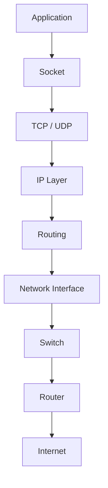

---

# Linux Networking Architecture

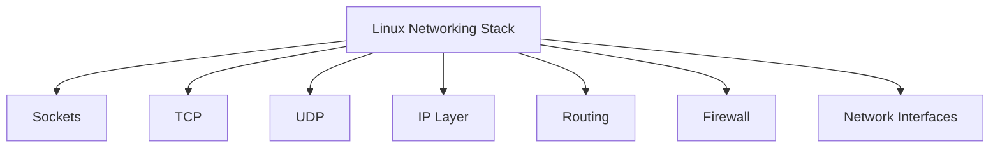

---

# Network Stack Overview

```text id="xt8kmp"
Application
      ↓
Socket API
      ↓
TCP / UDP
      ↓
IP
      ↓
Routing
      ↓
ARP
      ↓
NIC Driver
      ↓
Physical Network
```

---

# The OSI Model

The OSI model is a learning model.

Linux does not implement it literally.

But it helps understand networking.

---

# OSI Layers

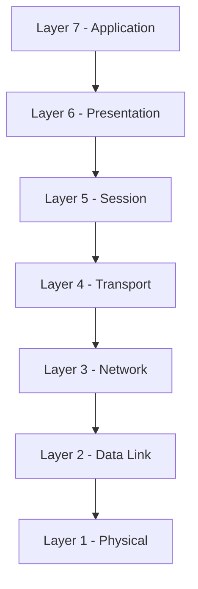

---

# Linux Mapping

```text id="k4rm8x"
Application Layer
    ↓
Socket API

Transport Layer
    ↓
TCP / UDP

Network Layer
    ↓
IP

Data Link Layer
    ↓
Ethernet

Physical Layer
    ↓
Network Hardware
```

---

# The Socket Layer

Applications communicate using sockets.

Examples:

```text id="e7x4pw"
Nginx

Redis

PostgreSQL

SSH

Docker

Kubernetes
```

All use sockets.

---

# Socket Architecture

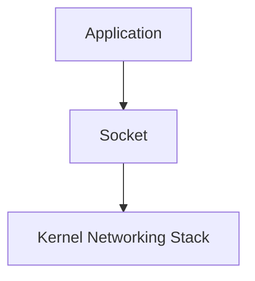

---

# Socket Lifecycle

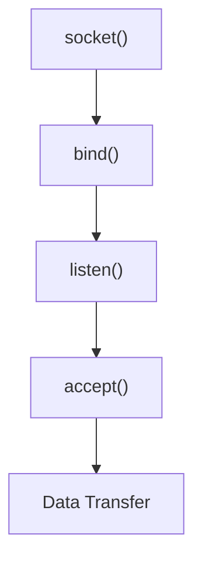

---

# Viewing Open Sockets

```bash id="fd8l1v"
ss -tulpn
```

or

```bash id="l2m9vk"
netstat -tulpn
```

---

# TCP Architecture

TCP provides:

```text id="p7qk6r"
Reliability

Ordering

Flow Control

Congestion Control
```

---

# TCP Stack

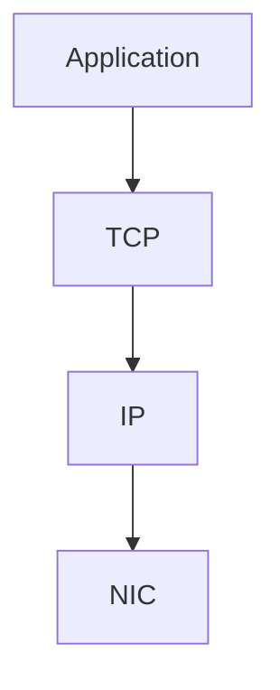

---

# TCP Connection Lifecycle

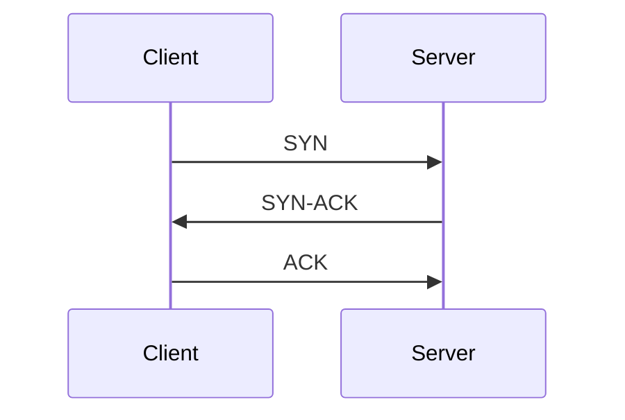

---

# Three-Way Handshake

Purpose:

```text id="u8o1mn"
Verify Connectivity

Establish Session

Negotiate Parameters
```

---

# TCP State Machine

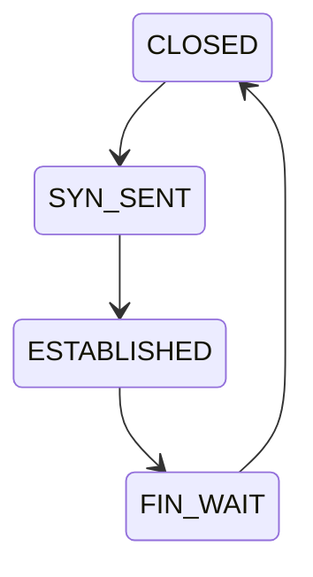

---

# Viewing TCP Connections

```bash id="w7c3dk"
ss -tan
```

---

# UDP Architecture

UDP provides:

```text id="g5t2zw"
Fast

Lightweight

Connectionless
```

No guarantees.

---

# UDP Flow

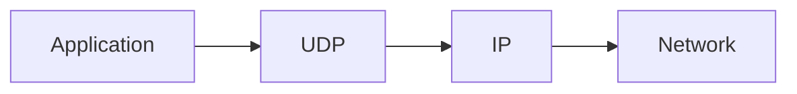

---

# UDP Examples

```text id="i4o8nm"
DNS

DHCP

Streaming

Gaming

Monitoring
```

---

# IP Layer

IP provides:

```text id="f2q7sx"
Addressing

Routing

Packet Delivery
```

---

# IP Architecture

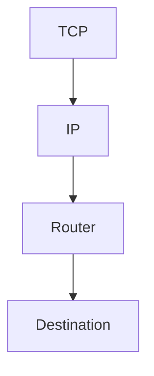

---

# IPv4 Packet

```text id="x9t5fd"
Source IP

Destination IP

TTL

Protocol

Payload
```

---

# Routing

Routing answers:

```text id="n2r6pa"
Where should this packet go?
```

---

# Routing Architecture

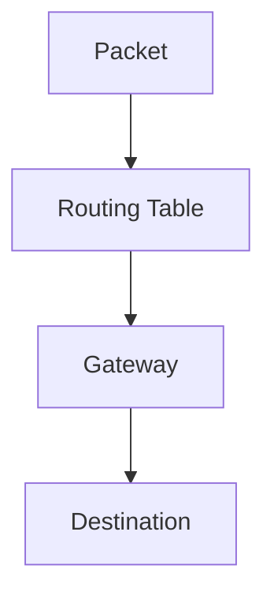

---

# View Routing Table

```bash id="m7y9qa"
ip route
```

---

# Example Route

```text id="b4u2ez"
Destination
Gateway
Interface
Metric
```

---

# ARP

ARP maps:

```text id="u3v5tg"
IP Address
      ↓
MAC Address
```

---

# ARP Architecture

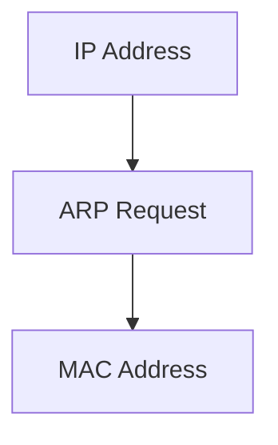

---

# View ARP Cache

```bash id="d8w6yn"
ip neigh
```

---

# Network Interfaces

Everything ultimately leaves through an interface.

Examples:

```text id="y4s9pk"
eth0

ens33

wlan0

lo
```

---

# Interface Architecture

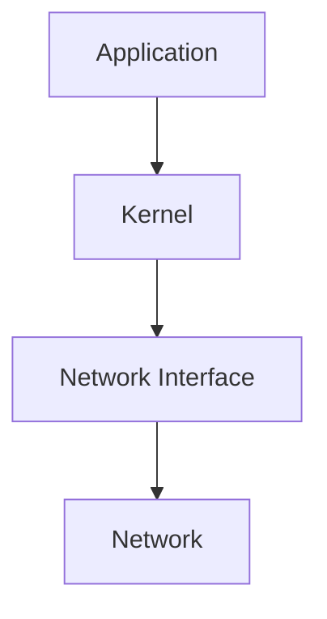

---

# View Interfaces

```bash id="s6o1kx"
ip addr
```

---

# Loopback Interface

Special interface:

```text id="g2m8vt"
127.0.0.1
```

Never leaves the machine.

---

# Loopback Flow

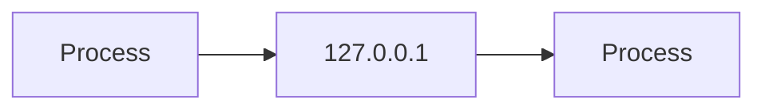

---

# DNS Architecture

DNS translates:

```text id="h5z3dj"
google.com
      ↓
142.250.x.x
```

---

# DNS Flow

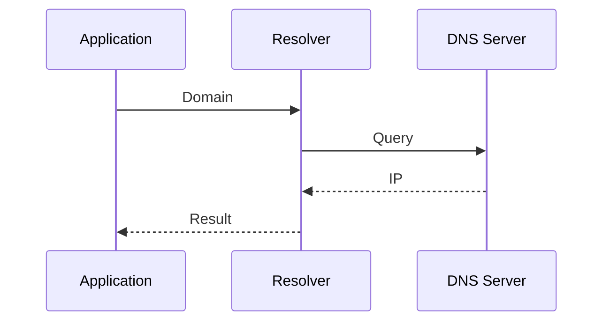

---

# DNS Resolution Path

```text id="e7x9nc"
Application
      ↓
Resolver
      ↓
DNS Server
      ↓
IP Address
      ↓
Connection
```

---

# DNS Tools

```bash id="p9r4xf"
dig google.com

nslookup google.com

host google.com
```

---

# Firewall Architecture

Linux firewalling is usually:

```text id="r3m5ka"
nftables

iptables
```

---

# Firewall Flow

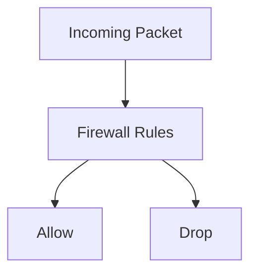

---

# View Firewall Rules

```bash id="t2x6qp"
nft list ruleset
```

or

```bash id="v8k5ur"
iptables -L -n -v
```

---

# Packet Flow Through Linux

One of the most important diagrams.

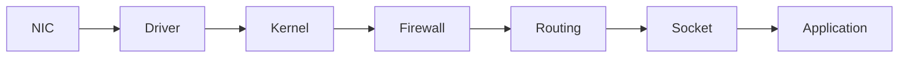

---

# Outbound Packet Flow

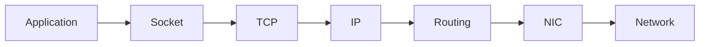

---

# Inbound Packet Flow

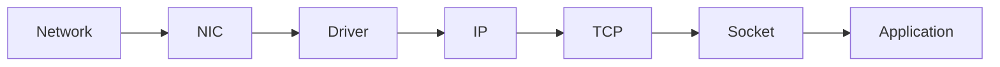

---

# Network Namespaces

Foundation of containers.

---

# Namespace Architecture

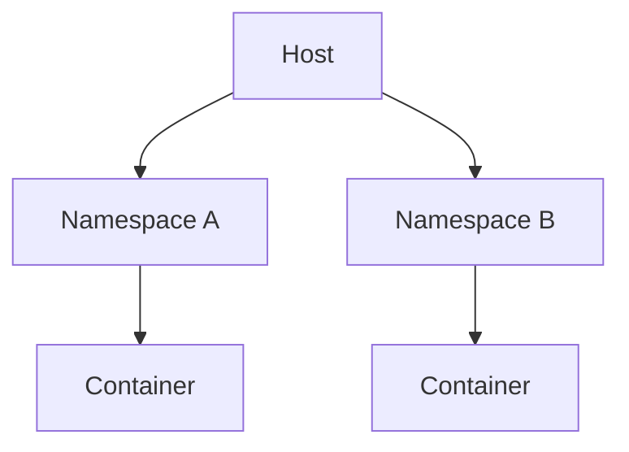

---

# Container Networking

Docker uses:

```text id="a5w9cq"
veth pairs

bridges

NAT
```

---

# Docker Network Flow

```mermaid id="net021"
graph LR

CONTAINER["Container"]

CONTAINER --> VETH["veth"]

VETH --> BRIDGE["docker0"]

BRIDGE --> HOST["Host"]

HOST --> INTERNET["Internet"]
```

---

# Kubernetes Networking

Core principle:

```text id="x4n2ls"
Every Pod Gets An IP
```

---

# Kubernetes Network Model

```mermaid id="net022"
graph TD

POD1["Pod A"]

POD2["Pod B"]

POD3["Pod C"]

POD1 --> NETWORK["Cluster Network"]

POD2 --> NETWORK

POD3 --> NETWORK
```

---

# Load Balancer Architecture

```mermaid id="net023"
graph TD

CLIENT["Clients"]

CLIENT --> LB["Load Balancer"]

LB --> APP1["App Server 1"]

LB --> APP2["App Server 2"]

LB --> APP3["App Server 3"]
```

---

# TLS Architecture

HTTPS uses:

```text id="n5z7ec"
TLS
```

for encryption.

---

# TLS Flow

```mermaid id="net024"
sequenceDiagram

Client->>Server: Client Hello

Server->>Client: Certificate

Client->>Server: Key Exchange

Server->>Client: Secure Session
```

---

# Network Observability

Essential commands:

```bash id="v4m8qa"
ip addr

ip route

ss -tulpn

ping

traceroute

dig

tcpdump

iftop

nload
```

---

# tcpdump Architecture

```mermaid id="net025"
graph TD

NETWORK["Network Traffic"]

NETWORK --> NIC["Interface"]

NIC --> TCPDUMP["tcpdump"]

TCPDUMP --> ANALYSIS["Packet Analysis"]
```

---

# Troubleshooting Flow

```mermaid id="net026"
flowchart TD

ISSUE["Network Problem"]

ISSUE --> DNS{"DNS Works?"}

DNS -->|No| RESOLVE["Fix DNS"]

DNS -->|Yes| PING{"Reachable?"}

PING -->|No| ROUTING["Routing"]

PING -->|Yes| PORT{"Port Open?"}

PORT -->|No| SERVICE["Service Problem"]

PORT -->|Yes| APP["Application Layer"]
```

---

# Common Production Bottlenecks

```text id="k6r2px"
DNS Failures

Packet Loss

Firewall Rules

Routing Errors

TCP Retransmissions

Connection Exhaustion

Load Balancer Misconfiguration

TLS Issues
```

---

# Engineering Mindset

Beginners see:

```text id="t1r4dx"
Website
```

Engineers see:

```text id="u7p3bz"
Application
      ↓
Socket
      ↓
TCP
      ↓
IP
      ↓
Routing
      ↓
NIC
      ↓
Switch
      ↓
Router
      ↓
Internet
```

Every layer can fail.

Understanding the layers makes troubleshooting systematic.

---

# Interview Questions

### What is a socket?

### What is TCP?

### What is UDP?

### Explain the TCP three-way handshake.

### What is IP?

### What is routing?

### What is ARP?

### What is DNS?

### What is NAT?

### What is a network namespace?

### How does Docker networking work?

### How does Kubernetes networking work?

### What is a firewall?

### What is TLS?

### How do packets travel through Linux?

---

# One-Page Architecture Summary

```text id="i9k7qt"
Application
      ↓
Socket
      ↓
TCP / UDP
      ↓
IP
      ↓
Routing
      ↓
NIC
      ↓
Network
      ↓
Destination
```

---

# Final Takeaway

The Linux networking stack is the foundation of modern distributed systems.

Every:

```text id="c5w8my"
Web Request

Database Query

API Call

Docker Container

Kubernetes Pod

Cloud Service
```

ultimately relies on:

```text id="z3q1pn"
Sockets
TCP/UDP
IP
Routing
DNS
Firewalls
Network Interfaces
```

Master the networking stack and you gain the ability to understand, troubleshoot, secure, and scale modern systems from a single server to global cloud infrastructure.
