# Linux Observability Stack

## From Logs, Metrics, and Traces to Production Incident Response

---

# Why This Exists

Production systems fail.

Not sometimes.

Always.

The question is not:

```text
Will production fail?
```

The question is:

```text
When production fails,
can you understand why?
```

Observability exists to answer:

```text
What happened?

Why did it happen?

Where did it happen?

How bad is it?

What should we do next?
```

Without observability:

```text
Production = Guessing
```

With observability:

```text
Production = Engineering
```

Modern companies like:

```text
Google
Netflix
Amazon
Meta
Uber
Cloudflare
```

operate massive Linux infrastructure because they have world-class observability.

---

# The Observability Mental Model

Most beginners think:

```text
Server Monitoring
```

Observability is much bigger.

Think of a hospital.

```text
Doctor
  ↓
Vitals
  ↓
Lab Tests
  ↓
Imaging
  ↓
Diagnosis
```

For systems:

```text
Metrics
  ↓
Logs
  ↓
Traces
  ↓
Events
  ↓
Diagnosis
```

Observability is the ability to understand a system from the outside.

---

# The Big Picture

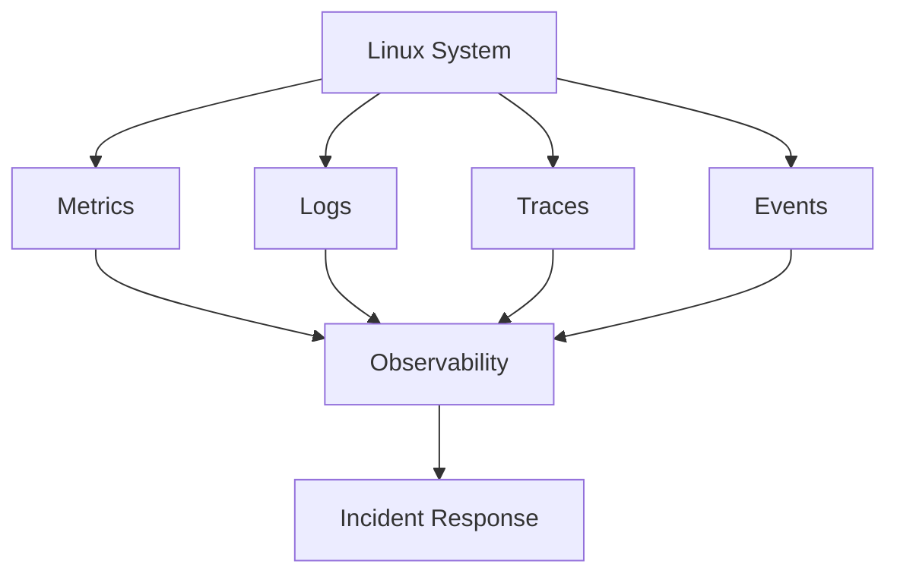

---

# The Three Pillars of Observability

The classic model:

```text
Metrics
Logs
Traces
```

---

# Three Pillars Architecture

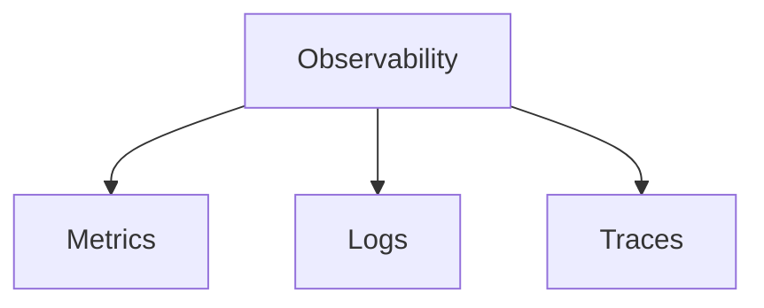

Modern observability often adds:

```text
Events

Profiles

eBPF Data
```

---

# Why Observability Matters

Without observability:

```text
Application Slow
       ↓
No Visibility
       ↓
Guessing
```

With observability:

```text
Application Slow
       ↓
Metrics
       ↓
Logs
       ↓
Trace
       ↓
Root Cause
```

---

# Linux Observability Architecture

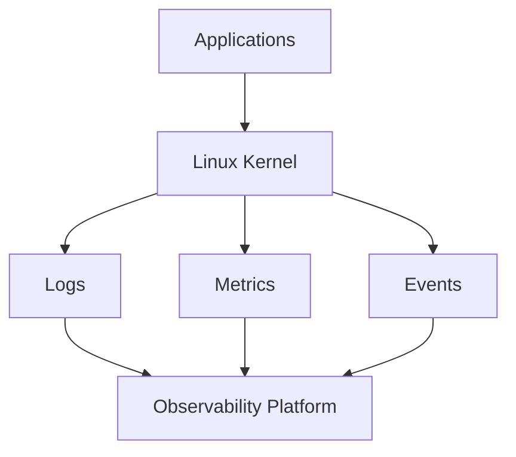

---

# The Observability Stack

```text
Applications
      ↓
Linux Kernel
      ↓
Logs
Metrics
Events
Traces
      ↓
Collection Layer
      ↓
Storage Layer
      ↓
Visualization Layer
      ↓
Engineers
```

---

# Pillar 1: Metrics

Metrics answer:

```text
How much?
How many?
How often?
```

Examples:

```text
CPU Usage

Memory Usage

Disk IOPS

Network Throughput

Requests Per Second
```

---

# Metrics Architecture

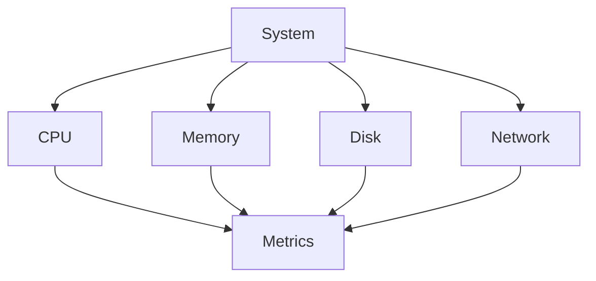

---

# Linux Metrics Sources

```text
/proc

/sys

Kernel Counters

Applications

eBPF
```

---

# Important System Metrics

### CPU

```text
Usage

Load

Steal

Context Switches
```

### Memory

```text
RAM

Swap

Page Faults

Cache
```

### Storage

```text
Latency

IOPS

Throughput

Queue Depth
```

### Network

```text
Bandwidth

Packets

Drops

Errors
```

---

# CPU Observability

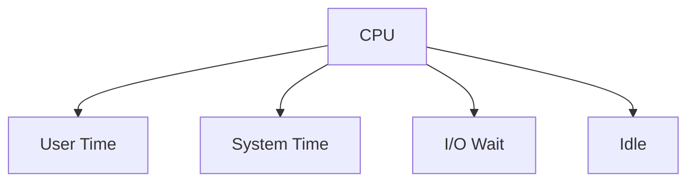

---

# CPU Tools

```bash
top

htop

mpstat

pidstat

sar
```

---

# Memory Tools

```bash
free -h

vmstat

sar

smem
```

---

# Disk Tools

```bash
iostat

iotop

blktrace

fio
```

---

# Network Tools

```bash
ss

iftop

nload

sar -n

tcpdump
```

---

# Metrics Collection Flow

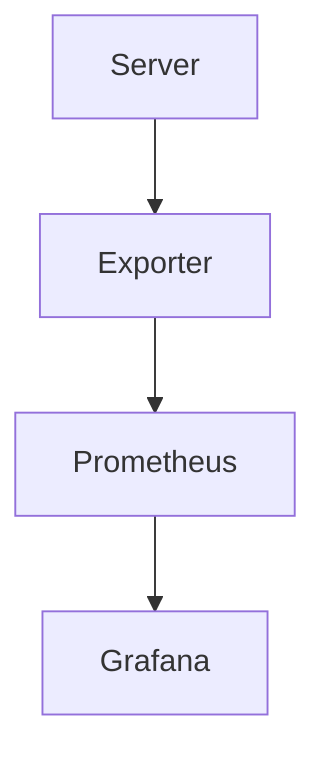

---

# Pillar 2: Logs

Metrics tell you:

```text
Something is wrong.
```

Logs tell you:

```text
What happened.
```

---

# Logging Architecture

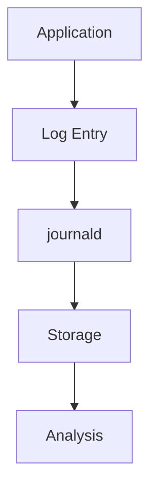

---

# Types of Logs

```text
Application Logs

System Logs

Kernel Logs

Audit Logs

Security Logs
```

---

# Linux Logging Stack

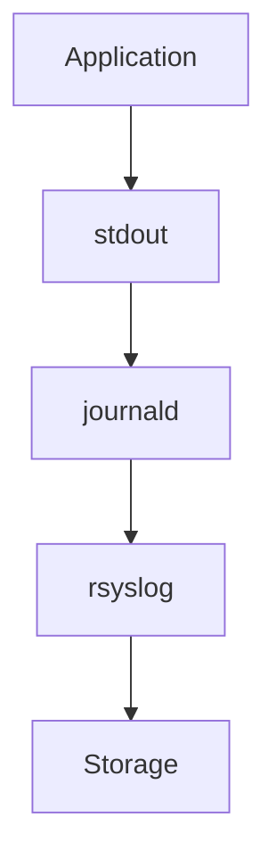

---

# journald

Modern Linux logging service.

View logs:

```bash
journalctl
```

---

# Important Commands

System logs:

```bash
journalctl
```

Kernel logs:

```bash
journalctl -k
```

Service logs:

```bash
journalctl -u nginx
```

Live logs:

```bash
journalctl -f
```

---

# Logging Data Flow

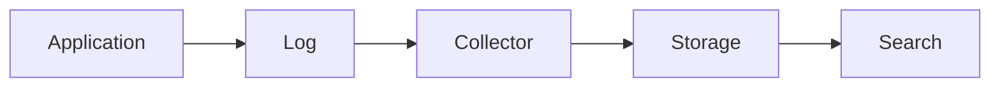

---

# Good Logs

Good logs answer:

```text
Who?

What?

When?

Where?

Why?
```

---

# Bad Logging

Avoid:

```text
Error occurred
```

Prefer:

```text
Database connection timeout after 30s
Host=db-01
User=app-service
```

---

# Structured Logging

Modern systems prefer:

```json
{
  "service":"payments",
  "level":"error",
  "user":"123",
  "message":"db timeout"
}
```

---

# Pillar 3: Tracing

Metrics show:

```text
Something is slow.
```

Logs show:

```text
Errors.
```

Tracing shows:

```text
Where time was spent.
```

---

# Trace Architecture

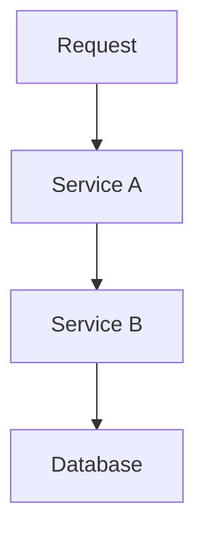

---

# Distributed Tracing

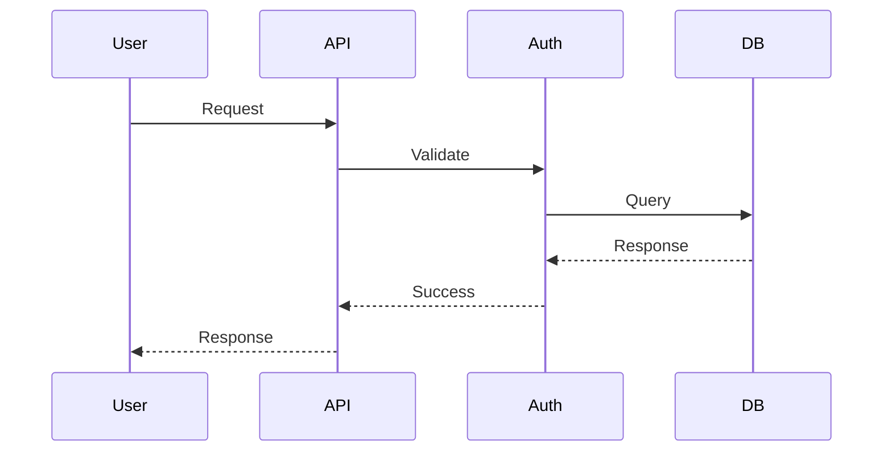

---

# Why Tracing Exists

Microservices create complexity.

Without tracing:

```text
Request Failed
```

With tracing:

```text
Request Failed

Service B

Database Query

Timeout
```

---

# OpenTelemetry

Modern standard for:

```text
Metrics

Logs

Traces
```

---

# OpenTelemetry Architecture

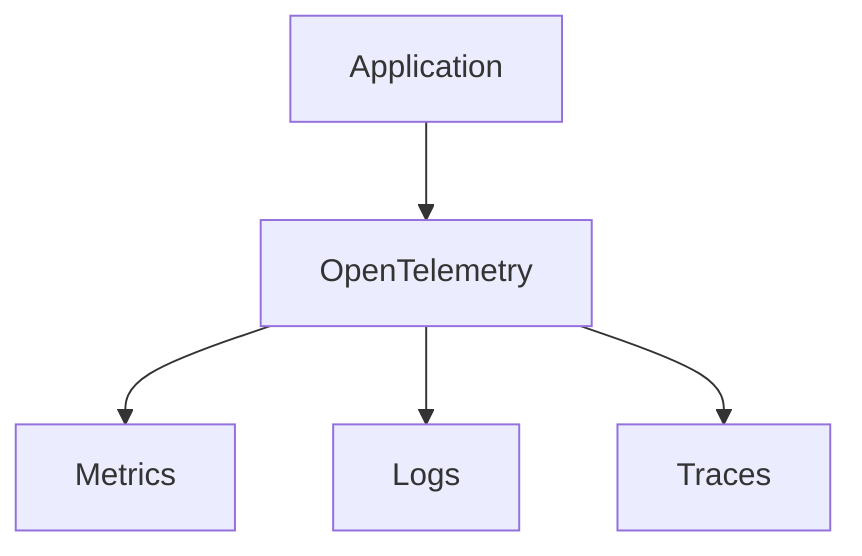

---

# Events

Events represent important changes.

Examples:

```text
Deployment

Restart

OOM Kill

Node Failure

Disk Full
```

---

# Event Flow

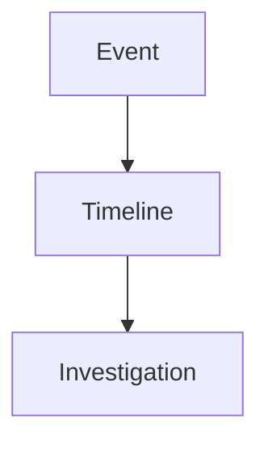

---

# Linux Event Sources

```text
systemd

Kernel

auditd

Applications

Kubernetes
```

---

# eBPF Revolution

Modern observability increasingly uses:

```text
eBPF
```

---

# eBPF Architecture

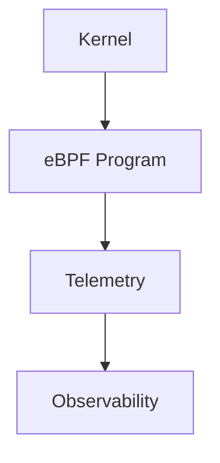

---

# Why eBPF Matters

Traditional monitoring:

```text
Observe from outside
```

eBPF:

```text
Observe inside kernel
```

---

# Linux Kernel Observability

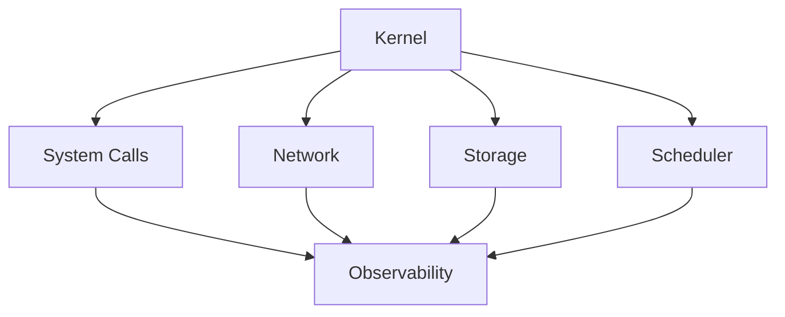

---

# Essential Linux Observability Tools

---

## Process Observability

```bash
ps

top

htop

pidstat

pstree
```

---

## Memory Observability

```bash
free

vmstat

smem

sar
```

---

## Storage Observability

```bash
iostat

iotop

blktrace
```

---

## Network Observability

```bash
ss

netstat

tcpdump

iftop
```

---

## Kernel Observability

```bash
dmesg

perf

strace

ltrace
```

---

# strace Architecture

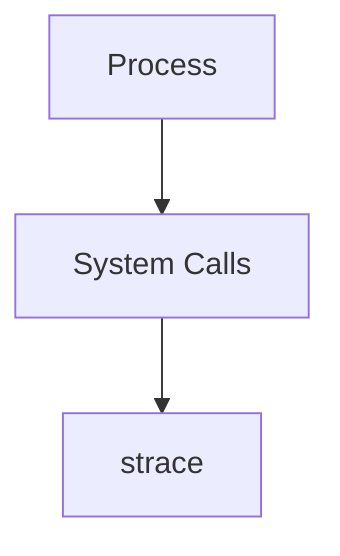

---

# perf Architecture

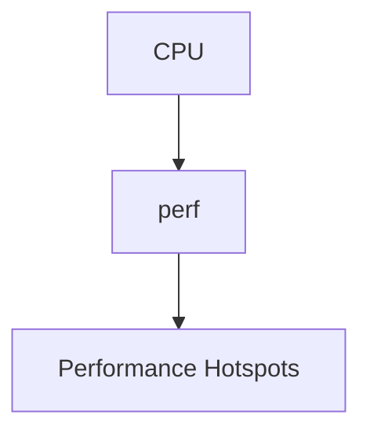

---

# Production Observability Stack

A common architecture:

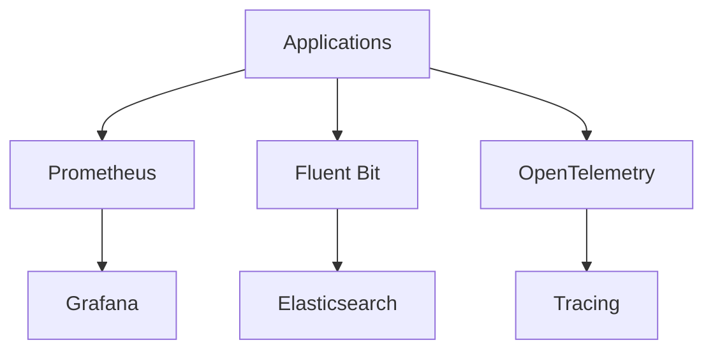

---

# Incident Investigation Workflow

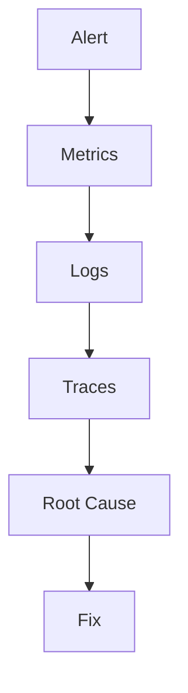

---

# Example Production Incident

## Website Slow

Step 1:

```text
Check Metrics
```

CPU:

```text
Normal
```

Memory:

```text
Normal
```

Disk:

```text
High Latency
```

Step 2:

```text
Check Logs
```

Find:

```text
Database timeout
```

Step 3:

```text
Check Trace
```

Find:

```text
Slow query
```

Root Cause:

```text
Missing Database Index
```

---

# Golden Signals

Popularized by Google.

---

# Four Golden Signals

```text
Latency

Traffic

Errors

Saturation
```

---

# Golden Signal Architecture

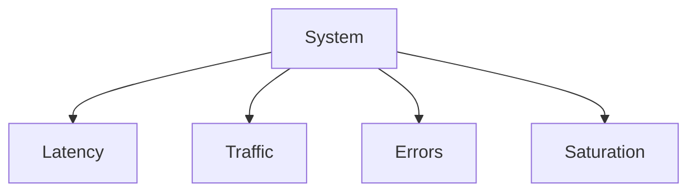

---

# RED Method

For services:

```text
Rate

Errors

Duration
```

---

# USE Method

For resources:

```text
Utilization

Saturation

Errors
```

---

# Common Observability Mistakes

### Monitoring Only CPU

Most incidents are not CPU incidents.

---

### Collecting Logs But Never Reading Them

Data without analysis is useless.

---

### No Correlation Between Metrics and Logs

Root cause becomes difficult.

---

### No Alerting Strategy

Engineers learn about incidents from customers.

---

### Storing Everything Forever

Expensive and often unnecessary.

---

# Engineering Mindset

Beginners see:

```text
Server Running
```

Engineers ask:

```text
How healthy?

How fast?

How reliable?

How observable?

How recoverable?
```

Observability converts unknown systems into understandable systems.

---

# Interview Questions

### What is observability?

### Difference between monitoring and observability?

### What are the three pillars?

### What are metrics?

### What are logs?

### What are traces?

### What is journald?

### What is OpenTelemetry?

### What is eBPF?

### What are the four golden signals?

### What is the RED method?

### What is the USE method?

### How do you investigate a production incident?

### What is distributed tracing?

### Why is observability important?

---

# Complete Observability Map

```mermaid
mindmap
  root((Observability))

    Metrics
      CPU
      Memory
      Storage
      Network

    Logs
      Application
      System
      Security

    Traces
      Requests
      Microservices

    Events
      Deployments
      Failures

    eBPF
      Kernel Visibility

    Incident Response
      Detection
      Investigation
      Recovery
```

---

# One-Page Architecture Summary

```text
Applications
      ↓
Linux Kernel
      ↓
Metrics
Logs
Traces
Events
      ↓
Collection
      ↓
Storage
      ↓
Visualization
      ↓
Engineers
      ↓
Incident Response
```

---

# Final Takeaway

Observability is the nervous system of modern infrastructure.

Without observability:

```text
You operate blindly.
```

With observability:

```text
You understand reality.
```

Linux provides the foundation through:

```text
Kernel Metrics
System Logs
Process Information
Network Visibility
Storage Telemetry
eBPF Instrumentation
```

Modern observability platforms simply build on top of these Linux foundations.

Master Linux observability and you gain the ability to diagnose, troubleshoot, optimize, and operate production systems at scale.
