# Linux Process Lifecycle

## From Program Execution to Process Termination

---

# Why This Exists

Everything running on Linux is a process.

When you open:

```bash
vim
```

Linux creates a process.

When Nginx starts:

```bash
systemctl start nginx
```

Linux creates processes.

When Kubernetes launches a container:

```text
Container
   ↓
Processes
```

When PostgreSQL handles queries:

```text
Database
   ↓
Processes
```

Understanding processes is one of the most important skills in Linux engineering.

Most production issues eventually involve:

```text
CPU
Memory
Threads
Scheduling
Signals
Zombie Processes
Deadlocks
Resource Exhaustion
```

Understanding the process lifecycle allows engineers to troubleshoot these issues systematically.

---

# The Process Mental Model

A program is not a process.

A process is:

```text
Program
   +
Memory
   +
CPU State
   +
Resources
   +
Execution Context
```

Think of it as:

```text
Blueprint = Program

Building = Process
```

---

# Linux Process Architecture

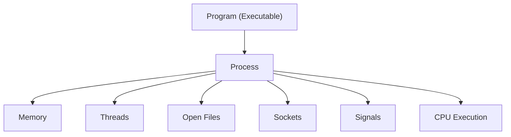

---

# The Complete Process Lifecycle

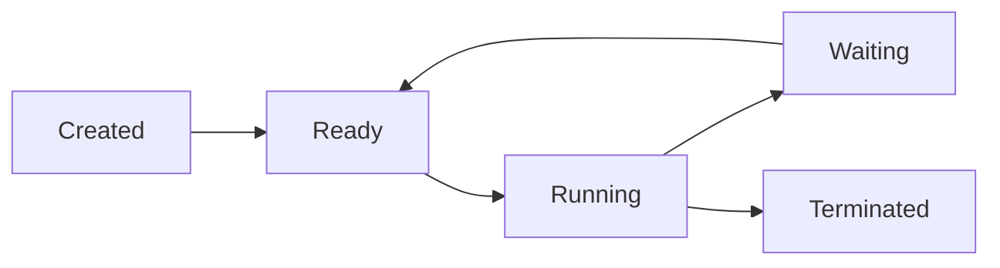

This lifecycle exists for every process in Linux.

---

# What Is a Process?

A process is an executing instance of a program.

Example:

```bash
/usr/bin/nginx
```

is a program.

When started:

```text
nginx PID 1234
```

it becomes a process.

---

# Process Components

Every process contains:

```text
Executable Code

Memory

Stack

Heap

Threads

Open Files

Network Sockets

Environment Variables

Security Context
```

---

# Process Structure

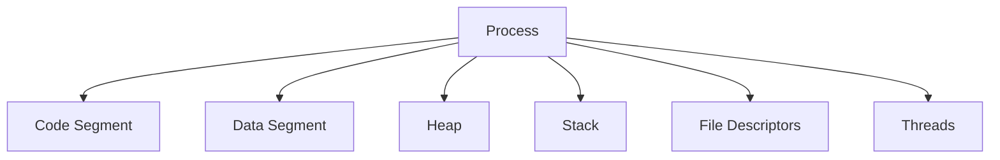

---

# Process Creation

Linux creates processes using:

```c
fork()
```

and

```c
exec()
```

---

# Why Two System Calls?

Linux separates:

```text
Create Process

Run Program
```

into two operations.

---

# Process Creation Flow

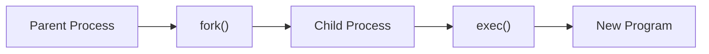

---

# Example

When Bash launches:

```bash
ls
```

Internally:

```text
bash
  ↓
fork()
  ↓
child process
  ↓
exec(ls)
  ↓
ls process
```

---

# Process Tree

Every process originates from PID 1.

---

# PID Hierarchy

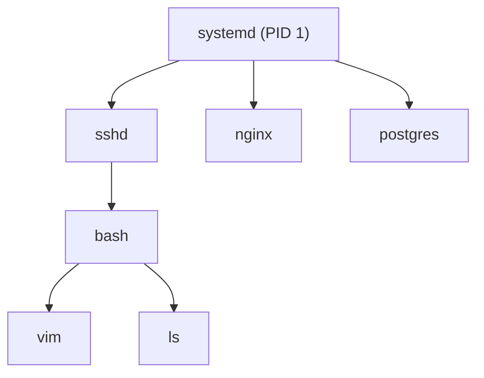

---

# Viewing Process Trees

```bash
pstree
```

or

```bash
pstree -p
```

---

# Process States

Linux processes constantly move between states.

---

# State Machine

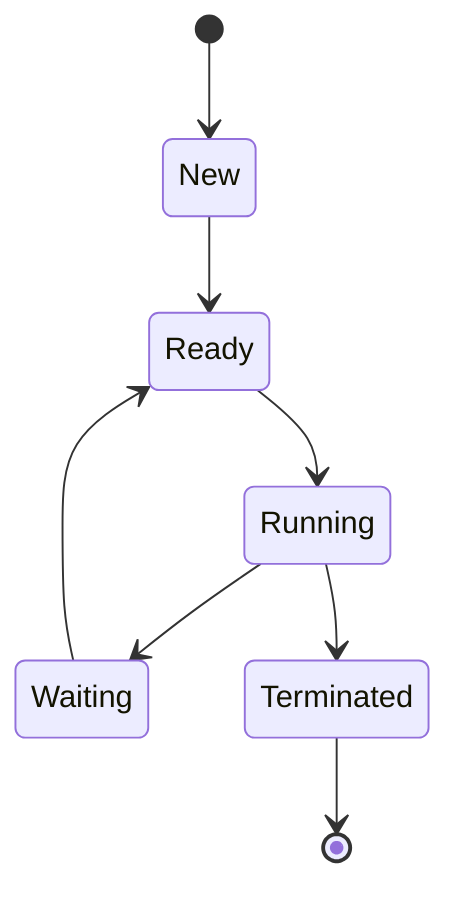

---

# Common Linux States

| State | Meaning               |
| ----- | --------------------- |
| R     | Running               |
| S     | Sleeping              |
| D     | Uninterruptible Sleep |
| T     | Stopped               |
| Z     | Zombie                |

---

# Viewing Process States

```bash
ps aux
```

Example:

```text
R Running
S Sleeping
Z Zombie
```

---

# Running State

Process currently owns CPU.

```text
CPU Executing Instructions
```

---

# Ready State

Process wants CPU.

Waiting in scheduler queue.

---

# Waiting State

Process waits for:

```text
Disk I/O
Network I/O
User Input
Locks
```

---

# Waiting Example

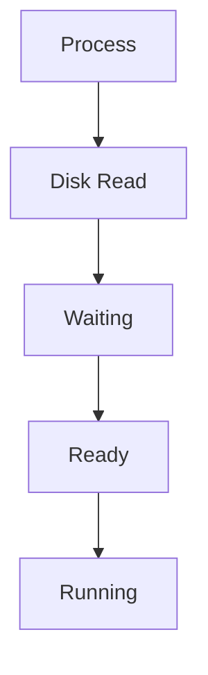

---

# Sleeping State

Most Linux processes spend most of their life sleeping.

Example:

```text
Nginx waiting for requests

Database waiting for queries

SSH waiting for connections
```

---

# Uninterruptible Sleep (D State)

One of the most dangerous states.

Usually indicates:

```text
Storage Issues

NFS Problems

Hardware Delays

Kernel Waits
```

Check:

```bash
ps aux | grep D
```

---

# Zombie Processes

Zombie:

```text
Dead Process
Still Has PID Entry
```

---

# Zombie Architecture

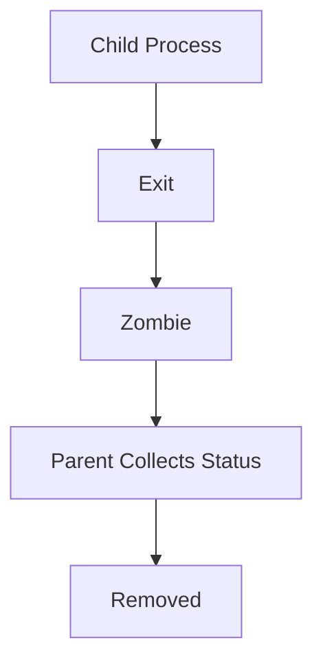

---

# Why Zombies Exist

Parent process must collect:

```text
Exit Status
Resource Usage
```

using:

```c
wait()
```

---

# Viewing Zombies

```bash
ps aux | grep Z
```

---

# Process Termination

Processes exit via:

```text
Normal Exit

Signal

Crash

OOM Killer
```

---

# Termination Flow

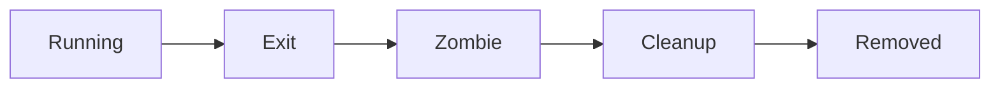

---

# Exit Status

Every process returns:

```text
0 = Success

Non-Zero = Failure
```

---

# Checking Exit Status

```bash
echo $?
```

---

# Signals

Signals allow processes to communicate.

---

# Signal Architecture

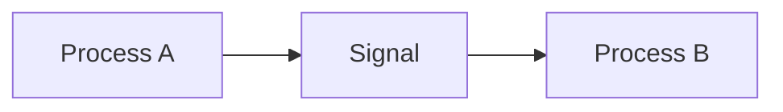

---

# Common Signals

| Signal  | Purpose        |
| ------- | -------------- |
| SIGTERM | Graceful Stop  |
| SIGKILL | Immediate Kill |
| SIGINT  | Ctrl+C         |
| SIGHUP  | Reload         |
| SIGSTOP | Pause          |
| SIGCONT | Resume         |

---

# Signal Flow

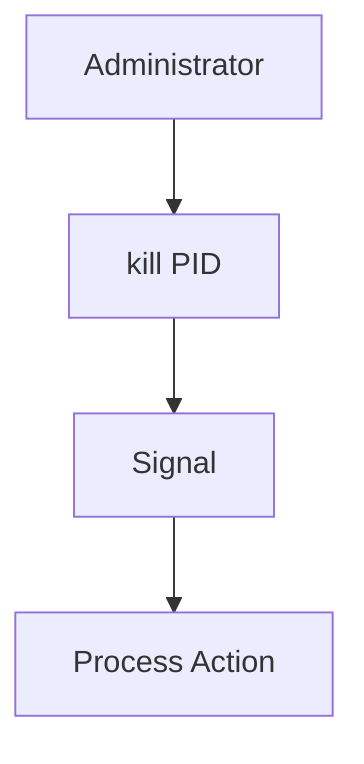

---

# Process Termination Commands

Graceful:

```bash
kill PID
```

Force:

```bash
kill -9 PID
```

---

# Why SIGKILL Is Dangerous

SIGKILL:

```text
No Cleanup

No Shutdown Logic

No Data Flush
```

Prefer:

```text
SIGTERM
```

first.

---

# Scheduling

Linux must decide:

```text
Who Gets CPU Next?
```

---

# Scheduler Architecture

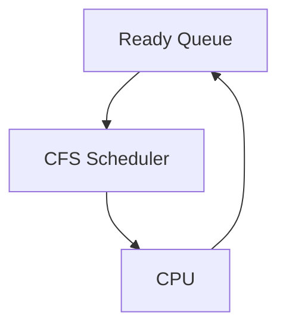

---

# Linux Scheduler

Modern Linux uses:

```text
CFS
Completely Fair Scheduler
```

---

# Scheduling Goal

Balance:

```text
Fairness

Responsiveness

Throughput
```

---

# Context Switching

CPU changes from one process to another.

---

# Context Switch Flow

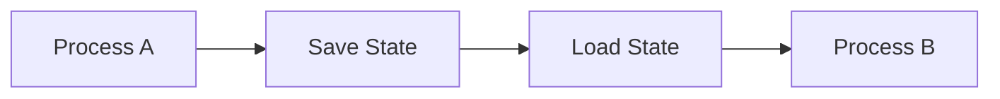

---

# Cost of Context Switching

Too many switches:

```text
CPU Waste

Performance Loss

Latency Increase
```

---

# Threads

A process can contain multiple threads.

---

# Thread Architecture

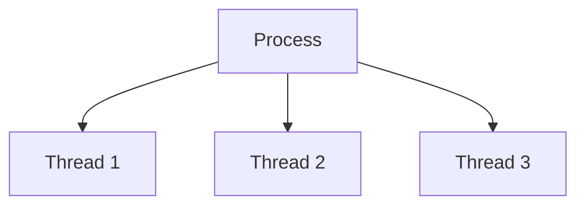

---

# Process vs Thread

```text
Process
  Own Memory

Thread
  Shared Memory
```

---

# Viewing Threads

```bash
ps -eLf
```

---

# CPU Affinity

Pin process to CPU.

View:

```bash
taskset -p PID
```

Set:

```bash
taskset -cp 0 PID
```

---

# Process Priority

Linux priorities:

```text
Nice Value
```

Range:

```text
-20 = Highest Priority

19 = Lowest Priority
```

---

# View Priority

```bash
ps -el
```

---

# Change Priority

```bash
nice -n 10 command
```

or

```bash
renice
```

---

# Process Memory Lifecycle

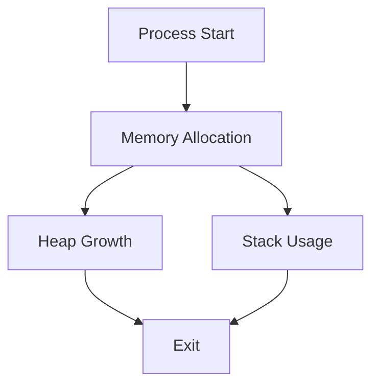

---

# Open Files

Every process owns file descriptors.

---

# File Descriptor Architecture

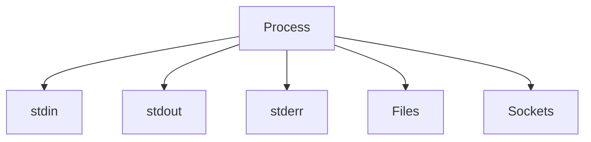

---

# View Open Files

```bash
lsof -p PID
```

---

# Process Observability

Most important commands:

```bash
ps aux

top

htop

pstree

pidstat

lsof

strace
```

---

# Process Debugging Architecture

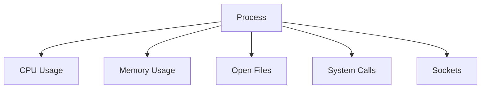

---

# Production Bottlenecks

Most process-related incidents involve:

```text
Runaway CPU

Memory Leaks

Zombie Processes

Too Many Threads

Deadlocks

File Descriptor Exhaustion

Fork Bombs
```

---

# High CPU Investigation

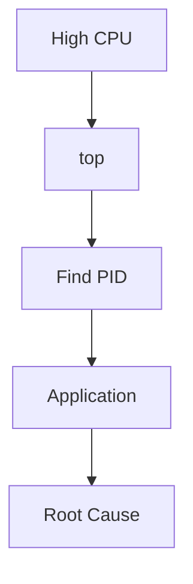

Commands:

```bash
top

pidstat

ps aux --sort=-%cpu
```

---

# High Memory Investigation

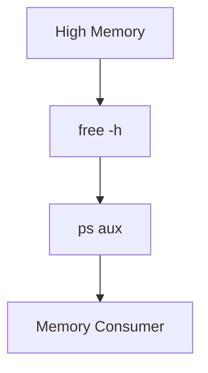

---

# File Descriptor Exhaustion

Symptoms:

```text
Too many open files
```

Check:

```bash
lsof
```

Count:

```bash
lsof | wc -l
```

---

# Process Lifecycle in Containers

Containers are ultimately:

```text
Linux Processes
```

---

# Container Architecture

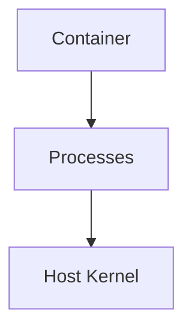

---

# Kubernetes Process Model

```mermaid
graph TD

POD["Pod"]

POD --> CONTAINER["Container"]

CONTAINER --> PROCESS["Application Process"]
```

---

# Engineering Mindset

Beginners see:

```text
Program
```

Engineers see:

```text
Program
   ↓
fork()
   ↓
Process
   ↓
Scheduler
   ↓
CPU
   ↓
Memory
   ↓
I/O
   ↓
Signals
   ↓
Termination
```

Understanding the lifecycle allows predictable troubleshooting.

---

# Interview Questions

### What is a process?

### Difference between program and process?

### What is PID?

### What is PPID?

### Explain fork().

### Explain exec().

### Why are fork and exec separate?

### What is a zombie process?

### What is a thread?

### Difference between process and thread?

### What is context switching?

### What is CFS?

### What is SIGTERM?

### What is SIGKILL?

### What causes D state processes?

### What is file descriptor exhaustion?

---

# One-Page Architecture Summary

```text
Program
   ↓
fork()
   ↓
Process Created
   ↓
Ready Queue
   ↓
Running
   ↓
Waiting
   ↓
Running
   ↓
Exit
   ↓
Zombie
   ↓
Cleanup
```

---

# Final Takeaway

Processes are the fundamental execution units of Linux.

Every:

```text
Web Server
Database
Container
Kubernetes Pod
Cloud Service
```

ultimately consists of Linux processes moving through a lifecycle of:

```text
Creation
Scheduling
Execution
Waiting
Communication
Termination
```

Master the process lifecycle and you gain deep insight into performance, troubleshooting, scalability, containers, Kubernetes, and operating system behavior.
