# Linux Production Request Flow

## Following a Real User Request from Browser to Database and Back

---

# Why This Exists

Most engineers learn technologies separately:

```text
Linux
Networking
Nginx
Docker
Kubernetes
Databases
Load Balancers
Cloud
```

But production systems do not operate separately.

A real request travels through all of them.

When a user clicks:

```text
https://myapp.com
```

an enormous chain of events begins:

```text
DNS
↓
TCP
↓
TLS
↓
Load Balancer
↓
Linux Networking
↓
Nginx
↓
Application
↓
Database
↓
Storage
↓
Response
```

Understanding this flow is one of the most important skills for:

* Linux Engineers
* Backend Engineers
* DevOps Engineers
* SREs
* Platform Engineers
* Cloud Engineers
* System Architects

Because production troubleshooting is fundamentally:

```text
Finding where the request broke.
```

---

# The Mental Model

Think of a production request like a package delivery.

```text
User = Customer

DNS = Address Lookup

Internet = Roads

Load Balancer = Distribution Center

Application Server = Warehouse

Database = Inventory System

Response = Delivered Package
```

Every step can fail.

Every step can become a bottleneck.

Every step can become a security risk.

---

# The Big Picture

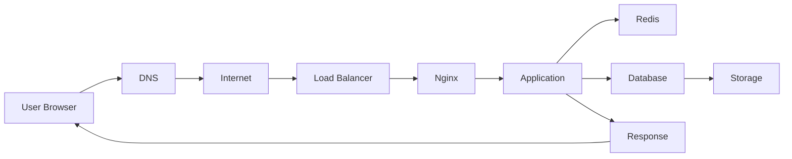

---

# End-to-End Production Architecture

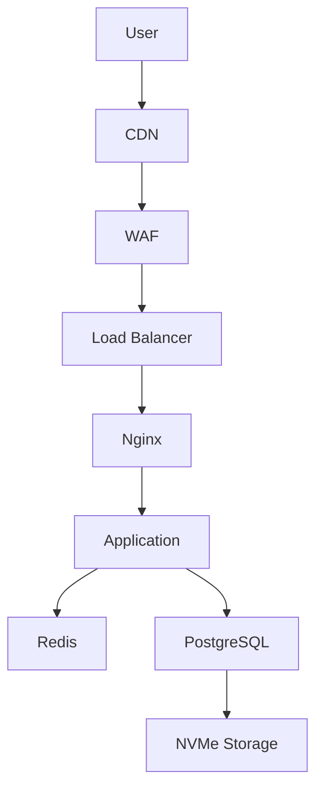

---

# Step 1: User Types URL

User enters:

```text
https://myapp.com
```

Browser must determine:

```text
Where is myapp.com?
```

This starts DNS resolution.

---

# Step 2: DNS Resolution

DNS converts:

```text
myapp.com
```

into:

```text
142.251.x.x
```

---

# DNS Flow

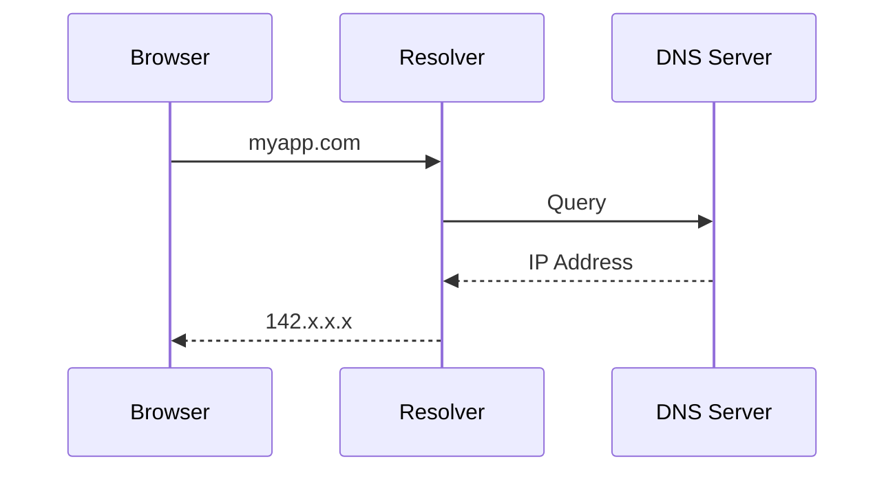

---

# Linux Components Involved

```text
/etc/resolv.conf

systemd-resolved

DNS Cache

UDP Networking Stack
```

---

# DNS Failure Scenarios

```text
DNS Server Down

Wrong Record

TTL Issues

Network Failure
```

---

# DNS Troubleshooting

```bash
dig myapp.com

nslookup myapp.com

host myapp.com
```

---

# Step 3: TCP Connection

Browser now knows destination IP.

Must establish connection.

---

# TCP Handshake

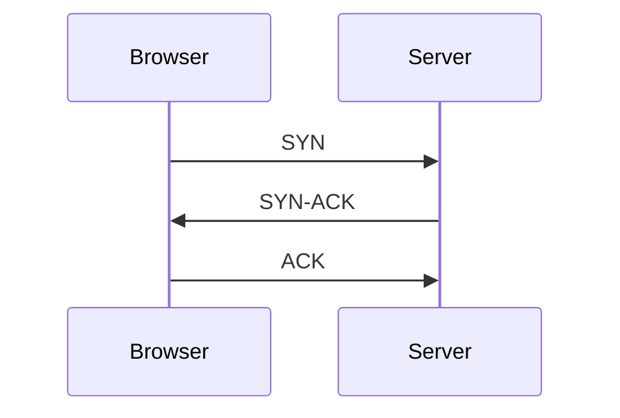

Connection established.

---

# Linux Internals

Kernel creates:

```text
Socket

TCP State

Buffers

Routing Decision
```

---

# TCP States

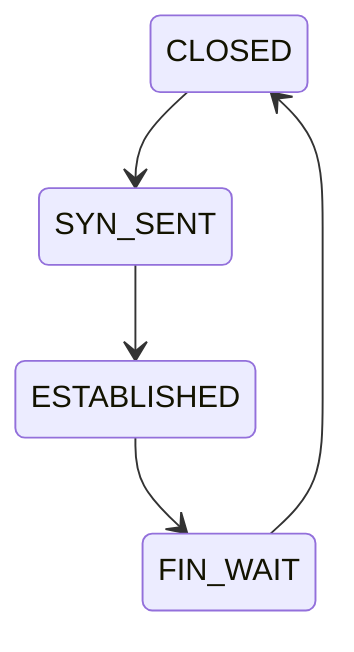

---

# Inspect Connections

```bash
ss -tan

netstat -tan
```

---

# Step 4: TLS Handshake

Because URL uses:

```text
HTTPS
```

encryption must be established.

---

# TLS Flow

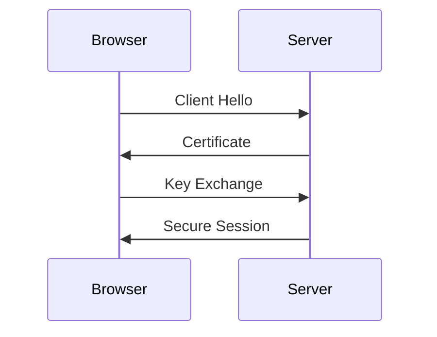

---

# TLS Responsibilities

```text
Encryption

Authentication

Integrity
```

---

# Common TLS Issues

```text
Expired Certificates

Wrong Certificates

Cipher Mismatch

Clock Problems
```

---

# Step 5: Packet Travels Through Internet

Packets travel through:

```text
Routers

Switches

ISPs

Backbones
```

---

# Internet Path

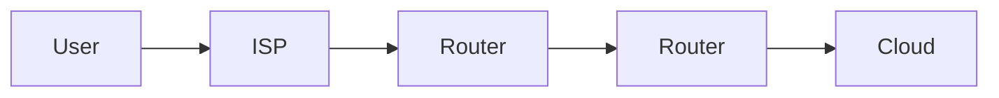

---

# Network Troubleshooting

```bash
ping

traceroute

mtr
```

---

# Step 6: Load Balancer Receives Request

Production systems rarely expose application servers directly.

Instead:

```text
Load Balancer
```

receives traffic.

---

# Load Balancer Architecture

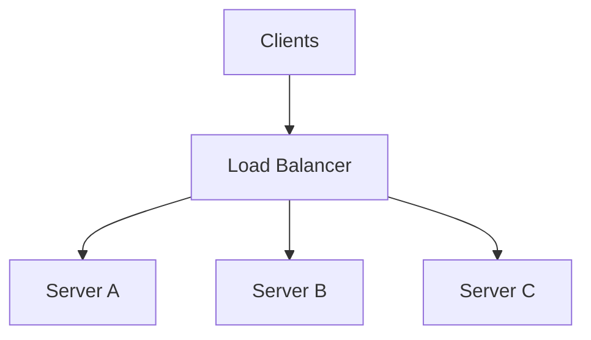

---

# Responsibilities

```text
Traffic Distribution

TLS Termination

Health Checks

Failover

Rate Limiting
```

---

# Step 7: Linux Networking Stack

Packet reaches Linux server.

---

# Inbound Packet Flow

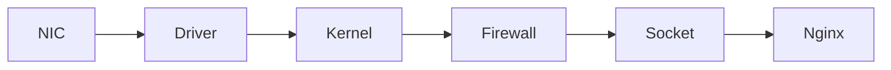

---

# Linux Components Involved

```text
Network Driver

Kernel Network Stack

Routing

iptables/nftables

Socket Layer
```

---

# Firewall Processing

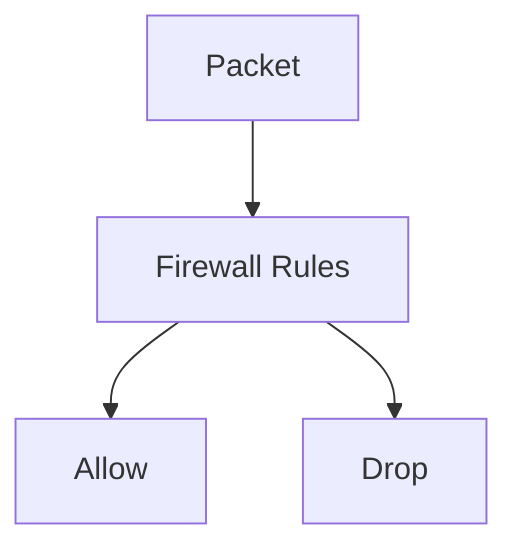

---

# Step 8: Nginx Receives Request

Nginx acts as:

```text
Reverse Proxy

Web Server

TLS Endpoint
```

---

# Nginx Architecture

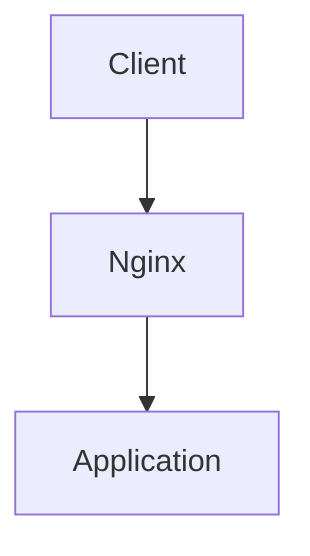

---

# Nginx Responsibilities

```text
SSL Termination

Static Files

Compression

Caching

Proxying
```

---

# Nginx Worker Model

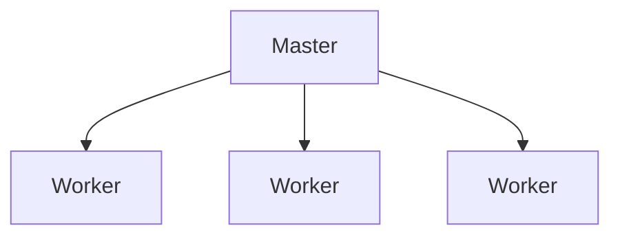

---

# Step 9: Application Processing

Request reaches backend.

Example:

```text
Node.js

Python

Go

Java

Rust
```

---

# Application Flow

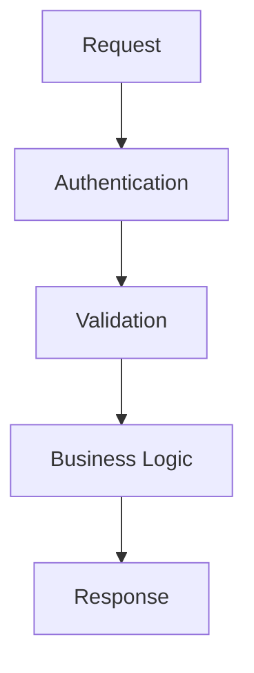

---

# Linux View

Application is simply:

```text
Linux Process
```

managed by:

```text
systemd

Container Runtime

Kubernetes
```

---

# Process Architecture

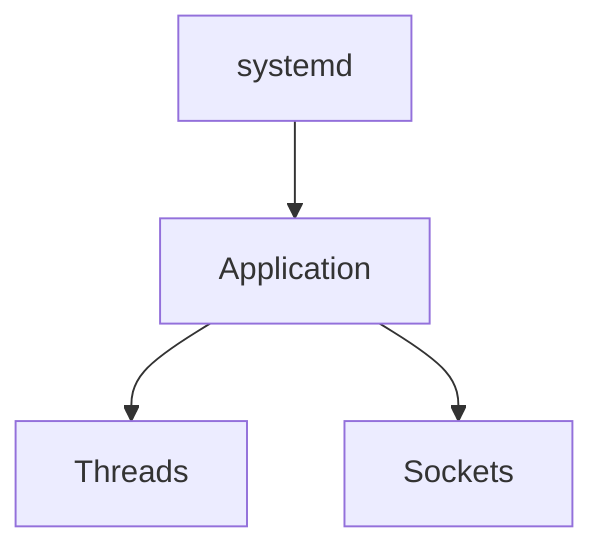

---

# Step 10: Cache Lookup

Most production systems use caching.

---

# Cache Flow

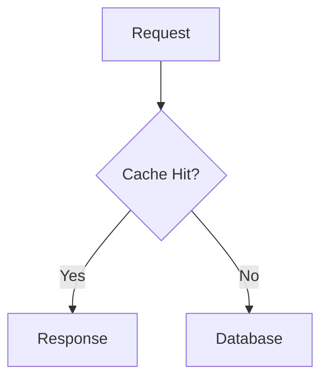

---

# Redis Architecture

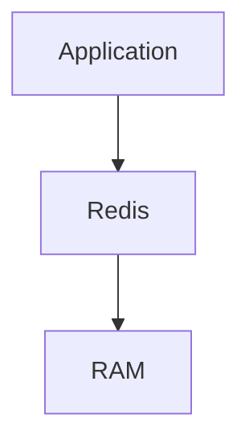

---

# Why Cache Exists

Without cache:

```text
Every Request
      ↓
Database
```

With cache:

```text
Most Requests
      ↓
Memory
```

---

# Step 11: Database Query

If cache misses:

Database query occurs.

---

# Database Flow

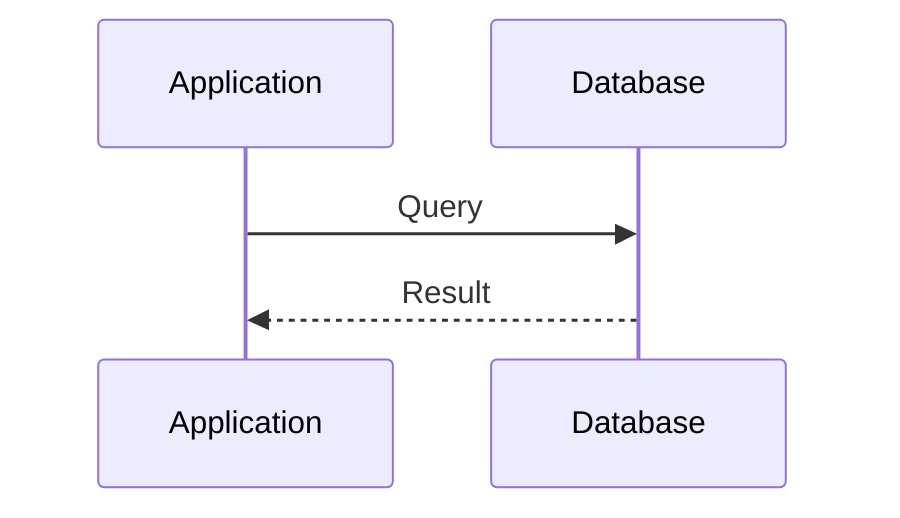

---

# Database Internals

```text
SQL Parser

Optimizer

Executor

Buffer Cache

Storage Engine
```

---

# PostgreSQL Architecture

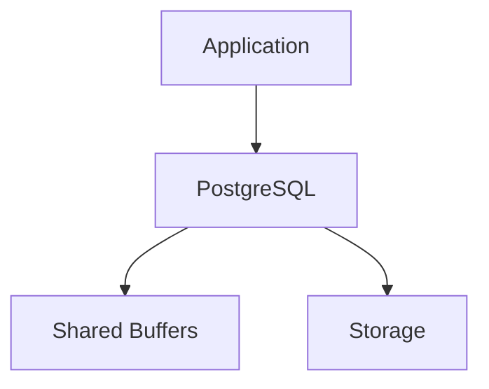

---

# Step 12: Storage Access

Database may need storage access.

---

# Storage Stack

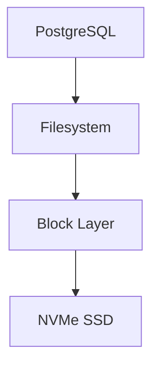

---

# Linux Storage Path

```text
Application

Filesystem

Page Cache

Block Layer

Driver

Device
```

---

# Step 13: Response Creation

Application constructs response.

Example:

```json
{
  "user":"vip",
  "tasks":10
}
```

---

# Response Flow

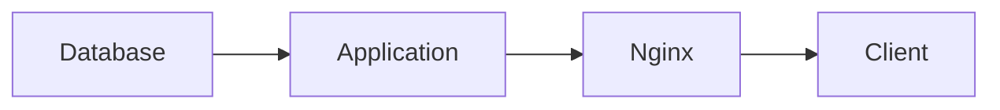

---

# Step 14: Kernel Sends Response

Linux networking stack performs:

```text
TCP Segmentation

Buffering

Packet Creation

Routing
```

---

# Outbound Packet Flow

```mermaid
flowchart LR

APP["Application"]

APP --> SOCKET["Socket"]

SOCKET --> TCP["TCP"]

TCP --> IP["IP"]

IP --> NIC["NIC"]

NIC --> INTERNET["Internet"]
```

---

# Step 15: Browser Renders Response

Browser receives:

```text
HTML

CSS

JavaScript

JSON
```

and displays content.

Request complete.

---

# Complete Request Journey

```mermaid
flowchart TD

USER["User"]

USER --> DNS["DNS"]

DNS --> TCP["TCP"]

TCP --> TLS["TLS"]

TLS --> LB["Load Balancer"]

LB --> FIREWALL["Firewall"]

FIREWALL --> NGINX["Nginx"]

NGINX --> APP["Application"]

APP --> CACHE["Redis"]

CACHE --> DB["Database"]

DB --> STORAGE["Storage"]

STORAGE --> DB

DB --> APP

APP --> NGINX

NGINX --> USER
```

---

# Kubernetes Version

Production Kubernetes flow:

```mermaid
flowchart LR

USER["User"]

USER --> INGRESS["Ingress"]

INGRESS --> SERVICE["Service"]

SERVICE --> POD["Pod"]

POD --> CONTAINER["Container"]

CONTAINER --> PROCESS["Linux Process"]
```

---

# Cloud Production Flow

```mermaid
graph TD

USER["User"]

USER --> CDN["CDN"]

CDN --> WAF["WAF"]

WAF --> LB["Load Balancer"]

LB --> K8S["Kubernetes"]

K8S --> PODS["Pods"]

PODS --> DB["Database"]
```

---

# Performance Bottlenecks

Possible bottlenecks:

```text
DNS

Network

TLS

Load Balancer

Nginx

Application

Database

Storage

Cache
```

---

# Latency Breakdown

Example:

```text
DNS           5ms

TCP           10ms

TLS           20ms

LB            2ms

Nginx         1ms

Application   40ms

Database      100ms

Total         178ms
```

Database dominates.

---

# Security Layers

```mermaid
graph TD

USER["User"]

USER --> TLS["TLS"]

TLS --> WAF["WAF"]

WAF --> FIREWALL["Firewall"]

FIREWALL --> AUTH["Authentication"]

AUTH --> APPLICATION["Application"]
```

---

# Observability View

Monitoring every layer:

```mermaid
graph TD

DNS["DNS"]

DNS --> METRICS["Metrics"]

TCP["TCP"]

TCP --> METRICS

APP["Application"]

APP --> LOGS["Logs"]

DB["Database"]

DB --> TRACES["Traces"]
```

---

# Production Incident Example

User reports:

```text
Website Slow
```

Investigation:

```text
DNS OK

Network OK

Nginx OK

CPU OK

Memory OK

Database Query Slow
```

Root Cause:

```text
Missing Index
```

Without understanding request flow:

```text
Guessing
```

With understanding:

```text
Engineering
```

---

# Engineering Mindset

Beginners see:

```text
Website
```

Engineers see:

```text
DNS
↓
TCP
↓
TLS
↓
Load Balancer
↓
Linux Networking
↓
Nginx
↓
Application
↓
Cache
↓
Database
↓
Storage
↓
Response
```

Every layer matters.

---

# Interview Questions

### What happens when you enter a URL?

### Explain DNS resolution.

### Explain TCP handshake.

### Explain TLS handshake.

### What does a load balancer do?

### How does Nginx work?

### What happens inside Linux networking?

### Why use Redis?

### How does a database query reach storage?

### What are common production bottlenecks?

### How does Kubernetes change request flow?

### How would you troubleshoot a slow website?

### Where can latency occur?

### How do observability tools help?

### Why must backend engineers understand Linux?

---

# One-Page Architecture Summary

```text
User
 ↓
DNS
 ↓
TCP
 ↓
TLS
 ↓
Load Balancer
 ↓
Linux Networking Stack
 ↓
Nginx
 ↓
Application
 ↓
Redis
 ↓
Database
 ↓
Filesystem
 ↓
Storage
 ↓
Response
```

---

# Final Takeaway

Every production request is a journey through multiple layers of modern infrastructure.

Understanding this journey connects:

```text
Linux

Networking

Security

Storage

Databases

Containers

Kubernetes

Cloud

Observability
```

into one mental model.

Master this request flow and you stop seeing isolated technologies.

You start seeing how entire production systems actually work.
