# Linux Security Model

## From Users and Permissions to SELinux, Capabilities, Containers, and Zero Trust

---

# Why This Exists

Security is not a feature.

Security is a system.

Every Linux server must answer:

```text
Who are you?

What are you allowed to do?

What resources can you access?

How do we verify that?

How do we prevent abuse?
```

Whether you're running:

```text
Personal Laptop

Production Web Server

Database Cluster

Kubernetes Platform

Cloud Infrastructure

Banking System
```

everything depends on Linux security.

Most beginners think security means:

```text
Strong Passwords
```

Experienced engineers understand:

```text
Identity
Authorization
Isolation
Auditing
Least Privilege
Defense in Depth
```

---

# The Security Mental Model

Think of Linux as a city.

```text
Users = Citizens

Groups = Organizations

Files = Buildings

Permissions = Access Rules

Kernel = Government

Root = Supreme Authority
```

Every action requires permission.

Nothing should happen without authorization.

---

# The Big Picture

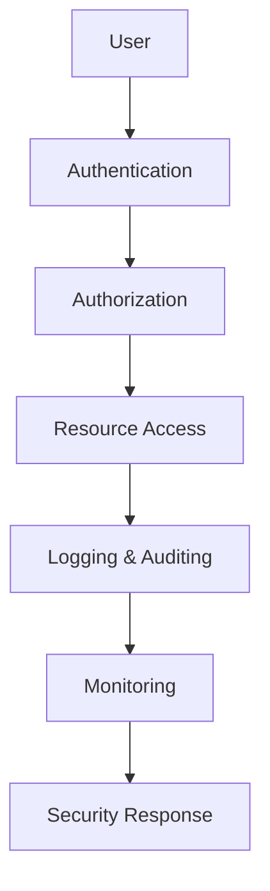

---

# Linux Security Architecture

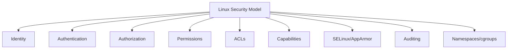

---

# Security Layers

Linux security is layered.

```text
Layer 1 → Physical Access

Layer 2 → Boot Security

Layer 3 → User Authentication

Layer 4 → Permissions

Layer 5 → Access Controls

Layer 6 → Service Security

Layer 7 → Network Security

Layer 8 → Monitoring & Auditing
```

---

# Defense In Depth

Never trust a single control.

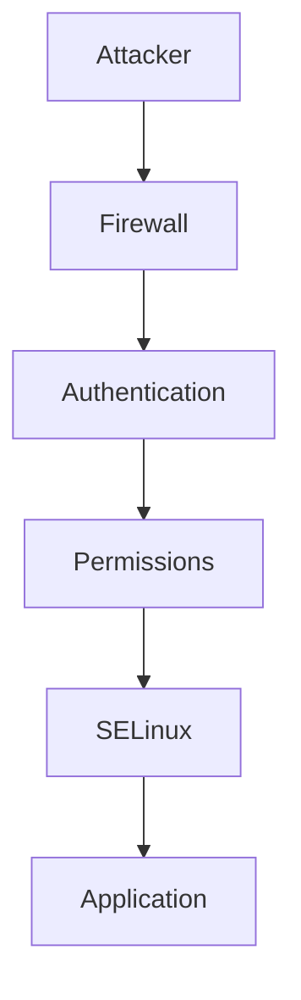

If one layer fails, others still protect the system.

---

# Identity

Everything starts with identity.

Linux must know:

```text
Who is making this request?
```

---

# User Architecture

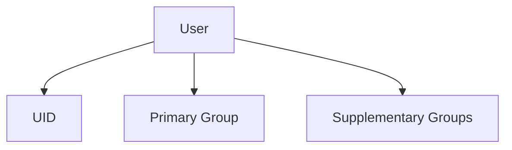

---

# User IDs (UID)

Every user has a numeric identifier.

Examples:

```text
0      → root

1000   → normal user

1001+  → additional users
```

---

# View Current Identity

```bash
id
```

Example:

```text
uid=1000(vip)
gid=1000(vip)
groups=1000(vip),27(sudo)
```

---

# Group-Based Security

Groups simplify authorization.

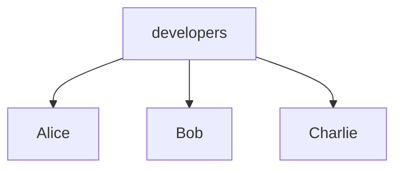

---

# Authentication

Authentication answers:

```text
Who are you?
```

---

# Authentication Flow

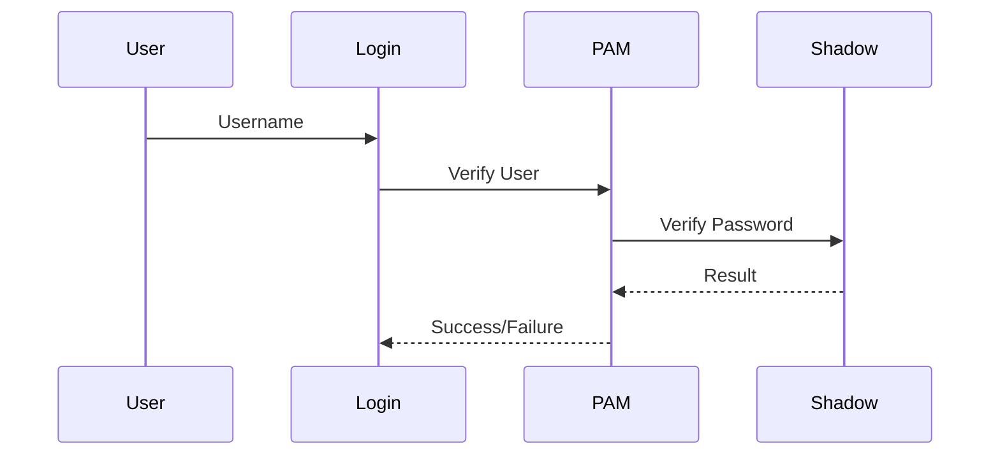

---

# Authentication Components

```text
Username

Password

SSH Keys

MFA

PAM
```

---

# PAM Architecture

Pluggable Authentication Modules.

---

# PAM Flow

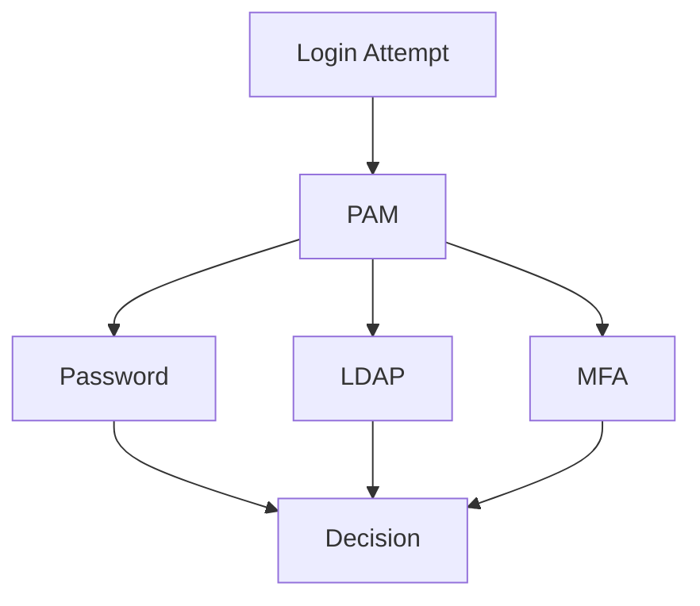

---

# Key PAM Files

```bash
/etc/pam.d/

/etc/pam.conf
```

---

# Password Storage

Passwords are not stored in plain text.

Stored in:

```bash
/etc/shadow
```

---

# Account Files

```text
/etc/passwd

/etc/shadow

/etc/group

/etc/gshadow
```

---

# Authorization

Authentication:

```text
Who are you?
```

Authorization:

```text
What are you allowed to do?
```

---

# Authorization Flow

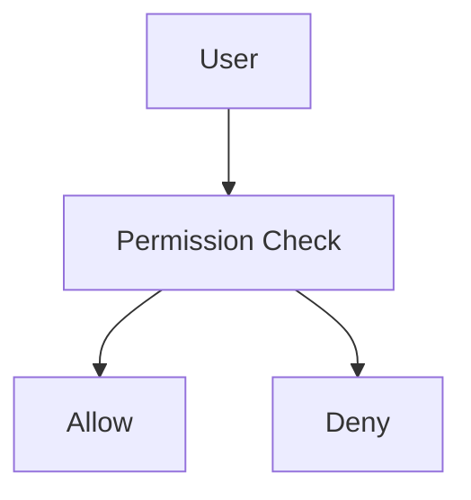

---

# The Permission Model

The classic Linux security model.

---

# Permission Architecture

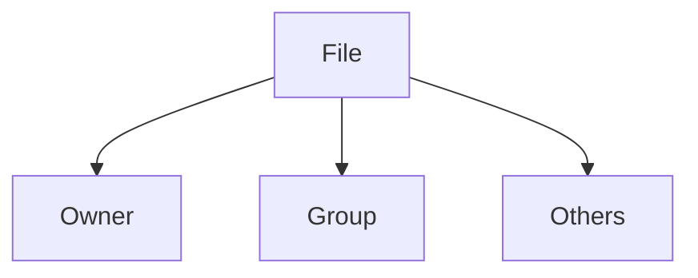

---

# Permission Types

```text
r = Read

w = Write

x = Execute
```

---

# Example

```bash
-rwxr-x---
```

Means:

```text
Owner  = rwx

Group  = r-x

Others = ---
```

---

# Permission Matrix

| Permission | File          | Directory           |
| ---------- | ------------- | ------------------- |
| Read       | Read contents | List files          |
| Write      | Modify file   | Create/Delete files |
| Execute    | Run program   | Enter directory     |

---

# Security Decision Tree

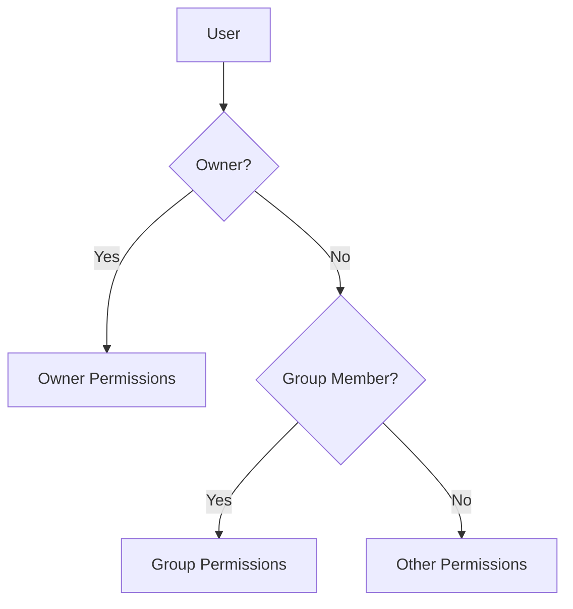

---

# ACLs

Access Control Lists provide fine-grained permissions.

---

# ACL Architecture

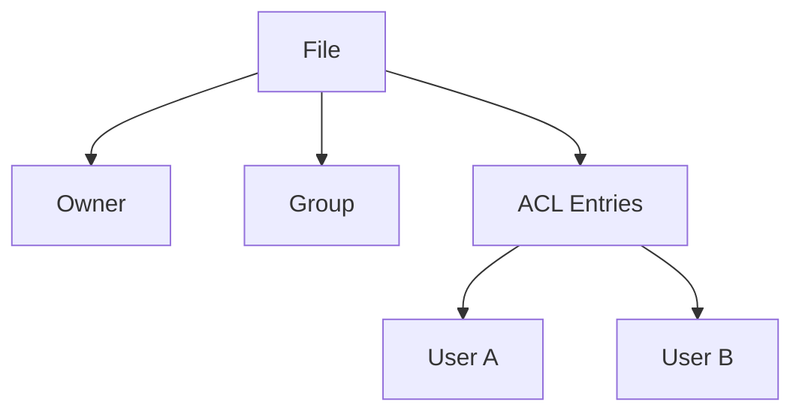

---

# ACL Commands

```bash
getfacl file

setfacl -m u:user:rwx file
```

---

# Root User

UID 0.

Special account.

---

# Root Architecture

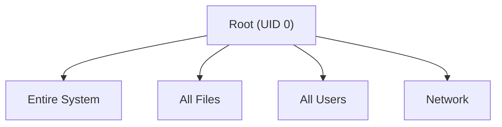

---

# Why Root Is Dangerous

Root can:

```text
Delete Everything

Read Everything

Modify Everything
```

Principle:

```text
Avoid using root directly.
```

---

# Sudo

Provides controlled privilege escalation.

---

# Sudo Flow

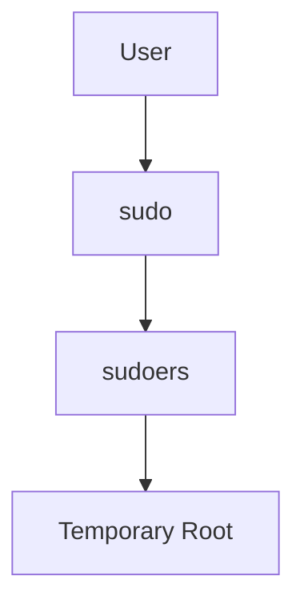

---

# Sudo Configuration

```bash
visudo
```

File:

```bash
/etc/sudoers
```

---

# Principle of Least Privilege

Most important security principle.

---

# Least Privilege Model

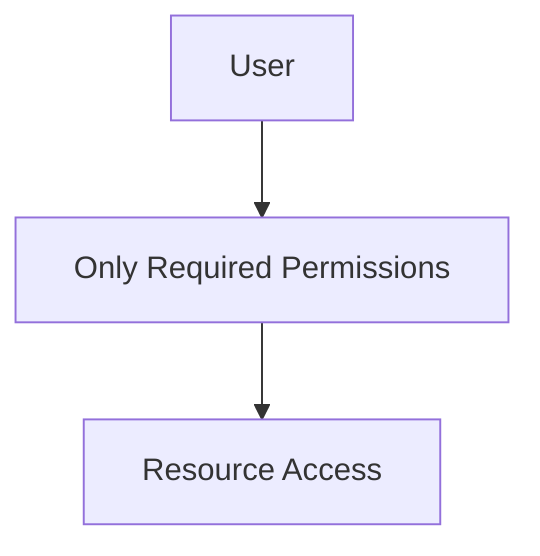

Never grant more access than necessary.

---

# Linux Capabilities

Traditional Linux:

```text
Root = Everything
```

Capabilities split root power.

---

# Capability Architecture

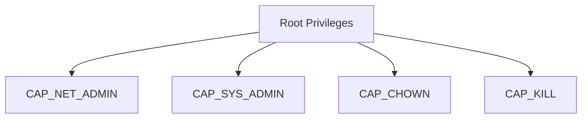

---

# Why Capabilities Exist

Instead of:

```text
Full Root
```

Grant:

```text
Specific Power
```

Only.

---

# View Capabilities

```bash
getcap -r /
```

---

# Mandatory Access Control (MAC)

Permissions are discretionary.

SELinux and AppArmor are mandatory.

---

# Security Models

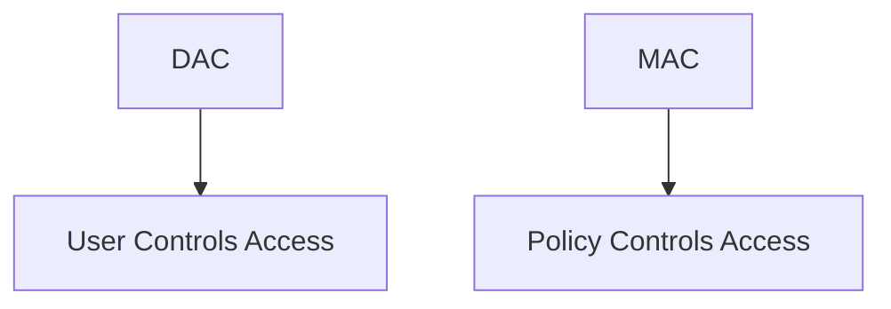

---

# SELinux Architecture

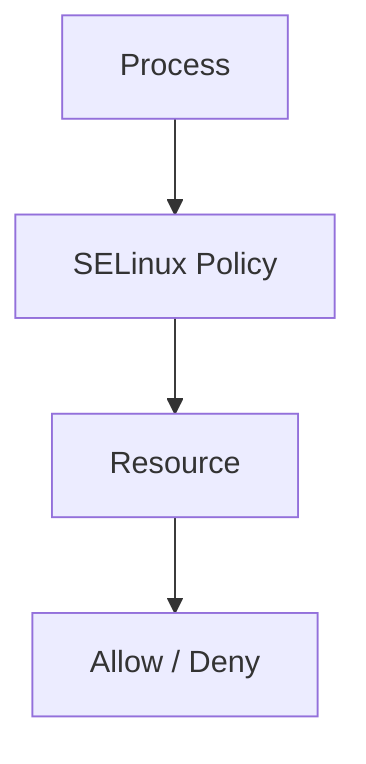

---

# SELinux Modes

```text
Enforcing

Permissive

Disabled
```

---

# Check SELinux

```bash
getenforce
```

---

# AppArmor

Alternative to SELinux.

Uses application profiles.

---

# AppArmor Flow

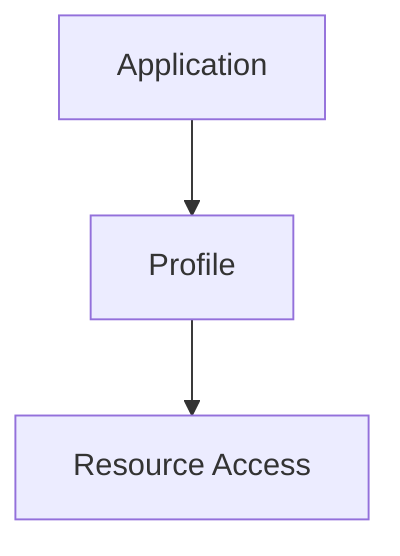

---

# Check AppArmor

```bash
aa-status
```

---

# Linux Audit System

Security requires visibility.

---

# Audit Architecture

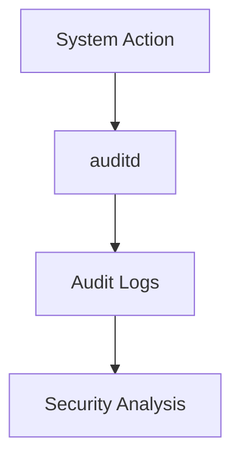

---

# Audit Commands

```bash
auditctl

ausearch

aureport
```

---

# Logging Architecture

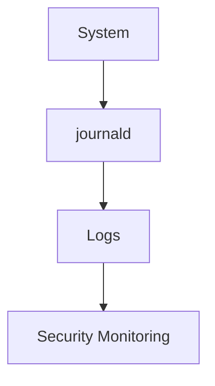

---

# SSH Security

SSH is the front door of Linux servers.

---

# SSH Security Model

```mermaid
graph TD

USER["User"]

USER --> SSH["SSH"]

SSH --> AUTH["Authentication"]

AUTH --> ACCESS["Server Access"]
```

---

# Best Practices

```text
Disable Root Login

Use SSH Keys

Enable MFA

Restrict Access

Audit Connections
```

---

# Network Security

Security is not only local.

---

# Network Security Stack

```mermaid
graph TD

NETWORK["Network"]

NETWORK --> FIREWALL["Firewall"]

FIREWALL --> SERVICE["Service"]

SERVICE --> APPLICATION["Application"]
```

---

# Firewall Architecture

```mermaid
flowchart TD

PACKET["Packet"]

PACKET --> RULE["Firewall Rule"]

RULE --> ALLOW["Allow"]

RULE --> DROP["Drop"]
```

---

# nftables

Modern Linux firewall.

View rules:

```bash
nft list ruleset
```

---

# Containers and Security

Containers rely on kernel isolation.

---

# Container Security Stack

```mermaid
graph TD

CONTAINER["Container"]

CONTAINER --> NS["Namespaces"]

CONTAINER --> CG["cgroups"]

CONTAINER --> CAP["Capabilities"]

CONTAINER --> SECCOMP["seccomp"]
```

---

# seccomp

Restricts system calls.

---

# seccomp Flow

```mermaid
graph TD

APP["Application"]

APP --> SYSCALL["System Call"]

SYSCALL --> FILTER["seccomp Filter"]

FILTER --> ALLOW["Allow"]

FILTER --> BLOCK["Block"]
```

---

# Kubernetes Security

Built on Linux security primitives.

---

# Kubernetes Security Layers

```mermaid
graph TD

POD["Pod"]

POD --> CONTAINER["Container"]

CONTAINER --> NAMESPACE["Namespace"]

CONTAINER --> CGROUP["cgroup"]

CONTAINER --> SELINUX["SELinux"]

CONTAINER --> SECCOMP["seccomp"]
```

---

# Zero Trust Security

Modern principle:

```text
Trust Nothing

Verify Everything
```

---

# Zero Trust Flow

```mermaid
flowchart TD

REQUEST["Request"]

REQUEST --> VERIFY["Verify Identity"]

VERIFY --> AUTHORIZE["Authorize"]

AUTHORIZE --> MONITOR["Monitor"]

MONITOR --> ALLOW["Access"]
```

---

# Security Monitoring

Key tools:

```bash
journalctl

auditctl

ausearch

ss

nft

last

who
```

---

# Security Incident Workflow

```mermaid
flowchart TD

INCIDENT["Incident"]

INCIDENT --> DETECT["Detection"]

DETECT --> INVESTIGATE["Investigation"]

INVESTIGATE --> CONTAIN["Containment"]

CONTAIN --> RECOVER["Recovery"]

RECOVER --> REVIEW["Lessons Learned"]
```

---

# Common Security Mistakes

### Running Everything as Root

Bad practice.

---

### Open SSH Access

Limit exposure.

---

### Ignoring Updates

Unpatched systems become vulnerable.

---

### Weak Passwords

Still a major attack vector.

---

### No Auditing

Undetected attacks are the most dangerous.

---

### Excessive Permissions

Violates least privilege.

---

# Security Checklist

```text
Use SSH Keys

Disable Root Login

Use sudo

Enable MFA

Apply Updates

Use SELinux/AppArmor

Enable Auditing

Use Firewalls

Follow Least Privilege

Monitor Logs
```

---

# Production Security Architecture

```mermaid
graph TD

USER["User"]

USER --> LB["Load Balancer"]

LB --> FIREWALL["Firewall"]

FIREWALL --> APP["Application"]

APP --> DATABASE["Database"]

DATABASE --> AUDIT["Audit Logs"]

AUDIT --> SIEM["Monitoring Platform"]
```

---

# Engineering Mindset

Beginners think:

```text
Security = Password
```

Engineers think:

```text
Identity
Authentication
Authorization
Least Privilege
Isolation
Auditing
Monitoring
Defense in Depth
Zero Trust
```

Security is a system, not a feature.

---

# Interview Questions

### What is the Linux security model?

### Difference between authentication and authorization?

### What is PAM?

### What is UID 0?

### What is sudo?

### What are ACLs?

### What are Linux capabilities?

### Why were capabilities introduced?

### What is SELinux?

### Difference between DAC and MAC?

### What is AppArmor?

### What is auditd?

### What is seccomp?

### How do containers achieve isolation?

### What is the principle of least privilege?

### What is zero trust?

---

# One-Page Architecture Summary

```text
Identity
     ↓
Authentication
     ↓
Authorization
     ↓
Permissions
     ↓
ACLs
     ↓
Capabilities
     ↓
SELinux/AppArmor
     ↓
Auditing
     ↓
Monitoring
     ↓
Security Response
```

---

# Final Takeaway

Linux security is not one mechanism.

It is a layered architecture composed of:

```text
Users

Groups

Authentication

Permissions

ACLs

Capabilities

SELinux

AppArmor

Auditing

Firewalls

Namespaces

cgroups

seccomp
```

Together, these systems create the foundation that secures everything from laptops and web servers to Kubernetes clusters and global cloud platforms.

Master the Linux security model and you gain the ability to design, secure, audit, and operate production systems with confidence.
