# Linux Storage Stack

## From Applications to SSDs, NVMe, RAID, LVM, and Cloud Storage

---

# Why This Exists

Every application ultimately stores data.

When:

```text id="s1f9ad"
PostgreSQL writes a transaction

Nginx writes a log

Redis creates a snapshot

Docker pulls an image

Kubernetes attaches a volume
```

Linux must move data through an entire storage stack.

Most engineers think:

```text id="y8m3kt"
Application
     ↓
Disk
```

Reality:

```text id="v7q2px"
Application
     ↓
Filesystem
     ↓
Page Cache
     ↓
Virtual Filesystem
     ↓
Block Layer
     ↓
I/O Scheduler
     ↓
Device Driver
     ↓
Storage Controller
     ↓
SSD / HDD / NVMe
```

Understanding this stack is critical for:

* Linux Engineers
* Database Engineers
* DevOps Engineers
* SREs
* Cloud Engineers
* Platform Engineers

Most performance problems eventually become storage problems.

---

# The Storage Mental Model

Think of storage like a warehouse.

```text id="n5k8dc"
Application = Customer

Filesystem = Warehouse Catalog

Block Layer = Warehouse Manager

Storage Device = Physical Shelves

Kernel = Logistics System
```

Applications ask:

```text id="q7w4bm"
Give me file X
```

Linux must determine:

```text id="k9e1vr"
Which filesystem?

Which blocks?

Which device?

Which sector?

Which controller?
```

---

# The Complete Linux Storage Stack

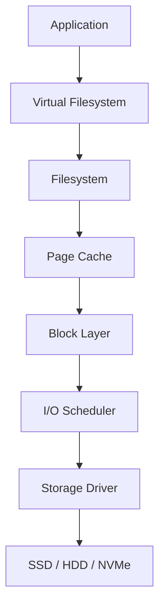

---

# Storage Architecture Overview

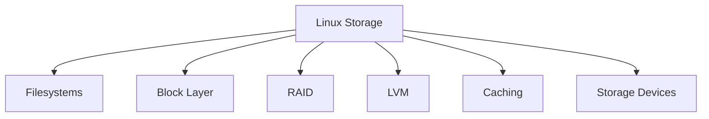

---

# Storage Hierarchy

```text id="r6p3xm"
Application
     ↓
Filesystem
     ↓
Virtual Filesystem (VFS)
     ↓
Block Layer
     ↓
Device Driver
     ↓
Storage Device
```

---

# Storage Device Types

Linux supports:

```text id="u8d1ty"
HDD

SSD

NVMe

SAN

NAS

Cloud Volumes
```

---

# Storage Evolution

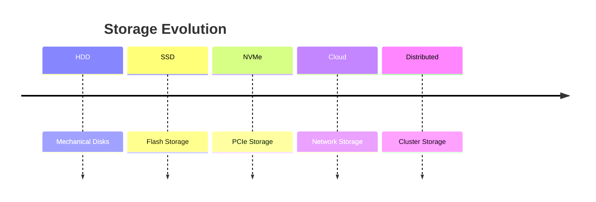

---

# HDD Architecture

Traditional spinning disks.

---

# HDD Components

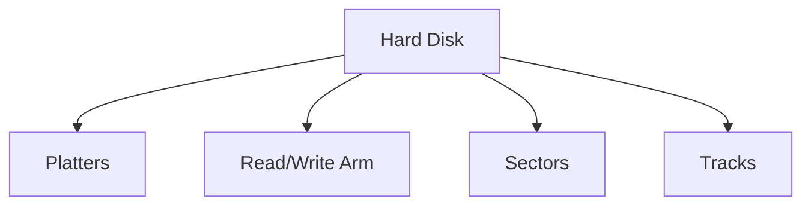

---

# HDD Access Cost

```text id="m2j7ka"
Seek Time

Rotational Latency

Transfer Time
```

Mechanical movement creates latency.

---

# HDD Bottleneck

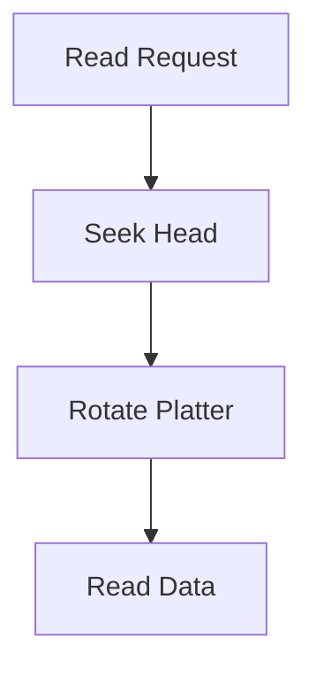

---

# SSD Architecture

SSD removes moving parts.

---

# SSD Components

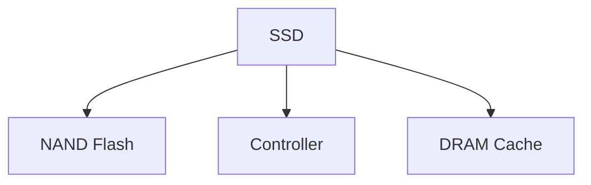

---

# SSD Benefits

```text id="t4y9pv"
Lower Latency

Higher IOPS

Lower Power Usage

Better Reliability
```

---

# NVMe Architecture

NVMe communicates directly through PCIe.

---

# NVMe Stack

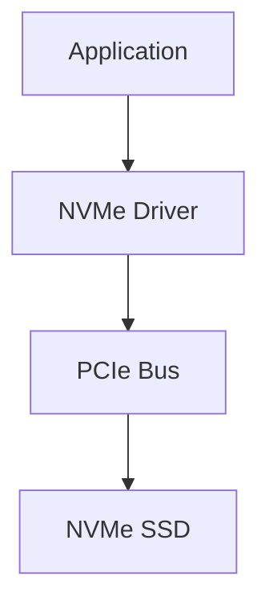

---

# Storage Performance Comparison

| Device | Latency                  |
| ------ | ------------------------ |
| RAM    | Nanoseconds              |
| NVMe   | Microseconds             |
| SSD    | Hundreds of Microseconds |
| HDD    | Milliseconds             |

---

# Linux Block Device Architecture

Linux treats storage as block devices.

Examples:

```text id="e7v3la"
/dev/sda

/dev/sdb

/dev/nvme0n1
```

---

# Block Device Stack

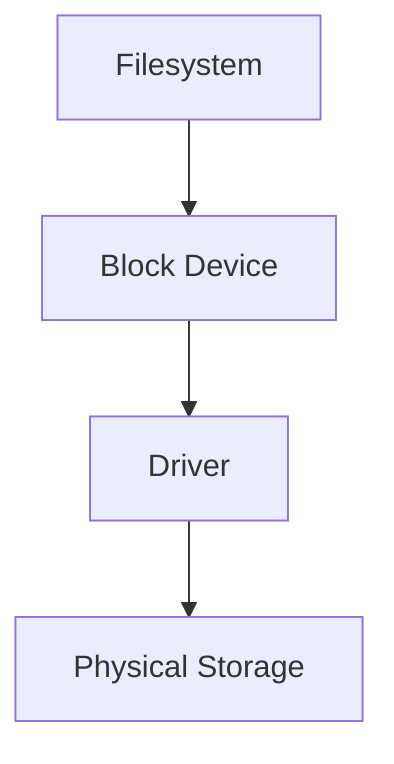

---

# View Block Devices

```bash id="5g8wyt"
lsblk
```

---

# Example Output

```text id="j9f4kx"
sda
 ├── sda1
 ├── sda2

nvme0n1
 ├── nvme0n1p1
```

---

# Virtual Filesystem (VFS)

Applications should not care about storage type.

VFS provides:

```text id="z2r6bm"
open()

read()

write()

close()
```

for all filesystems.

---

# VFS Architecture

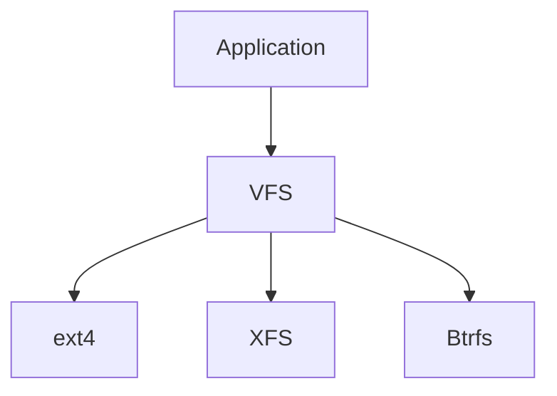

---

# Read Request Flow

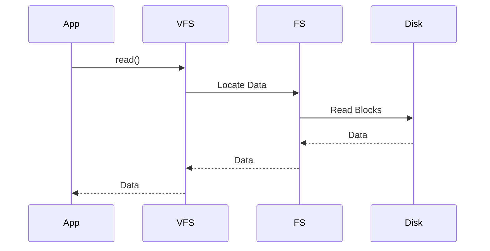

---

# Write Request Flow

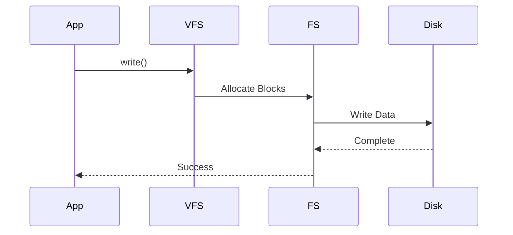

---

# Page Cache

Linux aggressively caches storage.

---

# Cache Architecture

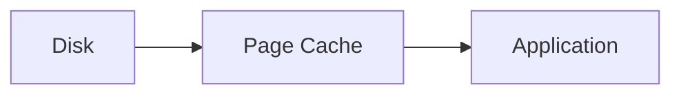

---

# Why Cache Exists

Storage is slow.

RAM is fast.

Linux tries to serve reads from memory.

---

# Cache Flow

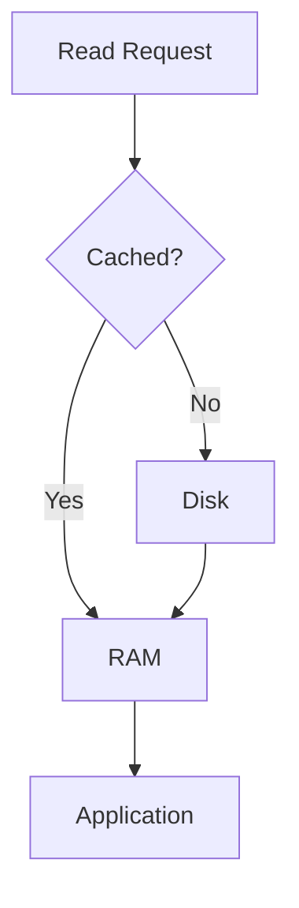

---

# Dirty Pages

Written data may remain in RAM temporarily.

---

# Dirty Page Flow

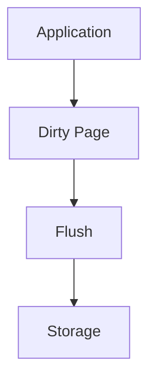

---

# I/O Scheduler

Storage devices receive many requests.

Scheduler decides:

```text id="b7x1du"
What request goes first?
```

---

# Scheduler Architecture

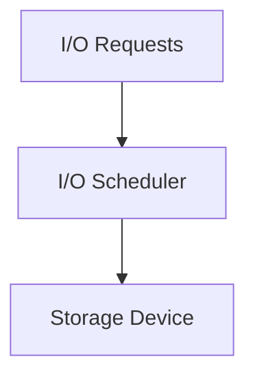

---

# Common Schedulers

```text id="m8z6op"
none

mq-deadline

bfq

kyber
```

---

# View Scheduler

```bash id="p4n8qe"
cat /sys/block/sda/queue/scheduler
```

---

# Filesystem Layer

Popular filesystems:

```text id="t7r2mc"
ext4

XFS

Btrfs

ZFS
```

---

# Filesystem Comparison

| Filesystem | Common Use         |
| ---------- | ------------------ |
| ext4       | General Purpose    |
| XFS        | Large Storage      |
| Btrfs      | Snapshots          |
| ZFS        | Enterprise Storage |

---

# RAID

RAID improves:

```text id="q5j8ke"
Performance

Availability

Capacity
```

---

# RAID Architecture

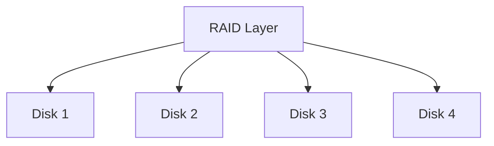

---

# RAID Levels

```text id="f2m7rd"
RAID 0 = Performance

RAID 1 = Mirroring

RAID 5 = Parity

RAID 6 = Double Parity

RAID 10 = Performance + Redundancy
```

---

# RAID 1 Example

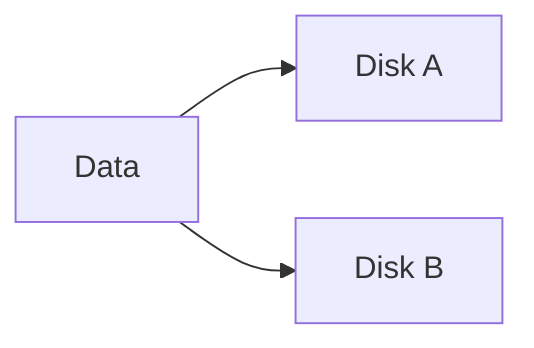

---

# RAID 5 Example

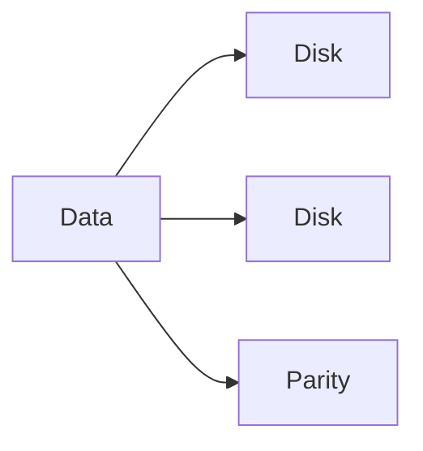

---

# LVM

Logical Volume Manager adds flexibility.

---

# LVM Architecture

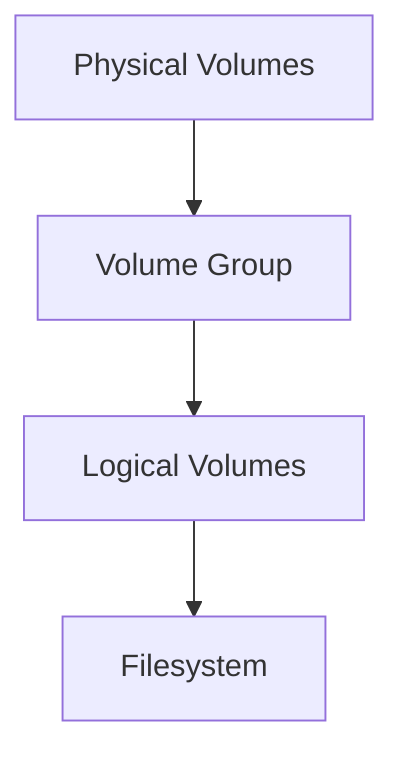

---

# LVM Benefits

```text id="w9v3ya"
Resize Volumes

Add Storage

Snapshots

Flexibility
```

---

# Storage Mount Architecture

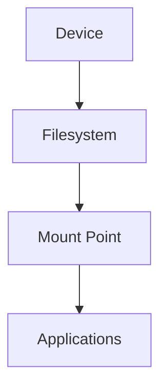

---

# Linux Mount Tree

```text id="z8k2wr"
/

├── boot

├── home

├── var

├── data

└── opt
```

---

# View Mounts

```bash id="u5n9bx"
findmnt
```

or

```bash id="b3q7lu"
mount
```

---

# Storage Monitoring

Important commands:

```bash id="k7m4pq"
lsblk

df -h

du -sh

iostat

iotop

findmnt
```

---

# IOPS

IOPS means:

```text id="s6d2rf"
Input Output Operations Per Second
```

Important for:

```text id="y4j8cv"
Databases

Cloud Storage

Kubernetes Volumes
```

---

# Latency vs Throughput

```mermaid id="stor021"
graph TD

PERF["Storage Performance"]

PERF --> LAT["Latency"]

PERF --> THROUGHPUT["Throughput"]

PERF --> IOPS["IOPS"]
```

---

# Database Storage Path

```mermaid id="stor022"
graph TD

POSTGRES["PostgreSQL"]

POSTGRES --> FS["Filesystem"]

FS --> BLOCK["Block Layer"]

BLOCK --> NVME["NVMe SSD"]
```

---

# Docker Storage

Docker uses:

```text id="c1w7mu"
OverlayFS
```

---

# OverlayFS Architecture

```mermaid id="stor023"
graph TD

BASE["Base Image"]

BASE --> LAYER1["Layer"]

LAYER1 --> LAYER2["Layer"]

LAYER2 --> RW["Writable Layer"]
```

---

# Kubernetes Storage

```mermaid id="stor024"
graph TD

POD["Pod"]

POD --> PVC["Persistent Volume Claim"]

PVC --> PV["Persistent Volume"]

PV --> STORAGE["Storage Backend"]
```

---

# Cloud Storage Architecture

```mermaid id="stor025"
graph TD

APP["Application"]

APP --> FILESYSTEM["Filesystem"]

FILESYSTEM --> CLOUD["Cloud Volume"]

CLOUD --> PROVIDER["AWS / Azure / GCP"]
```

---

# Storage Failure Modes

Common issues:

```text id="x7f5qb"
Disk Full

High Latency

I/O Saturation

Filesystem Corruption

RAID Failure

Mount Failure

Inode Exhaustion
```

---

# Troubleshooting Flow

```mermaid id="stor026"
flowchart TD

ISSUE["Storage Problem"]

ISSUE --> SPACE{"Disk Full?"}

SPACE -->|Yes| DF["df -h"]

SPACE -->|No| LATENCY{"High Latency?"}

LATENCY -->|Yes| IOSTAT["iostat"]

LATENCY -->|No| DEVICE["Check Hardware"]
```

---

# Performance Investigation Workflow

```mermaid id="stor027"
flowchart TD

SLOW["Slow Application"]

SLOW --> CPU["CPU"]

CPU --> MEMORY["Memory"]

MEMORY --> STORAGE["Storage"]

STORAGE --> IOSTAT["iostat"]

IOSTAT --> ROOTCAUSE["Root Cause"]
```

---

# Essential Commands

```bash id="n6w8yo"
lsblk

blkid

df -h

df -i

du -sh

findmnt

mount

iostat

iotop

smartctl

fio
```

---

# Production Examples

## PostgreSQL

Focus:

```text id="t8v4mz"
Low Latency

High IOPS

Fast fsync()
```

---

## Kubernetes

Focus:

```text id="d3q9yw"
Persistent Volumes

CSI Drivers

Storage Classes
```

---

## Cloud Infrastructure

Focus:

```text id="g6p1ke"
Block Storage

Object Storage

Snapshots
```

---

# Common Mistakes

### Ignoring Page Cache

Linux cache often improves performance dramatically.

---

### Looking Only at Disk Usage

Also check:

```bash id="m2x8vp"
df -i
```

for inode exhaustion.

---

### Confusing Throughput and Latency

High throughput does not guarantee low latency.

---

### Ignoring IOPS Limits

Cloud volumes often hit IOPS limits before capacity limits.

---

### Assuming SSDs Cannot Become Bottlenecks

They absolutely can.

---

# Interview Questions

### What is the Linux storage stack?

### What is a block device?

### What is VFS?

### What is page cache?

### What are dirty pages?

### What is an I/O scheduler?

### Difference between SSD and NVMe?

### What is RAID?

### What is RAID 10?

### What is LVM?

### What is OverlayFS?

### How does Docker store data?

### How does Kubernetes storage work?

### What is IOPS?

### Difference between latency and throughput?

---

# One-Page Architecture Summary

```text id="u1y6zk"
Application
     ↓
Filesystem
     ↓
Page Cache
     ↓
Block Layer
     ↓
I/O Scheduler
     ↓
Driver
     ↓
SSD / HDD / NVMe
```

---

# Final Takeaway

The Linux storage stack is far more than disks.

It is a layered architecture involving:

```text id="k5n8dr"
Filesystems

Caching

Block Devices

I/O Scheduling

RAID

LVM

Drivers

Storage Hardware
```

Every database transaction, container image, Kubernetes volume, cloud disk, and application log ultimately flows through this stack.

Master the storage stack and you gain the ability to understand, troubleshoot, optimize, and scale modern infrastructure from a single server to global cloud platforms.
