# Linux systemd Architecture

## The Complete Guide to PID 1, Services, Targets, Dependencies, Logging, Timers, and Modern Linux Initialization

---

# Why This Exists

When a Linux system boots, something must answer:

```text
What starts first?

What starts next?

What happens if a service fails?

Who manages services?

Who handles logging?

Who mounts filesystems?

Who starts networking?

Who restarts crashed applications?
```

Historically Linux used:

```text
SysVinit
Upstart
```

Modern Linux uses:

```text
systemd
```

Today systemd is the operating system manager for most Linux distributions.

Examples:

```text
Ubuntu
Debian
RHEL
Rocky Linux
AlmaLinux
Fedora
SUSE
Arch Linux
```

Understanding systemd is essential for:

* Linux Engineers
* DevOps Engineers
* SREs
* Platform Engineers
* Cloud Engineers
* Infrastructure Architects

---

# The systemd Mental Model

Most beginners think:

```text
systemd = Service Manager
```

Reality:

```text
systemd = Operating System Manager
```

systemd controls:

```text
Boot Process

Services

Logging

Timers

Networking

Mounts

Sockets

Resource Management

Dependency Resolution
```

Think of systemd as:

```text
The CEO of Userspace
```

The Linux kernel manages hardware.

systemd manages the operating system.

---

# The Big Picture

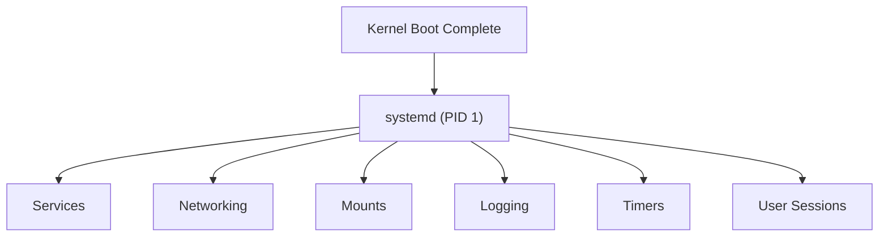

---

# Linux Boot Architecture

Understanding systemd begins with booting.

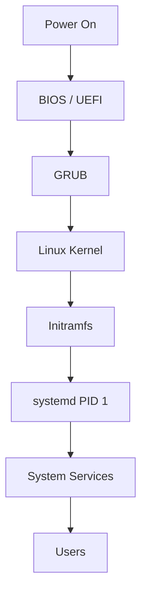

---

# Why PID 1 Matters

The first userspace process is:

```text
PID 1
```

On modern Linux:

```bash
ps -p 1
```

Output:

```text
systemd
```

---

# PID Hierarchy

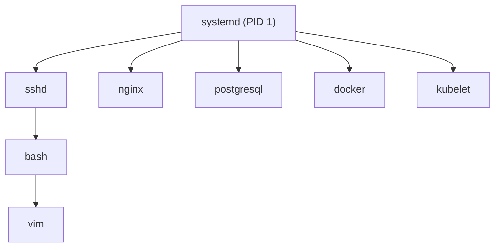

Every process ultimately traces back to PID 1.

---

# Responsibilities of PID 1

systemd is responsible for:

```text
Service Startup

Dependency Resolution

Process Supervision

Zombie Reaping

Logging

Shutdown

Reboot

Mount Management
```

---

# systemd Architecture Overview

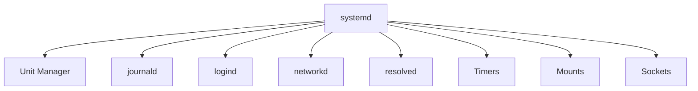

---

# What Is a Unit?

Everything in systemd is represented as a unit.

Think:

```text
Unit = Managed Object
```

Examples:

```text
Service

Timer

Socket

Mount

Target

Device

Path
```

---

# Unit Architecture

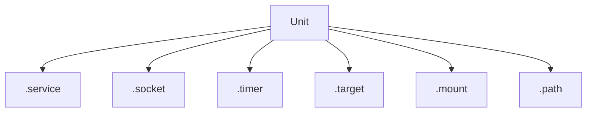

---

# Common Unit Types

| Unit     | Purpose           |
| -------- | ----------------- |
| .service | Service           |
| .socket  | Socket Activation |
| .target  | System State      |
| .mount   | Filesystem Mount  |
| .timer   | Scheduled Task    |
| .path    | File Monitoring   |
| .device  | Device            |
| .slice   | Resource Group    |

---

# Service Units

Most engineers interact primarily with services.

Example:

```text
nginx.service

sshd.service

docker.service

postgresql.service
```

---

# Service Architecture

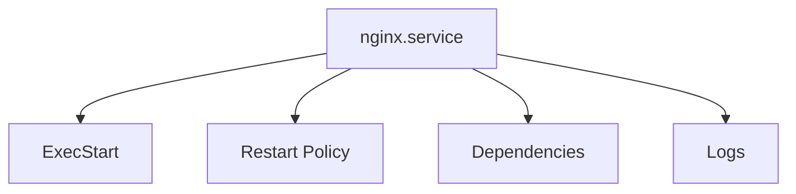

---

# Service Lifecycle

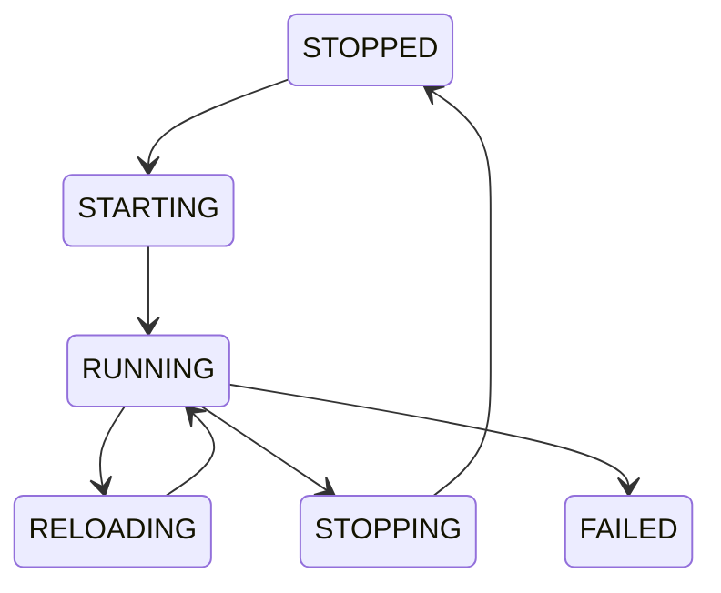

---

# Service Management Commands

Start:

```bash
systemctl start nginx
```

Stop:

```bash
systemctl stop nginx
```

Restart:

```bash
systemctl restart nginx
```

Reload:

```bash
systemctl reload nginx
```

Status:

```bash
systemctl status nginx
```

---

# Unit File Structure

Typical file:

```bash
/usr/lib/systemd/system/nginx.service
```

or

```bash
/etc/systemd/system/
```

---

# Unit File Anatomy

```ini
[Unit]
Description=Nginx Web Server

[Service]
ExecStart=/usr/sbin/nginx

[Install]
WantedBy=multi-user.target
```

---

# Unit Sections

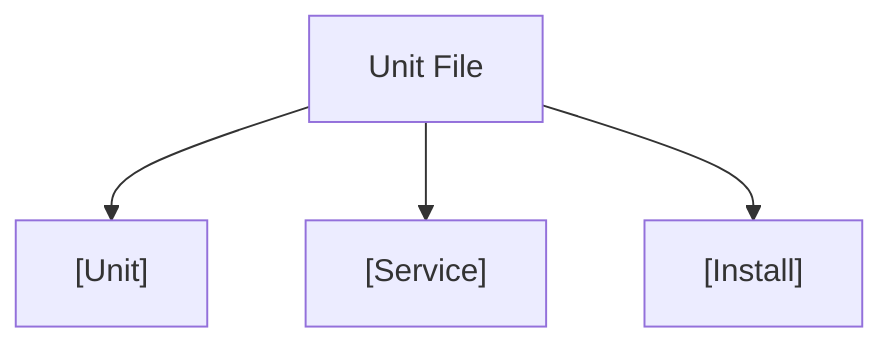

---

# Dependency Management

One of systemd's biggest strengths.

---

# Dependency Graph

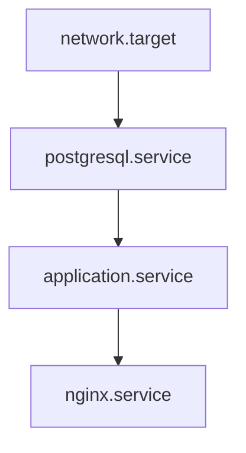

---

# Dependency Types

Common relationships:

```text
Requires=

Wants=

Before=

After=

Conflicts=
```

---

# Boot Dependency Resolution

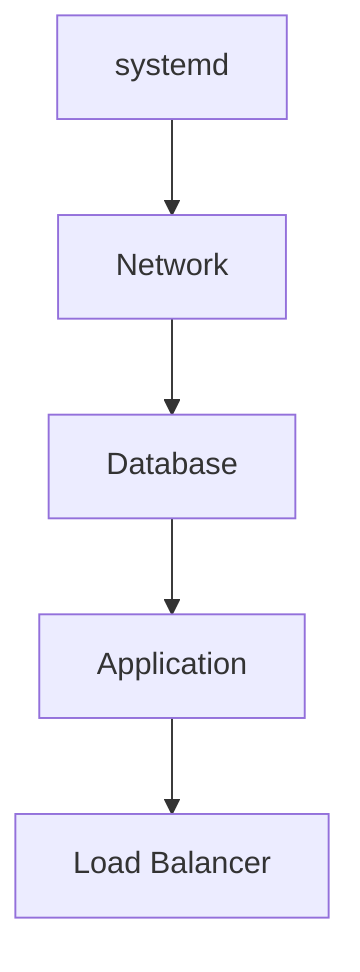

---

# Targets

Targets represent system states.

Equivalent to runlevels.

---

# Target Hierarchy

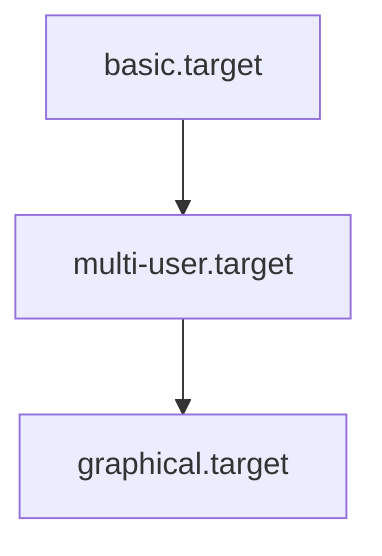

---

# Common Targets

| Target            | Purpose         |
| ----------------- | --------------- |
| rescue.target     | Recovery        |
| multi-user.target | Server          |
| graphical.target  | Desktop         |
| emergency.target  | Emergency Shell |

---

# View Current Target

```bash
systemctl get-default
```

---

# Change Target

```bash
systemctl set-default multi-user.target
```

---

# Socket Activation

One of systemd's most powerful features.

---

# Traditional Startup


Resources wasted.

---

# Socket Activation


Start only when needed.

---

# Socket Architecture

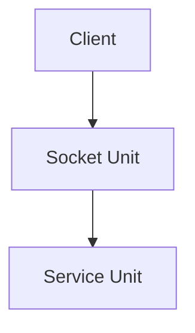

---

# Mount Management

systemd manages filesystems.

---

# Mount Architecture

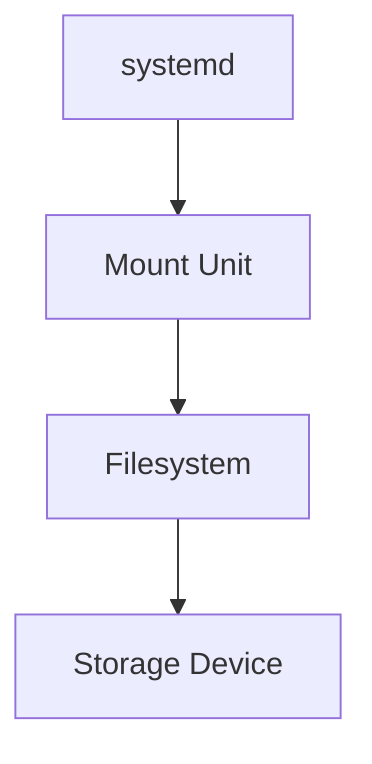

---

# View Mounts

```bash
systemctl list-units --type=mount
```

---

# Logging Architecture

Modern Linux logging revolves around journald.

---

# Logging Flow

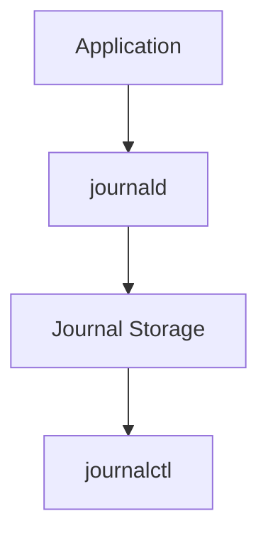

---

# journald Architecture

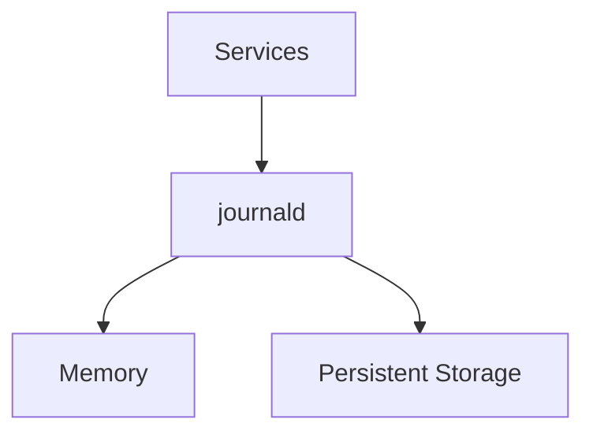

---

# View Logs

Entire system:

```bash
journalctl
```

Current boot:

```bash
journalctl -b
```

Specific service:

```bash
journalctl -u nginx
```

Live logs:

```bash
journalctl -f
```

---

# Logging Pipeline

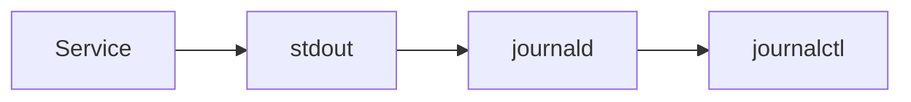

---

# Timers

systemd timers replace cron in many environments.

---

# Timer Architecture

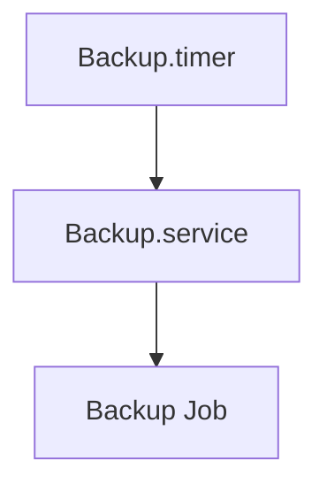

---

# Timer Flow


---

# View Timers

```bash
systemctl list-timers
```

---

# Resource Management

systemd integrates with cgroups.

---

# Resource Architecture

```mermaid
graph TD

SERVICE["Service"]

SERVICE --> CGROUP["cgroup"]

CGROUP --> CPU["CPU Limit"]

CGROUP --> MEMORY["Memory Limit"]

CGROUP --> IO["I/O Limit"]
```

---

# Example Limits

```ini
[Service]
MemoryMax=1G
CPUQuota=50%
```

---

# Failure Recovery

One of systemd's strongest capabilities.

---

# Recovery Architecture

```mermaid
flowchart TD

SERVICE["Service"]

SERVICE --> CRASH["Crash"]

CRASH --> SYSTEMD["systemd"]

SYSTEMD --> RESTART["Restart"]

RESTART --> RUNNING["Running"]
```

---

# Automatic Restart

```ini
[Service]
Restart=always
RestartSec=5
```

---

# Production Service Supervision

```mermaid
graph TD

NGINX["Nginx"]

NGINX --> SYSTEMD["systemd"]

SYSTEMD --> MONITOR["Monitor"]

MONITOR --> RESTART["Restart If Needed"]
```

---

# User Sessions

Managed by:

```text
systemd-logind
```

---

# Session Architecture

```mermaid
graph TD

USER["User"]

USER --> LOGIN["Login"]

LOGIN --> LOGIND["systemd-logind"]

LOGIND --> SESSION["Session"]
```

---

# systemd and Containers

Many containers avoid running full systemd.

Reason:

```text
Containers share host kernel
```

However:

```text
Podman
System Containers
LXC
```

may use systemd internally.

---

# Container Architecture

```mermaid
graph TD

HOST["Host systemd"]

HOST --> CONTAINER["Container"]

CONTAINER --> PROCESS["Application"]
```

---

# systemd and Kubernetes

Kubernetes nodes rely heavily on systemd.

---

# Node Architecture

```mermaid
graph TD

SYSTEMD["systemd"]

SYSTEMD --> KUBELET["kubelet"]

SYSTEMD --> CONTAINERD["containerd"]

KUBELET --> PODS["Pods"]
```

---

# Boot Performance Analysis

Essential tool:

```bash
systemd-analyze
```

---

# Boot Performance Flow

```mermaid
graph TD

BOOT["Boot"]

BOOT --> FIRMWARE["Firmware"]

BOOT --> KERNEL["Kernel"]

BOOT --> INITRAMFS["Initramfs"]

BOOT --> SYSTEMD["systemd"]

SYSTEMD --> SERVICES["Services"]
```

---

# Slow Service Investigation

```bash
systemd-analyze blame
```

---

# Critical Dependency Chain

```bash
systemd-analyze critical-chain
```

---

# Troubleshooting Workflow

```mermaid
flowchart TD

ISSUE["Service Problem"]

ISSUE --> STATUS["systemctl status"]

STATUS --> LOGS["journalctl"]

LOGS --> FAILED["Failed?"]

FAILED --> RESTART["Restart"]

RESTART --> VERIFY["Verify"]
```

---

# Production Failure Scenarios

## Nginx Not Starting

```bash
systemctl status nginx
journalctl -u nginx
```

---

## Failed Boot

```bash
systemctl --failed
```

---

## Slow Boot

```bash
systemd-analyze blame
```

---

## Dependency Failure

```bash
systemctl list-dependencies
```

---

# Common Mistakes

### Using SIGKILL Immediately

Prefer:

```bash
systemctl stop service
```

---

### Ignoring Dependencies

A service may fail because another service failed.

---

### Ignoring Journald

Most answers already exist in logs.

---

### Running Processes Outside systemd

Loses supervision and recovery.

---

### Not Configuring Restart Policies

Causes avoidable downtime.

---

# Production Engineering Mindset

Beginners see:

```text
systemctl start nginx
```

Engineers see:

```text
Unit Files
     ↓
Dependency Graph
     ↓
Targets
     ↓
cgroups
     ↓
Logging
     ↓
Recovery
     ↓
Observability
```

systemd is not merely a service manager.

It is the operating system control plane.

---

# Interview Questions

### What is systemd?

### Why is PID 1 special?

### What is a unit?

### Difference between service and target?

### What is journald?

### What is socket activation?

### What are systemd timers?

### What is a dependency graph?

### What is multi-user.target?

### How do you troubleshoot failed services?

### How does systemd integrate with cgroups?

### How does systemd handle automatic recovery?

### How does systemd improve boot performance?

### What replaced cron in systemd?

### How does Kubernetes use systemd?

---

# One-Page Architecture Summary

```text
Linux Boot
      ↓
Kernel
      ↓
systemd (PID 1)
      ↓
Targets
      ↓
Services
      ↓
Logging
      ↓
Timers
      ↓
Resource Management
      ↓
Application Availability
```

---

# Final Takeaway

systemd is the central control plane of modern Linux.

It manages:

```text
Boot Process

Services

Dependencies

Targets

Logging

Timers

Mounts

Sockets

Resource Controls

Failure Recovery
```

Every modern Linux server, cloud VM, Kubernetes node, and production platform depends on systemd to bring the operating system to life and keep it running reliably.

Master systemd and you gain control over the lifecycle of the entire operating system.
