# Linux Engineering Master Mind Maps

## The Complete Visual Knowledge Graph from Linux Fundamentals to Internet-Scale Infrastructure

---

# Why This File Exists

This file is designed to be the **single visual navigation map** for the entire Linux Engineering Handbook.

Think of this file as:

```text
Linux Engineering Atlas

+
Systems Thinking Map

+
Infrastructure Knowledge Graph

+
Career Roadmap
```

A reader should be able to start from:

```text
Linux Basics
```

and visually understand the path toward:

```text
Platform Engineering

Cloud Architecture

Site Reliability Engineering

Distributed Systems

Internet Scale Infrastructure
```

---

# The Ultimate Linux Engineering Map

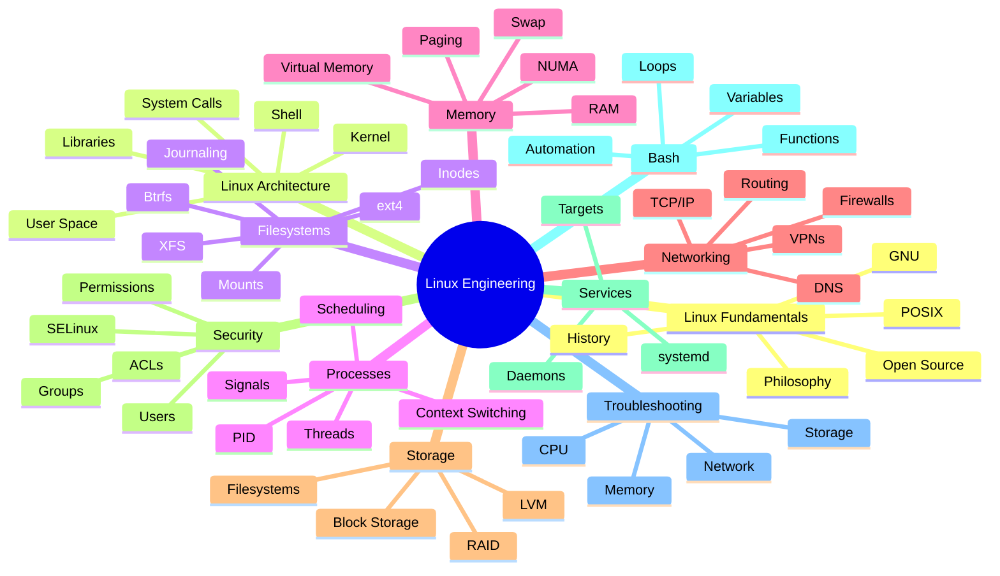

---

# Linux Architecture Deep Map

```mermaid
mindmap
  root((Linux Architecture))

    Hardware

      CPU
      RAM
      Storage
      NIC
      Interrupts

    Kernel

      Scheduler
      Memory Manager
      VFS
      Network Stack
      Security
      Drivers

    User Space

      Shell
      Libraries
      Applications

    System Calls

      open()
      read()
      write()
      fork()
      exec()

    Processes

      Parent
      Child
      Threads

    Filesystems

      ext4
      XFS
      Btrfs

    Networking

      Sockets
      TCP
      UDP
```

---

# Linux Boot Process Master Map

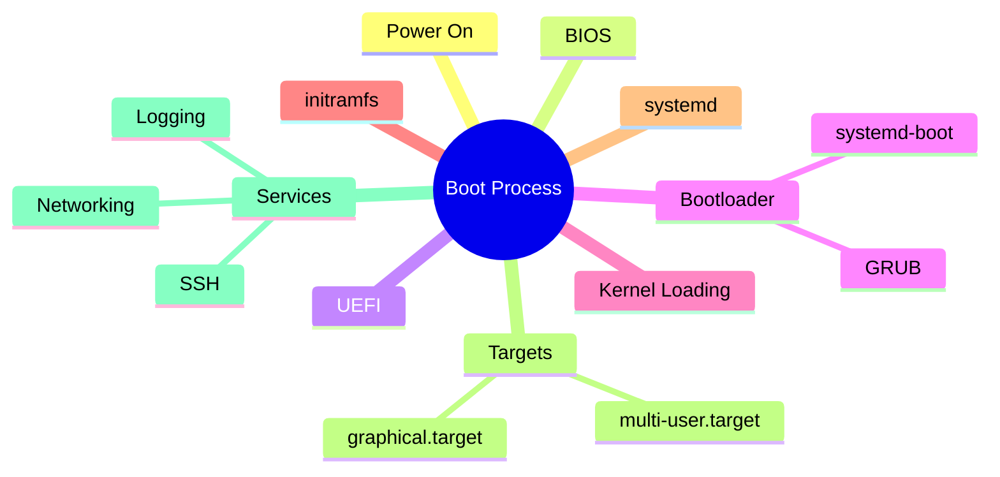

---

# Linux Filesystem Master Map

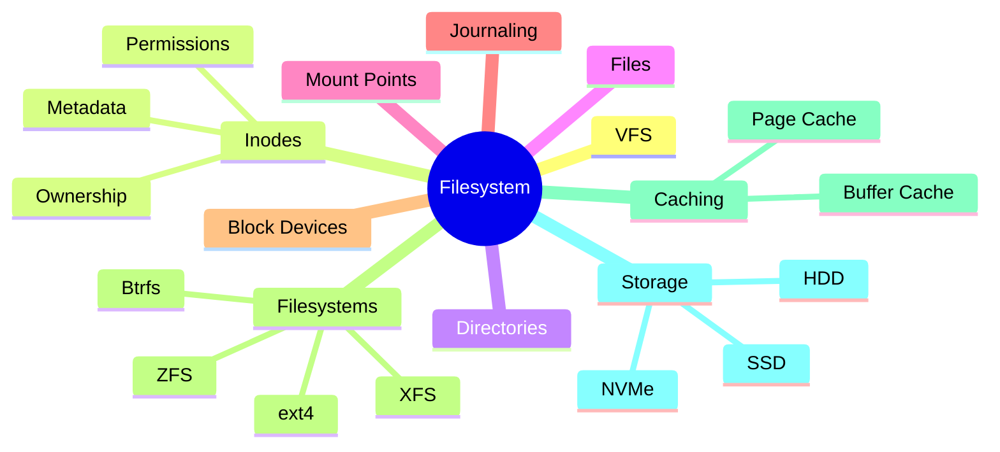

---

# Linux Process Management Map

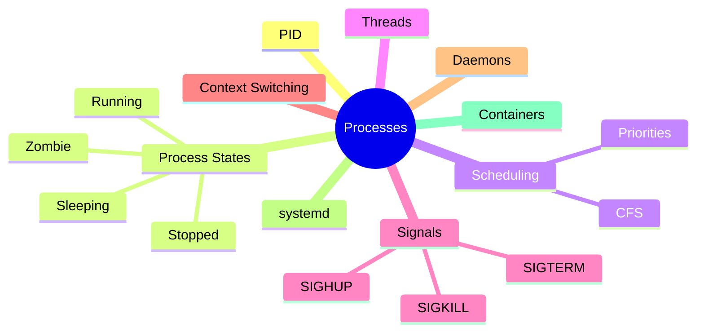

---

# Linux Memory Management Map

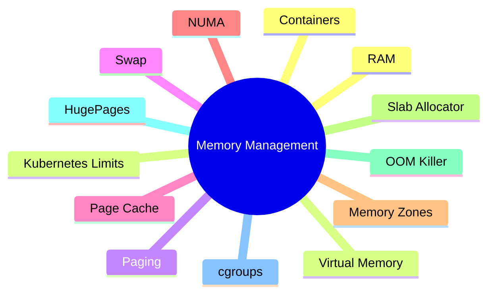

---

# Linux Networking Master Map

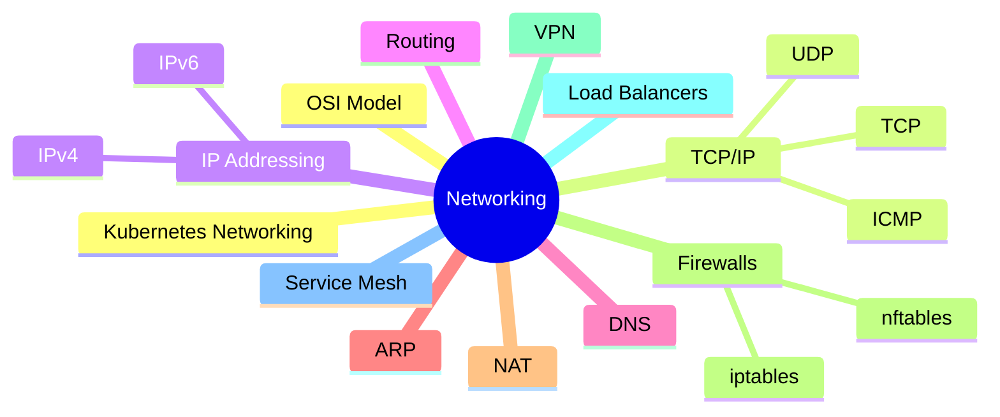

---

# Linux Storage Master Map

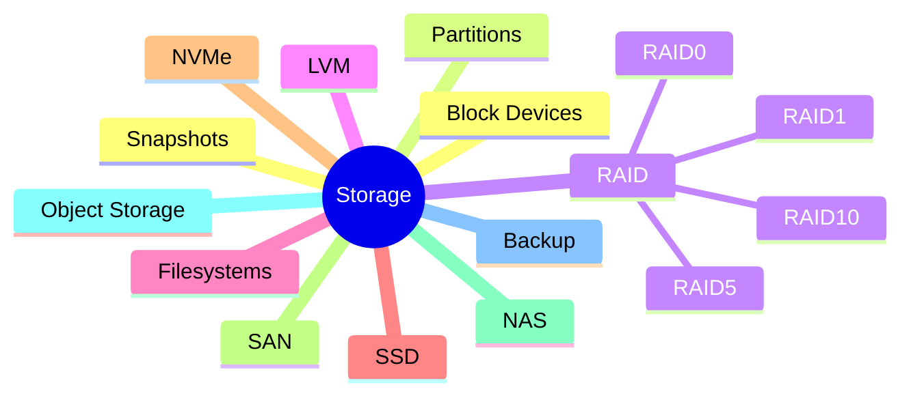

---

# Linux Security Master Map

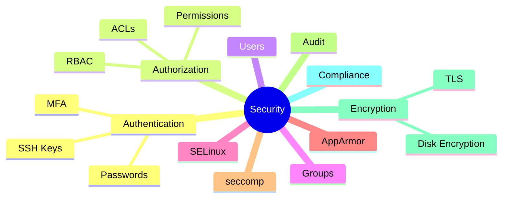

---

# systemd Architecture Map

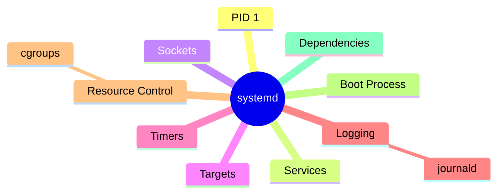

---

# Bash Engineering Map

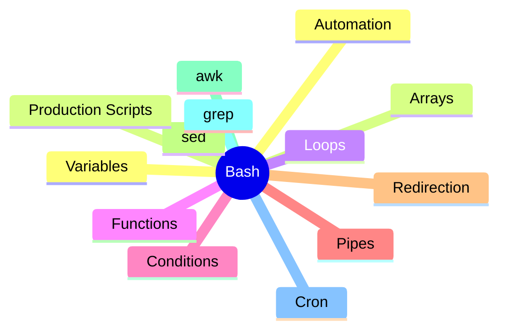

---

# Docker Internals Master Map

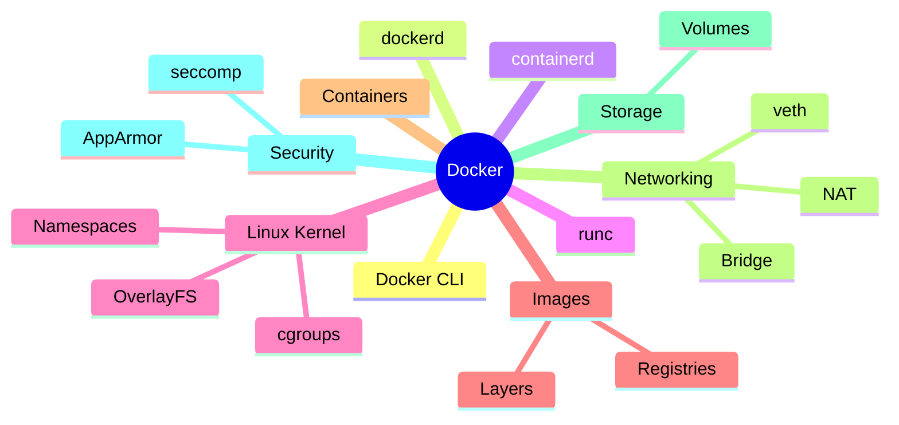

---

# Kubernetes Master Map

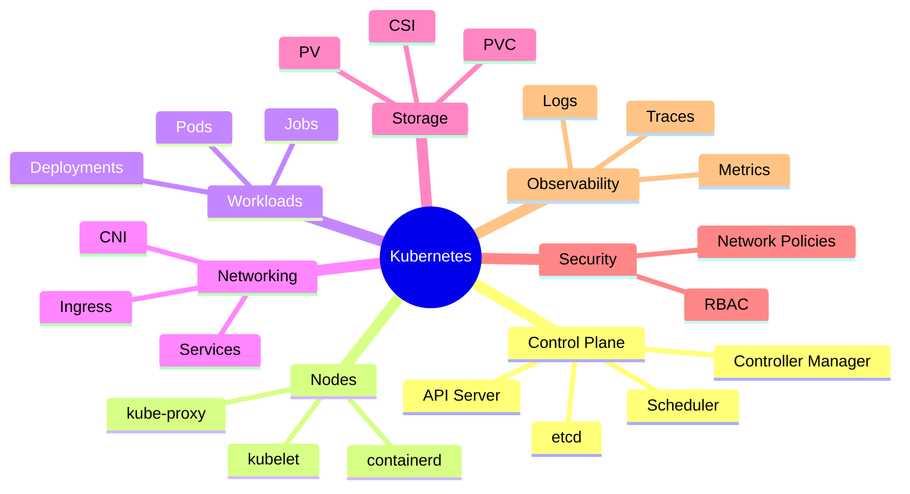

---

# Cloud Infrastructure Master Map

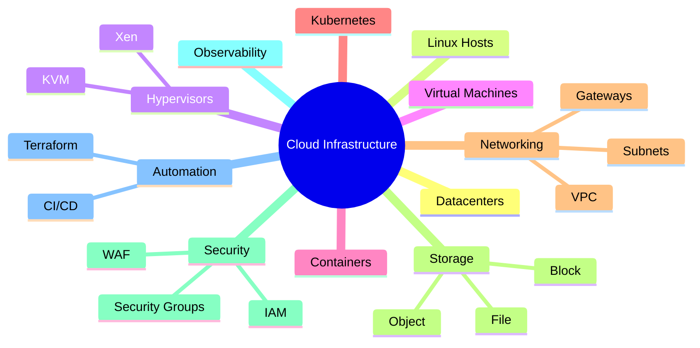

---

# Database Internals Master Map

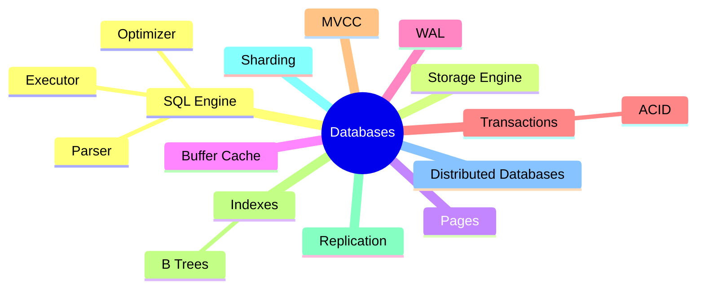

---

# Observability Master Map

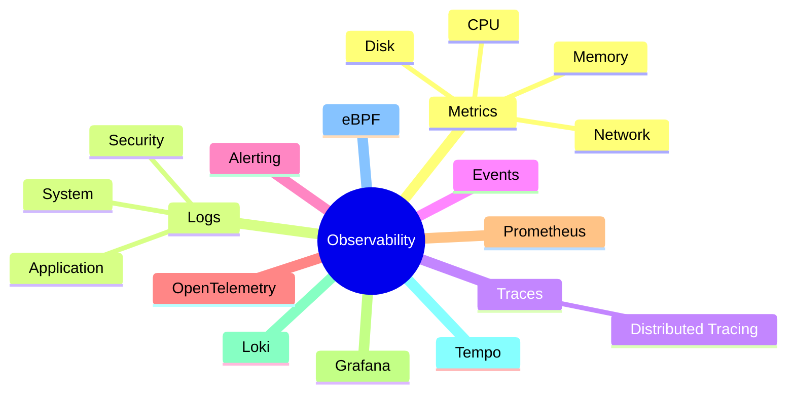

---

# Distributed Systems Master Map

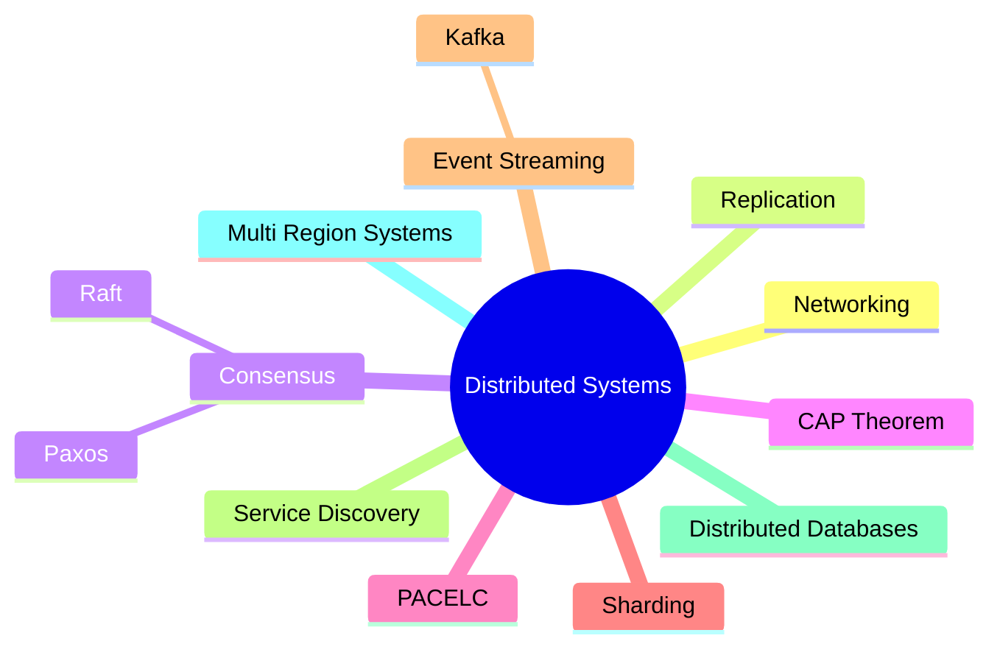

---

# Internet Architecture Master Map

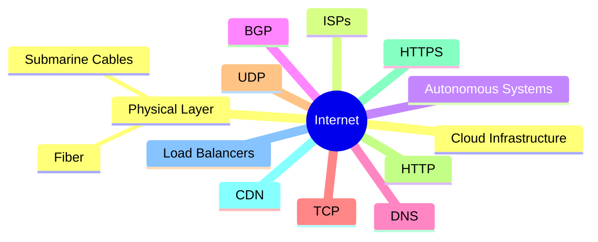

---

# Production Request Flow Map

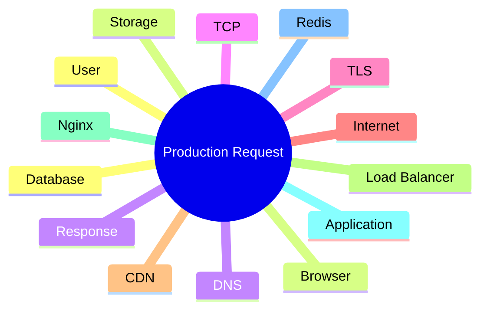

---

# Complete Production Infrastructure Map

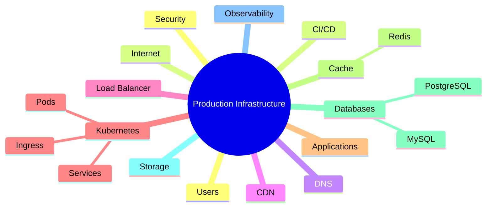

---

# Platform Engineering Map

```mermaid
mindmap
  root((Platform Engineering))

    Linux

    Containers

    Kubernetes

    CI/CD

    GitOps

    Terraform

    Observability

    Security

    Developer Experience

    Internal Platforms

    Automation
```

---

# SRE Master Map

```mermaid
mindmap
  root((Site Reliability Engineering))

    SLI

    SLO

    SLA

    Monitoring

    Alerting

    Incident Response

    Capacity Planning

    Reliability

    Automation

    Postmortems
```

---

# Startup Infrastructure Evolution Map

```mermaid
mindmap
  root((Startup Journey))

    Single Linux Server

    Multiple Servers

    Load Balancer

    Containers

    Kubernetes

    Cloud Infrastructure

    Multi Region

    Global Platform
```

---

# Career Growth Roadmap

```mermaid
mindmap
  root((Engineering Growth))

    Beginner

      Linux Basics
      Commands
      Filesystem

    Intermediate

      Networking
      Storage
      Bash

    Advanced

      Performance
      Security
      Troubleshooting

    Senior

      Docker
      Kubernetes
      Cloud

    Staff

      Distributed Systems
      Databases
      Platform Engineering

    Architect

      Global Systems
      Internet Infrastructure
      Organizational Design
```

---

# The Ultimate Infrastructure Knowledge Graph

```mermaid
graph TD

LINUX["Linux"]

LINUX --> FILESYSTEM["Filesystem"]

LINUX --> PROCESS["Processes"]

LINUX --> MEMORY["Memory"]

LINUX --> NETWORK["Networking"]

LINUX --> STORAGE["Storage"]

LINUX --> SECURITY["Security"]

PROCESS --> CONTAINERS["Containers"]

CONTAINERS --> DOCKER["Docker"]

DOCKER --> K8S["Kubernetes"]

K8S --> CLOUD["Cloud"]

NETWORK --> INTERNET["Internet"]

STORAGE --> DATABASES["Databases"]

DATABASES --> DISTRIBUTED["Distributed Systems"]

DISTRIBUTED --> GLOBAL["Global Infrastructure"]

GLOBAL --> PLATFORM["Platform Engineering"]

PLATFORM --> SRE["SRE"]

SRE --> OBS["Observability"]
```

---

# The Entire Repository in One Diagram

```mermaid
flowchart TD

A["Linux Fundamentals"]

A --> B["Linux Architecture"]

B --> C["Filesystem"]

B --> D["Processes"]

B --> E["Memory"]

B --> F["Networking"]

B --> G["Storage"]

B --> H["Security"]

H --> I["systemd"]

I --> J["Bash"]

J --> K["Troubleshooting"]

K --> L["Docker"]

L --> M["Kubernetes"]

M --> N["Cloud"]

N --> O["Databases"]

O --> P["Observability"]

P --> Q["Distributed Systems"]

Q --> R["Internet Architecture"]

R --> S["Production Infrastructure"]

S --> T["Platform Engineering"]

T --> U["SRE"]

U --> V["System Architecture"]

V --> W["Founder-Level Infrastructure Thinking"]
```

---

# Final Takeaway

Linux is not a topic.

Linux is the foundation.

Everything eventually connects:

```text
Linux
 ↓
Processes
 ↓
Containers
 ↓
Kubernetes
 ↓
Cloud
 ↓
Databases
 ↓
Distributed Systems
 ↓
Internet
 ↓
Global Infrastructure
```

If someone masters every map in this file, they gain a mental model that connects:

```text
Linux Administration

Backend Engineering

DevOps

Cloud Engineering

SRE

Platform Engineering

Distributed Systems

Internet Architecture

System Design

Infrastructure Leadership
```

into one unified engineering worldview.
