# Production Incident Flows

## Real-World Incident Response Playbooks from Alert to Recovery

---

# Why This Exists

Most engineers learn technologies.

Few learn incidents.

But careers are built during incidents.

Production incidents teach:

```text
Linux

Networking

Databases

Containers

Kubernetes

Cloud

Distributed Systems
```

faster than any course ever can.

The difference between a junior engineer and a senior engineer is often:

```text
Ability to diagnose and recover production systems under pressure.
```

This file contains incident flows used by:

* SREs
* DevOps Engineers
* Platform Engineers
* Cloud Engineers
* Backend Engineers
* Infrastructure Teams

during real production failures.

---

# The Core Mental Model

A production incident is not:

```text
System Failure
```

A production incident is:

```text
Information Gathering Problem
```

You are trying to answer:

```text
What failed?

Why did it fail?

What is the impact?

How do we restore service quickly?

How do we prevent recurrence?
```

---

# Universal Incident Lifecycle

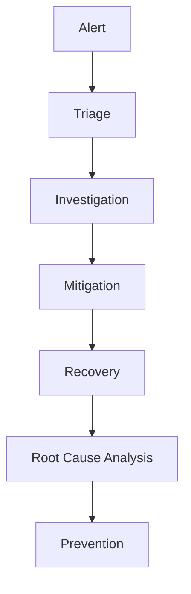

---

# The Golden Rule

During incidents:

```text
Restore Service First

Understand Everything Later
```

---

# Incident Severity Model

```text
P1 = Complete Outage

P2 = Major Business Impact

P3 = Partial Degradation

P4 = Minor Issue
```

---

# Incident Command Structure

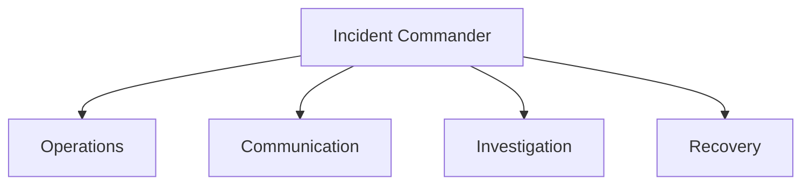

---

# Universal Investigation Flow

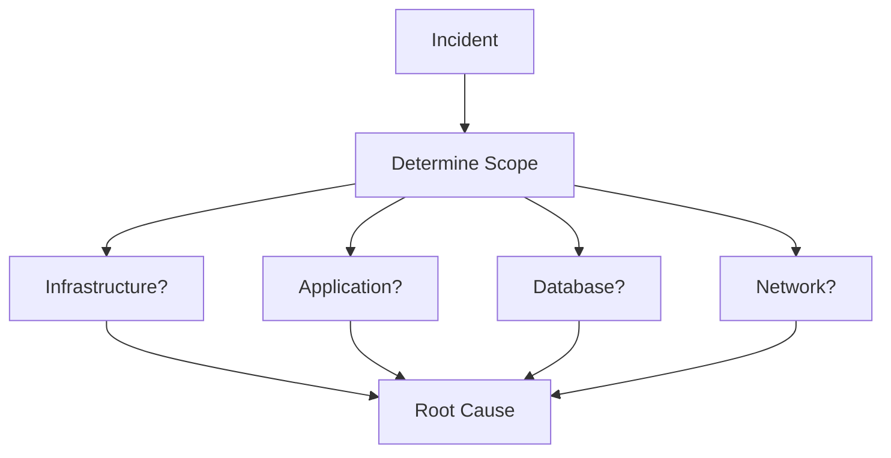

---

# Incident Flow #1

# Website Completely Down

---

## Symptoms

```text
Users Cannot Access Site

5xx Errors

Health Checks Failing
```

---

## Investigation Flow

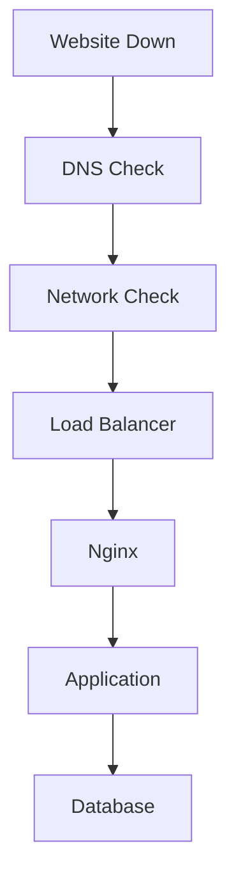

---

## Commands

```bash
dig example.com

ping

curl -I

systemctl status nginx

journalctl -xe
```

---

## Common Root Causes

```text
DNS Failure

Expired Certificate

Load Balancer Failure

Application Crash

Database Failure
```

---

# Incident Flow #2

# High CPU Usage

---

## Symptoms

```text
Slow Application

High Load Average

Increased Latency
```

---

## Investigation Flow

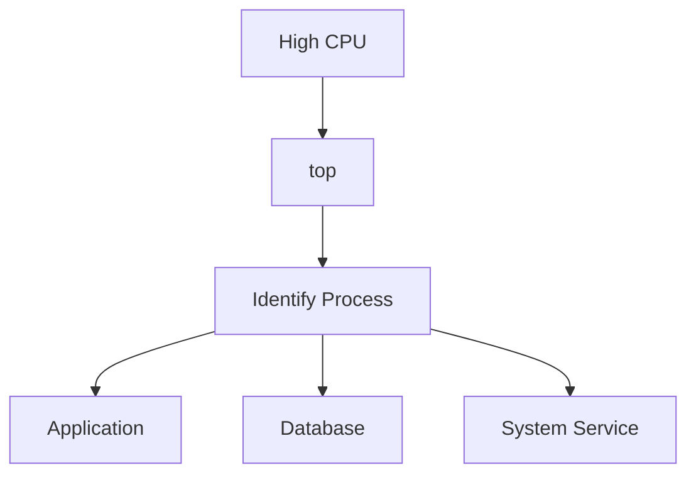

---

## Commands

```bash
top

htop

pidstat

mpstat
```

---

## Root Causes

```text
Infinite Loops

Bad Queries

Traffic Spike

Resource Starvation
```

---

# Incident Flow #3

# Memory Exhaustion

---

## Symptoms

```text
OOMKilled

Slow System

Swap Usage

Application Crashes
```

---

## Flow

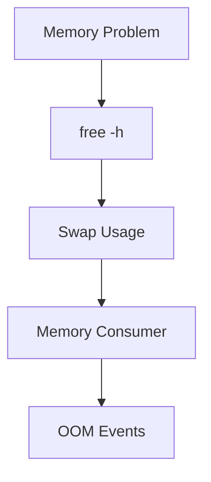

---

## Commands

```bash
free -h

vmstat

smem

dmesg | grep oom
```

---

## Root Causes

```text
Memory Leak

Bad Cache Strategy

Large Queries

Traffic Surge
```

---

# Incident Flow #4

# Disk Full

---

## Symptoms

```text
Write Failures

Database Errors

Service Crashes
```

---

## Flow

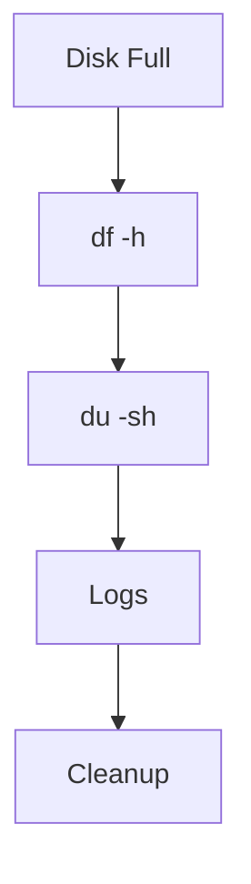

---

## Commands

```bash
df -h

du -sh *

find / -size +1G
```

---

## Root Causes

```text
Log Explosion

Backup Growth

Runaway Data

Container Images
```

---

# Incident Flow #5

# DNS Outage

---

## Symptoms

```text
Site Not Reachable

Unknown Host

Intermittent Failures
```

---

## Flow

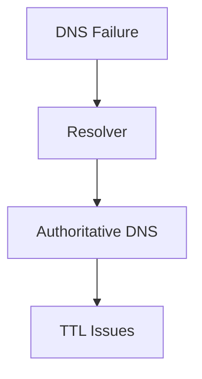

---

## Commands

```bash
dig

host

nslookup
```

---

## Root Causes

```text
Expired Records

Misconfiguration

Provider Outage

DNS Propagation
```

---

# Incident Flow #6

# SSL Certificate Failure

---

## Symptoms

```text
Browser Warnings

TLS Handshake Failure

API Failures
```

---

## Flow

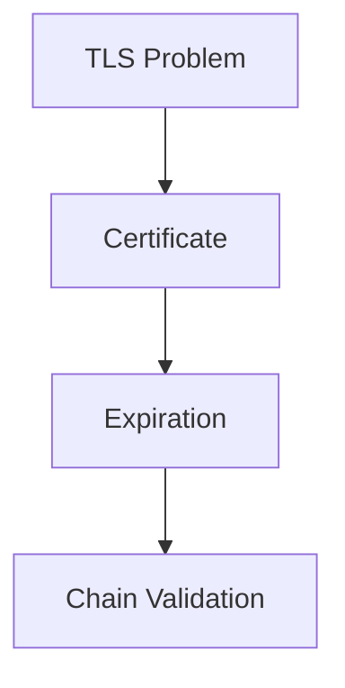

---

## Commands

```bash
openssl s_client

curl -v

openssl x509
```

---

## Root Causes

```text
Expired Certificate

Wrong Certificate

Broken Chain
```

---

# Incident Flow #7

# Database Slow

---

## Symptoms

```text
High Latency

Slow Pages

Timeouts
```

---

## Investigation Flow

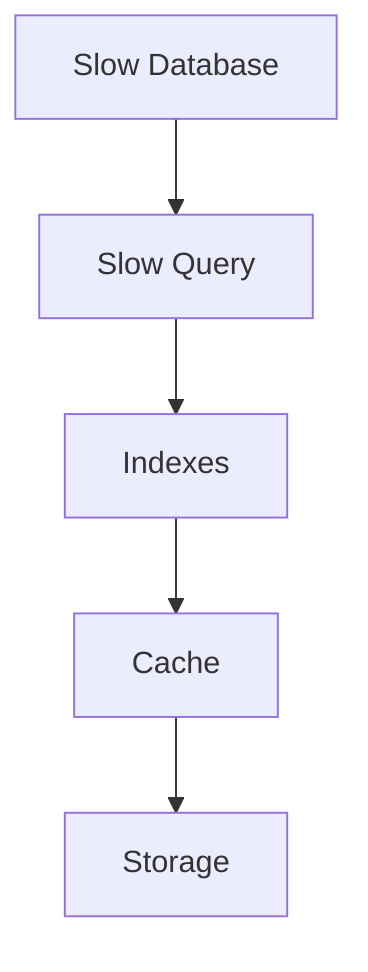

---

## Commands

```sql
EXPLAIN ANALYZE

SHOW PROCESSLIST

pg_stat_activity
```

---

## Root Causes

```text
Missing Indexes

Table Scans

Replication Lag

Storage Bottlenecks
```

---

# Incident Flow #8

# Replication Lag

---

## Symptoms

```text
Stale Data

Delayed Reads

Replication Delay
```

---

## Flow

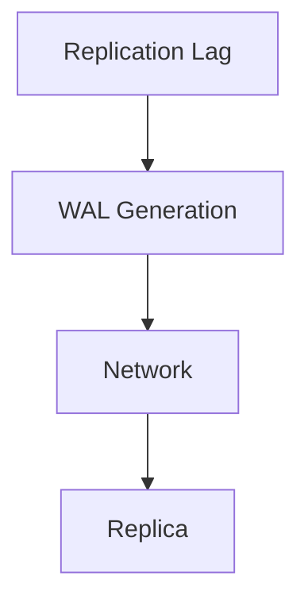

---

## Root Causes

```text
Heavy Writes

Slow Replica

Network Latency

Disk Saturation
```

---

# Incident Flow #9

# Kubernetes Pod Pending

---

## Symptoms

```text
Pod Never Starts
```

---

## Flow

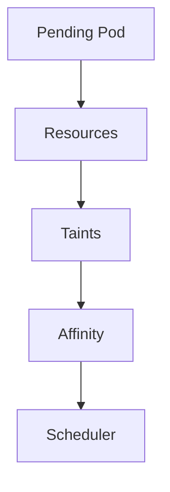

---

## Commands

```bash
kubectl describe pod

kubectl get events
```

---

## Root Causes

```text
Insufficient CPU

Insufficient Memory

Node Constraints
```

---

# Incident Flow #10

# CrashLoopBackOff

---

## Symptoms

```text
Container Constantly Restarting
```

---

## Flow

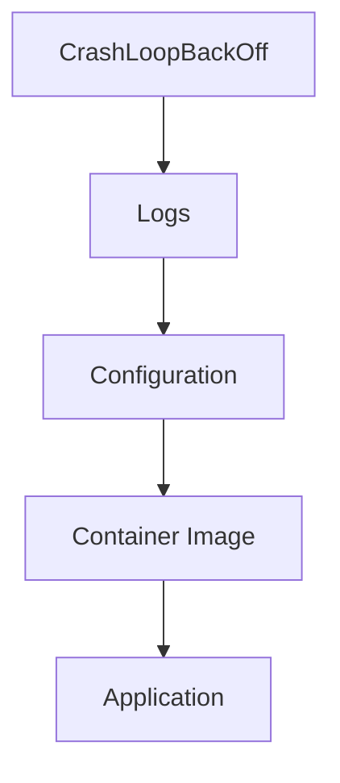

---

## Commands

```bash
kubectl logs

kubectl describe pod
```

---

## Root Causes

```text
Bad Config

Startup Failure

Dependency Failure
```

---

# Incident Flow #11

# Service Unreachable

---

## Symptoms

```text
Connection Refused

Timeout
```

---

## Flow

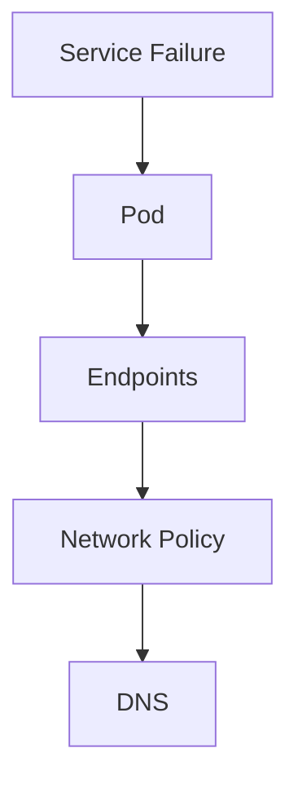

---

## Root Causes

```text
Wrong Selector

Pod Failure

Network Policy
```

---

# Incident Flow #12

# Container OOMKilled

---

## Symptoms

```text
OOMKilled

Restarts
```

---

## Flow

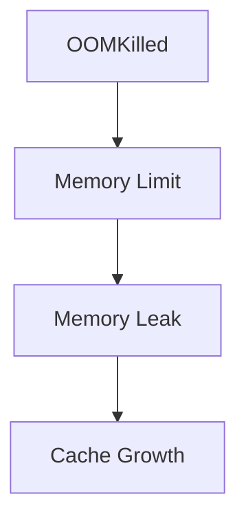

---

## Commands

```bash
kubectl top pod

docker stats
```

---

## Root Causes

```text
Memory Leak

Low Limits

Traffic Surge
```

---

# Incident Flow #13

# Load Balancer Failure

---

## Symptoms

```text
Users Cannot Connect

502 Errors

503 Errors
```

---

## Flow

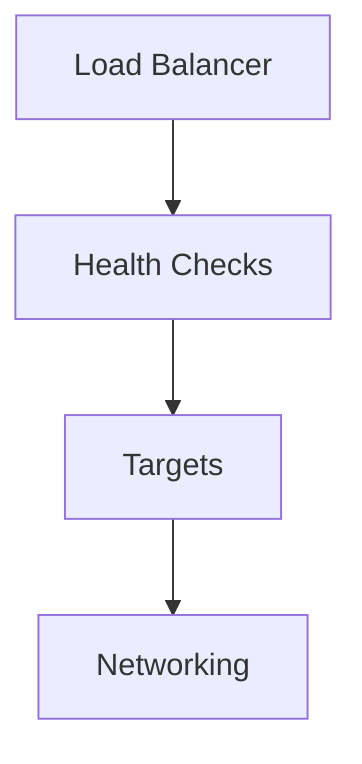

---

## Root Causes

```text
Backend Failure

Health Check Misconfig

Network Failure
```

---

# Incident Flow #14

# Cloud IAM Failure

---

## Symptoms

```text
Access Denied

Permission Errors
```

---

## Flow

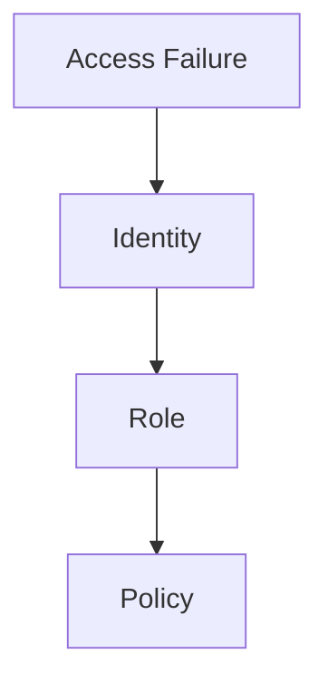

---

## Root Causes

```text
Missing Role

Policy Error

Expired Credentials
```

---

# Incident Flow #15

# Internet-Scale Traffic Spike

---

## Symptoms

```text
Latency Spike

CPU Spike

Queue Growth
```

---

## Flow

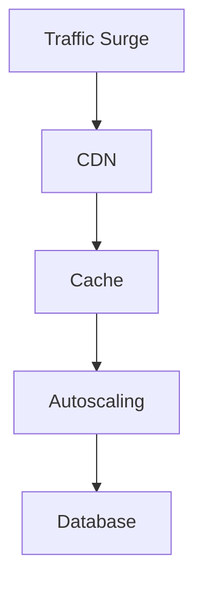

---

## Root Causes

```text
Marketing Campaign

Bot Traffic

DDoS

Viral Content
```

---

# DDoS Incident Flow

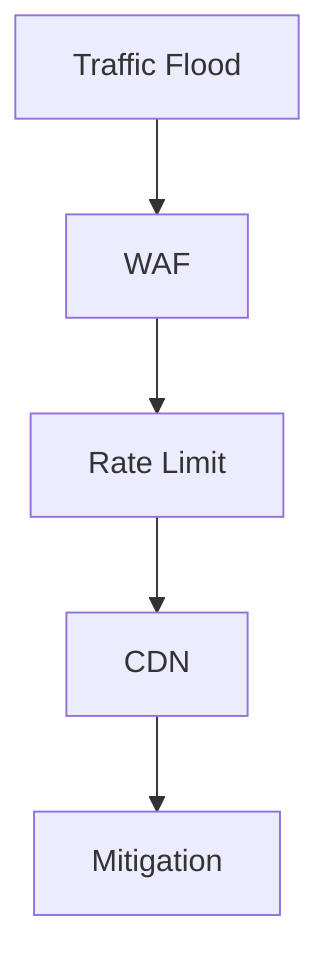

---

# Distributed System Incident

---

## Symptoms

```text
Partial Failure

Timeouts

Inconsistent Data
```

---

## Flow

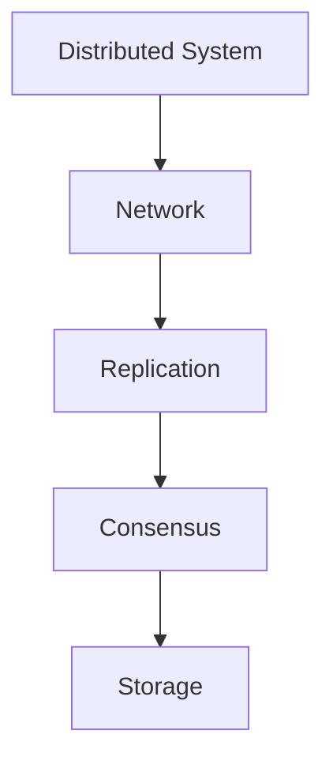

---

# Production Request Failure Flow

```mermaid
flowchart LR

USER["User"]

USER --> DNS["DNS"]

DNS --> LB["Load Balancer"]

LB --> APP["Application"]

APP --> CACHE["Redis"]

CACHE --> DB["Database"]

DB --> STORAGE["Storage"]
```

Failure can occur at any layer.

---

# Incident Escalation Model

```mermaid
graph TD

L1["L1 Support"]

L1 --> L2["Operations"]

L2 --> L3["Engineering"]

L3 --> SME["Subject Matter Expert"]
```

---

# Incident Communication Flow

```mermaid
flowchart TD

INCIDENT["Incident"]

INCIDENT --> INTERNAL["Internal Teams"]

INCIDENT --> STATUS["Status Page"]

INCIDENT --> CUSTOMERS["Customers"]
```

---

# Postmortem Workflow

```mermaid
flowchart TD

INCIDENT["Incident"]

INCIDENT --> TIMELINE["Timeline"]

TIMELINE --> RCA["Root Cause"]

RCA --> ACTIONS["Actions"]

ACTIONS --> PREVENTION["Prevention"]
```

---

# Five Whys Example

```text
Website Down

Why?
Database Down

Why?
Disk Full

Why?
Logs Filled Disk

Why?
Rotation Failed

Why?
Configuration Error
```

Root Cause:

```text
Log Rotation Misconfiguration
```

---

# Metrics → Logs → Traces Flow

```mermaid
flowchart TD

ALERT["Alert"]

ALERT --> METRICS["Metrics"]

METRICS --> LOGS["Logs"]

LOGS --> TRACES["Traces"]

TRACES --> ROOTCAUSE["Root Cause"]
```

---

# The Golden Signals During Incidents

```mermaid
graph TD

SYSTEM["System"]

SYSTEM --> LATENCY["Latency"]

SYSTEM --> TRAFFIC["Traffic"]

SYSTEM --> ERRORS["Errors"]

SYSTEM --> SATURATION["Saturation"]
```

---

# Incident War Room Workflow

```mermaid
flowchart TD

INCIDENT["Incident"]

INCIDENT --> COMMANDER["Incident Commander"]

COMMANDER --> OPS["Operations"]

COMMANDER --> INVEST["Investigation"]

COMMANDER --> COMM["Communications"]

OPS --> RECOVERY["Recovery"]
```

---

# Complete Incident Response Mind Map

```mermaid
mindmap
  root((Production Incidents))

    Linux
      CPU
      Memory
      Disk

    Networking
      DNS
      Routing
      TLS

    Databases
      Queries
      Replication

    Containers
      OOM
      CrashLoop

    Kubernetes
      Pods
      Services

    Cloud
      IAM
      Load Balancers

    Distributed Systems
      Consensus
      Replication

    Response
      Triage
      Recovery
      RCA
```

---

# Engineering Mindset

Beginners during incidents:

```text
Try Random Fixes
```

Experienced engineers:

```text
Measure

Observe

Verify

Narrow Scope

Restore Service

Find Root Cause

Prevent Recurrence
```

---

# One-Page Incident Response Summary

```text
Alert
  ↓
Triage
  ↓
Scope
  ↓
Evidence
  ↓
Metrics
  ↓
Logs
  ↓
Traces
  ↓
Mitigation
  ↓
Recovery
  ↓
Root Cause
  ↓
Postmortem
  ↓
Prevention
```

---

# Final Takeaway

Production incidents are where Linux, networking, databases, containers, Kubernetes, cloud infrastructure, and distributed systems all meet.

The best engineers are not the ones who never see incidents.

They are the ones who can:

```text
Stay Calm

Gather Evidence

Restore Service

Identify Root Cause

Improve Systems
```

Every major outage is ultimately an opportunity to improve the reliability, scalability, and resilience of the platform.
