# Troubleshooting Decision Trees

## A Production Engineer's Visual Guide to Diagnosing Linux, Network, Database, Docker, Kubernetes, and Cloud Failures

---

# Why This Exists

Most engineers troubleshoot incorrectly.

A common approach:

```text
Something is broken
      ↓
Try random commands
      ↓
Google errors
      ↓
Restart services
      ↓
Hope it works
```

This is not engineering.

Professional troubleshooting follows a systematic process:

```text
Observe
      ↓
Identify Layer
      ↓
Collect Evidence
      ↓
Narrow Scope
      ↓
Find Root Cause
      ↓
Fix
      ↓
Verify
      ↓
Prevent Recurrence
```

This file provides decision trees used by:

* Linux Engineers
* SREs
* DevOps Engineers
* Platform Engineers
* Cloud Engineers
* Infrastructure Architects

to quickly isolate failures in production.

---

# The Universal Troubleshooting Mental Model

Before touching any system, ask:

```text
What changed?

What is failing?

Who is affected?

When did it start?

Can it be reproduced?
```

Never start with:

```text
Random Fixes
```

Start with:

```text
Evidence
```

---

# Universal Incident Workflow

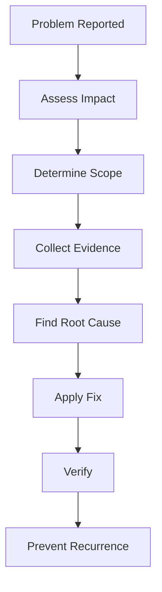
```mermaid
flowchart TD

ALERT["Problem Reported"]

ALERT --> IMPACT["Assess Impact"]

IMPACT --> SCOPE["Determine Scope"]

SCOPE --> DATA["Collect Evidence"]

DATA --> ROOTCAUSE["Find Root Cause"]

ROOTCAUSE --> FIX["Apply Fix"]

FIX --> VERIFY["Verify"]

VERIFY --> POSTMORTEM["Prevent Recurrence"]
```

---

# Layer-Based Troubleshooting Model

Most production issues belong to one of these layers:

```text
Application

Process

Operating System

Storage

Networking

Database

Container

Kubernetes

Cloud Infrastructure
```

---

# Infrastructure Stack Decision Tree

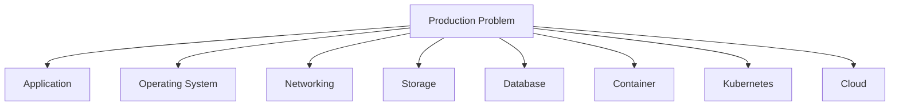
```mermaid
flowchart TD

PROBLEM["Production Problem"]

PROBLEM --> APP["Application"]

PROBLEM --> OS["Operating System"]

PROBLEM --> NET["Networking"]

PROBLEM --> STORAGE["Storage"]

PROBLEM --> DB["Database"]

PROBLEM --> CONTAINER["Container"]

PROBLEM --> K8S["Kubernetes"]

PROBLEM --> CLOUD["Cloud"]
```

---

# Master Incident Decision Tree

When a system fails:

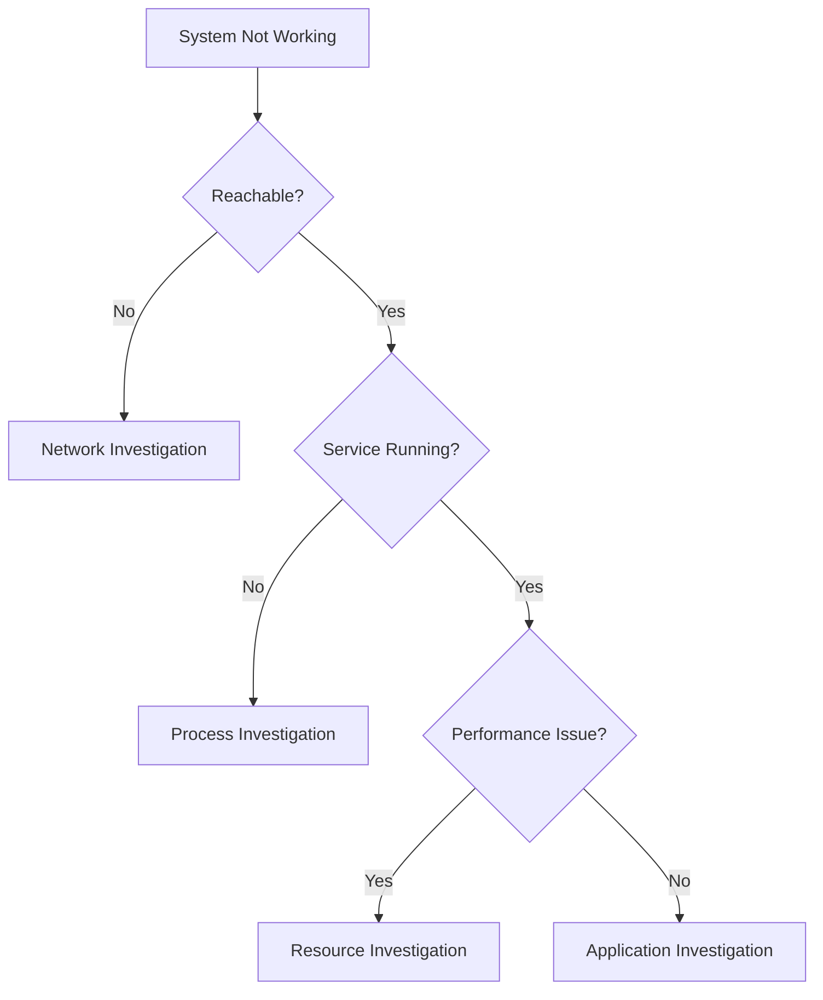
```mermaid
flowchart TD

START["System Not Working"]

START --> REACHABLE{"Reachable?"}

REACHABLE -->|No| NETWORK["Network Investigation"]

REACHABLE -->|Yes| SERVICE{"Service Running?"}

SERVICE -->|No| PROCESS["Process Investigation"]

SERVICE -->|Yes| PERFORMANCE{"Performance Issue?"}

PERFORMANCE -->|Yes| RESOURCE["Resource Investigation"]

PERFORMANCE -->|No| APPLICATION["Application Investigation"]
```

---

# Linux Server Down Decision Tree

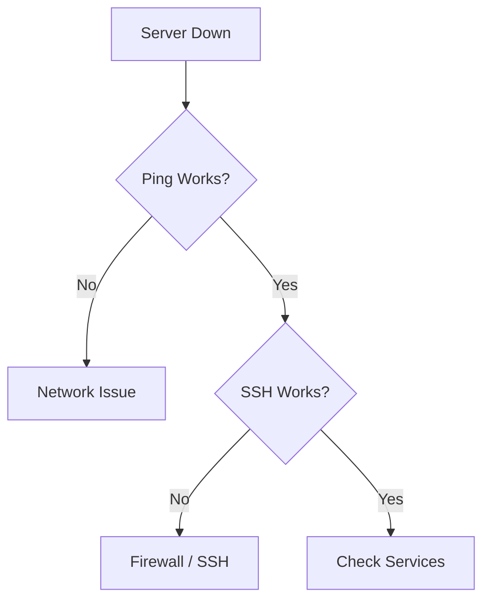
```mermaid
flowchart TD

SERVER["Server Down"]

SERVER --> PING{"Ping Works?"}

PING -->|No| NETWORK["Network Issue"]

PING -->|Yes| SSH{"SSH Works?"}

SSH -->|No| FIREWALL["Firewall / SSH"]

SSH -->|Yes| SERVICES["Check Services"]
```

---

# Server Investigation Workflow

```text
1. Ping
2. SSH
3. Load
4. Memory
5. Disk
6. Services
7. Logs
```

---

# Linux High CPU Decision Tree

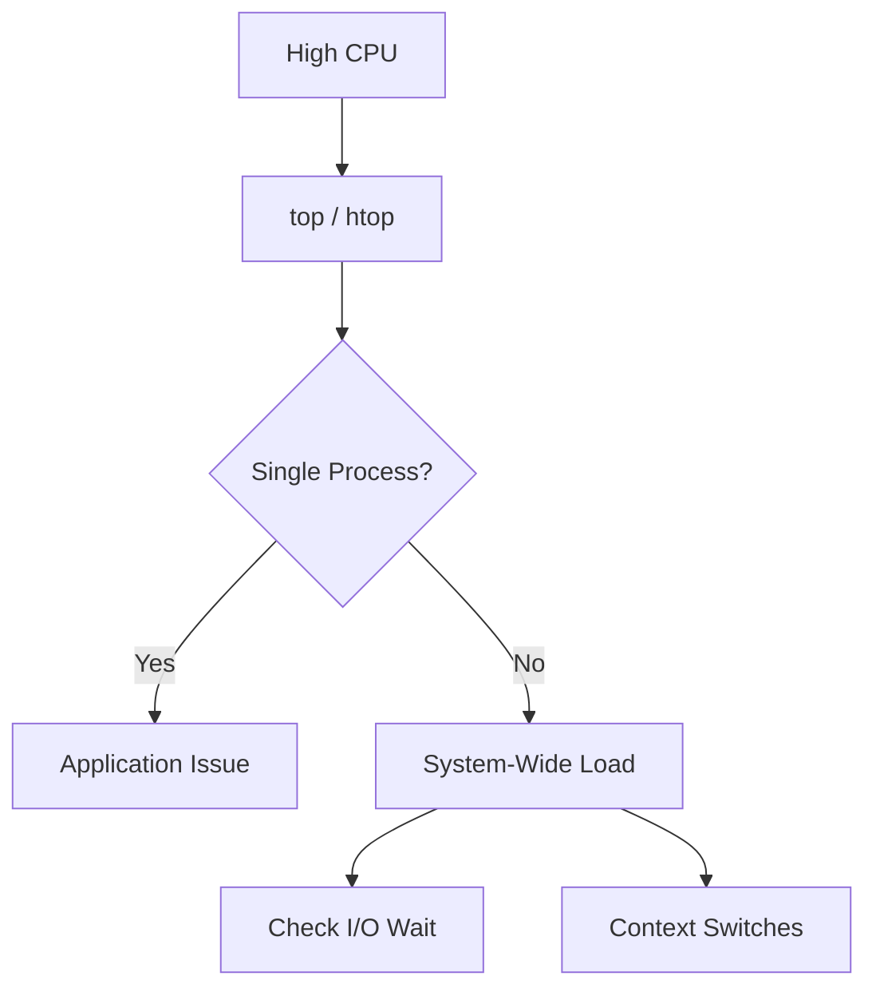
```mermaid
flowchart TD

CPU["High CPU"]

CPU --> TOP["top / htop"]

TOP --> PROCESS{"Single Process?"}

PROCESS -->|Yes| APP["Application Issue"]

PROCESS -->|No| SYSTEM["System-Wide Load"]

SYSTEM --> IO["Check I/O Wait"]

SYSTEM --> CONTEXT["Context Switches"]
```

---

# High CPU Checklist

```bash
top

htop

mpstat

pidstat

ps aux --sort=-%cpu
```

---

# Linux High Memory Decision Tree

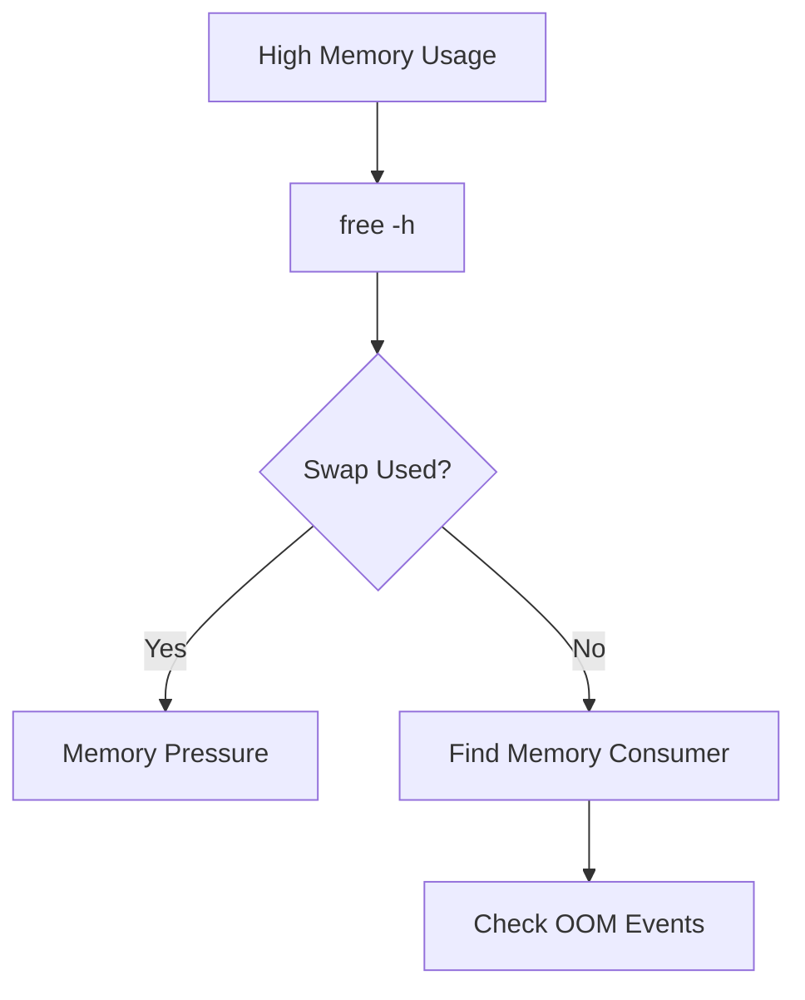
```mermaid
flowchart TD

MEM["High Memory Usage"]

MEM --> FREE["free -h"]

FREE --> SWAP{"Swap Used?"}

SWAP -->|Yes| THRASH["Memory Pressure"]

SWAP -->|No| PROCESS["Find Memory Consumer"]

PROCESS --> OOM["Check OOM Events"]
```

---

# Memory Investigation Commands

```bash
free -h

vmstat

smem

cat /proc/meminfo

dmesg | grep -i oom
```

---

# Linux Disk Full Decision Tree

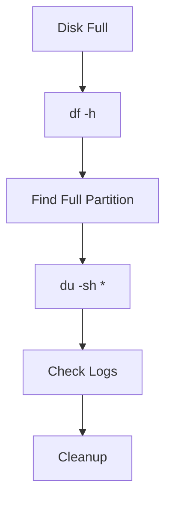
```mermaid
flowchart TD

DISK["Disk Full"]

DISK --> DF["df -h"]

DF --> PARTITION["Find Full Partition"]

PARTITION --> DU["du -sh *"]

DU --> LOGS["Check Logs"]

LOGS --> CLEANUP["Cleanup"]
```

---

# Disk Troubleshooting Workflow

```bash
df -h

du -sh *

find / -type f -size +1G

journalctl --disk-usage
```

---

# High Disk I/O Decision Tree

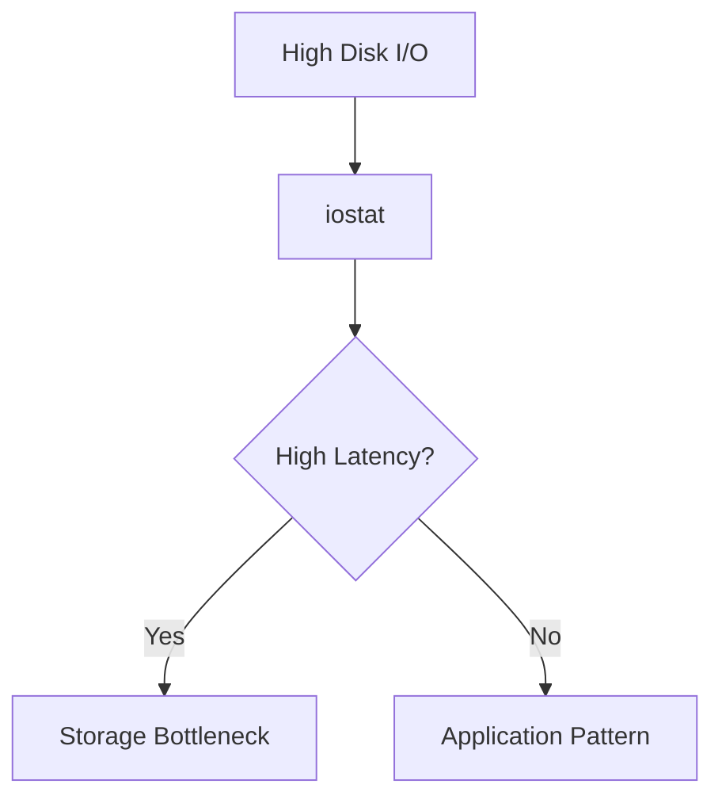
```mermaid
flowchart TD

IO["High Disk I/O"]

IO --> IOSTAT["iostat"]

IOSTAT --> LATENCY{"High Latency?"}

LATENCY -->|Yes| STORAGE["Storage Bottleneck"]

LATENCY -->|No| APP["Application Pattern"]
```

---

# Disk Performance Commands

```bash
iostat -x

iotop

sar -d

blktrace
```

---

# Network Connectivity Decision Tree

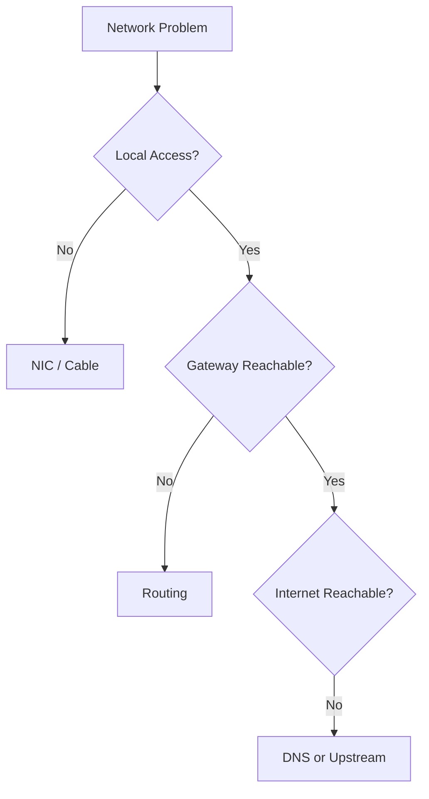
```mermaid
flowchart TD

NETWORK["Network Problem"]

NETWORK --> LOCAL{"Local Access?"}

LOCAL -->|No| NIC["NIC / Cable"]

LOCAL -->|Yes| GATEWAY{"Gateway Reachable?"}

GATEWAY -->|No| ROUTING["Routing"]

GATEWAY -->|Yes| INTERNET{"Internet Reachable?"}

INTERNET -->|No| DNS["DNS or Upstream"]
```

---

# Network Investigation Workflow

```bash
ip addr

ip route

ping

traceroute

mtr

ss -tulpn
```

---

# DNS Troubleshooting Decision Tree

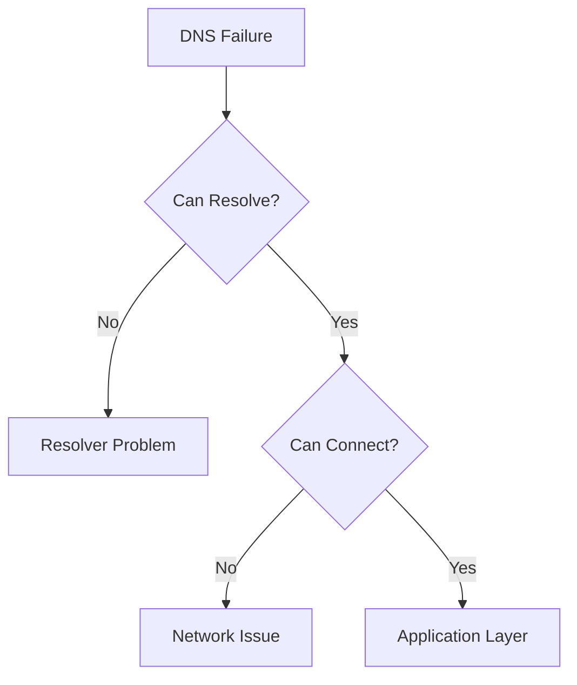
```mermaid
flowchart TD

DNS["DNS Failure"]

DNS --> RESOLVE{"Can Resolve?"}

RESOLVE -->|No| RESOLVER["Resolver Problem"]

RESOLVE -->|Yes| CONNECT{"Can Connect?"}

CONNECT -->|No| NETWORK["Network Issue"]

CONNECT -->|Yes| APPLICATION["Application Layer"]
```

---

# DNS Commands

```bash
dig google.com

nslookup google.com

host google.com

cat /etc/resolv.conf
```

---

# SSL/TLS Troubleshooting Decision Tree

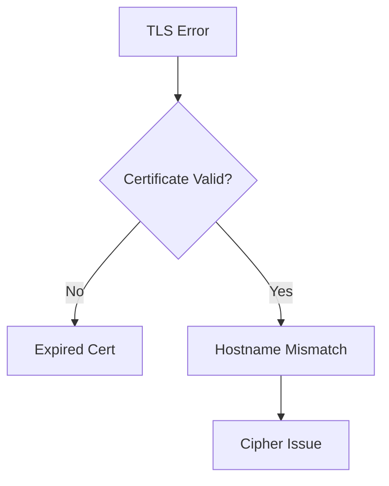
```mermaid
flowchart TD

TLS["TLS Error"]

TLS --> CERT{"Certificate Valid?"}

CERT -->|No| EXPIRED["Expired Cert"]

CERT -->|Yes| HOSTNAME["Hostname Mismatch"]

HOSTNAME --> CIPHER["Cipher Issue"]
```

---

# TLS Commands

```bash
openssl s_client

curl -v https://site.com

openssl x509 -text
```

---

# Nginx Decision Tree

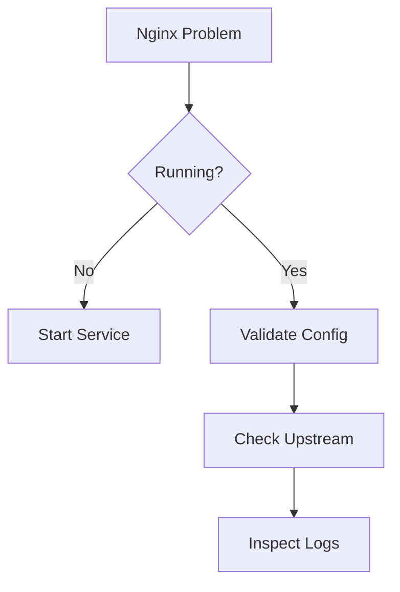
```mermaid
flowchart TD

NGINX["Nginx Problem"]

NGINX --> RUNNING{"Running?"}

RUNNING -->|No| SERVICE["Start Service"]

RUNNING -->|Yes| CONFIG["Validate Config"]

CONFIG --> BACKEND["Check Upstream"]

BACKEND --> LOGS["Inspect Logs"]
```

---

# Nginx Commands

```bash
nginx -t

systemctl status nginx

journalctl -u nginx

tail -f access.log
```

---

# Database Troubleshooting Decision Tree

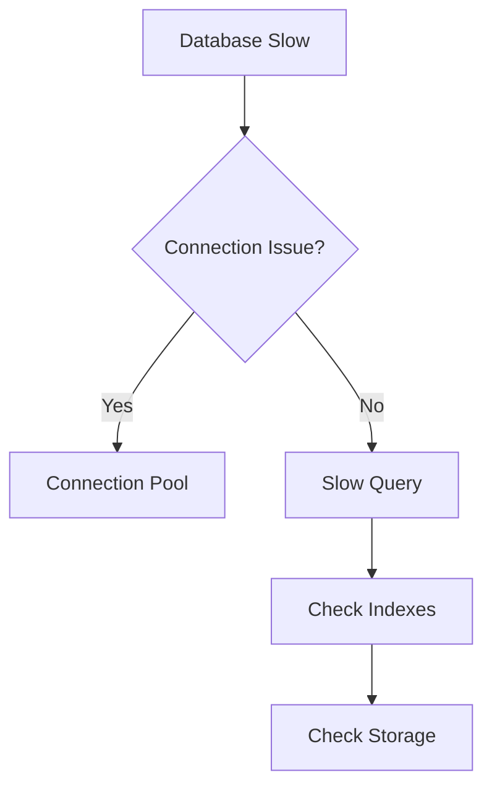
```mermaid
flowchart TD

DB["Database Slow"]

DB --> CONNECTIONS{"Connection Issue?"}

CONNECTIONS -->|Yes| POOL["Connection Pool"]

CONNECTIONS -->|No| QUERY["Slow Query"]

QUERY --> INDEX["Check Indexes"]

INDEX --> STORAGE["Check Storage"]
```

---

# Database Investigation Commands

```sql
EXPLAIN ANALYZE

SHOW PROCESSLIST

SELECT * FROM pg_stat_activity;
```

---

# Slow Query Decision Tree

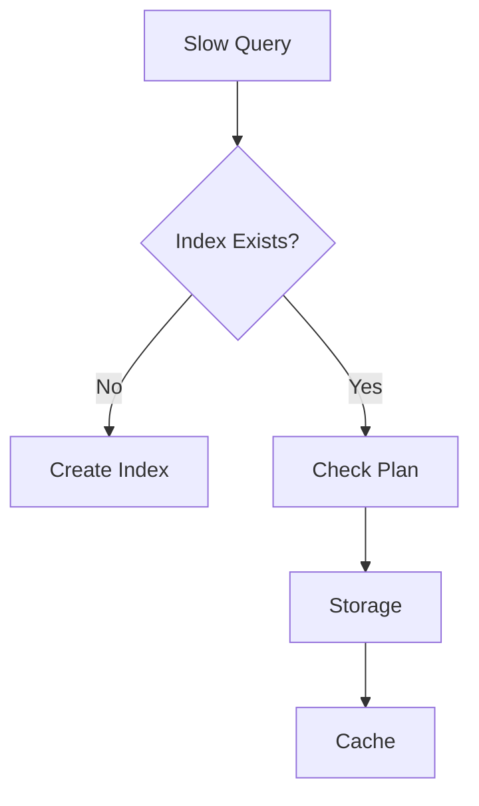
```mermaid
flowchart TD

QUERY["Slow Query"]

QUERY --> INDEX{"Index Exists?"}

INDEX -->|No| CREATE["Create Index"]

INDEX -->|Yes| PLAN["Check Plan"]

PLAN --> STORAGE["Storage"]

STORAGE --> MEMORY["Cache"]
```

---

# Replication Lag Decision Tree

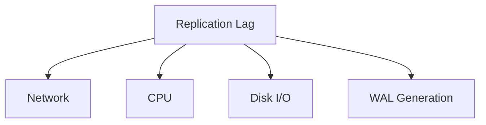
```mermaid
flowchart TD

REPLICA["Replication Lag"]

REPLICA --> NETWORK["Network"]

REPLICA --> CPU["CPU"]

REPLICA --> STORAGE["Disk I/O"]

REPLICA --> WAL["WAL Generation"]
```

---

# Docker Troubleshooting Decision Tree

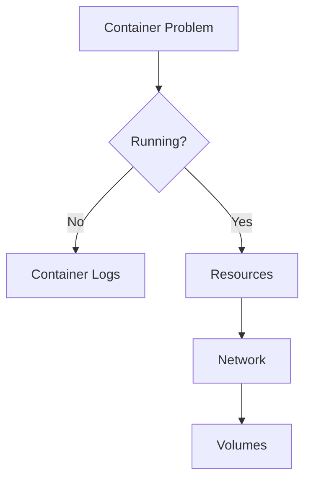
```mermaid
flowchart TD

DOCKER["Container Problem"]

DOCKER --> RUNNING{"Running?"}

RUNNING -->|No| LOGS["Container Logs"]

RUNNING -->|Yes| RESOURCE["Resources"]

RESOURCE --> NETWORK["Network"]

NETWORK --> STORAGE["Volumes"]
```

---

# Docker Investigation Commands

```bash
docker ps

docker logs

docker inspect

docker stats

docker exec
```

---

# Container CrashLoop Decision Tree

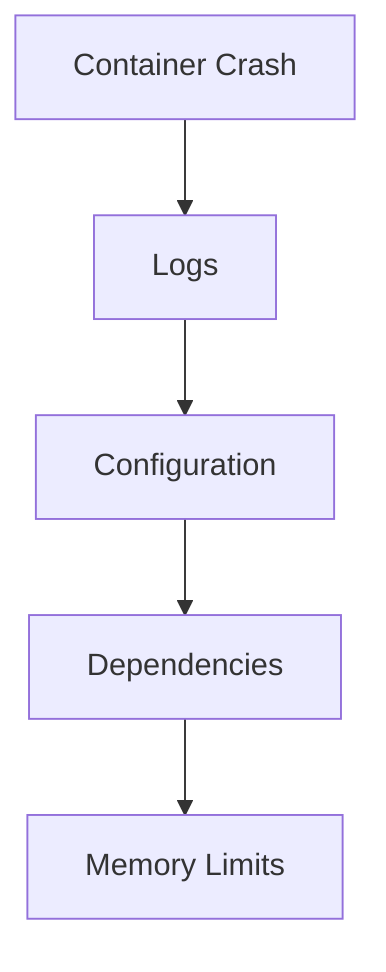
```mermaid
flowchart TD

CRASH["Container Crash"]

CRASH --> LOGS["Logs"]

LOGS --> CONFIG["Configuration"]

CONFIG --> DEP["Dependencies"]

DEP --> MEMORY["Memory Limits"]
```

---

# Kubernetes Troubleshooting Tree

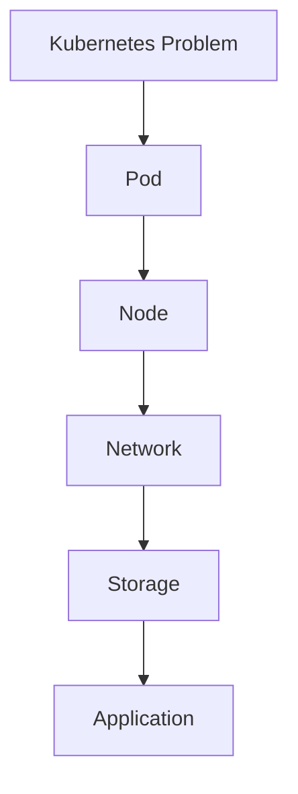
```mermaid
flowchart TD

K8S["Kubernetes Problem"]

K8S --> POD["Pod"]

POD --> NODE["Node"]

NODE --> NETWORK["Network"]

NETWORK --> STORAGE["Storage"]

STORAGE --> APP["Application"]
```

---

# Pod Pending Decision Tree

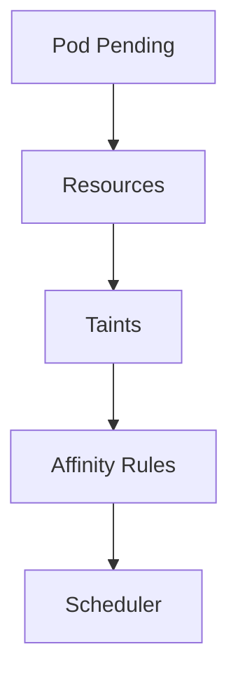
```mermaid
flowchart TD

PENDING["Pod Pending"]

PENDING --> RESOURCES["Resources"]

RESOURCES --> TAINTS["Taints"]

TAINTS --> AFFINITY["Affinity Rules"]

AFFINITY --> SCHEDULER["Scheduler"]
```

---

# Pod CrashLoopBackOff Decision Tree

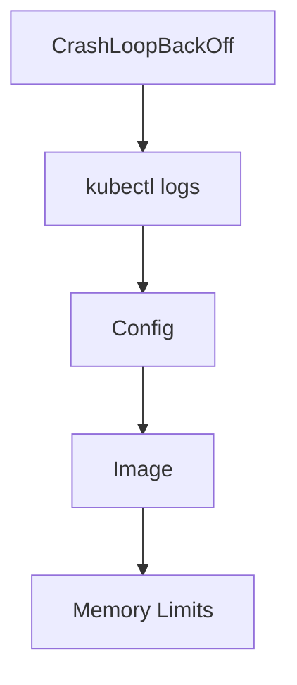
```mermaid
flowchart TD

CRASH["CrashLoopBackOff"]

CRASH --> LOGS["kubectl logs"]

LOGS --> CONFIG["Config"]

CONFIG --> IMAGE["Image"]

IMAGE --> MEMORY["Memory Limits"]
```

---

# Service Not Reachable

```mermaid
flowchart TD

SERVICE["Service Failure"]

SERVICE --> PODS["Pods Running?"]

PODS --> ENDPOINTS["Endpoints"]

ENDPOINTS --> NETWORK["Network Policy"]

NETWORK --> DNS["Cluster DNS"]
```

---

# Kubernetes Commands

```bash
kubectl get pods

kubectl describe pod

kubectl logs

kubectl get events

kubectl top pods
```

---

# Cloud Infrastructure Decision Tree

```mermaid
flowchart TD

CLOUD["Cloud Problem"]

CLOUD --> COMPUTE["Compute"]

CLOUD --> NETWORK["Network"]

CLOUD --> STORAGE["Storage"]

CLOUD --> IAM["IAM"]

CLOUD --> LB["Load Balancer"]
```

---

# Load Balancer Troubleshooting

```mermaid
flowchart TD

LB["Load Balancer"]

LB --> HEALTH["Health Checks"]

HEALTH --> TARGETS["Targets Healthy?"]

TARGETS --> ROUTING["Routing"]

ROUTING --> APPLICATION["Application"]
```

---

# IAM Decision Tree

```mermaid
flowchart TD

ACCESS["Access Denied"]

ACCESS --> USER["User"]

USER --> ROLE["Role"]

ROLE --> POLICY["Policy"]

POLICY --> RESOURCE["Resource"]
```

---

# Performance Troubleshooting Tree

```mermaid
flowchart TD

SLOW["System Slow"]

SLOW --> CPU["CPU"]

SLOW --> MEMORY["Memory"]

SLOW --> STORAGE["Storage"]

SLOW --> NETWORK["Network"]

SLOW --> APPLICATION["Application"]
```

---

# The Four Golden Signals

Start here for most incidents.

```mermaid
graph TD

SYSTEM["System"]

SYSTEM --> LATENCY["Latency"]

SYSTEM --> TRAFFIC["Traffic"]

SYSTEM --> ERRORS["Errors"]

SYSTEM --> SATURATION["Saturation"]
```

---

# Production Outage Decision Tree

```mermaid
flowchart TD

OUTAGE["Production Outage"]

OUTAGE --> ALL{"Everyone Affected?"}

ALL -->|Yes| INFRA["Infrastructure"]

ALL -->|No| SERVICE["Specific Service"]

INFRA --> DNS["DNS"]

INFRA --> NETWORK["Network"]

INFRA --> CLOUD["Cloud"]

SERVICE --> APP["Application"]

SERVICE --> DATABASE["Database"]
```

---

# Incident Severity Matrix

```text
P1 = Entire Platform Down

P2 = Critical Feature Broken

P3 = Partial Degradation

P4 = Minor Issue
```

---

# Root Cause Analysis Tree

```mermaid
flowchart TD

ISSUE["Issue"]

ISSUE --> WHAT["What Failed?"]

WHAT --> WHY["Why Failed?"]

WHY --> WHY2["Why?"]

WHY2 --> WHY3["Why?"]

WHY3 --> ROOT["Root Cause"]
```

---

# The Five Whys Method

Example:

```text
Website Down

Why?
Database Down

Why?
Disk Full

Why?
Logs Grew

Why?
Rotation Failed

Why?
Misconfiguration
```

Root cause found.

---

# Incident Response Workflow

```mermaid
flowchart TD

ALERT["Alert"]

ALERT --> TRIAGE["Triage"]

TRIAGE --> MITIGATION["Mitigation"]

MITIGATION --> RCA["Root Cause"]

RCA --> FIX["Fix"]

FIX --> REVIEW["Postmortem"]
```

---

# Universal Production Checklist

Before changing anything:

```text
✓ What changed?

✓ Is issue reproducible?

✓ Check logs

✓ Check metrics

✓ Check resource usage

✓ Check networking

✓ Check dependencies

✓ Verify assumptions

✓ Capture evidence
```

---

# The Production Engineer's Rule

Never assume.

Verify.

```text
Assumption
     ↓
Incident

Evidence
     ↓
Resolution
```

---

# Complete Troubleshooting Mind Map

```mermaid
mindmap
  root((Troubleshooting))

    Linux
      CPU
      Memory
      Disk
      Processes

    Networking
      DNS
      Routing
      TCP
      TLS

    Databases
      Queries
      Indexes
      Replication

    Containers
      Logs
      Resources
      Volumes

    Kubernetes
      Pods
      Nodes
      Services

    Cloud
      IAM
      Load Balancers
      Storage

    Incident Response
      Metrics
      Logs
      Traces
```

---

# Engineering Mindset

Beginners ask:

```text
What command should I run?
```

Engineers ask:

```text
What layer is failing?

What evidence supports that?

What changed?

How do I prove the root cause?
```

Professional troubleshooting is not command memorization.

It is systematic elimination of possibilities.

---

# One-Page Troubleshooting Summary

```text
Problem
   ↓
Scope
   ↓
Layer
   ↓
Evidence
   ↓
Metrics
   ↓
Logs
   ↓
Traces
   ↓
Root Cause
   ↓
Fix
   ↓
Verification
   ↓
Prevention
```

---

# Final Takeaway

The best engineers are not the ones who memorize the most commands.

They are the ones who can systematically narrow uncertainty.

Every production failure—whether Linux, networking, Docker, Kubernetes, cloud, or databases—can be reduced to:

```text
Observe

Measure

Verify

Isolate

Fix

Prevent
```

Master these troubleshooting decision trees and you develop the mindset required to operate complex production infrastructure with confidence.
