# Visual Index

## The Master Navigation Map for the Linux Engineering Handbook

> This file is the **visual table of contents** for the entire repository.
>
> Instead of navigating through folders, readers can use this file as a systems-thinking map.
>
> Every topic in this repository ultimately connects to Linux.

---

# How to Use This File

There are two ways to learn Linux:

### Path 1: Topic-Based Learning

```text
Linux
 ├── Filesystem
 ├── Processes
 ├── Networking
 ├── Storage
 ├── Security
 └── Bash
```

### Path 2: Systems Thinking

```text
Linux
   ↓
Containers
   ↓
Kubernetes
   ↓
Cloud
   ↓
Databases
   ↓
Distributed Systems
   ↓
Internet
```

This repository follows both approaches.

---

# Repository Knowledge Graph

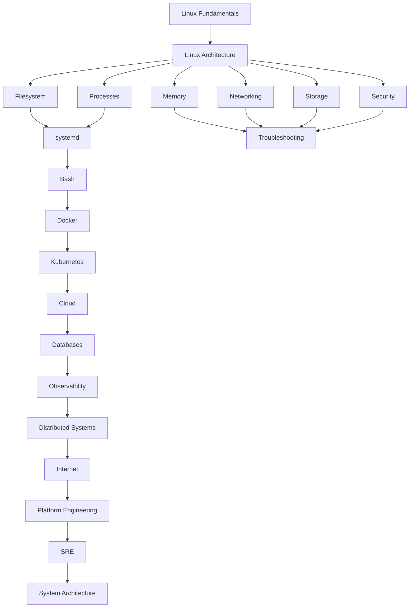

---

# Learning Journey Map

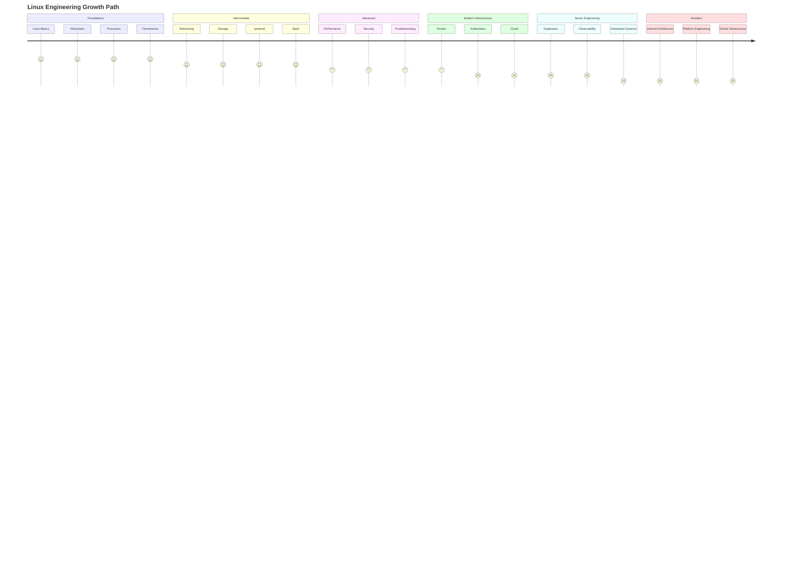

---

# Repository Architecture

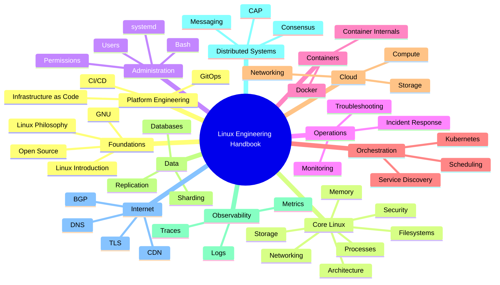

---

# Section 1: Linux Foundations

---

## Visual Overview

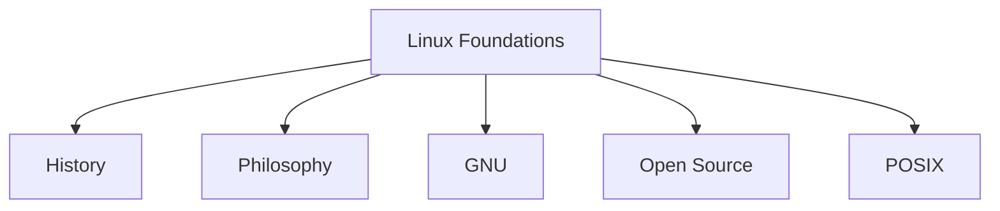

---

## Files

```text
01-linux-introduction/

├── what-is-linux.md
├── history-of-linux.md
├── linux-philosophy.md
├── open-source-movement.md
├── gnu-and-linux.md
├── linux-distributions.md
├── why-linux-dominates-infrastructure.md
├── linux-engineering-mindset.md
└── references.md
```

---

# Section 2: Linux Architecture

---

## Architecture Map

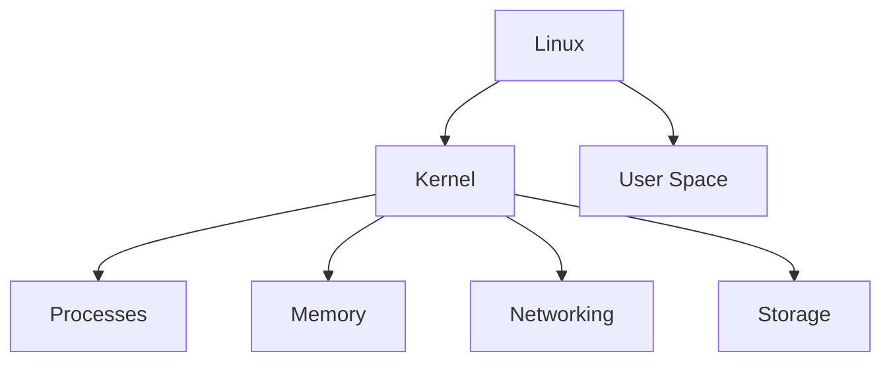

---

## Files

```text
02-linux-architecture/

├── linux-architecture.md
├── linux-boot-process.md
├── linux-kernel-architecture.md
├── linux-filesystem-architecture.md
├── linux-process-lifecycle.md
├── linux-memory-management.md
├── linux-networking-stack.md
├── linux-storage-stack.md
├── linux-security-model.md
├── linux-systemd-architecture.md
└── linux-container-architecture.md
```

---

# Section 3: Filesystems

---

## Filesystem Map

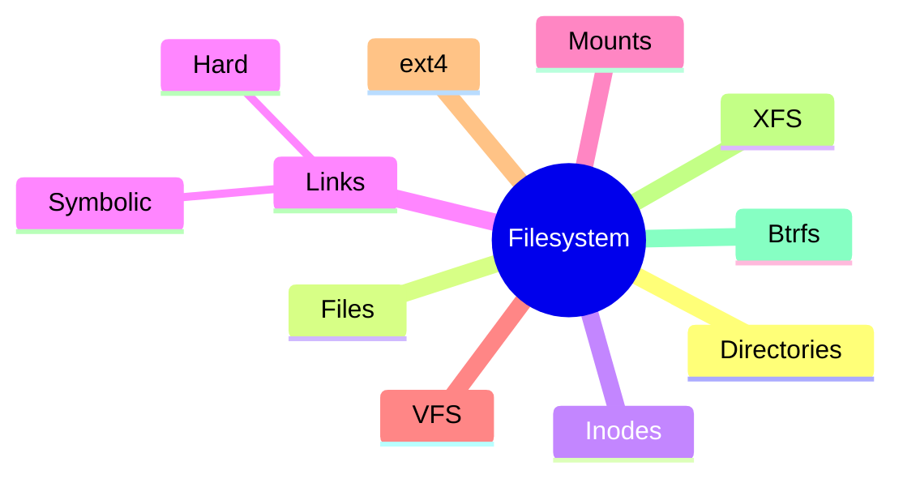

---

## Learning Goal

Understand:

```text
How Linux stores data

How files become blocks

How inodes work

How storage reaches hardware
```

---

# Section 4: Processes

---

## Process Map

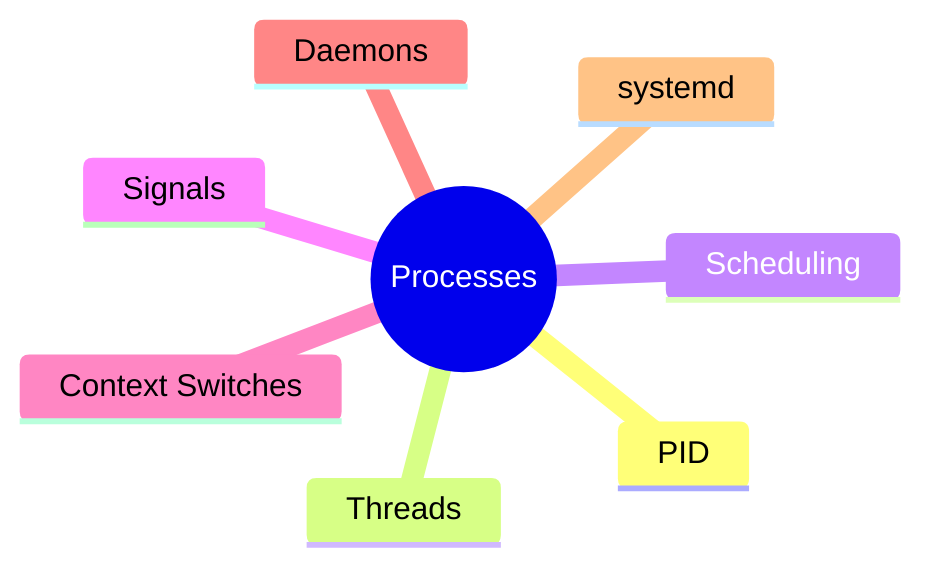

---

## Learning Goal

Understand:

```text
How programs become processes

How CPUs execute workloads

How Linux schedules work
```

---

# Section 5: Memory

---

## Memory Map

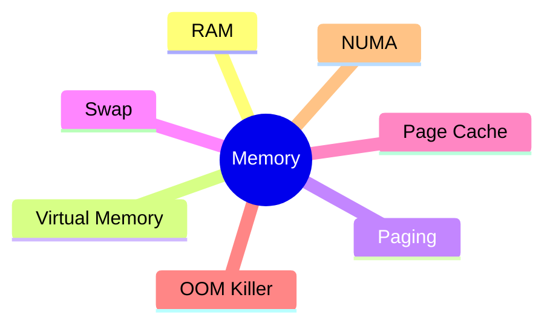

---

# Section 6: Networking

---

## Networking Map

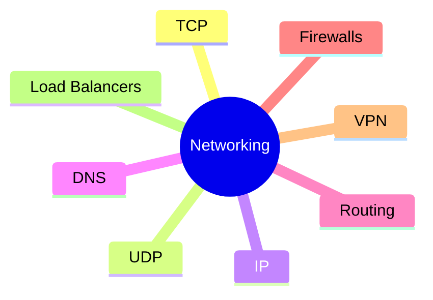

---

# Section 7: Storage

---

## Storage Map

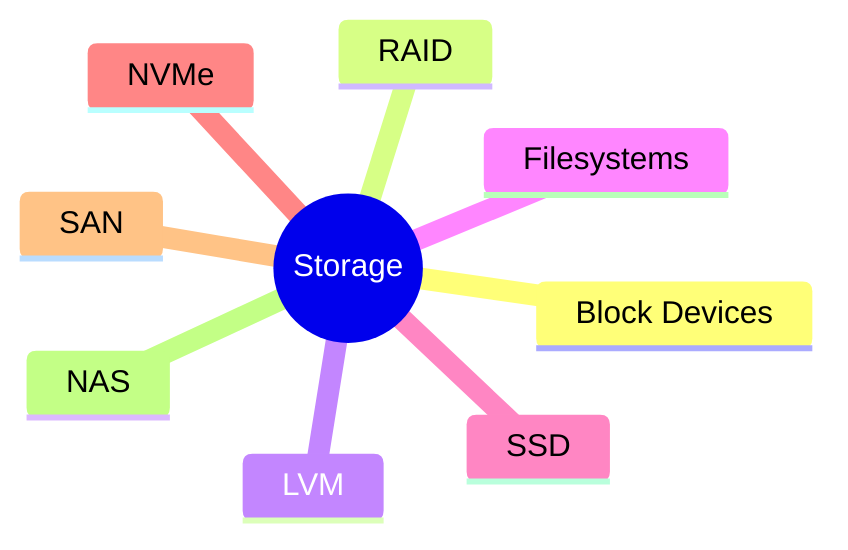

---

# Section 8: Security

---

## Security Map

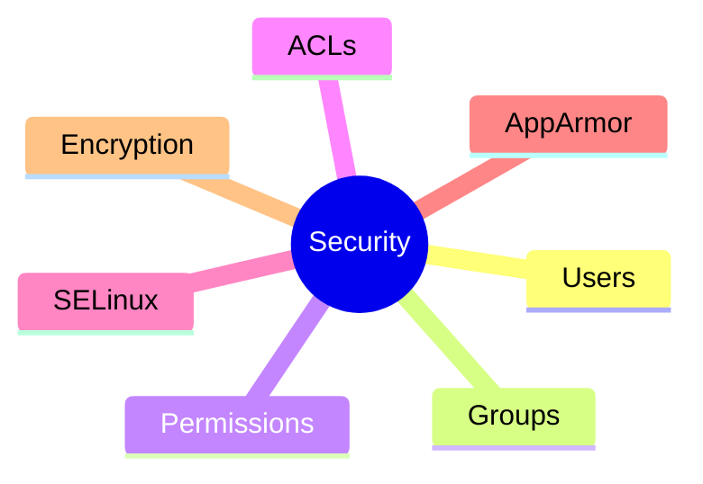

---

# Section 9: systemd

---

## systemd Map

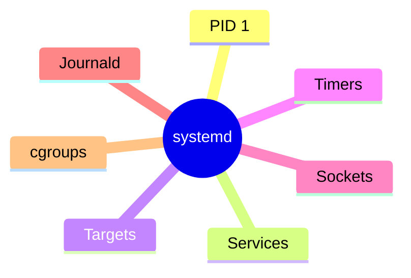

---

# Section 10: Bash

---

## Bash Map

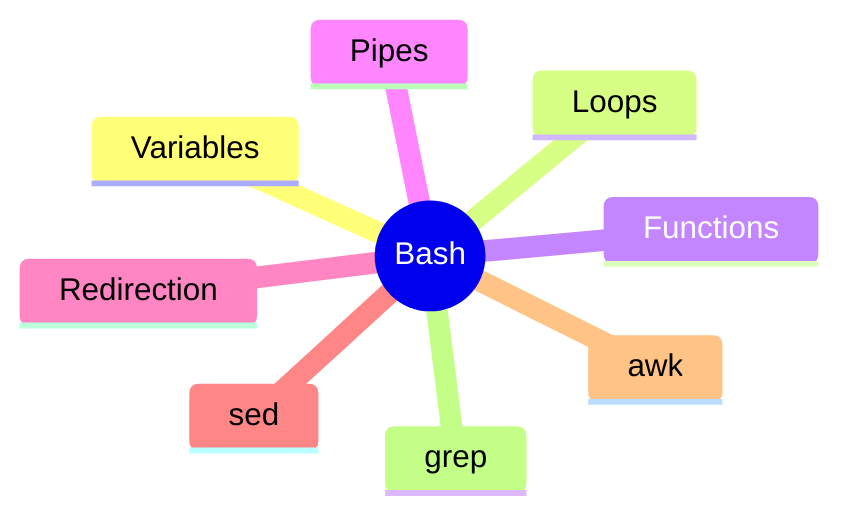

---

# Section 11: Troubleshooting

---

## Troubleshooting Flow

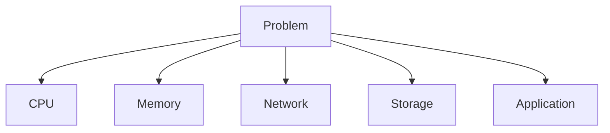

---

## Files

```text
troubleshooting/

├── troubleshooting-decision-trees.md
├── production-incident-flows.md
├── cpu-pressure.md
├── memory-pressure.md
├── disk-full.md
├── network-failures.md
├── database-incidents.md
└── production-playbooks.md
```

---

# Section 12: Docker

---

## Docker Map

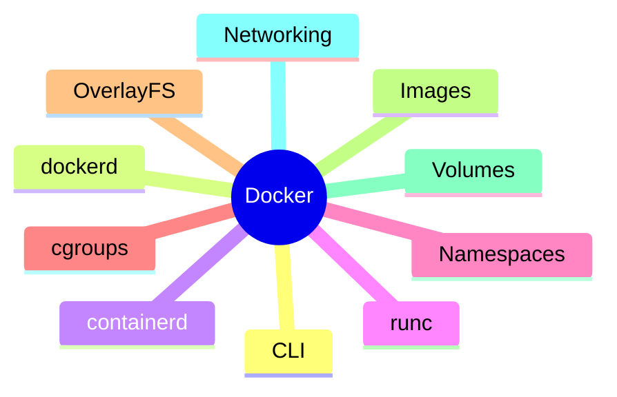

---

# Section 13: Kubernetes

---

## Kubernetes Map

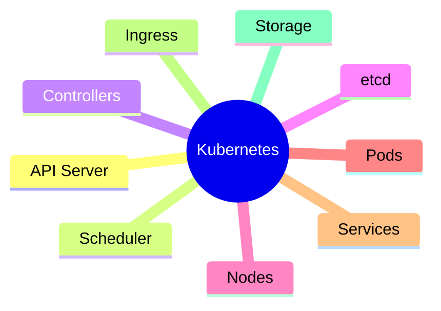

---

# Section 14: Cloud

---

## Cloud Map

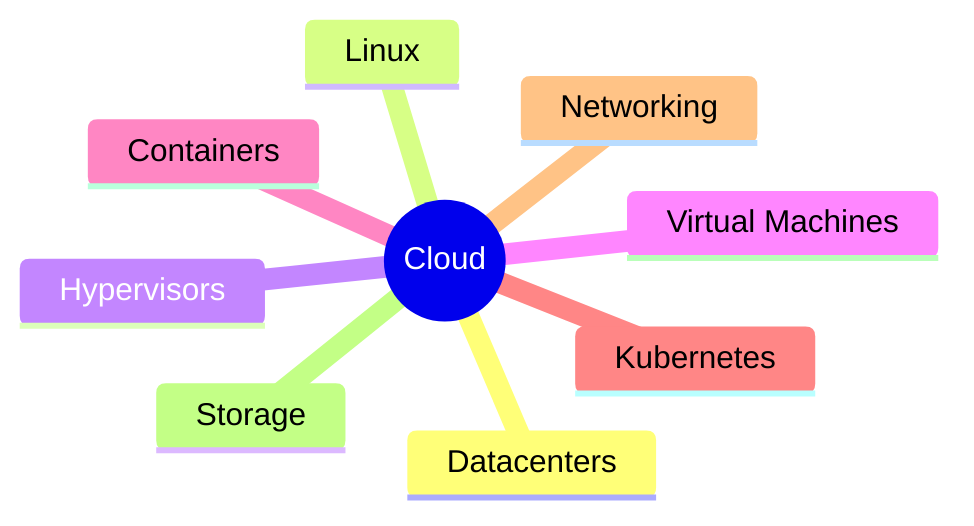

---

# Section 15: Databases

---

## Database Map

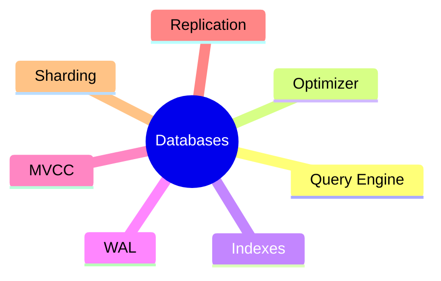

---

# Section 16: Observability

---

## Observability Map

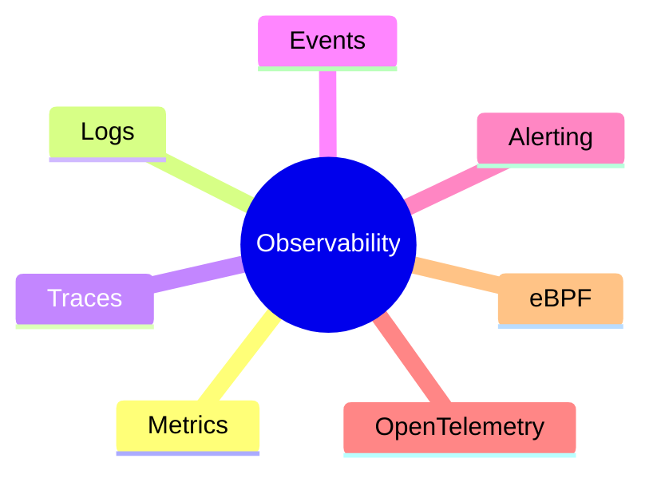

---

# Section 17: Distributed Systems

---

## Distributed Systems Map

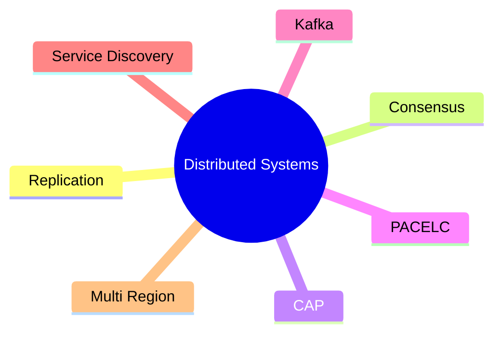

---

# Section 18: Internet Architecture

---

## Internet Map

```mermaid
mindmap
  root((Internet))

    DNS

    BGP

    TCP

    UDP

    TLS

    CDN

    Load Balancers

    Cloud
```

---

# Section 19: Platform Engineering

---

## Platform Map

```mermaid
mindmap
  root((Platform Engineering))

    CI/CD

    GitOps

    Terraform

    Internal Platforms

    Developer Experience

    Automation
```

---

# Section 20: Founder-Level Systems Thinking

---

## Infrastructure Evolution

```mermaid
flowchart TD

LINUX["Linux Server"]

LINUX --> CONTAINERS["Containers"]

CONTAINERS --> K8S["Kubernetes"]

K8S --> CLOUD["Cloud"]

CLOUD --> DATABASES["Databases"]

DATABASES --> DISTRIBUTED["Distributed Systems"]

DISTRIBUTED --> INTERNET["Internet Scale"]

INTERNET --> PLATFORM["Platform Engineering"]

PLATFORM --> BUSINESS["Technology Business"]
```

---

# Visual Dependency Graph

This shows how every topic depends on another.

```mermaid
graph LR

LINUX["Linux"]

LINUX --> PROCESS["Processes"]

LINUX --> MEMORY["Memory"]

LINUX --> FS["Filesystem"]

LINUX --> NET["Networking"]

PROCESS --> CONTAINER["Containers"]

CONTAINER --> K8S["Kubernetes"]

K8S --> CLOUD["Cloud"]

FS --> DATABASE["Databases"]

NET --> INTERNET["Internet"]

DATABASE --> DIST["Distributed Systems"]

DIST --> PLATFORM["Platforms"]

PLATFORM --> SRE["SRE"]

SRE --> ARCH["Architecture"]
```

---

# Repository Completion Map

```mermaid
mindmap
  root((Linux Mastery))

    Beginner

      Commands
      Files
      Navigation

    Intermediate

      Processes
      Networking
      Storage

    Advanced

      Security
      Performance
      Troubleshooting

    Production

      Docker
      Kubernetes
      Databases

    Infrastructure

      Cloud
      Observability

    Distributed Systems

      Replication
      Consensus

    Architect

      Internet
      Platforms
      Global Systems
```

---

# Final Takeaway

This repository is not a collection of notes.

It is a complete engineering journey.

```text
Linux
   ↓
Architecture
   ↓
Processes
   ↓
Networking
   ↓
Storage
   ↓
Security
   ↓
Containers
   ↓
Kubernetes
   ↓
Cloud
   ↓
Databases
   ↓
Observability
   ↓
Distributed Systems
   ↓
Internet
   ↓
Platform Engineering
   ↓
System Architecture
```

Use this file as the central navigation hub for the entire Linux Engineering Handbook.
