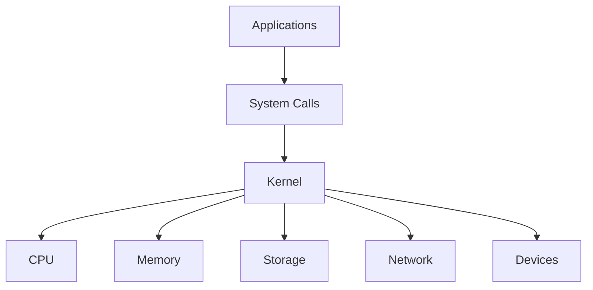
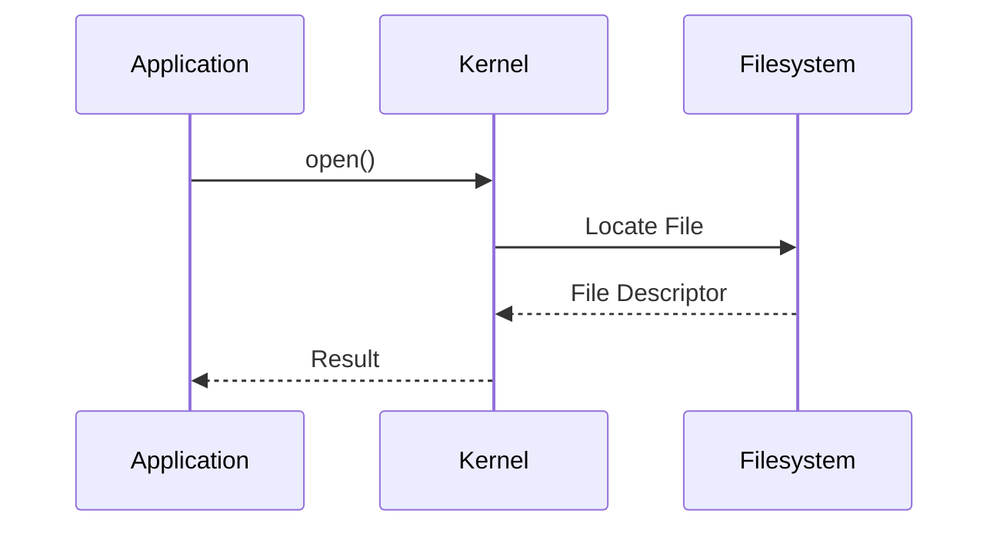

# Linux Internals and Kernel Investigation

> Advanced Track — Exercise 01

> **Everything in Linux eventually becomes a kernel problem.**
>
> This exercise teaches you how Linux actually works beneath commands, services, containers, Kubernetes, databases, and cloud platforms.

---

# Why This Exercise Exists

Most engineers spend years using Linux without understanding what Linux actually is.

They know:

```bash
ls
grep
systemctl
docker
kubectl
```

But they do not know:

```text
What happens when a process starts?

How memory is allocated?

How a system call works?

How networking reaches the kernel?

How files are actually read?

Why context switching is expensive?

How containers are implemented?
```

This is the difference between:

```text
Linux User
```

and

```text
Linux Systems Engineer
```

---

# The Problem This Exercise Solves

Imagine a production outage.

Symptoms:

```text
CPU 100%

Load Average 80

Application Slow

Container Restarting

Network Latency Spikes
```

Many engineers immediately restart services.

Advanced engineers ask:

```text
What is the kernel doing?

What resources are exhausted?

What subsystem is under pressure?

What evidence exists?
```

Understanding Linux internals allows you to answer these questions.

---

# Mental Model

Think of Linux as a city.

```text
Applications = Citizens

Processes = Workers

Memory = Buildings

CPU = Roads

Kernel = Government

Hardware = Land
```

Applications cannot directly access hardware.

Everything goes through the kernel.

---

# First Principles

Linux exists to manage resources.

Resources include:

```text
CPU

Memory

Storage

Network

Devices
```

Applications compete for resources.

The kernel acts as:

```text
Resource Manager
Scheduler
Security Enforcer
Hardware Abstraction Layer
```

---

# What Is The Kernel?

The kernel is the core of the operating system.

Visualization:

```text
+---------------------------+
| Applications              |
+---------------------------+
| System Call Interface     |
+---------------------------+
| Linux Kernel              |
+---------------------------+
| Hardware                  |
+---------------------------+
```

Applications cannot directly talk to hardware.

They must ask the kernel.

---

# Why The Kernel Exists

Without a kernel:

```text
Every application
would need its own:

CPU Driver
Memory Manager
Disk Driver
Network Driver
```

This would be chaos.

The kernel centralizes management.

---

# Linux Architecture



---

# User Space vs Kernel Space

One of the most important concepts in Linux.

---

## User Space

Applications run here.

Examples:

```text
Nginx

PostgreSQL

Python

Node.js

Docker
```

User space is restricted.

---

## Kernel Space

Kernel runs here.

Has full hardware access.

Examples:

```text
Scheduler

Memory Manager

Network Stack

Filesystem Layer
```

---

# Visualization

```text
User Space
--------------------------------
Nginx
Python
Docker
PostgreSQL
--------------------------------
System Call Boundary
--------------------------------
Kernel Space
--------------------------------
Scheduler
Memory Manager
Network Stack
Drivers
--------------------------------
Hardware
```

---

# Why Isolation Matters

Without isolation:

```text
Any application
could overwrite memory
belonging to another process.
```

Result:

```text
Instability

Security Problems

Crashes
```

---

# System Calls

Applications communicate with the kernel through system calls.

Think of system calls as:

```text
API Calls To The Kernel
```

---

# Example

Python code:

```python
f = open("data.txt")
```

Internally:

```text
open()
```

system call.

---

# Common System Calls

```text
open()

read()

write()

close()

fork()

execve()

socket()

connect()
```

---

# System Call Flow



---

# Exercise 1 — Observe System Calls

Install:

```bash
sudo apt install strace
```

Run:

```bash
strace ls
```

Observe:

```text
open()

read()

close()

mmap()
```

---

# Investigation Questions

Which system calls occur most often?

How many files does ls access?

What libraries are loaded?

---

# Why strace Matters

Production engineers use:

```text
strace
```

to answer:

```text
What is this process actually doing?
```

---

# Exercise 2 — Trace File Access

Run:

```bash
strace cat /etc/passwd
```

Observe:

```text
open()

read()

write()
```

Map the sequence.

---

# Process Creation Internals

Running:

```bash
python app.py
```

appears simple.

Internally:

```text
fork()

execve()

memory allocation

scheduler registration
```

occur.

---

# Process Lifecycle

```mermaid
flowchart TD

Program

--> fork()

--> Child Process

--> execve()

--> Running Process

--> Exit
```

---

# fork() Explained

fork() creates a child process.

Example:

```text
Parent
   |
fork()
   |
Child
```

Both initially share memory pages.

---

# execve() Explained

execve() replaces process contents with a new program.

Visualization:

```text
fork()

Child
  |
execve()
  |
Python
```

---

# Exercise 3 — Observe Process Creation

Run:

```bash
strace bash -c "echo hello"
```

Look for:

```text
fork

clone

execve
```

---

# The Linux Scheduler

CPU time is limited.

The scheduler decides:

```text
Who Runs?

When?

For How Long?
```

---

# Scheduler Mental Model

Imagine:

```text
100 Processes

8 CPUs
```

Scheduler allocates time fairly.

---

# Visualization

```text
CPU

Process A
Process B
Process C
Process D
```

The scheduler rotates execution.

---

# Context Switching

Switching CPU from one process to another.

Visualization:

```text
Process A Running
      ↓
Save State
      ↓
Load Process B
      ↓
Process B Running
```

---

# Why Context Switching Matters

Too many switches:

```text
Reduced Performance
Higher CPU Overhead
```

---

# Exercise 4 — Observe Scheduler Metrics

Install:

```bash
sudo apt install sysstat
```

Run:

```bash
pidstat
```

Observe:

```text
CPU Usage

Context Switches
```

---

# Memory Internals

Applications think:

```text
I own memory.
```

Reality:

```text
Kernel owns memory.
```

Applications receive virtual memory.

---

# Virtual Memory Mental Model

Each process sees:

```text
0x0000
to
0xFFFFFFFF
```

its own address space.

Even when memory is shared.

---

# Visualization

```text
Process A
  Virtual Memory

Process B
  Virtual Memory

Kernel
  Maps Both
```

---

# Why Virtual Memory Exists

Provides:

```text
Isolation

Security

Flexibility
```

---

# Exercise 5 — Inspect Process Memory

Run:

```bash
pmap $$
```

Observe:

```text
Memory Regions

Libraries

Mappings
```

---

# Linux Memory Architecture

```mermaid
flowchart TD

Application

--> Virtual Memory

Virtual Memory

--> Page Tables

Page Tables

--> Physical Memory
```

---

# Page Cache

Linux caches file data.

Example:

```text
Read File Once

Read File Again

Served From Memory
```

---

# Why Page Cache Exists

Storage is slow.

Memory is fast.

Linux uses memory to accelerate storage.

---

# Exercise 6 — Observe Memory Statistics

Run:

```bash
free -h
```

Then:

```bash
cat /proc/meminfo
```

---

# Kernel Interfaces

Linux exposes internals through:

```text
/proc

/sys
```

---

# /proc

Virtual filesystem exposing runtime information.

Examples:

```bash
ls /proc
```

---

# Useful Files

```text
/proc/cpuinfo

/proc/meminfo

/proc/loadavg

/proc/uptime

/proc/PID
```

---

# Exercise 7 — Investigate CPU Information

Run:

```bash
cat /proc/cpuinfo
```

Questions:

```text
How many CPUs?

Which architecture?

What frequency?
```

---

# Exercise 8 — Investigate Process Information

Find PID:

```bash
echo $$
```

Inspect:

```bash
ls /proc/PID
```

Replace PID.

---

# What Exists There?

```text
cmdline

fd

maps

status

environ
```

---

# Why This Matters

Most Linux observability tools read:

```text
/proc
```

internally.

---

# Filesystem Internals

Linux provides:

```text
Virtual Filesystem (VFS)
```

---

# VFS Mental Model

Applications see:

```text
open()
```

Kernel sees:

```text
ext4

xfs

btrfs
```

VFS abstracts differences.

---

# Filesystem Architecture

```mermaid
flowchart TD

Application

--> VFS

VFS

--> ext4

VFS

--> xfs

VFS

--> btrfs

Filesystem

--> Block Layer

Block Layer

--> Disk
```

---

# Networking Internals

Applications do not send packets.

Kernel does.

---

# Packet Flow

```mermaid
sequenceDiagram

Application->>Socket

Socket->>Kernel TCP Stack

Kernel TCP Stack->>NIC

NIC->>Network
```

---

# Exercise 9 — Observe Network Information

Run:

```bash
cat /proc/net/dev
```

Observe interface statistics.

---

# Kernel Modules

Linux supports dynamically loaded functionality.

List modules:

```bash
lsmod
```

---

# Why Modules Exist

Allows:

```text
Drivers

Filesystems

Networking Features
```

without recompiling kernel.

---

# Exercise 10 — Explore Loaded Modules

Run:

```bash
lsmod | head
```

Questions:

```text
Which modules are loaded?

Which drivers exist?
```

---

# Namespaces

Foundation of containers.

Provide isolation for:

```text
Processes

Networks

Users

Mounts
```

---

# Namespace Visualization

```text
Container A

Processes
Network
Filesystem

Container B

Processes
Network
Filesystem
```

Both share one kernel.

---

# cgroups

Control Groups manage resources.

Limit:

```text
CPU

Memory

Disk I/O
```

---

# Why Containers Depend On cgroups

Without cgroups:

```text
One Container

Could Consume

All Resources
```

---

# Exercise 11 — Explore cgroups

Run:

```bash
systemd-cgls
```

Observe hierarchy.

---

# Linux Internals Investigation Workflow

```mermaid
flowchart TD

Problem

--> Process?

--> Scheduler?

--> Memory?

--> Filesystem?

--> Network?

--> Kernel?

--> Root Cause
```

---

# Production Scenario 1

## Application Slow

Investigate:

```bash
strace

pidstat

top

perf
```

Determine:

```text
CPU Bound?

I/O Bound?

Waiting?
```

---

# Production Scenario 2

## Container OOMKilled

Investigate:

```bash
dmesg

journalctl

cgroups
```

Determine memory pressure.

---

# Production Scenario 3

## High Load Average

Investigate:

```bash
uptime

vmstat

pidstat
```

Identify:

```text
CPU Pressure

I/O Wait

Blocked Processes
```

---

# Production Scenario 4

## File Access Failure

Investigate:

```bash
strace

permissions

filesystem state
```

---

# Docker Connection

Docker fundamentally uses:

```text
Namespaces

cgroups

OverlayFS

Processes
```

Containers are Linux internals exposed through APIs.

---

# Kubernetes Connection

Kubernetes ultimately manages:

```text
Linux Processes

Linux Networking

Linux Storage

Linux cgroups
```

A Kubernetes engineer who understands Linux internals debugs faster.

---

# Common Mistakes

## Mistake 1

Thinking applications talk directly to hardware.

---

## Mistake 2

Ignoring system calls.

---

## Mistake 3

Confusing virtual memory with physical memory.

---

## Mistake 4

Ignoring scheduler behavior.

---

## Mistake 5

Treating containers as virtual machines.

---

# Engineering Mindset

Beginners think:

```text
Commands
```

Engineers think:

```text
Kernel

Processes

Memory

Scheduler

Filesystems

Networking

System Calls
```

Every Linux problem eventually leads here.

---

# Interview Questions

## Advanced

1. What is the Linux kernel?
2. Difference between user space and kernel space?
3. What is a system call?
4. Explain fork() and execve().
5. What is virtual memory?
6. What is VFS?
7. What is page cache?
8. How does Linux schedule processes?
9. How do containers use namespaces?
10. How do cgroups work?

---

# Kernel Investigation Cheat Sheet

```bash
strace COMMAND

pidstat

pmap PID

free -h

cat /proc/cpuinfo

cat /proc/meminfo

cat /proc/loadavg

ls /proc/PID

cat /proc/net/dev

lsmod

systemd-cgls
```

---

# Capstone Challenge

A production server exhibits:

```text
High Load Average

Slow Applications

Container Restarts

Storage Delays

Network Latency
```

Perform a kernel-level investigation.

Document:

```text
Processes

System Calls

Memory State

Scheduler Activity

Filesystem Activity

Network Activity

Kernel Evidence

Root Cause

Recovery Plan
```

---

# Completion Criteria

You successfully complete this exercise when you can:

✓ Explain Linux architecture from first principles

✓ Understand user space and kernel space

✓ Trace system calls

✓ Investigate process creation

✓ Understand scheduler behavior

✓ Analyze virtual memory

✓ Explore `/proc` and kernel interfaces

✓ Understand VFS and networking internals

✓ Explain namespaces and cgroups

✓ Connect Linux internals to Docker, Kubernetes, cloud infrastructure, and production systems

Congratulations.

You have reached the point where Linux stops being a collection of commands and starts becoming an operating system you can reason about.
