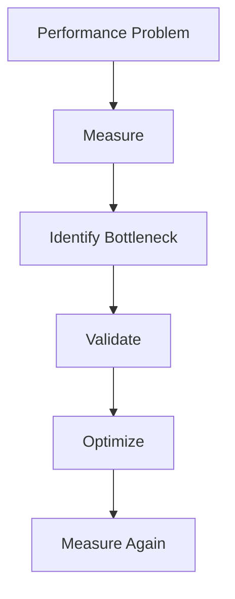
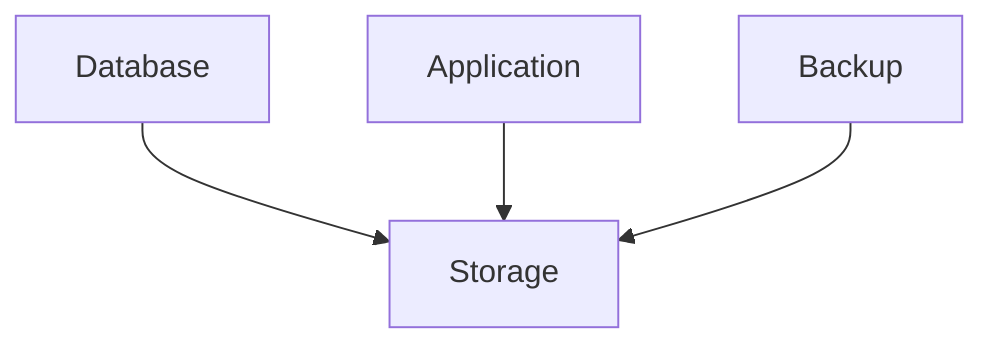

# Linux Performance Engineering and System Optimization

> Advanced Track — Exercise 02

> **Performance engineering is not about making systems fast. It is about understanding why systems are slow.**

---

# Why This Exercise Exists

Most engineers approach performance incorrectly.

When an application becomes slow, they immediately:

```text
Increase CPU

Increase Memory

Add More Servers

Upgrade Hardware
```

This sometimes works.

But it does not solve the real problem.

Performance engineering starts with a different question:

```text
Where is time being spent?
```

Because every performance problem is fundamentally:

```text
Work
+
Resources
+
Time
```

Understanding how Linux schedules work, allocates resources, and handles contention is the foundation of production performance engineering.

---

# The Problem This Exercise Solves

Imagine a production alert:

```text
API latency increased from 50ms to 3 seconds.
```

The application team says:

```text
Application is healthy.
```

The infrastructure team says:

```text
CPU looks normal.
```

The database team says:

```text
Queries are fine.
```

Users still experience slowness.

Performance engineering teaches you how to investigate:

```text
CPU Bottlenecks

Scheduler Delays

Memory Pressure

Disk Latency

Network Delays

Lock Contention

Resource Saturation
```

instead of guessing.

---

# Mental Model

Imagine a restaurant.

```text
Customers = Requests

Kitchen = CPU

Waiters = Processes

Storage = Database

Tables = Memory

Roads = Network
```

If customers wait 20 minutes:

```text
More Customers?
Slow Kitchen?
Too Few Tables?
Delivery Delay?
```

The symptom is:

```text
Slow Service
```

The root cause may be anywhere.

Linux systems work the same way.

---

# First Principles

Every application request consumes resources.

```text
CPU Time

Memory

Storage I/O

Network I/O
```

Performance problems occur when:

```text
Demand > Available Resources
```

or

```text
Resource Utilization is Inefficient
```

---

# The Performance Pyramid

```text
Application
    ▲
Processes
    ▲
CPU
Memory
Disk
Network
```

Everything eventually becomes one of these.

---

# Core Performance Philosophy

Never optimize first.

Always measure first.

Bad workflow:

```text
System Slow
 ↓
Tune Random Settings
```

Good workflow:

```text
System Slow
 ↓
Measure
 ↓
Investigate
 ↓
Identify Bottleneck
 ↓
Optimize
 ↓
Verify
```

---

# Linux Performance Investigation Framework



---

# Understanding Throughput vs Latency

Most engineers confuse these.

---

## Throughput

Amount of work completed.

Example:

```text
10,000 Requests/Second
```

---

## Latency

Time required to complete work.

Example:

```text
200ms Per Request
```

---

# Visualization

```text
Throughput = Cars Per Hour

Latency = Time Per Car
```

A highway may support:

```text
High Throughput
```

while still having:

```text
High Latency
```

during congestion.

---

# Exercise 1 — Establish Performance Baseline

Collect system state:

```bash
uptime

top

free -h

df -h
```

Document:

```text
Load Average

CPU Utilization

Memory Usage

Disk Usage
```

---

# Why Baselines Matter

Without a baseline:

```text
You cannot know
whether performance changed.
```

---

# Understanding Load Average

One of Linux's most misunderstood metrics.

Check:

```bash
uptime
```

Example:

```text
load average: 4.5, 5.1, 5.3
```

---

# Load Average Mental Model

Think:

```text
People Waiting For A Taxi
```

Not:

```text
Taxi Speed
```

Load measures:

```text
Demand
```

not utilization.

---

# Important Insight

High load does NOT necessarily mean:

```text
CPU Problem
```

Could be:

```text
Disk Wait

Network Wait

Blocked Processes
```

---

# Exercise 2 — Investigate CPU Utilization

Run:

```bash
top
```

Observe:

```text
us = User CPU

sy = System CPU

wa = I/O Wait

id = Idle
```

---

# CPU Investigation Questions

Identify:

```text
Busy CPUs?

Idle CPUs?

System Overhead?

Waiting Time?
```

---

# CPU Bottleneck Indicators

```text
High User CPU

High System CPU

Run Queue Growth

Context Switching Spikes
```

---

# Exercise 3 — Observe Scheduler Activity

Install:

```bash
sudo apt install sysstat
```

Run:

```bash
pidstat 1
```

Observe:

```text
CPU Consumption

Context Switches

Process Scheduling
```

---

# Why Scheduling Matters

CPU execution looks like:

```text
Process A
 ↓
Process B
 ↓
Process C
 ↓
Process D
```

Too many switches create overhead.

---

# Context Switching

A context switch occurs when Linux stops one process and starts another.

Visualization:

```text
CPU
 |
Process A
 |
Save State
 |
Load Process B
 |
Process B Runs
```

---

# Performance Cost

Context switching consumes:

```text
CPU Time

Cache Resources

Scheduler Work
```

Too many switches reduce performance.

---

# Exercise 4 — Generate CPU Pressure

Install:

```bash
sudo apt install stress-ng
```

Run:

```bash
stress-ng --cpu 4
```

Observe:

```bash
top
```

and:

```bash
uptime
```

---

# Questions

How did:

```text
CPU Usage

Load Average

Response Time
```

change?

---

# CPU Affinity

Linux allows pinning workloads to CPUs.

View CPUs:

```bash
lscpu
```

Example:

```bash
taskset -c 0 COMMAND
```

---

# Why Affinity Matters

Useful for:

```text
Databases

Trading Systems

Low Latency Applications
```

---

# Exercise 5 — Investigate Memory Performance

Run:

```bash
free -h
```

Observe:

```text
Used

Available

Buffers

Cache
```

---

# Common Mistake

Engineers see:

```text
95% Used Memory
```

and panic.

Linux intentionally uses memory for caching.

Focus on:

```text
Available
```

memory.

---

# Linux Memory Hierarchy

```text
CPU Cache

RAM

SSD

Disk
```

Each level is slower than the previous.

---

# Why Caching Exists

Reading:

```text
Memory
```

is far faster than reading:

```text
Storage
```

Linux aggressively caches data.

---

# Exercise 6 — Observe Page Cache

Run:

```bash
cat /proc/meminfo
```

Locate:

```text
Cached

Buffers
```

Observe values.

---

# Memory Pressure

Occurs when:

```text
Applications Need Memory

But Memory Is Unavailable
```

Symptoms:

```text
Slow Applications

Swap Activity

OOM Events
```

---

# Exercise 7 — Observe Virtual Memory

Run:

```bash
vmstat 1
```

Observe:

```text
si

so
```

---

# Meaning

```text
si = Swap In

so = Swap Out
```

Large values indicate:

```text
Memory Pressure
```

---

# Linux OOM Killer

When memory is exhausted:

```text
Kernel
 ↓
Select Victim
 ↓
Kill Process
```

---

# Production Example

Container restart:

```text
OOMKilled
```

often means:

```text
Memory Limit Reached
```

---

# Exercise 8 — Investigate Disk Performance

Install:

```bash
sudo apt install sysstat
```

Run:

```bash
iostat -x 1
```

Observe:

```text
await

util

r/s

w/s
```

---

# Storage Performance Metrics

## IOPS

Operations per second.

---

## Throughput

Amount of data transferred.

---

## Latency

Time required for operation.

---

# Critical Insight

Storage bottlenecks often appear as:

```text
Application Slowness
```

rather than:

```text
Disk Errors
```

---

# Exercise 9 — Generate Disk Load

Create workload:

```bash
dd if=/dev/zero of=testfile bs=1M count=5000
```

Observe:

```bash
iostat -x 1
```

Watch:

```text
Throughput

Utilization

Latency
```

---

# Exercise 10 — Investigate I/O Consumers

Install:

```bash
sudo apt install iotop
```

Run:

```bash
sudo iotop
```

Questions:

```text
Who Is Reading?

Who Is Writing?

How Much?
```

---

# Network Performance

Applications often wait on:

```text
Remote Services
```

rather than local resources.

---

# Network Latency Model

```text
Application
   ↓
Kernel
   ↓
NIC
   ↓
Switch
   ↓
Router
   ↓
Destination
```

Each hop adds latency.

---

# Exercise 11 — Measure Latency

Run:

```bash
ping 8.8.8.8
```

Observe:

```text
Round Trip Time
```

---

# Exercise 12 — Measure Throughput

Install:

```bash
sudo apt install iperf3
```

Run server:

```bash
iperf3 -s
```

Run client:

```bash
iperf3 -c SERVER_IP
```

Observe:

```text
Bandwidth

Transfer Rate
```

---

# Resource Contention

One of the most important performance concepts.

---

# Mental Model

Three workloads:

```text
Database

Application

Backup Job
```

all share:

```text
One Disk
```

Result:

```text
Contention
```

---

# Visualization



All compete for the same resource.

---

# Performance Bottleneck Identification

Ask:

```text
What Is Waiting?
```

Not:

```text
What Is Busy?
```

---

# Bottleneck Investigation Tree

```mermaid
flowchart TD

Slow System

--> CPU?

--> Memory?

--> Disk?

--> Network?

--> Application?

--> Dependency?
```

---

# Linux Profiling

Profiling answers:

```text
Where Time Is Spent
```

---

# Exercise 13 — Use perf

Install:

```bash
sudo apt install linux-tools-common
```

Run:

```bash
sudo perf top
```

Observe:

```text
Hot Functions

Kernel Activity

CPU Consumers
```

---

# Why Profiling Matters

Optimization without profiling:

```text
Guessing
```

Optimization with profiling:

```text
Engineering
```

---

# Performance Engineering Workflow

```mermaid
flowchart TD

Measure

--> Observe

--> Hypothesis

--> Validate

--> Optimize

--> Measure Again
```

---

# Production Incident #1

## Alert

```text
CPU 100%
```

Investigate:

```bash
top

pidstat

perf
```

Determine:

```text
Application?

System Calls?

Kernel Activity?
```

---

# Production Incident #2

## Alert

```text
Load Average 50
```

Investigate:

```bash
uptime

vmstat

iostat
```

Determine:

```text
CPU Saturation?

Disk Wait?

Blocked Tasks?
```

---

# Production Incident #3

## Alert

```text
Database Slow
```

Investigate:

```bash
iostat

iotop

vmstat
```

Identify storage bottleneck.

---

# Production Incident #4

## Alert

```text
Container OOMKilled
```

Investigate:

```bash
free -h

dmesg

cgroup limits
```

---

# Docker Performance Connection

Containers share:

```text
Kernel

CPU

Memory

Storage
```

Understanding Linux performance explains:

```text
CPU Throttling

Memory Limits

Container Slowness
```

---

# Kubernetes Performance Connection

Kubernetes depends on:

```text
Linux Scheduler

Linux Memory Management

Linux Networking

Linux Storage
```

Common issues:

```text
OOMKilled

CPU Throttled

Node Pressure
```

---

# Cloud Engineering Connection

Cloud performance ultimately maps to:

```text
vCPU

Memory

Disk

Network
```

which Linux manages.

---

# Common Mistakes

## Mistake 1

Optimizing before measuring.

---

## Mistake 2

Assuming CPU is the bottleneck.

---

## Mistake 3

Ignoring disk latency.

---

## Mistake 4

Confusing memory usage with memory pressure.

---

## Mistake 5

Ignoring resource contention.

---

## Mistake 6

Using averages without investigating spikes.

---

# Engineering Mindset

Beginners ask:

```text
How do I make this faster?
```

Engineers ask:

```text
Where is time being spent?

What resource is saturated?

What evidence supports that?
```

---

# Interview Questions

## Advanced

1. What is performance engineering?
2. Difference between latency and throughput?
3. What is load average?
4. What is context switching?
5. How does Linux schedule CPU time?
6. What causes memory pressure?
7. What is page cache?
8. How do you identify storage bottlenecks?
9. What is resource contention?
10. Why should optimization begin with measurement?

---

# Performance Engineering Cheat Sheet

```bash
uptime

top

htop

pidstat

vmstat

free -h

cat /proc/meminfo

iostat -x 1

iotop

lscpu

taskset

perf top

stress-ng

iperf3
```

---

# Capstone Challenge

A production API platform experiences:

```text
High Latency

Periodic CPU Spikes

Database Slowdowns

Container Restarts

Customer Complaints
```

Perform a complete performance investigation.

Document:

```text
Baseline

CPU Analysis

Memory Analysis

Storage Analysis

Network Analysis

Resource Contention

Evidence

Root Cause

Optimization Plan

Verification Results
```

---

# Completion Criteria

You successfully complete this exercise when you can:

✓ Investigate Linux performance systematically

✓ Understand latency and throughput

✓ Analyze CPU scheduling behavior

✓ Investigate memory pressure

✓ Analyze storage performance

✓ Measure network performance

✓ Identify bottlenecks

✓ Use profiling tools effectively

✓ Connect Linux performance concepts to Docker, Kubernetes, cloud systems, and distributed architectures

Congratulations.

You now think like a performance engineer: measure first, optimize second, and let evidence guide every decision.
