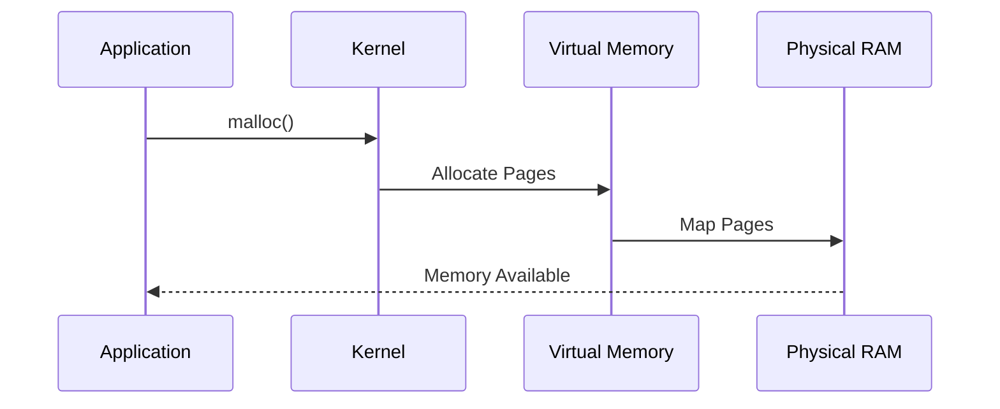

# Linux Memory Management and OOM Investigation

> Advanced Track — Exercise 03

> **Memory is where applications live. Understanding Linux memory management is understanding why systems become slow, unstable, and eventually fail.**

---

# Why This Exercise Exists

Most engineers think memory means:

```text id="x2k1m4"
RAM Usage
```

Linux engineers know memory is far more complex.

Memory involves:

```text id="6k8fqp"
Virtual Memory

Page Tables

Memory Mapping

Page Cache

Buffers

Shared Memory

NUMA

Swap

OOM Killer

Memory Pressure

Memory Reclaim
```

Most production incidents involving:

```text id="jv8z5w"
Slow Servers

Container Restarts

Database Crashes

Kubernetes OOMKilled Pods

Swap Thrashing

High Load
```

are ultimately memory problems.

---

# The Problem This Exercise Solves

Imagine:

```text id="2xg58v"
Server Has 128GB RAM

CPU Is Normal

Disk Is Healthy

Network Is Healthy

Application Still Slow
```

Most engineers become confused.

Advanced engineers ask:

```text id="jknj34"
Is Memory Under Pressure?

Is The Kernel Reclaiming Pages?

Is Swap Active?

Is Page Cache Thrashing?

Did The OOM Killer Trigger?
```

Understanding memory reveals the answer.

---

# Mental Model

Think of memory as a city.

```text id="xzk3da"
CPU = Workers

Memory = Buildings

Storage = Warehouse

Kernel = City Manager
```

Workers can operate efficiently only when resources are nearby.

If resources move to the warehouse:

```text id="5s71zl"
Performance Drops Dramatically
```

That warehouse is storage.

That movement is swapping.

---

# First Principles

Applications never directly access physical memory.

Instead they access:

```text id="q0mpyo"
Virtual Memory
```

The kernel translates:

```text id="eh8gxu"
Virtual Address

↓

Physical Address
```

---

# Linux Memory Architecture

```mermaid id="pzw2ig"
flowchart TD

Application

--> Virtual Memory

Virtual Memory

--> Page Tables

Page Tables

--> Physical Memory

Physical Memory

--> Storage
```

---

# Why Virtual Memory Exists

Without virtual memory:

```text id="y8x5ae"
Processes Would Share
The Same Memory Space
```

Result:

```text id="8whtyk"
Security Problems

Crashes

Corruption
```

Virtual memory provides:

```text id="l6dnpq"
Isolation

Protection

Flexibility
```

---

# Every Process Thinks It Owns Memory

Example:

```text id="3xxp5z"
Process A
0x00000000

Process B
0x00000000

Process C
0x00000000
```

All processes can use identical addresses.

The kernel maps them differently.

---

# Visualization

```text id="rrpsxy"
Application

Virtual Address
      |
      ▼
Page Table
      |
      ▼
Physical RAM
```

---

# Memory Investigation Framework

```mermaid id="svj3tv"
flowchart TD

Memory Problem

--> Memory Usage

--> Memory Pressure

--> Page Cache

--> Swap

--> OOM Events

--> Root Cause
```

---

# Understanding Memory Layers

Linux memory hierarchy:

```text id="a3h9h4"
CPU Registers

CPU Cache

RAM

SSD

Disk
```

Each layer is slower.

---

# Memory Speed Visualization

```text id="6a62g9"
CPU Cache
     ↓ Fastest

RAM
     ↓

SSD
     ↓

HDD
     ↓ Slowest
```

---

# Why Performance Depends on Memory

CPU can process data in nanoseconds.

Storage often responds in milliseconds.

Difference:

```text id="pfh29h"
Millions Of Times Slower
```

---

# Exercise 1 — Investigate System Memory

Run:

```bash id="0t2c1i"
free -h
```

Example:

```text id="h2m51o"
total

used

free

shared

buff/cache

available
```

---

# Common Beginner Mistake

Seeing:

```text id="6mf5hj"
95% Used
```

and assuming:

```text id="3tx8im"
Server Is Out Of Memory
```

This is usually incorrect.

---

# Linux Uses Memory Aggressively

Unused RAM is wasted RAM.

Linux uses spare memory for:

```text id="4m8t77"
Page Cache

Buffers

Filesystem Cache
```

---

# The Most Important Metric

Focus on:

```text id="9g0sd7"
Available Memory
```

Not:

```text id="uw40u7"
Used Memory
```

---

# Exercise 2 — Inspect Detailed Memory Information

Run:

```bash id="njlwmk"
cat /proc/meminfo
```

Observe:

```text id="3azt8f"
MemTotal

MemAvailable

Cached

Buffers

SwapTotal

SwapFree
```

---

# Why /proc/meminfo Matters

Most monitoring tools read this file.

Including:

```text id="v4f4v4"
free

top

Prometheus

Grafana Exporters
```

---

# Linux Page Concept

Memory is divided into:

```text id="3r4gbo"
Pages
```

Usually:

```text id="9bqynx"
4 KB
```

each.

---

# Visualization

```text id="2iyf20"
RAM

Page 1

Page 2

Page 3

Page 4
```

The kernel manages memory page by page.

---

# Page Tables

Page tables translate:

```text id="y0i9a7"
Virtual Memory

↓

Physical Memory
```

---

# Visualization

```text id="v4xy5v"
Virtual Address

0x1234
     |
     ▼
Page Table
     |
     ▼
RAM Location
```

---

# Why Page Tables Matter

Every memory access depends on them.

Bad memory behavior often means:

```text id="yjlwm4"
Page Faults

Translation Overhead

TLB Misses
```

---

# Exercise 3 — Observe Process Memory Layout

Run:

```bash id="x2x9ci"
pmap $$
```

Observe:

```text id="tt8nry"
Libraries

Heap

Stack

Mappings
```

---

# Process Memory Layout

```text id="oz73t4"
Stack

Heap

Shared Libraries

Executable Code
```

---

# Visualization

```text id="ab7x95"
+----------------+
| Stack          |
+----------------+
| Heap           |
+----------------+
| Libraries      |
+----------------+
| Program Code   |
+----------------+
```

---

# Heap vs Stack

Stack:

```text id="j5cv5q"
Function Calls

Local Variables
```

Heap:

```text id="pwxz8n"
Dynamic Allocation
```

Most memory leaks occur in:

```text id="kuxdrf"
Heap
```

---

# Exercise 4 — Investigate Memory Consumption

Run:

```bash id="lk6z0d"
ps aux --sort=-%mem | head
```

Questions:

```text id="qz6g3u"
Largest Memory Consumer?

Expected?

Unexpected?
```

---

# Page Cache

One of Linux's most misunderstood features.

---

# What Is Page Cache?

Linux caches file contents in RAM.

Example:

```text id="1ubc7h"
Read File Once

Read File Again
```

Second read often comes from:

```text id="m1w0pf"
Memory
```

instead of:

```text id="pnzhjk"
Disk
```

---

# Why Page Cache Exists

Memory is dramatically faster than storage.

Caching improves performance.

---

# Visualization

```text id="0kz77f"
Application

↓

Page Cache

↓

Disk
```

---

# Exercise 5 — Observe Cache Usage

Run:

```bash id="s4qvlz"
cat /proc/meminfo | grep Cached
```

Observe value.

---

# Memory Pressure

Occurs when:

```text id="f9u7f9"
Demand > Available Memory
```

The kernel must decide:

```text id="6nd95t"
What Stays?

What Leaves?
```

---

# Linux Memory Reclaim

When memory is low:

```text id="buxd6m"
Remove Cache

Free Buffers

Swap Pages

Kill Processes
```

in that order.

---

# Visualization

```mermaid id="h2rjzj"
flowchart TD

Low Memory

--> Reclaim Cache

--> Reclaim Buffers

--> Swap

--> OOM Killer
```

---

# Exercise 6 — Observe Memory Pressure

Run:

```bash id="8vx18m"
vmstat 1
```

Watch:

```text id="0w1gpi"
si

so
```

---

# Meaning

```text id="rdrs7s"
si = Swap In

so = Swap Out
```

High values indicate pressure.

---

# Swap Explained

Swap extends memory using storage.

Visualization:

```text id="od93o6"
RAM Full

↓

Move Pages To Disk

↓

Free RAM
```

---

# Why Swap Exists

Provides temporary relief.

But:

```text id="33s6x2"
Disk Is Much Slower
Than RAM
```

---

# Swap Thrashing

Occurs when:

```text id="wyy3g4"
Pages Continuously Move

RAM ⇄ Disk
```

Result:

```text id="sm6g86"
Massive Performance Loss
```

---

# Exercise 7 — Inspect Swap

Run:

```bash id="r8vxzh"
swapon --show
```

and:

```bash id="7rqlqf"
free -h
```

Observe usage.

---

# OOM Killer

OOM means:

```text id="rvl9mo"
Out Of Memory
```

---

# Linux OOM Flow

```mermaid id="vwnx1z"
flowchart TD

Memory Exhausted

--> Reclaim Attempts

--> Swap

--> OOM Killer

--> Process Terminated
```

---

# Why OOM Exists

Without OOM:

```text id="ht7a9g"
Kernel

Could Deadlock

Entire System
```

---

# Exercise 8 — Investigate OOM Events

Run:

```bash id="vmlp4r"
dmesg | grep -i oom
```

or:

```bash id="3z2r7g"
journalctl | grep -i oom
```

---

# Example Output

```text id="brrjmo"
Killed process 1234
```

Meaning:

```text id="j50gnw"
Kernel Chose A Victim
```

---

# Kubernetes Connection

Many pod failures:

```text id="pl0xmy"
OOMKilled
```

come directly from Linux memory management.

---

# Exercise 9 — Simulate Memory Pressure

Install:

```bash id="gk3rci"
sudo apt install stress-ng
```

Run:

```bash id="3gxvli"
stress-ng --vm 2 --vm-bytes 80%
```

Observe:

```bash id="y8d0a5"
free -h

vmstat 1
```

---

# Investigation Questions

Did:

```text id="8slwkr"
Available Memory Drop?

Swap Increase?

Load Average Change?
```

---

# Memory Leaks

One of the most common production issues.

---

# Mental Model

Application:

```text id="1ydqkn"
Allocates Memory
```

but never:

```text id="gk7hjz"
Releases Memory
```

---

# Result

```text id="f6pdzy"
Memory Usage

↑

↑

↑

↑
```

until failure.

---

# Exercise 10 — Monitor Process Growth

Run repeatedly:

```bash id="yy9wz5"
ps aux --sort=-%mem
```

Observe memory trends.

---

# NUMA Fundamentals

Large servers often use:

```text id="8wwcbz"
NUMA

Non-Uniform Memory Access
```

---

# Why NUMA Exists

Multiple CPU sockets.

Each socket has:

```text id="brv5d0"
Local Memory
```

Accessing remote memory costs more.

---

# Inspect NUMA

Run:

```bash id="4f2v5z"
numactl --hardware
```

---

# Performance Impact

NUMA awareness matters for:

```text id="8hcfzg"
Databases

AI Workloads

Large JVMs

High-Performance Systems
```

---

# Shared Memory

Processes can share memory.

Useful for:

```text id="lr7rqj"
Databases

Caching Systems

High-Speed IPC
```

---

# Exercise 11 — Investigate Shared Memory

Run:

```bash id="p50lhx"
ipcs -m
```

Observe segments.

---

# Production Incident #1

## Alert

```text id="h5e7go"
Application Slow
```

Investigation:

```bash id="h5j7gt"
free -h

vmstat

top
```

Determine:

```text id="38fhvv"
Memory Pressure?
```

---

# Production Incident #2

## Alert

```text id="vph9qn"
Container Restarting
```

Investigate:

```bash id="u7cvtw"
kubectl describe pod

dmesg

memory limits
```

---

# Production Incident #3

## Alert

```text id="r6zy0z"
Server Load High
CPU Low
```

Investigate:

```bash id="k70fb7"
vmstat

swap

memory reclaim
```

---

# Production Incident #4

## Alert

```text id="fd6axr"
Database Latency Increased
```

Investigate:

```bash id="ih7m7j"
cache

swap

NUMA locality
```

---

# Linux Internals Deep Dive

Memory allocation path:



---

# Docker Connection

Containers do not own memory.

The kernel owns memory.

Containers receive:

```text id="mr6kch"
Memory Limits

cgroup Constraints
```

---

# Kubernetes Connection

Kubernetes memory management depends on:

```text id="mxj27d"
Linux Virtual Memory

Linux OOM Killer

Linux cgroups
```

Many Kubernetes issues are Linux memory issues.

---

# Cloud Engineering Connection

Cloud instances expose:

```text id="s1pf1x"
vCPUs

RAM

Storage
```

Linux decides how memory is actually used.

---

# Common Mistakes

## Mistake 1

Looking only at "used memory".

---

## Mistake 2

Ignoring page cache.

---

## Mistake 3

Ignoring swap activity.

---

## Mistake 4

Treating OOMKilled as an application bug.

---

## Mistake 5

Confusing memory usage with memory pressure.

---

## Mistake 6

Ignoring NUMA effects.

---

# Engineering Mindset

Beginners ask:

```text id="g7wh3v"
How Much Memory Is Used?
```

Engineers ask:

```text id="g0q7dx"
How Is Memory Being Used?

Is Memory Under Pressure?

Is The Kernel Reclaiming?

Is Swap Active?

Why Did OOM Occur?
```

---

# Interview Questions

## Advanced

1. What is virtual memory?
2. Why does Linux use page cache?
3. What is memory pressure?
4. What is swap thrashing?
5. How does the OOM killer work?
6. Difference between heap and stack?
7. What are page tables?
8. Why does Linux show high memory usage?
9. What is NUMA?
10. Why are containers OOMKilled?

---

# Memory Investigation Cheat Sheet

```bash id="mb7hns"
free -h

cat /proc/meminfo

vmstat 1

ps aux --sort=-%mem

pmap PID

swapon --show

dmesg | grep -i oom

journalctl | grep -i oom

ipcs -m

numactl --hardware
```

---

# Capstone Challenge

A production Kubernetes node experiences:

```text id="zvh5jz"
Pods Restarting

OOMKilled Events

High Load Average

Slow Applications

Swap Activity
```

Perform a complete memory investigation.

Document:

```text id="0jwx1h"
Memory Usage

Available Memory

Page Cache

Swap Activity

OOM Events

Process Consumption

NUMA Layout

Evidence

Root Cause

Recovery Plan
```

---

# Completion Criteria

You successfully complete this exercise when you can:

✓ Explain Linux virtual memory

✓ Understand page tables and memory mappings

✓ Investigate memory pressure

✓ Analyze page cache behavior

✓ Diagnose swap activity

✓ Investigate OOM events

✓ Understand NUMA fundamentals

✓ Connect Linux memory management to Docker, Kubernetes, databases, and cloud infrastructure

✓ Perform production-grade memory investigations

Congratulations.

You now understand one of the most important subsystems in Linux: memory management—the foundation of performance, scalability, and stability.
