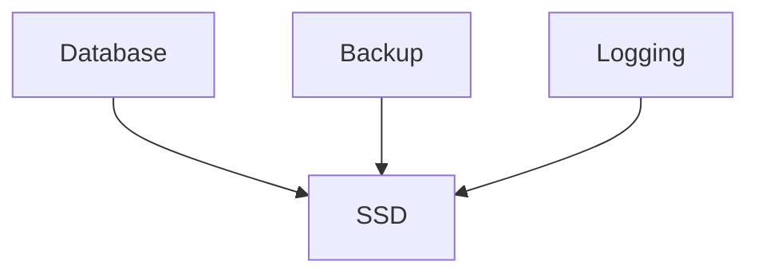
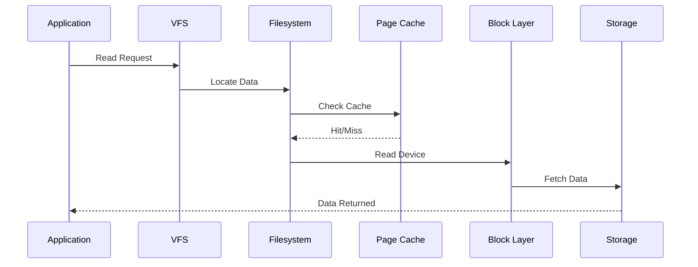

# Linux Storage Performance and I/O Engineering

> Advanced Track — Exercise 04

> **CPU executes instructions. Memory holds data. But storage is where reality lives. Every database transaction, API request, log entry, image upload, Kubernetes volume, and cloud workload ultimately depends on storage performance.**

---

# Why This Exercise Exists

Most engineers understand storage as:

```text id="e1w0jf"
Disk Space
```

But production systems fail because of:

```text id="9b3mza"
Storage Latency

I/O Saturation

Queue Congestion

Write Amplification

Filesystem Bottlenecks

Slow Databases

Storage Contention

Cloud Volume Limits
```

Many engineers investigate:

```text id="dq6r4v"
CPU

Memory

Network
```

while completely ignoring:

```text id="9qfrvn"
Disk Latency
```

which is often the real bottleneck.

---

# The Problem This Exercise Solves

Imagine:

```text id="ep8cgt"
Database CPU = 15%

Memory = Healthy

Network = Healthy

Application = Slow
```

Everything appears normal.

Yet users experience:

```text id="q7cyu0"
Timeouts

Slow Queries

Failed Requests
```

The actual root cause:

```text id="z8pq67"
Storage Latency Increased
```

Understanding Linux I/O engineering allows you to diagnose these invisible bottlenecks.

---

# Mental Model

Imagine a warehouse.

```text id="k5b2zv"
Workers = CPU

Work Orders = Requests

Warehouse = Storage

Forklifts = I/O Operations
```

If forklifts move slowly:

```text id="r4h1az"
Workers Wait
```

Even if workers are fast.

Storage latency causes CPUs to wait.

---

# First Principles

Applications never read disks directly.

Data flows through multiple layers.

```mermaid id="v4kr2o"
flowchart TD

Application

--> Filesystem

Filesystem

--> VFS

VFS

--> Block Layer

Block Layer

--> Device Driver

Device Driver

--> Storage Device
```

Every layer introduces:

```text id="f8yt3v"
Latency

Queuing

Caching

Optimization
```

---

# Storage Performance Hierarchy

```text id="r6ghq8"
CPU Cache
    ↓

RAM
    ↓

NVMe SSD
    ↓

SATA SSD
    ↓

HDD
```

---

# Approximate Latency Comparison

```text id="m4c8iy"
CPU Cache      ~ Nanoseconds

RAM            ~ Hundreds of Nanoseconds

NVMe           ~ Microseconds

SSD            ~ Hundreds of Microseconds

HDD            ~ Milliseconds
```

---

# Critical Engineering Insight

The difference between:

```text id="pqy1vf"
RAM
```

and

```text id="4mn8fx"
Disk
```

is often:

```text id="j6u3bt"
Thousands To Millions Of Times
```

---

# Storage Architecture

```mermaid id="m5k7sa"
flowchart TD

Application

--> VFS

VFS

--> Filesystem

Filesystem

--> Page Cache

Page Cache

--> Block Layer

Block Layer

--> Storage Device
```

---

# Understanding I/O

I/O means:

```text id="4j5y1a"
Input

Output
```

Examples:

```text id="r8pwv0"
Read Database Record

Write Log Entry

Upload Image

Download File
```

---

# I/O Engineering Questions

Every storage investigation asks:

```text id="0w2lma"
How Many Operations?

How Fast?

How Long Do They Wait?

What Is Saturated?
```

---

# Storage Investigation Framework

```mermaid id="s8v2ta"
flowchart TD

Storage Problem

--> Capacity

--> Throughput

--> Latency

--> Queue Depth

--> Device Utilization

--> Root Cause
```

---

# Core Storage Metrics

The four most important storage metrics:

```text id="0gvkt9"
Latency

IOPS

Throughput

Queue Depth
```

---

# Latency

Latency measures:

```text id="sq6m3d"
Time Per Operation
```

Example:

```text id="5vrj1n"
Read Request

↓

2ms
```

---

# Why Latency Matters

Users experience latency.

Not throughput.

Example:

```text id="p58mec"
Fast Storage = Fast Queries

Slow Storage = Slow Queries
```

---

# Throughput

Measures:

```text id="6wq97f"
Data Per Second
```

Examples:

```text id="emwrji"
100 MB/s

1 GB/s

5 GB/s
```

---

# IOPS

Input/Output Operations Per Second.

Examples:

```text id="i7y0lc"
100 IOPS

10,000 IOPS

1,000,000 IOPS
```

---

# Queue Depth

Represents:

```text id="ckm7q5"
How Many Requests
Are Waiting
```

Visualization:

```text id="c9i7qx"
Storage

↓

Request Queue

Request Queue

Request Queue

Request Queue
```

Long queues create latency.

---

# Exercise 1 — Investigate Storage Devices

Run:

```bash id="hfw7gs"
lsblk
```

Observe:

```text id="n8g5a0"
Devices

Partitions

Mount Points
```

---

# Questions

Identify:

```text id="5v5gdy"
HDD?

SSD?

NVMe?
```

---

# Why Device Type Matters

Performance differs dramatically.

Approximate comparison:

```text id="7zj24v"
HDD     100 IOPS

SSD     10,000 IOPS

NVMe    1,000,000+ IOPS
```

---

# Exercise 2 — Investigate Filesystems

Run:

```bash id="uxg3rn"
df -T
```

Observe:

```text id="y6q7es"
ext4

xfs

btrfs
```

---

# Filesystem Engineering

Filesystems affect:

```text id="1r8fgo"
Performance

Reliability

Scalability

Recovery
```

---

# Common Filesystems

## ext4

Reliable.

Balanced.

Widely used.

---

## XFS

Optimized for:

```text id="tm6s8j"
Large Systems

Large Files

Databases
```

---

## Btrfs

Supports:

```text id="6lvrtu"
Snapshots

Compression

Checksums
```

---

# Exercise 3 — Measure Storage Utilization

Install:

```bash id="g8t1gm"
sudo apt install sysstat
```

Run:

```bash id="jsl7r0"
iostat -x 1
```

---

# Important Metrics

Observe:

```text id="q4jvcl"
%util

await

r/s

w/s

svctm
```

---

# Critical Metric: await

Represents:

```text id="4b7c6f"
Average Request Latency
```

---

# Interpretation

```text id="n6o8gz"
<1ms      Excellent

1-10ms    Good

10-50ms   Concerning

50ms+     Serious Problem
```

---

# Exercise 4 — Generate I/O Load

Run:

```bash id="0p7mxa"
dd if=/dev/zero of=test.img bs=1M count=5000
```

Observe:

```bash id="1d8txg"
iostat -x 1
```

Questions:

```text id="gx7t2z"
Latency?

Utilization?

Throughput?
```

---

# Storage Saturation

Occurs when:

```text id="n8u7mr"
Demand > Device Capacity
```

Symptoms:

```text id="1p6rde"
High Await

Large Queues

Slow Applications
```

---

# Visualization

```text id="2r7xtl"
Application Requests
      ↓

Storage Queue
      ↓

Disk
```

When queue grows:

```text id="36rj2q"
Latency Grows
```

---

# Exercise 5 — Identify I/O Consumers

Install:

```bash id="9c0wka"
sudo apt install iotop
```

Run:

```bash id="c0n3ju"
sudo iotop
```

---

# Investigation Questions

Determine:

```text id="ytztxq"
Who Is Reading?

Who Is Writing?

How Much?
```

---

# Why This Matters

Storage issues are often caused by:

```text id="r2u0oa"
Backup Jobs

Log Processing

Database Compaction

Container Image Pulls
```

---

# Linux Page Cache

Before storage access:

Linux checks:

```text id="1w2whf"
Page Cache
```

first.

---

# Data Flow

```mermaid id="d0rlsz"
flowchart TD

Application

--> Page Cache

Page Cache

--> Disk
```

---

# Why Page Cache Matters

Repeated reads often avoid storage entirely.

This dramatically improves performance.

---

# Exercise 6 — Observe Cache Activity

Run:

```bash id="t8vwdi"
cat /proc/meminfo | grep Cached
```

Observe value.

---

# Random vs Sequential I/O

One of the most important storage concepts.

---

# Sequential I/O

Example:

```text id="4a8g6p"
Reading Video File
```

Pattern:

```text id="ab9sqh"
Block 1

Block 2

Block 3
```

---

# Random I/O

Example:

```text id="dx4e3m"
Database Queries
```

Pattern:

```text id="i7t6rh"
Block 1

Block 900

Block 30

Block 7000
```

---

# Why Random I/O Hurts

Storage devices prefer predictable access.

Random access increases latency.

---

# Exercise 7 — Benchmark Storage

Install:

```bash id="ps7f7l"
sudo apt install fio
```

Sequential test:

```bash id="rk8z5w"
fio --name=seqread --rw=read --size=1G
```

Random test:

```bash id="pj3gkl"
fio --name=randread --rw=randread --size=1G
```

Compare:

```text id="03ukg8"
IOPS

Latency

Bandwidth
```

---

# Understanding Write Amplification

Storage often performs:

```text id="jz56s9"
More Writes
Than Applications Requested
```

especially with:

```text id="t92z4j"
SSDs

Databases
```

---

# Why Write Amplification Matters

Causes:

```text id="ij6pq0"
Wear

Latency

Reduced Lifespan
```

---

# Linux Block Layer

The block layer coordinates:

```text id="9yvtg7"
Reads

Writes

Queues

Scheduling
```

---

# Architecture

```mermaid id="m6p52s"
flowchart TD

Filesystem

--> Block Layer

Block Layer

--> I/O Scheduler

I/O Scheduler

--> Device
```

---

# I/O Scheduler

Determines:

```text id="d6l1wf"
Which Request Runs Next
```

---

# Common Schedulers

```text id="a2x4ku"
mq-deadline

bfq

none
```

---

# Check Scheduler

Run:

```bash id="i8ct55"
cat /sys/block/sda/queue/scheduler
```

---

# Why Scheduling Matters

Schedulers influence:

```text id="85w7ic"
Latency

Fairness

Throughput
```

---

# Exercise 8 — Investigate Open Deleted Files

Run:

```bash id="eg0b4e"
lsof | grep deleted
```

---

# Production Incident

```text id="wvr6yn"
Disk Full

File Deleted

Space Not Recovered
```

Often caused by:

```text id="kz02tn"
Open File Handles
```

---

# Storage Contention

Imagine:

```text id="v9n1dx"
Database

Backup

Log Processor
```

sharing:

```text id="c0nn6r"
One SSD
```

Result:

```text id="o7h1wo"
Contention
```

---

# Visualization



All compete.

---

# Exercise 9 — Investigate Mounts

Run:

```bash id="jlwm3j"
findmnt
```

Questions:

```text id="dq7a5u"
Read Only?

Expected Mounts?

Filesystem Health?
```

---

# Production Incident #1

## Database Slow

Investigate:

```bash id="v8efdb"
iostat

iotop

fio
```

Determine:

```text id="vb7h0m"
Storage Latency?
```

---

# Production Incident #2

## Kubernetes Volume Slow

Investigate:

```bash id="jv6h0x"
iostat

PVC

Storage Backend
```

---

# Production Incident #3

## High Application Latency

CPU Normal.

Memory Normal.

Investigate:

```bash id="v3d4p5"
Storage Wait
```

---

# Production Incident #4

## Disk Utilization 100%

Determine:

```text id="g8dxp5"
Large Files?

Backup Growth?

Log Explosion?

Container Data?
```

---

# Linux Internals Deep Dive

Read request path:



---

# Docker Connection

Docker storage depends on:

```text id="8vfhha"
OverlayFS

Volumes

Images

Layering
```

Investigate:

```bash id="h9t6h2"
docker system df
```

---

# Kubernetes Connection

Storage becomes:

```text id="efgqtw"
Persistent Volumes

CSI Drivers

Storage Classes

Volume Attachments
```

Understanding Linux storage is mandatory for Kubernetes troubleshooting.

---

# Database Connection

Databases are storage-intensive systems.

Examples:

```text id="0e86qw"
PostgreSQL

MySQL

MongoDB

Cassandra
```

Most database performance problems eventually become:

```text id="v3dvtv"
Storage Problems
```

---

# Cloud Engineering Connection

Cloud storage services map to:

```text id="pq0nwo"
EBS

Persistent Disk

Managed SSD

Block Storage
```

All rely on Linux block I/O concepts.

---

# Common Mistakes

## Mistake 1

Checking only disk space.

---

## Mistake 2

Ignoring latency.

---

## Mistake 3

Ignoring queue depth.

---

## Mistake 4

Assuming SSDs cannot become bottlenecks.

---

## Mistake 5

Ignoring page cache effects.

---

## Mistake 6

Confusing throughput with latency.

---

# Engineering Mindset

Beginners ask:

```text id="f3ibn1"
How Much Disk Space Exists?
```

Engineers ask:

```text id="t6sl8w"
How Fast Is Storage?

What Is Latency?

What Is Waiting?

Who Is Generating I/O?

What Is Saturated?
```

---

# Interview Questions

## Advanced

1. What is IOPS?
2. What is storage latency?
3. Difference between throughput and latency?
4. What is page cache?
5. What is random I/O?
6. What is write amplification?
7. How does the Linux block layer work?
8. What does iostat show?
9. Why can SSDs become bottlenecks?
10. How do databases depend on storage performance?

---

# Storage Performance Cheat Sheet

```bash id="1cvvmb"
lsblk

df -T

findmnt

iostat -x 1

iotop

fio

lsof | grep deleted

cat /proc/meminfo

dd if=/dev/zero of=test.img bs=1M count=5000

cat /sys/block/*/queue/scheduler
```

---

# Capstone Challenge

A production PostgreSQL cluster experiences:

```text id="hh0yit"
Slow Queries

High API Latency

Growing Storage Utilization

Intermittent Timeouts

Customer Complaints
```

Perform a complete storage investigation.

Document:

```text id="a4h8eq"
Storage Type

Filesystem

Latency

IOPS

Queue Depth

Utilization

Page Cache Behavior

Top I/O Consumers

Evidence

Root Cause

Optimization Plan
```

---

# Completion Criteria

You successfully complete this exercise when you can:

✓ Explain Linux storage architecture

✓ Understand the block layer and I/O path

✓ Analyze storage latency

✓ Investigate IOPS and throughput

✓ Understand page cache behavior

✓ Diagnose storage bottlenecks

✓ Analyze queue depth and saturation

✓ Investigate database and container storage issues

✓ Connect Linux storage engineering to Docker, Kubernetes, cloud platforms, and production systems

Congratulations.

You now understand one of the most important realities of systems engineering:

**Fast CPUs do not matter when storage is slow.**
