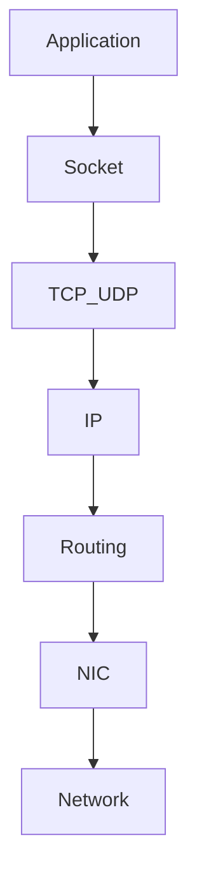
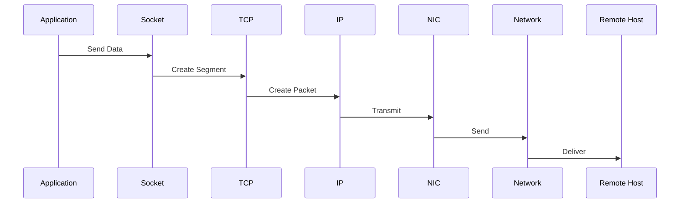
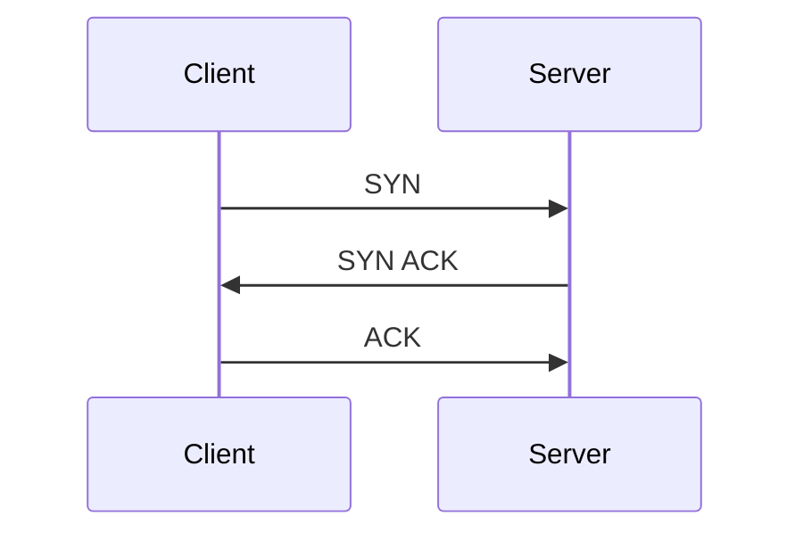
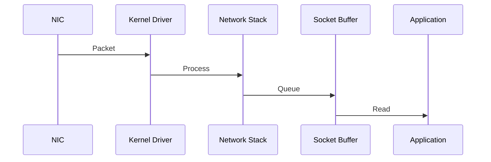

# Linux Network Performance and Packet Analysis

> Advanced Track — Exercise 05

> **Every distributed system is ultimately a networking system.**
>
> Databases, microservices, Kubernetes clusters, cloud platforms, APIs, CDNs, and the internet itself all depend on packets moving efficiently through Linux networking stacks.

---

# Why This Exercise Exists

Most engineers troubleshoot networking by running:

```bash
ping
```

and hoping for answers.

Production networking problems are rarely that simple.

Real incidents involve:

```text
Packet Loss

TCP Retransmissions

Network Saturation

DNS Latency

Connection Queue Exhaustion

Buffer Pressure

MTU Issues

Congestion

Dropped Packets

Kernel Network Stack Bottlenecks
```

Most engineers can see that a network problem exists.

Few can explain:

```text
Why It Exists

Where It Exists

Which Layer Is Failing

How Packets Behave
```

This exercise teaches Linux networking from the packet's perspective.

---

# The Problem This Exercise Solves

Imagine:

```text
CPU Healthy

Memory Healthy

Storage Healthy

Application Healthy
```

Users still report:

```text
Slow API Responses

Database Timeouts

Intermittent Failures

Connection Resets
```

The root cause may be:

```text
Packet Loss

TCP Congestion

DNS Delays

Network Saturation

Kernel Socket Pressure
```

Network performance engineering helps identify the true bottleneck.

---

# Mental Model

Imagine a package delivery system.

```text
Application = Sender

Packet = Package

TCP = Delivery Service

Router = Sorting Center

Network = Road System

Server = Recipient
```

When deliveries become slow:

```text
Traffic Jam?

Lost Packages?

Wrong Address?

Slow Sorting Center?
```

Networking follows the same principles.

---

# First Principles

Applications do not communicate.

Packets communicate.

Every request becomes:

```text
Packets
```

Every response becomes:

```text
Packets
```

Performance depends on how efficiently those packets move.

---

# Network Performance Hierarchy

```text
Application
    ▲
Socket
    ▲
TCP / UDP
    ▲
IP Layer
    ▲
NIC Driver
    ▲
Network Hardware
```

Every layer can become a bottleneck.

---

# Linux Networking Architecture



---

# The Journey of a Packet

When:

```text
curl https://api.example.com
```

runs:

```text
Application

↓

Socket

↓

TCP

↓

IP

↓

NIC

↓

Switch

↓

Router

↓

Destination
```

Thousands of operations occur before a response arrives.

---

# Packet Lifecycle



---

# Network Investigation Framework

```mermaid
flowchart TD

Network Problem

--> DNS

--> Connectivity

--> Latency

--> Packet Loss

--> TCP Behavior

--> Saturation

--> Root Cause
```

---

# Understanding Latency

Latency means:

```text
Time Required To Deliver Data
```

Example:

```text
Request Sent

↓

50ms

↓

Response Received
```

---

# Why Latency Matters

Users experience:

```text
Latency
```

Not:

```text
Bandwidth
```

---

# Latency Sources

```text
Application Delay

DNS Lookup

TCP Handshake

Routing

Network Transit

Remote Processing
```

---

# Visualization

```text
User

↓

DNS

↓

TCP Handshake

↓

Network

↓

Application

↓

Response
```

Every step adds latency.

---

# Exercise 1 — Measure Basic Latency

Run:

```bash
ping 8.8.8.8
```

Observe:

```text
RTT

Min

Max

Average
```

---

# Questions

Determine:

```text
Consistent?

Variable?

Packet Loss?
```

---

# Understanding RTT

RTT:

```text
Round Trip Time
```

Measures:

```text
Request

↓

Response

↓

Return
```

---

# Exercise 2 — Investigate Routes

Run:

```bash
traceroute google.com
```

or:

```bash
mtr google.com
```

---

# Why Routes Matter

Packets rarely travel directly.

Visualization:

```text
Your Host

↓

Router

↓

ISP

↓

Backbone

↓

Destination
```

Every hop introduces delay.

---

# Understanding Throughput

Throughput measures:

```text
Data Per Second
```

Examples:

```text
100 Mbps

1 Gbps

10 Gbps
```

---

# Important Insight

A network can have:

```text
High Throughput
```

and:

```text
High Latency
```

simultaneously.

---

# Exercise 3 — Measure Throughput

Install:

```bash
sudo apt install iperf3
```

Server:

```bash
iperf3 -s
```

Client:

```bash
iperf3 -c SERVER_IP
```

Observe:

```text
Bandwidth

Transfer Rate
```

---

# TCP Fundamentals

Most production applications use:

```text
TCP
```

because TCP provides:

```text
Reliability

Ordering

Flow Control

Congestion Control
```

---

# TCP Connection Lifecycle



Connection established.

---

# Why Handshakes Matter

Every connection requires:

```text
Extra Round Trips
```

Increasing latency.

---

# Exercise 4 — Observe TCP Connections

Run:

```bash
ss -tan
```

Observe:

```text
LISTEN

ESTABLISHED

TIME_WAIT

CLOSE_WAIT
```

---

# Connection States Matter

Large numbers of:

```text
TIME_WAIT
```

may indicate:

```text
Connection Churn
```

---

# TCP Congestion Control

TCP assumes:

```text
Packet Loss = Congestion
```

When loss occurs:

```text
Transmission Rate Drops
```

---

# Why Congestion Matters

Network saturation causes:

```text
Retransmissions

Latency

Reduced Throughput
```

---

# Packet Loss

One of the most damaging network issues.

Symptoms:

```text
Slow APIs

Timeouts

Database Failures

User Complaints
```

---

# Visualization

```text
Packet 1 ✓

Packet 2 ✗

Packet 3 ✓

Packet 4 ✓
```

Lost packets require retransmission.

---

# Exercise 5 — Detect Packet Loss

Run:

```bash
ping -c 100 8.8.8.8
```

Observe:

```text
Loss Percentage
```

---

# Questions

Any loss?

Consistent?

Burst Loss?

````

---

# Network Saturation

Occurs when:

```text
Demand > Capacity
````

---

# Visualization

```text
Packets Arriving

↓↓↓↓↓↓↓↓

NIC Capacity

↓↓↓

Packets Queue
```

Queue growth increases latency.

---

# Linux Socket Buffers

Sockets use buffers for:

```text
Incoming Data

Outgoing Data
```

---

# Why Buffers Matter

Buffers absorb bursts.

Too small:

```text
Packet Drops
```

Too large:

```text
Latency Increases
```

---

# Inspect Network Statistics

Run:

```bash
ip -s link
```

Observe:

```text
RX

TX

Dropped

Errors
```

---

# Exercise 6 — Investigate Interface Health

Run:

```bash
ip -s link
```

Questions:

```text
Errors?

Drops?

Collisions?
```

---

# Packet Capture Fundamentals

To truly understand networking:

```text
Observe Packets
```

---

# Why Packet Capture Matters

Logs show:

```text
Symptoms
```

Packets show:

```text
Reality
```

---

# Exercise 7 — Capture Packets

Install:

```bash
sudo apt install tcpdump
```

Run:

```bash
sudo tcpdump -i any
```

Observe traffic.

---

# Packet Capture Flow


---

# Exercise 8 — Capture HTTP Traffic

Run:

```bash
sudo tcpdump port 80
```

Generate traffic:

```bash
curl http://example.com
```

Observe packets.

---

# Reading Packet Captures

Key fields:

```text
Source

Destination

Protocol

Flags

Length
```

---

# TCP Retransmissions

A retransmission means:

```text
Sender Believes Packet Was Lost
```

---

# Why Retransmissions Matter

They indicate:

```text
Congestion

Packet Loss

Network Instability
```

---

# DNS Performance

Many "network" problems are actually:

```text
DNS Problems
```

---

# Exercise 9 — Measure DNS

Run:

```bash
dig google.com
```

Observe:

```text
Query Time
```

---

# Questions

Fast?

Slow?

Timeouts?

````

---

# DNS Flow

```mermaid
sequenceDiagram

Application->>DNS Server: Query

DNS Server-->>Application: Response

Application->>Remote Host: Connect
````

---

# Engineering Insight

Without DNS:

```text
Networking Appears Broken
```

even when connectivity works.

---

# Exercise 10 — Investigate Connections Per Process

Run:

```bash
lsof -i
```

Observe:

```text
Process

Connection

Port
```

---

# Connection Queues

Servers maintain:

```text
Accept Queues

Connection Queues
```

---

# Why Queues Matter

When queues fill:

```text
Connections Fail
```

even if the application is healthy.

---

# Inspect Socket Statistics

Run:

```bash
ss -s
```

Observe:

```text
TCP Connections

Socket Usage

States
```

---

# Network Bottleneck Tree

```mermaid
flowchart TD

Slow Network

--> DNS?

--> Packet Loss?

--> Congestion?

--> Latency?

--> Saturation?

--> Application?
```

---

# Exercise 11 — Investigate Live Network Usage

Run:

```bash
sudo apt install iftop
```

Then:

```bash
sudo iftop
```

Observe:

```text
Bandwidth Usage

Top Talkers
```

---

# Production Incident #1

## API Latency Increased

Investigate:

```bash
ping

mtr

ss

tcpdump
```

Determine:

```text
Latency?

Packet Loss?

Application?
```

---

# Production Incident #2

## Database Timeouts

Investigate:

```bash
tcpdump

ss

traceroute
```

Determine:

```text
Network Delay?

Storage Delay?

Application Delay?
```

---

# Production Incident #3

## Kubernetes Service Slow

Investigate:

```bash
tcpdump

kubectl logs

CNI Networking
```

Determine root cause.

---

# Production Incident #4

## Packet Loss Alert

Investigate:

```bash
ip -s link

tcpdump

mtr
```

Identify source.

---

# Linux Internals Deep Dive

Packet receive path:



---

# Soft IRQs

High network traffic generates:

```text
Soft Interrupts
```

which consume CPU.

Investigate:

```bash
cat /proc/softirqs
```

---

# Network Performance and CPU

Networking often appears as:

```text
CPU Usage
```

because packet processing requires CPU.

---

# Docker Connection

Docker networking relies on:

```text
Linux Bridges

veth Pairs

iptables

NAT
```

Investigate:

```bash
docker network ls
```

---

# Kubernetes Connection

Kubernetes networking depends on:

```text
CNI

Linux Routing

iptables

IPVS

eBPF
```

Every Kubernetes packet eventually becomes a Linux packet.

---

# Cloud Engineering Connection

Cloud networking builds on:

```text
Virtual NICs

Linux TCP/IP

Overlay Networks

Load Balancers
```

Understanding Linux networking explains cloud networking.

---

# Common Mistakes

## Mistake 1

Assuming ping proves application health.

---

## Mistake 2

Ignoring DNS latency.

---

## Mistake 3

Ignoring packet loss.

---

## Mistake 4

Confusing throughput with latency.

---

## Mistake 5

Ignoring retransmissions.

---

## Mistake 6

Troubleshooting applications before networking.

---

# Engineering Mindset

Beginners ask:

```text
Can I reach the server?
```

Engineers ask:

```text
How are packets behaving?

Where is latency introduced?

Where are packets dropped?

What layer is saturated?
```

---

# Interview Questions

## Advanced

1. Explain the Linux networking stack.
2. What is RTT?
3. Difference between latency and throughput?
4. What causes packet loss?
5. How does TCP congestion control work?
6. What are socket buffers?
7. What is a TCP retransmission?
8. How would you investigate network saturation?
9. Why is tcpdump powerful?
10. How does Kubernetes networking depend on Linux?

---

# Network Performance Cheat Sheet

```bash
ping

traceroute

mtr

iperf3

ss -tan

ss -s

ip -s link

tcpdump

dig

lsof -i

iftop

cat /proc/softirqs
```

---

# Capstone Challenge

A production microservices platform experiences:

```text
API Latency

Intermittent Timeouts

Packet Loss Alerts

Slow Database Connectivity

Customer Complaints
```

Perform a complete network investigation.

Document:

```text
Latency

Throughput

Packet Loss

Retransmissions

TCP State Analysis

DNS Performance

Socket Statistics

Interface Health

Packet Captures

Evidence

Root Cause

Remediation Plan
```

---

# Completion Criteria

You successfully complete this exercise when you can:

✓ Explain Linux packet flow

✓ Analyze latency and throughput

✓ Investigate packet loss

✓ Understand TCP behavior

✓ Capture and analyze packets

✓ Investigate network saturation

✓ Analyze socket states

✓ Troubleshoot DNS performance

✓ Connect Linux networking concepts to Docker, Kubernetes, cloud networking, and distributed systems

✓ Perform production-grade packet-level investigations

Congratulations.

You now understand one of the most important truths in distributed systems:

**Applications do not communicate. Packets do.**
