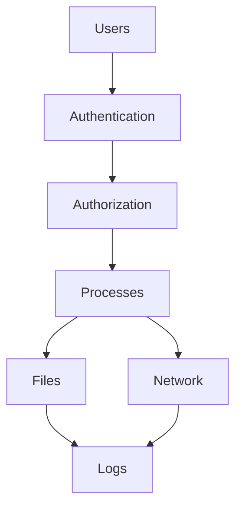
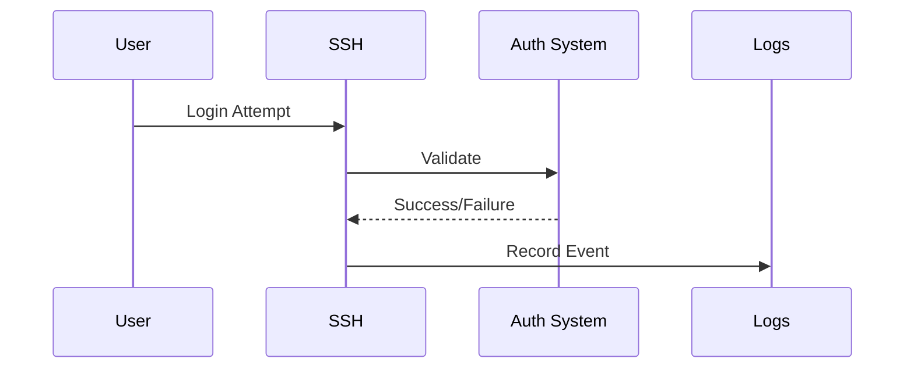
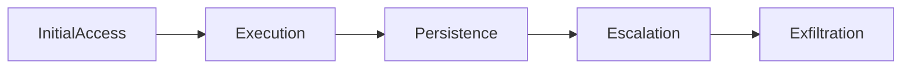
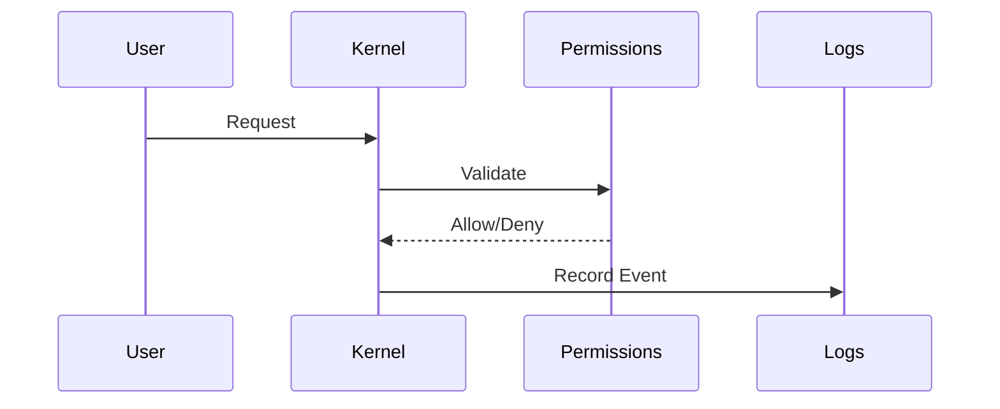

# Linux Security Incidents and Forensics

> Advanced Track — Exercise 06

> **Security engineering is not about preventing every attack. It is about detecting, understanding, containing, recovering from, and learning from security incidents.**

---

# Why This Exercise Exists

Most Linux security learning focuses on:

```text
Permissions

Users

SSH

Firewalls
```

Those are important.

But production security engineering involves:

```text
Incident Detection

Threat Hunting

Forensics

Compromise Analysis

Privilege Escalation Investigation

Persistence Detection

Root Cause Analysis

Evidence Collection

Containment

Recovery
```

Most organizations discover attacks only after:

```text
Data Exfiltration

Cryptomining

Service Disruption

Credential Theft

Ransomware

Infrastructure Abuse
```

The question becomes:

```text
What happened?
```

Linux forensics helps answer that question.

---

# The Problem This Exercise Solves

Imagine a production alert:

```text
CPU Usage 100%

Outbound Traffic Increased

Unknown Process Running

Authentication Logs Suspicious
```

Questions immediately appear:

```text
Is The System Compromised?

Who Logged In?

What Changed?

What Was Accessed?

What Data Left The System?

How Long Has The Attacker Been Here?
```

Security investigation exists to answer these questions using evidence rather than assumptions.

---

# Mental Model

Think like a crime scene investigator.

A compromised Linux server is a crime scene.

Your job is:

```text
Preserve Evidence

Build Timeline

Identify Entry Point

Determine Scope

Understand Impact

Recover Safely
```

Never begin with:

```text
Delete Everything
```

Begin with:

```text
Collect Evidence
```

---

# First Principles

Every incident consists of:

```text
Entry

Execution

Persistence

Privilege Escalation

Lateral Movement

Impact
```

This maps closely to real attacker behavior.

---

# Incident Investigation Framework

```mermaid
flowchart TD

Alert

--> Evidence Collection

--> Timeline Building

--> Scope Analysis

--> Root Cause

--> Containment

--> Recovery

--> Hardening
```

---

# Security Investigation Philosophy

Never ask:

```text
How Do I Remove The Attacker?
```

First ask:

```text
How Do I Understand The Attack?
```

Understanding precedes recovery.

---

# Linux Security Architecture



Evidence exists throughout the system.

---

# Forensic Priorities

Order matters.

Collect:

```text
Processes

Network Connections

Logged-In Users

Memory Information

Logs

Filesystem State
```

before making changes.

---

# Why Evidence Collection Matters

Restarting a process can destroy:

```text
Memory Evidence

Network Evidence

Runtime State
```

---

# Incident Severity Classification

## Severity 1

```text
Confirmed Compromise

Data Exposure

Critical Infrastructure Impact
```

Immediate action required.

---

## Severity 2

```text
Suspicious Activity

Potential Compromise

Unauthorized Access Attempt
```

Requires investigation.

---

## Severity 3

```text
Policy Violations

Misconfiguration

Low Risk Events
```

---

# Exercise 1 — Establish Current State

Identify current user:

```bash
whoami
```

View identity:

```bash
id
```

View logged-in users:

```bash
who
```

Detailed sessions:

```bash
w
```

---

# Investigation Questions

Determine:

```text
Who Is Logged In?

From Where?

Doing What?
```

---

# Exercise 2 — Investigate Authentication Activity

Ubuntu:

```bash
sudo less /var/log/auth.log
```

RHEL:

```bash
sudo less /var/log/secure
```

Search failures:

```bash
grep "Failed password" /var/log/auth.log
```

---

# Questions

Identify:

```text
Repeated Failures

Brute Force Attempts

Unexpected Sources

Privilege Escalation Events
```

---

# Authentication Timeline



---

# Exercise 3 — Investigate Historical Logins

Run:

```bash
last
```

Failed attempts:

```bash
lastb
```

---

# Questions

Determine:

```text
Unusual Login Times?

Unknown IPs?

Unexpected Users?
```

---

# Why Login Analysis Matters

Most compromises begin with:

```text
Credential Abuse
```

---

# Exercise 4 — Investigate Running Processes

Run:

```bash
ps aux
```

Sort by CPU:

```bash
ps aux --sort=-%cpu
```

Sort by memory:

```bash
ps aux --sort=-%mem
```

---

# Investigation Questions

Look for:

```text
Unknown Binaries

Cryptominers

Unexpected Shells

Suspicious Paths
```

---

# Common Red Flags

```text
Processes Running From /tmp

Processes Running From /dev/shm

Encoded Commands

Unknown Network Tools
```

---

# Process Investigation Workflow

```mermaid
flowchart TD

Process

--> Path

--> Parent Process

--> User

--> Network Activity

--> Legitimacy
```

---

# Exercise 5 — Investigate Process Trees

Run:

```bash
pstree -p
```

---

# Why Process Trees Matter

Attackers often spawn:

```text
Shell

↓

Downloader

↓

Payload

↓

Persistence Mechanism
```

Process trees reveal relationships.

---

# Exercise 6 — Investigate Network Connections

Run:

```bash
ss -tulpn
```

Active connections:

```bash
ss -tanp
```

---

# Questions

Determine:

```text
Unexpected Ports?

Unexpected Destinations?

Unknown Listeners?
```

---

# Network Forensics Mental Model

Every attacker eventually communicates.

Observe:

```text
Inbound Connections

Outbound Connections

Persistent Sessions
```

---

# Exercise 7 — Map Processes To Connections

Run:

```bash
lsof -i
```

---

# Questions

Which process owns:

```text
Port 80?

Port 443?

Unknown Ports?
```

---

# Why This Matters

A suspicious connection becomes actionable when tied to a process.

---

# Exercise 8 — Investigate File Changes

Recent changes:

```bash
find /etc -mtime -7
```

Recent executables:

```bash
find / -type f -mtime -1 2>/dev/null
```

---

# Questions

What changed?

Should it have changed?

Who changed it?

---

# Persistence Investigation

Attackers want persistence.

Common locations:

```text
cron

systemd

SSH Keys

Shell Profiles

Startup Scripts
```

---

# Exercise 9 — Investigate Cron Jobs

Current user:

```bash
crontab -l
```

System-wide:

```bash
ls -la /etc/cron*
```

---

# Questions

Unexpected jobs?

Suspicious scripts?

Unknown binaries?

---

# Exercise 10 — Investigate SSH Keys

Inspect:

```bash
ls -la ~/.ssh
```

View authorized keys:

```bash
cat ~/.ssh/authorized_keys
```

---

# Why SSH Keys Matter

Attackers often install:

```text
Backdoor Access
```

through SSH keys.

---

# Exercise 11 — Investigate Systemd Persistence

List services:

```bash
systemctl list-unit-files
```

Inspect service:

```bash
systemctl cat SERVICE
```

---

# Common Persistence Technique

Malicious service:

```text
Auto Starts At Boot

Reconnects To Attacker

Downloads Payloads
```

---

# Exercise 12 — Investigate SUID Binaries

Find SUID files:

```bash
find / -perm -4000 2>/dev/null
```

---

# Why SUID Matters

Misconfigured SUID binaries may enable:

```text
Privilege Escalation
```

---

# Visualization

```text
User

↓

SUID Binary

↓

Root Privileges
```

---

# Exercise 13 — Investigate Kernel Messages

Run:

```bash
dmesg
```

Look for:

```text
Security Events

Module Loading

Unexpected Errors
```

---

# Kernel Forensics

Investigate:

```text
New Modules

Unexpected Drivers

Security Failures
```

---

# Exercise 14 — Investigate Audit Logs

Install:

```bash
sudo apt install auditd
```

Check:

```bash
sudo systemctl status auditd
```

Search:

```bash
ausearch
```

---

# Why Auditd Matters

Tracks:

```text
File Access

User Actions

Privilege Escalation

System Calls
```

---

# Exercise 15 — Investigate System Calls

Install:

```bash
sudo apt install strace
```

Trace:

```bash
strace -p PID
```

---

# Questions

What files?

What network calls?

What activity?

````

---

# Building An Incident Timeline

Create chronology:

```text
Login Event

↓

Privilege Escalation

↓

Persistence

↓

Data Access

↓

Outbound Connections
````

---

# Timeline Visualization



---

# Evidence Collection Checklist

Collect:

```text
Processes

Open Files

Connections

Authentication Logs

System Logs

Cron Jobs

Services

SSH Keys

Filesystem Changes
```

---

# Incident Simulation #1

## Alert

```text
Repeated Failed SSH Logins
```

Investigate:

```bash
grep Failed /var/log/auth.log

last

lastb
```

Determine:

```text
Brute Force?

User Error?

Credential Stuffing?
```

---

# Incident Simulation #2

## Alert

```text
CPU Usage Suddenly Increased
```

Investigate:

```bash
ps aux

top

pstree
```

Determine:

```text
Application?

Cryptominer?

Malware?
```

---

# Incident Simulation #3

## Alert

```text
Unknown Outbound Traffic
```

Investigate:

```bash
ss -tanp

lsof -i

tcpdump
```

Determine destination.

---

# Incident Simulation #4

## Alert

```text
Unauthorized Root Access
```

Investigate:

```bash
auth logs

sudo logs

audit logs

shell history
```

---

# Incident Simulation #5

## Alert

```text
Sensitive Data Exposure
```

Determine:

```text
What Data?

Who Accessed It?

When?

How?
```

---

# Linux Internals Deep Dive

Security events eventually become:



The kernel remains the ultimate enforcement point.

---

# Rootkits

A rootkit attempts to hide:

```text
Processes

Files

Connections

Activity
```

---

# Rootkit Investigation

Tools:

```bash
chkrootkit

rkhunter
```

---

# Why Rootkits Matter

They attack visibility itself.

Your investigation tools may be affected.

---

# Memory Forensics

Some attacks exist only in memory.

Examples:

```text
Injected Processes

Credential Theft

Runtime Manipulation
```

---

# Important Principle

Disk Forensics Shows:

```text
What Was Stored
```

Memory Forensics Shows:

```text
What Was Running
```

---

# Docker Security Investigation

Inspect:

```bash
docker ps

docker inspect

docker logs
```

Questions:

```text
Unexpected Containers?

Privileged Containers?

Suspicious Images?
```

---

# Container Escape Thinking

Investigate:

```text
Host Mounts

Privileged Mode

Capabilities

Docker Socket Access
```

---

# Kubernetes Security Investigation

Check:

```bash
kubectl get pods

kubectl logs

kubectl describe pod
```

Investigate:

```text
Unexpected Pods

Suspicious Images

Privilege Escalation

Secrets Exposure
```

---

# Cloud Security Connection

Cloud incidents often involve:

```text
Credential Theft

Metadata Service Abuse

Misconfigured IAM

Compromised Instances
```

Linux remains the forensic foundation.

---

# Security Hardening After Investigation

Once root cause is understood:

```text
Patch Vulnerabilities

Rotate Credentials

Remove Persistence

Reduce Privileges

Improve Monitoring
```

---

# Common Mistakes

## Mistake 1

Rebooting immediately.

---

## Mistake 2

Deleting evidence.

---

## Mistake 3

Assuming one indicator equals compromise.

---

## Mistake 4

Ignoring timelines.

---

## Mistake 5

Trusting compromised systems completely.

---

## Mistake 6

Skipping containment planning.

---

# Engineering Mindset

Beginners ask:

```text
How Do I Remove The Threat?
```

Security engineers ask:

```text
What Happened?

How Did It Happen?

How Long Was It Active?

What Was Impacted?

How Can We Prove It?
```

---

# Interview Questions

## Advanced

1. What are the stages of a security incident?
2. How would you investigate a Linux compromise?
3. What evidence should be collected first?
4. What is persistence?
5. What is privilege escalation?
6. How would you identify a cryptominer?
7. What is auditd?
8. How do SSH keys create persistence?
9. What is a rootkit?
10. Why are timelines important in forensics?

---

# Security Forensics Cheat Sheet

```bash
who

w

id

last

lastb

ps aux

pstree

ss -tanp

ss -tulpn

lsof -i

find /etc -mtime -7

find / -perm -4000

crontab -l

systemctl list-unit-files

journalctl

dmesg

ausearch

strace -p PID

chkrootkit

rkhunter
```

---

# Capstone Challenge

A production Linux server exhibits:

```text
Unknown Processes

High CPU Usage

Unexpected Network Connections

Suspicious SSH Activity

Modified Configuration Files
```

Perform a complete forensic investigation.

Document:

```text
Evidence

Timeline

Entry Point

Persistence Mechanisms

Privilege Escalation

Network Activity

Affected Assets

Root Cause

Containment Plan

Recovery Plan

Hardening Recommendations
```

Do not guess.

Build a case from evidence.

---

# Completion Criteria

You successfully complete this exercise when you can:

✓ Investigate Linux security incidents systematically

✓ Collect and preserve evidence

✓ Analyze authentication activity

✓ Investigate processes and network activity

✓ Detect persistence mechanisms

✓ Analyze privilege escalation paths

✓ Build incident timelines

✓ Use audit and forensic tooling

✓ Investigate Docker and Kubernetes security events

✓ Think like a forensic investigator instead of a command operator

Congratulations.

You now understand one of the most valuable skills in infrastructure engineering:

**The ability to reconstruct what happened from the evidence a Linux system leaves behind.**
