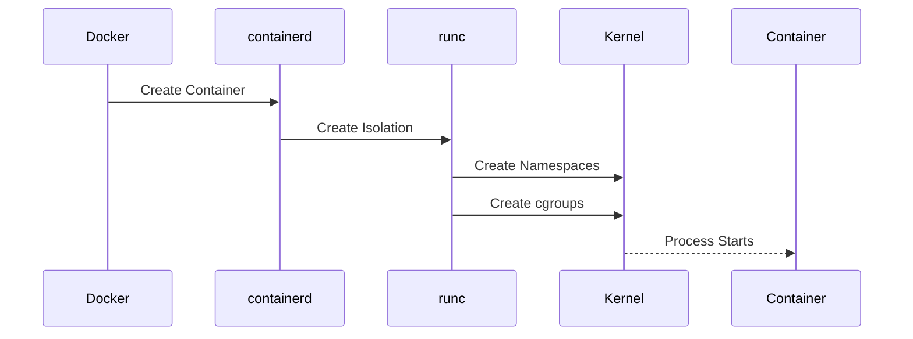

# Linux Container Internals, Docker, and cgroups

> Advanced Track — Exercise 07

> **Containers are not miniature virtual machines. Containers are Linux processes with carefully engineered isolation and resource controls.**

---

# Why This Exercise Exists

Most engineers use containers every day:

```bash
docker run

docker ps

docker build

kubectl apply
```

Yet many do not understand:

```text
What Is A Container?

Where Does Isolation Come From?

How Does Docker Work?

How Does Kubernetes Create Pods?

Why Does OOMKilled Happen?

What Are Namespaces?

What Are cgroups?

How Does Container Networking Work?

Why Are Containers Lightweight?
```

Without understanding Linux internals, containers appear magical.

They are not.

Containers are one of the most elegant applications of Linux kernel features ever created.

---

# The Problem This Exercise Solves

Imagine:

```text
Container OOMKilled

Container CPU Throttled

Container Cannot See Host Processes

Container Has Different Filesystem

Container Has Different Network

Container Starts In Milliseconds
```

Why?

The answer lies in:

```text
Namespaces

cgroups

Capabilities

OverlayFS

Process Isolation
```

Understanding these mechanisms transforms Docker and Kubernetes from tools into understandable systems.

---

# Mental Model

Think of a container as:

```text
A Private Apartment
Inside A Shared Building
```

The apartment has:

```text
Private Rooms

Private View

Private Network

Private Storage
```

But still shares:

```text
Foundation

Elevators

Electricity

Structure
```

In Linux:

```text
Private Resources = Namespaces

Shared Structure = Linux Kernel
```

---

# First Principles

A container is:

```text
A Linux Process
```

Nothing more.

Nothing less.

---

# Critical Insight

This process:

```bash
nginx
```

and this process:

```bash
docker run nginx
```

are both:

```text
Linux Processes
```

The difference is isolation.

---

# The Evolution Of Isolation

Before containers:

```text
Physical Server
     ↓
Virtual Machines
     ↓
Containers
```

---

# Physical Servers

```text
One OS

One Workload
```

Problems:

```text
Waste

Low Utilization

High Cost
```

---

# Virtual Machines

```text
Multiple Operating Systems

Hypervisor
```

Advantages:

```text
Strong Isolation
```

Problems:

```text
Heavyweight

Large Memory Usage

Slow Startup
```

---

# Containers

```text
One Kernel

Many Isolated Processes
```

Advantages:

```text
Lightweight

Fast

Efficient
```

---

# Virtual Machine vs Container

```text
Virtual Machine

App
Guest OS
Hypervisor
Hardware


Container

App
Container Runtime
Linux Kernel
Hardware
```

---

# Linux Container Architecture

```mermaid
flowchart TD

Container

--> Namespaces

Container

--> cgroups

Container

--> Capabilities

Container

--> OverlayFS

Namespaces

--> Linux Kernel

cgroups

--> Linux Kernel

Capabilities

--> Linux Kernel

OverlayFS

--> Linux Kernel
```

---

# The Four Pillars Of Containers

Containers rely on:

```text
Namespaces

cgroups

Capabilities

Union Filesystems
```

Everything else builds on these.

---

# Namespaces

Namespaces provide:

```text
Isolation
```

They answer:

```text
What Can This Process See?
```

---

# Without Namespaces

Every process sees:

```text
All Processes

All Networks

All Mounts

All Users
```

---

# With Namespaces

Each process sees:

```text
Its Own World
```

---

# Namespace Types

```text
PID Namespace

Network Namespace

Mount Namespace

User Namespace

UTS Namespace

IPC Namespace

cgroup Namespace
```

---

# PID Namespace

Provides process isolation.

Container sees:

```text
PID 1

PID 2

PID 3
```

while host sees:

```text
PID 10342

PID 10343

PID 10344
```

---

# Visualization

```text
Host

PID 10342
PID 10343


Container

PID 1
PID 2
```

Same process.

Different view.

---

# Exercise 1 — Explore Namespaces

Install:

```bash
sudo apt install util-linux
```

View namespaces:

```bash
lsns
```

Observe:

```text
PID

NET

MNT

USER

IPC
```

---

# Questions

How many namespaces exist?

Which processes own them?

---

# Network Namespace

Provides:

```text
Private Network Stack
```

Container gets:

```text
Interfaces

Routes

Firewall Rules
```

independent from host.

---

# Visualization

```text
Container A

eth0
10.0.0.10


Container B

eth0
10.0.0.11
```

Each thinks it owns networking.

---

# Exercise 2 — Inspect Network Namespaces

Run:

```bash
ip netns
```

Or:

```bash
lsns -t net
```

---

# Mount Namespace

Provides:

```text
Filesystem Isolation
```

Container sees:

```text
/

├── app

├── bin

├── etc
```

Host sees something different.

---

# Why Mount Namespaces Matter

Without them:

```text
Containers Could Modify
Host Filesystem
```

---

# User Namespace

Maps:

```text
Container User

↓

Host User
```

Example:

```text
Container Root

↓

Host Non-Root User
```

Improves security.

---

# cgroups

Control Groups manage:

```text
CPU

Memory

Disk I/O

Network Resources
```

---

# Critical Insight

Namespaces provide:

```text
Isolation
```

cgroups provide:

```text
Limits
```

---

# Visualization

```text
Namespace

"What Can I See?"


cgroup

"What Can I Use?"
```

---

# Exercise 3 — Explore cgroups

Run:

```bash
systemd-cgls
```

Observe hierarchy.

---

# cgroup Architecture

```mermaid
flowchart TD

Processes

--> cgroup

cgroup

--> CPU Limit

cgroup

--> Memory Limit

cgroup

--> IO Limit
```

---

# Why cgroups Exist

Without cgroups:

```text
One Container

Could Consume

All CPU

All Memory
```

---

# Memory Limits

Container example:

```bash
docker run --memory=512m nginx
```

cgroup enforces:

```text
Maximum 512 MB
```

---

# OOMKilled Explained

When container exceeds memory:

```text
Memory Limit Reached

↓

Kernel OOM Logic

↓

Process Terminated
```

---

# Exercise 4 — Investigate OOM Events

Run:

```bash
dmesg | grep -i oom
```

Observe events.

---

# CPU Limits

Example:

```bash
docker run --cpus=1 nginx
```

Container limited to:

```text
One CPU Worth Of Execution
```

---

# CPU Throttling

When workload exceeds limit:

```text
Kernel Slows Process
```

rather than killing it.

---

# Exercise 5 — Inspect Container Resource Limits

Run:

```bash
docker inspect CONTAINER_ID
```

Look for:

```text
Memory

CPU

Resources
```

---

# Linux Capabilities

Traditional Linux:

```text
Root

or

Not Root
```

Capabilities break root privileges into pieces.

---

# Examples

```text
CAP_NET_ADMIN

CAP_SYS_ADMIN

CAP_SYS_PTRACE
```

---

# Why Capabilities Matter

Containers often run:

```text
Without Full Root Privileges
```

Improving security.

---

# Exercise 6 — View Capabilities

Install:

```bash
sudo apt install libcap2-bin
```

Run:

```bash
capsh --print
```

---

# OverlayFS

Containers use:

```text
Layered Filesystems
```

---

# Why Layers Exist

Docker images consist of:

```text
Base Image

Dependencies

Application

Configuration
```

---

# Visualization

```text
Layer 4
Application

Layer 3
Dependencies

Layer 2
Packages

Layer 1
Base OS
```

---

# OverlayFS Architecture

```mermaid
flowchart TD

Container Layer

--> OverlayFS

OverlayFS

--> Image Layer 1

OverlayFS

--> Image Layer 2

OverlayFS

--> Image Layer 3
```

---

# Exercise 7 — Explore Docker Layers

Run:

```bash
docker history IMAGE
```

Observe layers.

---

# Why Layers Matter

Benefits:

```text
Storage Efficiency

Faster Builds

Image Reuse
```

---

# Container Runtime Stack

Most engineers think:

```text
Docker Runs Containers
```

Reality:

```text
Docker
 ↓
containerd
 ↓
runc
 ↓
Linux Kernel
```

---

# Container Runtime Architecture

```mermaid
flowchart TD

Docker

--> containerd

containerd

--> runc

runc

--> Linux Kernel
```

---

# Exercise 8 — Investigate Runtime Components

Run:

```bash
ps aux | grep containerd

ps aux | grep runc
```

Observe runtime processes.

---

# What runc Does

Creates:

```text
Namespaces

cgroups

Filesystem

Container Process
```

Then exits.

---

# Why Containers Start Fast

Containers do NOT:

```text
Boot Kernel

Initialize OS

Load Drivers
```

They reuse host kernel.

---

# Container Networking Internals

Most Docker containers use:

```text
Bridge Networks
```

---

# Architecture

```mermaid
flowchart LR

Container

--> veth

--> Docker Bridge

--> Host

--> Internet
```

---

# veth Pairs

Virtual Ethernet cables.

One end:

```text
Container
```

Other end:

```text
Host
```

---

# Exercise 9 — Investigate Docker Networking

Run:

```bash
docker network ls

docker inspect bridge
```

---

# Questions

Identify:

```text
Bridge

Subnet

Connected Containers
```

---

# Container Storage

Containers use:

```text
Writable Layer

Volumes

Bind Mounts
```

---

# Why Volumes Exist

Container filesystem is ephemeral.

Without volumes:

```text
Container Deleted

↓

Data Lost
```

---

# Exercise 10 — Investigate Volumes

Run:

```bash
docker volume ls

docker inspect VOLUME
```

---

# Container Security

Security depends on:

```text
Namespaces

cgroups

Capabilities

Seccomp

AppArmor

SELinux
```

---

# Security Risks

Dangerous configurations:

```text
--privileged

Host Networking

Docker Socket Mount

Host Filesystem Mount
```

---

# Container Escape Thinking

Question:

```text
Can Process Reach Host?
```

If yes:

```text
Security Risk
```

---

# Docker Troubleshooting Scenario #1

## Container OOMKilled

Investigate:

```bash
docker inspect

dmesg

memory limits
```

Determine root cause.

---

# Docker Troubleshooting Scenario #2

## Container Cannot Reach Internet

Investigate:

```bash
docker network ls

ip route

iptables
```

---

# Docker Troubleshooting Scenario #3

## High Container CPU

Investigate:

```bash
docker stats

top

cgroups
```

---

# Kubernetes Connection

Pods rely on:

```text
Namespaces

cgroups

Containers

OverlayFS

Linux Networking
```

---

# Kubernetes Reality

A Pod is ultimately:

```text
A Set Of Linux Processes
```

managed by Kubernetes.

---

# Kubernetes Architecture

```mermaid
flowchart TD

Kubernetes

--> containerd

containerd

--> runc

runc

--> Linux Kernel
```

---

# Linux Internals Deep Dive

Container creation flow:



---

# Cloud Engineering Connection

Modern cloud platforms rely heavily on:

```text
Containers

Namespaces

cgroups

Linux Isolation
```

Examples:

```text
EKS

GKE

AKS

OpenShift

ECS
```

all ultimately depend on Linux kernel primitives.

---

# Common Mistakes

## Mistake 1

Thinking containers are VMs.

---

## Mistake 2

Ignoring cgroup limits.

---

## Mistake 3

Assuming root in container equals root on host.

---

## Mistake 4

Using privileged containers unnecessarily.

---

## Mistake 5

Ignoring namespace isolation.

---

## Mistake 6

Believing Docker creates isolation itself.

The kernel creates isolation.

---

# Engineering Mindset

Beginners think:

```text
Docker Creates Containers
```

Engineers think:

```text
Namespaces

cgroups

Capabilities

OverlayFS

Kernel Primitives
```

Docker is an interface.

Linux is the engine.

---

# Interview Questions

## Advanced

1. What is a container?
2. Difference between containers and virtual machines?
3. What are namespaces?
4. What are cgroups?
5. Why does OOMKilled happen?
6. What is OverlayFS?
7. What is containerd?
8. What is runc?
9. How does Docker networking work?
10. How does Kubernetes depend on Linux containers?

---

# Container Internals Cheat Sheet

```bash
lsns

ip netns

systemd-cgls

docker inspect

docker stats

docker network ls

docker history IMAGE

docker volume ls

capsh --print

dmesg | grep oom

ps aux | grep containerd

ps aux | grep runc
```

---

# Capstone Challenge

A production Kubernetes node experiences:

```text
Pods OOMKilled

CPU Throttling

Container Restarts

Network Connectivity Problems

Storage Issues
```

Perform a complete container-level investigation.

Document:

```text
Namespaces

cgroups

Resource Limits

Network Configuration

Storage Layers

Container Runtime

Evidence

Root Cause

Recovery Plan
```

---

# Completion Criteria

You successfully complete this exercise when you can:

✓ Explain what a container actually is

✓ Understand Linux namespaces deeply

✓ Understand cgroups and resource isolation

✓ Investigate OOMKilled containers

✓ Analyze container networking

✓ Understand OverlayFS and image layers

✓ Explain container runtimes

✓ Connect Docker internals to Kubernetes architecture

✓ Troubleshoot container performance and security issues

✓ Think in Linux kernel primitives instead of Docker commands

Congratulations.

You now understand one of the most important truths in modern infrastructure engineering:

**Containers are not magic. Containers are Linux.**
