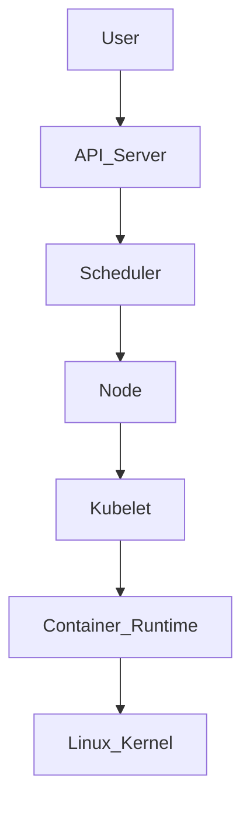
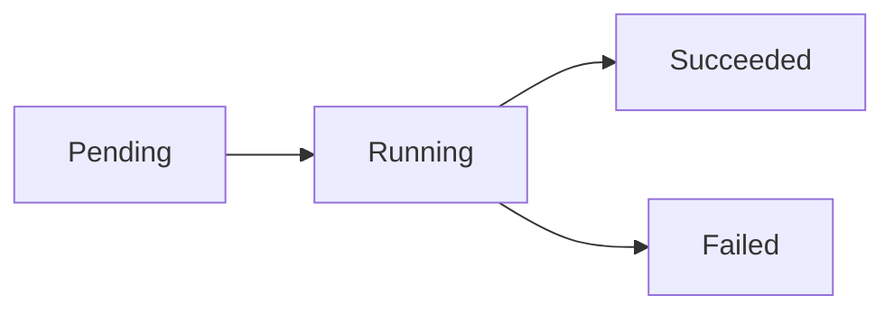
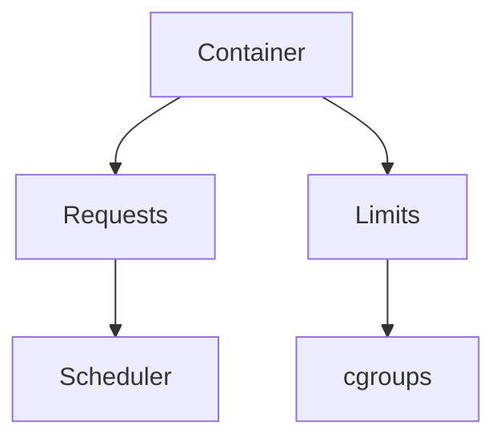
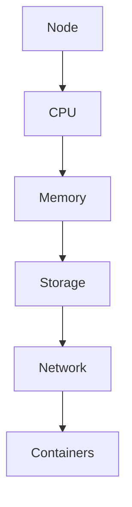
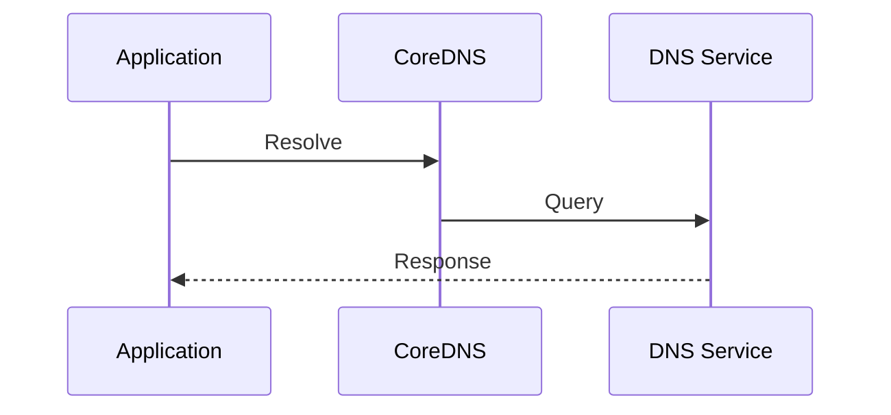
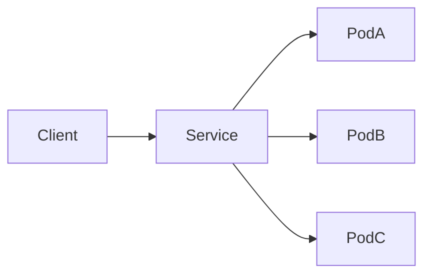
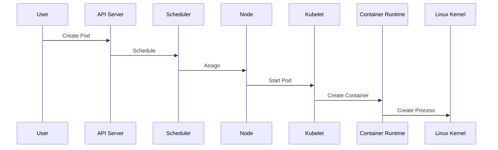

# Linux Kubernetes Node and Pod Debugging

> Advanced Track — Exercise 08

> **Kubernetes does not replace Linux. Kubernetes automates Linux.**
>
> Every Kubernetes problem eventually becomes a Linux problem involving processes, networking, storage, memory, scheduling, or containers.

---

# Why This Exercise Exists

Many engineers learn Kubernetes as:

```bash
kubectl get pods

kubectl logs

kubectl describe
```

But production incidents are rarely solved by commands alone.

Real-world Kubernetes failures involve:

```text
CrashLoopBackOff

OOMKilled

Node Pressure

Network Failures

Storage Failures

Image Pull Errors

DNS Problems

Container Runtime Failures

Scheduler Problems

Control Plane Issues
```

Most engineers troubleshoot symptoms.

Platform engineers investigate root causes.

---

# The Problem This Exercise Solves

Imagine:

```text
Pods Restarting

Users Cannot Access Service

Cluster Appears Healthy

CPU Normal

Memory Normal
```

Yet production is down.

Questions:

```text
Is The Pod Broken?

Is The Node Broken?

Is Networking Broken?

Is Storage Broken?

Is DNS Broken?

Is The Container Runtime Broken?

Is Kubernetes Only Reporting Symptoms?
```

This exercise teaches systematic Kubernetes debugging from first principles.

---

# Mental Model

Think of Kubernetes as:

```text
Kubernetes = Orchestra Conductor

Nodes = Musicians

Containers = Instruments

Linux Kernel = Physics
```

The conductor coordinates.

But sound still depends on:

```text
Musicians

Instruments

Physics
```

Similarly:

```text
Kubernetes Coordinates

Linux Executes
```

---

# First Principles

A Kubernetes Pod is:

```text
One Or More Linux Processes
```

A Kubernetes Node is:

```text
A Linux Server
```

Kubernetes ultimately manages:

```text
Linux Processes

Linux Networking

Linux Storage

Linux Memory

Linux Containers
```

---

# Kubernetes Architecture



---

# Debugging Philosophy

Never begin with:

```text
Restart Everything
```

Begin with:

```text
Gather Evidence
```

---

# Kubernetes Investigation Framework

```mermaid
flowchart TD

Problem

--> Pod

--> Container

--> Node

--> Network

--> Storage

--> Control Plane

--> Root Cause
```

---

# The Most Important Question

Before troubleshooting ask:

```text
What Is Actually Failing?
```

Not:

```text
What Looks Broken?
```

---

# Understanding Pod Lifecycle

Pods transition through states.

```text
Pending

Running

Succeeded

Failed

Unknown
```

---

# Visualization



---

# Exercise 1 — Inspect Pod States

Run:

```bash
kubectl get pods -A
```

Observe:

```text
Running

Pending

CrashLoopBackOff

ImagePullBackOff

OOMKilled
```

---

# Investigation Questions

Which pods are unhealthy?

What patterns exist?

Which nodes host them?

---

# Understanding CrashLoopBackOff

One of the most common Kubernetes incidents.

Meaning:

```text
Container Starts

↓

Container Crashes

↓

Restart

↓

Crash Again
```

---

# Visualization

```text
Start

↓

Crash

↓

Restart

↓

Crash

↓

Restart
```

---

# Exercise 2 — Investigate CrashLoopBackOff

Run:

```bash
kubectl describe pod POD
```

and:

```bash
kubectl logs POD
```

Previous crash:

```bash
kubectl logs POD --previous
```

---

# Questions

Did the application:

```text
Exit?

Crash?

Fail Startup?

Fail Health Check?
```

---

# Understanding OOMKilled

One of the most misunderstood errors.

Many developers think:

```text
Kubernetes Killed My Pod
```

Reality:

```text
Linux Memory Management

↓

cgroups

↓

OOM Logic

↓

Container Terminated
```

---

# Exercise 3 — Investigate OOMKilled Pods

Run:

```bash
kubectl describe pod POD
```

Look for:

```text
OOMKilled
```

Inspect:

```bash
kubectl top pod
```

---

# Questions

Did memory usage exceed limits?

Were limits configured correctly?

Memory leak?

---

# Kubernetes Resource Model



---

# Why Requests Matter

Scheduler uses:

```text
Requests
```

for placement decisions.

---

# Why Limits Matter

Linux cgroups enforce:

```text
Memory

CPU
```

limits.

---

# Exercise 4 — Investigate Resource Configuration

Run:

```bash
kubectl get pod POD -o yaml
```

Find:

```text
resources:
```

Review:

```text
requests

limits
```

---

# Node Investigation

A Kubernetes node is:

```text
A Linux Server
```

Many pod issues originate here.

---

# Exercise 5 — Inspect Nodes

Run:

```bash
kubectl get nodes
```

Detailed information:

```bash
kubectl describe node NODE
```

---

# Questions

Node healthy?

Node pressure?

Disk pressure?

Memory pressure?

---

# Node Conditions

Important conditions:

```text
Ready

MemoryPressure

DiskPressure

PIDPressure

NetworkUnavailable
```

---

# Visualization



Problems in any resource affect pods.

---

# Exercise 6 — Investigate Node Resource Usage

Run:

```bash
kubectl top node
```

Observe:

```text
CPU

Memory
```

---

# Questions

Is node overloaded?

Is capacity exhausted?

---

# Linux Connection

When node memory becomes exhausted:

```text
Linux OOM

↓

Container Death

↓

Pod Restart
```

Kubernetes reports symptoms.

Linux explains causes.

---

# DNS Debugging

Many outages are actually DNS failures.

Symptoms:

```text
Application Cannot Reach Service

Database Connection Fails

API Calls Timeout
```

---

# Exercise 7 — Debug DNS

Create temporary pod:

```bash
kubectl run debug --image=busybox -it --rm
```

Inside:

```bash
nslookup kubernetes.default
```

---

# Questions

DNS resolution working?

CoreDNS healthy?

---

# Kubernetes DNS Flow



---

# Service Debugging

Pods may be healthy.

Service may not be.

---

# Exercise 8 — Investigate Services

Run:

```bash
kubectl get svc
```

Inspect:

```bash
kubectl describe svc SERVICE
```

---

# Questions

Correct selectors?

Correct endpoints?

---

# Service Architecture



---

# Endpoint Investigation

Run:

```bash
kubectl get endpoints
```

---

# Critical Question

Do endpoints exist?

No endpoints often means:

```text
Label Mismatch
```

---

# Exercise 9 — Investigate Labels

Run:

```bash
kubectl get pods --show-labels
```

Compare with:

```bash
kubectl describe svc
```

---

# Kubernetes Networking

Every pod receives:

```text
IP Address

Routing

DNS
```

---

# Common Problems

```text
Network Policies

CNI Failures

Routing Issues

Firewall Rules
```

---

# Exercise 10 — Investigate Pod Networking

Inside pod:

```bash
ip addr

ip route
```

Test connectivity:

```bash
ping

curl
```

---

# Network Architecture

```mermaid
flowchart LR

Pod

--> CNI

--> Node

--> Cluster Network

--> Destination
```

---

# Storage Debugging

Storage failures frequently appear as:

```text
Pending Pods

Application Crashes

Mount Errors
```

---

# Exercise 11 — Investigate PVCs

Run:

```bash
kubectl get pvc
```

Describe:

```bash
kubectl describe pvc PVC
```

---

# Questions

Bound?

Pending?

Storage Class Correct?

---

# Persistent Storage Architecture

```mermaid
flowchart TD

Pod

--> PVC

PVC

--> PV

PV

--> Storage Backend
```

---

# Image Pull Failures

Common state:

```text
ImagePullBackOff
```

---

# Exercise 12 — Investigate Image Pulls

Run:

```bash
kubectl describe pod POD
```

Look for:

```text
ImagePullBackOff

ErrImagePull
```

---

# Common Causes

```text
Wrong Image Name

Missing Registry Access

Network Failure

Authentication Failure
```

---

# Container Runtime Debugging

Kubernetes uses:

```text
containerd

CRI-O
```

to manage containers.

---

# Exercise 13 — Investigate Runtime

On node:

```bash
systemctl status containerd
```

Check:

```bash
journalctl -u containerd
```

---

# Why Runtime Matters

If runtime fails:

```text
Pods Cannot Start
```

even if Kubernetes is healthy.

---

# Kubelet Investigation

Kubelet manages workloads.

---

# Exercise 14 — Investigate Kubelet

Run:

```bash
systemctl status kubelet
```

Logs:

```bash
journalctl -u kubelet
```

---

# Questions

Node registration healthy?

Pod creation successful?

Errors present?

---

# Kubernetes Scheduling

Pods remain:

```text
Pending
```

when scheduler cannot place them.

---

# Exercise 15 — Investigate Pending Pods

Run:

```bash
kubectl describe pod POD
```

Look for:

```text
Insufficient CPU

Insufficient Memory

Node Affinity

Taints
```

---

# Scheduling Flow

```mermaid
flowchart TD

Pod

--> Scheduler

Scheduler

--> Suitable Node

Suitable Node

--> Kubelet

Kubelet

--> Running Pod
```

---

# Production Incident #1

## Alert

```text
CrashLoopBackOff
```

Investigate:

```bash
kubectl logs

kubectl describe
```

Determine:

```text
Application Failure?

Configuration Error?
```

---

# Production Incident #2

## Alert

```text
OOMKilled
```

Investigate:

```bash
kubectl top

resource limits

memory pressure
```

---

# Production Incident #3

## Alert

```text
Service Unreachable
```

Investigate:

```bash
Service

Endpoints

DNS

Network
```

---

# Production Incident #4

## Alert

```text
Pods Pending
```

Investigate:

```bash
Scheduler

Resources

Node Capacity
```

---

# Production Incident #5

## Alert

```text
Node NotReady
```

Investigate:

```bash
kubelet

container runtime

networking
```

---

# Linux Internals Deep Dive

Pod creation flow:



Everything ultimately becomes:

```text
Linux Processes
```

---

# Docker Connection

Containers inside Kubernetes are:

```text
Docker-like Containers
```

using:

```text
Namespaces

cgroups

OverlayFS
```

---

# Observability Investigation

Always gather:

```text
Metrics

Logs

Events

Resource Usage
```

---

# Event Investigation

Run:

```bash
kubectl get events --sort-by=.metadata.creationTimestamp
```

---

# Why Events Matter

Events explain:

```text
What Kubernetes Thinks Happened
```

---

# Common Mistakes

## Mistake 1

Restarting pods immediately.

---

## Mistake 2

Ignoring node health.

---

## Mistake 3

Ignoring DNS.

---

## Mistake 4

Investigating symptoms only.

---

## Mistake 5

Assuming Kubernetes is the root cause.

---

## Mistake 6

Ignoring Linux fundamentals.

---

# Engineering Mindset

Beginners think:

```text
Kubernetes Is Broken
```

Engineers think:

```text
Which Layer Is Broken?

Pod?

Container?

Node?

Network?

Storage?

Linux?
```

---

# Interview Questions

## Advanced

1. What causes CrashLoopBackOff?
2. What causes OOMKilled?
3. How would you investigate a Pending pod?
4. How does Kubernetes networking work?
5. What is a CNI plugin?
6. What is kubelet?
7. How would you debug DNS failures?
8. Why can nodes become NotReady?
9. How do PVCs work?
10. Why does Kubernetes depend on Linux?

---

# Kubernetes Debugging Cheat Sheet

```bash
kubectl get pods -A

kubectl describe pod POD

kubectl logs POD

kubectl logs POD --previous

kubectl top pod

kubectl get nodes

kubectl describe node NODE

kubectl top node

kubectl get svc

kubectl get endpoints

kubectl get pvc

kubectl get events

journalctl -u kubelet

journalctl -u containerd

systemctl status kubelet

systemctl status containerd
```

---

# Capstone Challenge

A production Kubernetes cluster experiences:

```text
CrashLoopBackOff Pods

OOMKilled Containers

Node Memory Pressure

Intermittent DNS Failures

Pending Pods

Customer Complaints
```

Perform a complete investigation.

Document:

```text
Pod Health

Container State

Node Conditions

Scheduler Decisions

DNS Health

Network Connectivity

Storage Status

Resource Limits

Events

Logs

Evidence

Root Cause

Recovery Plan
```

---

# Completion Criteria

You successfully complete this exercise when you can:

✓ Debug Kubernetes systematically

✓ Investigate pod lifecycle issues

✓ Diagnose CrashLoopBackOff and OOMKilled events

✓ Analyze node health

✓ Investigate scheduling failures

✓ Troubleshoot networking and DNS

✓ Investigate storage problems

✓ Debug kubelet and container runtimes

✓ Connect Kubernetes failures to Linux internals

✓ Think like a platform engineer instead of a kubectl operator

Congratulations.

You now understand one of the most important realities of cloud-native infrastructure:

**Kubernetes manages containers, but Linux runs them.**
