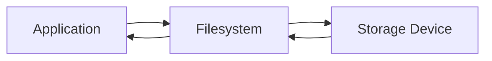

# File Operations Exercises

> Beginner Track — Exercise 02

---

# Why This Exercise Exists

Most people think files are just documents.

Linux engineers know that files are the foundation of everything.

Applications are files.

Configurations are files.

Logs are files.

Processes expose information through files.

Devices appear as files.

Containers are built from files.

Databases ultimately store data in files.

The entire Linux ecosystem revolves around creating, reading, updating, moving, and deleting files.

Understanding file operations is one of the most important foundational skills in Linux engineering.

---

# Problem This Exercise Solves

Many beginners learn commands without understanding consequences.

Examples:

```bash
rm -rf *
```

can destroy an application.

```bash
mv config.yaml backup/
```

can cause a production outage.

```bash
cp database.db database_backup.db
```

might create an inconsistent database backup.

Real engineering requires understanding what happens behind every file operation.

---

# Learning Objectives

After completing this exercise, you should be able to:

✓ Create files safely

✓ Copy files and directories

✓ Move and rename files

✓ Delete files carefully

✓ Inspect file contents

✓ Understand file metadata

✓ Work with production-style directory layouts

✓ Understand how applications interact with files

---

# Mental Model

Think of Linux files as objects in a warehouse.

```text
Warehouse
│
├── Boxes = Files
├── Shelves = Directories
├── Labels = File Names
├── Inventory Data = Metadata
└── Warehouse Map = Filesystem
```

Engineers spend much of their day moving boxes around safely.

The same applies to Linux.

---

# First Principles

A file is simply:

```text
A sequence of bytes stored on persistent storage.
```

Linux does not inherently know:

```text
document.txt
image.jpg
database.db
movie.mp4
```

These names are conventions.

Internally Linux sees:

```text
Bytes
Metadata
Permissions
Ownership
Location
```

Everything else is interpretation.

---

# Visualizing File Operations

```text
Before

project/
├── config.yaml

After Copy

project/
├── config.yaml
└── config-backup.yaml
```

```text
Before

reports/
└── report.txt

After Move

archive/
└── report.txt
```

---

# Lab Setup

Create a fresh environment.

```bash
mkdir -p ~/file-lab
cd ~/file-lab
```

Create directories:

```bash
mkdir documents
mkdir backups
mkdir projects
mkdir logs
```

Create files:

```bash
touch documents/notes.txt
touch documents/todo.txt
touch projects/app.py
touch projects/config.yaml
touch logs/app.log
```

Verify:

```bash
tree .
```

---

# Exercise 1 — Creating Files

## Objective

Understand file creation.

Create files using:

```bash
touch test.txt
touch report.txt
touch inventory.txt
```

Verify:

```bash
ls
```

Questions:

1. Did the file contain data?
2. What changed in the filesystem?

---

# Linux Internals

When you create a file:

```bash
touch example.txt
```

Linux creates:

```text
Directory Entry
Metadata
Inode
```

The file may initially contain:

```text
0 bytes
```

but filesystem structures already exist.

---

# Exercise 2 — Writing Data

Write content:

```bash
echo "Hello Linux" > notes.txt
```

Display:

```bash
cat notes.txt
```

Append content:

```bash
echo "Second Line" >> notes.txt
```

Display again:

```bash
cat notes.txt
```

Observe:

```text
>
overwrites

>>
appends
```

---

# Exercise 3 — Copy Files

Create:

```bash
cp notes.txt notes-backup.txt
```

Verify:

```bash
ls
```

Inspect:

```bash
cat notes-backup.txt
```

Questions:

1. Is this the same file?
2. Does changing one affect the other?

---

# Visual

```text
Original
│
└── notes.txt

Copy
│
└── notes-backup.txt
```

Two independent files.

---

# Exercise 4 — Copy Directories

Create:

```bash
mkdir projectA
touch projectA/app.py
touch projectA/config.yaml
```

Copy recursively:

```bash
cp -r projectA projectA-backup
```

Verify:

```bash
tree .
```

---

# Why Recursive Copy Exists

Directories contain files.

Filesystems are trees.

Linux must copy the entire subtree.

```text
projectA
│
├── app.py
└── config.yaml
```

becomes

```text
projectA-backup
│
├── app.py
└── config.yaml
```

---

# Exercise 5 — Move Files

Create:

```bash
touch move-me.txt
```

Move:

```bash
mv move-me.txt documents/
```

Verify:

```bash
ls
ls documents
```

---

# Exercise 6 — Rename Files

Rename:

```bash
mv documents/todo.txt documents/tasks.txt
```

Verify:

```bash
ls documents
```

---

# Linux Internals

A rename operation often does not move file data.

Linux may simply update directory entries.

This makes renaming extremely fast.

---

# Exercise 7 — Delete Files

Create:

```bash
touch delete-me.txt
```

Delete:

```bash
rm delete-me.txt
```

Verify:

```bash
ls
```

---

# Critical Engineering Lesson

Deleting a file usually removes references.

Linux may not immediately erase every byte.

The filesystem marks space as reusable.

---

# Exercise 8 — Delete Directories

Create:

```bash
mkdir tempdir
```

Remove:

```bash
rmdir tempdir
```

Now create:

```bash
mkdir testdir
touch testdir/file.txt
```

Try:

```bash
rmdir testdir
```

Observe failure.

Remove recursively:

```bash
rm -r testdir
```

---

# Why Linux Protects You

```bash
rmdir
```

only removes empty directories.

This reduces accidental data loss.

---

# Exercise 9 — Inspect File Metadata

Run:

```bash
ls -l
```

Observe:

```text
Permissions
Owner
Group
Size
Date
Filename
```

Example:

```text
-rw-r--r-- 1 user user 120 Jul 1 notes.txt
```

Questions:

1. What is file size?
2. Who owns the file?
3. When was it modified?

---

# Exercise 10 — Inspect File Type

Create:

```bash
touch sample.txt
```

Check:

```bash
file sample.txt
```

Check:

```bash
file /bin/bash
```

Observe differences.

---

# Production Scenario

An application fails to start.

Error:

```text
config.yaml not found
```

Directory:

```text
project/
├── config.yaml
├── config-prod.yaml
└── config-backup.yaml
```

Tasks:

1. Identify correct configuration.
2. Create backup.
3. Rename backup.
4. Restore configuration.

Commands:

```bash
cp
mv
ls
cat
```

---

# Data Flow Visualization



Applications never access disks directly.

They interact through the filesystem layer.

---

# Docker Connection

Docker images are collections of files.

```text
Docker Image
│
├── Application Files
├── Libraries
├── Configurations
└── Runtime Files
```

Building an image:

```dockerfile
COPY app.py /app/
```

uses the same file-copy concepts.

---

# Kubernetes Connection

ConfigMaps:

```yaml
volumeMounts:
  - mountPath: /etc/config
```

Applications read configuration files exactly like normal Linux files.

Understanding file operations makes Kubernetes debugging much easier.

---

# Database Connection

Databases ultimately write data to files.

Examples:

```text
PostgreSQL
MySQL
SQLite
MongoDB
```

If engineers misunderstand:

```text
Copy
Move
Delete
Permissions
```

they risk database corruption.

---

# Performance Considerations

## Large File Copies

Copying:

```text
10 KB file
```

is trivial.

Copying:

```text
100 GB backup
```

consumes:

* Disk I/O
* CPU
* Cache
* Time

Engineers must understand operation costs.

---

# Security Considerations

Accidental deletion:

```bash
rm -rf
```

is one of the most dangerous commands.

Always verify:

```bash
pwd
ls
```

before deletion.

---

# Troubleshooting Challenge 1

Given:

```text
project/
├── app.py
├── app.py.bak
├── app.py.old
```

Identify:

1. Original file
2. Backup files

Create:

```text
app.py.backup
```

without modifying original content.

---

# Troubleshooting Challenge 2

A file was moved accidentally.

Search for:

```text
config.yaml
```

inside:

```bash
~/file-lab
```

Use:

```bash
find
```

---

# Troubleshooting Challenge 3

Directory:

```text
logs/
├── app.log
├── access.log
├── error.log
```

Create backup directory and copy all logs into it.

---

# Common Mistakes

## Mistake 1

Confusing Copy and Move

```bash
cp file backup/
```

creates duplicate.

```bash
mv file backup/
```

removes original location.

---

## Mistake 2

Deleting Before Backing Up

Bad:

```bash
rm config.yaml
```

Better:

```bash
cp config.yaml config.yaml.bak
```

---

## Mistake 3

Using Wildcards Carelessly

Dangerous:

```bash
rm *
```

Always inspect first:

```bash
ls
```

---

## Mistake 4

Editing Wrong File

Verify path:

```bash
pwd
```

before making changes.

---

# Engineering Mindset

Beginners think:

```text
How do I copy a file?
```

Engineers think:

```text
What system depends on this file?

What happens if I move it?

Do I need a backup?

Can this impact production?
```

This mindset prevents outages.

---

# Real-World Engineering Tasks

Daily activities:

```text
Backup configurations

Restore files

Archive logs

Rotate logs

Deploy applications

Copy build artifacts

Move releases

Manage database dumps
```

Every one relies on file operations.

---

# Interview Questions

## Beginner

1. Difference between cp and mv?
2. What does rm do?
3. What is a directory?
4. What does touch do?

## Intermediate

5. Why use cp -r?
6. What information does ls -l show?
7. Why is rm -rf dangerous?

## Advanced

8. What happens internally when a file is renamed?
9. Why can deleting files be recoverable?
10. How do containers rely on filesystem operations?

---

# Cheat Sheet

```bash
touch file.txt

echo "hello" > file.txt

cat file.txt

cp file.txt backup.txt

cp -r dir1 dir2

mv old.txt new.txt

mv file.txt directory/

rm file.txt

rm -r directory/

rmdir emptydir

ls -l

file filename

find . -name "*.txt"
```

---

# Completion Criteria

You successfully complete this exercise when you can:

✓ Create files

✓ Write data

✓ Copy files and directories

✓ Move files safely

✓ Rename files

✓ Delete files responsibly

✓ Inspect metadata

✓ Understand production implications

Congratulations.

You now understand the fundamental file operations that power Linux systems, applications, containers, databases, and cloud infrastructure.
