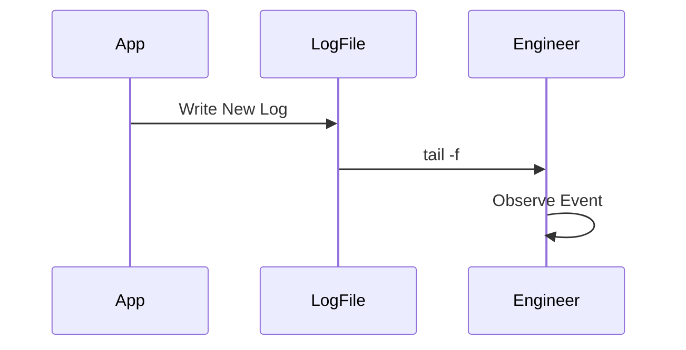
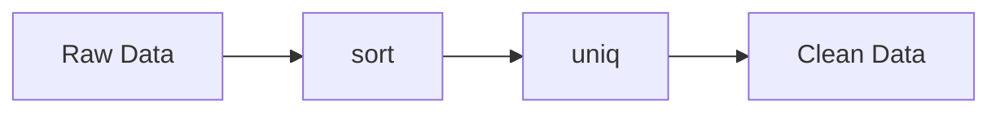
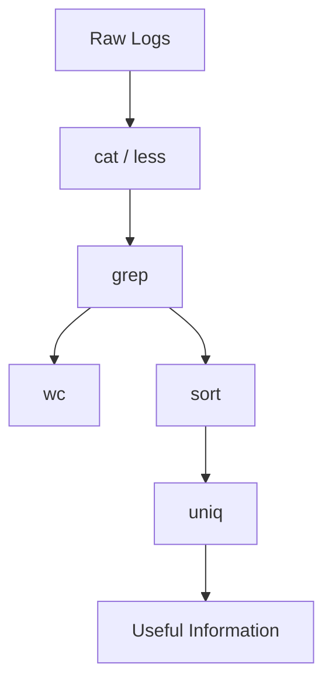

# Viewing, Searching, and Processing Text Exercises

> Beginner Track — Exercise 03

> **The most important Linux skill after filesystem navigation.**

---

# Why This Exercise Exists

Most people think Linux is an operating system.

Experienced engineers know Linux is fundamentally an information-processing system.

Servers generate logs.

Applications generate logs.

Databases generate logs.

Containers generate logs.

Kubernetes generates logs.

Security systems generate logs.

Monitoring systems generate logs.

The engineer who can extract information from text can solve problems.

The engineer who cannot is blind.

This exercise teaches one of the most valuable skills in Linux engineering:

**Turning raw text into useful information.**

---

# The Problem This Exercise Solves

Imagine you are on call at 2:30 AM.

A production service is down.

You connect to a Linux server.

You see:

```text
application.log
```

Size:

```text
18 GB
```

Questions immediately arise:

* What failed?
* When did it fail?
* Which user triggered it?
* Is the database failing?
* Is memory exhausted?
* Is disk full?
* Is traffic spiking?

Nobody manually reads 18 GB.

Linux engineers use text-processing tools.

These tools are the foundation of:

* DevOps
* SRE
* Security Engineering
* Platform Engineering
* Cloud Engineering
* Production Operations

---

# Mental Model

Think of Linux text processing as operating a giant microscope.

Raw data:

```text
Millions of lines
```

Engineer's job:

```text
Find the useful signal
Inside the noise
```

Visualization:

```text
Logs
│
├── Millions of lines
│
└── Linux Tools
     │
     ├── cat
     ├── less
     ├── head
     ├── tail
     ├── grep
     ├── wc
     ├── sort
     └── uniq
            │
            ▼
      Useful Information
```

---

# First Principles

Every modern system produces text.

Examples:

```text
Application Logs
Database Logs
System Logs
Security Logs
Access Logs
Audit Logs
Kubernetes Logs
Container Logs
```

Almost every production investigation starts with:

```text
Read text
Search text
Filter text
Count text
Analyze text
```

These exercises teach exactly that.

---

# Linux Internals

Linux follows a powerful philosophy:

> Everything should be represented as text whenever possible.

Examples:

```bash
/proc/cpuinfo
/proc/meminfo
/etc/passwd
/etc/hosts
/var/log/*
```

Many Linux subsystems expose information through plain text.

This makes automation simple.

---

# Architecture Overview


Production systems are often debugged through this exact flow.

---

# Lab Setup

Create a dedicated practice environment.

```bash
mkdir -p ~/text-lab
cd ~/text-lab
```

Create sample log file:

```bash
cat > application.log << EOF
INFO User login successful
INFO Product viewed
ERROR Database connection failed
INFO Product added to cart
WARNING High memory usage
ERROR Authentication failed
INFO Payment completed
ERROR Database timeout
INFO User logout
WARNING Disk usage high
EOF
```

Verify:

```bash
cat application.log
```

---

# Exercise 1 — Reading Files with cat

## Objective

Display file contents.

Run:

```bash
cat application.log
```

Observe:

```text
Entire file displayed at once
```

---

# Mental Model

`cat` is like dumping an entire book onto your desk.

Good for:

```text
Small Files
Configuration Files
Quick Inspection
```

Bad for:

```text
Huge Log Files
Large Datasets
```

---

# Production Example

View:

```bash
cat /etc/hosts
```

View:

```bash
cat /etc/passwd
```

These are common troubleshooting tasks.

---

# Exercise 2 — Reading Large Files with less

Run:

```bash
less application.log
```

Navigation:

```text
Up Arrow
Down Arrow
Page Up
Page Down
q = Quit
```

---

# Why less Exists

Imagine opening:

```text
20 GB log file
```

Using:

```bash
cat huge.log
```

Bad idea.

Instead:

```bash
less huge.log
```

loads efficiently.

---

# Engineering Insight

Experienced engineers often use:

```bash
less
```

before using:

```bash
grep
```

to understand file structure.

---

# Exercise 3 — View Beginning of File

Run:

```bash
head application.log
```

View first 5 lines:

```bash
head -5 application.log
```

---

# Production Use Case

Check startup logs:

```bash
head app.log
```

Understand how a service started.

---

# Exercise 4 — View End of File

Run:

```bash
tail application.log
```

View last 3 lines:

```bash
tail -3 application.log
```

---

# Why This Matters

Most failures happen recently.

Engineers often care about:

```text
Latest Events
```

not

```text
Events From Last Month
```

---

# Exercise 5 — Real-Time Monitoring

Open terminal:

```bash
tail -f application.log
```

Open second terminal:

```bash
echo "ERROR Payment failed" >> application.log
```

Watch live updates.

---

# Production Scenario

Monitor:

```bash
tail -f /var/log/nginx/access.log
```

Monitor:

```bash
tail -f /var/log/syslog
```

This is one of the most common troubleshooting techniques.

---

# Data Flow Visualization



---

# Exercise 6 — Searching with grep

Search errors:

```bash
grep ERROR application.log
```

Expected:

```text
ERROR Database connection failed
ERROR Authentication failed
ERROR Database timeout
```

---

# Mental Model

Think of grep as a filter.

```text
Input
│
├── 100000 lines
│
└── grep ERROR
          │
          ▼
      50 lines
```

---

# Exercise 7 — Search Warnings

Run:

```bash
grep WARNING application.log
```

---

# Exercise 8 — Case-Insensitive Search

Create:

```bash
echo "error Payment gateway failed" >> application.log
```

Search:

```bash
grep -i error application.log
```

Observe:

```text
ERROR
error
Error
```

all match.

---

# Exercise 9 — Count Matching Lines

Count errors:

```bash
grep ERROR application.log | wc -l
```

Questions:

1. How many errors exist?
2. How many warnings exist?

Try:

```bash
grep WARNING application.log | wc -l
```

---

# Why Engineers Count

Production question:

```text
How many failures occurred?
```

Linux answers through counting.

---

# Exercise 10 — Count Everything

Run:

```bash
wc application.log
```

Observe:

```text
Lines
Words
Characters
```

Run:

```bash
wc -l application.log
```

Count lines only.

---

# Exercise 11 — Sorting Data

Create:

```bash
cat > users.txt << EOF
charlie
alice
bob
alice
charlie
bob
alice
EOF
```

Sort:

```bash
sort users.txt
```

---

# Why Sorting Matters

Many Linux tools expect sorted data.

Sorting enables:

```text
Aggregation
Deduplication
Analysis
```

---

# Exercise 12 — Remove Duplicates

Run:

```bash
sort users.txt | uniq
```

Expected:

```text
alice
bob
charlie
```

---

# Linux Data Pipeline



---

# Exercise 13 — Count Occurrences

Run:

```bash
sort users.txt | uniq -c
```

Output:

```text
3 alice
2 bob
2 charlie
```

---

# Production Example

Count IP addresses:

```bash
sort access.log | uniq -c
```

Find top users:

```bash
sort users.log | uniq -c
```

---

# Exercise 14 — Combine Multiple Tools

Count errors:

```bash
grep ERROR application.log | wc -l
```

Count warnings:

```bash
grep WARNING application.log | wc -l
```

Count all informational messages:

```bash
grep INFO application.log | wc -l
```

---

# Engineering Insight

Linux becomes powerful when tools are combined.

```text
Tool 1
  ↓
Tool 2
  ↓
Tool 3
  ↓
Result
```

This philosophy powers modern automation.

---

# Real Production Scenario #1

Application outage.

Logs:

```text
INFO Startup Complete
INFO Connected Database
ERROR Connection Lost
ERROR Connection Lost
ERROR Connection Lost
ERROR Connection Lost
```

Tasks:

1. Count failures.
2. Find latest failure.
3. Display only error lines.

Commands:

```bash
grep
tail
wc
```

---

# Real Production Scenario #2

Disk issue.

Logs:

```text
INFO Service Started
WARNING Disk Usage 80%
WARNING Disk Usage 90%
WARNING Disk Usage 95%
ERROR Disk Full
```

Questions:

1. When did warnings start?
2. How many warnings occurred?
3. What was final failure?

---

# Real Production Scenario #3

Security Investigation

Log sample:

```text
INFO Login user1
INFO Login user2
INFO Login user1
INFO Login user3
INFO Login user1
```

Questions:

1. Who logged in most frequently?
2. How many unique users exist?

Hint:

```bash
sort
uniq -c
```

---

# Docker Connection

View container logs:

```bash
docker logs container_id
```

Common patterns:

```bash
docker logs container_id | grep ERROR
```

```bash
docker logs container_id | tail
```

```bash
docker logs container_id | wc -l
```

The same Linux skills apply.

---

# Kubernetes Connection

View pod logs:

```bash
kubectl logs pod-name
```

Search failures:

```bash
kubectl logs pod-name | grep ERROR
```

Count requests:

```bash
kubectl logs pod-name | wc -l
```

Linux text-processing knowledge transfers directly.

---

# Cloud Engineering Connection

Engineers analyze:

```text
AWS Logs
Azure Logs
GCP Logs
Load Balancer Logs
CDN Logs
```

Most cloud troubleshooting still relies on text filtering concepts.

---

# Performance Considerations

Reading:

```text
10 KB file
```

is trivial.

Reading:

```text
50 GB log
```

requires efficient tools.

Prefer:

```bash
tail
grep
less
```

instead of loading entire files.

---

# Security Considerations

Logs may contain:

```text
Passwords
Tokens
Secrets
API Keys
User Data
```

Engineers must be careful when:

```bash
cat
grep
sharing logs
```

Never expose sensitive information.

---

# Troubleshooting Challenge 1

Create:

```text
INFO Login
ERROR Database Failure
INFO Logout
ERROR Timeout
WARNING CPU High
```

Tasks:

1. Show only errors.
2. Count errors.
3. Show latest entry.

---

# Troubleshooting Challenge 2

Create file:

```text
alice
bob
alice
alice
charlie
bob
```

Find:

1. Unique users.
2. Number of occurrences.

---

# Troubleshooting Challenge 3

Simulate live logs:

Terminal 1:

```bash
tail -f app.log
```

Terminal 2:

```bash
echo "ERROR Service Crash" >> app.log
```

Observe real-time monitoring.

---

# Common Mistakes

## Mistake 1

Using cat on huge files.

Bad:

```bash
cat 20GB.log
```

Better:

```bash
less 20GB.log
```

---

## Mistake 2

Ignoring Case Sensitivity

Bad:

```bash
grep error app.log
```

May miss:

```text
ERROR
```

Use:

```bash
grep -i error app.log
```

---

## Mistake 3

Manually Counting

Bad:

```text
Reading thousands of lines manually
```

Better:

```bash
wc -l
```

---

## Mistake 4

Ignoring Pipelines

Beginners use:

```bash
grep ERROR file
```

Engineers use:

```bash
grep ERROR file | wc -l
```

Combining tools is where Linux becomes powerful.

---

# Engineering Mindset

Beginners read logs.

Engineers interrogate logs.

Ask:

```text
What happened?

When did it happen?

How often?

Who triggered it?

What changed?

What pattern exists?
```

The goal is not reading.

The goal is extracting information.

---

# Interview Questions

## Beginner

1. What does cat do?
2. What does less do?
3. Difference between head and tail?
4. What does grep do?

---

## Intermediate

5. Why use tail -f?
6. How do you count matching lines?
7. How does grep help in troubleshooting?
8. What is the purpose of wc?

---

## Advanced

9. Why are Unix pipelines powerful?
10. How would you analyze a 50 GB log file?
11. Why does Linux favor text-based tooling?
12. How do Kubernetes and Docker logs rely on these concepts?

---

# Visual Summary



---

# Cheat Sheet

```bash
cat file.txt

less file.txt

head file.txt

head -10 file.txt

tail file.txt

tail -f app.log

grep ERROR app.log

grep -i error app.log

wc file.txt

wc -l file.txt

sort users.txt

sort users.txt | uniq

sort users.txt | uniq -c

grep ERROR app.log | wc -l
```

---

# Completion Criteria

You successfully complete this exercise when you can:

✓ Read files efficiently

✓ Navigate large logs safely

✓ Search text using grep

✓ Count occurrences

✓ Sort and deduplicate data

✓ Monitor logs in real time

✓ Analyze production-style log data

✓ Combine Linux tools into useful pipelines

Congratulations.

You have learned the foundation of Linux observability, troubleshooting, DevOps operations, SRE workflows, security investigations, cloud diagnostics, Docker debugging, and Kubernetes log analysis.

This skill alone will be used thousands of times throughout your engineering career.
