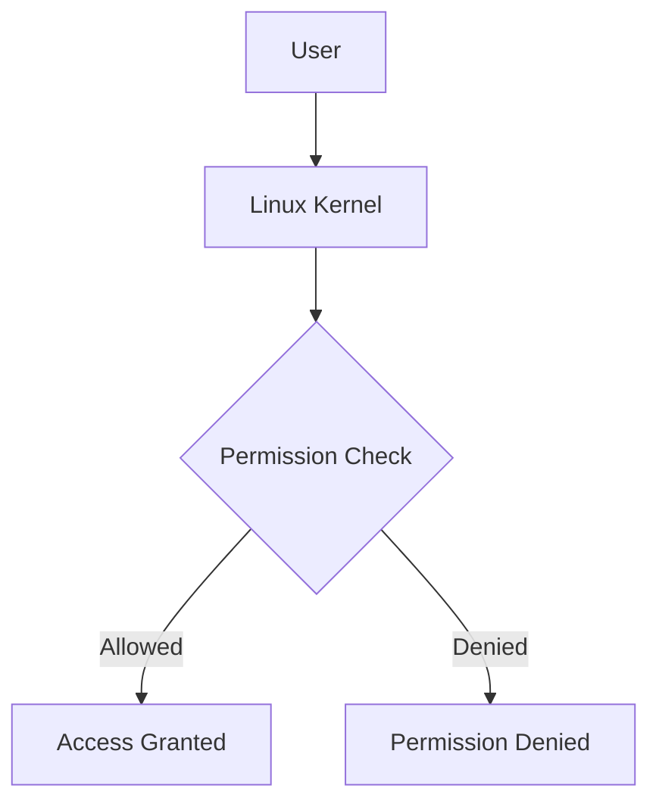
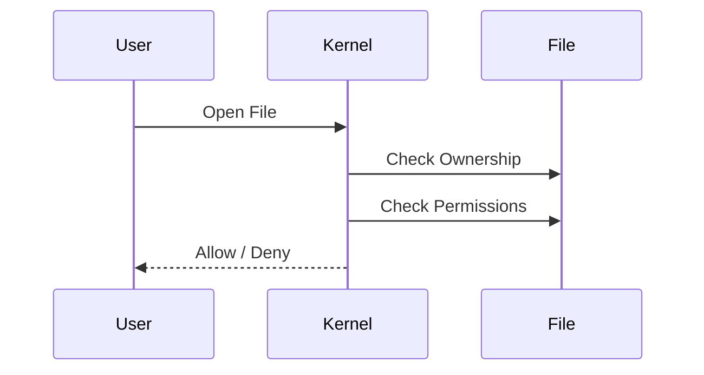
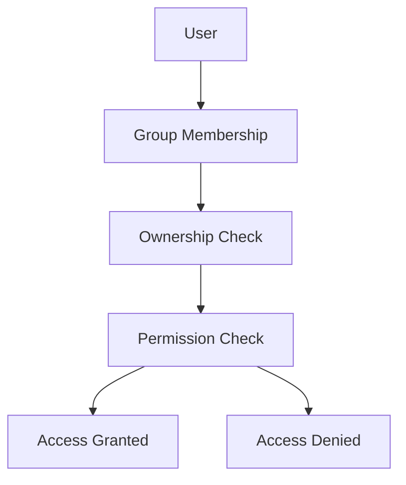

# Users, Groups, and Permissions Exercises

> Beginner Track — Exercise 04

> **The foundation of Linux security, multi-user systems, and production infrastructure.**

---

# Why This Exercise Exists

Most beginners think Linux is a computer they personally use.

Linux engineers know Linux was designed from the beginning as a **multi-user operating system**.

A production Linux server may simultaneously run:

* Developers
* Administrators
* Applications
* Databases
* Monitoring agents
* Backup systems
* Containers
* Automated services

All of them need access to resources.

But not unlimited access.

Without permissions:

```text
Any user could modify anything.
Any process could read secrets.
Any application could destroy data.
Any mistake could destroy the entire server.
```

Permissions exist because systems must survive both mistakes and attacks.

Understanding users, groups, and permissions is one of the most important security concepts in Linux engineering.

---

# Problem This Exercise Solves

Imagine a production server:

```text
E-Commerce Platform

├── Application Service
├── Database Service
├── Monitoring Agent
├── Backup Service
└── Administrators
```

Question:

Should the backup service be able to:

```text
Delete database files?
Modify application code?
Read customer passwords?
```

Of course not.

Linux solves this through:

```text
Users
Groups
Permissions
Ownership
Privilege Separation
```

This exercise teaches the foundation of Linux security.

---

# Learning Objectives

After completing this exercise, you should be able to:

✓ Understand Linux user identities

✓ Understand groups

✓ Inspect permissions

✓ Change permissions

✓ Change ownership

✓ Understand sudo

✓ Understand privilege separation

✓ Debug permission errors

✓ Understand production security principles

---

# Mental Model

Think of Linux like a secure office building.

```text
Office Building
│
├── Employees = Users
├── Teams = Groups
├── Rooms = Files
├── Keys = Permissions
└── Security Rules = Access Control
```

Not everyone should enter every room.

Examples:

```text
HR Room
Finance Room
CEO Office
Server Room
```

Similarly:

```text
/etc/shadow
/root
/var/lib/postgresql
```

must be protected.

Linux permissions enforce these boundaries.

---

# First Principles

Every operation in Linux happens under an identity.

Examples:

```text
Reading a file
Deleting a file
Running a process
Opening a network socket
Writing a log
```

Linux asks:

```text
Who is requesting this action?
```

The answer determines whether the action is allowed.

---

# Security Philosophy

Linux assumes:

```text
Trust nobody completely.
```

Instead:

```text
Give only necessary permissions.
```

This is called:

```text
Principle of Least Privilege
```

One of the most important concepts in security engineering.

---

# Architecture Overview



Every file operation passes through this process.

---

# Linux Security Layers

```text
User
  ↓
Group
  ↓
Ownership
  ↓
Permissions
  ↓
Kernel Validation
  ↓
Resource Access
```

---

# Lab Setup

Create practice environment.

```bash
mkdir -p ~/permissions-lab
cd ~/permissions-lab
```

Create files:

```bash
touch notes.txt
touch secrets.txt
touch app.log
```

Create directories:

```bash
mkdir shared
mkdir private
```

---

# Exercise 1 — Identify Yourself

Display current user:

```bash
whoami
```

Display identity information:

```bash
id
```

Example output:

```text
uid=1000(vip)
gid=1000(vip)
groups=1000(vip),27(sudo)
```

---

# Understanding the Output

```text
UID = User ID
GID = Group ID
Groups = Memberships
```

Linux internally uses numbers.

Names are human-friendly labels.

Example:

```text
UID 1000
```

is more important than:

```text
vip
```

because the kernel works primarily with IDs.

---

# Exercise 2 — Discover Existing Users

Inspect:

```bash
cat /etc/passwd
```

Observe entries:

```text
root:x:0:0:root:/root:/bin/bash
```

---

# Mental Model

Think of:

```text
/etc/passwd
```

as Linux's user directory.

Contains:

```text
Username
UID
GID
Home Directory
Default Shell
```

---

# Exercise 3 — Discover Groups

Inspect:

```bash
cat /etc/group
```

Observe:

```text
sudo
adm
users
docker
```

Groups simplify permission management.

---

# Why Groups Exist

Without groups:

```text
100 users
100 separate permission assignments
```

With groups:

```text
100 users
1 group
1 permission assignment
```

Much easier.

---

# Exercise 4 — View Permissions

Run:

```bash
ls -l
```

Example:

```text
-rw-r--r-- 1 user user 0 Jul 1 notes.txt
```

---

# Decoding Permissions

```text
-rw-r--r--
```

Breakdown:

```text
-
rw-
r--
r--
```

Meaning:

```text
File Type

Owner
Group
Others
```

---

# Permission Visualization

```text
-rw-r--r--

Owner  = rw-
Group  = r--
Others = r--
```

---

# Exercise 5 — Understanding Permission Bits

Permission symbols:

```text
r = Read
w = Write
x = Execute
```

Visualization:

```text
rwx = Full Control

rw- = Read + Write

r-- = Read Only

--- = No Access
```

---

# Exercise 6 — Change Permissions

Make file read-only:

```bash
chmod 444 notes.txt
```

Check:

```bash
ls -l notes.txt
```

Try editing file.

Observe failure.

Restore:

```bash
chmod 644 notes.txt
```

---

# Linux Internals

Permission values:

```text
Read    = 4
Write   = 2
Execute = 1
```

Examples:

```text
7 = rwx

6 = rw-

5 = r-x

4 = r--

0 = ---
```

---

# Visualizing chmod Numbers

```text
4 + 2 + 1 = 7

r w x

Full Access
```

---

# Exercise 7 — Make Script Executable

Create script:

```bash
echo 'echo Hello Linux' > hello.sh
```

Try:

```bash
./hello.sh
```

Observe:

```text
Permission denied
```

Grant execute permission:

```bash
chmod +x hello.sh
```

Run:

```bash
./hello.sh
```

Success.

---

# Why Execute Permission Exists

Linux separates:

```text
Read File
```

from:

```text
Execute File
```

This improves security.

---

# Exercise 8 — Change Ownership

View ownership:

```bash
ls -l
```

Change owner:

```bash
sudo chown user:user notes.txt
```

Replace:

```text
user
```

with your username.

---

# Mental Model

Ownership answers:

```text
Who controls this file?
```

Permissions answer:

```text
What can others do?
```

---

# Exercise 9 — Explore Root

Check:

```bash
sudo ls /root
```

Now try:

```bash
ls /root
```

Observe difference.

---

# Why Root Exists

Root is the Linux superuser.

```text
UID = 0
```

Root can:

```text
Modify any file
Create users
Delete system files
Install software
Manage networking
```

Root is powerful and dangerous.

---

# Exercise 10 — Use sudo

Check:

```bash
sudo whoami
```

Expected:

```text
root
```

---

# Production Reality

Most administrators should:

```text
Use sudo briefly
```

rather than:

```text
Log in as root permanently
```

This improves accountability.

---

# Data Flow During Permission Check



---

# Exercise 11 — Shared Team Directory

Create:

```bash
mkdir team-data
```

Grant:

```bash
chmod 775 team-data
```

Inspect:

```bash
ls -ld team-data
```

---

# Production Scenario

Development Team:

```text
Backend Engineers
Frontend Engineers
DevOps Engineers
```

Need shared access.

Groups solve this efficiently.

---

# Exercise 12 — Secure Sensitive Data

Create:

```bash
touch passwords.txt
```

Restrict access:

```bash
chmod 600 passwords.txt
```

Inspect:

```bash
ls -l passwords.txt
```

Meaning:

```text
Only owner can read/write.
```

---

# Production Example

Common permissions:

```text
SSH Private Key

600
```

Example:

```bash
~/.ssh/id_rsa
```

Too-open permissions are rejected for security reasons.

---

# Exercise 13 — Inspect System Files

Check:

```bash
ls -l /etc/passwd
```

Check:

```bash
ls -l /etc/shadow
```

Observe differences.

Question:

Why is shadow more restricted?

---

# Security Thinking

```text
passwd
```

contains user information.

```text
shadow
```

contains password hashes.

Different sensitivity.

Different permissions.

---

# Docker Connection

Containers use Linux users.

Example:

```dockerfile
USER appuser
```

Instead of:

```dockerfile
USER root
```

Why?

Security.

Compromised containers should have minimal privileges.

---

# Kubernetes Connection

Kubernetes supports:

```yaml
securityContext:
  runAsUser: 1000
```

This relies on Linux user concepts.

Understanding Linux permissions directly improves Kubernetes security.

---

# Cloud Engineering Connection

Cloud servers rely heavily on:

```text
IAM
Linux Users
SSH Access
sudo Policies
Service Accounts
```

Many cloud security incidents result from excessive privileges.

---

# Real Production Scenario #1

Application fails:

```text
Permission denied
```

Directory:

```text
/var/www/uploads
```

Tasks:

1. Check ownership.
2. Check permissions.
3. Determine why writes fail.

Commands:

```bash
ls -ld
id
chmod
chown
```

---

# Real Production Scenario #2

Database Backup Fails

Error:

```text
Cannot write backup file
```

Questions:

```text
Who owns directory?
Who owns process?
Who has write permission?
```

---

# Real Production Scenario #3

SSH Login Problem

Error:

```text
Permission denied (publickey)
```

Check:

```bash
ls -l ~/.ssh
```

Often caused by incorrect permissions.

---

# Troubleshooting Challenge 1

Create:

```bash
touch report.txt
```

Make:

```text
Owner = Read/Write

Group = Read

Others = No Access
```

What chmod value should be used?

---

# Troubleshooting Challenge 2

Create:

```bash
touch script.sh
```

Grant execute permissions to everyone.

Verify.

---

# Troubleshooting Challenge 3

Directory:

```text
finance-data
```

Requirements:

```text
Owner = Full Access
Group = Full Access
Others = No Access
```

Choose correct permission value.

---

# Common Mistakes

## Mistake 1

Using 777 Everywhere

Bad:

```bash
chmod 777 file.txt
```

This means:

```text
Everyone can do everything.
```

Huge security risk.

---

## Mistake 2

Running Everything as Root

Bad:

```bash
sudo su
```

for daily work.

Principle:

```text
Use least privilege.
```

---

## Mistake 3

Ignoring Ownership

Many engineers check:

```bash
chmod
```

but forget:

```bash
chown
```

Ownership often causes permission problems.

---

## Mistake 4

Giving Write Access Unnecessarily

More permissions:

```text
More Risk
```

Always ask:

```text
Does this user truly need write access?
```

---

# Engineering Mindset

Beginners ask:

```text
How do I make this work?
```

Engineers ask:

```text
How do I make this work securely?
```

Security is not an extra feature.

Security is part of correct engineering.

---

# Security Mindset

Every permission should answer:

```text
Who needs access?

Why?

For how long?

What is the minimum required privilege?
```

---

# Interview Questions

## Beginner

1. What is a user?
2. What is a group?
3. What does chmod do?
4. What does chown do?
5. What does sudo do?

---

## Intermediate

6. Explain rwx permissions.
7. What does chmod 755 mean?
8. Difference between ownership and permissions?
9. Why do groups exist?

---

## Advanced

10. What happens inside the kernel during permission checks?
11. Why is least privilege important?
12. Why should containers avoid running as root?
13. How does Kubernetes securityContext relate to Linux permissions?
14. Why is chmod 777 dangerous?

---

# Visual Summary



---

# Permission Cheat Sheet

```text
777 = rwx rwx rwx

755 = rwx r-x r-x

750 = rwx r-x ---

700 = rwx --- ---

644 = rw- r-- r--

640 = rw- r-- ---

600 = rw- --- ---
```

---

# Command Cheat Sheet

```bash
whoami

id

cat /etc/passwd

cat /etc/group

ls -l

chmod 644 file.txt

chmod +x script.sh

chown user:user file.txt

sudo whoami

ls -ld directory

chmod 755 directory

chmod 600 secret.txt
```

---

# Completion Criteria

You successfully complete this exercise when you can:

✓ Explain users and groups

✓ Read Linux permissions

✓ Use chmod confidently

✓ Use chown confidently

✓ Understand ownership

✓ Understand sudo

✓ Apply least privilege

✓ Troubleshoot permission errors

✓ Connect Linux permissions to Docker, Kubernetes, cloud security, and production systems

Congratulations.

You now understand one of the most important security foundations in Linux engineering. Almost every production system, container platform, cloud environment, and enterprise infrastructure relies on these concepts every day.
