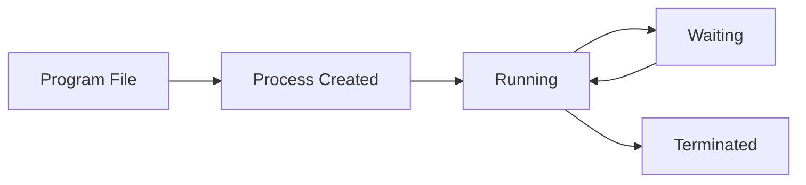
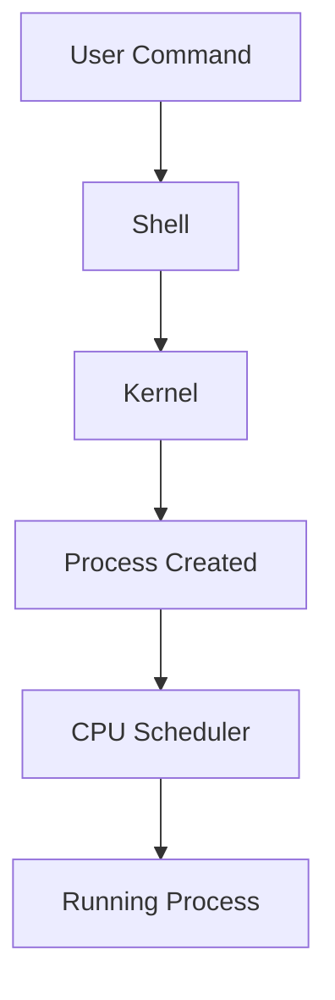
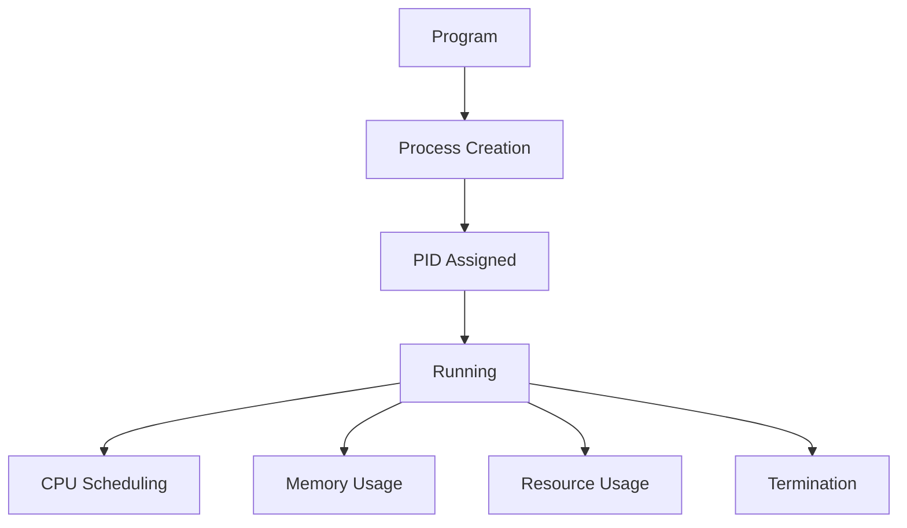

# Process Management Exercises

> Beginner Track — Exercise 05

> **Understanding how Linux turns code into running systems.**

---

# Why This Exercise Exists

Most beginners think a program and a process are the same thing.

They are not.

A program is a file.

A process is a running instance of that file.

For example:

```text
/usr/bin/nginx
```

is a program.

When Linux executes it:

```text
PID 1021
PID 1022
PID 1023
```

those are processes.

The entire Linux ecosystem revolves around processes.

Everything running on a Linux machine is a process:

* Web servers
* Databases
* Containers
* Monitoring agents
* Kubernetes components
* SSH sessions
* Terminal shells
* Background jobs

If files are the foundation of storage, processes are the foundation of execution.

Understanding processes is the first step toward understanding:

* Linux internals
* Performance engineering
* System administration
* Docker
* Kubernetes
* Distributed systems
* Production troubleshooting

---

# Problem This Exercise Solves

Imagine a production incident.

Users report:

```text
Website is down.
```

You connect to the server.

Questions immediately arise:

```text
Is the application running?

Did it crash?

Is CPU exhausted?

Is memory exhausted?

Is the process stuck?

Is it restarting repeatedly?
```

Every one of these questions is answered through process management.

---

# Learning Objectives

After completing this exercise, you should be able to:

✓ Understand processes

✓ Understand process IDs (PID)

✓ Understand parent-child relationships

✓ Inspect running processes

✓ Monitor resource usage

✓ Manage foreground and background jobs

✓ Send signals

✓ Stop and restart processes

✓ Understand process trees

✓ Debug common process issues

✓ Connect Linux process concepts to containers and Kubernetes

---

# Mental Model

Think of Linux as a giant city.

Files are buildings.

Processes are people moving inside those buildings.

Visualization:

```text
Linux System
│
├── Files (Storage)
│
└── Processes (Activity)
```

A file sitting on disk does nothing.

Only when Linux loads it into memory and schedules CPU time does it become useful.

That active entity is called a process.

---

# First Principles

Every running process requires:

```text
Executable Code
Memory
CPU Time
Process ID
Permissions
Open Files
System Resources
```

Without a process:

```text
No work happens.
```

Everything visible on a Linux machine is ultimately driven by processes.

---

# The Life of a Process



This lifecycle exists for:

* Web servers
* Databases
* Containers
* Shell commands
* Background services

---

# Linux Internals

When you execute:

```bash
python app.py
```

Linux performs:

```text
1. Locate executable

2. Create Process

3. Allocate Memory

4. Assign PID

5. Load Program

6. Schedule CPU

7. Execute Instructions
```

This process creation path is fundamental to Linux.

---

# Architecture Overview



The kernel is responsible for managing every process.

---

# Lab Setup

Create a workspace:

```bash
mkdir -p ~/process-lab
cd ~/process-lab
```

Create a long-running script:

```bash
cat > loop.sh << EOF
#!/bin/bash

while true
do
    echo "Running..."
    sleep 5
done
EOF
```

Make executable:

```bash
chmod +x loop.sh
```

---

# Exercise 1 — View Current Shell Process

Run:

```bash
echo $$
```

Example:

```text
18422
```

This is your shell's PID.

---

# Why This Matters

Every process has a unique identifier:

```text
PID = Process ID
```

Linux uses PIDs to track and manage processes.

---

# Exercise 2 — View Running Processes

Run:

```bash
ps
```

Observe:

```text
PID
TTY
TIME
CMD
```

Example:

```text
PID   TTY          TIME CMD

18422 pts/0    00:00:00 bash
18450 pts/0    00:00:00 ps
```

---

# Mental Model

`ps` is a snapshot.

Like taking a photograph of the system.

```text
System
   ↓
Snapshot
   ↓
ps Output
```

---

# Exercise 3 — View Detailed Processes

Run:

```bash
ps aux
```

Observe:

```text
USER
PID
CPU
MEMORY
COMMAND
```

Questions:

1. Which processes use CPU?
2. Which processes consume memory?
3. Which processes belong to your user?

---

# Production Relevance

Most Linux troubleshooting begins with:

```bash
ps aux
```

or:

```bash
top
```

---

# Exercise 4 — Find a Specific Process

Search for:

```bash
ps aux | grep bash
```

Search for:

```bash
ps aux | grep ssh
```

Search for:

```bash
ps aux | grep systemd
```

---

# Why Engineers Search Processes

Example:

```text
Database not responding.
```

First question:

```text
Is PostgreSQL running?
```

Answer:

```bash
ps aux | grep postgres
```

---

# Exercise 5 — Understanding Parent Processes

Run:

```bash
ps -ef
```

Observe:

```text
PID
PPID
```

Where:

```text
PID  = Process ID

PPID = Parent Process ID
```

---

# Process Tree Visualization

```text
systemd (1)
│
├── sshd
│    └── bash
│         └── vim
│
└── nginx
```

Every process originates from another process.

---

# Linux Internals

Process creation usually occurs via:

```text
fork()
```

followed by:

```text
exec()
```

Visualization:

```text
Parent Process
       │
       ▼
     fork()
       │
       ▼
Child Process
       │
       ▼
     exec()
       │
       ▼
New Program
```

This mechanism powers nearly all Linux process creation.

---

# Exercise 6 — View Process Tree

Run:

```bash
pstree
```

If unavailable:

```bash
sudo apt install psmisc
```

Observe hierarchy.

---

# Why Process Trees Matter

When debugging:

```text
Which process started this process?
```

Process trees provide the answer.

---

# Exercise 7 — Start a Process

Run:

```bash
sleep 300
```

Open another terminal.

Search:

```bash
ps aux | grep sleep
```

Find the PID.

---

# Exercise 8 — Kill a Process

Identify PID:

```bash
ps aux | grep sleep
```

Terminate:

```bash
kill PID
```

Replace:

```text
PID
```

with actual value.

Verify process disappeared.

---

# What Happened Internally?

Linux sent a signal.

Default:

```text
SIGTERM
```

Meaning:

```text
Please exit gracefully.
```

---

# Exercise 9 — Background Jobs

Run:

```bash
sleep 300 &
```

Observe:

```text
[1] 22510
```

Process runs in background.

Check:

```bash
jobs
```

---

# Foreground vs Background

Foreground:

```text
Terminal waits.
```

Background:

```text
Terminal remains usable.
```

Visualization:

```text
Terminal
│
├── Foreground Job
│      Blocks Terminal
│
└── Background Job
       Terminal Free
```

---

# Exercise 10 — Bring Job Back

Start:

```bash
sleep 300 &
```

List jobs:

```bash
jobs
```

Bring foreground:

```bash
fg
```

---

# Exercise 11 — Suspend a Process

Run:

```bash
sleep 300
```

Press:

```text
CTRL + Z
```

Observe:

```text
Stopped
```

Check:

```bash
jobs
```

---

# Continue in Background

Run:

```bash
bg
```

Process resumes.

---

# Engineering Relevance

Useful when:

```text
Accidentally started a command
in foreground.
```

---

# Exercise 12 — Monitor Processes with top

Run:

```bash
top
```

Observe:

```text
CPU Usage
Memory Usage
Load Average
Running Processes
```

Exit:

```text
q
```

---

# Mental Model

`ps`:

```text
Photo
```

`top`:

```text
Live Video
```

---

# Production Example

High CPU alert.

Engineer's first command:

```bash
top
```

to identify offending processes.

---

# Exercise 13 — Use htop

Install:

```bash
sudo apt install htop
```

Run:

```bash
htop
```

Observe:

```text
CPU Bars
Memory Bars
Process Tree
Interactive View
```

---

# Why htop Exists

Better visualization.

Easier navigation.

More human-friendly.

---

# Exercise 14 — Observe Resource Usage

Run:

```bash
yes > /dev/null
```

Open another terminal:

```bash
top
```

Observe CPU usage.

Stop process:

```bash
CTRL+C
```

---

# What Happened?

Command:

```bash
yes
```

generates output continuously.

CPU becomes busy.

Useful for demonstrating CPU consumption.

---

# Exercise 15 — Find Top Memory Consumers

Run:

```bash
ps aux --sort=-%mem | head
```

Observe:

```text
Highest memory processes
```

---

# Exercise 16 — Find Top CPU Consumers

Run:

```bash
ps aux --sort=-%cpu | head
```

Observe:

```text
Highest CPU processes
```

---

# Process States

Common states:

```text
R = Running

S = Sleeping

T = Stopped

Z = Zombie
```

---

# Zombie Process Mental Model

Zombie:

```text
Dead Process

But Parent Has Not
Collected Exit Status
```

Visualization:

```text
Child Dies
    │
    ▼
Zombie
    │
Parent Cleanup
    ▼
Removed
```

---

# Production Scenario #1

Application Not Running

Users report outage.

Tasks:

```text
Check process exists

Check process tree

Check logs

Restart service
```

Commands:

```bash
ps
grep
top
```

---

# Production Scenario #2

CPU Spike

Alert:

```text
CPU 100%
```

Tasks:

```text
Find top CPU process

Identify owner

Determine cause

Terminate if needed
```

Commands:

```bash
top

ps aux --sort=-%cpu
```

---

# Production Scenario #3

Memory Exhaustion

Symptoms:

```text
Server Slow

OOM Killer Triggered

Applications Crashing
```

Tasks:

```text
Find memory consumers
```

Commands:

```bash
top

ps aux --sort=-%mem
```

---

# Docker Connection

Containers are fundamentally:

```text
Groups of Linux Processes
```

Example:

```bash
docker run nginx
```

Internally:

```text
Linux Process

+
Namespaces

+
Cgroups
```

Docker is built on Linux process concepts.

---

# Container Visualization

```text
Container
│
└── Process Tree
      │
      ├── nginx
      └── worker
```

Containers are not virtual machines.

They are isolated processes.

---

# Kubernetes Connection

Pods run processes.

Example:

```text
Pod
│
└── Container
       │
       └── Process
```

If the main process dies:

```text
Container Dies

Pod Restarted
```

Understanding Linux processes helps explain Kubernetes behavior.

---

# Performance Considerations

Every process consumes:

```text
CPU

Memory

File Descriptors

Network Resources

Scheduler Time
```

Thousands of unnecessary processes reduce performance.

---

# Security Considerations

Malware often appears as:

```text
Suspicious Process
```

Engineers frequently investigate:

```bash
ps aux

top

pstree
```

during security incidents.

---

# Troubleshooting Challenge 1

Start:

```bash
sleep 600
```

Tasks:

1. Find PID.
2. Verify process exists.
3. Terminate gracefully.

---

# Troubleshooting Challenge 2

Start:

```bash
sleep 600 &
```

Tasks:

1. View job.
2. Bring foreground.
3. Stop process.

---

# Troubleshooting Challenge 3

Find:

```text
Top 5 CPU Processes
```

using command line only.

---

# Troubleshooting Challenge 4

Find:

```text
Top 5 Memory Processes
```

using command line only.

---

# Common Mistakes

## Mistake 1

Killing Wrong Process

Bad:

```bash
kill 1234
```

without verification.

Always inspect first.

---

## Mistake 2

Using SIGKILL Immediately

Bad:

```bash
kill -9 PID
```

Preferred:

```bash
kill PID
```

Allow graceful shutdown first.

---

## Mistake 3

Ignoring Parent Processes

Sometimes:

```text
Child Keeps Restarting
```

because parent recreates it.

Investigate the process tree.

---

## Mistake 4

Assuming Containers Are VMs

Containers are primarily:

```text
Linux Processes
```

with isolation mechanisms.

---

# Engineering Mindset

Beginners see:

```text
Application
```

Engineers see:

```text
Processes

Threads

Memory

CPU Scheduling

Resource Consumption
```

The process is the real unit of execution.

---

# Interview Questions

## Beginner

1. What is a process?
2. What is a PID?
3. Difference between a program and a process?
4. What does ps do?
5. What does top do?

---

## Intermediate

6. What is PPID?
7. Difference between foreground and background jobs?
8. What signal does kill send by default?
9. What is a zombie process?

---

## Advanced

10. Explain fork() and exec().
11. How does Linux schedule processes?
12. Why are containers fundamentally processes?
13. How does Kubernetes depend on Linux process management?
14. Why is SIGKILL dangerous?

---

# Visual Summary



---

# Command Cheat Sheet

```bash
echo $$

ps

ps aux

ps -ef

pstree

top

htop

jobs

fg

bg

sleep 300

sleep 300 &

kill PID

ps aux | grep process

ps aux --sort=-%cpu | head

ps aux --sort=-%mem | head
```

---

# Completion Criteria

You successfully complete this exercise when you can:

✓ Explain what a process is

✓ Differentiate programs and processes

✓ Find running processes

✓ Understand PID and PPID

✓ Manage foreground and background jobs

✓ Send signals safely

✓ Use ps, top, htop, and pstree

✓ Investigate CPU and memory usage

✓ Understand how Docker and Kubernetes rely on Linux process management

✓ Troubleshoot common process-related production issues

Congratulations.

You now understand the execution engine of Linux. Every application, service, container, database, and cloud-native workload ultimately depends on the process model you learned in this exercise.
