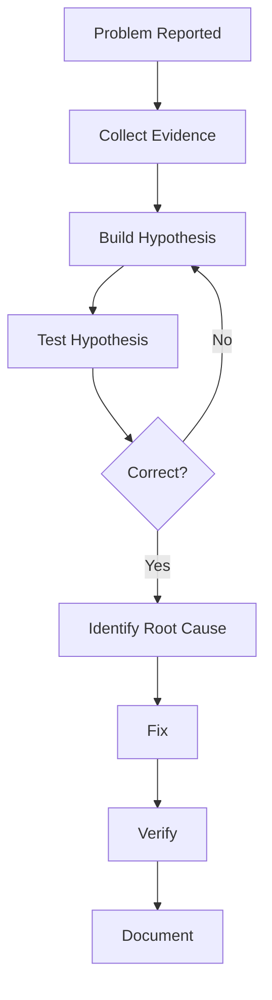
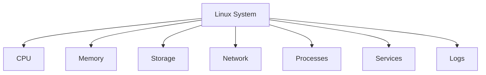
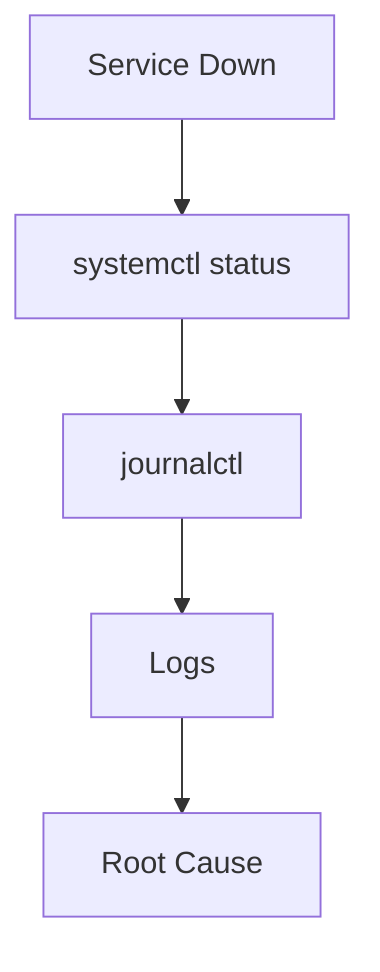
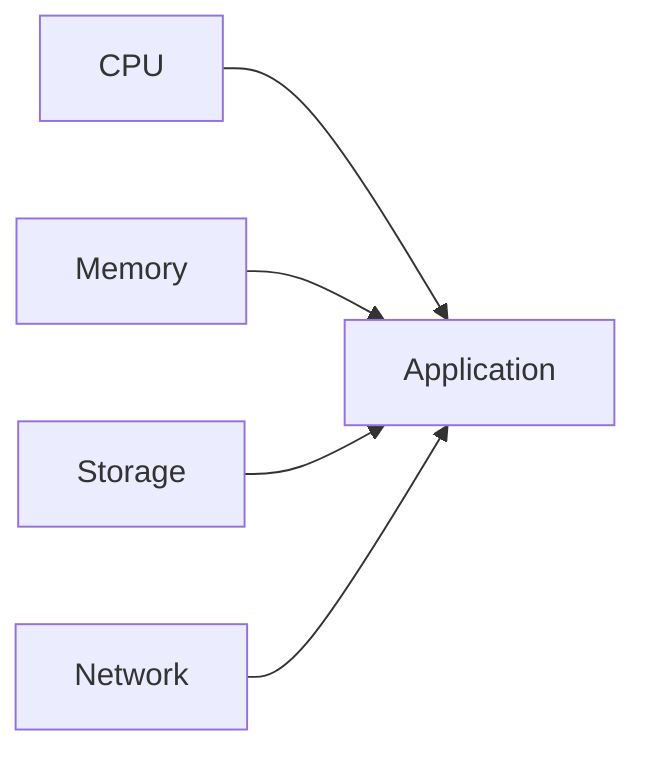

# Linux System Investigation and Troubleshooting

> Intermediate Track — Exercise 01

> **The transition from Linux user to Linux engineer.**

---

# Why This Exercise Exists

Most Linux learning resources teach commands.

Professional engineers solve problems.

There is a massive difference.

A beginner learns:

```bash
ps
top
grep
df
systemctl
```

An engineer learns:

```text
How systems fail

How failures propagate

How components interact

How to investigate unknown environments

How to find root causes
```

In real production environments nobody asks:

```text
What does ps do?
```

Instead they ask:

```text
Why is the application down?

Why is the server slow?

Why is memory exhausted?

Why is the database unavailable?

Why are customers seeing errors?
```

This file teaches the foundation of engineering thinking:

**Systematic investigation and troubleshooting.**

---

# The Problem This Exercise Solves

Most beginners troubleshoot like this:

```text
Problem
  ↓
Random Commands
  ↓
More Random Commands
  ↓
Google Search
  ↓
Hope
```

Engineers troubleshoot like this:

```text
Problem
  ↓
Observation
  ↓
Hypothesis
  ↓
Validation
  ↓
Isolation
  ↓
Root Cause
  ↓
Fix
  ↓
Verification
```

This difference is what separates operators from engineers.

---

# Mental Model

Imagine you are a detective.

A production outage is a crime scene.

You do not immediately start fixing things.

You gather evidence.

You build theories.

You validate assumptions.

Only then do you act.

Linux troubleshooting is exactly the same.

---

# First Principles

Every Linux issue ultimately falls into one or more categories:

```text
Compute Problem

Memory Problem

Storage Problem

Network Problem

Application Problem

Configuration Problem

Dependency Problem

Security Problem
```

Everything else is a variation of these.

---

# The Universal Troubleshooting Framework



This framework works for:

* Linux
* Docker
* Kubernetes
* Databases
* Cloud Infrastructure
* Distributed Systems

---

# The Engineer's Golden Rule

Never start with:

```text
How do I fix it?
```

Start with:

```text
What is happening?

Why is it happening?

What evidence supports that?
```

---

# Investigation Pyramid

```text
Symptoms
   ▲
   │
Observations
   ▲
   │
Evidence
   ▲
   │
Root Cause
```

Most people focus on symptoms.

Engineers dig toward root causes.

---

# The Linux System as a Collection of Subsystems



Failures usually occur when one subsystem affects another.

---

# Lab Environment Setup

Create a workspace:

```bash
mkdir -p ~/investigation-lab
cd ~/investigation-lab
```

Create investigation notes:

```bash
touch investigation-notes.md
```

Throughout this exercise document findings like a real incident responder.

---

# Investigation Methodology

Every investigation should answer:

```text
What is broken?

When did it break?

Who is affected?

What changed?

What evidence exists?

What is the root cause?

How do we prevent recurrence?
```

---

# Exercise 1 — Establish System Health Baseline

---

## Objective

Learn how to quickly assess system health.

---

### Step 1

Check uptime:

```bash
uptime
```

Example:

```text
14:21:44 up 42 days,  5:31,
3 users,
load average: 0.35, 0.29, 0.21
```

---

### Questions

What does:

```text
42 days
```

tell you?

What do:

```text
0.35 0.29 0.21
```

represent?

---

# Understanding Load Average

Load average is one of the most misunderstood Linux metrics.

It represents:

```text
Processes wanting CPU time
+
Processes waiting for resources
```

Not CPU percentage.

---

# Load Average Mental Model

Imagine:

```text
1 Cashier
```

and:

```text
10 Customers Waiting
```

The cashier is the CPU.

Customers waiting are system load.

Higher load means more work waiting.

---

# Exercise 2 — Investigate CPU Usage

Run:

```bash
top
```

Observe:

```text
CPU Usage
Running Processes
Load Average
```

---

# Questions

Which process consumes most CPU?

Is the system idle?

Are there unexpected processes?

---

# Production Scenario

Alert:

```text
CPU = 100%
```

Possible causes:

```text
Infinite Loop

Traffic Spike

Runaway Process

Cryptominer

Misconfigured Application
```

Never assume.

Investigate.

---

# Exercise 3 — Simulate CPU Saturation

Open terminal:

```bash
yes > /dev/null
```

Open another terminal:

```bash
top
```

Observe CPU consumption.

Stop process:

```bash
CTRL+C
```

---

# Investigation Lesson

You have now observed:

```text
Cause
↓
CPU Stress
↓
Metric Changes
```

Understanding causality is critical.

---

# Exercise 4 — Investigate Memory

Run:

```bash
free -h
```

Example:

```text
total
used
free
shared
buff/cache
available
```

---

# Mental Model

Memory is not simply:

```text
Used
vs
Free
```

Linux aggressively caches data.

Therefore:

```text
Used Memory
```

is often healthy.

---

# Engineer Interpretation

Bad interpretation:

```text
95% Memory Used
Server Is Broken
```

Good interpretation:

```text
How much memory is available?
```

Always inspect:

```text
available
```

column.

---

# Exercise 5 — Process Memory Investigation

Run:

```bash
ps aux --sort=-%mem | head
```

Questions:

1. Largest memory consumer?
2. Is it expected?
3. Is memory pressure visible?

---

# Production Scenario

Symptoms:

```text
Application Slow

OOM Killer Events

Pod Restarts
```

Investigation starts here.

---

# Exercise 6 — Process Investigation

Run:

```bash
ps aux
```

Now:

```bash
pstree
```

Observe hierarchy.

---

# Why This Matters

Processes rarely exist alone.

Example:

```text
systemd
└── nginx
     ├── worker1
     ├── worker2
     └── worker3
```

Understanding process relationships accelerates debugging.

---

# Exercise 7 — Service Investigation

List services:

```bash
systemctl list-units --type=service
```

Inspect one service:

```bash
systemctl status ssh
```

or:

```bash
systemctl status nginx
```

---

# Questions

Is service:

```text
Active?

Failed?

Restarting?
```

---

# Service Failure Investigation Flow



---

# Exercise 8 — Log Investigation

View recent logs:

```bash
journalctl -xe
```

Search:

```bash
journalctl -p err
```

---

# Why Logs Matter

Logs are the system telling you what happened.

Ignoring logs is like ignoring witnesses during an investigation.

---

# Exercise 9 — Storage Investigation

Check filesystem usage:

```bash
df -h
```

Questions:

```text
Which filesystem is largest?

Which filesystem is fullest?

Any filesystem above 90%?
```

---

# Production Reality

Many outages are caused by:

```text
Disk Full
```

not application bugs.

---

# Exercise 10 — Find Large Directories

Run:

```bash
sudo du -sh /*
```

Or:

```bash
sudo du -sh /var/*
```

---

# Investigation Goal

Identify:

```text
What is consuming storage?
```

Never delete blindly.

Find evidence first.

---

# Exercise 11 — Network Investigation

Check interfaces:

```bash
ip addr
```

Check routes:

```bash
ip route
```

Check listening ports:

```bash
ss -tulpn
```

---

# Questions

Which ports are listening?

Which services own them?

---

# Real Production Scenario

Application down?

Ask:

```text
Is process running?

Is port listening?

Can clients connect?
```

---

# Exercise 12 — Connectivity Testing

Test connectivity:

```bash
ping 8.8.8.8
```

Test DNS:

```bash
ping google.com
```

---

# Investigation Logic

If:

```text
8.8.8.8 Works
```

but:

```text
google.com Fails
```

likely:

```text
DNS Problem
```

---

# Root Cause Thinking

Bad Engineers:

```text
Restart Everything
```

Good Engineers:

```text
Identify Failing Layer
```

---

# Exercise 13 — Open File Investigation

Run:

```bash
lsof | head
```

Observe:

```text
Open Files
Network Sockets
Devices
```

---

# Why This Matters

Processes interact with the world through:

```text
Files
Sockets
Devices
```

Investigating these reveals behavior.

---

# Exercise 14 — Observe Real System Activity

Run:

```bash
vmstat 1
```

Observe:

```text
CPU
Memory
Context Switches
I/O
```

---

# Systems Thinking

Everything is connected.



One bottleneck often affects everything else.

---

# Production Incident Simulation #1

---

## Report

```text
Website Down
```

---

## Investigation Steps

Check:

```bash
systemctl status nginx
```

Then:

```bash
ss -tulpn
```

Then:

```bash
journalctl -u nginx
```

Document findings.

---

# Production Incident Simulation #2

---

## Report

```text
Server Slow
```

Investigate:

```bash
top

free -h

vmstat

iostat
```

Questions:

```text
CPU Bound?

Memory Bound?

Disk Bound?
```

---

# Production Incident Simulation #3

---

## Report

```text
Disk Full
```

Investigate:

```bash
df -h

du -sh

find
```

Find root cause.

---

# Production Incident Simulation #4

---

## Report

```text
Database Unreachable
```

Investigate:

```bash
systemctl status

ss -tulpn

journalctl
```

Build evidence chain.

---

# Docker Connection

Containers are Linux systems.

Everything learned here applies.

Investigate:

```bash
docker ps

docker logs

docker stats
```

Same mindset.

Different environment.

---

# Kubernetes Connection

Most Kubernetes debugging is Linux debugging.

Examples:

```text
CrashLoopBackOff

OOMKilled

Node Pressure

Readiness Failure
```

Require understanding:

```text
Processes

Memory

Logs

Networking
```

---

# Observability Mindset

Modern systems provide:

```text
Metrics

Logs

Events

Traces
```

Linux troubleshooting is the ancestor of modern observability.

---

# Common Mistakes

## Mistake 1

Restarting before investigating.

---

## Mistake 2

Ignoring logs.

---

## Mistake 3

Assuming instead of validating.

---

## Mistake 4

Treating symptoms instead of root causes.

---

## Mistake 5

Changing multiple things simultaneously.

---

# Engineering Mindset

Beginners ask:

```text
What command fixes this?
```

Engineers ask:

```text
What subsystem is failing?

What evidence supports that?

What is the root cause?

How can we prevent recurrence?
```

---

# Investigation Checklist

When something breaks:

```text
□ Check uptime

□ Check load

□ Check CPU

□ Check memory

□ Check storage

□ Check processes

□ Check services

□ Check logs

□ Check networking

□ Validate assumptions

□ Identify root cause

□ Verify fix

□ Document findings
```

---

# Interview Questions

## Intermediate

1. How would you investigate a slow Linux server?
2. What is the difference between load average and CPU usage?
3. How would you identify a memory leak?
4. How would you determine why a service is down?
5. How would you investigate disk exhaustion?

---

## Advanced

6. Describe your troubleshooting methodology.
7. How do you distinguish symptoms from root causes?
8. How would you debug intermittent failures?
9. How would you investigate a Kubernetes CrashLoopBackOff?
10. How would you approach a production outage with limited information?

---

# Cheat Sheet

```bash
uptime

top

htop

free -h

vmstat

ps aux

pstree

systemctl status SERVICE

journalctl -xe

journalctl -u SERVICE

df -h

du -sh *

ip addr

ip route

ss -tulpn

ping HOST

lsof

find
```

---

# Capstone Challenge

A Linux server exhibits:

```text
High Load

Slow Response Times

Frequent Errors

Growing Disk Usage
```

Perform a complete investigation.

Document:

```text
Symptoms

Evidence

Hypotheses

Tests

Root Cause

Fix

Verification
```

Think like an engineer.

Not a command memorizer.

---

# Completion Criteria

You successfully complete this exercise when you can:

✓ Approach unknown Linux problems systematically

✓ Gather evidence before acting

✓ Correlate CPU, memory, storage, networking, logs, and services

✓ Build and test hypotheses

✓ Identify root causes

✓ Verify fixes

✓ Document findings

✓ Apply the same methodology to Docker, Kubernetes, cloud infrastructure, and production systems

Congratulations.

You have crossed the boundary from learning Linux commands to learning Linux engineering.
