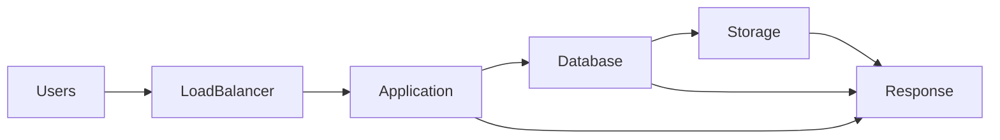

# Why This File Matters

Most production incidents are not:

```text
Server Down
```

They are:

```text
Server Slow
```

Which is much harder.

Examples:

```text
Website loads in 12 seconds

Database queries take 8 seconds

Kubernetes pods become sluggish

API latency spikes

CPU usage looks normal

Memory looks normal

But users complain
```

This is where performance engineering begins.

---

# Learning Goals

After completing this exercise:

✓ Understand bottlenecks

✓ Investigate CPU pressure

✓ Investigate memory pressure

✓ Investigate disk I/O pressure

✓ Investigate network bottlenecks

✓ Understand Linux load average deeply

✓ Understand latency vs throughput

✓ Understand resource contention

✓ Learn performance investigation methodology

✓ Connect Linux performance to Docker and Kubernetes

---

# Major Sections

## Why Performance Engineering Exists

Mental model:

```text
A system is only as fast
as its slowest resource.
```

---

## The Bottleneck Mental Model

Visualization:



The slowest component determines system performance.

---

## First Principles of Performance

Teach:

```text
CPU

Memory

Storage

Network
```

Everything ultimately competes for these resources.

---

## Linux Performance Pyramid

```text
Application
    ▲
Processes
    ▲
CPU
Memory
Disk
Network
```

---

## CPU Investigation Labs

Commands:

```bash
top
htop
ps
mpstat
pidstat
```

Exercises:

* CPU saturation
* Runaway process
* Infinite loop
* Single-core bottleneck

---

## Load Average Deep Dive

Teach:

```text
What load average is

Why it is misunderstood

CPU-bound vs I/O-bound load
```

---

## Memory Investigation Labs

Commands:

```bash
free -h
vmstat
top
ps
```

Topics:

```text
Page Cache

Buffers

Memory Pressure

OOM Killer
```

Exercises:

* Memory exhaustion
* Cache observation
* OOM simulation

---

## Disk I/O Investigation Labs

Commands:

```bash
iostat
iotop
df
du
```

Topics:

```text
Latency

Throughput

Random vs Sequential I/O
```

Exercises:

* Log explosion
* Disk contention
* Slow storage simulation

---

## Network Investigation Labs

Commands:

```bash
ss
iftop
ip
ping
mtr
```

Topics:

```text
Packet Loss

Latency

Bandwidth

Connection Saturation
```

---

## Performance Data Flow

```mermaid
flowchart TD

Request
   |
Application
   |
CPU

CPU --> Memory

Memory --> Storage

Storage --> Network

Network --> User
```

---

## Resource Contention

Teach:

```text
Multiple workloads competing
for the same resource.
```

Example:

```text
Database

Application

Backup Job
```

sharing same disk.

---

## Linux Scheduler Fundamentals

Introduce:

```text
Run Queue

Scheduling

Context Switching
```

Exercises observing scheduler behavior.

---

## Docker Performance Labs

Topics:

```text
Container CPU Limits

Container Memory Limits

cgroups

CPU Throttling
```

Exercises:

```bash
docker stats
```

---

## Kubernetes Performance Labs

Topics:

```text
Requests

Limits

OOMKilled

CPU Throttling
```

---

## Real Production Incidents

### Incident 1

```text
CPU 100%
```

Find root cause.

---

### Incident 2

```text
Memory exhausted
```

Identify offender.

---

### Incident 3

```text
Disk latency spikes
```

Find bottleneck.

---

### Incident 4

```text
Application slow despite low CPU
```

Trace dependency chain.

---

## Performance Investigation Framework

```mermaid
flowchart TD

Symptom
   |
Evidence
   |
CPU?
Memory?
Disk?
Network?
   |
Root Cause
   |
Fix
   |
Verify
```

---

## Common Mistakes

Examples:

```text
Assuming CPU is the problem

Confusing cache with memory leaks

Ignoring I/O bottlenecks

Ignoring network latency

Restarting before measuring
```

---

## Engineering Mindset

Teach:

```text
Measure First

Optimize Second

Never Guess
```

---

## Interview Questions

Topics:

```text
Load Average

CPU Scheduling

OOM Killer

Disk Latency

Resource Contention

Performance Bottlenecks
```

---

## Capstone

Students investigate a deliberately slow Linux server and determine:

```text
What is slow?

Why?

What evidence proves it?

How should it be fixed?
```

This file becomes the foundation for later advanced topics such as:

```text
Advanced Performance Engineering
Kernel Tuning
Storage Systems
Database Performance
Container Performance
Kubernetes Performance
Distributed Systems Performance
SRE Engineering
```

and is one of the most valuable exercises in the entire repository.
