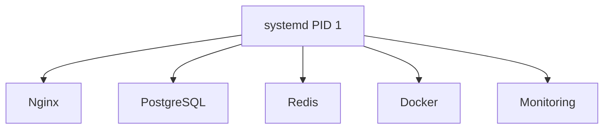
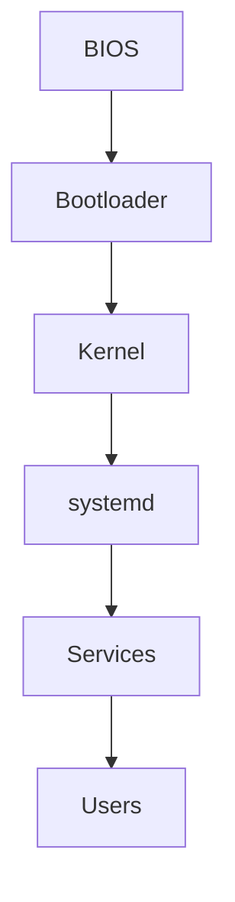

# Why This File Should Come Next

Most real-world outages involve services:

```text
Nginx Down
PostgreSQL Down
Redis Down
Docker Down
SSH Down
Kubernetes Agent Down
Monitoring Agent Down
```

Engineers must understand:

```text
How services start

How services stop

How services restart

How boot sequences work

How dependencies work

How failures propagate
```

Without systemd knowledge, Linux troubleshooting remains incomplete.

---

# What This File Teaches

Students transition from:

```text
Running commands manually
```

to:

```text
Operating production services
```

---

# Learning Objectives

After completing this exercise:

✓ Understand systemd architecture

✓ Understand units

✓ Understand service lifecycle

✓ Understand boot process

✓ Investigate service failures

✓ Analyze logs using journalctl

✓ Create custom services

✓ Debug startup failures

✓ Understand dependencies

✓ Connect systemd to containers and cloud systems

---

# Core Sections

## Why Service Managers Exist

Problem:

```text
Server Reboots

Applications Must Restart

Dependencies Must Be Ordered

Failures Must Be Detected
```

Without a service manager:

```text
Chaos
```

---

## Mental Model

Think of systemd as:

```text
Operating System Control Tower
```

Visualization:



---

## Linux Boot Journey

Deep walkthrough:

```text
Power On
 ↓
Firmware
 ↓
Bootloader
 ↓
Kernel
 ↓
PID 1 (systemd)
 ↓
Services
 ↓
System Ready
```

Visualization:



---

## Exercise: Explore Running Services

Commands:

```bash
systemctl

systemctl list-units

systemctl list-units --type=service
```

Investigation tasks.

---

## Exercise: Service Status Analysis

Commands:

```bash
systemctl status ssh

systemctl status nginx
```

Learn to interpret:

```text
Loaded

Active

Failed

Exited

Restarting
```

---

## Exercise: Start and Stop Services

Commands:

```bash
sudo systemctl start nginx

sudo systemctl stop nginx

sudo systemctl restart nginx

sudo systemctl reload nginx
```

Understand differences.

---

## Restart vs Reload

Critical production concept:

```text
Restart

Process Dies
New Process Starts
```

vs

```text
Reload

Configuration Reloaded
No Downtime
```

---

## Exercise: Service Enablement

Commands:

```bash
systemctl enable nginx

systemctl disable nginx
```

Understand boot persistence.

---

## Linux Internals

Teach:

```text
Unit Files

Targets

Dependencies

PID Tracking

cgroups Integration
```

---

## Understanding Unit Files

Explore:

```bash
systemctl cat nginx
```

Read:

```ini
[Unit]

[Service]

[Install]
```

sections.

---

## Exercise: Create Custom Service

Create:

```text
hello-service.service
```

Run custom script as service.

Production-grade walkthrough.

---

## Service Dependency Investigation

Visualization:

```mermaid
flowchart TD

Network
   ↓
Database
   ↓
Backend
   ↓
Frontend
```

Failure propagation exercises.

---

## Journalctl Deep Dive

Commands:

```bash
journalctl

journalctl -xe

journalctl -u nginx

journalctl -f
```

Exercises:

* Follow logs
* Search failures
* Find startup errors

---

## Production Incident Lab #1

Scenario:

```text
Nginx Failed To Start
```

Tasks:

```text
Check Status

Check Logs

Identify Root Cause

Fix

Verify
```

---

## Production Incident Lab #2

Scenario:

```text
Application Restarts Every Minute
```

Investigate:

```text
Crash Loop

Memory Issues

Dependency Failure

Configuration Failure
```

---

## Production Incident Lab #3

Scenario:

```text
Server Rebooted

Application Did Not Start
```

Investigate:

```text
Enabled?

Dependency Failure?

Service Failure?
```

---

## Failure Analysis Framework

```mermaid
flowchart TD

Service Down
   |
Status
   |
Logs
   |
Dependencies
   |
Configuration
   |
Root Cause
```

---

## Docker Connection

Show:

```text
Containers Have PID 1 Too
```

Explain:

```text
Container Entrypoint

Container Lifecycle

Signal Handling
```

Why poorly designed containers fail.

---

## Kubernetes Connection

Explain:

```text
Pods

Container Restarts

CrashLoopBackOff

Init Containers
```

through service-management concepts.

---

## Cloud Engineering Connection

Examples:

```text
EC2 Services

Monitoring Agents

Backup Agents

Security Agents
```

All managed through systemd.

---

## Security Considerations

Topics:

```text
Service Permissions

Service Users

Sandboxing

Least Privilege
```

---

## Observability Considerations

Teach:

```text
Logs

Metrics

Restart Counts

Health Checks
```

---

## Common Mistakes

Examples:

```text
Restarting Without Reading Logs

Ignoring Dependencies

Running Everything As Root

Confusing Reload With Restart
```

---

## Engineering Mindset

Teach:

```text
Services are systems.

Systems have dependencies.

Failures propagate through dependencies.
```

---

## Interview Questions

Topics:

```text
What is systemd?

What is PID 1?

Difference between restart and reload?

How would you debug a failed service?

How do service dependencies work?
```

---

## Capstone Exercise

Provide a broken service stack:

```text
Frontend
Backend
Database
```

Students must:

```text
Investigate

Identify Root Cause

Restore Service

Document Findings
```

---

After this file, the next progression should be:
These files together form the core of the Intermediate Linux Engineering track.
