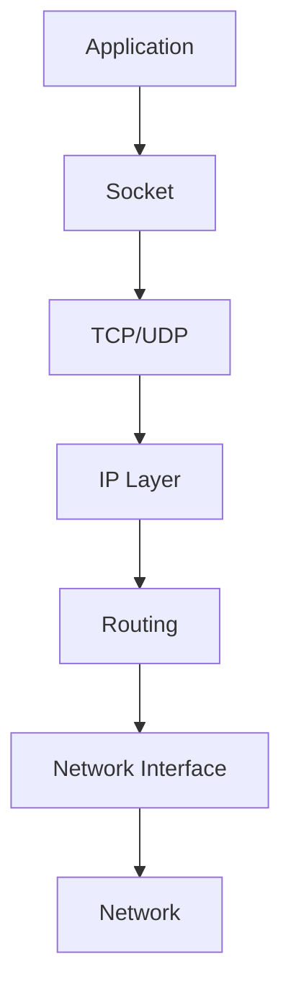
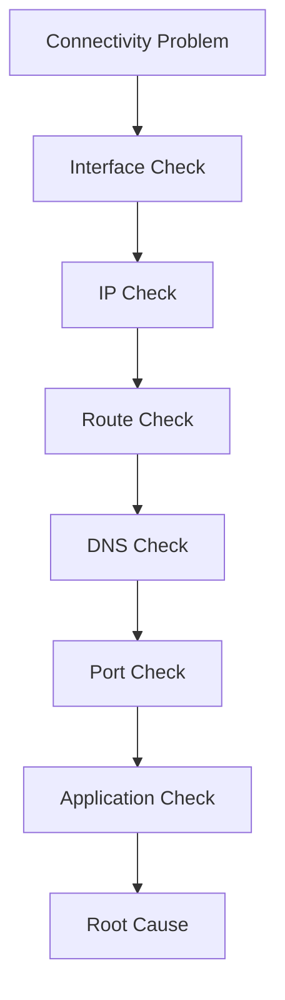
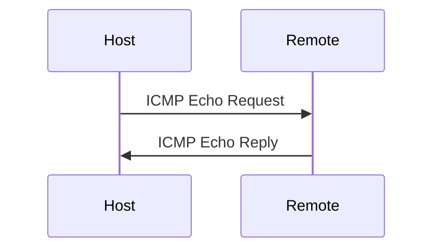

# Linux Networking Investigation and Debugging

> Intermediate Track — Exercise 04

> **Networking is where most engineers guess. This exercise teaches you how to investigate.**

---

# Why This Exercise Exists

Most engineers think:

```text
Application Down
=
Application Problem
```

In production, this is often wrong.

Many outages are actually:

```text
DNS Failure

Routing Failure

Firewall Rules

Port Misconfiguration

Load Balancer Issues

TLS Problems

Network Saturation

Packet Loss

Service Discovery Failures
```

The application is healthy.

The network path is broken.

This file teaches how Linux engineers investigate networking problems systematically instead of randomly restarting services.

---

# The Problem This Exercise Solves

Imagine users report:

```text
Website Not Loading
```

Possible causes:

```text
Application Crashed

DNS Failure

Port Not Listening

Firewall Blocking Traffic

Routing Failure

Load Balancer Failure

Database Connectivity Issue

Network Congestion

Certificate Problem
```

The symptom is identical.

The root causes are completely different.

Networking investigation helps identify the real problem.

---

# Mental Model

Think of networking like a package delivery system.

```text
Sender
  ↓
Roads
  ↓
Intersections
  ↓
Destination
```

If a package does not arrive:

```text
Wrong Address

Road Closed

Traffic Jam

Destination Missing

Delivery Truck Broken
```

Networking failures work the same way.

---

# First Principles

Every network communication requires:

```text
Source

Destination

Address

Route

Protocol

Port

Application
```

Failure of any layer can break communication.

---

# The Network Investigation Pyramid

```text
Application
    ▲
Transport (TCP/UDP)
    ▲
IP Layer
    ▲
Network Interface
    ▲
Physical Connectivity
```

Always investigate from the bottom upward.

---

# Linux Networking Architecture



Understanding this flow is critical.

---

# Core Troubleshooting Philosophy

Never ask:

```text
Why is networking broken?
```

Ask:

```text
Which layer is failing?
```

---

# Investigation Workflow



---

# Lab Environment Setup

Create workspace:

```bash
mkdir -p ~/network-lab
cd ~/network-lab
```

Document findings throughout the exercise.

---

# Exercise 1 — Investigate Network Interfaces

View interfaces:

```bash
ip addr
```

Alternative:

```bash
ip a
```

Observe:

```text
Interface Names

IP Addresses

Subnet Information

Interface State
```

---

# Questions

Identify:

```text
Loopback Interface

Primary Interface

Assigned IP Address

Network Mask
```

---

# Understanding Loopback

```text
127.0.0.1
```

represents:

```text
This Machine
```

Visualization:

```text
Application
    ↓
127.0.0.1
    ↓
Same Machine
```

No external network involved.

---

# Exercise 2 — Investigate Routes

View routing table:

```bash
ip route
```

Example:

```text
default via 192.168.1.1 dev eth0
```

---

# Mental Model

Routing table:

```text
Google Maps
for packets
```

It tells Linux:

```text
Where traffic should go.
```

---

# Questions

Identify:

```text
Default Route

Gateway

Network Route
```

---

# Production Scenario

Server can reach:

```text
Local Systems
```

but cannot reach:

```text
Internet
```

Possible cause:

```text
Missing Default Route
```

---

# Exercise 3 — Test Basic Connectivity

Run:

```bash
ping 8.8.8.8
```

Observe:

```text
Latency

Packet Loss

Reachability
```

---

# Understanding Ping

Ping answers:

```text
Can packets reach destination?
```

Not:

```text
Is application healthy?
```

---

# Visualization



---

# Exercise 4 — DNS Investigation

Run:

```bash
ping google.com
```

Then:

```bash
ping 8.8.8.8
```

Compare results.

---

# DNS Failure Logic

If:

```text
8.8.8.8 Works
```

but:

```text
google.com Fails
```

then likely:

```text
DNS Problem
```

---

# Investigate DNS Configuration

Check:

```bash
cat /etc/resolv.conf
```

Observe:

```text
nameserver entries
```

---

# Why DNS Matters

Humans use:

```text
google.com
```

Networks use:

```text
142.250.x.x
```

DNS translates between them.

---

# Exercise 5 — Investigate Listening Ports

Run:

```bash
ss -tulpn
```

Observe:

```text
Listening Ports

Protocols

Owning Processes
```

---

# Questions

Identify:

```text
SSH Port

Web Ports

Database Ports
```

---

# Port Mental Model

An IP address is a building.

Ports are apartment numbers.

Example:

```text
192.168.1.10
```

contains:

```text
SSH → Port 22

HTTP → Port 80

HTTPS → Port 443

PostgreSQL → Port 5432
```

---

# Exercise 6 — Verify Service Exposure

Start Python server:

```bash
python3 -m http.server 8080
```

Open second terminal:

```bash
ss -tulpn | grep 8080
```

Observe listening socket.

---

# Data Flow Visualization

```mermaid
flowchart LR

Browser

--> TCP

--> Port 8080

--> Python Server
```

---

# Exercise 7 — Test Local Connectivity

Run:

```bash
curl localhost:8080
```

Questions:

```text
Did server respond?

What content returned?
```

---

# Why Curl Matters

Engineers often use:

```bash
curl
```

before opening browsers.

It provides raw network visibility.

---

# Exercise 8 — Investigate Active Connections

Run:

```bash
ss -tan
```

Observe:

```text
ESTABLISHED

LISTEN

TIME_WAIT

CLOSE_WAIT
```

---

# TCP Connection Lifecycle


---

# Engineering Insight

Connection states reveal application behavior.

Many production incidents can be diagnosed from socket states alone.

---

# Exercise 9 — Process-to-Port Mapping

Find service using:

```bash
ss -tulpn
```

Identify:

```text
PID

Process Name

Port
```

---

# Production Question

Users report:

```text
Cannot Connect To Service
```

Ask:

```text
Is process running?

Is port listening?
```

---

# Exercise 10 — Investigate Open Connections

Run:

```bash
lsof -i
```

Observe:

```text
Network Sockets

Ports

Processes
```

---

# Why This Matters

Linux applications communicate through sockets.

Investigating sockets reveals communication behavior.

---

# Exercise 11 — Trace Route to Destination

Install:

```bash
sudo apt install traceroute
```

Run:

```bash
traceroute google.com
```

Observe network hops.

---

# Mental Model

Packets rarely travel directly.

They move through multiple routers.

Visualization:

```text
Your PC
   ↓
Router
   ↓
ISP
   ↓
Backbone
   ↓
Google
```

---

# Production Use Case

Users:

```text
Can reach server locally

Cannot reach remotely
```

Traceroute helps identify where traffic stops.

---

# Exercise 12 — Investigate Network Statistics

Run:

```bash
ip -s link
```

Observe:

```text
RX Packets

TX Packets

Errors

Dropped Packets
```

---

# Questions

Are packets being dropped?

Are errors increasing?

---

# Why This Matters

Packet drops often indicate:

```text
Congestion

Hardware Problems

Driver Issues

Network Saturation
```

---

# Exercise 13 — Monitor Live Traffic

Install:

```bash
sudo apt install tcpdump
```

Capture:

```bash
sudo tcpdump -i any
```

Observe packets.

Stop:

```text
CTRL+C
```

---

# Linux Internals

Packets travel:

```text
NIC
 ↓
Kernel Network Stack
 ↓
TCP/IP Processing
 ↓
Socket
 ↓
Application
```

tcpdump observes this flow.

---

# Exercise 14 — Capture HTTP Traffic

Run:

```bash
sudo tcpdump port 80
```

Generate traffic:

```bash
curl http://example.com
```

Observe packets.

---

# Production Networking Investigation Framework

```mermaid
flowchart TD

Problem

--> Interface

--> Routing

--> DNS

--> Connectivity

--> Ports

--> Application

--> Root Cause
```

---

# Production Incident Simulation #1

## Report

```text
Website Down
```

Investigate:

```bash
ping

ss

curl

systemctl
```

Determine:

```text
Network Problem

or

Application Problem
```

---

# Production Incident Simulation #2

## Report

```text
Can Ping IP

Cannot Access Domain
```

Likely:

```text
DNS Failure
```

Validate using:

```bash
cat /etc/resolv.conf
```

---

# Production Incident Simulation #3

## Report

```text
Application Running

Users Cannot Connect
```

Investigate:

```bash
ss -tulpn

iptables

firewall rules
```

---

# Production Incident Simulation #4

## Report

```text
Intermittent Connectivity
```

Investigate:

```bash
ping

tcpdump

interface statistics
```

Look for packet loss.

---

# Docker Connection

Containers rely heavily on Linux networking.

Investigate:

```bash
docker network ls

docker inspect
```

Understand:

```text
Bridge Networks

Virtual Interfaces

NAT
```

---

# Container Networking Visualization

```mermaid
flowchart LR

Container

--> Docker Bridge

--> Host Network

--> Internet
```

---

# Kubernetes Connection

Pods are networked entities.

Concepts:

```text
Pod IPs

Service IPs

Cluster Networking

DNS

Ingress
```

All rely on Linux networking fundamentals.

---

# Kubernetes Debugging Examples

Investigate:

```text
Pod Cannot Reach Database

Service Not Accessible

DNS Resolution Failure

Ingress Failure
```

Same Linux skills apply.

---

# Security Considerations

Networking is a major attack surface.

Investigate:

```text
Open Ports

Unexpected Listeners

Unknown Connections

Unauthorized Services
```

Commands:

```bash
ss

lsof

netstat
```

---

# Performance Considerations

Networking bottlenecks often appear as:

```text
Slow Applications

High Latency

Packet Loss

Connection Queues
```

Not necessarily high CPU usage.

---

# Common Mistakes

## Mistake 1

Assuming application failure.

---

## Mistake 2

Ignoring DNS.

---

## Mistake 3

Ignoring routing.

---

## Mistake 4

Confusing connectivity with application health.

---

## Mistake 5

Restarting services before investigation.

---

# Engineering Mindset

Beginners ask:

```text
Why can't I connect?
```

Engineers ask:

```text
Which network layer failed?

What evidence proves it?

What packets are moving?

What packets are not moving?
```

---

# Interview Questions

## Intermediate

1. How would you troubleshoot a website that is unreachable?
2. What is the purpose of DNS?
3. How do you identify listening ports?
4. Difference between TCP and UDP?
5. What does a routing table do?

---

## Advanced

6. Explain the Linux networking stack.
7. How would you diagnose packet loss?
8. How would you investigate DNS failures?
9. How do containers communicate over networks?
10. How would you troubleshoot Kubernetes networking issues?

---

# Cheat Sheet

```bash
ip addr

ip route

ping 8.8.8.8

cat /etc/resolv.conf

ss -tulpn

ss -tan

curl localhost

lsof -i

traceroute google.com

ip -s link

tcpdump -i any

tcpdump port 80
```

---

# Capstone Challenge

A production web application is unreachable.

Symptoms:

```text
Users Cannot Access Site

Application Team Claims Service Is Running

Infrastructure Team Claims Network Is Healthy
```

Perform a complete investigation.

Document:

```text
Network Interfaces

Routes

DNS

Ports

Connectivity

Logs

Evidence

Root Cause

Fix

Verification
```

Think like a network engineer.

Not a command runner.

---

# Completion Criteria

You successfully complete this exercise when you can:

✓ Investigate Linux networking systematically

✓ Understand interfaces, IPs, routes, ports, and sockets

✓ Debug DNS failures

✓ Verify connectivity

✓ Trace network paths

✓ Capture and inspect packets

✓ Correlate networking issues with applications

✓ Apply the same skills to Docker, Kubernetes, cloud platforms, and production environments

Congratulations.

You now possess one of the most valuable skills in systems engineering: the ability to diagnose network failures using evidence instead of guesswork.
