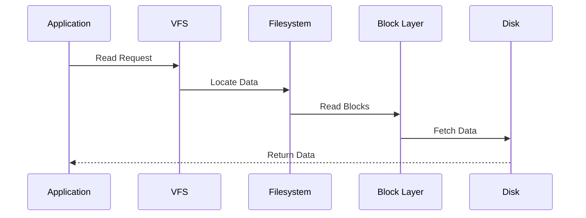

# Linux Storage, Filesystem, and Disk Investigation

> Intermediate Track — Exercise 05

> **Most systems do not fail because CPUs stop working. They fail because data cannot be stored, retrieved, or managed efficiently.**

---

# Why This Exercise Exists

Many engineers think storage means:

```text
Hard Disk
SSD
Storage Space
```

Linux engineers know storage is much more than that.

Storage affects:

* Application performance
* Database performance
* Container performance
* System boot reliability
* Data durability
* Recovery procedures
* Backup systems
* Cloud infrastructure

Many real-world outages are caused by:

```text
Disk Full

Filesystem Corruption

I/O Saturation

Runaway Logs

Storage Latency

Inode Exhaustion

Bad Mounts

Permission Problems

Failed Volumes
```

Understanding storage is understanding where all application state ultimately lives.

---

# The Problem This Exercise Solves

Imagine a production incident:

```text
Website Returns 500 Errors
```

Application appears healthy.

CPU looks normal.

Memory looks normal.

Networking works.

Yet users experience failures.

Root cause:

```text
Disk Full
```

Or:

```text
Filesystem Mounted Read-Only
```

Or:

```text
Storage Latency Explosion
```

Storage problems often masquerade as application problems.

---

# Mental Model

Think of Linux storage as a city.

```text
Disk = Land

Filesystem = Road System

Directories = Neighborhoods

Files = Buildings

Applications = Businesses

Users = Residents
```

Without roads:

```text
Nobody can reach buildings.
```

Without filesystems:

```text
Applications cannot access data.
```

---

# First Principles

Applications never talk directly to disks.

The path looks like:

```mermaid
flowchart LR

Application
--> Filesystem

Filesystem
--> Block Layer

Block Layer
--> Device Driver

Device Driver
--> Disk
```

Understanding this abstraction is critical.

---

# Linux Storage Architecture

```mermaid
flowchart TD

Application

--> VFS

VFS --> ext4

VFS --> XFS

VFS --> Btrfs

ext4 --> Block Layer
XFS --> Block Layer
Btrfs --> Block Layer

Block Layer --> SSD
Block Layer --> HDD
Block Layer --> NVMe
```

---

# Why Filesystems Exist

Imagine storing data directly on a disk:

```text
Byte 1
Byte 2
Byte 3
...
```

Finding information would be impossible.

Filesystems provide:

```text
Organization

Naming

Permissions

Metadata

Reliability
```

---

# Storage Investigation Framework

```mermaid
flowchart TD

Storage Problem

--> Capacity

--> Filesystem

--> Mounts

--> Inodes

--> I/O Performance

--> Hardware

--> Root Cause
```

---

# Lab Environment Setup

Create workspace:

```bash
mkdir -p ~/storage-lab
cd ~/storage-lab
```

Create test files:

```bash
dd if=/dev/zero of=test1.img bs=1M count=50

dd if=/dev/zero of=test2.img bs=1M count=100
```

---

# Exercise 1 — Understand Storage Devices

List block devices:

```bash
lsblk
```

Example output:

```text
NAME
sda
├─sda1
├─sda2
└─sda3

nvme0n1
├─nvme0n1p1
└─nvme0n1p2
```

---

# Questions

Identify:

```text
Physical Disk

Partitions

Mount Relationships
```

---

# Mental Model

Think:

```text
Disk
  ↓
Partitions
  ↓
Filesystems
  ↓
Directories
  ↓
Files
```

---

# Exercise 2 — Investigate Mounted Filesystems

Run:

```bash
mount
```

or:

```bash
findmnt
```

Observe:

```text
Filesystem

Mount Point

Filesystem Type
```

---

# Why Mounting Exists

Linux creates one unified directory tree.

Visualization:

```text
/

├── home

├── var

├── data

└── backup
```

Each may actually reside on different disks.

---

# Exercise 3 — Filesystem Capacity Investigation

Run:

```bash
df -h
```

Observe:

```text
Filesystem

Size

Used

Available

Use%
```

---

# Production Investigation Questions

Which filesystem:

```text
Has highest utilization?

Has least free space?

Is near failure?
```

---

# Why Disk Full Causes Outages

Applications need storage for:

```text
Logs

Uploads

Caches

Database Writes

Temporary Files
```

No space means:

```text
No Writes
```

No writes often means:

```text
Application Failure
```

---

# Exercise 4 — Investigate Inodes

Run:

```bash
df -i
```

Observe:

```text
Inodes

IUsed

IFree
```

---

# What Are Inodes?

Linux stores:

```text
Metadata
```

separately from:

```text
File Contents
```

Each file consumes an inode.

---

# Critical Production Lesson

A server may have:

```text
100 GB Free
```

and still fail.

Why?

```text
No Inodes Remaining
```

---

# Visualization

```text
Filesystem

├── Data Blocks

└── Inodes
```

Both resources can be exhausted.

---

# Exercise 5 — Find Large Directories

Run:

```bash
sudo du -sh /*
```

More targeted:

```bash
sudo du -sh /var/*
```

---

# Investigation Goal

Find:

```text
Where storage is being consumed.
```

---

# Production Example

Often the culprit is:

```text
/var/log

/var/lib/docker

/var/lib/postgresql

/tmp
```

---

# Exercise 6 — Find Large Files

Run:

```bash
find / -type f -size +100M 2>/dev/null
```

Or:

```bash
sudo find /var -type f -size +50M
```

---

# Why This Matters

Large files often indicate:

```text
Log Growth

Core Dumps

Database Growth

Backup Failures
```

---

# Exercise 7 — Investigate Filesystem Types

Run:

```bash
df -T
```

Observe:

```text
ext4

xfs

tmpfs

overlay
```

---

# Common Linux Filesystems

## ext4

Most common.

Good balance.

Reliable.

---

## XFS

Optimized for large-scale workloads.

Popular in:

```text
Cloud

Enterprise Linux

Databases
```

---

## Btrfs

Advanced features:

```text
Snapshots

Checksums

Compression
```

---

# Exercise 8 — Disk Usage Growth Investigation

Create files:

```bash
dd if=/dev/zero of=huge.log bs=1M count=200
```

Observe:

```bash
df -h
```

Delete:

```bash
rm huge.log
```

Observe again.

---

# Engineering Lesson

Storage usage changes continuously.

Investigations often focus on:

```text
What changed recently?
```

---

# Exercise 9 — Open Deleted Files

Create:

```bash
tail -f huge.log
```

Open second terminal:

```bash
rm huge.log
```

Now run:

```bash
lsof | grep deleted
```

---

# Production Incident

File deleted.

Disk space not reclaimed.

Why?

Process still holds file handle.

This is extremely common.

---

# Visualization

```text
File Deleted
      │
      ▼
Directory Entry Removed
      │
      ▼
Process Still Using File
      │
      ▼
Storage Not Freed
```

---

# Exercise 10 — Investigate Disk Performance

Install:

```bash
sudo apt install sysstat
```

Run:

```bash
iostat -x 1
```

Observe:

```text
Utilization

Await

Read Throughput

Write Throughput
```

---

# Mental Model

Capacity and performance are different.

Example:

```text
Disk 90% Empty
```

but:

```text
Disk Latency 500 ms
```

System can still be slow.

---

# Performance Metrics

Key metrics:

```text
IOPS

Latency

Throughput

Queue Depth
```

---

# Exercise 11 — Investigate Active Disk Users

Install:

```bash
sudo apt install iotop
```

Run:

```bash
sudo iotop
```

Observe:

```text
Processes Causing I/O
```

---

# Production Question

Who is consuming disk resources?

iotop answers that.

---

# Exercise 12 — Investigate Read-Only Filesystems

Check:

```bash
mount | grep ro
```

or:

```bash
findmnt
```

---

# Why This Matters

After corruption or storage failures:

Linux may remount:

```text
Read Only
```

to prevent further damage.

Applications then fail.

---

# Exercise 13 — Investigate Temporary Storage

Inspect:

```bash
du -sh /tmp
```

Inspect:

```bash
du -sh /var/tmp
```

---

# Common Issue

Applications forget cleanup.

Temporary files accumulate.

Eventually:

```text
Storage Exhaustion
```

---

# Production Incident Simulation #1

## Report

```text
Application Cannot Write Data
```

Investigate:

```bash
df -h

mount

permissions

filesystem state
```

---

# Production Incident Simulation #2

## Report

```text
Server Out Of Disk Space
```

Tasks:

```bash
df -h

du -sh

find
```

Find root cause.

---

# Production Incident Simulation #3

## Report

```text
Database Extremely Slow
```

Investigate:

```bash
iostat

iotop

storage latency
```

---

# Production Incident Simulation #4

## Report

```text
Storage Space Not Recovered
After File Deletion
```

Investigate:

```bash
lsof | grep deleted
```

---

# Linux Internals

When a file is read:



Every storage operation follows a similar path.

---

# Filesystem Investigation Methodology

```mermaid
flowchart TD

Storage Issue

--> Capacity

--> Inodes

--> Files

--> Directories

--> Mounts

--> Performance

--> Hardware

--> Root Cause
```

---

# Docker Connection

Docker heavily depends on storage.

Investigate:

```bash
docker system df
```

Common offenders:

```text
Images

Containers

Volumes

Build Cache
```

---

# Container Storage Visualization

```text
Docker

├── Images

├── Containers

├── Volumes

└── OverlayFS
```

---

# Kubernetes Connection

Storage concepts become:

```text
Persistent Volumes

Persistent Volume Claims

Storage Classes

CSI Drivers
```

Understanding Linux storage is essential for Kubernetes.

---

# Cloud Engineering Connection

Cloud storage services ultimately expose:

```text
Block Storage

Object Storage

File Storage
```

Linux interacts primarily with block devices and filesystems.

---

# Security Considerations

Storage often contains:

```text
Secrets

Credentials

Database Dumps

Logs

Backups
```

Investigation must respect access controls.

---

# Performance Considerations

Storage bottlenecks often appear as:

```text
Slow APIs

Slow Databases

High Load Average

Application Timeouts
```

without obvious CPU problems.

---

# Common Mistakes

## Mistake 1

Checking only free space.

Ignoring inodes.

---

## Mistake 2

Deleting files without investigation.

---

## Mistake 3

Ignoring open deleted files.

---

## Mistake 4

Assuming storage is healthy because space exists.

---

## Mistake 5

Confusing storage capacity with storage performance.

---

# Engineering Mindset

Beginners ask:

```text
How much free space exists?
```

Engineers ask:

```text
What is consuming storage?

How fast is storage?

Is storage healthy?

Are writes succeeding?

What changed recently?
```

---

# Interview Questions

## Intermediate

1. What is an inode?
2. How would you investigate a full filesystem?
3. Difference between df and du?
4. How do you identify large files?
5. What does mount do?

---

## Advanced

6. Explain Linux storage architecture.
7. Why can deleted files still consume space?
8. How would you diagnose disk latency?
9. Explain the role of VFS.
10. How would you troubleshoot slow database storage?

---

# Storage Investigation Cheat Sheet

```bash
lsblk

mount

findmnt

df -h

df -i

du -sh *

du -sh /var/*

find / -type f -size +100M

lsof | grep deleted

df -T

iostat -x 1

iotop

mount | grep ro
```

---

# Capstone Challenge

A production Linux server exhibits:

```text
Disk Usage 95%

Applications Failing

Database Slowing Down

Log Files Growing Rapidly
```

Perform a complete investigation.

Document:

```text
Capacity

Inodes

Large Files

Filesystem Health

Mount Status

Performance Metrics

Evidence

Root Cause

Remediation

Verification
```

Think like a storage engineer.

Not a disk-space checker.

---

# Completion Criteria

You successfully complete this exercise when you can:

✓ Investigate Linux storage systematically

✓ Understand filesystems and mounts

✓ Diagnose disk space issues

✓ Diagnose inode exhaustion

✓ Find large files and directories

✓ Investigate storage performance

✓ Understand deleted-open-file problems

✓ Connect Linux storage concepts to Docker, Kubernetes, cloud storage, and production systems

Congratulations.

You now understand one of the most critical pillars of Linux systems engineering: how data is stored, accessed, protected, and investigated.
