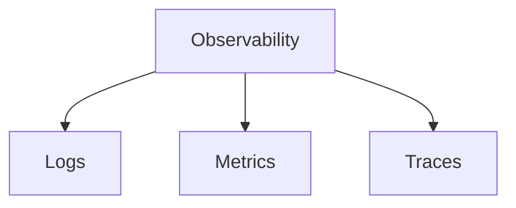
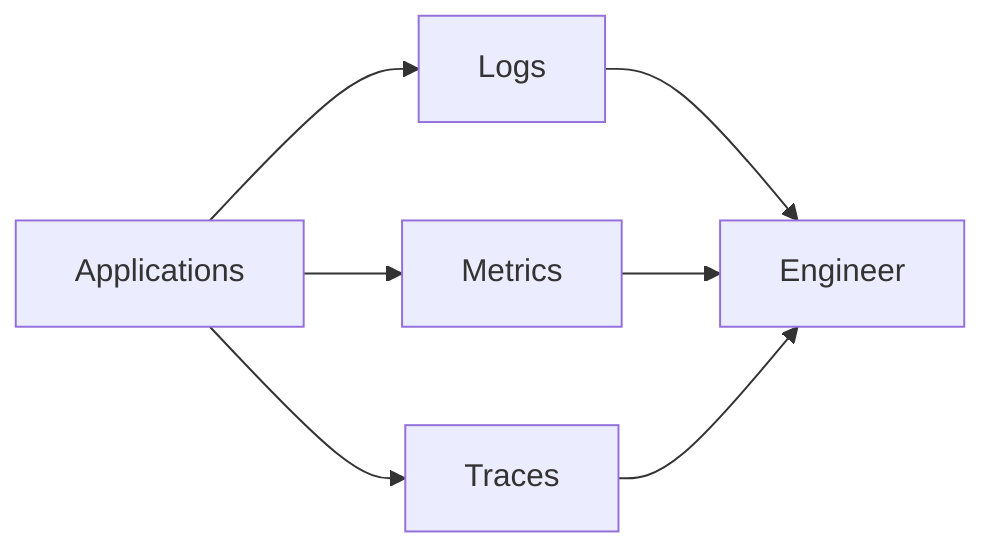
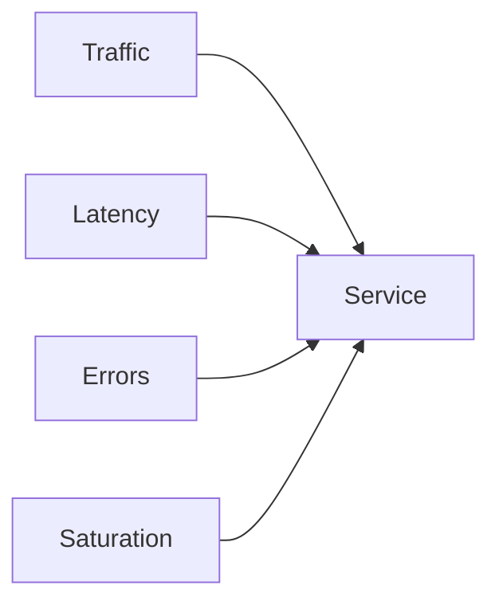
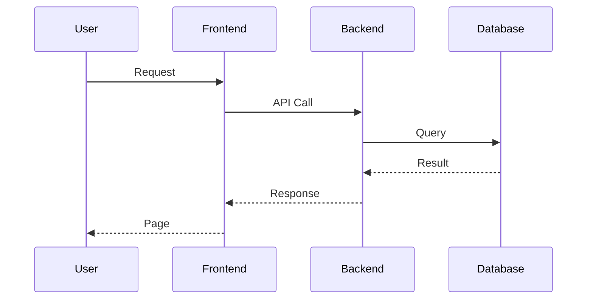
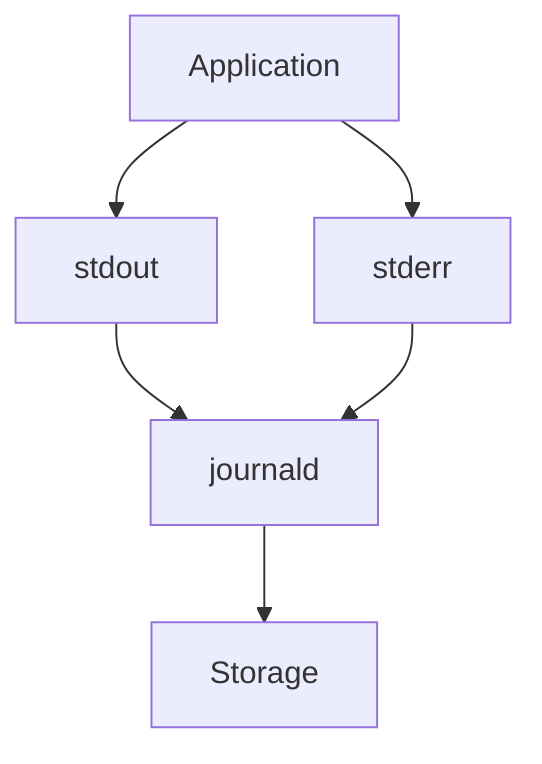

# Linux Log Analysis and Observability

> Intermediate Track — Exercise 06

> **Logs are the memory of a system. Observability is the ability to understand what the system is thinking.**

---

# Why This Exercise Exists

Most production incidents begin with a question:

```text
What happened?
```

Linux answers that question through:

```text
Logs

Metrics

Events

Traces
```

Among these, logs are usually the first source of truth.

When applications fail:

```text
Logs explain why.
```

When services crash:

```text
Logs explain why.
```

When security incidents occur:

```text
Logs provide evidence.
```

When performance degrades:

```text
Logs reveal patterns.
```

Without logs, troubleshooting becomes guessing.

Without observability, operating systems become black boxes.

---

# The Problem This Exercise Solves

Imagine:

```text
Website returns 500 errors.
```

Questions:

```text
Why?

When did it start?

Which service failed?

Which user triggered it?

What changed?

Is the problem still happening?
```

Logs help answer these questions.

Observability helps answer them quickly.

---

# Mental Model

Think of a Linux system as an airplane.

Pilots cannot see:

```text
Engine Internals

Fuel Flow

Hydraulic Pressure

Electrical Systems
```

directly.

Instead they rely on:

```text
Instruments
```

Observability is the instrument panel of software systems.

---

# First Principles

A system can only be managed if it can be observed.

Observation requires:

```text
Data
```

Data comes from:

```text
Logs

Metrics

Events

Traces
```

Together these form modern observability.

---

# Evolution of Operations

```text
Past

Server
 ↓
SSH
 ↓
Read Logs

Present

Server
 ↓
Metrics
Logs
Events
Traces
 ↓
Observability Platform
```

---

# The Three Pillars of Observability



---

# What Are Logs?

Logs are records of events.

Examples:

```text
Application Started

User Logged In

Database Connected

Request Failed

Disk Full

Authentication Failed
```

Logs provide context.

---

# What Are Metrics?

Metrics provide measurements.

Examples:

```text
CPU Usage

Memory Usage

Request Rate

Error Rate

Latency
```

Metrics answer:

```text
How much?
```

---

# What Are Traces?

Traces follow requests through systems.

Example:

```text
User Request

Frontend
 ↓
Backend
 ↓
Database
 ↓
Cache
 ↓
Response
```

Traces answer:

```text
Where is time being spent?
```

---

# Linux Logging Architecture

```mermaid
flowchart TD

Applications

--> journald

Applications

--> Log Files

Kernel

--> journald

System Services

--> journald

journald

--> Persistent Storage
```

---

# Observability Architecture



---

# Lab Environment Setup

Create workspace:

```bash
mkdir -p ~/observability-lab
cd ~/observability-lab
```

Create sample log:

```bash
cat > application.log << EOF
INFO Application Started
INFO Database Connected
INFO User Login
WARNING Memory Usage High
ERROR Database Timeout
INFO Request Completed
ERROR Payment Failure
INFO User Logout
EOF
```

---

# Exercise 1 — Understanding System Logs

View system logs:

```bash
journalctl
```

Recent logs:

```bash
journalctl -n 50
```

Follow logs:

```bash
journalctl -f
```

---

# Why journalctl Matters

Modern Linux systems use:

```text
systemd-journald
```

which centralizes logs.

Instead of searching many files:

```text
One interface

Many sources
```

---

# Exercise 2 — View Service Logs

Inspect SSH:

```bash
journalctl -u ssh
```

Inspect Nginx:

```bash
journalctl -u nginx
```

Inspect Docker:

```bash
journalctl -u docker
```

---

# Investigation Questions

Determine:

```text
When did service start?

Any failures?

Any warnings?

Unexpected restarts?
```

---

# Exercise 3 — Search Logs

Search errors:

```bash
journalctl -p err
```

Search warnings:

```bash
journalctl -p warning
```

---

# Why Severity Levels Matter

Common priorities:

```text
DEBUG

INFO

NOTICE

WARNING

ERROR

CRITICAL
```

Visualization:

```text
INFO
  ↓
WARNING
  ↓
ERROR
  ↓
CRITICAL
```

---

# Exercise 4 — Analyze Application Logs

Search:

```bash
grep ERROR application.log
```

Count:

```bash
grep ERROR application.log | wc -l
```

Find warnings:

```bash
grep WARNING application.log
```

---

# Investigation Goal

Answer:

```text
How many failures occurred?

What type?

How frequently?
```

---

# Exercise 5 — Build Error Statistics

Create:

```bash
grep ERROR application.log | sort | uniq -c
```

Example output:

```text
2 ERROR Database Timeout
1 ERROR Payment Failure
```

---

# Why Aggregation Matters

Thousands of logs become:

```text
Actionable Information
```

instead of noise.

---

# Log Analysis Workflow

```mermaid
flowchart TD

Logs

--> Filter

--> Aggregate

--> Analyze

--> Root Cause
```

---

# Exercise 6 — Investigate Authentication Events

View authentication logs:

Ubuntu:

```bash
sudo less /var/log/auth.log
```

RHEL:

```bash
sudo less /var/log/secure
```

Search:

```bash
grep "Failed password" /var/log/auth.log
```

---

# Security Investigation Example

Questions:

```text
Who attempted login?

How often?

From where?

Was access granted?
```

---

# Exercise 7 — Investigate Boot Events

View current boot:

```bash
journalctl -b
```

Previous boot:

```bash
journalctl -b -1
```

---

# Why This Matters

Investigating:

```text
Unexpected Reboot

Kernel Panic

Crash Recovery
```

often starts here.

---

# Exercise 8 — Investigate Service Failures

Run:

```bash
systemctl status SERVICE
```

Then:

```bash
journalctl -u SERVICE
```

---

# Production Flow

```mermaid
flowchart TD

Service Failure

--> systemctl status

--> journalctl

--> Error Analysis

--> Root Cause
```

---

# Exercise 9 — Investigate Kernel Messages

View:

```bash
dmesg
```

Recent:

```bash
dmesg | tail
```

---

# What dmesg Reveals

Kernel-level events:

```text
Hardware Errors

Driver Problems

Disk Failures

Memory Issues

Network Problems
```

---

# Exercise 10 — Follow Live Logs

Open terminal:

```bash
tail -f application.log
```

Second terminal:

```bash
echo "ERROR Payment Failed" >> application.log
```

Observe live updates.

---

# Why Real-Time Logs Matter

Engineers often investigate incidents while they happen.

Live log monitoring is essential.

---

# Exercise 11 — Investigate Slow Systems

Check:

```bash
journalctl | grep timeout
```

Search:

```bash
journalctl | grep slow
```

Search:

```bash
journalctl | grep error
```

---

# Pattern Recognition

Engineers look for:

```text
Repeated Errors

Increasing Frequency

Timing Correlation

Dependency Failures
```

---

# Exercise 12 — Log Correlation

Imagine:

```text
Application Error

Database Error

Network Error
```

occurring at:

```text
14:22
```

Correlation suggests relationship.

---

# Timeline Analysis

```text
14:21 Database Slow

14:22 Database Timeout

14:22 Application Error

14:22 User Failure
```

Logs reveal causality.

---

# Observability Beyond Logs

Logs alone are insufficient.

Example:

```text
Application Slow
```

Logs may show nothing.

Metrics reveal:

```text
CPU 100%

Memory Exhausted

Latency Increased
```

---

# Metrics Investigation

Common metrics:

```text
CPU

Memory

Disk

Network

Requests

Errors

Latency
```

---

# The Four Golden Signals

Popularized by SRE practices:

```text
Latency

Traffic

Errors

Saturation
```

---

# Golden Signals Visualization



---

# Exercise 13 — Observe Metrics

Commands:

```bash
top

htop

vmstat

iostat

free -h
```

Correlate metrics with logs.

---

# Example Investigation

Logs:

```text
ERROR Database Timeout
```

Metrics:

```text
Disk Latency 500ms
```

Likely root cause:

```text
Storage Bottleneck
```

---

# Exercise 14 — Understand Tracing

Imagine:

```text
User Request
```

travels:

```text
Frontend

Backend

Authentication

Database

Cache
```

Where is delay?

Tracing answers this.

---

# Distributed Trace Visualization



---

# Production Incident Simulation #1

## Report

```text
Website Returns 500 Errors
```

Tasks:

```bash
journalctl -u nginx

journalctl -u application

grep ERROR
```

Determine root cause.

---

# Production Incident Simulation #2

## Report

```text
Users Cannot Login
```

Investigate:

```bash
grep Failed /var/log/auth.log

journalctl
```

---

# Production Incident Simulation #3

## Report

```text
Server Rebooted Overnight
```

Investigate:

```bash
journalctl -b -1

dmesg
```

---

# Production Incident Simulation #4

## Report

```text
Application Slow
```

Correlate:

```bash
journalctl

top

iostat

vmstat
```

---

# Linux Internals

Log flow:



Understanding this explains container logging as well.

---

# Docker Connection

View container logs:

```bash
docker logs CONTAINER
```

Follow:

```bash
docker logs -f CONTAINER
```

Search:

```bash
docker logs CONTAINER | grep ERROR
```

---

# Why Containers Rely on Logs

Containers are often ephemeral.

Logs become primary evidence.

---

# Kubernetes Connection

View pod logs:

```bash
kubectl logs POD
```

Follow:

```bash
kubectl logs -f POD
```

Previous container:

```bash
kubectl logs --previous POD
```

---

# Kubernetes Investigation Pattern

```text
CrashLoopBackOff
```

usually leads to:

```bash
kubectl logs
```

first.

---

# Cloud Engineering Connection

Cloud observability platforms:

```text
CloudWatch

Azure Monitor

Google Cloud Operations
```

build on the same principles.

---

# Security Considerations

Logs may contain:

```text
Passwords

Tokens

API Keys

Customer Data
```

Engineers must:

```text
Protect Logs

Rotate Logs

Restrict Access
```

---

# Log Retention

Questions:

```text
How long should logs be kept?

Where are they stored?

How are they archived?
```

These are operational concerns.

---

# Common Mistakes

## Mistake 1

Reading logs without a hypothesis.

---

## Mistake 2

Ignoring timestamps.

---

## Mistake 3

Investigating only one service.

---

## Mistake 4

Looking only at errors.

Warnings often reveal root causes.

---

## Mistake 5

Treating logs as observability.

Logs are only one component.

---

# Engineering Mindset

Beginners ask:

```text
What command shows logs?
```

Engineers ask:

```text
What story are the logs telling?

What changed?

What pattern exists?

What evidence supports my hypothesis?
```

---

# Interview Questions

## Intermediate

1. What is journalctl?
2. How would you investigate a failed service?
3. Difference between logs and metrics?
4. What is log correlation?
5. Why are timestamps important?

---

## Advanced

6. Explain the three pillars of observability.
7. How would you investigate a production outage using logs?
8. What are the four golden signals?
9. Why are traces useful in distributed systems?
10. How does container logging work?

---

# Observability Cheat Sheet

```bash
journalctl

journalctl -f

journalctl -n 50

journalctl -u SERVICE

journalctl -b

journalctl -b -1

journalctl -p err

dmesg

tail -f FILE

grep ERROR FILE

grep WARNING FILE

docker logs CONTAINER

kubectl logs POD
```

---

# Capstone Challenge

A production platform experiences:

```text
Intermittent Errors

Slow Responses

User Complaints

Occasional Service Restarts
```

Perform a complete observability investigation.

Collect:

```text
Logs

Metrics

Events

Evidence
```

Build:

```text
Timeline

Correlation Analysis

Root Cause

Remediation Plan

Verification
```

Do not guess.

Use evidence.

---

# Completion Criteria

You successfully complete this exercise when you can:

✓ Investigate Linux logs systematically

✓ Use journalctl effectively

✓ Correlate logs across services

✓ Understand observability fundamentals

✓ Connect logs, metrics, and traces

✓ Analyze production incidents using evidence

✓ Apply the same techniques to Docker, Kubernetes, cloud platforms, and distributed systems

Congratulations.

You have learned one of the most important skills in modern systems engineering: transforming raw operational data into understanding.
