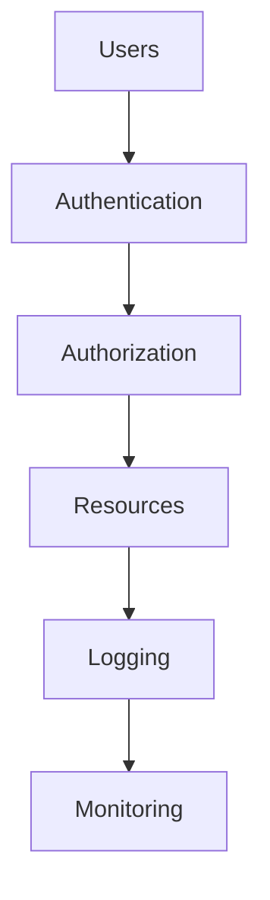
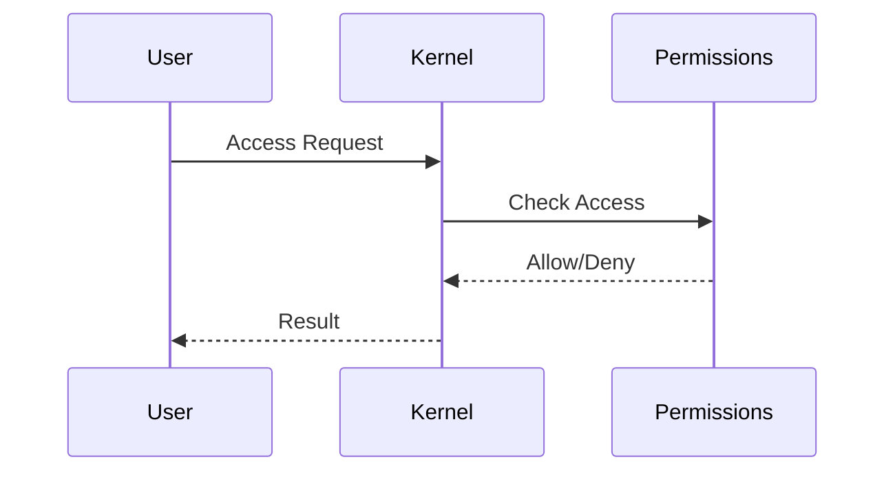

# Linux Security Investigation and Hardening

> Intermediate Track — Exercise 07

> **Security is not a feature. Security is a property of the entire system.**

---

# Why This Exercise Exists

Most engineers think security means:

```text id="u4n7pf"
Strong Passwords

Firewalls

Antivirus
```

Linux engineers know security is much deeper.

Security involves:

```text id="vk4yd3"
Identity

Authentication

Authorization

Least Privilege

Process Isolation

Network Exposure

Secrets Management

System Hardening

Monitoring

Incident Response
```

A Linux server is constantly exposed to:

```text id="kqlw0f"
Internet Scanning

Credential Attacks

Privilege Escalation Attempts

Misconfigurations

Supply Chain Risks

Insider Threats

Malware

Data Theft
```

This exercise teaches how to investigate security issues and systematically harden Linux systems.

---

# The Problem This Exercise Solves

Imagine receiving an alert:

```text id="i8q6jy"
Suspicious Login Detected
```

Questions immediately arise:

```text id="d2gwxy"
Who logged in?

From where?

What did they access?

Did they gain privileges?

Did they modify files?

Is the system compromised?
```

Without investigation skills:

```text id="g5n2ot"
You guess.
```

With security investigation skills:

```text id="quqcrv"
You collect evidence.
```

---

# Mental Model

Think of a Linux system as a fortress.

```text id="r0ezdc"
Walls      = Firewalls

Doors      = Services

Keys       = Credentials

Guards     = Authentication

Rooms      = Files

Vaults     = Secrets

Watchtowers = Monitoring
```

Security is ensuring only authorized people enter authorized places.

---

# First Principles

Security ultimately answers four questions:

```text id="y3b4wa"
Who are you?

What are you allowed to do?

What did you do?

How do we verify it?
```

Everything else builds on these principles.

---

# The Security Pyramid

```text id="m4z1kq"
Monitoring
    ▲
Hardening
    ▲
Access Control
    ▲
Authentication
    ▲
Identity
```

Weak foundations make higher layers ineffective.

---

# Security Investigation Framework

```mermaid id="2q6vpa"
flowchart TD

Alert

--> Evidence Collection

--> Validation

--> Scope Determination

--> Root Cause

--> Containment

--> Recovery

--> Hardening

--> Monitoring
```

---

# Linux Security Architecture



---

# Lab Environment Setup

Create workspace:

```bash id="7jylw9"
mkdir -p ~/security-lab
cd ~/security-lab
```

Create test files:

```bash id="my0r4v"
touch confidential.txt

touch payroll.db

touch customer-data.csv
```

---

# Exercise 1 — Identify User Accounts

View current identity:

```bash id="br2x3k"
whoami
```

Inspect:

```bash id="xz1rde"
id
```

List users:

```bash id="6m79fd"
cat /etc/passwd
```

---

# Investigation Questions

Identify:

```text id="u2u9ev"
System Accounts

Human Accounts

Service Accounts
```

---

# Why This Matters

Many compromises begin with:

```text id="zj1bbm"
Weak Accounts

Unused Accounts

Forgotten Accounts
```

---

# Exercise 2 — Investigate Privileged Users

Check sudo access:

```bash id="s3q9pm"
getent group sudo
```

Or:

```bash id="e4n2rz"
sudo cat /etc/sudoers
```

---

# Questions

Who can become root?

Who should not have access?

---

# Principle of Least Privilege

Never grant:

```text id="tr4j8u"
More Access Than Necessary
```

This is one of the most important security principles.

---

# Exercise 3 — Investigate Authentication Logs

Ubuntu:

```bash id="xw84lb"
sudo less /var/log/auth.log
```

RHEL:

```bash id="9vh2m7"
sudo less /var/log/secure
```

Search failed logins:

```bash id="e8wzj3"
grep "Failed password" /var/log/auth.log
```

---

# Questions

Determine:

```text id="l7p1fz"
Failed Attempts

Successful Logins

Repeated Sources

Suspicious Patterns
```

---

# Security Investigation Workflow

```mermaid id="5ovsp0"
flowchart TD

Login Alert

--> Authentication Logs

--> User Activity

--> Commands Executed

--> Scope Analysis

--> Conclusions
```

---

# Exercise 4 — Investigate Active Sessions

View logged-in users:

```bash id="g2c1zi"
who
```

More detail:

```bash id="z0m5av"
w
```

---

# Questions

Who is connected?

From where?

Doing what?

---

# Why Active Session Monitoring Matters

Compromised accounts often reveal themselves through:

```text id="0n3i8f"
Unexpected Sessions

Unknown IPs

Unusual Activity
```

---

# Exercise 5 — Investigate Open Network Ports

Run:

```bash id="h9wq2u"
ss -tulpn
```

---

# Questions

Which services are exposed?

Which ports are unnecessary?

---

# Attack Surface Mental Model

Every open port is:

```text id="n7k0qf"
A Door
```

More doors:

```text id="l3r4kj"
More Risk
```

---

# Exercise 6 — Investigate Running Processes

Run:

```bash id="e0zp5m"
ps aux
```

Search:

```bash id="5yr2x8"
ps aux --sort=-%cpu
```

---

# Investigation Questions

Look for:

```text id="d9z3tp"
Unexpected Processes

Unknown Binaries

Resource Abuse

Cryptomining Indicators
```

---

# Exercise 7 — Investigate Listening Services

List services:

```bash id="3b8nwu"
systemctl list-units --type=service
```

Inspect:

```bash id="a7u5hd"
systemctl status SERVICE
```

---

# Questions

Is every service required?

Can any be disabled?

---

# Hardening Principle

If a service is not needed:

```text id="o2tv9z"
Disable It
```

Unused software increases attack surface.

---

# Exercise 8 — Investigate File Permissions

Inspect:

```bash id="2d5f3m"
ls -la
```

Search world-writable files:

```bash id="89pn2e"
find / -type f -perm -002 2>/dev/null
```

---

# Why This Matters

World-writable files often enable:

```text id="l8cv73"
Privilege Escalation

Tampering

Persistence
```

---

# Exercise 9 — Investigate Sensitive Files

Inspect:

```bash id="4g8r0q"
ls -l /etc/passwd
```

Inspect:

```bash id="qz5w4f"
ls -l /etc/shadow
```

---

# Questions

Why are permissions different?

What data is being protected?

---

# Security Thinking

Not all files have equal value.

Examples:

```text id="q0d4ln"
Public Configurations

Private Keys

Database Credentials

Password Hashes
```

Require different protections.

---

# Exercise 10 — Investigate SUID Programs

Search:

```bash id="v3t9cm"
find / -perm -4000 2>/dev/null
```

---

# What Is SUID?

Allows execution:

```text id="b6t4ek"
With File Owner Privileges
```

instead of:

```text id="h5m3cq"
User Privileges
```

---

# Why SUID Matters

Misconfigured SUID binaries are common privilege escalation vectors.

---

# Visualization

```text id="r4o7gv"
Normal Program
User
 ↓
Program

SUID Program
User
 ↓
Program
 ↓
Owner Privileges
```

---

# Exercise 11 — Investigate Scheduled Tasks

View cron jobs:

```bash id="q7w9pn"
crontab -l
```

System-wide:

```bash id="5e4h9z"
ls /etc/cron*
```

---

# Investigation Goal

Find:

```text id="z8x5gn"
Unexpected Jobs

Persistence Mechanisms

Malicious Automation
```

---

# Exercise 12 — Investigate Recent Changes

View recently modified files:

```bash id="g4r6j1"
find /etc -mtime -1
```

---

# Questions

What changed?

Who changed it?

Should it have changed?

---

# Why Change Tracking Matters

Most incidents involve:

```text id="w0m3cx"
A Change
```

Understanding changes often reveals root cause.

---

# Exercise 13 — Firewall Investigation

Ubuntu:

```bash id="q6n1sk"
sudo ufw status
```

General:

```bash id="v5c8hy"
sudo iptables -L
```

---

# Questions

Which ports are allowed?

Which should be blocked?

---

# Security Principle

Default stance:

```text id="a2e5vz"
Deny by Default
```

Allow only required traffic.

---

# Exercise 14 — SSH Hardening Review

Inspect:

```bash id="6v7s0p"
sudo cat /etc/ssh/sshd_config
```

Review:

```text id="2z5e4w"
PermitRootLogin

PasswordAuthentication

PubkeyAuthentication
```

---

# Recommended Practices

```text id="o5g9xv"
Disable Root Login

Use SSH Keys

Limit Access

Enable Logging
```

---

# Exercise 15 — Audit Installed Software

Ubuntu:

```bash id="u8r6b3"
apt list --installed
```

RHEL:

```bash id="g1m4vx"
rpm -qa
```

---

# Investigation Questions

Identify:

```text id="v7z2kr"
Unused Packages

Unexpected Software

Potential Risk
```

---

# Security Hardening Checklist

```text id="9n3uqx"
Remove Unused Packages

Disable Unused Services

Restrict SSH

Limit Sudo Access

Apply Updates

Monitor Logs

Restrict Network Exposure
```

---

# Linux Hardening Architecture

```mermaid id="d7r8wh"
flowchart TD

Identity

--> Authentication

Authentication

--> Authorization

Authorization

--> Service Exposure

Service Exposure

--> Monitoring

Monitoring

--> Incident Response
```

---

# Production Incident Simulation #1

## Alert

```text id="l1p9vt"
Multiple Failed SSH Logins
```

Investigate:

```bash id="2e6s9m"
grep Failed /var/log/auth.log

who

w
```

Determine:

```text id="j0n4qw"
Attack?

User Error?

Brute Force Attempt?
```

---

# Production Incident Simulation #2

## Alert

```text id="s7z5fr"
Unknown Process Running
```

Investigate:

```bash id="x4w1bn"
ps aux

pstree

lsof
```

Determine legitimacy.

---

# Production Incident Simulation #3

## Alert

```text id="p9v7gh"
Sensitive Data Exposure
```

Investigate:

```bash id="d6m2uy"
Permissions

Ownership

Access Logs
```

---

# Production Incident Simulation #4

## Alert

```text id="h8r4ez"
Unexpected Port Open
```

Investigate:

```bash id="r1x7lw"
ss -tulpn

systemctl

firewall rules
```

---

# Linux Internals

Security checks flow through:



The kernel is the ultimate security enforcement point.

---

# Docker Security Connection

Containers rely on Linux security primitives:

```text id="t4z6vh"
Namespaces

cgroups

Capabilities

User Isolation
```

Investigate:

```bash id="y8q2mn"
docker ps

docker inspect
```

---

# Kubernetes Security Connection

Kubernetes security builds upon Linux:

```text id="e2m7fj"
runAsUser

Capabilities

Seccomp

AppArmor

SELinux
```

Linux fundamentals remain critical.

---

# Cloud Security Connection

Cloud environments still depend on:

```text id="h5v1rq"
Linux Users

Permissions

SSH Security

Service Hardening
```

Cloud security begins with operating system security.

---

# Security Monitoring Mindset

Security is not:

```text id="o8w2px"
Set Once
```

Security is:

```text id="j7n5kr"
Continuous Observation
```

---

# Common Mistakes

## Mistake 1

Running everything as root.

---

## Mistake 2

Ignoring logs.

---

## Mistake 3

Leaving unused services enabled.

---

## Mistake 4

Using password authentication everywhere.

---

## Mistake 5

Granting excessive permissions.

---

## Mistake 6

Assuming internal systems are trusted.

---

# Engineering Mindset

Beginners ask:

```text id="b3v4xj"
How do I secure Linux?
```

Engineers ask:

```text id="s8n6qw"
What assets exist?

What threats exist?

What evidence exists?

What controls reduce risk?
```

---

# Interview Questions

## Intermediate

1. What is the principle of least privilege?
2. How would you investigate failed SSH logins?
3. What is SUID?
4. Why are world-writable files dangerous?
5. How would you reduce attack surface?

---

## Advanced

6. How would you investigate a suspected compromise?
7. Explain Linux authentication and authorization flow.
8. How would you harden a public Linux server?
9. What is privilege escalation?
10. How do containers leverage Linux security features?

---

# Security Investigation Cheat Sheet

```bash id="v4m2sy"
whoami

id

cat /etc/passwd

cat /etc/group

who

w

ss -tulpn

ps aux

systemctl

journalctl

grep Failed /var/log/auth.log

find / -perm -4000

find / -type f -perm -002

iptables -L

ufw status

crontab -l

find /etc -mtime -1
```

---

# Capstone Challenge

A Linux server shows:

```text id="q7k4rz"
Failed Login Attempts

Unexpected Processes

Unknown Open Ports

Configuration Changes

User Complaints
```

Perform a complete security investigation.

Document:

```text id="x5t1pn"
Assets

Evidence

Indicators

Attack Surface

Root Cause

Containment

Recovery

Hardening Plan
```

Act like a security engineer.

Not a command collector.

---

# Completion Criteria

You successfully complete this exercise when you can:

✓ Investigate authentication activity

✓ Audit users and privileges

✓ Identify risky permissions

✓ Analyze service exposure

✓ Investigate suspicious processes

✓ Review firewall and SSH security

✓ Apply Linux hardening principles

✓ Connect Linux security concepts to Docker, Kubernetes, cloud environments, and production systems

Congratulations.

You now understand the foundations of Linux security engineering: investigation, evidence collection, attack surface reduction, and continuous hardening.
