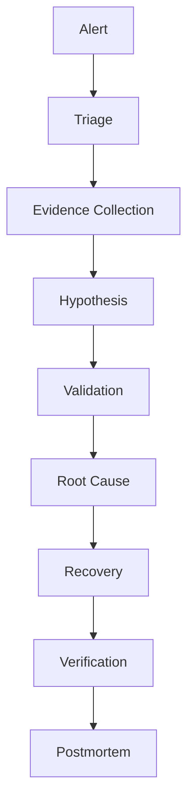
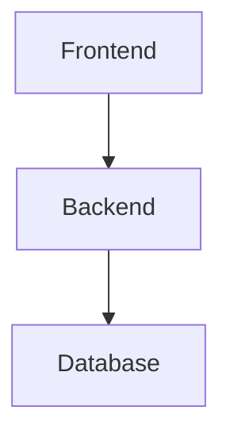

# Production Incident Response Simulations

> Intermediate Track — Exercise 08

> **This exercise combines everything learned so far into realistic production incidents.**

---

# Why This Exercise Exists

Most Linux education teaches:

```text
Commands
Tools
Concepts
Definitions
```

Production engineering is different.

Production engineering teaches:

```text
Decision Making

Investigation

Evidence Collection

Risk Assessment

Communication

Incident Response

Recovery
```

During an outage:

Nobody asks:

"What does grep do?"

Instead they ask:

```text
Why are customers affected?

What is failing?

What changed?

How quickly can we recover?

How do we prevent recurrence?
```

This exercise simulates real incidents.

---

# The Reality of Production

Most outages look like this:

```text
Alert Fires

Confusion Begins

Teams Join Call

Hypotheses Form

Evidence Collected

Root Cause Found

Recovery Performed

Postmortem Written
```

Not:

```text
Run One Command
Fix Problem
Go Home
```

---

# Mental Model

Think of incident response as emergency medicine.

Doctors:

```text
Observe Symptoms

Collect Data

Diagnose

Treat

Monitor Recovery
```

Engineers do exactly the same.

---

# First Principles

Every incident consists of:

```text
Symptoms

Evidence

Impact

Root Cause

Recovery

Prevention
```

Never confuse:

```text
Symptom
```

with:

```text
Root Cause
```

---

# Universal Incident Response Framework



---

# Incident Severity Model

## Severity 1

```text
Complete Outage

Revenue Impact

Customer Impact

Immediate Response Required
```

Examples:

```text
Website Down

Database Unavailable

Authentication Failure
```

---

## Severity 2

```text
Partial Outage

Performance Degradation

Limited Customer Impact
```

---

## Severity 3

```text
Minor Impact

Non-Critical Services
```

---

# Golden Rules During Incidents

## Rule 1

Collect evidence first.

---

## Rule 2

Avoid random changes.

---

## Rule 3

Make one change at a time.

---

## Rule 4

Document everything.

---

## Rule 5

Always verify recovery.

---

# Incident #1 — Website Completely Down

---

## Alert

```text
Customers cannot access website.

HTTP 502 errors reported.

Revenue impact ongoing.
```

---

## Initial Information

Application stack:

```text
Nginx

Backend API

PostgreSQL
```

---

## Investigation Tasks

Check:

```bash
systemctl status nginx

systemctl status backend

systemctl status postgresql
```

Then:

```bash
ss -tulpn

curl localhost

journalctl
```

---

## Questions

Determine:

```text
Which service failed?

What evidence supports it?

What is the root cause?

How should recovery occur?
```

---

# Expected Engineering Thinking

Bad:

```text
Restart Everything
```

Good:

```text
Verify Service Health

Verify Dependencies

Verify Logs

Recover Safely
```

---

# Incident #2 — CPU Usage Reaches 100%

---

## Alert

```text
CPU Usage = 100%

Users report slow response times.
```

---

## Investigation Commands

```bash
top

htop

ps aux --sort=-%cpu

pidstat
```

---

## Questions

Identify:

```text
Which process is consuming CPU?

Expected or unexpected?

Application bug?

Traffic spike?

Background task?
```

---

# Example Root Causes

```text
Infinite Loop

Runaway Script

Traffic Surge

Cryptominer

Poor Query Logic
```

---

# Recovery Decisions

Questions:

```text
Kill Process?

Throttle Process?

Scale Infrastructure?

Fix Application?
```

---

# Incident #3 — Memory Exhaustion

---

## Alert

```text
Applications restarting.

OOM Killer observed.
```

---

## Investigation

```bash
free -h

top

ps aux --sort=-%mem

dmesg
```

---

## Evidence Collection

Look for:

```text
Out Of Memory

Memory Leak

Cache Growth

Unexpected Processes
```

---

# Linux Internals

OOM Killer:

```text
Kernel
 ↓
Memory Exhausted
 ↓
Select Victim
 ↓
Kill Process
```

---

# Questions

Which process was killed?

Why?

Was recovery automatic?

---

# Incident #4 — Disk Full

---

## Alert

```text
Database Writes Failing

Applications Returning Errors
```

---

## Investigation

```bash
df -h

df -i

du -sh /var/*

find / -size +100M
```

---

## Questions

Determine:

```text
Space Exhaustion?

Inode Exhaustion?

Log Explosion?

Backup Growth?
```

---

# Common Root Causes

```text
Logs

Docker Images

Database Dumps

Temporary Files
```

---

# Incident #5 — Service Won't Start

---

## Alert

```text
Backend Service Failed To Start
```

---

## Investigation

```bash
systemctl status backend

journalctl -u backend

journalctl -xe
```

---

## Possible Causes

```text
Bad Configuration

Missing Dependency

Port Conflict

Permission Problem

Missing Environment Variables
```

---

# Recovery Thinking

Determine:

```text
Fix Configuration?

Rollback Deployment?

Restore Dependency?
```

---

# Incident #6 — Database Unreachable

---

## Alert

```text
Application Cannot Connect To Database
```

---

## Investigation

```bash
systemctl status postgresql

ss -tulpn

journalctl -u postgresql

ps aux
```

---

## Questions

Is database:

```text
Running?

Listening?

Accepting Connections?
```

---

# Dependency Analysis



Failure of:

```text
Database
```

affects entire stack.

---

# Incident #7 — DNS Failure

---

## Alert

```text
Applications Cannot Reach External Services
```

---

## Investigation

```bash
ping 8.8.8.8

ping google.com

cat /etc/resolv.conf
```

---

## Logic

If:

```text
IP Works
```

but:

```text
Hostname Fails
```

Likely:

```text
DNS Problem
```

---

# Incident #8 — Network Connectivity Failure

---

## Alert

```text
Users Cannot Reach Application
```

---

## Investigation

```bash
ip addr

ip route

ss -tulpn

traceroute

tcpdump
```

---

## Determine

```text
Interface Problem?

Route Problem?

Firewall Problem?

Application Problem?
```

---

# Incident #9 — Suspicious Login Activity

---

## Alert

```text
Repeated Failed SSH Logins
```

---

## Investigation

```bash
grep Failed /var/log/auth.log

who

w

last
```

---

## Questions

Determine:

```text
Brute Force Attack?

User Mistake?

Compromised Credentials?
```

---

# Security Response Workflow

```mermaid
flowchart TD

Alert

--> Authentication Logs

--> User Activity

--> Scope

--> Containment

--> Recovery
```

---

# Incident #10 — Kubernetes CrashLoopBackOff

---

## Alert

```text
Pod Restarting Repeatedly
```

---

## Investigation

```bash
kubectl get pods

kubectl describe pod

kubectl logs

kubectl logs --previous
```

---

## Questions

Determine:

```text
Application Crash?

OOMKilled?

Configuration Failure?

Dependency Failure?
```

---

# Incident #11 — Docker Container Failure

---

## Alert

```text
Container Exited Unexpectedly
```

---

## Investigation

```bash
docker ps -a

docker logs

docker inspect
```

---

## Root Cause Possibilities

```text
Main Process Crashed

Configuration Error

Permission Problem

Resource Limit
```

---

# Incident #12 — Slow Application

---

## Alert

```text
Response Time Increased
```

---

## Investigation Framework

Check:

```bash
top

free -h

iostat

ss

journalctl
```

---

## Bottleneck Analysis

```mermaid
flowchart TD

Slow Request

--> CPU?

--> Memory?

--> Disk?

--> Network?

--> Database?

--> Root Cause
```

---

# Multi-Layer Incident

---

## Scenario

```text
Website Slow

CPU Normal

Memory Normal

Disk Normal
```

---

## Hidden Cause

```text
External API Latency
```

---

# Engineering Lesson

Not every issue is local.

Always examine:

```text
Dependencies
```

---

# Observability During Incidents

Collect:

```text
Logs

Metrics

Events

Traces
```

---

# Correlation Model

```mermaid
flowchart LR

Logs

--> Evidence

Metrics

--> Evidence

Traces

--> Evidence

Evidence

--> Root Cause
```

---

# Incident Communication

Engineers often overlook communication.

During incidents communicate:

```text
Impact

Current Status

Actions Taken

Expected Recovery Time
```

---

# Example Status Update

```text
Investigating elevated API error rates.

Database connectivity issues identified.

Recovery actions in progress.

Next update in 15 minutes.
```

---

# Incident Timeline Template

```text
09:00 Alert Triggered

09:05 Investigation Started

09:12 Root Cause Identified

09:18 Recovery Started

09:25 Service Restored

09:40 Verification Complete
```

---

# Postmortem Framework

After every incident answer:

```text
What Happened?

Why Did It Happen?

How Was It Detected?

How Was It Resolved?

How Can We Prevent It?
```

---

# Postmortem Template

## Summary

Describe incident.

---

## Impact

Customer impact.

Business impact.

---

## Timeline

Detailed timeline.

---

## Root Cause

Technical explanation.

---

## Recovery

Actions taken.

---

## Prevention

Future improvements.

---

# Common Incident Response Mistakes

## Mistake 1

Restarting before collecting evidence.

---

## Mistake 2

Making multiple changes simultaneously.

---

## Mistake 3

Assuming root cause.

---

## Mistake 4

Ignoring logs.

---

## Mistake 5

Failing to document actions.

---

# Engineering Mindset

Beginners ask:

```text
How do I fix this?
```

Engineers ask:

```text
What is the evidence?

What is the impact?

What is the root cause?

How do we recover safely?

How do we prevent recurrence?
```

---

# Capstone Simulation

A production e-commerce platform experiences:

```text
Website Slow

Intermittent 500 Errors

Database Warnings

High Disk Usage

Customer Complaints
```

Perform a complete incident response.

Document:

```text
Symptoms

Evidence

Hypotheses

Investigation Steps

Root Cause

Recovery Actions

Verification

Postmortem

Prevention Plan
```

---

# Interview Questions

## Intermediate

1. What are the stages of incident response?
2. How would you investigate a website outage?
3. Why should evidence be collected before restarting services?
4. How would you determine root cause?
5. What should be included in a postmortem?

---

## Advanced

6. Describe your incident response methodology.
7. How do you distinguish symptoms from causes?
8. How would you manage communication during a Sev-1 outage?
9. How do observability tools help during incidents?
10. How do you prevent recurring incidents?

---

# Incident Response Cheat Sheet

```bash
systemctl status

journalctl

top

htop

free -h

df -h

df -i

du -sh

ps aux

ss -tulpn

ip addr

ip route

ping

traceroute

tcpdump

docker logs

kubectl logs
```

---

# Completion Criteria

You successfully complete this exercise when you can:

✓ Triage incidents systematically

✓ Gather evidence before acting

✓ Correlate logs, metrics, and traces

✓ Identify root causes

✓ Recover services safely

✓ Verify recovery

✓ Communicate effectively

✓ Write useful postmortems

✓ Apply Linux troubleshooting skills to Docker, Kubernetes, cloud infrastructure, and distributed systems

Congratulations.

You have completed the Intermediate Incident Response track and are now thinking like a production engineer rather than a Linux command user.
