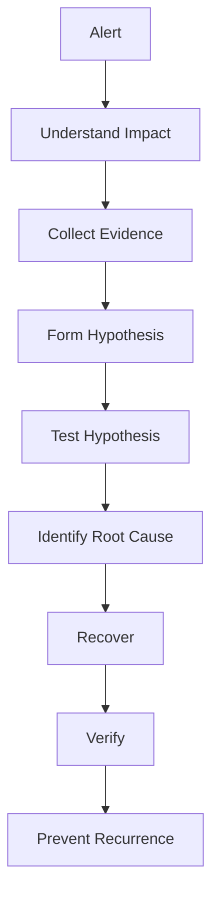
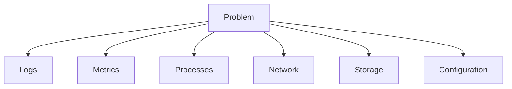
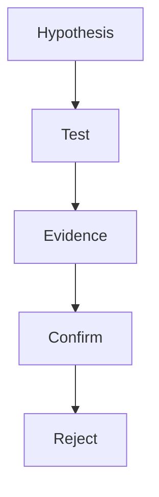

# Production Troubleshooting Methodology

> Troubleshooting Track — Exercise 01

> **The difference between a Linux user and a production engineer is not command knowledge. It is the ability to systematically find the truth during failure.**

---

# Why This Exercise Exists

Most engineers learn Linux commands.

Few learn troubleshooting.

During an outage nobody asks:

```text
What does grep do?
```

Instead they ask:

```text
Why is production down?

Why are customers affected?

What changed?

What is failing?

How do we recover safely?
```

This file teaches the engineering methodology behind troubleshooting.

---

# The Real Goal Of Troubleshooting

Most beginners think:

```text
Troubleshooting = Fixing
```

Wrong.

Troubleshooting is:

```text
Understanding
```

Fixing comes later.

---

# Mental Model

Imagine a doctor.

A good doctor does not immediately prescribe medicine.

They:

```text
Observe Symptoms

Collect Evidence

Form Hypotheses

Perform Tests

Identify Cause

Treat Patient
```

Linux troubleshooting follows the exact same process.

---

# First Principles

Every incident contains:

```text
Symptoms

Evidence

Impact

Root Cause

Recovery

Prevention
```

---

# Critical Rule

Never confuse:

```text
Symptom
```

with:

```text
Root Cause
```

---

# Example

Symptom:

```text
Website Slow
```

Possible causes:

```text
CPU Saturation

Memory Pressure

Disk Latency

Database Failure

DNS Failure

Network Packet Loss
```

The symptom is not the cause.

---

# Universal Troubleshooting Framework



---

# Stage 1 — Understand Impact

Before touching systems ask:

```text
Who Is Affected?

What Is Broken?

When Did It Start?

How Severe Is It?
```

---

# Severity Model

## Sev-1

```text
Production Down

Revenue Impact

Customer Impact
```

---

## Sev-2

```text
Partial Outage

Performance Issues
```

---

## Sev-3

```text
Minor Impact

No Customer Impact
```

---

# Exercise 1

Given:

```text
Website Returns 500 Errors
```

Document:

```text
Who Is Affected?

Which Services?

Business Impact?

Technical Impact?
```

---

# Stage 2 — Collect Evidence

Most engineers fail here.

Bad workflow:

```text
Problem

↓

Restart Everything
```

Good workflow:

```text
Problem

↓

Collect Evidence
```

---

# Why Evidence Matters

Restarting can destroy:

```text
Logs

Memory State

Network Connections

Temporary Files

Crash Information
```

---

# Evidence Categories

```text
Logs

Metrics

Events

Traces

Configuration

Process State
```

---

# Investigation Sources



---

# Exercise 2

Investigate current system:

```bash
uptime

top

free -h

df -h
```

Record observations.

---

# Stage 3 — Form Hypotheses

Good engineers create theories.

Example:

```text
Website Slow
```

Hypothesis A:

```text
CPU Saturation
```

Hypothesis B:

```text
Database Slow
```

Hypothesis C:

```text
Network Latency
```

---

# Important Rule

Multiple hypotheses are normal.

One assumption is dangerous.

---

# Stage 4 — Validate Hypotheses

Every hypothesis must be tested.

Example:

Hypothesis:

```text
CPU Saturation
```

Test:

```bash
top

pidstat
```

Evidence supports?

```text
Yes / No
```

---

# Scientific Troubleshooting



---

# Exercise 3

Create three possible causes for:

```text
Database Timeout
```

and list evidence required to validate each.

---

# Stage 5 — Root Cause Analysis

Root cause is:

```text
The Fundamental Reason
The Incident Occurred
```

---

# Example

Wrong:

```text
Nginx Failed
```

Better:

```text
Disk Full Caused
Nginx Log Writes To Fail
Which Prevented Startup
```

---

# Root Cause Tree

```mermaid
flowchart TD

Website Down

--> Nginx Down

--> Disk Full

--> Log Explosion

--> Missing Log Rotation
```

---

# Stage 6 — Recovery

Recovery should be:

```text
Controlled

Documented

Verifiable
```

---

# Dangerous Recovery

```text
Restart Random Services

Delete Files

Change Configurations
```

without understanding impact.

---

# Safe Recovery

```text
Evidence Collected

Root Cause Known

Recovery Executed

Verification Performed
```

---

# Stage 7 — Verification

Never assume recovery succeeded.

Verify:

```text
Metrics

Logs

Customer Experience

Service Health
```

---

# Verification Workflow

```mermaid
flowchart TD

Recovery

--> Service Check

--> Metrics

--> Logs

--> Customer Validation
```

---

# Stage 8 — Prevention

The best troubleshooting ends with:

```text
How Do We Prevent This Again?
```

---

# Example

Incident:

```text
Disk Full
```

Prevention:

```text
Log Rotation

Storage Monitoring

Alerts
```

---

# The Five Fundamental Bottlenecks

Almost every Linux problem becomes:

```text
CPU

Memory

Storage

Network

Application
```

---

# Troubleshooting Decision Tree

```mermaid
flowchart TD

System Slow

--> CPU

--> Memory

--> Storage

--> Network

--> Application
```

---

# Golden Production Rules

## Rule 1

Collect evidence first.

---

## Rule 2

One change at a time.

---

## Rule 3

Document everything.

---

## Rule 4

Never trust assumptions.

---

## Rule 5

Verify recovery.

---

# Linux Investigation Toolkit

## CPU

```bash
top
htop
pidstat
mpstat
```

---

## Memory

```bash
free -h
vmstat
pmap
```

---

## Storage

```bash
df -h
du -sh
iostat
iotop
```

---

## Network

```bash
ss
tcpdump
ping
mtr
```

---

## Services

```bash
systemctl
journalctl
```

---

# Production Example

Alert:

```text
API Latency Increased
```

Investigation:

```text
CPU Normal

Memory Normal

Disk Latency High
```

Root Cause:

```text
Storage Saturation
```

Recovery:

```text
Remove Backup Load
```

Prevention:

```text
Storage Monitoring
```

---

# Common Troubleshooting Mistakes

## Mistake 1

Restarting immediately.

---

## Mistake 2

Ignoring logs.

---

## Mistake 3

Assuming root cause.

---

## Mistake 4

Making multiple changes.

---

## Mistake 5

Failing to verify.

---

# Engineering Mindset

Beginners ask:

```text
How Do I Fix This?
```

Engineers ask:

```text
What Is The Evidence?

What Is The Impact?

What Is The Root Cause?

What Is The Safest Recovery?
```

---

# Interview Questions

1. What is the difference between a symptom and a root cause?
2. Describe your troubleshooting methodology.
3. Why collect evidence before restarting services?
4. How do you validate a hypothesis?
5. What should a postmortem contain?
6. What are the major Linux bottleneck categories?
7. How do you avoid troubleshooting bias?
8. Why is verification important?
9. What is incident severity?
10. How do you prevent recurrence?

---

# Troubleshooting Cheat Sheet

```text
Observe

Measure

Collect Evidence

Form Hypotheses

Validate

Identify Root Cause

Recover

Verify

Prevent
```

---

# Capstone Exercise

A production e-commerce system experiences:

```text
Slow Website

Intermittent Errors

Customer Complaints

High Latency
```

Create a complete troubleshooting plan including:

```text
Impact Analysis

Evidence Collection

Hypotheses

Tests

Root Cause Investigation

Recovery Plan

Verification Plan

Prevention Plan
```

---

# Completion Criteria

You successfully complete this exercise when you can:

✓ Distinguish symptoms from root causes

✓ Troubleshoot systematically

✓ Collect useful evidence

✓ Build and test hypotheses

✓ Recover safely

✓ Verify outcomes

✓ Think like a production engineer

Congratulations.

You have learned the most important troubleshooting skill:

**Finding the truth before changing the system.**
