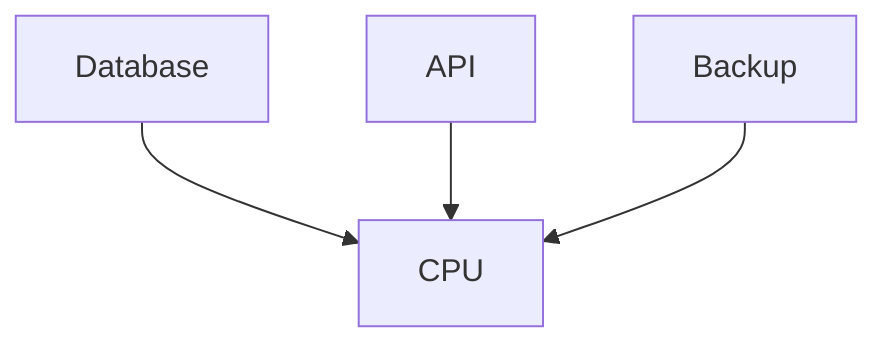
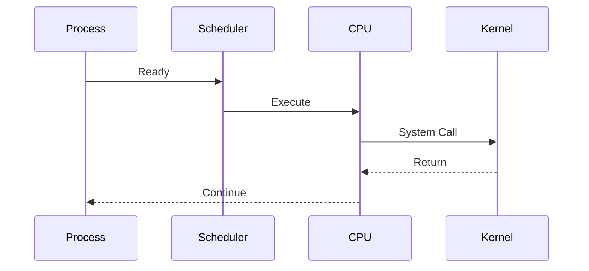

# High CPU Production Incidents

> Troubleshooting Track — Exercise 03

> **High CPU usage is one of the most misunderstood production incidents.**
>
> Many engineers see 100% CPU and immediately assume they found the problem.
>
> In reality, high CPU is often only a symptom of a deeper issue.

---

# Why This Exercise Exists

One of the most common production alerts is:

```text
CPU Usage > 90%
```

Engineers often react by:

```text
Restarting Services

Scaling Servers

Increasing CPU

Adding More Pods
```

Sometimes this works.

Often it does not.

The real question is:

```text
Why Is CPU Busy?
```

Understanding CPU incidents requires understanding:

```text
Linux Scheduler

Processes

Threads

Context Switching

System Calls

Interrupts

Load Average

CPU Saturation

Resource Contention
```

---

# The Problem This Exercise Solves

Imagine a production alert:

```text
CPU Usage = 100%

API Latency Increased

Customer Complaints

Kubernetes Pods Restarting
```

Questions:

```text
Is CPU The Root Cause?

Which Process Is Consuming CPU?

User Space Or Kernel Space?

Application Bug?

Traffic Spike?

Infinite Loop?

Cryptominer?

Scheduler Pressure?
```

This exercise teaches how to systematically answer those questions.

---

# Mental Model

Think of CPU as a factory.

```text
CPU = Workers

Processes = Jobs

Scheduler = Manager

Requests = Customer Orders
```

When workers become busy:

```text
More Work?

Bad Process?

Inefficient Workflow?

Resource Contention?
```

The answer is not always obvious.

---

# First Principles

CPU utilization means:

```text
The Processor Is Executing Instructions
```

But execution may occur in:

```text
User Space

Kernel Space

Interrupt Handling

Context Switching
```

High CPU only tells us:

```text
Something Is Consuming Processing Time
```

---

# Critical Insight

High CPU is not always bad.

Examples:

```text
Database Processing Queries

Video Encoding

Machine Learning Training

Traffic Surge
```

may legitimately use CPU.

The real goal is determining:

```text
Expected

vs

Unexpected
```

CPU usage.

---

# Linux CPU Architecture

```mermaid
flowchart TD

Application

--> Scheduler

Scheduler

--> CPU Core

CPU Core

--> Execute Instructions
```

---

# CPU Investigation Framework

```mermaid
flowchart TD

High CPU

--> Process Analysis

--> Scheduler Analysis

--> Load Analysis

--> System Calls

--> Resource Contention

--> Root Cause
```

---

# Understanding CPU Metrics

Common metrics:

```text
User CPU

System CPU

Idle

I/O Wait

Steal Time
```

---

# User CPU

Represents:

```text
Application Execution
```

Examples:

```text
Python

Node.js

Java

PostgreSQL
```

---

# System CPU

Represents:

```text
Kernel Work
```

Examples:

```text
Networking

Filesystem

Drivers

System Calls
```

---

# I/O Wait

Represents:

```text
CPU Waiting For Storage
```

Important:

```text
High Load

Low CPU

High I/O Wait
```

often indicates:

```text
Storage Problem
```

not CPU problem.

---

# Exercise 1 — Establish System State

Run:

```bash
uptime

top

htop
```

Document:

```text
CPU Usage

Load Average

Top Processes
```

---

# Questions

Is CPU actually saturated?

Or merely busy?

---

# Understanding Load Average

One of the most misunderstood Linux metrics.

Check:

```bash
uptime
```

Example:

```text
load average: 12.5 10.8 8.9
```

---

# Mental Model

Load average measures:

```text
Demand For CPU
```

Not:

```text
Actual CPU Utilization
```

---

# Example

Server:

```text
8 CPUs
```

Load:

```text
8
```

means:

```text
Fully Utilized
```

---

# Load Interpretation

```text
Load < CPU Count

Healthy


Load = CPU Count

Fully Utilized


Load > CPU Count

Queue Growing
```

---

# Exercise 2 — Analyze Load

Run:

```bash
nproc

uptime
```

Compare:

```text
CPU Count

Load Average
```

---

# Process Investigation

High CPU incidents usually begin here.

---

# Exercise 3 — Find Top CPU Consumers

Run:

```bash
ps aux --sort=-%cpu | head
```

or:

```bash
top
```

---

# Questions

Identify:

```text
Process Name

PID

CPU Usage

Owner
```

---

# Investigation Workflow

```mermaid
flowchart TD

High CPU

--> Top Process

--> Expected?

--> Known Service?

--> Investigation
```

---

# Exercise 4 — Investigate Process Details

Inspect:

```bash
ps -fp PID
```

Find:

```text
Parent Process

Command

Execution Context
```

---

# Why Parent Process Matters

Example:

```text
bash

↓

python

↓

worker.py
```

Understanding hierarchy reveals intent.

---

# Thread Analysis

Many applications are multi-threaded.

Inspect:

```bash
top -H -p PID
```

---

# Questions

Single thread?

Multiple threads?

One thread consuming everything?

---

# Context Switching

CPU switches between processes.

Visualization:

```text
Process A

↓

Process B

↓

Process C
```

---

# Why Context Switching Matters

Too many switches:

```text
Reduce Performance
```

even when CPU isn't fully utilized.

---

# Exercise 5 — Observe Scheduler Activity

Install:

```bash
sudo apt install sysstat
```

Run:

```bash
pidstat 1
```

Observe:

```text
CPU

Context Switches

Process Activity
```

---

# Scheduler Investigation

Linux scheduler decides:

```text
Who Runs?

When?

How Long?
```

---

# Questions

Is workload:

```text
CPU Bound?

I/O Bound?

Blocked?
```

---

# User CPU vs System CPU

Run:

```bash
top
```

Observe:

```text
us

sy
```

---

# Interpretation

High:

```text
us
```

often indicates:

```text
Application Activity
```

High:

```text
sy
```

often indicates:

```text
Kernel Activity
```

---

# Exercise 6 — Investigate System CPU

If:

```text
System CPU > 40%
```

Investigate:

```text
Network Activity

Filesystem Activity

Drivers

Interrupts
```

---

# Interrupt Investigation

Hardware generates interrupts.

Examples:

```text
NIC

Disk

USB

CPU Timers
```

---

# View Interrupts

Run:

```bash
cat /proc/interrupts
```

---

# Questions

Unexpected spikes?

One device dominating?

---

# Soft Interrupts

Networking often generates:

```text
Soft IRQs
```

---

# Investigation

Run:

```bash
cat /proc/softirqs
```

---

# Production Example

Symptoms:

```text
High CPU

High Network Traffic
```

Root cause:

```text
Packet Processing
```

---

# Exercise 7 — Investigate CPU Affinity

View CPUs:

```bash
lscpu
```

Pin workload:

```bash
taskset -c 0 COMMAND
```

---

# Why Affinity Matters

Useful for:

```text
Databases

Low-Latency Systems

Trading Platforms
```

---

# CPU Saturation

Occurs when:

```text
Demand > Capacity
```

---

# Visualization

```text
10 Tasks

↓

4 CPUs

↓

Queue Forms
```

---

# Symptoms

```text
Latency

Slow Responses

High Load
```

---

# Exercise 8 — Simulate CPU Saturation

Install:

```bash
sudo apt install stress-ng
```

Run:

```bash
stress-ng --cpu 8
```

Observe:

```bash
top

uptime
```

---

# Questions

How did:

```text
Load

Latency

CPU Usage
```

change?

---

# Infinite Loop Investigation

One of the most common software bugs.

---

# Example

```python
while True:
    pass
```

---

# Symptoms

```text
Single Core 100%

One Process Dominates
```

---

# Investigation

```bash
top

strace -p PID
```

---

# Cryptominer Detection

Common compromise indicator.

Symptoms:

```text
High CPU

Unknown Process

Network Traffic
```

---

# Investigation

```bash
ps aux

lsof -i

pstree
```

---

# Questions

Unknown binary?

Unexpected user?

External connections?

---

# Resource Contention

High CPU may be caused by:

```text
Database

Application

Backup Jobs
```

competing simultaneously.

---

# Visualization



---

# Exercise 9 — Identify Competing Workloads

Document:

```text
Top CPU Consumers

Service Ownership

Business Purpose
```

---

# CPU Profiling

When process identified:

```text
Find Where Time Is Spent
```

---

# Exercise 10 — Use perf

Install:

```bash
sudo apt install linux-tools-common
```

Run:

```bash
sudo perf top
```

---

# Questions

Which functions dominate?

Kernel or application?

Expected behavior?

---

# Production Incident #1

## Alert

```text
CPU 100%
```

Investigate:

```bash
top

pidstat

perf
```

Determine:

```text
Application?

Kernel?

Expected Load?
```

---

# Production Incident #2

## Alert

```text
High CPU After Deployment
```

Investigate:

```text
Code Changes

Traffic

Resource Usage
```

---

# Production Incident #3

## Alert

```text
One Core 100%
```

Investigate:

```text
Thread Analysis

Infinite Loop

Lock Contention
```

---

# Production Incident #4

## Alert

```text
High System CPU
```

Investigate:

```text
Network

Storage

Interrupts
```

---

# Production Incident #5

## Alert

```text
Kubernetes Node CPU Pressure
```

Investigate:

```bash
kubectl top node

kubectl top pod
```

Determine workload source.

---

# Linux Internals Deep Dive

CPU execution path:



Every CPU cycle is spent somewhere.

Your job is finding where.

---

# Docker Connection

Containers use:

```text
Linux Scheduler

Linux CPUs

Linux cgroups
```

High container CPU is a Linux CPU problem.

---

# Kubernetes Connection

Kubernetes CPU limits map to:

```text
Linux cgroups
```

CPU throttling occurs inside the kernel.

---

# Observability Checklist

Gather:

```text
Metrics

Logs

Traces

Deployment History
```

before making changes.

---

# Common Mistakes

## Mistake 1

Assuming CPU is root cause.

---

## Mistake 2

Ignoring load average.

---

## Mistake 3

Ignoring system CPU.

---

## Mistake 4

Ignoring interrupts.

---

## Mistake 5

Restarting before investigation.

---

## Mistake 6

Ignoring recent deployments.

---

# Engineering Mindset

Beginners ask:

```text
Why Is CPU High?
```

Engineers ask:

```text
Who Is Using CPU?

Why?

Expected Or Unexpected?

What Evidence Exists?

What Changed?
```

---

# Interview Questions

1. What causes high CPU utilization?
2. Difference between load average and CPU usage?
3. What is context switching?
4. What is system CPU?
5. What causes high system CPU?
6. How would you investigate CPU saturation?
7. What is CPU affinity?
8. What is a soft interrupt?
9. How would you identify a cryptominer?
10. How do CPU limits work in Kubernetes?

---

# CPU Incident Cheat Sheet

```bash
top

htop

uptime

nproc

ps aux --sort=-%cpu

pidstat

perf top

lscpu

taskset

cat /proc/interrupts

cat /proc/softirqs

strace -p PID
```

---

# Capstone Challenge

A production API platform experiences:

```text
CPU Usage 100%

Load Average 40

API Latency 5 Seconds

Recent Deployment

Customer Complaints
```

Perform a complete CPU incident investigation.

Document:

```text
CPU Metrics

Load Analysis

Process Investigation

Thread Analysis

Scheduler Behavior

Interrupt Analysis

Evidence

Root Cause

Recovery Plan

Prevention Plan
```

---

# Completion Criteria

You successfully complete this exercise when you can:

✓ Distinguish CPU symptoms from root causes

✓ Interpret load average correctly

✓ Investigate top CPU consumers

✓ Analyze scheduler behavior

✓ Understand user vs system CPU

✓ Investigate interrupts and softirqs

✓ Profile workloads

✓ Troubleshoot container and Kubernetes CPU incidents

✓ Perform production-grade CPU investigations

✓ Think like a performance engineer instead of a command operator

Congratulations.

You now understand a critical production engineering truth:

**High CPU is rarely the answer. It is usually the beginning of the investigation.**
