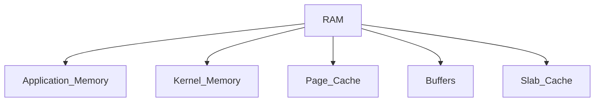

# Memory Pressure and OOM Incidents

> Troubleshooting Track — Exercise 04

> **Memory incidents are among the most dangerous production failures because systems often appear healthy until they suddenly collapse.**
>
> Unlike CPU bottlenecks that usually degrade gradually, memory failures frequently create cascading outages, application crashes, database failures, container restarts, and kernel intervention.

---

# Why This Exercise Exists

Many engineers think:

```text
Memory Usage = Problem
```

But Linux memory management is far more complex.

A server showing:

```text
95% Memory Used
```

may actually be healthy.

Meanwhile:

```text
60% Memory Used
```

can still experience:

```text
OOM Kills

Application Crashes

Swap Thrashing

Node Evictions

Performance Collapse
```

Understanding memory incidents requires understanding:

```text
Virtual Memory

Page Cache

Memory Reclaim

Swap

OOM Killer

cgroups

NUMA

Memory Pressure
```

---

# The Problem This Exercise Solves

Imagine a production alert:

```text
API Pods Restarting

Database Crashing

Node Memory Pressure

OOMKilled Events

Latency Increased
```

Questions:

```text
Is Memory Exhausted?

Who Is Using Memory?

Is Linux Reclaiming Pages?

Is Swap Active?

Which Process Was Killed?

Application Leak?

Container Limit?

Kernel Problem?
```

This exercise teaches systematic memory incident investigation.

---

# Mental Model

Think of memory as a warehouse.

```text
RAM = Active Workspace

Page Cache = Storage Shelf

Swap = Emergency Warehouse

OOM Killer = Emergency Manager
```

When the workspace becomes crowded:

```text
Clean Unused Data?

Move Items To Storage?

Move Items To Swap?

Terminate Workloads?
```

Linux constantly makes these decisions.

---

# First Principles

Memory usage is not:

```text
Free Memory
```

Memory usage is:

```text
Available Memory
```

This distinction is critical.

---

# Critical Insight

Linux intentionally uses memory aggressively.

Unused RAM is considered:

```text
Wasted RAM
```

Linux fills unused memory with:

```text
Page Cache

Buffers

Filesystem Data
```

to improve performance.

---

# Linux Memory Architecture



---

# Memory Investigation Framework

```mermaid
flowchart TD

Memory Alert

--> Memory Usage

--> Available Memory

--> Swap Activity

--> OOM Events

--> Top Consumers

--> Root Cause
```

---

# Understanding Linux Memory Metrics

Run:

```bash
free -h
```

Example:

```text
total

used

free

shared

buff/cache

available
```

---

# Critical Metric

Most beginners focus on:

```text
free
```

Engineers focus on:

```text
available
```

---

# Why Available Memory Matters

Linux can reclaim:

```text
Page Cache

Buffers

Some Cached Objects
```

without killing applications.

---

# Exercise 1 — Establish Baseline

Run:

```bash
free -h

vmstat 1
```

Document:

```text
Total Memory

Available Memory

Swap Usage
```

---

# Questions

Is memory actually exhausted?

Or simply being used efficiently?

---

# Understanding Virtual Memory

Applications believe they own:

```text
Continuous Memory
```

Reality:

```text
Virtual Addresses

↓

Page Tables

↓

Physical Memory
```

---

# Visualization


---

# Why Virtual Memory Exists

Benefits:

```text
Isolation

Security

Efficiency

Memory Overcommit
```

---

# Exercise 2 — Investigate Memory Maps

Run:

```bash
pmap PID
```

Observe:

```text
Virtual Memory

Mapped Regions

Libraries
```

---

# Memory Pressure

Memory pressure occurs when:

```text
Demand > Available Memory
```

before memory is fully exhausted.

---

# Symptoms

```text
Slow Applications

High Latency

Swap Activity

OOM Events

Node Pressure
```

---

# Visualization

```text
Applications

↓↓↓↓↓↓

Available RAM

↓

Pressure Increases
```

---

# Linux Memory Reclaim

When memory becomes scarce:

Linux attempts:

```text
Page Reclaim

Cache Reclaim

Swap Usage
```

before killing processes.

---

# Memory Reclaim Flow

```mermaid
flowchart TD

Memory Pressure

--> Reclaim_Cache

--> Reclaim_Pages

--> Swap

--> OOM_Killer
```

---

# Page Cache

One of the most misunderstood Linux concepts.

Page cache stores:

```text
Recently Accessed Files
```

in RAM.

---

# Why Page Cache Exists

Reading from RAM is faster than:

```text
SSD

NVMe

HDD
```

---

# Exercise 3 — Observe Page Cache

Run:

```bash
cat /proc/meminfo | grep Cached
```

Document:

```text
Cached Memory
```

---

# Important Insight

Large cache usage is often:

```text
Good
```

not bad.

---

# Swap Fundamentals

Swap is:

```text
Disk Used As Memory
```

---

# Visualization

```text
RAM Full

↓

Move Pages To Swap

↓

Free RAM
```

---

# Why Swap Exists

Benefits:

```text
Graceful Degradation

Memory Flexibility
```

---

# Why Swap Can Hurt

Storage is dramatically slower than RAM.

Result:

```text
Latency

Performance Degradation
```

---

# Exercise 4 — Investigate Swap

Run:

```bash
swapon --show

free -h
```

---

# Questions

Swap configured?

Swap heavily used?

Recently activated?

---

# Swap Thrashing

One of the most damaging memory incidents.

Occurs when:

```text
Pages Move Between

RAM

and

Swap
```

continuously.

---

# Symptoms

```text
System Slow

High Disk Activity

Applications Unresponsive
```

---

# Visualization

```text
RAM

↓

Swap

↓

RAM

↓

Swap
```

---

# Exercise 5 — Detect Thrashing

Run:

```bash
vmstat 1
```

Observe:

```text
si

so
```

---

# Interpretation

```text
si = Swap In

so = Swap Out
```

Large values indicate pressure.

---

# Top Memory Consumers

Most investigations begin here.

---

# Exercise 6 — Identify Memory Users

Run:

```bash
ps aux --sort=-%mem | head
```

or:

```bash
top
```

---

# Questions

Which process uses:

```text
Most RAM?
```

Expected?

Unexpected?

---

# Process Memory Investigation

Inspect:

```bash
pmap PID

smem
```

---

# Key Metrics

```text
RSS

PSS

Virtual Memory
```

---

# RSS

Resident Set Size.

Represents:

```text
Actual RAM Used
```

---

# Exercise 7 — Analyze RSS

Identify:

```text
Largest RSS Processes
```

Document findings.

---

# Understanding OOM Killer

The Linux kernel includes:

```text
Out Of Memory Killer
```

---

# Why OOM Exists

When reclaim fails:

```text
Kernel Must Recover Memory
```

---

# OOM Workflow

```mermaid
flowchart TD

Memory Exhausted

--> Reclaim Fails

--> OOM Killer

--> Process Selected

--> Process Terminated
```

---

# Important Insight

OOM is:

```text
A Recovery Mechanism
```

not the root cause.

---

# Exercise 8 — Investigate OOM Events

Run:

```bash
dmesg | grep -i oom
```

or:

```bash
journalctl -k | grep -i oom
```

---

# Questions

Which process died?

Why?

When?

---

# OOMKilled Containers

Common Kubernetes event.

Symptoms:

```text
Pod Restart

Container Exit

Application Failure
```

---

# Root Cause

Usually:

```text
Container Limit Exceeded
```

---

# Exercise 9 — Investigate Container OOM

Docker:

```bash
docker inspect CONTAINER
```

Kubernetes:

```bash
kubectl describe pod POD
```

---

# Questions

Memory limit?

Actual usage?

Leak present?

---

# Memory Leaks

One of the most common causes of OOM incidents.

---

# Definition

Memory allocated but never released.

---

# Visualization

```text
Application Starts

↓

Allocates Memory

↓

Never Frees Memory

↓

Usage Grows

↓

OOM
```

---

# Symptoms

```text
Gradual Growth

Increasing RSS

Periodic Crashes
```

---

# Exercise 10 — Investigate Leak Candidates

Collect:

```bash
ps aux --sort=-%mem

pmap PID
```

at intervals.

Observe trends.

---

# Kernel Memory

Not all memory belongs to applications.

Kernel uses memory for:

```text
Buffers

Networking

Caches

Slab Allocators
```

---

# Slab Investigation

Run:

```bash
slabtop
```

---

# Questions

Large kernel consumers?

Unexpected growth?

---

# NUMA Considerations

Large servers often use:

```text
NUMA

Non-Uniform Memory Access
```

---

# Why It Matters

Memory locality affects:

```text
Latency

Throughput
```

---

# Investigate NUMA

Run:

```bash
numactl --hardware
```

---

# Production Incident #1

## Alert

```text
Application Crashes Every Hour
```

Investigate:

```bash
dmesg

journalctl

memory metrics
```

Determine:

```text
OOM?

Leak?

Limit?
```

---

# Production Incident #2

## Alert

```text
Server Slow

CPU Normal

Disk Busy
```

Investigate:

```bash
vmstat

swap activity
```

Determine:

```text
Swap Thrashing?
```

---

# Production Incident #3

## Alert

```text
Database Restarted
```

Investigate:

```bash
dmesg

memory logs

database memory settings
```

---

# Production Incident #4

## Alert

```text
Kubernetes Pod OOMKilled
```

Investigate:

```bash
kubectl describe pod

kubectl top pod
```

---

# Production Incident #5

## Alert

```text
Node MemoryPressure
```

Investigate:

```bash
kubectl describe node
```

Determine:

```text
Workload Source

Memory Usage

Eviction Risk
```

---

# Linux Internals Deep Dive

Memory access path:

```mermaid
sequenceDiagram

Process->>Virtual Address

Virtual Address->>Page Table

Page Table->>RAM

RAM-->>Process
```

When RAM unavailable:

```text
Swap

Reclaim

OOM
```

enter the picture.

---

# Docker Connection

Containers use:

```text
Linux cgroups
```

for memory limits.

Investigate:

```bash
docker stats
```

---

# Kubernetes Connection

Memory limits map to:

```text
cgroup Memory Limits
```

OOMKilled is ultimately:

```text
Linux Kernel Behavior
```

not Kubernetes behavior.

---

# Observability Checklist

Collect:

```text
Memory Metrics

Swap Metrics

OOM Logs

Container Limits

Application Logs
```

before taking action.

---

# Common Mistakes

## Mistake 1

Assuming high memory usage is bad.

---

## Mistake 2

Ignoring available memory.

---

## Mistake 3

Ignoring page cache.

---

## Mistake 4

Ignoring swap activity.

---

## Mistake 5

Restarting without collecting evidence.

---

## Mistake 6

Treating OOM as root cause.

---

# Engineering Mindset

Beginners ask:

```text
Why Is Memory Full?
```

Engineers ask:

```text
Which Memory?

Application?

Cache?

Kernel?

Swap?

What Is The Pressure Source?
```

---

# Interview Questions

1. What is the difference between used and available memory?
2. What is page cache?
3. Why does Linux use free RAM aggressively?
4. What is swap thrashing?
5. What causes OOM kills?
6. What is RSS?
7. What is virtual memory?
8. How would you investigate a memory leak?
9. How do container memory limits work?
10. Why can a system with free memory still experience pressure?

---

# Memory Incident Cheat Sheet

```bash
free -h

vmstat 1

top

htop

ps aux --sort=-%mem

pmap PID

smem

cat /proc/meminfo

swapon --show

dmesg | grep -i oom

journalctl -k

slabtop

numactl --hardware
```

---

# Capstone Challenge

A production Kubernetes cluster reports:

```text
Pods Restarting

Node MemoryPressure

OOMKilled Events

API Latency Increased

Database Crashes
```

Perform a complete memory incident investigation.

Document:

```text
Memory Metrics

Available Memory

Page Cache

Swap Usage

Top Consumers

OOM Events

Container Limits

Evidence

Root Cause

Recovery Plan

Prevention Plan
```

---

# Completion Criteria

You successfully complete this exercise when you can:

✓ Explain Linux memory architecture

✓ Distinguish memory usage from memory pressure

✓ Investigate swap activity

✓ Analyze page cache behavior

✓ Identify memory leaks

✓ Investigate OOM incidents

✓ Troubleshoot container and Kubernetes memory failures

✓ Understand kernel memory consumers

✓ Perform production-grade memory investigations

✓ Think like a Linux performance engineer

Congratulations.

You now understand one of the most important realities of Linux systems:

**Memory problems rarely begin when memory runs out. They begin when the kernel starts fighting for memory.**
