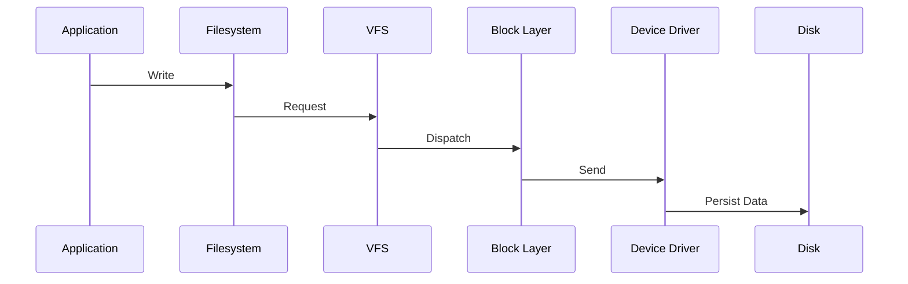

# Disk Full and Storage Failures

> Troubleshooting Track — Exercise 05

> **Storage failures are among the most deceptive production incidents.**
>
> Applications report database errors.
>
> Services refuse to start.
>
> Kubernetes pods restart.
>
> Logins fail.
>
> APIs return 500 errors.
>
> Yet the real root cause is often a simple storage problem hidden deep inside the system.

---

# Why This Exercise Exists

Many engineers think storage means:

```text id="wz81pk"
Disk Space
```

In reality, storage incidents involve:

```text id="95o6qm"
Disk Capacity

Filesystem Corruption

I/O Latency

Storage Saturation

Inode Exhaustion

Volume Failures

RAID Problems

Cloud Storage Issues

Filesystem Mount Failures

Data Corruption
```

Storage is one of the foundational pillars of Linux.

When storage fails:

```text id="shf3ca"
Applications Fail

Databases Fail

Containers Fail

Nodes Fail

Clusters Fail
```

---

# The Problem This Exercise Solves

Imagine receiving an alert:

```text id="lfhzj5"
Website Returning 500 Errors

Database Refusing Writes

Logs Missing

Kubernetes Pods Restarting
```

CPU looks healthy.

Memory looks healthy.

Network looks healthy.

Questions:

```text id="uqvlb4"
Is Disk Full?

Is Storage Slow?

Did Filesystem Corrupt?

Did Volume Detach?

Are Inodes Exhausted?

Did RAID Fail?

Did Storage Reach Capacity?
```

This exercise teaches how to systematically answer those questions.

---

# Mental Model

Think of storage as a warehouse.

```text id="d08io4"
Applications = Workers

Filesystem = Inventory System

Disk = Warehouse

I/O = Forklift Movement
```

Problems occur when:

```text id="0a4hax"
Warehouse Full

Inventory Corrupt

Forklifts Slow

Warehouse Missing
```

---

# First Principles

Storage failures generally fall into five categories:

```text id="6tn4ws"
Capacity Problems

Performance Problems

Integrity Problems

Availability Problems

Configuration Problems
```

Understanding which category you're facing is the first step.

---

# Storage Investigation Framework

```mermaid
flowchart TD

Storage Incident

--> Capacity

--> Performance

--> Filesystem

--> Hardware

--> Configuration

--> Root Cause
```

---

# The Most Important Question

Before running commands ask:

```text id="njd8wg"
What Exactly Failed?
```

Not:

```text id="yizw7u"
What Looks Broken?
```

---

# Storage Architecture

```mermaid
flowchart TD

Application

--> Filesystem

Filesystem

--> VFS

VFS

--> Block Layer

Block Layer

--> Device Driver

Device Driver

--> Storage Device
```

Every storage issue occurs somewhere in this chain.

---

# Incident Type 1 — Disk Full

The most common storage failure.

---

# Symptoms

```text id="pw91fw"
No Space Left On Device

Applications Crash

Databases Refuse Writes

Container Failures

Log Failures
```

---

# Example Error

```text id="zv8m1q"
No space left on device
```

---

# Investigation

Run:

```bash id="9tvmgr"
df -h
```

---

# Questions

Which filesystem?

How full?

Critical partition?

---

# Example Output

```text id="y5aqw9"
/dev/sda1

100%
```

Immediate concern.

---

# Exercise 1 — Capacity Investigation

Collect:

```bash id="vz7i2m"
df -h

df -Th
```

Document:

```text id="m9a6xz"
Filesystem

Capacity

Usage

Mount Point
```

---

# Why Capacity Matters

When storage reaches:

```text id="3sdc53"
100%
```

many services become unstable.

---

# Incident Type 2 — Inode Exhaustion

One of the most overlooked Linux failures.

---

# What Is An Inode?

An inode stores metadata.

Each file consumes:

```text id="uzd0ia"
One Inode
```

---

# Critical Insight

You can have:

```text id="25cnm9"
Free Disk Space
```

and still be unable to create files.

---

# Investigation

Run:

```bash id="3u7byh"
df -i
```

---

# Symptoms

```text id="z7bgxu"
Cannot Create Files

No Space Left On Device

Disk Appears Empty
```

---

# Visualization

```text id="j7rnlf"
Free Blocks ✓

No Inodes ✗

Cannot Create Files
```

---

# Exercise 2 — Inode Analysis

Identify:

```text id="mb3ek6"
Filesystem

Inode Usage

Risk Level
```

---

# Incident Type 3 — Finding Large Consumers

Disk full is usually a symptom.

The root cause is:

```text id="6gq4jt"
Something Consumed Space
```

---

# Investigation

Run:

```bash id="6c5nys"
du -sh /* 2>/dev/null
```

More detailed:

```bash id="s2t34k"
du -xh / | sort -hr | head
```

---

# Questions

Largest directory?

Expected?

Unexpected?

---

# Investigation Workflow

```mermaid
flowchart TD

Disk Full

--> Largest Directory

--> Largest Files

--> Root Cause
```

---

# Exercise 3 — Large File Analysis

Find:

```bash id="9gngrx"
find / -type f -size +1G 2>/dev/null
```

Document findings.

---

# Common Root Causes

```text id="zw87h4"
Log Explosion

Backup Growth

Core Dumps

Database Growth

Container Images

Temporary Files
```

---

# Incident Type 4 — Deleted But Still Consuming Space

One of the most famous Linux traps.

---

# Scenario

```text id="v1ksdi"
Log File Deleted
```

but space not recovered.

---

# Why?

Process still holds file handle.

---

# Visualization

```text id="7e00rb"
File Deleted

↓

Process Open

↓

Space Not Freed
```

---

# Investigation

Run:

```bash id="0ot77x"
lsof | grep deleted
```

---

# Exercise 4 — Open Deleted Files

Identify:

```text id="ajqhd4"
Process

File

Space Impact
```

---

# Incident Type 5 — Filesystem Corruption

Capacity may be healthy.

Filesystem may be damaged.

---

# Symptoms

```text id="t3z97k"
I/O Errors

Read-only Filesystem

Mount Failures

Data Corruption
```

---

# Investigation

Check logs:

```bash id="kjr8kq"
dmesg

journalctl -k
```

---

# Common Messages

```text id="k9pd0j"
EXT4-fs error

XFS corruption

Buffer I/O error
```

---

# Exercise 5 — Filesystem Investigation

Document:

```text id="9c5wdm"
Filesystem Type

Errors

Affected Devices
```

---

# Filesystem Repair

Always understand risk.

Example:

```bash id="n7a6wu"
fsck /dev/sdX
```

---

# Important Warning

Never run:

```bash id="wd2hm6"
fsck
```

on mounted production filesystems without understanding consequences.

---

# Incident Type 6 — Storage Latency

Disk space may be available.

Storage may still be failing.

---

# Symptoms

```text id="zb3i4k"
Slow Applications

Slow Databases

High Load

Timeouts
```

---

# Investigation

Run:

```bash id="xg0f8v"
iostat -x 1
```

---

# Critical Metrics

Observe:

```text id="qmq3sv"
await

%util

r/s

w/s
```

---

# Interpretation

```text id="wv8s2q"
High Await

High Latency
```

Often indicates:

```text id="9vwb7r"
Storage Bottleneck
```

---

# Exercise 6 — I/O Investigation

Capture:

```bash id="v4pbjg"
iostat -x 1
```

Analyze:

```text id="l8a8vk"
Latency

Utilization

Queueing
```

---

# Incident Type 7 — Storage Saturation

Occurs when:

```text id="1wwbq8"
Demand > Device Capacity
```

---

# Visualization

```text id="i0mibj"
Read Requests

↓↓↓↓↓↓↓

Disk

↓↓↓

Queue Builds
```

---

# Symptoms

```text id="rsk0k4"
Latency

Database Slowness

Application Timeouts
```

---

# Investigation

Run:

```bash id="2tqdbv"
iotop
```

---

# Questions

Who is generating I/O?

Expected workload?

---

# Exercise 7 — Top I/O Consumers

Document:

```text id="hpnr0x"
Process

Read Activity

Write Activity
```

---

# Incident Type 8 — Mount Failures

Applications often depend on mounts.

---

# Symptoms

```text id="zwqlgx"
Service Startup Failure

Missing Data

Application Errors
```

---

# Investigation

Run:

```bash id="fubkqv"
findmnt

mount
```

---

# Questions

Expected mount present?

Read-only?

Healthy?

---

# Exercise 8 — Mount Investigation

Identify:

```text id="4vkxow"
Filesystem

Mount Point

Status
```

---

# Incident Type 9 — Storage Hardware Failures

Hardware eventually fails.

---

# Symptoms

```text id="xtr1cv"
Read Errors

Write Errors

Kernel Messages

Data Corruption
```

---

# Investigation

Install:

```bash id="w2vj6x"
sudo apt install smartmontools
```

Check:

```bash id="pckkg9"
smartctl -a /dev/sdX
```

---

# Questions

Drive healthy?

Errors increasing?

Replacement required?

---

# Storage Failure Timeline

```mermaid
flowchart TD

Hardware Issue

--> I/O Errors

--> Filesystem Errors

--> Application Failures

--> Outage
```

---

# Exercise 9 — Hardware Health Analysis

Collect:

```bash id="8n9a4v"
smartctl

dmesg

journalctl
```

Document findings.

---

# Incident Type 10 — RAID Failures

Production systems often use:

```text id="r8vkg5"
RAID
```

for resilience.

---

# Symptoms

```text id="38hpsr"
Degraded Array

Missing Disk

Slow Performance
```

---

# Investigation

Run:

```bash id="m7wjc8"
cat /proc/mdstat
```

---

# Questions

Healthy?

Degraded?

Recovering?

---

# Exercise 10 — RAID Investigation

Document:

```text id="a6yb7g"
Array Status

Failed Members

Risk Level
```

---

# Database Storage Incidents

Databases are storage-intensive.

---

# Common Symptoms

```text id="9e0xqx"
Slow Queries

Connection Failures

Checkpoint Delays

Replication Lag
```

---

# Investigation

Check:

```text id="n8z1r7"
Storage Latency

Disk Usage

I/O Saturation
```

before blaming the database.

---

# Docker Storage Incidents

Containers often consume storage unexpectedly.

---

# Investigation

Run:

```bash id="l88q3j"
docker system df
```

---

# Questions

Images?

Volumes?

Unused Containers?

---

# Kubernetes Storage Incidents

Investigate:

```bash id="o6xv89"
kubectl get pvc

kubectl get pv
```

---

# Common Problems

```text id="hn7l1d"
PVC Pending

Volume Full

Mount Failures

Storage Class Issues
```

---

# Cloud Storage Failures

Cloud systems introduce:

```text id="b5a85r"
Detached Volumes

IOPS Limits

Storage Quotas

Snapshot Problems
```

---

# Investigation Questions

```text id="pm4b22"
Volume Attached?

Capacity Available?

Performance Healthy?
```

---

# Production Incident #1

## Alert

```text id="zx44zt"
Database Refusing Writes
```

Investigate:

```bash id="4gk2eq"
df -h

df -i
```

Determine:

```text id="5v9xrz"
Capacity?

Inodes?
```

---

# Production Incident #2

## Alert

```text id="4eb96e"
Disk Space Not Recovering
```

Investigate:

```bash id="7mn98j"
lsof | grep deleted
```

---

# Production Incident #3

## Alert

```text id="m7hz3x"
Application Slow

CPU Normal
```

Investigate:

```bash id="h0sbrm"
iostat -x

iotop
```

---

# Production Incident #4

## Alert

```text id="2gbik6"
Filesystem Read-only
```

Investigate:

```bash id="hnwdpt"
dmesg

journalctl
```

---

# Production Incident #5

## Alert

```text id="vzh2h3"
Kubernetes Pods Failing
```

Investigate:

```bash id="jfs2e5"
PVC

PV

Node Storage
```

---

# Linux Internals Deep Dive

Storage request path:



Failures occur anywhere along this path.

---

# Observability Checklist

Collect:

```text id="j7lccw"
Capacity Metrics

Filesystem Metrics

I/O Metrics

Kernel Logs

Storage Events
```

before taking action.

---

# Common Mistakes

## Mistake 1

Only checking disk space.

---

## Mistake 2

Ignoring inode usage.

---

## Mistake 3

Ignoring storage latency.

---

## Mistake 4

Deleting files without understanding impact.

---

## Mistake 5

Running fsck carelessly.

---

## Mistake 6

Assuming storage hardware is healthy.

---

# Engineering Mindset

Beginners ask:

```text id="qwjvkp"
Is Disk Full?
```

Engineers ask:

```text id="1zjlwm"
Capacity?

Performance?

Integrity?

Availability?

What Evidence Exists?
```

---

# Interview Questions

1. What is the difference between disk blocks and inodes?
2. How do you investigate a full filesystem?
3. Why can deleted files still consume space?
4. What does iostat show?
5. What causes storage saturation?
6. How would you investigate filesystem corruption?
7. What is RAID degradation?
8. How do Docker images consume storage?
9. What storage problems occur in Kubernetes?
10. Why can storage latency affect application performance?

---

# Storage Incident Cheat Sheet

```bash id="8bscpb"
df -h

df -i

du -xh /

find / -type f -size +1G

lsof | grep deleted

iostat -x 1

iotop

findmnt

mount

fsck

smartctl -a /dev/sdX

cat /proc/mdstat

docker system df

kubectl get pvc
```

---

# Capstone Challenge

A production e-commerce platform reports:

```text id="i50b7k"
Database Write Failures

Application Errors

Storage Alerts

Slow Queries

Container Restarts
```

Perform a complete storage investigation.

Document:

```text id="8g6j5v"
Capacity Analysis

Inode Analysis

Large Consumers

Filesystem Health

Storage Latency

Hardware Status

Evidence

Root Cause

Recovery Plan

Prevention Plan
```

---

# Completion Criteria

You successfully complete this exercise when you can:

✓ Investigate disk-full incidents

✓ Diagnose inode exhaustion

✓ Identify storage consumers

✓ Analyze storage latency

✓ Investigate filesystem corruption

✓ Troubleshoot mount failures

✓ Investigate hardware and RAID issues

✓ Troubleshoot Docker and Kubernetes storage incidents

✓ Perform production-grade storage investigations

✓ Think like a Linux infrastructure engineer

Congratulations.

You now understand one of the most important truths in systems engineering:

**Storage failures rarely announce themselves as storage failures. They usually appear as application failures first.**
