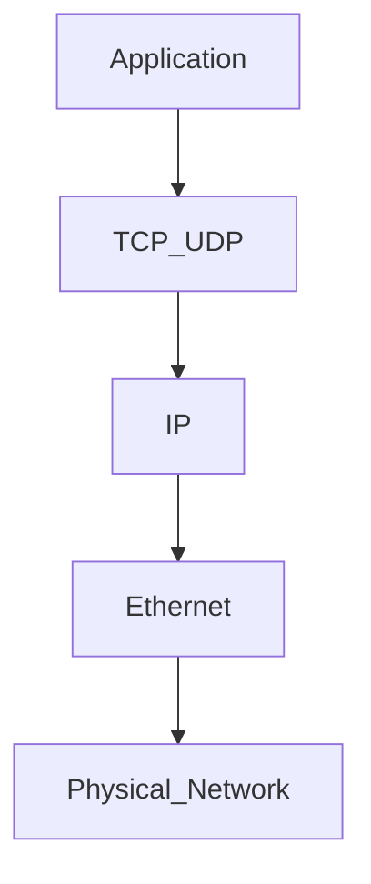
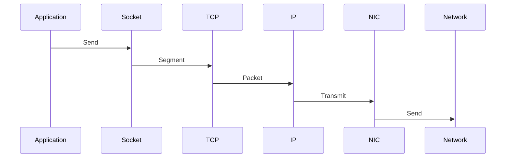

# Network Connectivity and Packet Loss

> Troubleshooting Track — Exercise 06

> **Most production systems are distributed systems.**
>
> Modern applications depend on:
>
> ```text
> Clients
>
> APIs
>
> Databases
>
> Load Balancers
>
> DNS
>
> Kubernetes
>
> Cloud Services
> ```
>
> Every one of them communicates through networks.
>
> When networking fails, entire systems appear broken.

---

# Why This Exercise Exists

Many engineers troubleshoot networking with:

```bash
ping google.com
```

and stop there.

Production incidents are rarely that simple.

Real-world failures involve:

```text
Packet Loss

DNS Failures

Routing Issues

TCP Retransmissions

Connection Timeouts

Load Balancer Problems

Firewall Rules

Network Saturation

Kubernetes CNI Issues

Cloud Networking Failures
```

Networking problems often disguise themselves as:

```text
Database Problems

Application Problems

Authentication Problems

Storage Problems
```

Understanding packet flow is essential for modern infrastructure engineering.

---

# The Problem This Exercise Solves

Imagine receiving an alert:

```text
API Response Time Increased

Database Connections Timing Out

Users Reporting Errors

Pods Restarting
```

Questions:

```text
Is The Application Broken?

Is The Database Broken?

Is DNS Broken?

Are Packets Being Dropped?

Is Routing Incorrect?

Is The Network Saturated?
```

This exercise teaches systematic network troubleshooting.

---

# Mental Model

Think of networking as a global transportation system.

```text
Application = Business

Packets = Vehicles

Routers = Intersections

Switches = Roads

Network = Transportation Infrastructure
```

When traffic stops moving:

```text
Road Blocked?

Vehicles Lost?

Wrong Route?

Traffic Jam?
```

Networking follows the same principles.

---

# First Principles

Applications do not communicate.

```text
Packets Communicate
```

Every API request becomes:

```text
Packets
```

Every database query becomes:

```text
Packets
```

Every Kubernetes service call becomes:

```text
Packets
```

---

# Critical Insight

Many incidents labeled:

```text
Application Outage
```

are actually:

```text
Network Outage
```

---

# Network Investigation Framework

```mermaid
flowchart TD

Incident

--> DNS

--> Connectivity

--> Routing

--> Packet Loss

--> Latency

--> Saturation

--> Root Cause
```

---

# Understanding Network Layers



Failures can occur at any layer.

---

# Universal Troubleshooting Rule

Never begin with:

```text
The Network Is Down
```

Begin with:

```text
Which Layer Is Failing?
```

---

# Stage 1 — Verify Basic Connectivity

Before investigating complex issues:

Verify communication exists.

---

# Exercise 1

Run:

```bash
ping 8.8.8.8
```

Questions:

```text
Reachable?

Packet Loss?

Latency?
```

---

# Why Ping Matters

Ping validates:

```text
IP Connectivity
```

not:

```text
Application Health
```

---

# Example

Healthy ping:

```text
0% Packet Loss
```

Unhealthy:

```text
25% Packet Loss
```

---

# Stage 2 — Investigate Network Interfaces

Every packet enters through an interface.

---

# Exercise 2

Run:

```bash
ip addr
```

or:

```bash
ip a
```

---

# Questions

Interface Up?

Correct IP?

Expected Network?

````

---

# Interface Investigation

Check:

```bash
ip link
````

---

# Common Problems

```text
Interface Down

Wrong IP

Duplicate Address

Configuration Errors
```

---

# Stage 3 — Verify Routing

Packets need routes.

Without routes:

```text
Packets Cannot Reach Destination
```

---

# Exercise 3

Run:

```bash
ip route
```

---

# Questions

Default Gateway?

Correct Route?

Missing Route?

````

---

# Visualization

```text
Source

↓

Router

↓

Destination
````

---

# Common Routing Failures

```text
Missing Default Route

Incorrect Gateway

VPN Route Conflicts

Cloud Route Issues
```

---

# Stage 4 — DNS Troubleshooting

One of the most common production incidents.

---

# Symptoms

```text
Application Cannot Reach Service

Database Host Not Found

API Calls Fail
```

---

# Important Insight

DNS failures often appear as:

```text
Network Failures
```

even when networking works.

---

# Exercise 4

Run:

```bash
dig google.com
```

or:

```bash
nslookup google.com
```

---

# Questions

DNS Response?

Timeout?

Incorrect Result?

````

---

# DNS Resolution Flow

```mermaid
sequenceDiagram

Application->>DNS Server: Query

DNS Server-->>Application: Response

Application->>Remote Host: Connect
````

---

# Stage 5 — Packet Loss Investigation

Packet loss is one of the most damaging issues.

---

# What Is Packet Loss?

Packets disappear before arriving.

---

# Visualization

```text
Packet 1 ✓

Packet 2 ✓

Packet 3 ✗

Packet 4 ✓
```

---

# Why Packet Loss Matters

Results:

```text
TCP Retransmissions

Latency

Timeouts

Application Failures
```

---

# Exercise 5

Run:

```bash
ping -c 100 DESTINATION
```

Calculate:

```text
Packet Loss Percentage
```

---

# Investigation Questions

Consistent?

Intermittent?

Burst Loss?

````

---

# Stage 6 — Trace Packet Path

Connectivity may exist.

Path may be problematic.

---

# Exercise 6

Run:

```bash
traceroute google.com
````

or:

```bash
mtr google.com
```

---

# Why Traceroute Matters

Shows:

```text
Every Hop
```

between source and destination.

---

# Visualization

```text
Client

↓

Router 1

↓

Router 2

↓

Router 3

↓

Destination
```

---

# Investigation Questions

Latency Spike?

Hop Failure?

Unexpected Path?

````

---

# Stage 7 — Investigate Active Connections

Linux tracks network connections.

---

# Exercise 7

Run:

```bash
ss -tan
````

---

# Questions

Established Connections?

Large Number Of Connections?

Unexpected Destinations?

````

---

# Common Connection States

```text
LISTEN

ESTABLISHED

TIME_WAIT

CLOSE_WAIT
````

---

# Why States Matter

Thousands of:

```text
TIME_WAIT
```

can indicate:

```text
Connection Churn
```

---

# Stage 8 — Port Investigation

Applications communicate through ports.

---

# Exercise 8

Run:

```bash
ss -tulpn
```

---

# Questions

Expected Services Listening?

Unexpected Ports?

Missing Service?

````

---

# Investigation Workflow

```mermaid
flowchart TD

Application Failure

--> Listening Port?

--> Connection Established?

--> Service Healthy?
````

---

# Stage 9 — Packet Capture

Logs show symptoms.

Packets show reality.

---

# Exercise 9

Install:

```bash
sudo apt install tcpdump
```

Capture traffic:

```bash
sudo tcpdump -i any
```

---

# Why Packet Capture Matters

Provides:

```text
Ground Truth
```

for networking investigations.

---

# Packet Analysis Questions

```text
Source?

Destination?

Protocol?

Retransmissions?

Drops?
```

---

# Stage 10 — TCP Retransmissions

TCP guarantees delivery.

When packets disappear:

```text
Retransmissions Occur
```

---

# Visualization

```text
Packet Lost

↓

Timeout

↓

Resend
```

---

# Symptoms

```text
High Latency

Slow APIs

Database Delays
```

---

# Investigation

Use:

```bash
tcpdump
```

or:

```bash
wireshark
```

---

# Stage 11 — Network Saturation

Networks have limits.

---

# What Happens?

```text
Traffic > Capacity
```

---

# Results

```text
Latency

Drops

Retransmissions
```

---

# Visualization

```text
Incoming Traffic

↓↓↓↓↓↓↓↓

Network Capacity

↓↓↓

Queue Forms
```

---

# Exercise 10

Install:

```bash
sudo apt install iftop
```

Run:

```bash
sudo iftop
```

---

# Questions

Top Talkers?

Unexpected Traffic?

Bandwidth Consumers?

````

---

# Stage 12 — Firewall Investigation

Packets may be blocked intentionally.

---

# Investigation

Linux:

```bash
iptables -L -n

nft list ruleset
````

---

# Questions

Expected Rules?

Unexpected Drops?

Blocked Ports?

````

---

# Common Firewall Incidents

```text
Database Port Blocked

Application Port Blocked

Cloud Security Group Error
````

---

# Stage 13 — Network Interface Errors

Hardware problems create packet loss.

---

# Investigation

Run:

```bash
ip -s link
```

---

# Questions

Errors?

Drops?

Overruns?

````

---

# Example

```text
RX Errors

TX Errors

Dropped Packets
````

indicate infrastructure issues.

---

# Stage 14 — ARP Problems

Local network communication depends on ARP.

---

# Investigation

Run:

```bash
arp -a
```

or:

```bash
ip neigh
```

---

# Symptoms

```text
Intermittent Connectivity

Duplicate IPs

Network Instability
```

---

# Stage 15 — MTU Problems

A classic production networking issue.

---

# What Happens?

Packets exceed allowed size.

---

# Symptoms

```text
Some Sites Work

Some Fail

VPN Issues

Intermittent Connections
```

---

# Investigation

Run:

```bash
ip link
```

Check:

```text
MTU Values
```

---

# Production Incident #1

## Alert

```text
Users Cannot Access Website
```

Investigate:

```bash
ping

dig

ss

tcpdump
```

---

# Production Incident #2

## Alert

```text
Database Connections Timing Out
```

Investigate:

```bash
mtr

ss

tcpdump
```

Determine:

```text
Network?

Database?

DNS?
```

---

# Production Incident #3

## Alert

```text
Packet Loss Increased To 20%
```

Investigate:

```bash
ip -s link

mtr

tcpdump
```

---

# Production Incident #4

## Alert

```text
Kubernetes Services Unreachable
```

Investigate:

```text
DNS

CNI

Routing

Network Policies
```

---

# Production Incident #5

## Alert

```text
Cloud VM Cannot Reach Database
```

Investigate:

```text
Routing

Security Groups

Firewall

DNS
```

---

# Linux Internals Deep Dive

Packet transmission path:



Problems occur anywhere along this path.

---

# Docker Connection

Docker networking depends on:

```text
Linux Bridges

veth Pairs

iptables

NAT
```

Investigate:

```bash
docker network ls
```

---

# Kubernetes Connection

Kubernetes networking depends on:

```text
CNI

Routing

Linux Networking Stack

iptables

IPVS

eBPF
```

Understanding Linux networking is mandatory for Kubernetes debugging.

---

# Observability Checklist

Collect:

```text
Latency

Packet Loss

Connection Counts

DNS Metrics

Bandwidth Usage

Retransmissions
```

before making changes.

---

# Common Mistakes

## Mistake 1

Assuming ping proves application health.

---

## Mistake 2

Ignoring DNS.

---

## Mistake 3

Ignoring packet loss.

---

## Mistake 4

Ignoring routing.

---

## Mistake 5

Skipping packet capture.

---

## Mistake 6

Blaming applications first.

---

# Engineering Mindset

Beginners ask:

```text
Can I Reach The Server?
```

Engineers ask:

```text
How Are Packets Behaving?

Where Are They Lost?

Which Layer Is Failing?

What Evidence Exists?
```

---

# Interview Questions

1. What is packet loss?
2. How does TCP handle packet loss?
3. Difference between ping and traceroute?
4. What causes DNS failures?
5. How do you investigate routing problems?
6. What does tcpdump do?
7. What causes network saturation?
8. How do firewall rules affect connectivity?
9. How would you troubleshoot Kubernetes networking?
10. Why can applications fail when the network is healthy?

---

# Network Incident Cheat Sheet

```bash
ping

ip addr

ip route

ip link

ss -tan

ss -tulpn

dig

nslookup

mtr

traceroute

tcpdump

iftop

ip -s link

arp -a

ip neigh

iptables -L -n

nft list ruleset
```

---

# Capstone Challenge

A production microservices platform reports:

```text
API Timeouts

Database Connection Failures

Packet Loss Alerts

DNS Resolution Errors

Customer Complaints
```

Perform a complete network investigation.

Document:

```text
Connectivity Tests

Routing Analysis

DNS Analysis

Packet Loss Measurements

Connection States

Packet Captures

Firewall Analysis

Evidence

Root Cause

Recovery Plan

Prevention Plan
```

---

# Completion Criteria

You successfully complete this exercise when you can:

✓ Troubleshoot connectivity failures systematically

✓ Investigate DNS issues

✓ Analyze routing problems

✓ Detect packet loss

✓ Investigate TCP behavior

✓ Capture and analyze packets

✓ Troubleshoot firewall issues

✓ Investigate Docker and Kubernetes networking

✓ Perform production-grade network investigations

✓ Think like a network engineer rather than a command operator

Congratulations.

You now understand one of the most important truths in distributed systems:

**Applications do not fail across networks. Packets do.**
