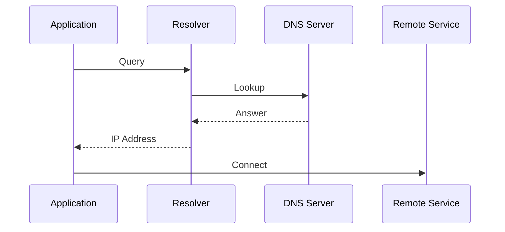

# DNS Failures and Name Resolution Incidents

> Troubleshooting Track — Exercise 07

> **DNS is one of the most critical systems on the internet and one of the most common causes of production outages.**
>
> Most engineers think:
>
> ```text
> DNS = Domain Names
> ```
>
> Production engineers know:
>
> ```text
> DNS = Service Discovery
> ```
>
> When DNS fails, applications, databases, Kubernetes clusters, APIs, load balancers, cloud services, and entire distributed systems can appear broken.

---

# Why This Exercise Exists

A surprising percentage of production outages are caused by:

```text id="xq4n1j"
DNS Misconfiguration

Resolver Failures

Expired Records

Broken Service Discovery

DNS Latency

Incorrect TTLs

Split-Horizon Issues

Kubernetes DNS Failures
```

Applications often report:

```text id="v6h5r0"
Connection Timeout

Database Unreachable

API Failure

Service Unavailable
```

while the actual root cause is:

```text id="n3g9tx"
Name Resolution Failure
```

---

# The Problem This Exercise Solves

Imagine a production alert:

```text id="4g7kbc"
API Cannot Reach Database

Pods Cannot Communicate

External Services Failing

Load Balancer Appears Healthy
```

Questions:

```text id="k1n4sw"
Is The Network Broken?

Is DNS Broken?

Is The Resolver Down?

Did Records Change?

Is Cache Stale?

Is Kubernetes DNS Healthy?
```

This exercise teaches systematic DNS troubleshooting.

---

# Mental Model

Think of DNS as:

```text id="9m0f2a"
The Phone Book Of Distributed Systems
```

Applications rarely know:

```text id="z7t9yk"
IP Addresses
```

Instead they know:

```text id="iw2bvr"
Names
```

DNS translates:

```text id="nb7jhf"
Name

↓

IP Address
```

---

# First Principles

Computers communicate using:

```text id="f8c0es"
IP Addresses
```

Humans communicate using:

```text id="a8jh4e"
Names
```

DNS bridges the gap.

---

# DNS Resolution Flow



---

# Critical Insight

Many incidents reported as:

```text id="s6a8qt"
Network Failure
```

are actually:

```text id="x4m9kp"
DNS Failure
```

because applications never learn where to connect.

---

# DNS Investigation Framework

```mermaid
flowchart TD

Application Failure

--> Resolver

--> DNS Query

--> DNS Response

--> Cache

--> Record

--> Root Cause
```

---

# The Most Important Question

Before troubleshooting ask:

```text id="u5f8ye"
Can The Name Be Resolved?
```

Not:

```text id="b8t2zh"
Can The Service Be Reached?
```

---

# Understanding DNS Components

```mermaid
flowchart LR

Application

--> Local Resolver

--> Recursive Resolver

--> Authoritative DNS

--> Response
```

---

# Core DNS Terminology

```text id="d0y7vr"
Resolver

Nameserver

Record

TTL

Zone

Cache

Authoritative Server
```

Understanding these concepts is essential.

---

# Stage 1 — Verify Basic Resolution

Before anything else:

Verify DNS works.

---

# Exercise 1

Run:

```bash id="m8z7c4"
dig google.com
```

or:

```bash id="g4j9sx"
nslookup google.com
```

---

# Questions

Did DNS respond?

Was response fast?

Was answer correct?

---

# Expected Result

```text id="c5u1oa"
Domain

↓

IP Address
```

---

# If Resolution Fails

Potential causes:

```text id="v0d5kq"
Resolver Failure

Network Failure

DNS Server Down

Firewall Rules
```

---

# Stage 2 — Verify Resolver Configuration

Linux uses:

```text id="z3g6lh"
/etc/resolv.conf
```

for DNS configuration.

---

# Exercise 2

Inspect:

```bash id="r7j2qp"
cat /etc/resolv.conf
```

---

# Questions

Which DNS servers?

Expected?

Reachable?

---

# Example

```text id="u3e9cm"
nameserver 8.8.8.8

nameserver 1.1.1.1
```

---

# Common Resolver Problems

```text id="t4p2ng"
Wrong DNS Server

Missing Entry

VPN Overwrite

Cloud-init Change
```

---

# Stage 3 — Verify Resolver Reachability

A configured DNS server may not be reachable.

---

# Exercise 3

Run:

```bash id="f9v6hy"
ping DNS_SERVER_IP
```

---

# Questions

Reachable?

Packet Loss?

Latency?

````

---

# Why This Matters

If DNS server unreachable:

```text id="e2y4dc"
Resolution Fails
````

even if configuration is correct.

---

# Stage 4 — Investigate Query Performance

DNS can work and still be broken.

---

# Symptoms

```text id="x9f3ba"
Slow Websites

API Delays

Intermittent Timeouts
```

---

# Exercise 4

Measure:

```bash id="v5a7oz"
dig google.com
```

Observe:

```text id="a1p8js"
Query Time
```

---

# Questions

Fast?

Slow?

Consistent?

````

---

# DNS Latency Flow

```mermaid
flowchart TD

DNS Query

--> Resolver

--> Authoritative Server

--> Response
````

Latency anywhere impacts applications.

---

# Stage 5 — Investigate Specific Records

Not all records are equal.

---

# Common Record Types

```text id="r0m8jk"
A

AAAA

CNAME

MX

TXT

SRV
```

---

# Exercise 5

Query:

```bash id="s8v0du"
dig example.com A

dig example.com AAAA

dig example.com MX
```

---

# Questions

Correct value?

Expected value?

Missing record?

---

# Why Record Types Matter

Applications often depend on:

```text id="w4j2nb"
SRV

TXT

CNAME
```

not just A records.

---

# Stage 6 — Investigate DNS Cache

Caching improves performance.

Caching can also cause outages.

---

# Mental Model

```text id="g8z4lv"
Fresh Record

↓

Cached

↓

Record Changes

↓

Clients Use Old Value
```

---

# Symptoms

```text id="c9w6fa"
Some Users Fail

Others Work

Intermittent Errors
```

---

# Exercise 6

Compare:

```bash id="u7n5dj"
dig domain.com
```

from multiple locations.

---

# Questions

Different results?

Stale entries?

Propagation issues?

---

# Stage 7 — Understanding TTL

TTL controls cache lifetime.

---

# Example

```text id="h4t9qe"
TTL = 300
```

means:

```text id="b2g7yc"
Cache For 5 Minutes
```

---

# Why TTL Matters

High TTL:

```text id="z8r4ks"
Slow Propagation
```

Low TTL:

```text id="k6n1fu"
Higher DNS Load
```

---

# Exercise 7

Inspect:

```bash id="n3p7vo"
dig domain.com
```

Locate:

```text id="m9x2yt"
TTL
```

---

# Questions

Appropriate value?

Too high?

Too low?

---

# Stage 8 — Investigate Authoritative Servers

The authoritative server owns the truth.

---

# Exercise 8

Run:

```bash id="f5k3ew"
dig NS domain.com
```

---

# Questions

Which servers are authoritative?

Expected?

Reachable?

---

# Visualization

```text id="q0n6sd"
Resolver

↓

Authoritative DNS

↓

Response
```

---

# Stage 9 — Split-Horizon DNS

Common enterprise failure.

---

# What Happens?

Different users receive:

```text id="j6p8tv"
Different Answers
```

for the same name.

---

# Example

```text id="y3m9ru"
Internal Users

↓

10.x.x.x

External Users

↓

Public IP
```

---

# Symptoms

```text id="p8v2hy"
Works Internally

Fails Externally
```

---

# Exercise 9

Compare DNS responses from:

```text id="w1t5ce"
Internal Network

External Network
```

---

# Stage 10 — DNS and Load Balancers

Many production services depend on:

```text id="m7f4xj"
DNS-Based Load Balancing
```

---

# Failure Scenario

```text id="s9q1dh"
Old IP Cached

↓

Traffic Sent To Dead Server
```

---

# Questions

DNS updated?

Cache cleared?

TTL expired?

---

# Stage 11 — Kubernetes DNS

Modern infrastructure relies heavily on DNS.

---

# Components

```text id="z4v6kj"
CoreDNS

Service Discovery

Pod Resolution
```

---

# Architecture

```mermaid
flowchart TD

Pod

--> CoreDNS

--> Kubernetes Service

--> Pod IP
```

---

# Exercise 10

Check:

```bash id="y5d8pw"
kubectl get pods -n kube-system
```

Locate:

```text id="x2m7qa"
CoreDNS
```

---

# Questions

Healthy?

Restarting?

Available?

---

# CoreDNS Investigation

Inspect:

```bash id="t4r1zu"
kubectl logs -n kube-system POD
```

---

# Common Kubernetes DNS Failures

```text id="a7q3md"
CoreDNS Crash

Network Policy

Service Misconfiguration

CNI Failure
```

---

# Stage 12 — Cloud DNS Failures

Cloud providers add complexity.

---

# Examples

```text id="d9p6hj"
Route53

Cloud DNS

Private DNS Zones

VPC Resolution
```

---

# Common Problems

```text id="u6x3ke"
Private Zone Conflict

Resolver Misconfiguration

Cross-VPC Issues
```

---

# Production Incident #1

## Alert

```text id="n1k4wj"
Application Cannot Reach Database
```

Investigate:

```bash id="g5p8rc"
dig

nslookup

resolv.conf
```

Determine:

```text id="b3q7hf"
DNS?

Network?

Database?
```

---

# Production Incident #2

## Alert

```text id="k9d6sy"
Website Works For Some Users Only
```

Investigate:

```text id="v2r8mx"
Cache

TTL

Propagation
```

---

# Production Incident #3

## Alert

```text id="j7h4op"
Kubernetes Service Unreachable
```

Investigate:

```bash id="m4v9zs"
kubectl logs coredns
```

---

# Production Incident #4

## Alert

```text id="t3w6jk"
API Latency Increased
```

Investigate:

```text id="z1x9fq"
DNS Query Times

Resolver Health
```

---

# Production Incident #5

## Alert

```text id="s5k8hd"
Cloud Service Resolution Failure
```

Investigate:

```text id="e8v2pm"
Private Zones

Resolver Configuration

Routing
```

---

# Linux Internals Deep Dive

Resolution path:

```mermaid
sequenceDiagram

Application->>glibc Resolver: Query

glibc Resolver->>/etc/resolv.conf: Read

Resolver->>DNS Server: Query

DNS Server-->>Resolver: Answer

Resolver-->>Application: IP
```

Every name lookup follows this chain.

---

# Docker Connection

Containers inherit DNS configuration.

Investigate:

```bash id="h9f5ka"
docker inspect CONTAINER
```

Look for:

```text id="r2v7mx"
DNS Settings
```

---

# Kubernetes Connection

Kubernetes service discovery is fundamentally:

```text id="p6d4wq"
DNS
```

When DNS fails:

```text id="j8t3fn"
Microservices Fail
```

even when networking is healthy.

---

# Observability Checklist

Collect:

```text id="k5r2xb"
DNS Query Time

Resolver Health

Error Rate

TTL Values

Cache Status

CoreDNS Metrics
```

before making changes.

---

# Common Mistakes

## Mistake 1

Assuming DNS works because networking works.

---

## Mistake 2

Ignoring TTL values.

---

## Mistake 3

Ignoring caching behavior.

---

## Mistake 4

Investigating applications before DNS.

---

## Mistake 5

Ignoring Kubernetes CoreDNS.

---

## Mistake 6

Testing from only one location.

---

# Engineering Mindset

Beginners ask:

```text id="u8n3he"
Can I Reach The Service?
```

Engineers ask:

```text id="m4f6pd"
Can I Resolve The Service?

Which Resolver?

Which Record?

Which Cache?

Which DNS Path?
```

---

# Interview Questions

1. What is DNS?
2. What is the difference between recursive and authoritative DNS?
3. What is TTL?
4. What causes DNS propagation delays?
5. How would you investigate DNS latency?
6. What is split-horizon DNS?
7. How does Linux perform name resolution?
8. How does Kubernetes use DNS?
9. Why can DNS failures look like application failures?
10. How would you troubleshoot a DNS outage?

---

# DNS Incident Cheat Sheet

```bash id="v7m5kt"
dig domain.com

dig NS domain.com

dig MX domain.com

nslookup domain.com

host domain.com

cat /etc/resolv.conf

ping DNS_SERVER

kubectl get pods -n kube-system

kubectl logs -n kube-system COREDNS_POD

docker inspect CONTAINER
```

---

# Capstone Challenge

A production SaaS platform experiences:

```text id="n2g8ry"
Database Connection Failures

API Timeouts

Intermittent Service Discovery Issues

Kubernetes Service Failures

Customer Complaints
```

Perform a complete DNS investigation.

Document:

```text id="q9v4jx"
Resolver Configuration

DNS Query Results

TTL Analysis

Cache Behavior

Authoritative Servers

CoreDNS Health

Evidence

Root Cause

Recovery Plan

Prevention Plan
```

---

# Completion Criteria

You successfully complete this exercise when you can:

✓ Explain DNS from first principles

✓ Troubleshoot Linux resolver issues

✓ Investigate DNS latency

✓ Analyze records and TTLs

✓ Understand DNS caching

✓ Troubleshoot authoritative DNS issues

✓ Investigate Kubernetes CoreDNS failures

✓ Troubleshoot cloud DNS architectures

✓ Perform production-grade DNS investigations

✓ Think like a distributed systems engineer

Congratulations.

You now understand one of the most important truths in infrastructure engineering:

**Most distributed systems do not know where anything is. DNS tells them.**
