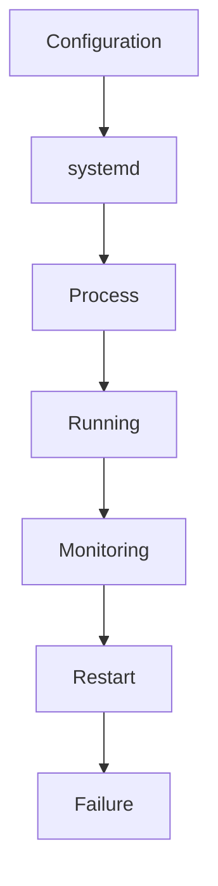
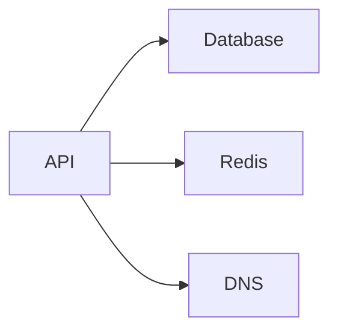
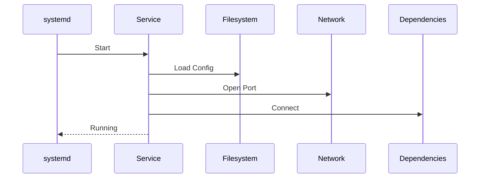

# Service Crashes and systemd Failures

> Troubleshooting Track — Exercise 08

> **Most production outages are not caused by Linux failing.**
>
> They are caused by services failing to start, crashing unexpectedly, entering restart loops, exhausting resources, or becoming unhealthy.
>
> Understanding service management and systemd is one of the most valuable skills for Linux, DevOps, SRE, Platform, and Infrastructure Engineers.

---

# Why This Exercise Exists

Most Linux systems exist to run services.

Examples:

```text id="w8qp2e"
Nginx

Apache

PostgreSQL

MySQL

Redis

MongoDB

Docker

containerd

Kubelet

Application APIs
```

When these services fail:

```text id="o6rk0v"
Applications Become Unavailable

Users Cannot Connect

Pods Fail

Databases Become Inaccessible

Revenue Is Lost
```

Most production incidents eventually involve:

```text id="6n7xkg"
systemd

Logs

Dependencies

Resources

Configuration
```

---

# The Problem This Exercise Solves

Imagine receiving an alert:

```text id="dy5r53"
Website Down

API Returning 503

Database Unreachable

Node NotReady
```

Questions:

```text id="v8k3yl"
Did The Service Crash?

Did Startup Fail?

Did Dependencies Fail?

Is systemd Restarting It?

Did It Run Out Of Memory?

Is Configuration Invalid?

Did A Deployment Break It?
```

This exercise teaches systematic service failure investigation.

---

# Mental Model

Think of systemd as:

```text id="p4r8hj"
The Operating System's Operations Manager
```

Applications do not simply run.

systemd manages:

```text id="rm5g2x"
Startup

Shutdown

Monitoring

Dependencies

Recovery

Restart Policies
```

---

# First Principles

A service lifecycle:

```text id="j3h6cv"
Configured

↓

Started

↓

Running

↓

Healthy

↓

Stopped
```

Failures can occur at any stage.

---

# Service Lifecycle Architecture



---

# Critical Insight

Most service incidents are not:

```text id="7h5xmt"
Service Problems
```

They are:

```text id="u8d4nj"
Dependency Problems

Storage Problems

Memory Problems

Network Problems

Configuration Problems
```

---

# Service Investigation Framework

```mermaid
flowchart TD

Service Failure

--> Status

--> Logs

--> Dependencies

--> Resources

--> Configuration

--> Root Cause
```

---

# The First Question

Never ask:

```text id="n7w3pa"
How Do I Restart It?
```

Ask:

```text id="b6t9ez"
Why Did It Fail?
```

---

# Stage 1 — Verify Service State

Before investigating anything:

Determine actual state.

---

# Exercise 1

Run:

```bash
systemctl status SERVICE
```

Example:

```bash id="g5y8qr"
systemctl status nginx
```

---

# Questions

Is service:

```text id="d2p4lv"
Running?

Stopped?

Failed?

Restarting?
```

---

# Understanding Service States

Common states:

```text id="s8r2vc"
active

inactive

failed

activating

deactivating
```

---

# Visualization

```text id="z1m9yb"
Inactive

↓

Starting

↓

Running

↓

Failed
```

---

# Stage 2 — Investigate Logs

Logs are usually the fastest path to truth.

---

# Exercise 2

Run:

```bash id="x6q3tn"
journalctl -u nginx
```

Recent entries:

```bash id="w9h5pl"
journalctl -u nginx -n 100
```

---

# Questions

What happened before failure?

Error message?

Repeated pattern?

---

# Why Logs Matter

Logs often reveal:

```text id="j4f8ea"
Configuration Errors

Permission Problems

Dependency Failures

Port Conflicts
```

---

# Stage 3 — Investigate Startup Failures

Service may fail before becoming active.

---

# Example

```text id="c5y2wg"
Configuration Syntax Error
```

---

# Symptoms

```text id="p3j7av"
Failed Immediately

Exit Code Non-Zero

systemd Marks Failed
```

---

# Exercise 3

Check:

```bash id="t7m4rz"
systemctl status SERVICE
```

Identify:

```text id="a8k6yn"
Exit Code

Failure Reason
```

---

# Understanding Exit Codes

```text id="h5x1dw"
0 = Success

Non-Zero = Failure
```

---

# Investigation Questions

```text id="n3v8js"
Configuration?

Dependency?

Resource?
```

---

# Stage 4 — Restart Loops

A common production incident.

---

# Symptoms

```text id="w2f4jc"
Service Starts

↓

Crashes

↓

Restarts

↓

Crashes Again
```

---

# Visualization

```text id="y9h6pq"
Start

↓

Crash

↓

Restart

↓

Crash
```

---

# Exercise 4

Inspect:

```bash id="g3t8fa"
systemctl status SERVICE
```

Look for:

```text id="s4p9mn"
Restart Counter
```

---

# Questions

Why crashing?

Why restarting?

How frequently?

---

# Stage 5 — Dependency Failures

Many services depend on other services.

---

# Examples

```text id="q6y4tb"
Web Server → Database

API → Redis

Application → DNS
```

---

# Dependency Chain



---

# Exercise 5

View dependencies:

```bash id="f1m8yr"
systemctl list-dependencies SERVICE
```

---

# Questions

Dependency healthy?

Dependency reachable?

Dependency started?

---

# Stage 6 — Port Conflicts

Common startup failure.

---

# Example

```text id="z7x3lu"
Port 80 Already In Use
```

---

# Symptoms

```text id="m4j9sn"
Service Fails To Start
```

---

# Investigation

Run:

```bash id="v8k2ya"
ss -tulpn
```

---

# Questions

Who owns the port?

Expected?

Unexpected?

---

# Exercise 6

Identify all listeners:

```bash id="d2q5ce"
ss -tulpn
```

Document:

```text id="h9w1fv"
Port

Process

Purpose
```

---

# Stage 7 — Resource Exhaustion

Service may fail because system resources are unavailable.

---

# Examples

```text id="c3y8mr"
Memory Exhaustion

CPU Saturation

Disk Full

File Descriptor Limits
```

---

# Investigation

Run:

```bash id="y4p7gt"
free -h

df -h

top
```

---

# Questions

Healthy resources?

Near limits?

Critical shortage?

---

# Stage 8 — OOM Kills

Linux may terminate services.

---

# Symptoms

```text id="r8m4hq"
Service Suddenly Dies

Restart Loop

No Application Error
```

---

# Investigation

Run:

```bash id="n5k2yr"
dmesg | grep -i oom
```

---

# Questions

Killed process?

Memory pressure?

Container limits?

---

# Exercise 7

Investigate:

```text id="x4f8tn"
Service Crashed Unexpectedly
```

Determine whether OOM occurred.

---

# Stage 9 — Configuration Failures

One of the most common root causes.

---

# Examples

```text id="v7q2jp"
Invalid Syntax

Missing File

Bad Permissions

Wrong Path
```

---

# Investigation

Validate configuration.

Example:

```bash id="u6m4xr"
nginx -t
```

---

# Questions

Syntax valid?

File exists?

Permissions correct?

---

# Exercise 8

Create a configuration validation checklist.

---

# Stage 10 — Permission Problems

Services often fail due to:

```text id="a5x7dy"
File Permissions

Ownership

SELinux

AppArmor
```

---

# Symptoms

```text id="h8j4vz"
Permission Denied
```

---

# Investigation

Run:

```bash id="b9p6rn"
ls -la

journalctl
```

---

# Questions

Can service access required resources?

---

# Stage 11 — Environment Problems

Applications depend on:

```text id="t4k8ye"
Environment Variables

Secrets

Configuration Files
```

---

# Missing Values Cause

```text id="f6m2wn"
Startup Failure

Runtime Failure
```

---

# Investigation

Inspect:

```bash id="e3j9vs"
systemctl cat SERVICE
```

---

# Exercise 9

Identify:

```text id="r2q8hx"
Environment Variables

Secrets

External Dependencies
```

---

# Stage 12 — systemd Unit Investigation

systemd unit files define service behavior.

---

# View Unit

```bash id="g7n5pc"
systemctl cat SERVICE
```

---

# Important Sections

```text id="y4h7qe"
Unit

Service

Install
```

---

# Example

```ini
[Service]

ExecStart=/app/api

Restart=always
```

---

# Questions

Correct executable?

Correct path?

Correct restart policy?

---

# Stage 13 — Startup Ordering Problems

Some services require:

```text id="u5m9kp"
Network

Storage

Database
```

before starting.

---

# Investigation

Check:

```bash id="p8t4fy"
systemctl list-dependencies
```

---

# Symptoms

```text id="s1j7mx"
Works After Manual Restart

Fails During Boot
```

---

# Stage 14 — systemd Journal Analysis

Journal is the central evidence source.

---

# Exercise 10

View:

```bash id="n4v9hr"
journalctl -xe
```

---

# Questions

What occurred before failure?

Any recurring patterns?

Any dependency failures?

---

# Stage 15 — Service Recovery

Only after root cause identified.

---

# Safe Recovery Workflow

```mermaid
flowchart TD

Evidence

--> Root Cause

--> Fix

--> Restart

--> Verify
```

---

# Dangerous Recovery

```text id="d8q6jw"
Restarting Repeatedly

Deleting Configs

Disabling Security Controls
```

without understanding consequences.

---

# Docker Service Failures

Investigate:

```bash id="w3m8nt"
systemctl status docker

journalctl -u docker
```

---

# Common Issues

```text id="c7v4ry"
Storage Full

Corrupt Images

Container Runtime Failure
```

---

# Kubernetes Service Failures

Critical services:

```text id="h6x2ps"
kubelet

containerd

etcd
```

---

# Investigation

```bash id="q9t3mw"
systemctl status kubelet

journalctl -u kubelet
```

---

# Production Incident #1

## Alert

```text id="k2m7va"
Website Returns 503
```

Investigate:

```bash id="j5n4cx"
systemctl status nginx

journalctl -u nginx
```

---

# Production Incident #2

## Alert

```text id="m7q2zt"
Database Service Failed
```

Investigate:

```text id="r5j8yn"
Logs

Storage

Memory
```

---

# Production Incident #3

## Alert

```text id="v3x9pt"
Service Restarting Continuously
```

Investigate:

```text id="a4k7dv"
Crash Cause

Restart Policy

Dependencies
```

---

# Production Incident #4

## Alert

```text id="y6m3rn"
Kubernetes Node NotReady
```

Investigate:

```bash id="n8p5ts"
systemctl status kubelet
```

---

# Production Incident #5

## Alert

```text id="t7x1jw"
Docker Containers Not Starting
```

Investigate:

```bash id="u2m8pz"
systemctl status docker
```

---

# Linux Internals Deep Dive

Service startup path:



Failures anywhere can prevent startup.

---

# Observability Checklist

Collect:

```text id="p4v7hk"
Service Status

Logs

Resource Metrics

Configuration

Dependency Health

Restart Count
```

before taking action.

---

# Common Mistakes

## Mistake 1

Restarting before investigation.

---

## Mistake 2

Ignoring logs.

---

## Mistake 3

Ignoring dependencies.

---

## Mistake 4

Ignoring resource limits.

---

## Mistake 5

Ignoring configuration validation.

---

## Mistake 6

Treating restart as a fix.

---

# Engineering Mindset

Beginners ask:

```text id="v8m2yr"
How Do I Restart It?
```

Engineers ask:

```text id="n6x4tj"
Why Did It Stop?

What Dependency Failed?

What Evidence Exists?

How Can We Prevent Recurrence?
```

---

# Interview Questions

1. What is systemd?
2. How do you investigate a failed service?
3. What is the purpose of journalctl?
4. What causes restart loops?
5. How do service dependencies work?
6. How do you investigate port conflicts?
7. What role does systemd play during boot?
8. How do OOM kills affect services?
9. How would you troubleshoot kubelet failures?
10. Why should logs be examined before restarting services?

---

# Service Failure Cheat Sheet

```bash id="w7m4zp"
systemctl status SERVICE

systemctl list-dependencies SERVICE

systemctl cat SERVICE

journalctl -u SERVICE

journalctl -xe

ss -tulpn

free -h

df -h

top

dmesg | grep -i oom

nginx -t
```

---

# Capstone Challenge

A production platform experiences:

```text id="q2v9ks"
API Unavailable

Nginx 503 Errors

Database Connection Failures

Repeated Service Restarts

Customer Impact
```

Perform a complete service investigation.

Document:

```text id="m5x7hj"
Service Status

Logs

Dependencies

Configuration

Resource Usage

Restart Analysis

Evidence

Root Cause

Recovery Plan

Prevention Plan
```

---

# Completion Criteria

You successfully complete this exercise when you can:

✓ Investigate failed services systematically

✓ Analyze systemd behavior

✓ Interpret service logs

✓ Diagnose restart loops

✓ Investigate dependency failures

✓ Troubleshoot port conflicts

✓ Analyze OOM-related crashes

✓ Debug Docker and Kubernetes service failures

✓ Perform production-grade service investigations

✓ Think like an SRE or Platform Engineer

Congratulations.

You now understand one of the most important truths in Linux operations:

**A service rarely crashes for no reason. Your job is to discover the dependency, resource, configuration, or environmental condition that caused it.**
