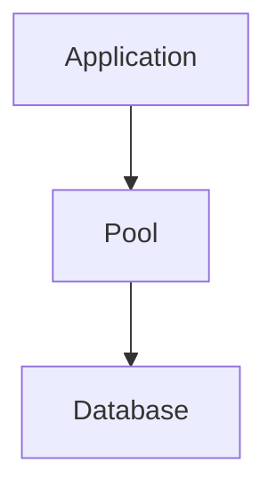
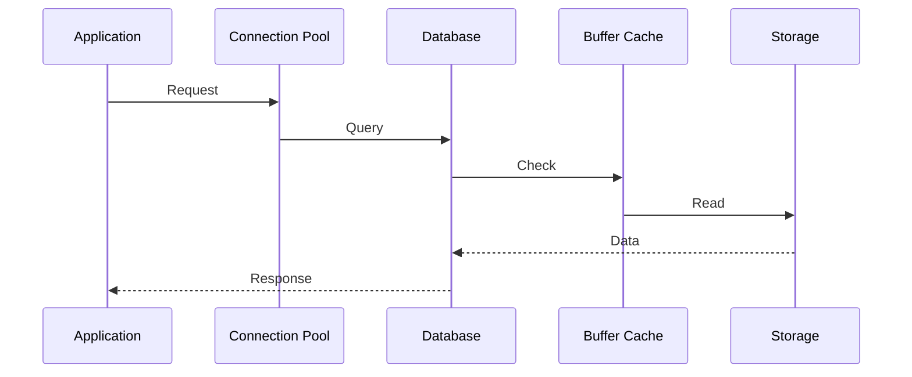

# Database Performance and Connection Failures

> Troubleshooting Track — Exercise 09

> **Applications are often blamed for outages, but databases are frequently the real bottleneck.**
>
> Modern systems depend on databases for:
>
> ```text
> Authentication
>
> Transactions
>
> User Data
>
> Configuration
>
> Analytics
>
> Sessions
> ```
>
> When databases become slow or unavailable, entire businesses can stop functioning.

---

# Why This Exercise Exists

Most engineers troubleshoot database incidents by restarting services or increasing resources.

Production database failures are usually caused by:

```text id="f7k9t3"
Slow Queries

Connection Pool Exhaustion

Lock Contention

Storage Latency

CPU Saturation

Memory Pressure

Network Problems

Replication Issues

Schema Design Problems

Missing Indexes
```

The visible symptom is often:

```text id="w2g8mn"
Application Timeout
```

while the actual root cause exists deep inside the database layer.

---

# The Problem This Exercise Solves

Imagine receiving an alert:

```text id="m4d7jk"
API Response Time Increased

Database Connections Failing

Customer Transactions Timing Out

Pods Restarting
```

Questions:

```text id="r9c3vx"
Is Database Down?

Is Query Performance Bad?

Are Connections Exhausted?

Is Storage Slow?

Is Replication Delayed?

Is Network Healthy?

Is Application Overloading Database?
```

This exercise teaches systematic database troubleshooting.

---

# Mental Model

Think of a database as a restaurant.

```text id="v3y8qb"
Customers = Queries

Tables = Ingredients

Indexes = Menu Lookup

Connections = Tables

Database Engine = Kitchen
```

When customers wait:

```text id="d5k2hw"
Too Many Customers?

Slow Kitchen?

Missing Ingredients?

Blocked Tables?
```

---

# First Principles

Most database problems fall into five categories:

```text id="u8x4rn"
Availability Problems

Performance Problems

Concurrency Problems

Storage Problems

Network Problems
```

---

# Database Investigation Framework

```mermaid
flowchart TD

Database Incident

--> Availability

--> Connections

--> Queries

--> Locks

--> Storage

--> Resources

--> Root Cause
```

---

# Critical Insight

Many engineers ask:

```text id="n7j5vs"
Why Is Database Slow?
```

Better question:

```text id="q6m8cz"
What Is The Database Waiting For?
```

---

# Database Architecture

```mermaid
flowchart TD

Application

--> Connection Pool

--> Database Engine

--> Buffer Cache

--> Storage

--> Disk
```

Performance bottlenecks can occur at any layer.

---

# Stage 1 — Verify Database Availability

Before performance analysis:

Verify database is reachable.

---

# Exercise 1

Check process:

```bash id="c9w4kr"
ps aux | grep postgres

ps aux | grep mysql
```

Verify service:

```bash id="h7p3yd"
systemctl status postgresql

systemctl status mysql
```

---

# Questions

Running?

Restarting?

Failed?

---

# Why Availability Matters

Performance investigation is pointless if:

```text id="y4v7tp"
Database Is Down
```

---

# Stage 2 — Verify Connectivity

Application issues may actually be connection failures.

---

# Exercise 2

Check listening ports:

```bash id="p2k8wr"
ss -tulpn
```

Common ports:

```text id="j5m3nt"
PostgreSQL → 5432

MySQL → 3306

MongoDB → 27017

Redis → 6379
```

---

# Questions

Port listening?

Reachable?

Blocked?

---

# Connectivity Architecture

```text
Application

↓

TCP Connection

↓

Database Port

↓

Database Process
```

---

# Stage 3 — Connection Exhaustion

One of the most common production failures.

---

# Symptoms

```text id="z3f6mn"
Too Many Connections

Connection Refused

Connection Timeout
```

---

# Example

PostgreSQL:

```text id="v6y4pk"
FATAL:
too many connections
```

---

# Exercise 3

PostgreSQL:

```sql
SELECT count(*) FROM pg_stat_activity;
```

MySQL:

```sql
SHOW PROCESSLIST;
```

---

# Questions

Connection count?

Expected?

Growing continuously?

---

# Why It Happens

Common causes:

```text id="u2k7jd"
Connection Leaks

Traffic Surge

Poor Pool Configuration
```

---

# Stage 4 — Query Performance Investigation

Most database incidents involve queries.

---

# Exercise 4

Identify long-running queries.

PostgreSQL:

```sql
SELECT pid,
       query,
       state
FROM pg_stat_activity;
```

---

# Questions

Long-running?

Blocked?

Unexpected?

---

# Critical Insight

Slow databases are often:

```text id="k9n4rt"
Slow Queries
```

not:

```text id="t6m2wp"
Slow Hardware
```

---

# Stage 5 — Query Execution Plans

Databases explain their decisions.

---

# Exercise 5

PostgreSQL:

```sql
EXPLAIN ANALYZE
SELECT ...
```

---

# Questions

Sequential Scan?

Index Scan?

Unexpected Operations?

---

# Visualization

```text
Query

↓

Planner

↓

Execution Plan

↓

Execution
```

---

# Why Execution Plans Matter

They reveal:

```text id="b8f3xd"
Index Usage

Join Strategy

Sort Operations

Cost
```

---

# Stage 6 — Missing Indexes

Classic production bottleneck.

---

# Symptoms

```text id="n5p7qy"
High CPU

Slow Queries

Large Table Scans
```

---

# Example

Without index:

```text id="q3v6jm"
Scan Entire Table
```

With index:

```text id="e8w4nt"
Find Matching Rows
```

---

# Exercise 6

Review:

```sql
EXPLAIN ANALYZE
```

Identify:

```text id="m2r9yv"
Missing Index Candidates
```

---

# Stage 7 — Lock Contention

Databases protect consistency using locks.

---

# Symptoms

```text id="f7n4pk"
Queries Waiting

Transactions Hanging

Application Timeouts
```

---

# Visualization

```text
Transaction A

Locks Row

↓

Transaction B

Waits
```

---

# Exercise 7

PostgreSQL:

```sql
SELECT *
FROM pg_locks;
```

---

# Questions

Blocked queries?

Waiting transactions?

Deadlocks?

---

# Stage 8 — Deadlock Investigation

Deadlocks occur when transactions wait on each other.

---

# Visualization

```text
Transaction A

Waiting For B

↓

Transaction B

Waiting For A
```

---

# Result

```text id="h9x5kd"
No Progress
```

---

# Investigation

Review logs:

```text id="v3t8ns"
Deadlock Messages
```

---

# Exercise 8

Create deadlock investigation workflow.

---

# Stage 9 — Buffer Cache Analysis

Databases avoid disk whenever possible.

---

# Why?

RAM is faster than storage.

---

# Architecture

```mermaid
flowchart TD

Query

--> Buffer Cache

Buffer Cache

--> Storage
```

---

# Questions

Cache hits?

Cache misses?

Memory pressure?

---

# Stage 10 — Storage Investigation

Many database issues are actually storage issues.

---

# Symptoms

```text id="g2w8cr"
Slow Queries

Checkpoint Delays

Replication Lag
```

---

# Investigation

Run:

```bash id="r4m7yn"
iostat -x 1
```

---

# Questions

High latency?

Storage saturation?

Queue buildup?

---

# Stage 11 — Memory Investigation

Databases love memory.

---

# Symptoms

```text id="c8p4qt"
OOM Events

Swapping

Cache Evictions
```

---

# Investigation

Run:

```bash id="z1v9mk"
free -h

vmstat 1
```

---

# Questions

Enough RAM?

Swap active?

Cache pressure?

---

# Stage 12 — CPU Investigation

CPU-intensive queries can saturate systems.

---

# Investigation

Run:

```bash id="s6n3wd"
top

pidstat
```

---

# Questions

Database consuming CPU?

Expected workload?

Query inefficiency?

---

# Stage 13 — Replication Problems

Distributed databases rely on replication.

---

# Symptoms

```text id="k3v7xr"
Replication Lag

Stale Reads

Failover Issues
```

---

# Visualization

```text
Primary

↓

Replica 1

↓

Replica 2
```

---

# Exercise 9

Investigate:

```text id="u8w2mq"
Replication Delay
```

Determine:

```text id="d7m5pt"
Network?

Storage?

Query Load?
```

---

# Stage 14 — Network Investigation

Not all database problems are database problems.

---

# Symptoms

```text id="w5x9nr"
Timeouts

Connection Errors

Latency
```

---

# Investigation

Run:

```bash id="b7p4ye"
ping

mtr

ss
```

---

# Questions

Packet loss?

DNS issue?

Firewall issue?

---

# Stage 15 — Connection Pool Investigation

Modern applications use pools.

---

# Why?

Opening connections is expensive.

---

# Architecture



---

# Symptoms

```text id="m9r4kj"
Pool Exhaustion

Request Timeouts

Connection Errors
```

---

# Exercise 10

Review:

```text id="x2n7pw"
Pool Size

Active Connections

Idle Connections
```

---

# Stage 16 — Database Logs

Logs often contain the truth.

---

# Investigation

PostgreSQL:

```bash id="f5w8yc"
journalctl -u postgresql
```

MySQL:

```bash id="t8m3qd"
journalctl -u mysql
```

---

# Questions

Errors?

Warnings?

Recurring patterns?

---

# Production Incident #1

## Alert

```text id="r6y9wt"
API Timeouts
```

Investigate:

```text id="z8k4pv"
Database Connections

Slow Queries

Network
```

---

# Production Incident #2

## Alert

```text id="u4m7jx"
Too Many Connections
```

Investigate:

```text id="e9n3ks"
Pool Configuration

Connection Leaks

Traffic Surge
```

---

# Production Incident #3

## Alert

```text id="k1p8vf"
Database CPU 100%
```

Investigate:

```text id="c6r4yt"
Query Plans

Indexes

Query Patterns
```

---

# Production Incident #4

## Alert

```text id="s3w7nx"
Replication Lag Increasing
```

Investigate:

```text id="y5m9pr"
Storage

Network

Write Volume
```

---

# Production Incident #5

## Alert

```text id="g8v2tx"
Kubernetes Application Failing
```

Investigate:

```text id="d2p6qw"
Database Connectivity

DNS

Network Policies
```

---

# Linux Internals Deep Dive

Database request path:



Bottlenecks can exist anywhere.

---

# Docker Connection

Containerized databases introduce:

```text id="n7m4qz"
Storage Layers

Resource Limits

Networking Complexity
```

Investigate:

```bash id="q4x8kr"
docker stats
```

---

# Kubernetes Connection

Database performance may be affected by:

```text id="h6p2vw"
Resource Limits

Node Pressure

PVC Latency

DNS
```

---

# Observability Checklist

Collect:

```text id="m3t7qy"
Connection Count

Query Latency

Slow Queries

Replication Lag

CPU

Memory

Storage Metrics
```

before making changes.

---

# Common Mistakes

## Mistake 1

Restarting database immediately.

---

## Mistake 2

Ignoring query plans.

---

## Mistake 3

Ignoring storage latency.

---

## Mistake 4

Ignoring connection pools.

---

## Mistake 5

Ignoring locks.

---

## Mistake 6

Blaming the database before checking the network.

---

# Engineering Mindset

Beginners ask:

```text id="v8k3mp"
Why Is The Database Slow?
```

Engineers ask:

```text id="t5x7qd"
What Is The Database Waiting For?

CPU?

Memory?

Storage?

Locks?

Network?

Queries?
```

---

# Interview Questions

1. What causes database performance problems?
2. What is connection pool exhaustion?
3. How do you investigate slow queries?
4. What is EXPLAIN ANALYZE?
5. What causes lock contention?
6. What is a deadlock?
7. How does replication work?
8. Why can storage latency affect databases?
9. How would you investigate database timeouts?
10. What metrics are most important for database observability?

---

# Database Incident Cheat Sheet

```bash id="p9w4yk"
systemctl status postgresql

systemctl status mysql

ss -tulpn

top

pidstat

free -h

vmstat

iostat -x

journalctl -u postgresql

journalctl -u mysql
```

```sql
SELECT * FROM pg_stat_activity;

SELECT * FROM pg_locks;

EXPLAIN ANALYZE query;

SHOW PROCESSLIST;
```

---

# Capstone Challenge

A production e-commerce platform reports:

```text id="k4v7ny"
Checkout Failures

Database Timeouts

Slow Queries

Replication Lag

Customer Complaints
```

Perform a complete database investigation.

Document:

```text id="x8m2pr"
Availability

Connectivity

Connection Counts

Query Performance

Locks

Replication

Storage

Resource Usage

Evidence

Root Cause

Recovery Plan

Prevention Plan
```

---

# Completion Criteria

You successfully complete this exercise when you can:

✓ Investigate database availability issues

✓ Troubleshoot connection failures

✓ Analyze query performance

✓ Interpret execution plans

✓ Investigate lock contention and deadlocks

✓ Diagnose storage-related database problems

✓ Analyze replication issues

✓ Troubleshoot database problems in Docker and Kubernetes

✓ Perform production-grade database investigations

✓ Think like a database performance engineer

Congratulations.

You now understand one of the most important truths in modern infrastructure:

**Databases rarely become slow by themselves. They become slow because they are waiting for something.**
