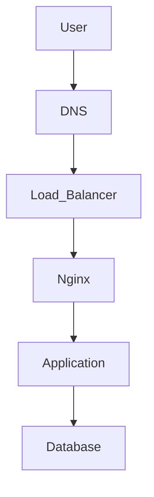
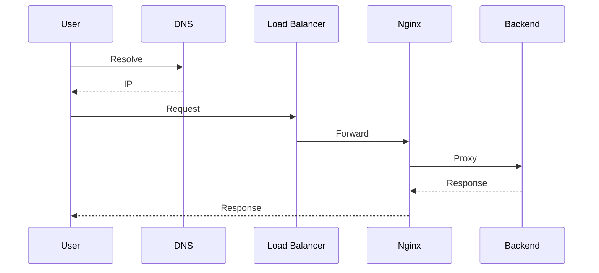
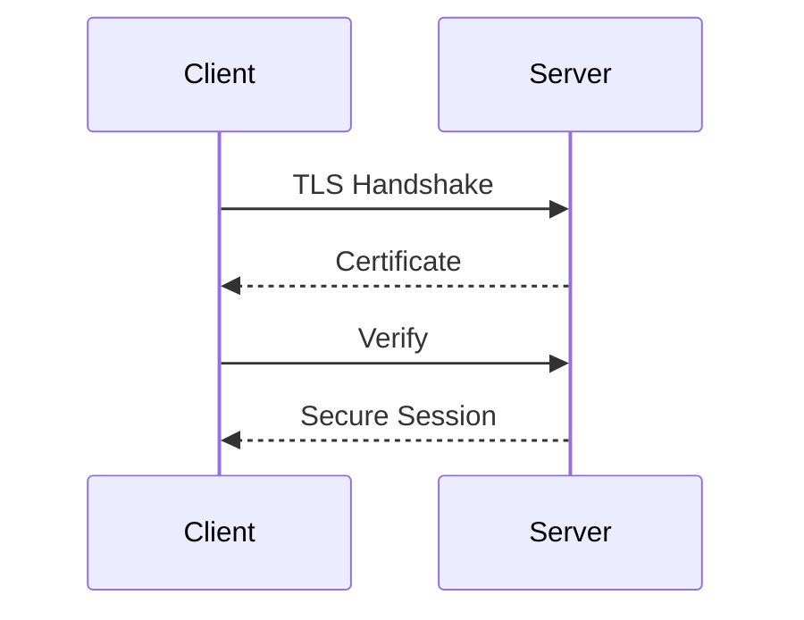
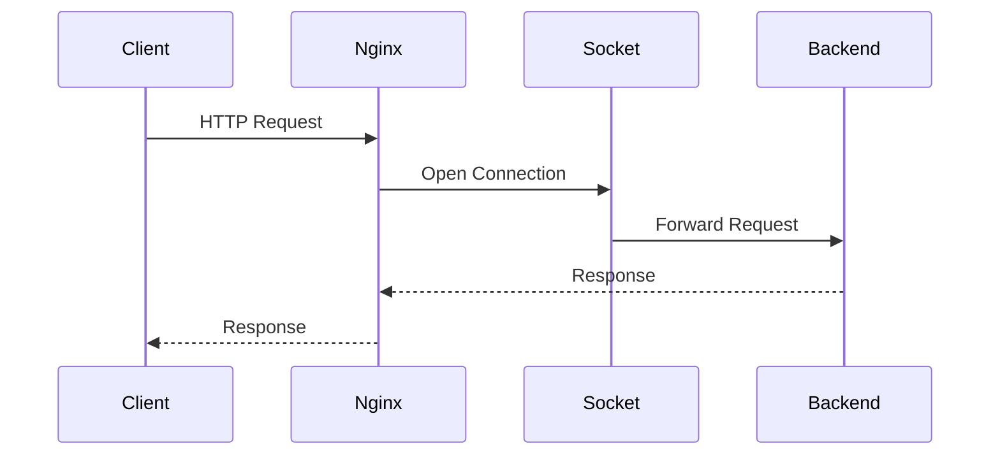

# Nginx, Apache, and Load Balancer Incidents

> Troubleshooting Track — Exercise 10

> **Most users never connect directly to your application.**
>
> They connect to:
>
> ```text
> Nginx
>
> Apache
>
> HAProxy
>
> Envoy
>
> AWS ALB
>
> Cloud Load Balancers
> ```
>
> When these systems fail, applications may appear down even when the application itself is healthy.

---

# Why This Exercise Exists

Many production incidents begin with alerts such as:

```text id="a7q5rn"
502 Bad Gateway

503 Service Unavailable

504 Gateway Timeout

Connection Refused

SSL Errors

High Latency
```

Engineers often blame:

```text id="p4n8yx"
Backend Services

Databases

Applications
```

However, the real issue may exist in:

```text id="r8m2tc"
Reverse Proxies

Web Servers

TLS Configuration

Load Balancers

Health Checks

Routing Rules

Network Paths
```

Understanding the request path is critical.

---

# The Problem This Exercise Solves

Imagine:

```text id="g5x3pd"
Website Down

Users Getting 502 Errors

Backend API Healthy

Database Healthy
```

Questions:

```text id="y7k9vj"
Is Nginx Running?

Is Apache Running?

Can Proxy Reach Backend?

Is TLS Broken?

Did Health Checks Fail?

Did Load Balancer Remove Targets?

Did DNS Change?
```

This exercise teaches systematic troubleshooting of the web-serving layer.

---

# Mental Model

Think of Nginx, Apache, and Load Balancers as:

```text id="m6f2zr"
Traffic Controllers
```

Applications do not talk directly to users.

Traffic flows through layers:

```text
User

↓

Load Balancer

↓

Nginx / Apache

↓

Application

↓

Database
```

Failure at any layer causes customer-visible outages.

---

# First Principles

A request must successfully traverse:

```text id="c3x8qp"
DNS

Network

Load Balancer

Reverse Proxy

Application

Database
```

before a response is returned.

---

# Architecture Overview



---

# Critical Insight

Many incidents reported as:

```text id="w4j9nb"
Application Down
```

are actually:

```text id="v8m6yd"
Proxy Failure

TLS Failure

Load Balancer Failure

Health Check Failure
```

---

# Troubleshooting Framework

```mermaid
flowchart TD

User Error

--> DNS

--> Load Balancer

--> Nginx/Apache

--> Backend

--> Database

--> Root Cause
```

---

# Universal Rule

Never start with:

```text id="f6q2tz"
Restart Nginx
```

Start with:

```text id="h9v4kr"
Where Does The Request Stop?
```

---

# Request Lifecycle



---

# Stage 1 — Verify Service Availability

Before investigating:

Confirm services are running.

---

# Exercise 1

Check Nginx:

```bash id="d2k8yw"
systemctl status nginx
```

Check Apache:

```bash id="q5m4xr"
systemctl status apache2
```

or:

```bash id="j8p6vt"
systemctl status httpd
```

---

# Questions

Running?

Failed?

Restarting?

---

# Stage 2 — Verify Listening Ports

Applications cannot receive traffic without listening sockets.

---

# Exercise 2

Run:

```bash id="w9n2kp"
ss -tulpn
```

---

# Common Ports

```text id="u7m5xe"
80  → HTTP

443 → HTTPS
```

---

# Questions

Port listening?

Correct process?

Unexpected conflicts?

---

# Stage 3 — Test Local Connectivity

Verify service locally.

---

# Exercise 3

Run:

```bash id="r3k9av"
curl http://localhost
```

or:

```bash id="x6j7tc"
curl https://localhost -k
```

---

# Questions

Response received?

Expected content?

Error code?

---

# Why This Matters

If localhost fails:

```text id="n4f8jw"
Load Balancer Is Not The Problem
```

---

# Stage 4 — Investigate Logs

Logs are often the fastest path to truth.

---

# Nginx

```bash id="t8q4hm"
tail -f /var/log/nginx/error.log
```

---

# Apache

```bash id="g4y6nr"
tail -f /var/log/apache2/error.log
```

---

# Questions

Errors?

Permission issues?

Backend failures?

---

# Common Errors

```text id="s7x2qp"
Connection Refused

Permission Denied

Upstream Timeout

SSL Errors
```

---

# Exercise 4

Collect:

```text id="b3m8tv"
Recent Errors

Frequency

Affected Services
```

---

# Stage 5 — Understanding HTTP Errors

HTTP status codes provide clues.

---

# 400 Series

Usually:

```text id="z9r5xn"
Client Problem
```

Examples:

```text id="m2k8yr"
400

401

403

404
```

---

# 500 Series

Usually:

```text id="p5v3qd"
Server Problem
```

Examples:

```text id="d6w9hj"
500

502

503

504
```

---

# Critical Error Types

---

## 502 Bad Gateway

Meaning:

```text id="k3x7vp"
Proxy Cannot Reach Backend
```

---

## 503 Service Unavailable

Meaning:

```text id="r8m4yt"
Backend Unavailable
```

---

## 504 Gateway Timeout

Meaning:

```text id="n5p8jw"
Backend Too Slow
```

---

# Visualization

```text
User

↓

Nginx

↓

Backend
```

Failure location determines error.

---

# Exercise 5

Investigate:

```text id="w2y6nt"
502 Error
```

Determine:

```text id="h4q8rm"
Backend Running?

Port Open?

Reachable?
```

---

# Stage 6 — Backend Connectivity

Most proxy failures involve backend communication.

---

# Exercise 6

Test backend directly:

```bash id="x9t5vq"
curl http://BACKEND_IP:PORT
```

---

# Questions

Responding?

Slow?

Refused?

---

# Architecture


---

# Stage 7 — Nginx Configuration Investigation

Configuration errors cause many outages.

---

# Validate Configuration

```bash id="p7k4hw"
nginx -t
```

---

# Questions

Syntax valid?

Warnings?

Failed directives?

---

# Common Problems

```text id="c9v3ry"
Missing Semicolon

Invalid Upstream

Wrong SSL Path

Invalid Include
```

---

# Exercise 7

Create Nginx validation checklist.

---

# Stage 8 — Apache Configuration Investigation

Validate:

```bash id="m4x7qb"
apachectl configtest
```

---

# Questions

Modules loaded?

Syntax valid?

Virtual hosts correct?

---

# Stage 9 — TLS and SSL Failures

One of the most common production incidents.

---

# Symptoms

```text id="z8t2pc"
Certificate Errors

Handshake Failures

Browser Warnings
```

---

# Investigation

Inspect:

```bash id="u5k9rn"
openssl s_client -connect host:443
```

---

# Questions

Certificate valid?

Expired?

Correct hostname?

---

# TLS Architecture



---

# Exercise 8

Investigate:

```text id="j6x3vp"
Expired Certificate Incident
```

Document recovery plan.

---

# Stage 10 — Load Balancer Investigation

Load balancers distribute traffic.

---

# Responsibilities

```text id="t3p7hw"
Routing

Health Checks

SSL Termination

Traffic Distribution
```

---

# Architecture

```mermaid
flowchart TD

Users

--> Load Balancer

Load Balancer

--> Server1

Load Balancer

--> Server2

Load Balancer

--> Server3
```

---

# Exercise 9

Investigate:

```text id="f5n8qy"
Only Some Requests Fail
```

Potential causes?

---

# Stage 11 — Health Check Failures

Common production issue.

---

# What Happens?

```text id="d8v2kc"
Backend Healthy

↓

Health Check Misconfigured

↓

Removed From Pool
```

---

# Symptoms

```text id="u7x4pr"
503 Errors

No Healthy Targets
```

---

# Questions

Health endpoint correct?

Expected response?

Timeout configured?

---

# Stage 12 — Connection Exhaustion

Load balancers maintain connections.

---

# Symptoms

```text id="y3m9qx"
Connection Refused

Slow Responses

Timeouts
```

---

# Investigation

Run:

```bash id="v6k8tw"
ss -tan
```

---

# Questions

Connection count?

Backlog?

Resource exhaustion?

---

# Stage 13 — Nginx Worker Investigation

Nginx uses worker processes.

---

# Check

```bash id="e4p7ns"
ps aux | grep nginx
```

---

# Questions

Workers healthy?

Expected count?

CPU usage?

---

# Stage 14 — Load Testing

Some incidents appear only under load.

---

# Exercise 10

Run:

```bash id="r5j8xt"
ab -n 1000 -c 100 http://host/
```

or:

```bash id="n2q6pv"
wrk
```

---

# Questions

Latency?

Errors?

Resource bottlenecks?

---

# Stage 15 — Reverse Proxy Timeouts

Backend may simply be too slow.

---

# Symptoms

```text id="h8m4ky"
504 Errors
```

---

# Investigation

Review:

```text id="b7v3rx"
Proxy Timeout

Backend Latency

Database Latency
```

---

# Visualization

```text id="k5p8qn"
Client

↓

Nginx

↓

Slow Backend

↓

Timeout
```

---

# Stage 16 — Kubernetes Ingress Failures

Modern systems frequently use:

```text id="m9x5tw"
Nginx Ingress

Traefik

Envoy
```

---

# Investigation

```bash id="f3k7pv"
kubectl get ingress

kubectl describe ingress
```

---

# Questions

Routing correct?

Backend healthy?

TLS configured?

---

# Stage 17 — Cloud Load Balancer Incidents

Examples:

```text id="t7v2pw"
AWS ALB

AWS NLB

GCP Load Balancer

Azure Load Balancer
```

---

# Common Failures

```text id="u4m8xr"
Target Unhealthy

Security Group Issues

DNS Issues

TLS Problems
```

---

# Production Incident #1

## Alert

```text id="n5q3vk"
502 Bad Gateway
```

Investigate:

```bash id="w8m4tn"
Backend

Nginx Logs

Connectivity
```

---

# Production Incident #2

## Alert

```text id="k7x2pr"
503 Service Unavailable
```

Investigate:

```text id="v4p8my"
Health Checks

Backend Availability
```

---

# Production Incident #3

## Alert

```text id="d9m5qw"
SSL Certificate Error
```

Investigate:

```bash id="h2v8rn"
openssl

Certificate Expiry
```

---

# Production Incident #4

## Alert

```text id="q6t3px"
Load Balancer Marks All Targets Unhealthy
```

Investigate:

```text id="j5m9wv"
Health Endpoint

Firewall

Network
```

---

# Production Incident #5

## Alert

```text id="f7x4pr"
Ingress Not Routing Traffic
```

Investigate:

```bash id="m3k8tv"
kubectl describe ingress
```

---

# Linux Internals Deep Dive

Request path:



Failures occur at:

```text id="v8q5tw"
Network

Socket

Backend

Configuration

TLS
```

---

# Docker Connection

Containerized web servers require investigation of:

```text id="c4m7qy"
Ports

Networks

Volumes

Resource Limits
```

---

# Kubernetes Connection

Ingress controllers are essentially:

```text id="y2v6rp"
Reverse Proxies
```

running inside Kubernetes.

---

# Observability Checklist

Collect:

```text id="h9q3wt"
Request Rate

Latency

Error Rate

TLS Metrics

Backend Health

Load Balancer Status
```

before making changes.

---

# Common Mistakes

## Mistake 1

Blaming the application first.

---

## Mistake 2

Ignoring backend connectivity.

---

## Mistake 3

Ignoring load balancer health checks.

---

## Mistake 4

Skipping configuration validation.

---

## Mistake 5

Ignoring TLS.

---

## Mistake 6

Restarting services without evidence.

---

# Engineering Mindset

Beginners ask:

```text id="r5m8px"
Why Is The Website Down?
```

Engineers ask:

```text id="w7k4tv"
Where Does The Request Stop?

DNS?

Load Balancer?

Nginx?

Backend?

Database?
```

---

# Interview Questions

1. What is a reverse proxy?
2. What causes a 502 Bad Gateway?
3. What causes a 504 Gateway Timeout?
4. How do health checks work?
5. How do you troubleshoot Nginx failures?
6. How do you validate Nginx configuration?
7. What causes TLS handshake failures?
8. How do load balancers distribute traffic?
9. How would you troubleshoot an ingress controller?
10. Why can healthy applications still return 503 errors?

---

# Nginx, Apache, and Load Balancer Incident Cheat Sheet

```bash id="x6m4pw"
systemctl status nginx

systemctl status apache2

nginx -t

apachectl configtest

curl localhost

ss -tulpn

tail -f /var/log/nginx/error.log

tail -f /var/log/apache2/error.log

openssl s_client -connect host:443

kubectl get ingress

kubectl describe ingress
```

---

# Capstone Challenge

A production SaaS platform experiences:

```text id="m8q2tv"
502 Errors

503 Errors

SSL Warnings

Slow Responses

Customer Complaints
```

Perform a complete investigation.

Document:

```text id="d3v7rx"
Request Path

DNS

Load Balancer

Proxy Configuration

Backend Health

TLS Validation

Logs

Evidence

Root Cause

Recovery Plan

Prevention Plan
```

---

# Completion Criteria

You successfully complete this exercise when you can:

✓ Troubleshoot Nginx and Apache failures

✓ Diagnose 502, 503, and 504 errors

✓ Investigate backend connectivity issues

✓ Analyze TLS failures

✓ Troubleshoot load balancer problems

✓ Investigate health check failures

✓ Debug Kubernetes ingress issues

✓ Perform production-grade web infrastructure investigations

✓ Trace requests across multiple layers

✓ Think like a Site Reliability Engineer

Congratulations.

You now understand one of the most important truths in web infrastructure:

**Users do not care which layer failed. They only know the request never reached its destination. Your job is to discover where the journey stopped.**
