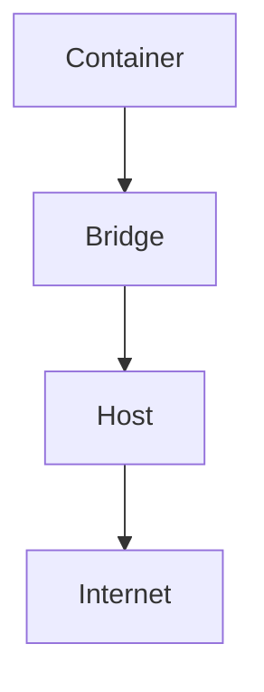
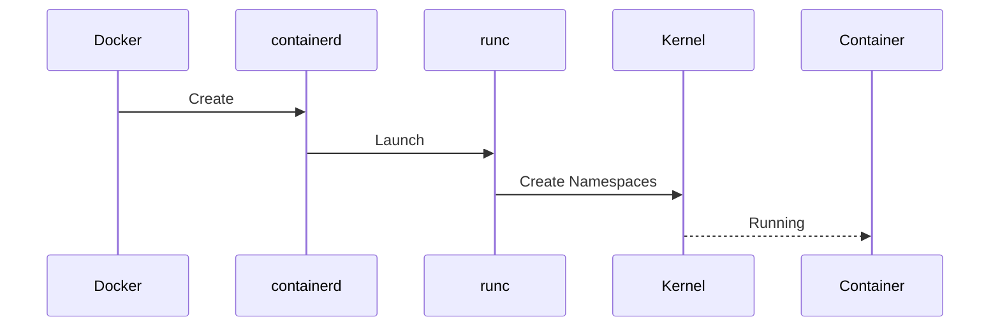
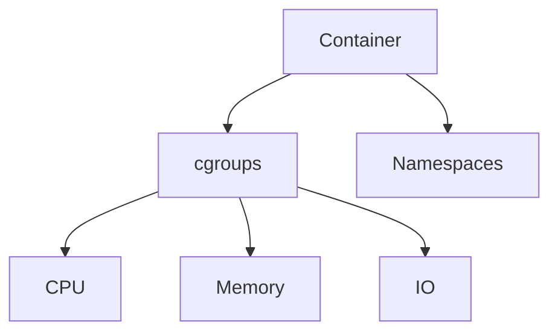

# Docker Production Failures

> Troubleshooting Track — Exercise 11

> **Docker changed how software is deployed, but it did not eliminate Linux problems.**
>
> In reality:
>
> ```text
> Container Problems
>
> =
>
> Linux Problems
> +
> Application Problems
> +
> Runtime Problems
> ```
>
> Most production Docker incidents are actually failures in:
>
> ```text
> Namespaces
>
> cgroups
>
> Storage
>
> Networking
>
> Resource Limits
>
> Image Design
>
> Linux Kernel Behavior
> ```
>
> Understanding Docker troubleshooting requires understanding Linux internals.

---

# Why This Exercise Exists

Many engineers believe:

```text
Container Failed

↓

Restart Container
```

Unfortunately, production incidents are rarely that simple.

Real-world Docker failures include:

```text
Container Crash Loops

OOM Kills

Image Pull Failures

Storage Exhaustion

OverlayFS Problems

Networking Failures

DNS Failures

Resource Throttling

Container Runtime Failures

Node-Level Resource Exhaustion
```

Most engineers know Docker commands.

Few understand:

```text
Why Containers Actually Fail
```

---

# The Problem This Exercise Solves

Imagine receiving an alert:

```text
Production API Down

Container Restarting

502 Errors

Pods Failing

Customers Reporting Outages
```

Questions:

```text
Did Container Crash?

Did Docker Fail?

Did Storage Fill Up?

Did Network Break?

Did Container Hit Limits?

Did DNS Fail?

Did The Host Fail?
```

This exercise teaches systematic Docker troubleshooting.

---

# Mental Model

Think of Docker as:

```text
A Process Isolation Platform
```

Not:

```text
A Lightweight VM
```

Containers are:

```text
Linux Processes

+

Namespaces

+

cgroups

+

Filesystem Layers
```

---

# First Principles

Every container depends on:

```text
Linux Kernel

Docker Engine

containerd

Storage

Networking

Images

Resources
```

Failure in any layer can bring down workloads.

---

# Docker Architecture

```mermaid
flowchart TD

Application

--> Container

Container

--> Docker Engine

Docker Engine

--> containerd

containerd

--> Linux Kernel

Linux Kernel

--> Hardware
```

---

# Critical Insight

Many Docker incidents reported as:

```text
Container Failure
```

are actually:

```text
Host Failure

Storage Failure

Memory Failure

Network Failure
```

---

# Docker Investigation Framework

```mermaid
flowchart TD

Container Failure

--> Container State

--> Logs

--> Resources

--> Networking

--> Storage

--> Runtime

--> Root Cause
```

---

# Universal Rule

Never start with:

```bash
docker restart CONTAINER
```

Start with:

```text
Why Did It Fail?
```

---

# Stage 1 — Verify Container State

First determine current status.

---

# Exercise 1

Run:

```bash
docker ps -a
```

---

# Questions

```text
Running?

Exited?

Restarting?

Paused?

Dead?
```

---

# Common States

```text
Up

Exited

Restarting

Created

Dead
```

---

# Visualization

```text
Created

↓

Running

↓

Exited

↓

Restarting
```

---

# Stage 2 — Investigate Container Logs

Logs often reveal immediate causes.

---

# Exercise 2

Run:

```bash
docker logs CONTAINER
```

Follow logs:

```bash
docker logs -f CONTAINER
```

---

# Questions

```text
Crash Message?

Startup Failure?

Dependency Failure?

Permission Issue?
```

---

# Why Logs Matter

Logs often expose:

```text
Application Crashes

Configuration Errors

Database Failures

DNS Problems
```

---

# Stage 3 — Inspect Container Metadata

Containers carry valuable metadata.

---

# Exercise 3

Run:

```bash
docker inspect CONTAINER
```

---

# Questions

```text
Image?

Network?

Volumes?

Restart Policy?

Environment Variables?
```

---

# Investigation Workflow

```mermaid
flowchart TD

Container

--> Metadata

--> Resources

--> Runtime

--> Root Cause
```

---

# Stage 4 — Container Crash Loops

One of the most common incidents.

---

# Symptoms

```text
Container Starts

↓

Crashes

↓

Restarts

↓

Crashes Again
```

---

# Exercise 4

Inspect:

```bash
docker ps -a
```

Look for:

```text
Restarting
```

state.

---

# Questions

```text
Application Crash?

Configuration Error?

Dependency Failure?
```

---

# Common Causes

```text
Missing Secrets

Database Unavailable

Invalid Configuration

Application Bugs
```

---

# Stage 5 — OOM Killed Containers

A very common production failure.

---

# Symptoms

```text
Container Suddenly Exits

Restart Loop

No Obvious Error
```

---

# Investigation

Run:

```bash
docker inspect CONTAINER
```

Look for:

```text
OOMKilled: true
```

---

# Host Investigation

```bash
dmesg | grep -i oom
```

---

# Visualization

```text
Memory Exhausted

↓

Kernel OOM Killer

↓

Container Terminated
```

---

# Exercise 5

Determine:

```text
Memory Limit

Memory Usage

OOM Events
```

---

# Stage 6 — CPU Throttling

Containers may appear slow while remaining healthy.

---

# Symptoms

```text
High Latency

Slow Requests

No Crashes
```

---

# Investigation

Run:

```bash
docker stats
```

---

# Questions

```text
CPU Usage?

CPU Limit?

Throttling?
```

---

# Critical Insight

A container can be:

```text
Healthy

Yet Starving
```

for CPU.

---

# Stage 7 — Storage Failures

Container storage often fills unexpectedly.

---

# Symptoms

```text
Write Errors

Application Failures

Container Crashes
```

---

# Investigation

Run:

```bash
df -h
```

and:

```bash
docker system df
```

---

# Questions

```text
Images Consuming Space?

Volumes Growing?

Logs Growing?
```

---

# Exercise 6

Identify:

```text
Largest Docker Storage Consumers
```

---

# Stage 8 — OverlayFS Problems

Docker images use layered filesystems.

---

# Architecture

```mermaid
flowchart TD

Base Image

--> Layer 1

--> Layer 2

--> Writable Layer
```

---

# Common Problems

```text
Corrupted Layers

Disk Full

Slow Storage
```

---

# Investigation

Check:

```bash
docker info
```

---

# Questions

```text
Storage Driver?

Available Space?

Errors?
```

---

# Stage 9 — Docker Networking Failures

Many incidents involve networking.

---

# Symptoms

```text
Container Running

Cannot Reach Services
```

---

# Investigation

Run:

```bash
docker network ls
```

Inspect:

```bash
docker network inspect NETWORK
```

---

# Questions

```text
Connected?

Correct Network?

DNS Working?
```

---

# Network Architecture



---

# Exercise 7

Trace packet path from container to destination.

---

# Stage 10 — DNS Failures

One of Docker's most common issues.

---

# Symptoms

```text
Connection Timeout

Host Not Found

Service Discovery Failure
```

---

# Investigation

Inside container:

```bash
cat /etc/resolv.conf
```

---

# Test:

```bash
nslookup google.com
```

---

# Questions

```text
Resolver Working?

Expected DNS?

Reachable?
```

---

# Stage 11 — Port Mapping Failures

Containers may run but remain inaccessible.

---

# Investigation

Run:

```bash
docker ps
```

---

# Questions

```text
Correct Port Mapping?

Host Port Available?
```

---

# Example

```text
Container

80

↓

Host

8080
```

---

# Exercise 8

Verify exposed ports.

---

# Stage 12 — Image Pull Failures

Deployment may fail before startup.

---

# Symptoms

```text
ImagePullBackOff

Cannot Pull Image

Authentication Failure
```

---

# Investigation

Run:

```bash
docker pull IMAGE
```

---

# Questions

```text
Registry Reachable?

Credentials Valid?

Image Exists?
```

---

# Stage 13 — Runtime Failures

Docker depends on:

```text
containerd

runc
```

---

# Investigation

Check:

```bash
systemctl status docker

systemctl status containerd
```

---

# Questions

```text
Runtime Healthy?

Restarting?

Failed?
```

---

# Stage 14 — Volume Problems

Containers often depend on persistent storage.

---

# Symptoms

```text
Missing Data

Startup Failure

Permission Errors
```

---

# Investigation

Run:

```bash
docker volume ls
```

Inspect:

```bash
docker volume inspect VOLUME
```

---

# Questions

```text
Mounted?

Accessible?

Expected Data?
```

---

# Stage 15 — Permission Problems

Containers often fail because:

```text
UID

GID

File Ownership

SELinux
```

conflicts exist.

---

# Investigation

Run:

```bash
ls -la
```

and:

```bash
docker exec -it CONTAINER sh
```

---

# Exercise 9

Determine whether failure is permission-related.

---

# Stage 16 — Host Resource Exhaustion

Containers share host resources.

---

# Symptoms

```text
Multiple Containers Failing

Node Unstable

OOM Events
```

---

# Investigation

Run:

```bash
top

free -h

df -h
```

---

# Questions

```text
Host Healthy?

Resources Available?
```

---

# Stage 17 — Security Restrictions

Containers may fail due to:

```text
AppArmor

SELinux

Capabilities
```

---

# Investigation

Check:

```bash
docker inspect CONTAINER
```

Review:

```text
Capabilities

Security Context
```

---

# Exercise 10

Investigate a security-related startup failure.

---

# Docker Internals Deep Dive

Container startup path:



Failures anywhere stop startup.

---

# Production Incident #1

## Alert

```text
Container Restarting Every Minute
```

Investigate:

```bash
docker logs

docker inspect
```

---

# Production Incident #2

## Alert

```text
Container Healthy

Users Report Slowness
```

Investigate:

```bash
docker stats
```

Determine:

```text
CPU

Memory

Network
```

---

# Production Incident #3

## Alert

```text
Application Cannot Reach Database
```

Investigate:

```text
Network

DNS

Service Discovery
```

---

# Production Incident #4

## Alert

```text
Docker Host Disk Full
```

Investigate:

```bash
docker system df
```

---

# Production Incident #5

## Alert

```text
Docker Engine Failed
```

Investigate:

```bash
systemctl status docker

journalctl -u docker
```

---

# Linux Internals Deep Dive

Containers are Linux processes.

Resource control:



Most Docker incidents eventually lead back to Linux internals.

---

# Kubernetes Connection

Most Kubernetes troubleshooting is:

```text
Container Troubleshooting
```

plus:

```text
Scheduling

Networking

Control Plane
```

Understanding Docker significantly improves Kubernetes debugging.

---

# Observability Checklist

Collect:

```text
Container State

Logs

Resource Metrics

Host Metrics

Network Metrics

Storage Metrics
```

before taking action.

---

# Common Mistakes

## Mistake 1

Restarting containers immediately.

---

## Mistake 2

Ignoring logs.

---

## Mistake 3

Ignoring host health.

---

## Mistake 4

Treating containers like VMs.

---

## Mistake 5

Ignoring DNS.

---

## Mistake 6

Ignoring cgroup limits.

---

# Engineering Mindset

Beginners ask:

```text
Why Did The Container Stop?
```

Engineers ask:

```text
Which Layer Failed?

Application?

Container?

Runtime?

Kernel?

Host?
```

---

# Interview Questions

1. What causes Docker containers to restart repeatedly?
2. What is OOMKilled?
3. How does Docker networking work?
4. What is OverlayFS?
5. How do Docker volumes work?
6. What is the role of containerd?
7. What is runc?
8. How do cgroups affect containers?
9. How would you troubleshoot Docker DNS failures?
10. Why can a healthy container still perform poorly?

---

# Docker Incident Cheat Sheet

```bash
docker ps -a

docker logs CONTAINER

docker inspect CONTAINER

docker stats

docker network ls

docker network inspect NETWORK

docker volume ls

docker volume inspect VOLUME

docker system df

docker info

docker exec -it CONTAINER sh

systemctl status docker

systemctl status containerd

journalctl -u docker

dmesg | grep -i oom
```

---

# Capstone Challenge

A production Docker host reports:

```text
Containers Restarting

502 Errors

Disk Usage Growing

Database Connectivity Failures

Customer Impact
```

Perform a complete Docker incident investigation.

Document:

```text
Container State

Logs

Runtime Health

Networking

DNS

Storage

Resources

Evidence

Root Cause

Recovery Plan

Prevention Plan
```

---

# Completion Criteria

You successfully complete this exercise when you can:

✓ Investigate container crashes

✓ Diagnose restart loops

✓ Analyze OOMKilled containers

✓ Troubleshoot Docker networking

✓ Investigate DNS failures

✓ Analyze storage and OverlayFS issues

✓ Troubleshoot Docker runtime failures

✓ Investigate host-level resource exhaustion

✓ Perform production-grade container investigations

✓ Think like a container platform engineer

Congratulations.

You now understand one of the most important truths in cloud-native infrastructure:

**Containers do not remove complexity. They move complexity into Linux, networking, storage, and resource management.**
